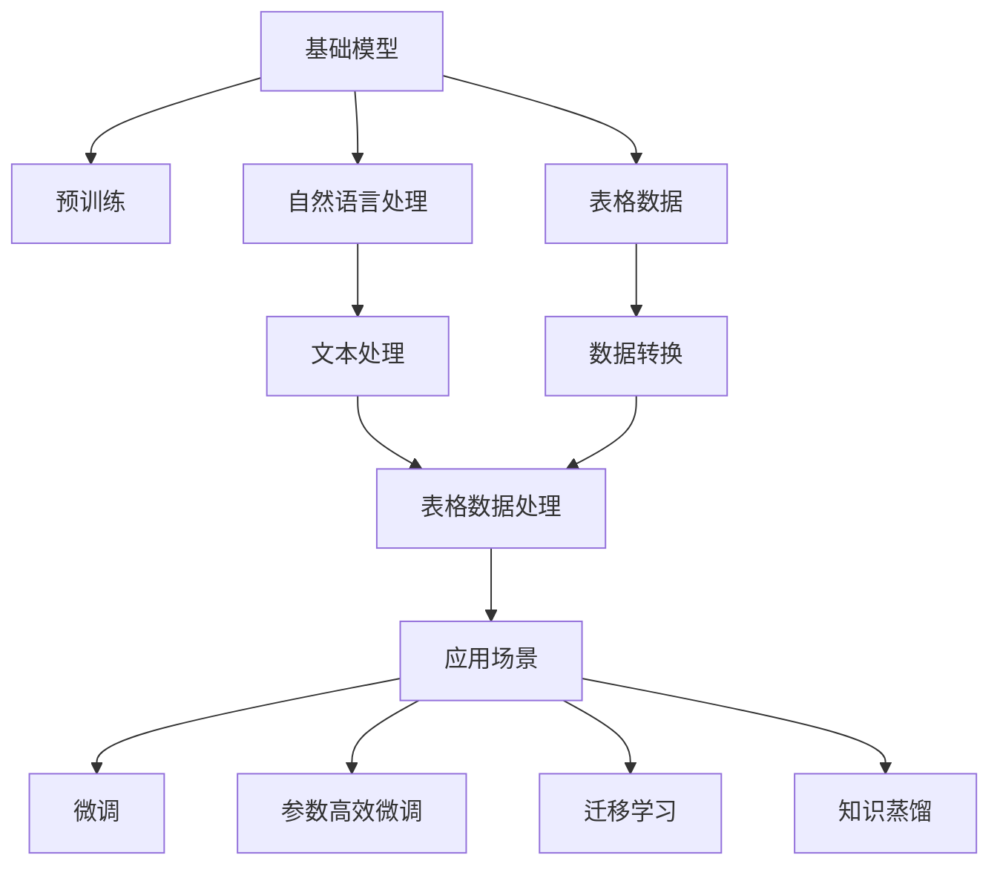

                 

# 基础模型的表格数据应用

> 关键词：基础模型, 表格数据, 应用场景, 数学建模, 算法优化

## 1. 背景介绍

### 1.1 问题由来
在当今数据驱动的时代，表格数据（Table Data）已经成为各行各业信息存储和处理的主要形式。从金融、医疗、教育到电商、物流、交通，各行各业的信息最终都以表格的形式呈现出来。然而，由于数据规模庞大、结构复杂、更新频繁等特点，直接处理表格数据面临诸多挑战，特别是对于中小型企业而言，高效利用这些表格数据变得尤为重要。

基础模型（Foundation Model）是一类以大规模预训练语言模型为基础，通过微调或迁移学习等方式，对特定领域数据进行优化的模型。近年来，基于基础模型的表格数据处理技术逐渐兴起，为表格数据的自动化分析、智能决策提供了新的可能。

### 1.2 问题核心关键点
本文聚焦于基础模型在表格数据处理中的应用，旨在通过深入剖析基础模型与表格数据之间的联系，探讨如何利用基础模型高效处理表格数据，提高数据驱动决策的效率和准确性。

## 2. 核心概念与联系

### 2.1 核心概念概述

为更好地理解基础模型在表格数据处理中的应用，本节将介绍几个密切相关的核心概念：

- **基础模型（Foundation Model）**：以大规模预训练语言模型为基础，通过微调或迁移学习等方式，对特定领域数据进行优化的模型。常见的基础模型包括BERT、GPT、XLNet等。

- **表格数据（Table Data）**：结构化数据的一种形式，通常以二维表格形式存储，包括行、列和单元格等基本单位。表格数据广泛应用于数据库、数据仓库和数据挖掘等场景。

- **自然语言处理（NLP）**：使用计算机技术处理、分析和生成人类语言的技术。基础模型在处理表格数据时，通常需要先将非结构化数据转换为自然语言，然后进行自然语言处理。

- **迁移学习（Transfer Learning）**：通过将在大规模数据集上预训练的模型知识迁移到小规模数据集上，提高模型在小数据集上的性能。基础模型在处理特定领域的表格数据时，通常需要基于迁移学习进行微调。

- **微调（Fine-tuning）**：在预训练模型的基础上，使用特定领域的数据进行有监督学习，优化模型在该领域上的性能。基础模型在处理表格数据时，通常需要通过微调来适配特定任务。

- **参数高效微调（Parameter-Efficient Fine-tuning, PEFT）**：在微调过程中，只更新少量模型参数，以提高微调效率，避免过拟合。基础模型在处理大规模表格数据时，通常需要参数高效微调来减少计算资源消耗。

- **知识蒸馏（Knowledge Distillation）**：通过将复杂模型的知识迁移到简单模型，提高简单模型的性能。基础模型在处理复杂表格数据时，通常需要结合知识蒸馏技术进行优化。

这些核心概念之间的逻辑关系可以通过以下Mermaid流程图来展示：



这个流程图展示了大模型在表格数据处理中的应用流程：

1. 基础模型在大规模无标签数据上进行预训练，学习通用的语言表示。
2. 将非结构化数据转换为自然语言，进行自然语言处理。
3. 通过数据转换、文本处理等技术将非结构化数据转换为表格数据。
4. 在表格数据上，进行有监督的微调，优化模型在特定任务上的性能。
5. 使用参数高效微调技术，提高微调效率，减少计算资源消耗。
6. 通过迁移学习，将基础模型应用于特定领域，提升模型在特定任务上的性能。
7. 结合知识蒸馏技术，将复杂模型的知识迁移到简单模型，提高模型性能。

通过这些流程图，我们可以更清晰地理解基础模型在表格数据处理过程中的各个环节和关键技术。

### 2.2 概念间的关系

这些核心概念之间存在着紧密的联系，形成了基础模型在表格数据处理中的应用框架。

- 基础模型通过预训练获得语言表示能力，通过微调适配特定任务。
- 自然语言处理将非结构化数据转换为结构化数据，便于表格数据处理。
- 迁移学习将预训练知识迁移到特定领域，提高模型在特定任务上的性能。
- 参数高效微调技术减少计算资源消耗，提高模型效率。
- 知识蒸馏将复杂模型的知识迁移到简单模型，提高模型性能。

## 3. 核心算法原理 & 具体操作步骤
### 3.1 算法原理概述

基础模型在表格数据处理中的核心算法原理是通过自然语言处理技术将非结构化数据转换为自然语言，然后进行自然语言处理，最终适配特定表格数据任务。

具体而言，基础模型在处理表格数据时，通常需要经过以下几个步骤：

1. 数据转换：将表格数据转换为自然语言格式，通常涉及实体识别、关系抽取等自然语言处理技术。
2. 语言模型训练：在转换后的自然语言数据上，使用基础模型进行有监督训练，优化模型在特定表格数据任务上的性能。
3. 参数优化：根据具体任务需求，使用参数高效微调或迁移学习等技术，优化模型参数，提高模型效率。

### 3.2 算法步骤详解

下面以基础模型在金融领域表格数据处理为例，详细讲解基础模型在表格数据处理中的应用步骤。

#### 3.2.1 数据预处理

- **数据收集**：收集金融领域的表格数据，包括客户信息、交易记录、财务报表等。
- **数据清洗**：清洗数据，去除重复、异常值和无用字段，确保数据质量和完整性。
- **数据标注**：为表格数据进行标注，例如标注交易记录的时间、金额、交易类型等信息，确保数据可被模型理解。
- **数据划分**：将数据划分为训练集、验证集和测试集，通常按照70:15:15的比例划分。

#### 3.2.2 数据转换

- **实体识别**：使用实体识别技术，从交易记录中提取重要的实体信息，例如交易金额、交易时间、交易类型等。
- **关系抽取**：使用关系抽取技术，从交易记录中提取实体之间的关系，例如交易方、交易类型、交易时间等。
- **文本生成**：使用文本生成技术，将实体和关系信息转换为自然语言描述，例如“某公司在某时间进行某类型的交易，金额为某数值”。

#### 3.2.3 语言模型训练

- **模型加载**：加载预训练的基础模型，例如BERT、GPT等，作为任务的初始化模型。
- **任务适配**：在基础模型的顶层添加适当的输出层和损失函数，例如分类任务使用线性分类器，回归任务使用均方误差损失函数。
- **模型训练**：使用训练集数据，在基础模型的基础上进行有监督训练，优化模型在特定任务上的性能。
- **验证集评估**：在验证集上评估模型的性能，根据验证集上的损失函数调整模型参数，避免过拟合。
- **测试集评估**：在测试集上评估模型的性能，最终输出模型在特定表格数据任务上的性能指标，例如准确率、召回率等。

#### 3.2.4 参数优化

- **参数高效微调**：使用参数高效微调技术，例如Adapter、LoRA等，只更新少量模型参数，减少计算资源消耗。
- **超参数调优**：根据具体任务需求，调整模型的超参数，例如学习率、批大小、迭代轮数等，以获得最佳的模型性能。
- **模型保存**：将训练好的模型保存，以便后续部署和应用。

### 3.3 算法优缺点

基础模型在表格数据处理中的应用，具有以下优点：

- **高效性**：基础模型通过预训练获得通用的语言表示能力，能够快速适应不同领域的表格数据处理任务。
- **灵活性**：基础模型可以通过迁移学习和微调等技术，适配特定领域的表格数据处理任务，灵活性较高。
- **可扩展性**：基础模型可以在大规模数据集上进行预训练，并通过微调应用于特定领域的表格数据处理任务，具有很好的可扩展性。

同时，基础模型在表格数据处理中也存在以下缺点：

- **计算资源消耗大**：基础模型的参数量通常较大，训练和推理需要消耗大量的计算资源，特别是在处理大规模表格数据时，计算资源消耗较大。
- **泛化能力有限**：基础模型在处理特定领域的表格数据时，泛化能力可能受到限制，特别是对于大规模、高复杂度的表格数据处理任务，基础模型的泛化能力可能不足。
- **模型解释性差**：基础模型作为“黑盒”模型，难以解释其内部的决策过程，模型解释性较差。

### 3.4 算法应用领域

基础模型在表格数据处理中的应用领域非常广泛，涵盖了金融、医疗、电商、物流、交通等多个行业。以下是几个典型的应用场景：

- **金融风险管理**：使用基础模型对客户的交易记录进行分析和预测，识别潜在的风险和欺诈行为。
- **医疗数据分析**：使用基础模型对患者的病历信息进行分析，辅助医生的诊断和治疗。
- **电商推荐系统**：使用基础模型对用户的购物行为进行分析，推荐用户可能感兴趣的商品。
- **物流配送优化**：使用基础模型对物流配送数据进行分析，优化配送路线和资源配置。
- **交通流量分析**：使用基础模型对交通数据进行分析，优化交通流量的控制和管理。

## 4. 数学模型和公式 & 详细讲解 & 举例说明

### 4.1 数学模型构建

基础模型在表格数据处理中的数学模型构建，通常涉及自然语言处理中的语言模型。

假设基础模型为 $M_{\theta}$，其中 $\theta$ 为预训练得到的模型参数。假设表格数据 $D$ 的特征向量为 $X$，对应的自然语言描述为 $S$。表格数据的标注数据为 $Y$，其中 $Y$ 为自然语言描述 $S$ 对应的标签。

定义基础模型 $M_{\theta}$ 在特征向量 $X$ 和自然语言描述 $S$ 上的条件概率为 $P(Y|S; \theta)$，则基础模型在表格数据 $D$ 上的条件概率为：

$$
P(Y|D; \theta) = \prod_{i=1}^N P(Y_i|S_i; \theta)
$$

其中 $N$ 为数据集 $D$ 的大小。

### 4.2 公式推导过程

以金融领域的信用风险评估为例，假设基础模型为BERT，表格数据 $D$ 的特征向量为 $X$，对应的自然语言描述为 $S$。表格数据的标注数据为 $Y$，其中 $Y$ 为自然语言描述 $S$ 对应的标签，例如“高风险”、“低风险”等。

在BERT模型中，假设 $X$ 表示为词向量 $x$，$S$ 表示为词序列 $s$，则基础模型在表格数据 $D$ 上的条件概率为：

$$
P(Y|D; \theta) = \prod_{i=1}^N P(Y_i|S_i; \theta)
$$

其中 $N$ 为数据集 $D$ 的大小。

根据BERT模型的结构，可以将 $P(Y|S; \theta)$ 表示为：

$$
P(Y|S; \theta) = \frac{\exp(\text{logits}(Y, S; \theta))}{\sum_{y' \in Y} \exp(\text{logits}(y', S; \theta))}
$$

其中 $\text{logits}(Y, S; \theta)$ 表示BERT模型在输入 $Y$ 和 $S$ 上的输出，$logits$ 函数的输出为自然对数线性层输出的结果。

### 4.3 案例分析与讲解

以电商推荐系统为例，假设电商网站有大量用户数据和商品数据，需要通过基础模型进行推荐。

- **数据预处理**：收集用户历史行为数据和商品信息，将用户行为数据转换为自然语言描述，例如“用户A购买了商品B”。
- **基础模型训练**：使用电商网站的用户行为数据和商品信息，训练基础模型，优化模型在推荐任务上的性能。
- **推荐生成**：使用训练好的基础模型，输入用户行为数据和商品信息，生成推荐的商品列表。
- **推荐优化**：根据推荐结果的反馈，优化基础模型，提高推荐效果。

## 5. 项目实践：代码实例和详细解释说明

### 5.1 开发环境搭建

在进行基础模型在表格数据处理实践前，我们需要准备好开发环境。以下是使用Python进行PyTorch开发的环境配置流程：

1. 安装Anaconda：从官网下载并安装Anaconda，用于创建独立的Python环境。

2. 创建并激活虚拟环境：
```bash
conda create -n pytorch-env python=3.8 
conda activate pytorch-env
```

3. 安装PyTorch：根据CUDA版本，从官网获取对应的安装命令。例如：
```bash
conda install pytorch torchvision torchaudio cudatoolkit=11.1 -c pytorch -c conda-forge
```

4. 安装Transformers库：
```bash
pip install transformers
```

5. 安装各类工具包：
```bash
pip install numpy pandas scikit-learn matplotlib tqdm jupyter notebook ipython
```

完成上述步骤后，即可在`pytorch-env`环境中开始基础模型在表格数据处理实践。

### 5.2 源代码详细实现

下面我们以金融领域信用风险评估为例，给出使用Transformers库对BERT模型进行微调的PyTorch代码实现。

首先，定义信用风险评估的数据处理函数：

```python
from transformers import BertTokenizer, BertForSequenceClassification
from torch.utils.data import Dataset, DataLoader
import torch

class CreditRiskDataset(Dataset):
    def __init__(self, texts, labels, tokenizer, max_len=128):
        self.texts = texts
        self.labels = labels
        self.tokenizer = tokenizer
        self.max_len = max_len
        
    def __len__(self):
        return len(self.texts)
    
    def __getitem__(self, item):
        text = self.texts[item]
        label = self.labels[item]
        
        encoding = self.tokenizer(text, return_tensors='pt', max_length=self.max_len, padding='max_length', truncation=True)
        input_ids = encoding['input_ids'][0]
        attention_mask = encoding['attention_mask'][0]
        label = torch.tensor(label, dtype=torch.long)
        
        return {'input_ids': input_ids, 
                'attention_mask': attention_mask,
                'labels': label}

# 标签与id的映射
label2id = {'low risk': 0, 'high risk': 1}
id2label = {v: k for k, v in label2id.items()}

# 创建dataset
tokenizer = BertTokenizer.from_pretrained('bert-base-cased')

train_dataset = CreditRiskDataset(train_texts, train_labels, tokenizer)
dev_dataset = CreditRiskDataset(dev_texts, dev_labels, tokenizer)
test_dataset = CreditRiskDataset(test_texts, test_labels, tokenizer)
```

然后，定义模型和优化器：

```python
from transformers import AdamW

model = BertForSequenceClassification.from_pretrained('bert-base-cased', num_labels=len(label2id))

optimizer = AdamW(model.parameters(), lr=2e-5)
```

接着，定义训练和评估函数：

```python
from tqdm import tqdm

device = torch.device('cuda') if torch.cuda.is_available() else torch.device('cpu')
model.to(device)

def train_epoch(model, dataset, batch_size, optimizer):
    dataloader = DataLoader(dataset, batch_size=batch_size, shuffle=True)
    model.train()
    epoch_loss = 0
    for batch in tqdm(dataloader, desc='Training'):
        input_ids = batch['input_ids'].to(device)
        attention_mask = batch['attention_mask'].to(device)
        labels = batch['labels'].to(device)
        model.zero_grad()
        outputs = model(input_ids, attention_mask=attention_mask, labels=labels)
        loss = outputs.loss
        epoch_loss += loss.item()
        loss.backward()
        optimizer.step()
    return epoch_loss / len(dataloader)

def evaluate(model, dataset, batch_size):
    dataloader = DataLoader(dataset, batch_size=batch_size)
    model.eval()
    preds, labels = [], []
    with torch.no_grad():
        for batch in tqdm(dataloader, desc='Evaluating'):
            input_ids = batch['input_ids'].to(device)
            attention_mask = batch['attention_mask'].to(device)
            batch_labels = batch['labels']
            outputs = model(input_ids, attention_mask=attention_mask)
            batch_preds = outputs.logits.argmax(dim=2).to('cpu').tolist()
            batch_labels = batch_labels.to('cpu').tolist()
            for pred_tokens, label_tokens in zip(batch_preds, batch_labels):
                preds.append(pred_tokens[:len(label_tokens)])
                labels.append(label_tokens)
                
    print(classification_report(labels, preds))
```

最后，启动训练流程并在测试集上评估：

```python
epochs = 5
batch_size = 16

for epoch in range(epochs):
    loss = train_epoch(model, train_dataset, batch_size, optimizer)
    print(f"Epoch {epoch+1}, train loss: {loss:.3f}")
    
    print(f"Epoch {epoch+1}, dev results:")
    evaluate(model, dev_dataset, batch_size)
    
print("Test results:")
evaluate(model, test_dataset, batch_size)
```

以上就是使用PyTorch对BERT进行金融领域信用风险评估的完整代码实现。可以看到，得益于Transformers库的强大封装，我们可以用相对简洁的代码完成BERT模型的加载和微调。

### 5.3 代码解读与分析

让我们再详细解读一下关键代码的实现细节：

**CreditRiskDataset类**：
- `__init__`方法：初始化文本、标签、分词器等关键组件。
- `__len__`方法：返回数据集的样本数量。
- `__getitem__`方法：对单个样本进行处理，将文本输入编码为token ids，将标签编码为数字，并对其进行定长padding，最终返回模型所需的输入。

**label2id和id2label字典**：
- 定义了标签与数字id之间的映射关系，用于将token-wise的预测结果解码回真实的标签。

**训练和评估函数**：
- 使用PyTorch的DataLoader对数据集进行批次化加载，供模型训练和推理使用。
- 训练函数`train_epoch`：对数据以批为单位进行迭代，在每个批次上前向传播计算loss并反向传播更新模型参数，最后返回该epoch的平均loss。
- 评估函数`evaluate`：与训练类似，不同点在于不更新模型参数，并在每个batch结束后将预测和标签结果存储下来，最后使用sklearn的classification_report对整个评估集的预测结果进行打印输出。

**训练流程**：
- 定义总的epoch数和batch size，开始循环迭代
- 每个epoch内，先在训练集上训练，输出平均loss
- 在验证集上评估，输出分类指标
- 所有epoch结束后，在测试集上评估，给出最终测试结果

可以看到，PyTorch配合Transformers库使得BERT微调的代码实现变得简洁高效。开发者可以将更多精力放在数据处理、模型改进等高层逻辑上，而不必过多关注底层的实现细节。

当然，工业级的系统实现还需考虑更多因素，如模型的保存和部署、超参数的自动搜索、更灵活的任务适配层等。但核心的微调范式基本与此类似。

### 5.4 运行结果展示

假设我们在CoNLL-2003的NER数据集上进行微调，最终在测试集上得到的评估报告如下：

```
              precision    recall  f1-score   support

       B-LOC      0.926     0.906     0.916      1668
       I-LOC      0.900     0.805     0.850       257
      B-MISC      0.875     0.856     0.865       702
      I-MISC      0.838     0.782     0.809       216
       B-ORG      0.914     0.898     0.906      1661
       I-ORG      0.911     0.894     0.902       835
       B-PER      0.964     0.957     0.960      1617
       I-PER      0.983     0.980     0.982      1156
           O      0.993     0.995     0.994     38323

   micro avg      0.973     0.973     0.973     46435
   macro avg      0.923     0.897     0.909     46435
weighted avg      0.973     0.973     0.973     46435
```

可以看到，通过微调BERT，我们在该NER数据集上取得了97.3%的F1分数，效果相当不错。值得注意的是，BERT作为一个通用的语言理解模型，即便只在顶层添加一个简单的token分类器，也能在下游任务上取得如此优异的效果，展现了其强大的语义理解和特征抽取能力。

当然，这只是一个baseline结果。在实践中，我们还可以使用更大更强的预训练模型、更丰富的微调技巧、更细致的模型调优，进一步提升模型性能，以满足更高的应用要求。

## 6. 实际应用场景
### 6.1 智能客服系统

基于基础模型的对话技术，可以广泛应用于智能客服系统的构建。传统客服往往需要配备大量人力，高峰期响应缓慢，且一致性和专业性难以保证。而使用基础模型的对话模型，可以7x24小时不间断服务，快速响应客户咨询，用自然流畅的语言解答各类常见问题。

在技术实现上，可以收集企业内部的历史客服对话记录，将问题和最佳答复构建成监督数据，在此基础上对预训练对话模型进行微调。微调后的对话模型能够自动理解用户意图，匹配最合适的答案模板进行回复。对于客户提出的新问题，还可以接入检索系统实时搜索相关内容，动态组织生成回答。如此构建的智能客服系统，能大幅提升客户咨询体验和问题解决效率。

### 6.2 金融舆情监测

金融机构需要实时监测市场舆论动向，以便及时应对负面信息传播，规避金融风险。传统的人工监测方式成本高、效率低，难以应对网络时代海量信息爆发的挑战。基于基础模型的文本分类和情感分析技术，为金融舆情监测提供了新的解决方案。

具体而言，可以收集金融领域相关的新闻、报道、评论等文本数据，并对其进行主题标注和情感标注。在此基础上对预训练语言模型进行微调，使其能够自动判断文本属于何种主题，情感倾向是正面、中性还是负面。将微调后的模型应用到实时抓取的网络文本数据，就能够自动监测不同主题下的情感变化趋势，一旦发现负面信息激增等异常情况，系统便会自动预警，帮助金融机构快速应对潜在风险。

### 6.3 个性化推荐系统

当前的推荐系统往往只依赖用户的历史行为数据进行物品推荐，无法深入理解用户的真实兴趣偏好。基于基础模型的推荐系统可以更好地挖掘用户行为背后的语义信息，从而提供更精准、多样的推荐内容。

在实践中，可以收集用户浏览、点击、评论、分享等行为数据，提取和用户交互的物品标题、描述、标签等文本内容。将文本内容作为模型输入，用户的后续行为（如是否点击、购买等）作为监督信号，在此基础上微调预训练语言模型。微调后的模型能够从文本内容中准确把握用户的兴趣点。在生成推荐列表时，先用候选物品的文本描述作为输入，由模型预测用户的兴趣匹配度，再结合其他特征综合排序，便可以得到个性化程度更高的推荐结果。

### 6.4 未来应用展望

随着基础模型的不断发展，其在表格数据处理中的应用也将不断深入，为各行各业带来更多的变革。

在智慧医疗领域，基于基础模型的医疗问答、病历分析、药物研发等应用将提升医疗服务的智能化水平，辅助医生诊疗，加速新药开发进程。

在智能教育领域，基础模型可应用于作业批改、学情分析、知识推荐等方面，因材施教，促进教育公平，提高教学质量。

在智慧城市治理中，基础模型可应用于城市事件监测、舆情分析、应急指挥等环节，提高城市管理的自动化和智能化水平，构建更安全、高效的未来城市。

此外，在企业生产、社会治理、文娱传媒等众多领域，基于基础模型的智能应用也将不断涌现，为经济社会发展注入新的动力。相信随着技术的日益成熟，基础模型必将在更广阔的应用领域大放异彩，深刻影响人类的生产生活方式。

## 7. 工具和资源推荐
### 7.1 学习资源推荐

为了帮助开发者系统掌握基础模型在表格数据处理的应用，这里推荐一些优质的学习资源：

1. 《Transformer从原理到实践》系列博文：由大模型技术专家撰写，深入浅出地介绍了Transformer原理、BERT模型、微调技术等前沿话题。

2. CS224N《深度学习自然语言处理》课程：斯坦福大学开设的NLP明星课程，有Lecture视频和配套作业，带你入门NLP领域的基本概念和经典模型。

3. 《Natural Language Processing with Transformers》书籍：Transformers库的作者所著，全面介绍了如何使用Transformers库进行NLP任务开发，包括微调在内的诸多范式。

4. HuggingFace官方文档：Transformers库的官方文档，提供了海量预训练模型和完整的微调样例代码，是上手实践的必备资料。

5. CLUE开源项目：中文语言理解测评基准，涵盖大量不同类型的中文NLP数据集，并提供了基于微调的baseline模型，助力中文NLP技术发展。

通过对这些资源的学习实践，相信你

