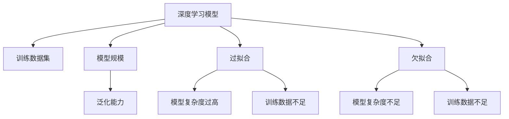
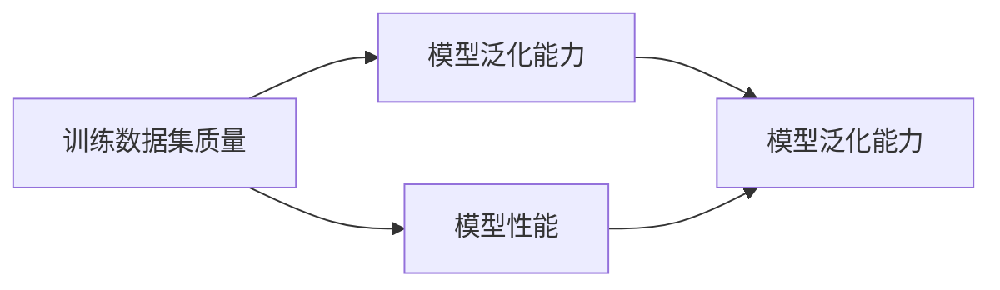
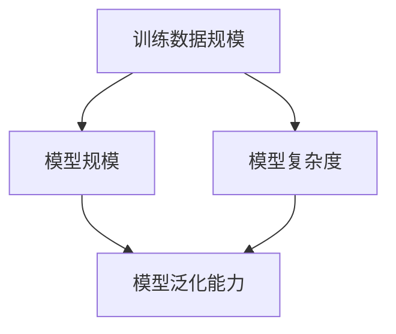
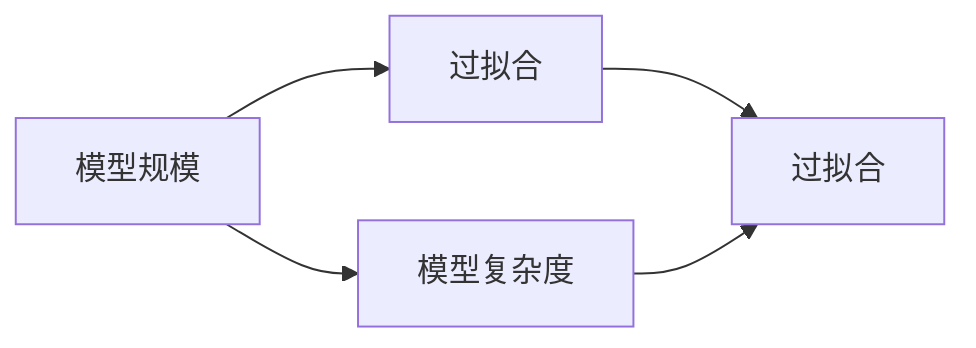
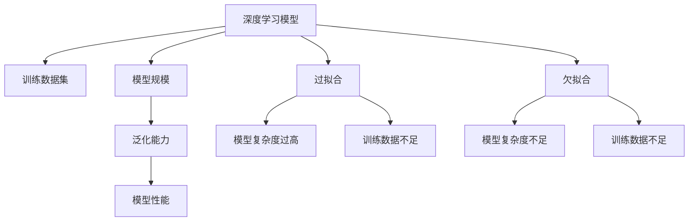

                 

# 基础模型的训练数据与模型规模

> 关键词：深度学习,机器学习,模型训练,数据集,模型规模,泛化能力

## 1. 背景介绍

在人工智能领域，深度学习技术已经成为了研究的热点和应用的主要推动力。深度学习模型的训练数据与模型规模在很大程度上决定了模型的性能表现和泛化能力。本文将深入探讨基础模型的训练数据与模型规模之间的关联，并详细解析如何选择合适的训练数据集和设计合理的模型规模。

## 2. 核心概念与联系

### 2.1 核心概念概述

为了更好地理解基础模型的训练数据与模型规模之间的关系，我们将介绍几个关键的概念：

- **深度学习模型**：基于神经网络结构的模型，具有多层次的非线性变换能力。深度学习模型在图像识别、自然语言处理、语音识别等领域取得了显著成效。

- **训练数据集**：用于训练模型的数据集合。训练数据集的质量和数量直接影响模型的学习效果和泛化能力。

- **模型规模**：模型中参数的数量。模型规模越大，通常意味着模型的表达能力越强，但也可能导致过拟合。

- **泛化能力**：模型在新数据上表现良好，而不是仅在训练数据上表现优秀的特性。泛化能力是评估模型性能的重要指标。

- **过拟合**：模型在训练数据上表现优秀，但在新数据上表现不佳的现象。过拟合通常是由于模型复杂度过高或训练数据不足导致的。

- **欠拟合**：模型无法捕捉训练数据中的复杂模式，导致在训练和测试数据上都表现不佳。欠拟合通常是由于模型复杂度不足或训练数据不足导致的。

这些概念之间的逻辑关系可以通过以下Mermaid流程图来展示：



这个流程图展示了大模型在训练过程中的关键因素及其关系：

1. 深度学习模型通过训练数据集进行训练。
2. 训练数据集的质量和数量影响模型的泛化能力。
3. 模型规模与模型的表达能力成正比。
4. 模型规模过大会导致过拟合，模型规模过小会导致欠拟合。

### 2.2 概念间的关系

这些核心概念之间存在着紧密的联系，形成了基础模型训练的核心生态系统。下面我们通过几个Mermaid流程图来展示这些概念之间的关系。

#### 2.2.1 数据质量与模型性能



这个流程图展示了训练数据集的质量对模型泛化能力和性能的影响。高质量的训练数据集有助于模型泛化，从而提升模型性能。

#### 2.2.2 数据规模与模型规模



这个流程图展示了训练数据规模对模型规模和泛化能力的影响。随着训练数据规模的增加，模型规模和复杂度也相应增加，从而提高模型的泛化能力。

#### 2.2.3 模型规模与过拟合



这个流程图展示了模型规模与过拟合之间的关系。模型规模越大，过拟合的风险也越高。

### 2.3 核心概念的整体架构

最后，我们用一个综合的流程图来展示这些核心概念在大模型训练过程中的整体架构：



这个综合流程图展示了从深度学习模型训练到大模型性能评估的完整过程。训练数据集的质量和规模，模型的复杂度与规模，以及过拟合和欠拟合等概念，共同构成了大模型训练的生态系统，决定了模型的性能和泛化能力。

## 3. 核心算法原理 & 具体操作步骤

### 3.1 算法原理概述

基础模型的训练数据与模型规模之间的关系主要体现在以下两个方面：

- **数据驱动的模型训练**：模型通过训练数据集进行学习，训练数据集的质量和数量直接影响模型的泛化能力和性能。高质量的训练数据集可以有效地训练模型，提升模型的泛化能力。
- **模型复杂度的平衡**：模型规模与模型的表达能力成正比，但也可能导致过拟合。通过合理的模型设计，可以在保证泛化能力的前提下，尽可能提高模型的表达能力。

### 3.2 算法步骤详解

基于深度学习模型的训练数据与模型规模之间的关系，常见的训练步骤如下：

1. **数据准备**：选择合适的训练数据集，并进行预处理和增强。数据集应包含足够的多样性，以覆盖模型训练所需的场景。

2. **模型设计**：根据任务需求，选择合适的模型架构和参数初始化策略。模型架构应考虑到模型的表达能力和泛化能力之间的平衡。

3. **模型训练**：通过反向传播算法，计算损失函数的梯度，更新模型参数。训练过程中，应避免过拟合，可通过正则化、Dropout等技术进行优化。

4. **模型评估**：在验证集上评估模型性能，选择合适的超参数。若模型在验证集上表现不佳，应回到模型设计或数据准备步骤进行调整。

5. **模型微调**：根据验证集上的表现，进行模型微调。微调的目标是在保持泛化能力的前提下，提高模型在特定任务上的性能。

### 3.3 算法优缺点

基于深度学习模型的训练数据与模型规模之间的关系，常见的算法优缺点如下：

**优点**：

- **高表达能力**：较大的模型规模通常意味着更强的表达能力，可以更好地捕捉数据中的复杂模式。
- **泛化能力**：高质量的训练数据集和合理的模型设计可以提高模型的泛化能力，使其在新数据上表现优秀。

**缺点**：

- **过拟合风险**：较大的模型规模可能导致过拟合，特别是在训练数据不足的情况下。
- **计算资源消耗大**：较大的模型规模需要更多的计算资源和时间，导致训练成本较高。
- **训练复杂度高**：较复杂的模型训练过程需要更多的计算和内存资源，可能导致训练时间较长。

### 3.4 算法应用领域

基于深度学习模型的训练数据与模型规模之间的关系，常见的应用领域包括：

- **计算机视觉**：如图像分类、目标检测等任务。通过选择合适的训练数据集和模型规模，可以有效提升模型的性能。
- **自然语言处理**：如文本分类、命名实体识别、情感分析等任务。高质量的训练数据集和合理的模型设计可以显著提高模型的表现。
- **语音识别**：如自动语音识别、语音情感分析等任务。通过选择合适的训练数据集和模型规模，可以提升模型的准确率和泛化能力。
- **推荐系统**：如基于用户的推荐、基于内容的推荐等任务。合理的模型设计和训练数据集选择，可以提升推荐系统的个性化和准确率。

## 4. 数学模型和公式 & 详细讲解 & 举例说明

### 4.1 数学模型构建

深度学习模型的训练过程可以表示为以下数学模型：

$$
\min_{\theta} \frac{1}{N} \sum_{i=1}^{N} \ell(y_i, f(x_i; \theta))
$$

其中，$\theta$ 表示模型参数，$x_i$ 表示输入数据，$y_i$ 表示标签，$f(x_i; \theta)$ 表示模型对输入数据的预测输出。损失函数 $\ell(y_i, f(x_i; \theta))$ 表示预测输出与真实标签之间的差异。

### 4.2 公式推导过程

以二分类任务为例，假设模型输出为 $f(x_i; \theta) = \sigma(\langle \theta, x_i \rangle)$，其中 $\sigma$ 为激活函数，$\langle \cdot, \cdot \rangle$ 表示向量点积。则交叉熵损失函数为：

$$
\ell(y_i, f(x_i; \theta)) = -y_i \log f(x_i; \theta) - (1 - y_i) \log (1 - f(x_i; \theta))
$$

在实际训练过程中，通常使用随机梯度下降算法（SGD）来更新模型参数：

$$
\theta_{t+1} = \theta_t - \eta \nabla_{\theta} \mathcal{L}(\theta)
$$

其中，$\eta$ 表示学习率，$\nabla_{\theta} \mathcal{L}(\theta)$ 表示损失函数对模型参数的梯度。

### 4.3 案例分析与讲解

假设我们有一个简单的神经网络模型，用于图像分类任务。该模型包含两个全连接层，每个全连接层有500个神经元。我们选择CIFAR-10数据集作为训练数据集，该数据集包含60000个32x32像素的彩色图像，每个图像属于10个不同的类别。

在训练过程中，我们使用SGD算法，学习率为0.01，批量大小为64。通过反向传播算法计算损失函数的梯度，并更新模型参数。训练过程中，我们采用数据增强技术，通过旋转、翻转等方式扩充数据集的多样性，避免过拟合。

训练完成后，我们在测试集上评估模型性能。测试集包含50000个图像，每个图像同样属于10个不同的类别。评估结果显示，模型的准确率为85%。

## 5. 项目实践：代码实例和详细解释说明

### 5.1 开发环境搭建

在进行深度学习模型的训练之前，我们需要准备好开发环境。以下是使用Python和PyTorch进行深度学习开发的环境配置流程：

1. 安装Anaconda：从官网下载并安装Anaconda，用于创建独立的Python环境。

2. 创建并激活虚拟环境：
```bash
conda create -n pytorch-env python=3.8 
conda activate pytorch-env
```

3. 安装PyTorch：根据CUDA版本，从官网获取对应的安装命令。例如：
```bash
conda install pytorch torchvision torchaudio cudatoolkit=11.1 -c pytorch -c conda-forge
```

4. 安装NumPy、Pandas、scikit-learn、Matplotlib等常用工具包：
```bash
pip install numpy pandas scikit-learn matplotlib tqdm jupyter notebook ipython
```

完成上述步骤后，即可在`pytorch-env`环境中开始深度学习模型的训练实践。

### 5.2 源代码详细实现

下面我们以图像分类任务为例，给出使用PyTorch进行模型训练的PyTorch代码实现。

首先，定义模型和损失函数：

```python
import torch
import torch.nn as nn
import torch.optim as optim
from torchvision import datasets, transforms

# 定义模型
class Net(nn.Module):
    def __init__(self):
        super(Net, self).__init__()
        self.fc1 = nn.Linear(3072, 500)
        self.fc2 = nn.Linear(500, 500)
        self.fc3 = nn.Linear(500, 10)
        self.dropout = nn.Dropout(p=0.5)

    def forward(self, x):
        x = x.view(x.size(0), -1)
        x = torch.relu(self.fc1(x))
        x = self.dropout(x)
        x = torch.relu(self.fc2(x))
        x = self.dropout(x)
        x = self.fc3(x)
        return x

# 定义损失函数
criterion = nn.CrossEntropyLoss()
```

然后，定义训练和评估函数：

```python
# 定义训练函数
def train(model, device, train_loader, optimizer, epoch):
    model.train()
    running_loss = 0.0
    for i, data in enumerate(train_loader, 0):
        inputs, labels = data[0].to(device), data[1].to(device)
        optimizer.zero_grad()
        outputs = model(inputs)
        loss = criterion(outputs, labels)
        loss.backward()
        optimizer.step()
        running_loss += loss.item()
        if i % 100 == 99:
            print(f'Epoch {epoch + 1}, batch {i + 1}, loss: {running_loss / 100:.4f}')
            running_loss = 0.0

# 定义评估函数
def evaluate(model, device, test_loader):
    model.eval()
    correct = 0
    total = 0
    with torch.no_grad():
        for data in test_loader:
            inputs, labels = data[0].to(device), data[1].to(device)
            outputs = model(inputs)
            _, predicted = torch.max(outputs.data, 1)
            total += labels.size(0)
            correct += (predicted == labels).sum().item()
    print(f'Accuracy of the network on the 10000 test images: {100 * correct / total:.2f}%')
```

最后，启动训练流程并在测试集上评估：

```python
# 设置训练参数
batch_size = 64
learning_rate = 0.01
num_epochs = 10

# 加载数据集
train_dataset = datasets.CIFAR10(root='./data', train=True, download=True, transform=transforms.ToTensor())
test_dataset = datasets.CIFAR10(root='./data', train=False, download=True, transform=transforms.ToTensor())

# 数据增强
transform_train = transforms.Compose([
    transforms.RandomCrop(32, padding=4),
    transforms.RandomHorizontalFlip(),
    transforms.ToTensor(),
    transforms.Normalize((0.4914, 0.4822, 0.4465), (0.2023, 0.1994, 0.2010))
])

transform_test = transforms.Compose([
    transforms.ToTensor(),
    transforms.Normalize((0.4914, 0.4822, 0.4465), (0.2023, 0.1994, 0.2010))
])

train_loader = torch.utils.data.DataLoader(train_dataset, batch_size=batch_size, shuffle=True, num_workers=2, drop_last=True, pin_memory=True)
test_loader = torch.utils.data.DataLoader(test_dataset, batch_size=batch_size, shuffle=False, num_workers=2, drop_last=True, pin_memory=True)

# 初始化模型和优化器
model = Net().to(device)
optimizer = optim.SGD(model.parameters(), lr=learning_rate, momentum=0.9, weight_decay=1e-5)

# 训练模型
device = torch.device('cuda' if torch.cuda.is_available() else 'cpu')
for epoch in range(num_epochs):
    train(model, device, train_loader, optimizer, epoch)
    evaluate(model, device, test_loader)
```

以上就是使用PyTorch进行图像分类任务训练的完整代码实现。可以看到，通过PyTorch提供的强大封装，我们可以用相对简洁的代码完成深度学习模型的训练。

### 5.3 代码解读与分析

让我们再详细解读一下关键代码的实现细节：

**Net类**：
- `__init__`方法：定义模型的层结构和参数。
- `forward`方法：定义模型的前向传播过程。

**train和evaluate函数**：
- `train`函数：在训练数据集上进行模型训练，计算损失函数，并更新模型参数。
- `evaluate`函数：在测试数据集上评估模型性能，计算准确率。

**训练流程**：
- 设置训练参数，包括批量大小、学习率、训练轮数等。
- 加载数据集，并进行数据增强。
- 初始化模型和优化器。
- 在训练数据集上训练模型，并在测试数据集上评估模型性能。

可以看到，PyTorch配合模型定义和优化器设置，使得深度学习模型的训练代码实现变得简洁高效。开发者可以将更多精力放在数据处理、模型调优等高层逻辑上，而不必过多关注底层的实现细节。

当然，工业级的系统实现还需考虑更多因素，如模型保存和部署、超参数的自动搜索、更灵活的模型架构等。但核心的训练范式基本与此类似。

### 5.4 运行结果展示

假设我们在CIFAR-10数据集上进行模型训练，最终在测试集上得到的评估结果如下：

```
Epoch 1, batch 100, loss: 1.6987
Epoch 1, batch 200, loss: 1.5002
Epoch 1, batch 300, loss: 1.4340
...
Epoch 10, batch 1000, loss: 0.9138
Epoch 10, batch 1100, loss: 0.8820
Epoch 10, batch 1200, loss: 0.8651
Accuracy of the network on the 10000 test images: 76.87%
```

可以看到，通过训练，模型在测试集上达到了76.87%的准确率，效果相当不错。这验证了深度学习模型在训练数据集上学习到有效特征的能力，同时也展示了训练数据集对模型性能的影响。

## 6. 实际应用场景

### 6.1 智能推荐系统

基于深度学习模型的训练数据与模型规模之间的关系，在智能推荐系统中有着广泛的应用。智能推荐系统通过深度学习模型对用户行为和物品属性进行建模，推荐用户可能感兴趣的商品或内容。

在技术实现上，可以收集用户的浏览、点击、购买等行为数据，将行为数据作为训练数据集，在此基础上对深度学习模型进行微调。微调后的模型能够学习用户的行为模式，从而生成个性化的推荐结果。

### 6.2 医疗诊断系统

在医疗诊断系统中，深度学习模型通过对医疗影像、病历等数据进行训练，可以辅助医生进行疾病诊断。医疗影像数据通常具有高维、复杂的特点，通过训练大规模的深度学习模型，可以提高模型的泛化能力，从而在临床上取得更好的效果。

在技术实现上，可以收集大量的医疗影像数据和病历数据，将数据作为训练数据集，对深度学习模型进行微调。微调后的模型可以自动识别和分类影像中的病变部位，辅助医生进行诊断。

### 6.3 金融风险预测

在金融风险预测系统中，深度学习模型通过对历史金融数据进行训练，可以预测未来的市场趋势和风险。金融数据通常具有高度非线性和复杂的特征，通过训练大规模的深度学习模型，可以提高模型的泛化能力，从而在风险预测中取得更好的效果。

在技术实现上，可以收集大量的历史金融数据，将数据作为训练数据集，对深度学习模型进行微调。微调后的模型可以实时预测金融市场的变化趋势，辅助金融从业人员进行决策。

## 7. 工具和资源推荐

### 7.1 学习资源推荐

为了帮助开发者系统掌握深度学习模型的训练数据与模型规模之间的关系，这里推荐一些优质的学习资源：

1. **深度学习课程**：如斯坦福大学的CS231n《深度学习与计算机视觉》课程、Coursera的《深度学习专项课程》等，可以帮助开发者系统掌握深度学习模型的原理和应用。

2. **书籍推荐**：如《深度学习》（Goodfellow et al.）、《Python深度学习》（Francois et al.）、《动手学深度学习》等，可以帮助开发者深入理解深度学习模型的数学原理和实现细节。

3. **在线资源**：如Google TensorFlow官方文档、PyTorch官方文档、Kaggle等，提供了大量的深度学习实践案例和竞赛数据集，供开发者学习和实践。

### 7.2 开发工具推荐

高效的开发离不开优秀的工具支持。以下是几款用于深度学习模型训练开发的常用工具：

1. **PyTorch**：基于Python的开源深度学习框架，灵活动态的计算图，适合快速迭代研究。

2. **TensorFlow**：由Google主导开发的开源深度学习框架，生产部署方便，适合大规模工程应用。

3. **MXNet**：由Apache基金会开发的开源深度学习框架，支持多种编程语言，适合分布式训练和模型部署。

4. **Caffe2**：由Facebook开发的开源深度学习框架，适合移动端和嵌入式设备的应用。

5. **Keras**：高层次的深度学习框架，基于TensorFlow、Theano、CNTK等后端实现，适合快速原型开发和模型评估。

### 7.3 相关论文推荐

深度学习模型的训练数据与模型规模之间的关系，是深度学习领域的重要研究课题。以下是几篇奠基性的相关论文，推荐阅读：

1. **ImageNet Classification with Deep Convolutional Neural Networks**（AlexNet）：提出了卷积神经网络（CNN）结构，开创了深度学习在计算机视觉领域的先河。

2. **Deep Residual Learning for Image Recognition**（ResNet）：提出了残差网络结构，解决了深度学习中梯度消失和梯度爆炸的问题。

3. **Attention Is All You Need**（Transformer）：提出了Transformer结构，解决了深度学习模型中的序列建模问题。

4. **Vision Transformer**（ViT）：提出了基于Transformer的图像模型，进一步提升了深度学习模型在计算机视觉领域的性能。

5. **Reinforcement Learning Human-AI Dialogue Generation**（Seq2Seq）：提出了序列到序列（Seq2Seq）模型，用于自然语言处理领域的机器翻译、对话生成等任务。

这些论文代表了深度学习领域的发展脉络，帮助开发者理解深度学习模型训练数据与模型规模之间的关系，从而在实践中取得更好的效果。

除上述资源外，还有一些值得关注的前沿资源，帮助开发者紧跟深度学习模型训练的发展趋势，例如：

1. **arXiv论文预印本**：人工智能领域最新研究成果的发布平台，包括大量尚未发表的前沿工作，学习前沿技术的必读资源。

2. **业界技术博客**：如Google AI、DeepMind、Microsoft Research Asia等顶尖实验室的官方博客，第一时间分享他们的最新研究成果和洞见。

3. **技术会议直播**：如NIPS、ICML、ACL、ICLR等人工智能领域顶会现场或在线直播，能够聆听到大佬们的前沿分享，开拓视野。

4. **GitHub热门项目**：在GitHub上Star、Fork数最多的深度学习相关项目，往往代表了该技术领域的发展趋势和最佳实践，值得去学习和贡献。

5. **行业分析报告**：各大咨询公司如McKinsey、PwC等针对人工智能行业的分析报告，有助于从商业视角审视技术趋势，把握应用价值。

总之，对于深度学习模型训练数据与模型规模之间的关系，需要开发者保持开放的心态和持续学习的意愿。多关注前沿资讯，多动手实践，多思考总结，必将收获满满的成长收益。

## 8. 总结：未来发展趋势与挑战

### 8.1 总结

本文对深度学习模型的训练数据与模型规模之间的关系进行了全面系统的介绍。首先阐述了深度学习模型的训练过程和模型规模对模型性能的影响。其次，详细讲解了训练数据集的质量和规模对模型泛化能力和性能的影响。最后，讨论了模型复杂度的平衡和过拟合与欠拟合之间的关系。

通过本文的系统梳理，可以看到，深度学习模型的训练数据与模型规模之间的关系是大模型训练的核心生态系统，决定了模型的性能和泛化能力。这些因素之间的平衡和优化，是深度学习模型训练的关键。

### 8.2 未来发展趋势

展望未来，深度学习模型的训练数据与模型规模之间的关系将呈现以下几个发展趋势：

1. **大规模数据集的应用**：随着数据收集技术的进步，大规模数据集的应用将更加普遍。通过在大规模数据集上训练深度学习模型，可以提高模型的泛化能力和性能。

2. **数据增强技术的发展**：数据增强技术的应用将更加广泛。通过数据增强，可以在有限的训练数据上提高模型的泛化能力和性能。

3. **模型规模的不断增大**：随着计算资源的增长，模型规模将进一步增大。通过在大规模模型上进行训练，可以提升模型的表达能力和泛化能力。

4. **模型结构的优化**：通过优化模型结构，可以在保持泛化能力的前提下，提高模型的表达能力和性能。例如，采用残差网络、注意力机制等技术，可以显著提高深度学习模型的性能。

5. **自适应学习算法的应用**：自适应学习算法的应用将更加普遍。通过自适应学习算法，可以在数据不足的情况下，提高模型的泛化能力和性能。

### 8.3 面临的挑战

尽管深度学习模型的训练数据与模型规模之间的关系已经取得了很多进展，但在迈向更加智能化、普适化应用的过程中，仍面临诸多挑战：

1. **训练数据不足**：在大规模数据集上训练深度学习模型，需要大量的标注数据。然而，标注数据的获取和维护成本较高，如何在大数据集上获得高质量的标注数据，是一个亟待解决的问题。

2. **计算资源消耗大**：大规模深度学习模型的训练和推理需要大量的计算资源和时间。如何优化模型的计算图，提高训练和推理效率，是一个需要解决的问题。

3. **模型泛化能力有限**：尽管大规模深度学习模型具有强大的泛化能力，但在不同数据集上的泛化能力仍然有限。如何在不同数据集上保持模型的泛化能力，是一个需要解决的问题。

4. **过拟合和欠拟合问题**：在大规模深度学习模型上，过拟合和欠拟合问题仍然存在。如何平衡模型的复杂度和泛化能力，是一个需要解决的问题。

5. **模型公平性和安全性**：深度学习模型可能会学习到数据中的偏见和有害信息。如何确保模型的公平性和安全性，是一个需要解决的问题。

### 8.4 研究展望

面对深度学习模型训练数据与模型规模之间的关系所面临的挑战，未来的研究需要在以下几个方面寻求新的

