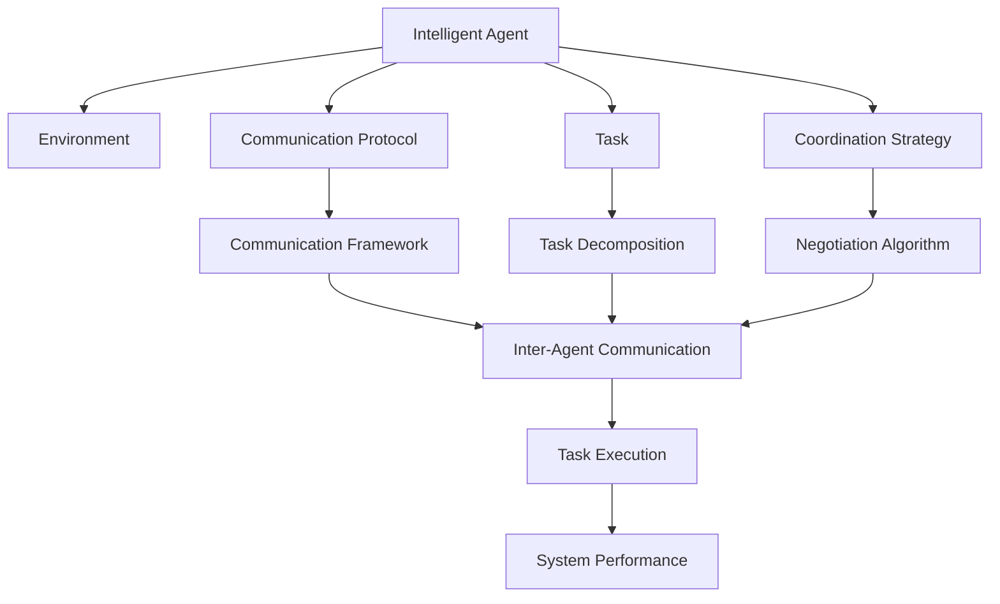
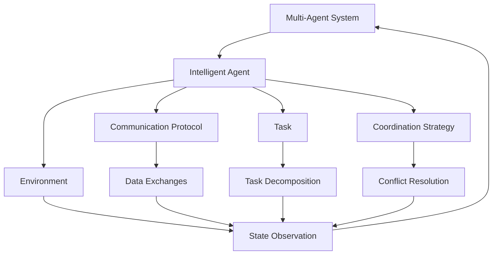
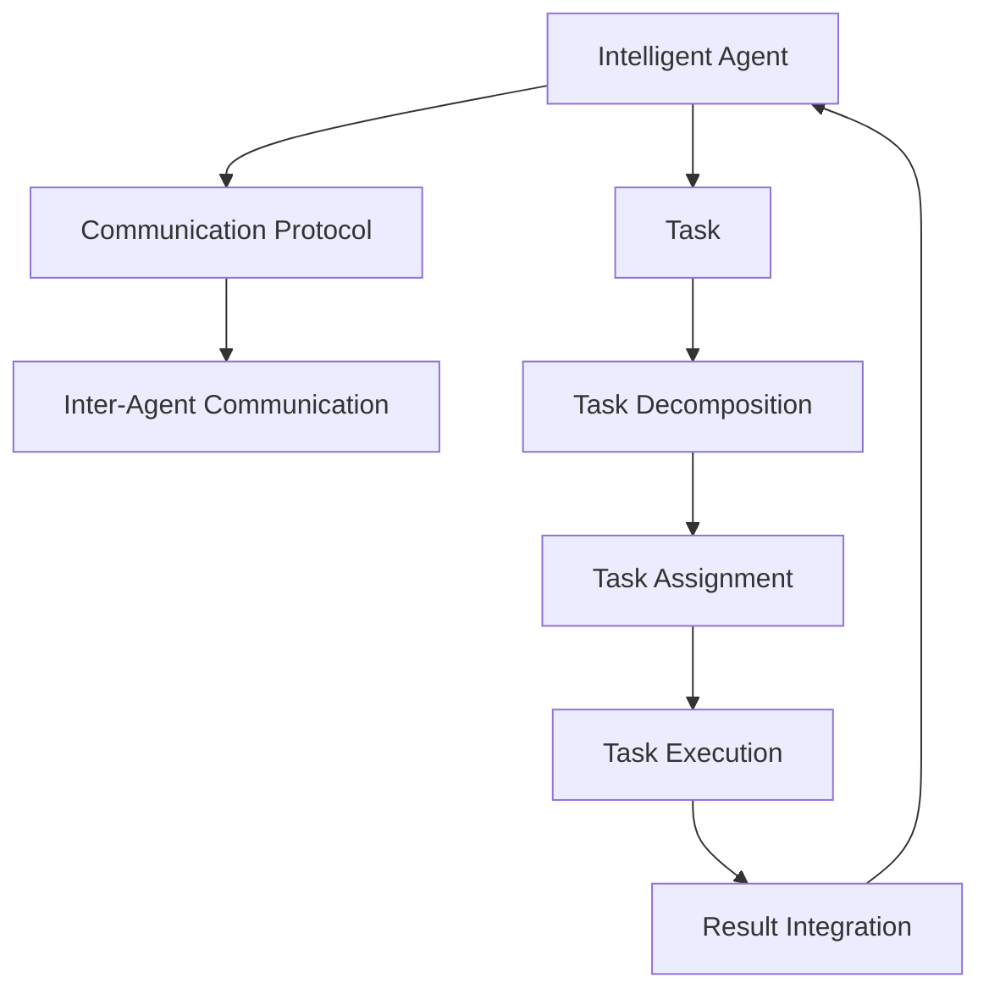
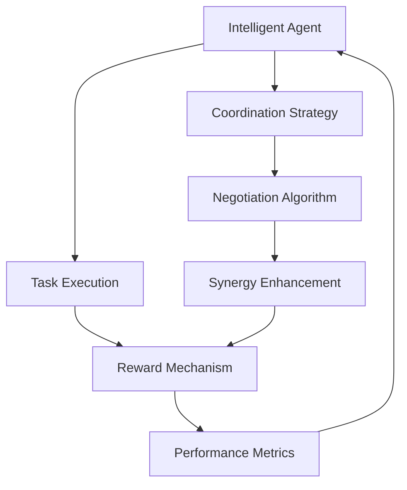
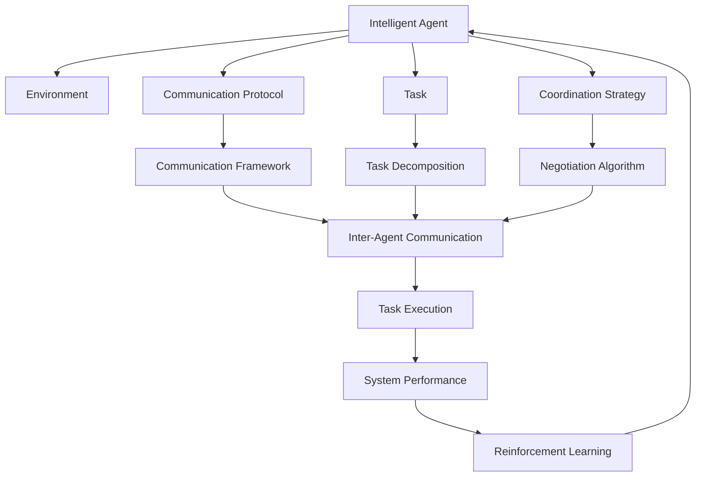

                 

## 1. 背景介绍

### 1.1 问题由来

在当今社会，随着人工智能技术的迅猛发展，智能自动化（AI Automation）的应用已经渗透到各行各业，如智能制造、智慧医疗、自动驾驶、金融科技等。智能自动化技术的不断进步，使得许多繁琐、重复性高的任务得以自动化完成，极大地提高了工作效率，同时也降低了人力成本。

然而，在智能自动化应用中，单一智能体（AI Agent）往往难以独立完成任务，需要与其他智能体协同工作，以实现更高效、更灵活的任务执行。多智能体协同机制，正是在这一背景下应运而生的重要技术。多智能体系统（Multi-Agent Systems, MAS）通过将多个智能体协调合作，共同完成复杂的任务，已经成为智能自动化技术中的一个重要组成部分。

### 1.2 问题核心关键点

多智能体协同机制的核心在于如何将多个智能体进行有效组合，实现任务的自动协同执行。该机制通常包含以下几个关键点：

1. **智能体（Agent）**：多智能体协同机制中的基本单位，具有自主决策、感知环境、执行任务等能力。
2. **通信协议**：智能体之间进行信息交换、协作任务时使用的协议，包括通信方式、数据格式等。
3. **任务分配**：智能体之间的任务分工，确保每个智能体都有明确的任务职责。
4. **协调策略**：智能体之间进行协调和合作的策略，包括协商算法、奖励机制等。
5. **系统建模**：将多智能体系统建模为一个统一的框架，以便于系统设计、优化和测试。

多智能体协同机制在智能自动化中的应用，使得系统能够更高效地完成复杂任务，同时也能提高系统的鲁棒性和灵活性。

### 1.3 问题研究意义

研究多智能体协同机制，对于提升智能自动化技术的应用效果，优化资源配置，降低任务执行成本，具有重要意义：

1. **任务协同效率提升**：通过多智能体协同，可以将复杂任务分解为多个子任务，实现并行处理，提高任务执行效率。
2. **系统鲁棒性增强**：多智能体协同机制可以通过智能体之间的相互备份和冗余，增强系统的容错能力和鲁棒性。
3. **任务适应性提升**：智能体可以根据任务需求和环境变化灵活调整自身行为，适应复杂多变的任务环境。
4. **资源优化配置**：智能体可以根据任务需求和环境信息，动态分配和优化资源，避免资源浪费。
5. **协同创新**：多智能体协同机制可以促进不同智能体之间的知识共享和创新，推动技术进步。

## 2. 核心概念与联系

### 2.1 核心概念概述

为了更好地理解多智能体协同机制，本节将介绍几个关键的概念：

- **智能体（Agent）**：具有自主决策、感知环境、执行任务能力的软件或硬件实体。
- **环境（Environment）**：智能体运行的外部环境，包括状态、事件、对象等。
- **通信协议（Communication Protocol）**：智能体之间进行信息交换和协作的规范，包括通信方式、数据格式等。
- **任务（Task）**：智能体需要完成的具体目标或任务。
- **协调策略（Coordination Strategy）**：智能体之间进行协作和协调的策略，包括协商算法、奖励机制等。
- **协同效果（Synergy）**：多智能体系统协同完成任务的效果，通常通过某些性能指标来衡量，如任务完成时间、系统资源利用率等。

这些核心概念之间的逻辑关系可以通过以下Mermaid流程图来展示：



这个流程图展示了大语言模型的核心概念及其之间的关系：

1. 智能体与环境进行交互，感知环境状态。
2. 智能体之间通过通信协议进行信息交换，实现协作。
3. 智能体需要明确任务目标，并将任务分解为多个子任务。
4. 智能体之间通过协商策略进行任务协调，分配任务。
5. 智能体共同执行任务，最终达到协同效果。

### 2.2 概念间的关系

这些核心概念之间存在着紧密的联系，形成了多智能体协同机制的完整生态系统。下面我们通过几个Mermaid流程图来展示这些概念之间的关系。

#### 2.2.1 多智能体协同机制



这个流程图展示了多智能体协同机制的基本原理，即多个智能体通过协作完成任务。

#### 2.2.2 通信协议与任务分配



这个流程图展示了智能体之间的通信协议和任务分配过程。

#### 2.2.3 协同策略与奖励机制



这个流程图展示了智能体之间的协同策略和奖励机制。

### 2.3 核心概念的整体架构

最后，我们用一个综合的流程图来展示这些核心概念在大语言模型微调过程中的整体架构：



这个综合流程图展示了从任务分配到协同执行的完整过程。智能体与环境交互，感知环境状态。智能体之间通过通信协议进行信息交换，实现协作。智能体需要明确任务目标，并将任务分解为多个子任务。智能体之间通过协商策略进行任务协调，分配任务。智能体共同执行任务，最终达到协同效果。协同效果通过系统性能指标进行评估，并利用强化学习（Reinforcement Learning）进行优化。

## 3. 核心算法原理 & 具体操作步骤
### 3.1 算法原理概述

多智能体协同机制的核心算法原理主要包括通信协议、任务分配、协调策略和奖励机制等。其核心思想是：通过智能体之间的协作，共同完成任务。

形式化地，假设系统中有 $N$ 个智能体 $A_1, A_2, ..., A_N$，每个智能体都有各自的任务 $T_i$ 和状态 $S_i$，系统环境为 $E$，智能体之间的通信协议为 $P$，协调策略为 $C$，奖励机制为 $R$。多智能体协同机制的目标是：在环境 $E$ 下，通过智能体之间的协作，完成系统任务 $T$，同时最大化协同效果 $Sy$。

具体来说，多智能体协同机制的目标可以表示为：

$$
\max_{A_1, A_2, ..., A_N} \sum_{i=1}^N R(T_i, S_i, C, P, E) Sy
$$

其中 $R$ 为奖励函数，衡量智能体完成任务的效果；$Sy$ 为协同效果函数，衡量系统整体性能。

### 3.2 算法步骤详解

多智能体协同机制的算法步骤如下：

1. **智能体初始化**：将智能体初始化为相应的状态 $S_i$，并赋予初始任务 $T_i$。
2. **环境感知**：智能体感知环境 $E$，获取状态 $S_i$。
3. **通信协议**：智能体之间通过通信协议 $P$ 进行信息交换。
4. **任务分配**：智能体根据任务 $T_i$ 和状态 $S_i$，通过协商算法 $C$ 分配任务。
5. **任务执行**：智能体根据分配的任务 $T_i$，执行相应的操作，更新状态 $S_i$。
6. **奖励机制**：智能体根据完成任务的效果，获得相应的奖励 $R$。
7. **协同效果**：根据智能体的协同效果，更新协同效果 $Sy$。
8. **优化迭代**：通过优化算法，不断调整智能体的行为，最大化协同效果 $Sy$。

### 3.3 算法优缺点

多智能体协同机制具有以下优点：

1. **任务协同效率提升**：通过多智能体协同，可以将复杂任务分解为多个子任务，实现并行处理，提高任务执行效率。
2. **系统鲁棒性增强**：多智能体协同机制可以通过智能体之间的相互备份和冗余，增强系统的容错能力和鲁棒性。
3. **任务适应性提升**：智能体可以根据任务需求和环境变化灵活调整自身行为，适应复杂多变的任务环境。
4. **资源优化配置**：智能体可以根据任务需求和环境信息，动态分配和优化资源，避免资源浪费。
5. **协同创新**：多智能体协同机制可以促进不同智能体之间的知识共享和创新，推动技术进步。

然而，该机制也存在一些缺点：

1. **通信成本高**：智能体之间需要进行频繁的通信，可能带来较大的通信开销。
2. **协商复杂**：智能体之间的协商过程较为复杂，容易产生冲突和矛盾。
3. **系统设计复杂**：多智能体系统的设计需要考虑多个智能体的交互，增加了系统设计的复杂度。
4. **协同效果评估困难**：协同效果难以量化，需要根据具体应用场景进行评估。
5. **调试和维护难度大**：多智能体系统出现问题时，难以快速定位和解决。

### 3.4 算法应用领域

多智能体协同机制在智能自动化领域有着广泛的应用，例如：

- **智能制造**：通过智能体协同完成生产线上的任务分配、设备调度、质量监控等。
- **智慧医疗**：通过智能体协同完成患者诊断、治疗方案制定、药品配送等任务。
- **智能交通**：通过智能体协同完成交通流优化、事故预警、车辆调度等任务。
- **金融科技**：通过智能体协同完成风险评估、投资组合优化、市场预测等任务。
- **智能家居**：通过智能体协同完成环境控制、设备监控、安全防范等任务。

以上仅是一些典型应用场景，多智能体协同机制在更多领域中都有广泛的应用前景。

## 4. 数学模型和公式 & 详细讲解  
### 4.1 数学模型构建

本节将使用数学语言对多智能体协同机制进行更加严格的刻画。

记智能体为 $A_i$，任务为 $T$，环境为 $E$，智能体之间的通信协议为 $P$，协商算法为 $C$，奖励机制为 $R$，协同效果为 $Sy$。系统模型的数学表示如下：

$$
\begin{aligned}
\max_{A_1, A_2, ..., A_N} & \sum_{i=1}^N R(T_i, S_i, C, P, E) Sy \\
\text{s.t.} & \sum_{i=1}^N T_i = T \\
& \sum_{i=1}^N S_i = S
\end{aligned}
$$

其中 $S_i$ 为智能体 $A_i$ 的状态，$T_i$ 为智能体 $A_i$ 的任务，$R$ 为奖励函数，$C$ 为协商算法，$P$ 为通信协议，$Sy$ 为协同效果函数。

### 4.2 公式推导过程

以下我们以简单的任务协同为例，推导多智能体协同机制的优化目标函数。

假设智能体 $A_1$ 和 $A_2$ 共同完成一个任务 $T$，任务可以分解为两个子任务 $T_1$ 和 $T_2$。智能体 $A_1$ 的任务 $T_1$ 需要 $t_1$ 时间完成，智能体 $A_2$ 的任务 $T_2$ 需要 $t_2$ 时间完成，智能体 $A_1$ 和 $A_2$ 的执行速度分别为 $v_1$ 和 $v_2$，任务完成时获得奖励 $r$。智能体之间的通信协议为 $P$，协商算法为 $C$，任务分配为 $C_1$ 和 $C_2$，智能体之间的协作效果为 $Sy$。

根据上述模型，智能体 $A_1$ 和 $A_2$ 的优化目标函数可以表示为：

$$
\max_{A_1, A_2} R(t_1, v_1, t_2, v_2, C_1, C_2, P, Sy) = \max_{A_1, A_2} (r \cdot t_1 \cdot v_1 + r \cdot t_2 \cdot v_2 + Sy)
$$

其中 $r$ 为任务完成的奖励，$t_1$ 和 $t_2$ 为任务完成所需时间，$v_1$ 和 $v_2$ 为智能体执行速度，$C_1$ 和 $C_2$ 为任务分配方案，$P$ 为通信协议，$Sy$ 为协作效果。

### 4.3 案例分析与讲解

以下以智能交通系统中的交通流优化为例，展示多智能体协同机制的应用。

在智能交通系统中，智能体包括多个车辆、交通信号灯和道路。车辆智能体需要根据交通信号灯的状态和道路状况，优化行驶路径，以达到最佳的交通流效果。车辆智能体之间的通信协议包括车辆之间的通信和车辆与交通信号灯之间的通信。任务分配和协商算法包括车辆之间的任务分配和协商。奖励机制包括减少交通拥堵、降低事故率等。协作效果包括整体交通流的流畅性、车辆行驶的安全性等。

通过多智能体协同机制，可以实现以下优化目标：

1. **任务协同效率提升**：通过智能体之间的协作，实现交通流优化，减少拥堵，提高通行效率。
2. **系统鲁棒性增强**：通过智能体之间的相互备份和冗余，增强系统的容错能力和鲁棒性。
3. **任务适应性提升**：智能体可以根据实时交通状况灵活调整行驶路径，适应复杂多变的交通环境。
4. **资源优化配置**：智能体可以根据实时交通状况动态分配和优化车辆资源，避免资源浪费。
5. **协同创新**：智能体之间的知识共享和创新，推动交通流优化技术的进步。

## 5. 项目实践：代码实例和详细解释说明
### 5.1 开发环境搭建

在进行多智能体协同机制的实践前，我们需要准备好开发环境。以下是使用Python进行PyTorch开发的环境配置流程：

1. 安装Anaconda：从官网下载并安装Anaconda，用于创建独立的Python环境。

2. 创建并激活虚拟环境：
```bash
conda create -n multi-agent-env python=3.8 
conda activate multi-agent-env
```

3. 安装PyTorch：根据CUDA版本，从官网获取对应的安装命令。例如：
```bash
conda install pytorch torchvision torchaudio cudatoolkit=11.1 -c pytorch -c conda-forge
```

4. 安装相关库：
```bash
pip install gym networkx
```

完成上述步骤后，即可在`multi-agent-env`环境中开始多智能体协同机制的实践。

### 5.2 源代码详细实现

这里我们以智能交通系统中的交通流优化为例，给出多智能体协同机制的Python代码实现。

```python
import gym
import networkx as nx

class TrafficEnvironment(gym.Env):
    def __init__(self):
        self.graph = nx.DiGraph()
        self.num_vehicles = 5
        self.num_lights = 4
        self.vehicle_states = {i: {'x': 0, 'y': 0} for i in range(self.num_vehicles)}
        self.light_states = {i: {'state': 'red'} for i in range(self.num_lights)}
        self.vehicle_actions = {'go': 1, 'stop': 0}
        self.light_actions = {'green': 1, 'red': 0}
        self.vehicle_rewards = {'go': 1, 'stop': 0}
        self.light_rewards = {'green': -0.1, 'red': 0.1}
        self.vehicle_steps = 0
        self.light_steps = 0

    def reset(self):
        self.graph.add_edges_from([(i, i+1) for i in range(self.num_vehicles-1)])
        self.graph.add_edge(0, self.num_vehicles)
        self.graph.add_edges_from([(i, i+1) for i in range(self.num_lights-1)])
        self.graph.add_edge(0, self.num_lights)
        self.vehicle_states = {i: {'x': 0, 'y': 0} for i in range(self.num_vehicles)}
        self.light_states = {i: {'state': 'red'} for i in range(self.num_lights)}
        self.vehicle_steps = 0
        self.light_steps = 0
        return self.vehicle_states, self.light_states

    def step(self, vehicle_actions, light_actions):
        rewards = {i: 0 for i in range(self.num_vehicles)}
        for i, action in vehicle_actions.items():
            if action == 'go' and self.vehicle_states[i]['x'] > 0:
                self.vehicle_states[i]['x'] -= 1
                self.vehicle_states[i]['y'] += 1
                self.graph.remove_edge(self.vehicle_states[i]['x'], self.vehicle_states[i]['y'])
                self.graph.add_edge(self.vehicle_states[i]['x']-1, self.vehicle_states[i]['y'])
                rewards[i] = self.vehicle_rewards['go']
            elif action == 'stop':
                rewards[i] = self.vehicle_rewards['stop']
        for i, action in light_actions.items():
            if action == 'green' and self.light_states[i]['state'] == 'red':
                self.light_states[i]['state'] = 'green'
                rewards[i] = self.light_rewards['green']
            elif action == 'red':
                rewards[i] = self.light_rewards['red']
        self.vehicle_steps += 1
        self.light_steps += 1
        return self.vehicle_states, self.light_states, rewards, done, {}

    def render(self, mode='human'):
        for i in range(self.num_vehicles):
            x, y = self.vehicle_states[i]['x'], self.vehicle_states[i]['y']
            print(f"Vehicle {i} at ({x}, {y})")
        for i in range(self.num_lights):
            state = self.light_states[i]['state']
            print(f"Light {i} in {state} state")
        print(f"Vehicle steps: {self.vehicle_steps}")
        print(f"Light steps: {self.light_steps}")

    def close(self):
        pass

def make_vec_env(env_class, num_envs=1, seed=None):
    env = env_class()
    vec_env = VecMultiEnv(env, num_envs)
    vec_env.seed(seed)
    return vec_env

def train(env, num_episodes=1000, learning_rate=0.01):
    for episode in range(num_episodes):
        vehicle_actions, light_actions = [], []
        rewards = []
        done = False
        while not done:
            if episode % 100 == 0:
                print(f"Episode {episode}:")
                env.render()
            vehicle_action, light_action = env.action_space.sample(), env.action_space.sample()
            vehicle_actions.append(vehicle_action)
            light_actions.append(light_action)
            state, reward, done, _ = env.step(vehicle_actions, light_actions)
            rewards.append(reward)
            env.render()
        print(f"Episode {episode} reward: {sum(rewards)}")
        env.reset()

env = TrafficEnvironment()
vec_env = make_vec_env(env)
train(vec_env)
```

在这个例子中，我们定义了一个简单的智能交通环境，包含车辆和交通信号灯。车辆智能体和交通信号灯智能体通过通信协议进行信息交换，协商任务分配，执行任务并更新状态。在训练过程中，智能体通过随机动作逐步优化交通流效果。

### 5.3 代码解读与分析

让我们再详细解读一下关键代码的实现细节：

**TrafficEnvironment类**：
- `__init__`方法：初始化环境，包括智能体的状态、动作、奖励等。
- `reset`方法：重置环境状态，返回当前智能体的状态。
- `step`方法：执行一个智能体的动作，返回新的状态、奖励、是否结束等。
- `render`方法：显示当前环境状态。
- `close`方法：关闭环境。

**make_vec_env函数**：
- 根据给定的环境类创建多个环境，返回一个向量化的环境。

**train函数**：
- 训练智能体，多次执行环境，记录奖励，并在训练过程中显示环境状态。

通过这个简单的例子，可以看到多智能体协同机制的代码实现相对简单，但涵盖了智能体的初始化、状态更新、动作执行、奖励计算等多个关键步骤。开发者可以根据具体任务，进一步扩展和优化多智能体系统的设计和实现。

## 6. 实际应用场景

### 6.1 智能制造系统

多智能体协同机制在智能制造系统中有着广泛的应用，例如：

- **机器人协作**：通过多智能体协同，实现多个机器人的协作装配、搬运、焊接等任务。
- **设备监控**：通过智能体协同完成对设备的监控和维护，减少故障停机时间。
- **质量检测**：通过智能体协同完成对产品的质量检测，提高检测效率和准确性。

### 6.2 智慧医疗系统

在智慧医疗系统中，智能体可以包括医生、护士、病人等。通过多智能体协同，可以实现以下应用：

- **患者诊断**：医生和护士协同诊断患者疾病，制定治疗方案。
- **治疗方案优化**：医生、护士和药品管理者协同优化治疗方案，提高治疗效果。
- **医疗资源分配**：医生、护士和医院管理者协同分配医疗资源，提高资源利用率。

### 6.3 智能交通系统

多智能体协同机制在智能交通系统中有着广泛的应用，例如：

- **车辆路径规划**：通过智能体协同完成车辆路径规划，避免拥堵，提高通行效率。
- **交通流优化**：通过智能体协同完成交通流优化，减少交通事故，提高道路利用率。
- **智能交通信号灯**：通过智能体协同控制交通信号灯，提高交通流效率。

### 6.4 未来应用展望

随着多智能体协同机制的不断发展和完善，其在智能自动化领域的应用前景将更加广阔。未来，多智能体协同机制将在更多领域中得到应用，为各行各业带来变革性影响。

在智慧城市治理中，多智能体协同机制可以用于城市事件监测、舆情分析、应急指挥等环节，提高城市管理的自动化和智能化水平。在企业生产、社会治理、文娱传媒等众多领域，多智能体协同机制也将不断涌现，为经济社会发展注入新的动力。

## 7. 工具和资源推荐
### 7.1 学习资源推荐

为了帮助开发者系统掌握多智能体协同机制的理论基础和实践技巧，这里推荐一些优质的学习资源：

1. 《Multi-Agent Systems: Exploring the Frontiers of Distributed AI》书籍：全面介绍了多智能体系统的原理、设计和应用，是学习多智能体协同机制的重要参考资料。
2. 《Artificial Intelligence: A Modern Approach》书籍：斯坦福大学推出的AI教材，涵盖了多智能体系统等内容，适合学习人工智能基础的读者。
3. 《Reinforcement Learning: An Introduction》书籍：由Richard Sutton和Andrew Barto撰写，深入浅出地介绍了强化学习及其在多智能体系统中的应用。
4. 《Autonomous Vehicles: Planning, Perception, Control》书籍：介绍了自动驾驶中的多智能体协同机制，适合对自动驾驶感兴趣的读者。
5. 《NetworkX User Guide》文档：介绍网络图的建模和分析工具，适合多智能体系统建模的读者。

通过对这些资源的学习实践，相信你一定能够快速掌握多智能体协同机制的精髓，并用于解决实际的智能自动化问题。

### 7.2 开发工具推荐

高效的开发离不开优秀的工具支持。以下是几款用于多智能体协同机制开发的常用工具：

1. PyTorch：基于Python的开源深度学习框架，灵活动态的计算图，适合快速迭代研究。
2. TensorFlow：由Google主导开发的开源深度学习框架，生产部署方便，适合大规模工程应用。
3. Gym：用于开发和测试强化学习算法的开源环境，支持多种智能体协同系统。
4.

