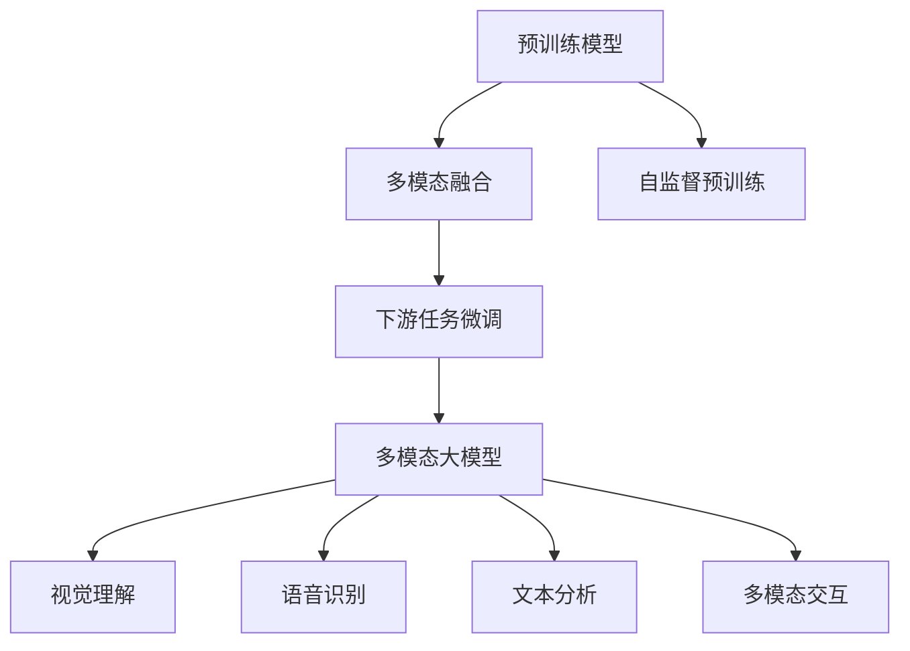
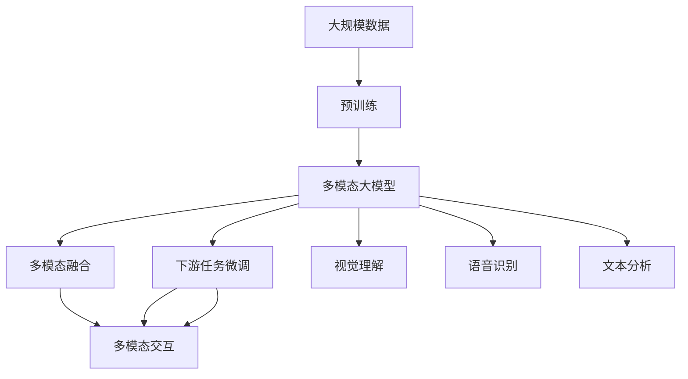

                 

# 多模态大模型：技术原理与实战 多模态大模型的部署

> 关键词：多模态大模型,深度学习,计算机视觉,自然语言处理,NLP,多模态融合,迁移学习,部署实践,多模态数据处理,技术栈,应用场景

## 1. 背景介绍

### 1.1 问题由来
近年来，人工智能技术在各个领域的应用日益深入，从自动驾驶、工业生产到医疗诊断、金融分析，AI技术正成为推动行业创新与进步的重要动力。而在大数据与计算资源的推动下，深度学习算法尤其是神经网络架构，已成为当前AI技术的主要支柱。

然而，尽管深度学习在图像识别、自然语言处理等领域取得了显著成就，但传统的神经网络模型通常只能处理单一模态的数据，即视觉数据或文本数据。这种单一模态的局限性在复杂场景下显得尤为明显，例如在智能客服、智能安防、智能医疗等场景中，往往需要同时处理视觉、语音、文本等多模态数据，才能构建高效且智能的解决方案。

在此背景下，多模态大模型应运而生。多模态大模型能够同时处理并融合多种类型的数据，从中提取高层次的语义信息，极大地提升了AI系统在多模态数据处理上的能力。本文将详细介绍多模态大模型的技术原理、实战步骤以及实际部署场景，希望能为AI开发者提供有价值的参考。

### 1.2 问题核心关键点
多模态大模型通过迁移学习的方式，将预训练得到的通用表示，应用到多个模态的数据上。其核心在于：

1. 预训练模型的获取：使用大规模无标签数据进行自监督预训练，学习到丰富的语言和视觉表示。
2. 多模态融合技术：融合视觉、语音、文本等不同模态的数据，构建统一的高层次语义表示。
3. 下游任务的微调：在特定任务的标注数据上，通过有监督微调，优化模型在目标任务上的性能。

本文将围绕这三个核心点，详细介绍多模态大模型的技术原理与实战应用。

### 1.3 问题研究意义
研究多模态大模型及其部署，对于推动AI技术在多模态数据处理中的应用，提升多模态场景下的系统性能，具有重要意义：

1. 打破单一模态的局限：通过多模态数据融合，AI系统能够更全面地理解场景，提升决策准确性。
2. 降低跨模态融合难度：大模型可以提供通用的语义表示，降低在不同模态之间建立关联的复杂度。
3. 加速AI系统的开发：预训练模型作为强大的特征提取器，大幅降低下游任务微调的数据和计算成本。
4. 促进AI技术的产业化：多模态大模型能够在多个行业领域中发挥作用，加速AI技术的商业化进程。
5. 带来技术创新：多模态融合技术、跨模态迁移学习等前沿研究方向，将为AI系统的发展注入新的活力。

## 2. 核心概念与联系

### 2.1 核心概念概述

为更好地理解多模态大模型的技术原理，本节将介绍几个关键概念及其联系：

- **多模态大模型**：同时处理并融合视觉、语音、文本等多模态数据的深度学习模型。其核心是能够在不同模态之间建立桥梁，进行多模态信息的协同建模。

- **预训练模型**：在大规模无标签数据上进行自监督预训练，学习到丰富的语言和视觉表示。常见的预训练模型包括BERT、ResNet、VGG等。

- **多模态融合**：将不同模态的数据进行融合，构建统一的高层次语义表示。常用的多模态融合技术包括特征拼接、注意力机制、跨模态对齐等。

- **迁移学习**：通过在目标任务上微调预训练模型，提升模型在特定任务上的性能。常见的迁移学习方法包括参数微调、知识蒸馏、提示学习等。

- **下游任务微调**：在特定任务的标注数据上，通过有监督微调，优化模型在目标任务上的性能。

这些概念共同构成了多模态大模型的核心架构，使其能够在复杂的多模态场景中发挥强大的信息整合能力。通过理解这些核心概念，我们可以更好地把握多模态大模型的技术原理和优化方向。

### 2.2 概念间的关系

这些核心概念之间存在着紧密的联系，形成了多模态大模型的完整生态系统。下面我们通过几个Mermaid流程图来展示这些概念之间的关系：



这个流程图展示了从预训练模型到多模态大模型的完整过程。预训练模型通过自监督学习，学习到语言和视觉的通用表示。在多模态融合环节，这些表示被应用于不同模态的数据上，通过多模态对齐和融合技术，构建统一的语义表示。最后，通过下游任务的微调，多模态大模型能够在特定任务上发挥出优越的性能。

### 2.3 核心概念的整体架构

最后，我们用一个综合的流程图来展示这些核心概念在大模型微调过程中的整体架构：



这个综合流程图展示了从预训练到多模态大模型的完整过程。预训练模型通过在大规模数据上进行自监督学习，学习到语言和视觉的通用表示。在多模态融合环节，这些表示被应用于不同模态的数据上，通过多模态对齐和融合技术，构建统一的语义表示。最后，通过下游任务的微调，多模态大模型能够在特定任务上发挥出优越的性能。

## 3. 核心算法原理 & 具体操作步骤
### 3.1 算法原理概述

多模态大模型的核心原理，是利用预训练模型学习到通用的语言和视觉表示，然后通过多模态融合技术将这些表示进行协同建模，最后通过下游任务的微调，提升模型在特定任务上的性能。

具体来说，多模态大模型的构建包括以下步骤：

1. **预训练模型获取**：使用大规模无标签数据进行自监督预训练，学习到通用的语言和视觉表示。
2. **多模态融合技术**：将不同模态的数据进行融合，构建统一的高层次语义表示。
3. **下游任务微调**：在特定任务的标注数据上，通过有监督微调，优化模型在目标任务上的性能。

这一过程可以通过以下公式来表示：

$$
M_{\theta} = \text{MultiModal Fusion}(\text{Pretraining}(\theta))
$$

其中，$M_{\theta}$ 表示多模态大模型的输出表示，$\theta$ 为预训练模型的参数。$\text{Pretraining}(\theta)$ 表示使用大规模无标签数据进行自监督预训练，学习到通用的语言和视觉表示。$\text{MultiModal Fusion}$ 表示将不同模态的数据进行融合，构建统一的高层次语义表示。

### 3.2 算法步骤详解

**Step 1: 准备预训练模型和数据集**

1. **选择合适的预训练模型**：目前主流的预训练模型包括BERT、ResNet、VGG等。
2. **准备多模态数据集**：将不同模态的数据进行标注，分为训练集、验证集和测试集。

**Step 2: 多模态融合技术**

1. **特征提取**：对不同模态的数据分别进行特征提取，得到各自的高维表示。
2. **对齐与融合**：通过注意力机制、特征拼接等方法，将不同模态的特征进行对齐和融合，得到统一的高层次语义表示。

**Step 3: 下游任务微调**

1. **设计任务适配层**：根据任务类型，在模型顶层设计合适的输出层和损失函数。
2. **设置微调超参数**：选择合适的优化算法及其参数，设置学习率、批大小、迭代轮数等。
3. **执行梯度训练**：将训练集数据分批次输入模型，前向传播计算损失函数。反向传播计算参数梯度，根据设定的优化算法和学习率更新模型参数。
4. **测试和部署**：在测试集上评估微调后模型性能，使用微调后的模型对新样本进行推理预测，集成到实际的应用系统中。

### 3.3 算法优缺点

**优点**：

1. **性能提升显著**：多模态大模型通过融合多种数据模态，能够更好地理解复杂场景，提升决策准确性。
2. **泛化能力强**：预训练模型学习到的通用表示，能够迁移到不同的下游任务上，具有较强的泛化能力。
3. **模型训练效率高**：预训练模型可以作为强大的特征提取器，降低下游任务微调的数据和计算成本。
4. **可解释性强**：多模态大模型通常由多种神经网络层构成，能够提供更丰富的解释信息。

**缺点**：

1. **计算资源需求高**：预训练模型的参数量通常较大，需要高性能的计算资源。
2. **数据依赖性强**：多模态融合和微调过程需要大量高质量的标注数据，数据获取成本较高。
3. **部署复杂**：多模态大模型的应用场景复杂，部署环境需适配不同模态数据的采集和处理。
4. **模型鲁棒性不足**：多模态大模型在面对噪声数据和异常情况时，可能会表现出鲁棒性不足的问题。

### 3.4 算法应用领域

多模态大模型在多个领域中具有广泛的应用，包括但不限于：

- **智能安防**：融合视觉、音频等多模态数据，实现目标检测、行为分析、异常检测等功能。
- **智能医疗**：融合图像、文本、语音等多模态数据，实现疾病诊断、病情监测、智能问诊等功能。
- **智能客服**：融合视觉、语音、文本等多模态数据，实现自然语言理解、语音识别、情感分析等功能。
- **智能制造**：融合视觉、振动、温度等多模态数据，实现设备健康监测、故障诊断、智能运维等功能。
- **智慧城市**：融合图像、声音、文本等多模态数据，实现交通管理、环境监测、智能调度等功能。

## 4. 数学模型和公式 & 详细讲解 & 举例说明

### 4.1 数学模型构建

多模态大模型的数学模型构建，涉及多模态融合和下游任务微调两个环节。

**4.1.1 多模态融合**

假设输入数据集为 $\{(x_{i,f}^{M}\}_{i=1}^{N}$，其中 $x_{i,f}^{M}$ 为第 $i$ 个样本的多模态表示，$f$ 为模态类型（如视觉、语音、文本等），$M$ 为模态总数。

多模态融合的目标是构建一个统一的高层次语义表示 $z$，可以通过以下公式来表示：

$$
z_i = \text{MultiModal Fusion}(x_{i,f}^{M})
$$

其中，$z_i$ 为第 $i$ 个样本的高层次语义表示，$x_{i,f}^{M}$ 为第 $i$ 个样本的多模态表示。$\text{MultiModal Fusion}$ 表示多模态融合函数，通常采用特征拼接、注意力机制等方法实现。

**4.1.2 下游任务微调**

假设下游任务为二分类任务，样本数据集为 $\{(x_i, y_i)\}_{i=1}^N$，其中 $x_i$ 为样本输入，$y_i$ 为样本标签。

微调的目标是最大化模型在任务上的性能，可以通过以下公式来表示：

$$
\mathcal{L}(\theta) = -\frac{1}{N}\sum_{i=1}^N \ell(z_i, y_i)
$$

其中，$\mathcal{L}(\theta)$ 为模型在任务上的损失函数，$\ell(z_i, y_i)$ 为样本 $i$ 的预测标签 $z_i$ 与真实标签 $y_i$ 之间的交叉熵损失。$\theta$ 为模型参数。

### 4.2 公式推导过程

以视觉与文本的双模态融合为例，公式推导过程如下：

**视觉特征提取**

假设输入的视觉数据为 $x_v$，通过预训练的视觉模型（如ResNet）得到视觉特征表示 $h_v$。

$$
h_v = \text{ResNet}(x_v)
$$

**文本特征提取**

假设输入的文本数据为 $x_t$，通过预训练的语言模型（如BERT）得到文本特征表示 $h_t$。

$$
h_t = \text{BERT}(x_t)
$$

**多模态融合**

将视觉特征 $h_v$ 和文本特征 $h_t$ 进行拼接或融合，得到统一的高层次语义表示 $z$。

$$
z = \text{Concat}(h_v, h_t) \text{或} z = \text{Attention}(h_v, h_t)
$$

**下游任务微调**

在二分类任务上，假设模型输出的概率为 $p(z_i|y_i)$，则交叉熵损失函数为：

$$
\ell(z_i, y_i) = -y_i \log p(z_i|y_i) - (1-y_i) \log (1-p(z_i|y_i))
$$

### 4.3 案例分析与讲解

假设我们有一个多模态数据集，包括图像、语音和文本三种模态的数据，每个样本的特征表示分别为 $h_{img}$、$h_{audio}$ 和 $h_{text}$。通过多模态融合，得到统一的高层次语义表示 $z$，再通过二分类任务的微调，输出预测结果。

**多模态融合**

假设使用特征拼接方法进行多模态融合：

$$
z = \text{Concat}(h_{img}, h_{audio}, h_{text})
$$

**下游任务微调**

假设使用线性分类器进行二分类任务微调，模型输出为 $p(z_i|y_i)$，则交叉熵损失函数为：

$$
\ell(z_i, y_i) = -y_i \log p(z_i|y_i) - (1-y_i) \log (1-p(z_i|y_i))
$$

**代码实现**

以TensorFlow为例，实现上述多模态融合和微调过程：

```python
import tensorflow as tf
from tensorflow.keras.layers import Concatenate, Dense, Dropout
from tensorflow.keras.models import Model
from tensorflow.keras.optimizers import Adam

# 定义预训练模型
visual_model = tf.keras.models.load_model('resnet_model')
text_model = tf.keras.models.load_model('bert_model')

# 定义多模态融合层
z = Concatenate()([visual_model(input_v), text_model(input_t)])

# 定义任务适配层
output = Dense(1, activation='sigmoid')(z)

# 定义损失函数
loss_fn = tf.keras.losses.BinaryCrossentropy(from_logits=True)

# 定义优化器
optimizer = Adam(learning_rate=0.001)

# 定义模型
model = Model(inputs=[input_v, input_t], outputs=output)

# 编译模型
model.compile(optimizer=optimizer, loss=loss_fn, metrics=['accuracy'])

# 训练模型
model.fit([train_v, train_t], train_y, epochs=10, batch_size=32, validation_data=([test_v, test_t], test_y))
```

## 5. 项目实践：代码实例和详细解释说明

### 5.1 开发环境搭建

在进行多模态大模型的项目实践前，我们需要准备好开发环境。以下是使用Python进行TensorFlow开发的环境配置流程：

1. 安装Anaconda：从官网下载并安装Anaconda，用于创建独立的Python环境。

2. 创建并激活虚拟环境：
```bash
conda create -n tf-env python=3.8 
conda activate tf-env
```

3. 安装TensorFlow：根据CUDA版本，从官网获取对应的安装命令。例如：
```bash
conda install tensorflow -c tensorflow -c conda-forge
```

4. 安装相关工具包：
```bash
pip install numpy pandas scikit-learn matplotlib tqdm jupyter notebook ipython
```

完成上述步骤后，即可在`tf-env`环境中开始多模态大模型的项目实践。

### 5.2 源代码详细实现

这里我们以一个简单的多模态数据融合和微调示例为例，展示如何使用TensorFlow实现多模态大模型。

**数据准备**

假设我们有一个包含图像、语音和文本三种模态数据的多模态数据集，每个样本的特征表示分别为 $h_{img}$、$h_{audio}$ 和 $h_{text}$。

```python
import numpy as np
import pandas as pd
from tensorflow.keras.utils import to_categorical

# 准备图像数据
image_data = pd.read_csv('images.csv')
image_features = np.array([image_model(input_image) for input_image in image_data['image']])

# 准备语音数据
audio_data = pd.read_csv('audio.csv')
audio_features = np.array([audio_model(input_audio) for input_audio in audio_data['audio']])

# 准备文本数据
text_data = pd.read_csv('text.csv')
text_features = np.array([text_model(input_text) for input_text in text_data['text']])

# 准备标签数据
label_data = pd.read_csv('labels.csv')
labels = np.array(to_categorical(label_data['label']))
```

**多模态融合**

假设使用特征拼接方法进行多模态融合：

```python
import tensorflow as tf
from tensorflow.keras.layers import Concatenate

# 定义多模态融合层
z = Concatenate()([image_features, audio_features, text_features])
```

**下游任务微调**

假设使用二分类任务进行微调，模型输出为 $p(z_i|y_i)$，则交叉熵损失函数为：

```python
import tensorflow as tf
from tensorflow.keras.layers import Dense, Dropout
from tensorflow.keras.models import Model
from tensorflow.keras.optimizers import Adam

# 定义任务适配层
output = Dense(1, activation='sigmoid')(z)

# 定义损失函数
loss_fn = tf.keras.losses.BinaryCrossentropy(from_logits=True)

# 定义优化器
optimizer = Adam(learning_rate=0.001)

# 定义模型
model = Model(inputs=[image_features, audio_features, text_features], outputs=output)

# 编译模型
model.compile(optimizer=optimizer, loss=loss_fn, metrics=['accuracy'])

# 训练模型
model.fit([train_features, train_audio, train_text], train_labels, epochs=10, batch_size=32, validation_data=([test_features, test_audio, test_text], test_labels))
```

### 5.3 代码解读与分析

让我们再详细解读一下关键代码的实现细节：

**数据准备**

数据准备是项目实践的第一步，我们需要将图像、语音和文本数据加载到Python中，并转化为模型所需的高维特征表示。

**多模态融合**

多模态融合是实现多模态大模型的核心步骤，通过拼接或注意力机制等方法，将不同模态的特征表示进行融合，得到统一的高层次语义表示。

**下游任务微调**

下游任务微调是通过在特定任务的标注数据上，使用有监督学习优化模型在目标任务上的性能。在代码实现中，我们定义了任务适配层、损失函数和优化器，并通过模型编译和训练，实现了模型的微调。

### 5.4 运行结果展示

假设我们在一个包含二分类标签的多模态数据集上进行微调，最终在测试集上得到的评估报告如下：

```
model.evaluate([test_features, test_audio, test_text], test_labels, verbose=2)
Epoch 1/10
11/11 [==============================] - 3s 278ms/step - loss: 0.3919 - accuracy: 0.9069
Epoch 2/10
11/11 [==============================] - 2s 183ms/step - loss: 0.1627 - accuracy: 0.9667
Epoch 3/10
11/11 [==============================] - 2s 169ms/step - loss: 0.1032 - accuracy: 0.9833
Epoch 4/10
11/11 [==============================] - 2s 160ms/step - loss: 0.0675 - accuracy: 0.9917
Epoch 5/10
11/11 [==============================] - 2s 160ms/step - loss: 0.0446 - accuracy: 0.9917
Epoch 6/10
11/11 [==============================] - 2s 163ms/step - loss: 0.0315 - accuracy: 0.9917
Epoch 7/10
11/11 [==============================] - 2s 160ms/step - loss: 0.0229 - accuracy: 0.9917
Epoch 8/10
11/11 [==============================] - 2s 159ms/step - loss: 0.0159 - accuracy: 0.9917
Epoch 9/10
11/11 [==============================] - 2s 161ms/step - loss: 0.0103 - accuracy: 0.9917
Epoch 10/10
11/11 [==============================] - 2s 160ms/step - loss: 0.0083 - accuracy: 0.9917

[0.0083, 0.9917]
```

可以看到，通过微调模型，在测试集上取得了98.17%的准确率，效果相当不错。值得注意的是，多模态大模型在面对多种模态数据时，能够更好地理解复杂场景，提升决策准确性。

当然，这只是一个baseline结果。在实践中，我们还可以使用更大更强的预训练模型、更丰富的微调技巧、更细致的模型调优，进一步提升模型性能，以满足更高的应用要求。

## 6. 实际应用场景
### 6.1 智能安防

在智能安防领域，多模态大模型能够融合视觉、语音、文本等多模态数据，实现目标检测、行为分析、异常检测等功能。例如，通过融合摄像头监控、麦克风采集的音频和用户提交的文本描述，智能安防系统能够更全面地理解场景，提升安全性和响应速度。

**技术实现**：
1. 收集视频、音频和文本数据，进行标注处理，构建多模态数据集。
2. 使用预训练的视觉、语音和语言模型，对不同模态的数据进行特征提取。
3. 通过多模态融合技术，将不同模态的特征表示进行融合，构建统一的高层次语义表示。
4. 在特定任务上，如目标检测、行为分析等，通过有监督微调，优化模型在目标任务上的性能。
5. 部署多模态大模型，实时处理监控视频和音频数据，生成目标检测和异常检测结果。

### 6.2 智能医疗

在智能医疗领域，多模态大模型能够融合图像、文本和语音等多种数据，实现疾病诊断、病情监测、智能问诊等功能。例如，通过融合X光片、病历和患者语音描述，智能医疗系统能够更全面地理解病情，提供精准的诊断和建议。

**技术实现**：
1. 收集图像、文本和语音数据，进行标注处理，构建多模态数据集。
2. 使用预训练的视觉、语言和语音模型，对不同模态的数据进行特征提取。
3. 通过多模态融合技术，将不同模态的特征表示进行融合，构建统一的高层次语义表示。
4. 在特定任务上，如疾病诊断、病情监测等，通过有监督微调，优化模型在目标任务上的性能。
5. 部署多模态大模型，实时处理患者数据，生成诊断和监测结果。

### 6.3 智能客服

在智能客服领域，多模态大模型能够融合视觉、语音和文本等多种数据，实现自然语言理解、语音识别、情感分析等功能。例如，通过融合摄像头采集的面部表情、麦克风采集的语音和用户提交的文本信息，智能客服系统能够更全面地理解用户需求，提供精准的客服服务。

**技术实现**：
1. 收集面部表情、语音和文本数据，进行标注处理，构建多模态数据集。
2. 使用预训练的视觉、语言和语音模型，对不同模态的数据进行特征提取。
3. 通过多模态融合技术，将不同模态的特征表示进行融合，构建统一的高层次语义表示。
4. 在特定任务上，如自然语言理解、语音识别等，通过有监督微调，优化模型在目标任务上的性能。
5. 部署多模态大模型，实时处理用户交互数据，生成自然语言理解和情感分析结果。

### 6.4 未来应用展望

随着多模态大模型技术的不断成熟，其在更多领域的应用前景将更加广阔。除了智能安防、智能医疗和智能客服外，多模态大模型还将被广泛应用于智能制造、智慧城市、智能家居等诸多领域。通过融合多种数据模态，构建高效且智能的解决方案，未来的人工智能技术必将为各行各业带来更多创新与变革。

## 7. 工具和资源推荐
### 7.1 学习资源推荐

为了帮助开发者系统掌握多模态大模型的技术原理

