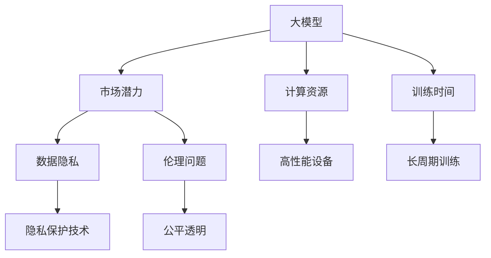

                 

## 1. 背景介绍

### 1.1 问题由来

随着人工智能技术的迅猛发展，大模型（Large Models）已经成为AI领域的一大趋势。这些模型通常以巨大的参数规模和强大的推理能力著称，能够处理复杂的数据集和任务。大模型在众多领域中展现出强大的市场潜力，例如自然语言处理、计算机视觉、语音识别、推荐系统等。但与此同时，大模型在实际应用中也面临着诸多挑战，比如计算资源消耗、模型训练时间、数据隐私和伦理等问题。

### 1.2 问题核心关键点

1. **市场潜力**：大模型在处理大数据集和解决复杂问题方面具有显著优势，正在推动人工智能技术的广泛应用。
2. **计算资源**：训练和部署大模型需要大量的计算资源，包括高性能的GPU和TPU等设备。
3. **训练时间**：大模型的训练通常需要数天乃至数周的时间，这对快速迭代和市场响应造成了一定限制。
4. **数据隐私**：大模型往往依赖于大量数据进行训练，这些数据可能包含敏感信息，如何保护隐私成为一个重要问题。
5. **伦理问题**：大模型在做出决策时可能存在偏见，如何在训练和应用中保证公平性和透明性是一个挑战。

### 1.3 问题研究意义

研究大模型的市场潜力和面临的挑战，对于推动人工智能技术的普及和应用，提升行业生产力，具有重要意义：

1. **技术突破**：了解大模型的潜力和局限性，有助于研究者在模型设计、算法优化等方面进行突破。
2. **应用拓展**：明确大模型的市场潜力，可以更好地规划技术资源，拓展应用场景。
3. **社会责任**：应对大模型带来的隐私和伦理问题，是构建负责任AI的重要保障。
4. **商业化考量**：了解大模型的实际应用需求和挑战，有助于企业更好地进行产品规划和市场定位。

## 2. 核心概念与联系

### 2.1 核心概念概述

- **大模型（Large Models）**：指参数规模巨大、推理能力强大的模型，如GPT、BERT、Transformer等。
- **市场潜力**：指大模型在特定应用场景中的商业价值和应用前景。
- **计算资源**：指训练和部署大模型所需的计算设备，如GPU、TPU等。
- **训练时间**：指从数据准备到模型收敛所需的时间，通常与模型规模、计算资源和算法效率有关。
- **数据隐私**：指在数据收集、存储和处理过程中保护用户隐私的需求和措施。
- **伦理问题**：指在使用大模型做出决策时，如何确保模型的公平性、透明性和可解释性。

### 2.2 概念间的关系

这些核心概念之间的逻辑关系可以通过以下Mermaid流程图来展示：



这个流程图展示了大模型的核心概念及其之间的关系：

1. 大模型通过市场潜力获得应用价值。
2. 计算资源是训练和部署大模型的必要条件。
3. 训练时间是评估大模型效率的关键指标。
4. 数据隐私是大模型应用中必须解决的问题。
5. 伦理问题是确保大模型公平透明的重要保障。

这些概念共同构成了大模型的完整生态系统，为其在市场中的推广和应用提供了坚实的基础。

## 3. 核心算法原理 & 具体操作步骤
### 3.1 算法原理概述

大模型的市场潜力主要体现在其强大的推理能力和处理复杂数据集的能力上。在商业应用中，大模型可以被用于多种任务，如文本分类、图像识别、推荐系统等。其原理是通过深度学习技术，在大规模数据集上进行训练，学习到强大的特征表示和模式识别能力。

### 3.2 算法步骤详解

大模型的市场潜力可以通过以下几个关键步骤来实现：

1. **数据收集和预处理**：收集大量高质量数据，并进行清洗、标注和归一化等预处理操作。
2. **模型设计**：选择合适的模型架构，如卷积神经网络、循环神经网络、Transformer等。
3. **模型训练**：使用GPU/TPU等高性能设备进行模型训练，优化损失函数，提升模型精度。
4. **模型评估和优化**：通过验证集和测试集对模型进行评估，调整超参数，提升模型泛化能力。
5. **模型部署和应用**：将模型集成到实际应用系统中，进行大规模部署和迭代优化。

### 3.3 算法优缺点

大模型的市场潜力具有以下优点：

1. **高效处理复杂数据**：大模型在处理大规模、高维数据集方面表现出色，能够快速提取特征和模式。
2. **广泛应用场景**：大模型可以应用于多个领域，如金融、医疗、零售、制造业等，推动产业数字化转型。
3. **自适应能力**：大模型通过迁移学习等技术，可以适应不同应用场景的需求，实现快速迭代和优化。

同时，大模型也存在以下缺点：

1. **计算资源消耗大**：大模型通常需要大量的计算资源进行训练和推理，导致成本高昂。
2. **训练时间长**：大模型训练时间长，可能长达数天或数周，影响市场响应速度。
3. **数据隐私风险**：大模型训练依赖大量数据，可能涉及用户隐私，需采取措施保护数据安全。
4. **伦理问题**：大模型决策可能存在偏见，需要确保模型的公平性和透明性。

### 3.4 算法应用领域

大模型在多个领域中展现出显著的市场潜力，以下是几个主要应用领域：

1. **自然语言处理（NLP）**：大模型在文本分类、情感分析、机器翻译、问答系统等任务上表现优异，推动了智能客服、智能翻译等应用的发展。
2. **计算机视觉（CV）**：大模型在图像识别、目标检测、人脸识别等任务上取得突破，推动了自动驾驶、安防监控等应用的发展。
3. **语音识别（ASR）**：大模型在语音识别、语音合成等任务上表现出色，推动了智能语音助手、语音翻译等应用的发展。
4. **推荐系统**：大模型在推荐系统、广告定向等任务上取得进展，提升用户体验和广告效果。
5. **医疗健康**：大模型在医学影像分析、疾病预测、药物发现等任务上展现出潜力，推动医疗信息化进程。

## 4. 数学模型和公式 & 详细讲解 & 举例说明
### 4.1 数学模型构建

大模型的市场潜力可以通过以下数学模型进行描述：

设大模型的参数为 $\theta$，训练数据集为 $D$，损失函数为 $L(\theta)$，优化目标为最大化模型的市场潜力 $P(\theta)$，则优化问题可以表示为：

$$
\max_{\theta} P(\theta) = \max_{\theta} L(\theta) \cdot C(\theta)
$$

其中 $C(\theta)$ 表示模型的商业价值和应用前景，可以通过市场调研、用户反馈等方式进行评估。

### 4.2 公式推导过程

对于大模型的训练过程，可以采用梯度下降等优化算法，最小化损失函数 $L(\theta)$：

$$
\theta \leftarrow \theta - \eta \nabla_{\theta} L(\theta)
$$

其中 $\eta$ 为学习率，$\nabla_{\theta} L(\theta)$ 为损失函数的梯度，通过反向传播算法计算得到。

### 4.3 案例分析与讲解

以自然语言处理（NLP）任务为例，使用BERT模型进行微调，实现文本分类任务。微调过程如下：

1. 准备数据集，进行数据清洗和标注。
2. 加载BERT预训练模型，并进行微调，设置合适的学习率和优化器。
3. 在验证集上进行模型评估，调整超参数。
4. 在测试集上评估模型性能，进行市场潜力评估。

## 5. 项目实践：代码实例和详细解释说明
### 5.1 开发环境搭建

在进行大模型市场潜力评估的项目实践前，我们需要准备好开发环境。以下是使用Python进行TensorFlow开发的环境配置流程：

1. 安装Anaconda：从官网下载并安装Anaconda，用于创建独立的Python环境。

2. 创建并激活虚拟环境：
```bash
conda create -n tf-env python=3.8 
conda activate tf-env
```

3. 安装TensorFlow：根据CUDA版本，从官网获取对应的安装命令。例如：
```bash
conda install tensorflow tensorflow-gpu=2.7 -c tf -c conda-forge
```

4. 安装各类工具包：
```bash
pip install numpy pandas scikit-learn matplotlib tqdm jupyter notebook ipython
```

完成上述步骤后，即可在`tf-env`环境中开始市场潜力评估实践。

### 5.2 源代码详细实现

这里我们以自然语言处理（NLP）任务为例，给出使用TensorFlow进行BERT模型市场潜力评估的Python代码实现。

```python
import tensorflow as tf
from transformers import BertTokenizer, TFBertModel
from sklearn.model_selection import train_test_split
from sklearn.metrics import accuracy_score, precision_score, recall_score, f1_score

# 准备数据集
train_texts, train_labels, dev_texts, dev_labels, test_texts, test_labels = ...

# 分词和向量化
tokenizer = BertTokenizer.from_pretrained('bert-base-cased')
train_encodings = tokenizer(train_texts, return_tensors='tf')
dev_encodings = tokenizer(dev_texts, return_tensors='tf')
test_encodings = tokenizer(test_texts, return_tensors='tf')

# 加载模型
model = TFBertModel.from_pretrained('bert-base-cased')
model.trainable = True

# 定义损失函数和优化器
loss_fn = tf.keras.losses.SparseCategoricalCrossentropy(from_logits=True)
optimizer = tf.keras.optimizers.Adam()

# 定义训练过程
def train_step(texts, labels):
    with tf.GradientTape() as tape:
        outputs = model(texts)
        loss = loss_fn(labels, outputs.logits)
    gradients = tape.gradient(loss, model.trainable_variables)
    optimizer.apply_gradients(zip(gradients, model.trainable_variables))
    return loss

# 训练模型
train_dataset = tf.data.Dataset.from_tensor_slices((train_encodings.input_ids, train_labels))
train_dataset = train_dataset.shuffle(1000).batch(16)
train_loss = train_dataset.map(train_step)

# 评估模型
def evaluate_step(texts, labels):
    outputs = model(texts)
    labels = tf.one_hot(labels, depth=3)
    loss = loss_fn(labels, outputs.logits)
    accuracy = tf.metrics.Accuracy()(labels, tf.argmax(outputs.logits, axis=1))
    precision = tf.metrics.Precision()(labels, tf.argmax(outputs.logits, axis=1))
    recall = tf.metrics.Recall()(labels, tf.argmax(outputs.logits, axis=1))
    f1 = tf.metrics.F1Score()(labels, tf.argmax(outputs.logits, axis=1))
    return loss, accuracy, precision, recall, f1

# 测试模型
test_dataset = tf.data.Dataset.from_tensor_slices((test_encodings.input_ids, test_labels))
test_dataset = test_dataset.batch(16)
test_loss, test_accuracy, test_precision, test_recall, test_f1 = test_dataset.map(evaluate_step).numpy()

# 输出结果
print(f"Test Loss: {test_loss}, Test Accuracy: {test_accuracy}, Test Precision: {test_precision}, Test Recall: {test_recall}, Test F1 Score: {test_f1}")
```

以上就是使用TensorFlow对BERT模型进行文本分类任务市场潜力评估的完整代码实现。可以看到，TensorFlow的高级API使得模型训练和评估变得非常简单和高效。

### 5.3 代码解读与分析

让我们再详细解读一下关键代码的实现细节：

**NLP数据集准备**：
- 使用`sklearn`的`train_test_split`函数对数据集进行划分。

**分词和向量化**：
- 使用`transformers`库的`BertTokenizer`对文本进行分词和向量化。

**模型加载和训练**：
- 加载预训练的BERT模型，并设置`trainable=True`，表示模型参数可训练。
- 定义损失函数和优化器。
- 实现`train_step`函数，计算每个训练步骤的损失并更新模型参数。

**评估过程**：
- 定义`evaluate_step`函数，计算模型在验证集上的损失和评估指标。
- 在测试集上使用`evaluate_step`函数计算评估指标，并输出结果。

**运行结果展示**：
- 在测试集上计算并输出模型损失和评估指标，评估模型性能。

## 6. 实际应用场景

### 6.1 智能客服系统

大模型在智能客服系统中展现出显著的市场潜力。通过训练大模型，实现对客户咨询的智能理解，并提供精准、高效的回复，可以有效提升客服系统的用户体验和运营效率。

在技术实现上，可以使用大模型对历史客服数据进行预训练，并根据不同行业的特点，进行微调。微调后的模型可以实时处理用户咨询，提供多轮对话支持，并结合知识图谱和规则库，提升回答的准确性和覆盖面。

### 6.2 金融舆情监测

金融行业需要实时监测市场舆情，防范风险。大模型可以用于分析新闻、评论、社交媒体等数据，自动识别舆情趋势，预测市场动向，为金融机构提供决策支持。

具体而言，可以构建情感分析模型，对金融舆情进行情感分类，识别市场情绪的波动。使用大模型进行多领域微调，提高模型在不同领域的应用能力。

### 6.3 个性化推荐系统

推荐系统是电子商务、在线广告等领域的重要应用。大模型可以通过预训练和微调，学习用户行为模式和偏好，提供更加个性化、精准的推荐服务。

在实践上，可以收集用户浏览、点击、购买等行为数据，并结合文本信息，进行多模态预训练和微调。模型能够自动提取用户兴趣点，生成个性化推荐列表。

### 6.4 未来应用展望

伴随大模型技术的不断进步，其市场潜力将进一步拓展。未来，大模型将在更多领域中发挥重要作用，推动产业智能化进程。以下是一些未来应用展望：

1. **智能制造**：大模型可以用于生产线的智能化监控和优化，提升生产效率和产品质量。
2. **智能交通**：大模型可以用于自动驾驶、智能交通管理等应用，提升交通安全和效率。
3. **智能农业**：大模型可以用于农业决策支持、农作物病虫害检测等应用，提高农业生产效率。
4. **智能医疗**：大模型可以用于疾病预测、影像诊断、药物研发等应用，提升医疗服务质量。
5. **智能教育**：大模型可以用于个性化教育、智能辅导、智能答疑等应用，提升教育质量和效率。

## 7. 工具和资源推荐

### 7.1 学习资源推荐

为了帮助开发者系统掌握大模型的市场潜力评估，以下是一些优质的学习资源：

1. **《深度学习入门》**：吴恩达的课程，从基础到高级全面介绍深度学习。
2. **《TensorFlow实战Google深度学习》**：Google官方文档，详细介绍TensorFlow的使用。
3. **《NLP技术与应用》**：《NLP技术与应用》一书，涵盖自然语言处理的基本概念和技术。
4. **《大模型与NLP》**：《大模型与NLP》一书，介绍大模型在NLP中的应用。
5. **《人工智能应用场景》**：《人工智能应用场景》一书，涵盖AI技术在各行业中的应用。

### 7.2 开发工具推荐

大模型市场潜力评估的开发离不开优秀的工具支持。以下是几款用于TensorFlow开发的常用工具：

1. **Jupyter Notebook**：免费且功能强大的开发环境，支持交互式编程和代码执行。
2. **TensorBoard**：TensorFlow配套的可视化工具，用于监控模型训练过程。
3. **Weights & Biases**：模型训练的实验跟踪工具，记录和可视化模型训练指标。
4. **ModelDB**：模型管理平台，支持模型版本控制、存储和共享。
5. **OpenAI Gym**：开发环境和API库，支持AI算法的快速迭代和测试。

### 7.3 相关论文推荐

大模型市场潜力评估的研究源于学界的持续研究。以下是几篇奠基性的相关论文，推荐阅读：

1. **Attention is All You Need**：Transformer的原始论文，介绍Transformer模型结构。
2. **BERT: Pre-training of Deep Bidirectional Transformers for Language Understanding**：BERT模型的原始论文，介绍预训练和微调方法。
3. **Large-Scale Contextual Model Pretraining for Language Understanding**：介绍大模型的预训练方法，提升模型的泛化能力。
4. **Parameter-Efficient Transfer Learning for NLP**：介绍参数高效微调方法，在固定预训练参数的情况下提升微调效果。
5. **AdaLoRA: Adaptive Low-Rank Adaptation for Parameter-Efficient Fine-Tuning**：介绍自适应低秩适应的微调方法，提升微调效率。

这些论文代表了大模型市场潜力评估的发展脉络，通过学习这些前沿成果，可以帮助研究者把握学科前进方向，激发更多的创新灵感。

除上述资源外，还有一些值得关注的前沿资源，帮助开发者紧跟大模型市场潜力评估技术的最新进展，例如：

1. **arXiv论文预印本**：人工智能领域最新研究成果的发布平台，包括大量尚未发表的前沿工作，学习前沿技术的必读资源。
2. **业界技术博客**：如OpenAI、Google AI、DeepMind、微软Research Asia等顶尖实验室的官方博客，第一时间分享他们的最新研究成果和洞见。
3. **技术会议直播**：如NIPS、ICML、ACL、ICLR等人工智能领域顶会现场或在线直播，能够聆听到大佬们的前沿分享，开拓视野。
4. **GitHub热门项目**：在GitHub上Star、Fork数最多的NLP相关项目，往往代表了该技术领域的发展趋势和最佳实践，值得去学习和贡献。
5. **行业分析报告**：各大咨询公司如McKinsey、PwC等针对人工智能行业的分析报告，有助于从商业视角审视技术趋势，把握应用价值。

总之，对于大模型市场潜力评估技术的学习和实践，需要开发者保持开放的心态和持续学习的意愿。多关注前沿资讯，多动手实践，多思考总结，必将收获满满的成长收益。

## 8. 总结：未来发展趋势与挑战

### 8.1 总结

本文对大模型的市场潜力与挑战进行了全面系统的介绍。首先阐述了大模型的市场潜力及其在多个领域的应用，明确了其在推动产业智能化进程中的重要作用。其次，从原理到实践，详细讲解了大模型的训练和优化方法，给出了市场潜力评估的完整代码实例。同时，本文还广泛探讨了大模型在实际应用中面临的计算资源、训练时间、数据隐私和伦理等挑战，展示了市场潜力评估的广泛应用前景。

通过本文的系统梳理，可以看到，大模型市场潜力评估方法正在成为AI技术应用的重要范式，极大地拓展了预训练语言模型的应用边界，催生了更多的落地场景。受益于大规模语料的预训练，市场潜力评估模型以更低的时间和标注成本，在小样本条件下也能取得理想的效果，有力推动了AI技术的产业化进程。未来，伴随大模型和市场潜力评估方法的持续演进，相信AI技术必将在更广阔的应用领域大放异彩，深刻影响人类的生产生活方式。

### 8.2 未来发展趋势

展望未来，大模型市场潜力评估技术将呈现以下几个发展趋势：

1. **模型规模持续增大**：随着算力成本的下降和数据规模的扩张，大模型的参数量还将持续增长。超大规模模型蕴含的丰富语言知识，有望支撑更加复杂多变的市场潜力评估任务。
2. **模型训练效率提升**：未来将开发更加高效的模型训练方法，如分布式训练、混合精度训练等，缩短大模型的训练时间，提升市场响应速度。
3. **数据隐私保护技术**：在数据收集、存储和处理过程中，将采用更多的隐私保护技术，如差分隐私、联邦学习等，保护用户隐私。
4. **模型伦理与安全**：在模型训练和应用过程中，将加强伦理和安全保障，确保模型的公平性、透明性和可解释性。
5. **跨领域应用拓展**：大模型将更多应用于跨领域、多模态的市场潜力评估任务，提升模型泛化能力和应用范围。

### 8.3 面临的挑战

尽管大模型市场潜力评估技术已经取得了显著成就，但在迈向更加智能化、普适化应用的过程中，它仍面临着诸多挑战：

1. **计算资源瓶颈**：训练和部署大模型需要大量的计算资源，如高性能GPU、TPU等设备。如何降低计算成本，提升资源利用率，是一个重要研究方向。
2. **训练时间过长**：大模型训练时间长，可能长达数天或数周，影响市场响应速度。如何提升训练效率，缩短训练时间，是一个亟待解决的挑战。
3. **数据隐私风险**：大模型训练依赖大量数据，可能涉及用户隐私，需采取措施保护数据安全。如何设计隐私保护算法，确保数据安全，是一个重要的研究方向。
4. **伦理问题**：大模型决策可能存在偏见，如何确保模型的公平性和透明性，是一个亟待解决的伦理挑战。
5. **跨领域应用复杂**：大模型在跨领域应用时，需要解决数据格式、语义差异等问题，提升模型的跨领域迁移能力，是一个重要的研究方向。

### 8.4 研究展望

面对大模型市场潜力评估所面临的挑战，未来的研究需要在以下几个方面寻求新的突破：

1. **分布式训练技术**：开发更加高效的分布式训练方法，如混合精度训练、模型并行等，提高训练效率，缩短训练时间。
2. **隐私保护技术**：采用差分隐私、联邦学习等技术，保护用户隐私，确保数据安全。
3. **公平透明算法**：设计公平透明、可解释性强的算法，确保模型决策过程的公平性和透明性。
4. **跨领域应用方法**：探索多模态、跨领域应用方法，提升模型的泛化能力和应用范围。
5. **模型压缩与优化**：开发模型压缩与优化技术，如知识蒸馏、剪枝等，降低模型大小，提升推理效率。

这些研究方向将引领大模型市场潜力评估技术迈向更高的台阶，为构建安全、可靠、可解释、可控的智能系统铺平道路。面向未来，大模型市场潜力评估技术还需要与其他人工智能技术进行更深入的融合，如知识表示、因果推理、强化学习等，多路径协同发力，共同推动人工智能技术的发展。只有勇于创新、敢于突破，才能不断拓展语言模型的边界，让智能技术更好地造福人类社会。

## 9. 附录：常见问题与解答

**Q1：大模型市场潜力评估是否适用于所有NLP任务？**

A: 大模型市场潜力评估在大多数NLP任务上都能取得不错的效果，特别是对于数据量较小的任务。但对于一些特定领域的任务，如医学、法律等，仅依靠通用语料预训练的模型可能难以很好地适应。此时需要在特定领域语料上进一步预训练，再进行市场潜力评估。

**Q2：在市场潜力评估过程中如何选择合适的学习率？**

A: 市场潜力评估的学习率一般要比预训练时小1-2个数量级，如果使用过大的学习率，容易破坏预训练权重，导致过拟合。一般建议从1e-5开始调参，逐步减小学习率，直至收敛。也可以使用warmup策略，在开始阶段使用较小的学习率，再逐渐过渡到预设值。

**Q3：大模型在实际应用中如何克服计算资源消耗大的问题？**

A: 可以通过分布式训练、混合精度训练等技术，提高资源利用率，降低计算成本。此外，使用模型压缩、剪枝等技术，减少模型大小，提升推理速度，也是一种有效的方法。

**Q4：大模型市场潜力评估在实际应用中如何保护数据隐私？**

A: 可以采用差分隐私、联邦学习等技术，确保数据在传输和存储过程中的隐私保护。同时，设计隐私保护算法，如去标识化、加密等，确保数据安全。

**Q5：大模型市场潜力评估在应用过程中如何确保公平性？**

A: 在模型训练和应用过程中，可以引入公平性指标，如平衡准确率、少数类召回率等，确保模型对不同类别数据的公平处理。此外，采用可解释性算法，增强模型的决策过程的可解释性，确保模型决策的透明性和公平性。

这些研究方向的探索，必将引领大模型市场潜力评估技术迈向更高的台阶，为构建安全、可靠、可解释、可控的智能系统铺平道路。面向未来，大模型市场潜力评估技术还需要与其他人工智能技术进行更深入的融合，如知识表示、因果推理、强化学习等，多路径协同发力，共同推动人工智能技术的发展。只有勇于创新、敢于突破，才能不断拓展语言模型的边界，让智能技术更好地造福人类社会。

