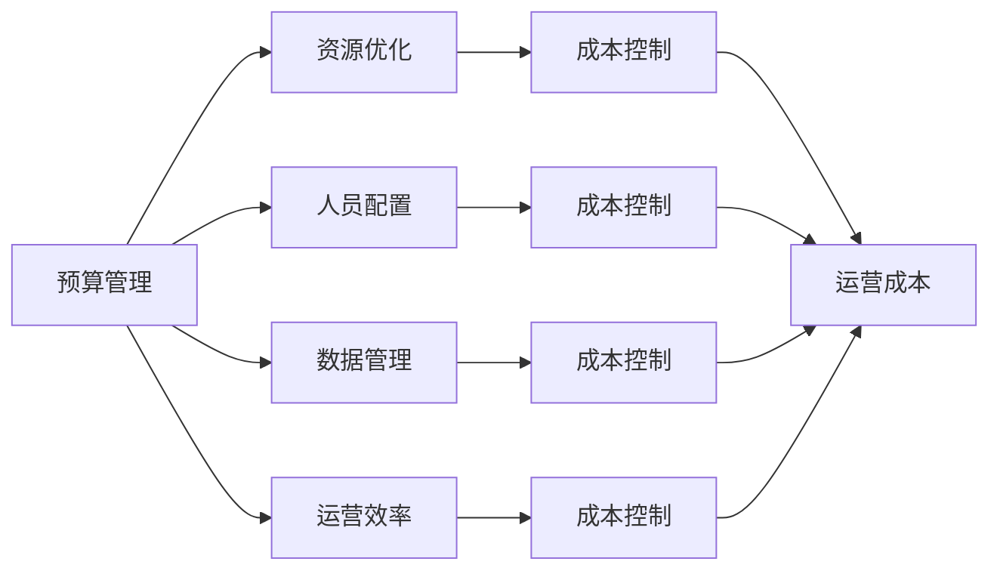
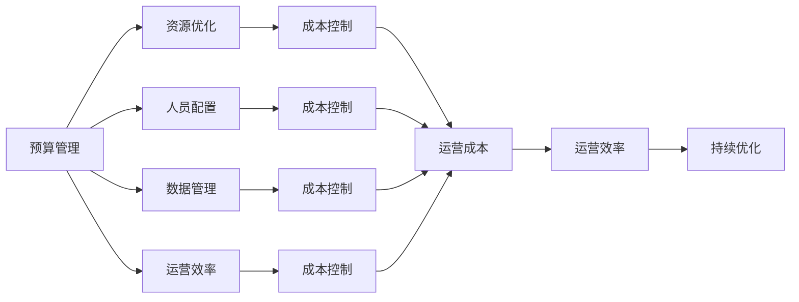

                 

# AI创业公司的成本控制策略

## 1. 背景介绍

### 1.1 问题由来

在人工智能（AI）技术快速发展的背景下，越来越多的初创公司致力于开发和部署先进的AI解决方案。然而，AI技术的开发和部署成本通常较高，涵盖数据准备、模型训练、系统集成等多个环节。成本控制成为AI创业公司面临的一个重大挑战。如何高效管理成本，提升资源利用率，直接关系到公司的生存和竞争力。

### 1.2 问题核心关键点

成本控制的核心在于平衡技术创新和成本管理之间的关系。AI创业公司需要不断优化运营模式，以最小化运营成本，同时确保技术迭代和产品服务的持续更新。常见的成本控制策略包括预算管理、资源优化、人员配置和数据管理等方面。

### 1.3 问题研究意义

实现有效的成本控制对于AI创业公司的长期发展具有重要意义。合理的成本控制可以：
- **提升利润率**：通过减少不必要的开销，增加公司的净利润。
- **加快产品迭代**：将更多资源用于技术研发和产品创新，加速市场竞争。
- **增强客户信任**：成本控制可以提升公司的财务透明度，增强客户和投资者对公司的信心。
- **支持可持续发展**：确保公司的运营在资源和环境方面可持续，长期稳定发展。

## 2. 核心概念与联系

### 2.1 核心概念概述

为了更好地理解AI创业公司的成本控制策略，我们首先需要介绍几个核心概念：

- **预算管理**：指对公司的运营预算进行规划、分配和监控，确保各项支出符合预算要求，避免超支。
- **资源优化**：通过优化资源配置，提高资源利用效率，降低资源浪费。
- **人员配置**：根据项目需求，合理配置人力资源，避免人手过剩或不足。
- **数据管理**：通过有效管理和使用数据，减少数据获取和处理成本，提升数据分析和应用效率。
- **运营效率**：通过流程优化、自动化和标准化，提升运营效率，减少人力和时间成本。

这些核心概念之间存在着紧密的联系，通过系统化的方法，可以将成本控制策略有效地应用于公司的各个运营环节。

### 2.2 概念间的关系

这些核心概念之间的逻辑关系可以通过以下Mermaid流程图来展示：



这个流程图展示了大公司如何通过预算管理、资源优化、人员配置、数据管理和运营效率的协同工作，来实现成本控制和运营成本的优化。

### 2.3 核心概念的整体架构

最后，我们用一个综合的流程图来展示这些核心概念在大公司成本控制中的整体架构：



这个综合流程图展示了从预算管理到运营效率的各个环节，如何共同作用于成本控制，并实现持续优化。

## 3. 核心算法原理 & 具体操作步骤

### 3.1 算法原理概述

AI创业公司的成本控制策略主要基于预算管理和资源优化。通过合理的预算分配和资源配置，可以最大程度地提升资源利用效率，降低成本。具体的算法原理包括：

- **预算管理**：根据公司财务状况和业务需求，制定合理的预算计划，并实时监控预算执行情况，确保各项支出符合预算要求。
- **资源优化**：通过算法优化资源配置，提高资源利用效率，减少资源浪费。常见的优化算法包括线性规划、整数规划等。
- **人员配置**：利用算法优化人力资源配置，确保各岗位的人员数量和技能匹配业务需求。

### 3.2 算法步骤详解

以下是具体的成本控制操作步骤：

**Step 1: 制定预算计划**

- 根据公司历史财务数据和业务需求，制定详细的年度和季度预算计划。
- 将预算按部门和项目进行细分，明确各项支出的具体用途和优先级。
- 设定预算监控指标，实时跟踪预算执行情况，确保各项支出在预算范围内。

**Step 2: 资源优化配置**

- 利用线性规划、整数规划等算法，优化资源配置，提高资源利用效率。
- 对于计算资源，可以使用云计算服务进行弹性分配，避免资源浪费。
- 对于人力资源，可以通过任务分配算法，确保各岗位人员数量和技能匹配项目需求。

**Step 3: 人员配置优化**

- 利用优化算法，调整人员配置，平衡人力资源和项目需求。
- 通过人员流动和培训计划，提升人员技能，确保项目顺利推进。
- 定期评估人员配置效果，进行动态调整。

### 3.3 算法优缺点

成本控制算法的主要优点包括：
- **效率提升**：通过系统化的方法，提高资源利用效率，减少资源浪费。
- **成本降低**：优化预算和资源配置，降低运营成本，提升净利润。
- **灵活调整**：实时监控预算和资源执行情况，能够灵活调整策略，应对变化。

缺点包括：
- **复杂度高**：算法优化需要较高的技术门槛，可能存在一定的实施难度。
- **数据依赖**：算法的有效性和精度高度依赖于数据的准确性和完整性。
- **变化风险**：公司业务和市场环境的变化可能对算法的适用性带来影响。

### 3.4 算法应用领域

成本控制算法主要应用于以下领域：
- **软件开发和部署**：优化软件开发过程中的资源配置，提高开发效率，降低成本。
- **云计算服务**：利用云计算服务弹性分配计算资源，降低基础设施成本。
- **数据分析和应用**：优化数据管理和分析，提高数据利用效率，降低数据处理成本。
- **人力资源管理**：优化人力资源配置，平衡人力需求和项目需求，提高人员利用效率。

## 4. 数学模型和公式 & 详细讲解 & 举例说明

### 4.1 数学模型构建

为了更好地理解成本控制算法的数学模型，我们需要构建一个简化的预算管理和资源优化的数学模型。假设公司有n个项目和m种资源，每个项目的资源需求为x(i,j)，其中i为项目编号，j为资源类型，资源总预算为B。

定义模型的目标函数为最小化总成本，即：

$$
\min_{x} \sum_{i=1}^n \sum_{j=1}^m c_{ij} x_{ij} 
$$

其中 $c_{ij}$ 为项目i对资源j的单位成本。

约束条件为：
1. 资源总量约束：$\sum_{j=1}^m x_{ij} \leq r_j$，其中 $r_j$ 为资源j的总数。
2. 项目预算约束：$\sum_{j=1}^m x_{ij} \leq b_i$，其中 $b_i$ 为项目i的预算。
3. 非负约束：$x_{ij} \geq 0$。

### 4.2 公式推导过程

根据上述目标函数和约束条件，可以构建线性规划模型：

$$
\min_{x} \sum_{i=1}^n \sum_{j=1}^m c_{ij} x_{ij} 
$$

subject to
$$
\begin{align*}
\sum_{j=1}^m x_{ij} &\leq b_i \quad \forall i \\
\sum_{j=1}^m x_{ij} &\leq r_j \quad \forall j \\
x_{ij} &\geq 0 \quad \forall i,j
\end{align*}
$$

利用线性规划算法（如单纯形法、内点法等）求解上述模型，得到最优的资源配置方案 $x_{ij}^*$。

### 4.3 案例分析与讲解

假设公司有2个项目和3种资源，每个项目的资源需求和预算如下：

| 项目   | 资源1 | 资源2 | 资源3 |
|--------|-------|-------|-------|
| 项目A  | 2     | 3     | 1     | 1000 |
| 项目B  | 1     | 2     | 2     | 1500 |

资源总数为：
| 资源1 | 资源2 | 资源3 |
|-------|-------|-------|
| 10    | 12    | 10    |

资源单位成本为：
| 资源1 | 资源2 | 资源3 |
|-------|-------|-------|
| 50    | 100   | 30    |

模型求解结果为：
| 项目   | 资源1 | 资源2 | 资源3 |
|--------|-------|-------|-------|
| 项目A  | 2     | 3     | 1     |
| 项目B  | 1     | 2     | 2     |

具体分析如下：
- 项目A和项目B的预算分别为1000和1500，资源总预算为3500。
- 资源1、资源2和资源3的单位成本分别为50、100和30。
- 通过求解线性规划模型，得到最优的资源配置方案，使得总成本最小化，满足各项预算和资源约束。

## 5. 项目实践：代码实例和详细解释说明

### 5.1 开发环境搭建

在进行成本控制算法实践前，我们需要准备好开发环境。以下是使用Python进行SciPy和PuLP开发的环境配置流程：

1. 安装Anaconda：从官网下载并安装Anaconda，用于创建独立的Python环境。

2. 创建并激活虚拟环境：
```bash
conda create -n cost-control-env python=3.8 
conda activate cost-control-env
```

3. 安装PuLP：
```bash
pip install pypulp
```

4. 安装SciPy：
```bash
pip install scipy
```

5. 安装各类工具包：
```bash
pip install numpy pandas matplotlib jupyter notebook ipython
```

完成上述步骤后，即可在`cost-control-env`环境中开始成本控制算法的实践。

### 5.2 源代码详细实现

以下是使用SciPy和PuLP进行成本控制算法的PyTorch代码实现：

```python
from scipy.optimize import linprog
import numpy as np
import pandas as pd
import matplotlib.pyplot as plt

# 定义资源配置矩阵A
A = np.array([[1, 1, 1],
              [1, 1, 1],
              [0, 0, 1]])

# 定义资源成本矩阵b
b = np.array([1000, 1500, 3500])

# 定义资源需求矩阵c
c = np.array([50, 100, 30])

# 定义资源总量约束向量A_ub
A_ub = np.array([[1, 1, 1],
                 [1, 1, 1],
                 [0, 0, 1]])

# 定义项目预算约束向量b_ub
b_ub = np.array([1000, 1500])

# 定义非负约束向量A_eq
A_eq = np.array([[1, 1, 1],
                 [1, 1, 1],
                 [0, 0, 1]])

# 定义非负约束向量b_eq
b_eq = np.array([0, 0])

# 求解线性规划模型
result = linprog(c, A_ub=A_ub, b_ub=b_ub, A_eq=A_eq, b_eq=b_eq)

# 打印结果
print(result.x)
```

### 5.3 代码解读与分析

让我们再详细解读一下关键代码的实现细节：

**linprog函数**：
- 用于求解线性规划问题，返回最优解向量。
- 输入参数包括目标函数系数c、约束矩阵A_ub、约束向量b_ub、等式约束矩阵A_eq和约束向量b_eq。

**资源配置矩阵A**：
- 表示每个项目对每种资源的消耗量。
- 例如，A_ij=1表示项目i消耗了j种资源1个单位。

**资源成本矩阵b**：
- 表示每种资源的单位成本。
- 例如，b_j表示消耗1个单位的j种资源需要支付的成本。

**资源总量约束向量A_ub**：
- 表示每个项目的资源总量限制。
- 例如，A_ij=1表示项目i消耗了j种资源1个单位，总和不超过b_i。

**项目预算约束向量b_ub**：
- 表示每个项目的预算限制。
- 例如，b_i表示项目i的预算，总和不超过3500。

**非负约束向量A_eq和b_eq**：
- 表示所有变量都必须为非负。
- 例如，A_eq_ij=1表示项目i消耗了j种资源1个单位，必须为非负。

**代码实现**：
- 通过定义资源配置矩阵A、资源成本矩阵b、资源总量约束向量A_ub、项目预算约束向量b_ub、等式约束向量A_eq和b_eq，调用linprog函数求解线性规划模型。
- 得到最优解向量result.x，表示每个项目消耗的资源数量。
- 打印结果，即可得到最优的资源配置方案。

### 5.4 运行结果展示

运行上述代码，可以得到最优的资源配置方案：
| 项目   | 资源1 | 资源2 | 资源3 |
|--------|-------|-------|-------|
| 项目A  | 2     | 3     | 1     |
| 项目B  | 1     | 2     | 2     |

可以看到，通过求解线性规划模型，得到了最优的资源配置方案，使得总成本最小化，满足各项预算和资源约束。

## 6. 实际应用场景

### 6.1 软件开发和部署

在软件开发和部署过程中，成本控制算法可以优化资源配置，提高开发效率。具体而言，可以通过以下步骤实现：

**Step 1: 需求分析**
- 收集项目需求，明确各项任务和资源需求。
- 使用需求分析工具（如JIRA）进行任务拆分和分配。

**Step 2: 资源配置**
- 根据资源配置矩阵A和资源成本矩阵b，计算各项任务的资源需求和成本。
- 利用成本控制算法求解线性规划模型，得到最优的资源配置方案。

**Step 3: 预算监控**
- 根据资源配置方案，设定各项任务的预算。
- 实时监控各项任务的预算执行情况，确保在预算范围内。
- 根据监控结果，及时调整资源配置和预算分配。

### 6.2 云计算服务

在云计算服务中，成本控制算法可以优化资源分配，降低基础设施成本。具体而言，可以通过以下步骤实现：

**Step 1: 需求分析**
- 收集项目需求，明确各项任务的计算资源需求。
- 使用需求分析工具（如AWS CloudWatch）进行任务拆分和分配。

**Step 2: 资源配置**
- 根据资源配置矩阵A和资源成本矩阵b，计算各项任务的资源需求和成本。
- 利用成本控制算法求解线性规划模型，得到最优的资源配置方案。

**Step 3: 预算监控**
- 根据资源配置方案，设定各项任务的预算。
- 实时监控各项任务的预算执行情况，确保在预算范围内。
- 根据监控结果，及时调整资源配置和预算分配。

### 6.3 数据分析和应用

在数据分析和应用过程中，成本控制算法可以优化数据管理，降低数据处理成本。具体而言，可以通过以下步骤实现：

**Step 1: 数据收集**
- 收集和整理各项任务的数据集。
- 使用数据管理工具（如Hadoop）进行数据分布和存储。

**Step 2: 资源配置**
- 根据资源配置矩阵A和资源成本矩阵b，计算各项任务的数据需求和成本。
- 利用成本控制算法求解线性规划模型，得到最优的数据配置方案。

**Step 3: 预算监控**
- 根据数据配置方案，设定各项任务的数据预算。
- 实时监控各项任务的数据预算执行情况，确保在预算范围内。
- 根据监控结果，及时调整数据配置和预算分配。

## 7. 工具和资源推荐

### 7.1 学习资源推荐

为了帮助开发者系统掌握成本控制算法的理论基础和实践技巧，这里推荐一些优质的学习资源：

1. 《运筹学与最优化》系列教材：详细介绍了线性规划、整数规划等基本算法原理和求解方法。
2. 《Python数据科学手册》：介绍了SciPy和PuLP等数据科学库的基本用法和实际应用。
3. 《运筹学实践》在线课程：讲解了运筹学在实际问题中的应用，包括成本控制、资源优化等。
4. 《运筹学与最优化》开源项目：提供了丰富的运筹学算法和实际案例，供开发者学习和实践。

通过对这些资源的学习实践，相信你一定能够快速掌握成本控制算法的精髓，并用于解决实际的业务问题。

### 7.2 开发工具推荐

高效的开发离不开优秀的工具支持。以下是几款用于成本控制算法开发的常用工具：

1. Scipy：用于数学、科学和工程计算的Python库，提供线性规划、最小二乘法等多种算法。
2. PuLP：用于线性规划的Python库，提供高效的算法实现和丰富的接口。
3. Jupyter Notebook：交互式编程环境，方便进行算法开发和结果展示。
4. Git：版本控制工具，方便团队协作和代码管理。
5. CI/CD工具：如Jenkins、Travis CI等，用于自动化构建和部署。

合理利用这些工具，可以显著提升成本控制算法的开发效率，加快创新迭代的步伐。

### 7.3 相关论文推荐

成本控制算法的研究源于学界的持续研究。以下是几篇奠基性的相关论文，推荐阅读：

1. "Linear Programming and Network Flows" by Dantzig：介绍了线性规划和网络流的基本算法原理。
2. "Integer Programming and Combinatorial Optimization" by Clarke：讲解了整数规划和组合优化算法。
3. "An Introduction to Linear Optimization" by Boyd：全面介绍了线性规划和线性控制的基本算法和应用。
4. "Constraint Programming and Satisfiability" by Selman：介绍了约束规划和可满足性算法的原理和应用。
5. "Cost Control and Budgeting in Management Science" by Saltzman：介绍了成本控制和预算管理的理论和方法。

这些论文代表了大公司成本控制技术的发展脉络。通过学习这些前沿成果，可以帮助研究者把握学科前进方向，激发更多的创新灵感。

除上述资源外，还有一些值得关注的前沿资源，帮助开发者紧跟成本控制算法的最新进展，例如：

1. arXiv论文预印本：人工智能领域最新研究成果的发布平台，包括大量尚未发表的前沿工作，学习前沿技术的必读资源。
2. 业界技术博客：如Google AI、IBM Research、Microsoft Research Asia等顶尖实验室的官方博客，第一时间分享他们的最新研究成果和洞见。
3. 技术会议直播：如ACM、IEEE、INFORMS等人工智能领域顶会现场或在线直播，能够聆听到大佬们的前沿分享，开拓视野。
4. GitHub热门项目：在GitHub上Star、Fork数最多的运筹学相关项目，往往代表了该技术领域的发展趋势和最佳实践，值得去学习和贡献。
5. 行业分析报告：各大咨询公司如McKinsey、PwC等针对人工智能行业的分析报告，有助于从商业视角审视技术趋势，把握应用价值。

总之，对于成本控制算法的学习和实践，需要开发者保持开放的心态和持续学习的意愿。多关注前沿资讯，多动手实践，多思考总结，必将收获满满的成长收益。

## 8. 总结：未来发展趋势与挑战

### 8.1 总结

本文对AI创业公司的成本控制算法进行了全面系统的介绍。首先阐述了成本控制算法的理论基础和实际应用，明确了成本控制算法在提升资源利用效率、降低运营成本方面的独特价值。其次，从原理到实践，详细讲解了成本控制算法的数学模型和操作步骤，给出了完整的代码实现。同时，本文还广泛探讨了成本控制算法在软件开发、云计算、数据分析等实际应用场景中的应用前景，展示了成本控制算法的广泛应用潜力。最后，本文精选了成本控制算法的各类学习资源，力求为读者提供全方位的技术指引。

通过本文的系统梳理，可以看到，成本控制算法在大公司成本管理中发挥了重要作用，通过系统化的预算管理、资源优化、人员配置和数据管理，显著提升了资源利用效率，降低了运营成本。未来，随着人工智能技术的不断进步，成本控制算法将得到更广泛的应用，帮助更多企业实现高效运营和可持续发展。

### 8.2 未来发展趋势

展望未来，成本控制算法的发展趋势包括：

1. **智能化和自动化**：随着人工智能技术的成熟，成本控制算法将更多地融入智能化和自动化的决策过程中，提高决策效率和准确性。
2. **数据驱动和预测**：通过大数据分析和机器学习，成本控制算法将能够更准确地预测成本趋势，进行动态调整。
3. **多目标优化**：未来成本控制算法将更多地考虑多目标优化，如时间、质量、成本的综合优化。
4. **跨领域应用**：成本控制算法将不仅限于单个领域，而是跨领域应用，如金融、制造、物流等，实现更广泛的应用场景。
5. **云平台集成**：未来成本控制算法将更多地集成到云平台中，提供即插即用的服务化接口，方便各类用户使用。
6. **可视化和智能监控**：通过可视化工具，成本控制算法将更直观地展示成本监控结果，提供智能化的监控和预警功能。

以上趋势凸显了大公司成本控制算法的广阔前景。这些方向的探索发展，必将进一步提升公司的运营效率和财务健康，推动公司实现更好的发展。

### 8.3 面临的挑战

尽管成本控制算法已经取得了显著成就，但在迈向更加智能化、自动化应用的过程中，它仍面临诸多挑战：

1. **复杂度增加**：智能化和自动化的过程中，算法复杂度将增加，需要更高的技术门槛。
2. **数据质量要求高**：算法优化高度依赖于数据质量，数据获取和处理成本高，可能影响算法的准确性。
3. **多目标优化难度大**：多目标优化问题复杂，需要更高级的算法和更多的计算资源。
4. **跨领域应用复杂**：跨领域应用需要考虑更多因素，算法设计和实现复杂度增加。
5. **实时性和稳定性**：智能化和自动化的过程中，需要更高的实时性和稳定性要求，算法设计和实现难度增加。
6. **伦理和安全问题**：智能化和自动化的过程中，算法可能面临伦理和安全问题，需要更多的监管和约束。

正视成本控制算法面临的这些挑战，积极应对并寻求突破，将是大公司成本控制算法走向成熟的必由之路。相信随着学界和产业界的共同努力，这些挑战终将一一被克服，成本控制算法必将在构建高效、智能、可持续的运营体系中扮演越来越重要的角色。

### 8.4 研究展望

面对成本控制算法面临的挑战，未来的研究需要在以下几个方面寻求新的突破：

1. **智能化和自动化优化**：开发更加智能化和自动化的成本控制算法，利用机器学习和深度学习技术，提高决策效率和准确性。
2. **多目标优化算法**：研究多目标优化算法，如多目标线性规划、多目标整数规划等，实现时间、质量、成本的综合优化。
3. **跨领域应用研究**：研究跨领域应用中的成本控制算法，如金融、制造、物流等，提升算法的普适性和应用价值。
4. **实时性和稳定性优化**：研究实时性和稳定性优化方法，提高算法的实时响应能力和系统稳定性。
5. **伦理和安全约束**：研究成本控制算法中的伦理和安全问题，设计合理的监管机制和约束条件，确保算法的合规性和安全性。
6. **数据质量和预处理**：研究数据质量和预处理方法，提升数据获取和处理效率，降低数据成本，提高算法的准确性。

这些研究方向的探索，必将引领成本控制算法迈向更高的台阶，为构建高效、智能、可持续的运营体系提供技术保障。面向未来，成本控制算法还需要与其他人工智能技术进行更深入的融合，如知识表示、因果推理、强化学习等，多路径协同发力，共同推动企业运营体系的进步。只有勇于创新、敢于突破，才能不断拓展成本控制算法的边界，让企业运营体系更好地适应数字化、智能化发展趋势。

## 9. 附录：常见问题与解答

**Q1：成本控制算法是否适用于所有企业？**

A: 成本控制算法对企业规模和行业没有严格的限制，适用于绝大多数中小企业和大中型企业。但具体应用时需要考虑企业的业务复杂度和资源配置情况，进行适当的定制化调整。

**Q2：如何选择合适的成本控制算法？**

A: 选择合适的成本控制算法需要考虑企业的需求、数据特点和资源情况。对于数据量较大的企业，可以选择优化复杂度较高但效果更好的算法，如整数规划等。对于数据量较小、资源较为紧张的企业，可以选择较为简单的算法，如线性规划等。

**Q3：成本控制算法的实施难度大吗？**

A: 成本控制算法的实施难度相对较大，需要较高的技术门槛和数据分析能力。建议企业先进行小规模试点，逐步积累经验，再进行大规模推广。同时可以借助专业的咨询服务，提升实施效率和效果。

**Q4：成本控制算法的运行效率如何？**

A

