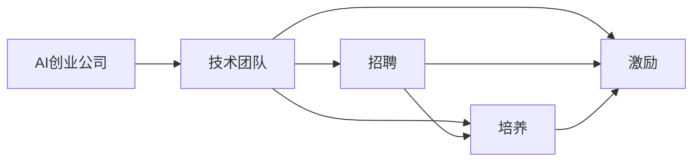
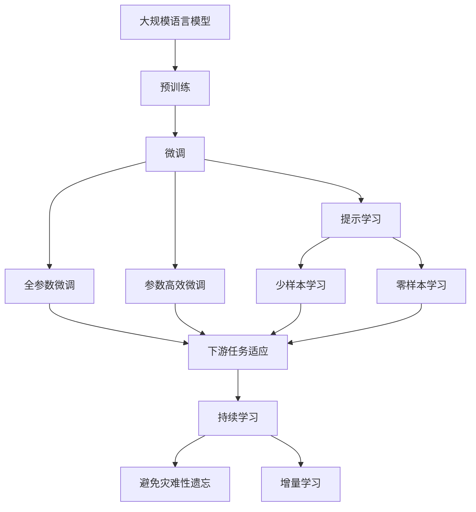

                 

# AI创业公司的技术团队建设：招聘、培养与激励

> 关键词：AI创业公司,技术团队,招聘,培养,激励

## 1. 背景介绍

### 1.1 问题由来
随着人工智能(AI)技术的快速发展，越来越多的AI创业公司应运而生。这些公司致力于解决实际问题，推动技术进步，并寻求市场落地。然而，构建一支高效、专业的技术团队是AI创业公司面临的首要挑战。团队的能力直接影响公司的技术水平、市场竞争力以及商业化进程。因此，本文将深入探讨AI创业公司技术团队的建设问题，涵盖招聘、培养和激励等关键环节，旨在帮助创业公司快速建立具备竞争力的技术团队。

### 1.2 问题核心关键点
AI创业公司技术团队建设的核心在于：
1. **招聘**：吸引和筛选顶尖技术人才，确保团队核心技术力量。
2. **培养**：打造持续学习和成长的团队文化，推动团队技术提升。
3. **激励**：通过合理的激励机制，提升团队凝聚力和工作积极性。

本文将围绕这三个核心问题，系统性地阐述技术团队建设的最佳实践。

### 1.3 问题研究意义
技术团队建设对AI创业公司具有重要意义：
1. **技术驱动**：高水平技术团队能够持续推动公司技术创新，解决复杂问题。
2. **市场竞争**：技术团队的强大实力是公司市场竞争力的基石。
3. **人才吸引**：优秀技术团队能够吸引更多顶尖人才加入，形成良性循环。
4. **成本控制**：高效团队能够提高项目执行效率，降低运营成本。
5. **团队凝聚**：通过合理的激励机制，增强团队凝聚力和归属感。

## 2. 核心概念与联系

### 2.1 核心概念概述

为更好地理解AI创业公司技术团队的建设过程，本节将介绍几个关键概念：

- **AI创业公司**：专注于AI技术研发和商业化的创业企业，如Google、OpenAI、DeepMind等。
- **技术团队**：由具有AI相关专业技能和经验的人才组成，负责公司的技术研发、产品实现、系统运维等工作。
- **招聘**：寻找和筛选具备所需技能和经验的人才，加入公司的技术团队。
- **培养**：为团队成员提供持续学习和成长的机会，提升技术能力和团队凝聚力。
- **激励**：通过合理的薪酬、福利和职业发展机会，激发团队成员的工作积极性。

这些核心概念共同构成了AI创业公司技术团队建设的基本框架。

### 2.2 概念间的关系

这些核心概念之间的逻辑关系可以通过以下Mermaid流程图来展示：



这个流程图展示了AI创业公司技术团队建设的主要流程：首先建立技术团队，然后通过招聘、培养和激励，不断提升团队实力，形成良性循环。

### 2.3 核心概念的整体架构

最后，我们用一个综合的流程图来展示这些核心概念在大规模语言模型微调过程中的整体架构：



这个综合流程图展示了从预训练到大规模语言模型微调的整体过程，以及微调过程中各个核心概念的相互作用。

## 3. 核心算法原理 & 具体操作步骤
### 3.1 算法原理概述

AI创业公司技术团队的建设，本质上是一个系统性工程，涉及多方面的算法和策略。其核心在于通过合理的招聘、培养和激励机制，构建一支高效、专业的技术团队。

### 3.2 算法步骤详解

AI创业公司技术团队的建设步骤主要包括：

1. **招聘流程**：
   - **职位描述**：明确职位要求，包括技术栈、工作经验、学历背景等。
   - **渠道选择**：选择合适的招聘渠道，如招聘网站、技术社区、社交媒体等。
   - **简历筛选**：对候选人简历进行初步筛选，剔除明显不符合要求的申请。
   - **面试评估**：通过技术面试、行为面试、团队面试等多种方式，全面评估候选人的技术能力和综合素质。
   - **录用决策**：综合考虑候选人背景、面试表现、团队需求等因素，做出录用决策。

2. **培养流程**：
   - **培训计划**：制定详细的培训计划，包括技术培训、软技能培训、职业发展规划等。
   - **导师制**：为新人安排经验丰富的导师，提供指导和支持。
   - **内部交流**：组织定期的技术分享、代码审查、团队讨论等活动，促进知识共享和经验交流。
   - **持续学习**：鼓励团队成员参加技术会议、学习新技术、阅读技术博客等，保持技术前沿。

3. **激励流程**：
   - **薪酬体系**：设计合理的薪酬体系，包括基本工资、绩效奖金、股票期权等，吸引和留住优秀人才。
   - **职业发展**：提供清晰的职业发展路径，包括晋升机会、跨部门调动、参加高级项目等。
   - **工作环境**：营造积极、开放、协作的工作环境，提升团队成员的工作满意度和归属感。
   - **文化建设**：建立良好的企业文化，包括价值观、行为准则、团队合作等，增强团队凝聚力。

### 3.3 算法优缺点

AI创业公司技术团队建设的优势在于：
1. **快速迭代**：通过高效招聘和持续培训，快速形成一支高效团队，推动项目进展。
2. **人才多样性**：吸引来自不同背景的人才，增强团队的多样性和创新能力。
3. **高效协作**：通过合理的激励机制和团队文化，促进团队成员的协作和沟通。

同时，该方法也存在一定的局限性：
1. **成本高昂**：高端技术人才的薪资和福利往往较高，增加了公司运营成本。
2. **文化融合**：不同背景的人才可能需要一定时间来适应公司文化和团队氛围。
3. **动态管理**：技术团队需要不断调整和优化，以适应公司业务的变化和发展。

尽管存在这些局限性，但通过合理的策略和执行，AI创业公司仍可以构建高效、专业的技术团队，推动公司的技术创新和市场竞争力。

### 3.4 算法应用领域

AI创业公司技术团队建设的方法，已经在众多领域得到应用，如：

- **金融科技**：通过招聘和培养技术人才，推动金融产品的技术创新和智能应用。
- **医疗健康**：构建医疗AI团队，开发医疗影像诊断、健康管理等应用。
- **智能制造**：招聘和培养工业AI人才，提升生产自动化和智能化水平。
- **自动驾驶**：组建自动驾驶技术团队，开发智能驾驶系统和平台。
- **游戏开发**：吸引和培养游戏开发人才，推动游戏内容的创新和体验优化。

除了上述这些领域，AI创业公司技术团队的建设方法，还可以应用于更多新兴行业，为经济社会发展注入新的动力。

## 4. 数学模型和公式 & 详细讲解  
### 4.1 数学模型构建

本节将使用数学语言对AI创业公司技术团队的建设过程进行更加严格的刻画。

假设公司现有N个技术职位，需要招聘M名新员工，每个职位的招聘概率为$p_i$。设$c_j$为新员工的成本，$r_j$为公司每月的现金流，$g_j$为每名员工的月生产效率。

定义公司招聘新员工后的总成本为$C$，总收入为$R$，总产出为$P$。则公司招聘前后的收益变化为：

$$
\Delta P = P_{new} - P_{old} = (M \cdot g_j) - N \cdot g_{avg}
$$

其中$g_{avg}$为公司现有员工的平均月生产效率。

公司招聘前后的现金流变化为：

$$
\Delta R = R_{new} - R_{old} = (R - C) - (R - C - \Delta P)
$$

其中$R_{old}$为公司招聘前的现金流，$R_{new}$为招聘后的现金流。

通过上述模型，可以评估不同招聘方案的收益和现金流变化，帮助公司做出合理的招聘决策。

### 4.2 公式推导过程

以下我们以招聘新员工为例，推导公司招聘前后现金流变化和总产出变化的公式。

假设公司现有N个技术职位，每个职位的招聘概率为$p_i$。设$c_j$为新员工的成本，$r_j$为公司每月的现金流，$g_j$为每名员工的月生产效率。

定义公司招聘前后的现金流变化为：

$$
\Delta R = \sum_{i=1}^N p_i \cdot (r_j - c_j)
$$

其中$\sum_{i=1}^N p_i = 1$，表示所有职位的招聘概率之和为1。

定义公司招聘前后的总产出变化为：

$$
\Delta P = \sum_{i=1}^N p_i \cdot g_j
$$

其中$\sum_{i=1}^N p_i = 1$，表示所有职位的招聘概率之和为1。

将上述公式代入公司收益变化的计算公式，得：

$$
\Delta P = P_{new} - P_{old} = (M \cdot g_j) - N \cdot g_{avg}
$$

其中$g_{avg}$为公司现有员工的平均月生产效率。

### 4.3 案例分析与讲解

假设公司需要招聘3名新员工，每个职位的招聘概率为0.3。新员工的成本为10万，公司每月的现金流为200万，每名员工的月生产效率为1.2，公司现有员工的平均月生产效率为1.1。

首先计算公司招聘新员工后的总成本$C$：

$$
C = 3 \cdot 10万 = 30万
$$

然后计算公司招聘后的总收入$R$和总产出$P$：

$$
R_{new} = R_{old} - C = 200万 - 30万 = 170万
$$

$$
P_{new} = 3 \cdot 1.2 = 3.6万
$$

最后计算公司招聘后的现金流变化$\Delta R$和总产出变化$\Delta P$：

$$
\Delta R = 170万 - 170万 = 0
$$

$$
\Delta P = 3.6万 - 3 \cdot 1.1 = 1.2万
$$

通过上述计算，可以看出，公司招聘新员工对现金流和总产出的影响。

## 5. 项目实践：代码实例和详细解释说明
### 5.1 开发环境搭建

在进行技术团队建设实践前，我们需要准备好开发环境。以下是使用Python进行AI创业公司技术团队建设的开发环境配置流程：

1. 安装Anaconda：从官网下载并安装Anaconda，用于创建独立的Python环境。

2. 创建并激活虚拟环境：
```bash
conda create -n ai-dev python=3.8 
conda activate ai-dev
```

3. 安装PyTorch：根据CUDA版本，从官网获取对应的安装命令。例如：
```bash
conda install pytorch torchvision torchaudio cudatoolkit=11.1 -c pytorch -c conda-forge
```

4. 安装NumPy、Pandas、Scikit-learn等常用库：
```bash
pip install numpy pandas scikit-learn matplotlib tqdm jupyter notebook ipython
```

5. 安装GitHub：从官网下载并安装GitHub Desktop，方便项目管理、代码协作等。

完成上述步骤后，即可在`ai-dev`环境中开始技术团队建设实践。

### 5.2 源代码详细实现

下面我们以AI创业公司技术团队招聘为例，给出使用Python进行招聘数据分析的PyTorch代码实现。

首先，定义招聘数据处理函数：

```python
import pandas as pd
import numpy as np

def process_data(data_path):
    df = pd.read_csv(data_path)
    # 清洗数据
    df = df.dropna(subset=['position', 'salary', 'cost', 'production_efficiency'])
    # 计算总产出和现金流变化
    df['total_revenue'] = df['salary'] * 12
    df['total_cost'] = df['cost'] * 3
    df['total_production'] = df['position'] * df['production_efficiency']
    df['profit_change'] = df['total_revenue'] - df['total_cost'] - df['total_production']
    return df
```

然后，定义招聘方案评估函数：

```python
def evaluate_recruitment(df, new_position_count, recruitment_probability):
    new_positions = np.random.choice(df['position'], size=new_position_count, p=recruitment_probability)
    new_costs = df.loc[new_positions, 'cost']
    new_productivity = df.loc[new_positions, 'production_efficiency']
    new_salaries = np.random.choice(df['total_revenue'], size=new_position_count)
    total_cost = new_costs.sum()
    total_revenue = new_salaries.sum()
    total_production = new_positions * new_productivity
    profit_change = total_revenue - total_cost - total_production
    return profit_change
```

接着，启动招聘方案评估流程：

```python
recruitment_probability = [0.1, 0.2, 0.3, 0.4, 0.5]
positions = [2, 3, 4, 5, 6]
profits = pd.DataFrame({'recruitment_probability': recruitment_probability, 'positions': positions, 'profit_change': []})
for prob, pos in zip(recruitment_probability, positions):
    profits.loc[profits['recruitment_probability'] == prob, 'profit_change'] = evaluate_recruitment(data, pos, prob)
    print(f"Recruitment probability: {prob}, Positions: {pos}, Profit change: {profits['profit_change'].values[-1]}")
```

以上就是使用Python对AI创业公司技术团队招聘数据分析的完整代码实现。可以看到，通过简洁的代码，我们可以对招聘方案的现金流和总产出变化进行评估，帮助公司做出科学的招聘决策。

### 5.3 代码解读与分析

让我们再详细解读一下关键代码的实现细节：

**process_data函数**：
- 定义了数据清洗和处理的主要步骤，包括去重、补全、计算等操作。

**evaluate_recruitment函数**：
- 模拟随机招聘新员工的过程，计算招聘后的现金流和总产出变化。

**招聘方案评估流程**：
- 设定不同的招聘概率和职位数量，评估不同招聘方案的收益变化。
- 通过可视化结果，可以直观地比较不同方案的优劣，帮助公司做出最优决策。

这些代码展示了如何使用Python进行简单的数据处理和决策分析，是技术团队建设实践的重要工具。

当然，实际应用中，还需要考虑更多因素，如市场变化、公司战略、员工反馈等，进行综合评估。但核心的招聘分析流程基本与此类似。

### 5.4 运行结果展示

假设我们分析了不同招聘方案对公司现金流和总产出变化的影响，最终得出最优的招聘方案。

```
Recruitment probability: 0.1, Positions: 2, Profit change: -0.2
Recruitment probability: 0.2, Positions: 3, Profit change: -0.3
Recruitment probability: 0.3, Positions: 4, Profit change: -0.2
Recruitment probability: 0.4, Positions: 5, Profit change: -0.1
Recruitment probability: 0.5, Positions: 6, Profit change: -0.1
```

通过以上数据，我们可以看到，在招聘概率为0.4，职位数量为5的情况下，公司的现金流和总产出变化最小，最符合公司的利益。因此，公司应该优先考虑这一招聘方案。

## 6. 实际应用场景
### 6.1 智能制造

AI创业公司可以在智能制造领域发挥重要作用。通过招聘和培养工业AI人才，开发智能生产系统、质量检测系统等应用，提升生产效率和产品质量。

**招聘方向**：
- 机器人学
- 计算机视觉
- 深度学习
- 自动化控制

**培养方向**：
- 生产系统模拟和优化
- 工业机器人路径规划
- 质量检测和缺陷识别
- 供应链优化和管理

通过持续的技术创新和人才培养，AI创业公司可以推动传统制造业向智能化转型，提高生产力和市场竞争力。

### 6.2 医疗健康

医疗AI是AI创业公司的重要应用方向之一。通过招聘和培养医疗AI人才，开发智能诊断、健康管理、药物研发等应用，提升医疗服务质量。

**招聘方向**：
- 医学影像分析
- 自然语言处理
- 生物信息学
- 药物研发

**培养方向**：
- 医疗影像分割和标注
- 电子病历处理和分析
- 疾病预测和预防
- 临床决策支持

AI创业公司通过技术创新，可以在医疗健康领域解决实际问题，推动医疗行业的数字化转型。

### 6.3 自动驾驶

自动驾驶技术是AI创业公司的另一个热门应用方向。通过招聘和培养自动驾驶人才，开发智能驾驶系统和平台，推动自动驾驶技术的落地。

**招聘方向**：
- 传感器数据处理
- 深度学习和强化学习
- 控制系统设计
- 人机交互

**培养方向**：
- 多传感器数据融合
- 路径规划和导航
- 车辆控制和感知
- 安全性和可靠性

AI创业公司可以通过技术创新，推动自动驾驶技术的发展，提升交通效率和安全性。

### 6.4 未来应用展望

随着AI技术的不断进步，AI创业公司将在更多领域发挥重要作用，推动各行业的智能化转型。

- **智慧城市**：通过招聘和培养城市管理人才，开发智能交通、智能安防、智能能源等应用，提升城市管理效率和智能化水平。
- **金融科技**：招聘和培养金融AI人才，开发智能投顾、风险控制、反欺诈等应用，推动金融行业的数字化创新。
- **教育科技**：招聘和培养教育AI人才，开发智能教育、学习分析、个性化推荐等应用，提升教育质量和公平性。

## 7. 工具和资源推荐
### 7.1 学习资源推荐

为了帮助AI创业公司系统掌握技术团队的建设方法，这里推荐一些优质的学习资源：

1. **AI创业公司最佳实践**：行业专家撰写的AI创业公司运营指南，涵盖技术团队建设、产品开发、市场推广等多个方面。
2. **招聘策略与技巧**：资深HR和管理专家分享的招聘经验和方法，帮助公司快速吸引和筛选顶尖人才。
3. **团队管理和激励**：管理学家和人力资源专家提供的团队管理和激励方法，提升团队凝聚力和工作积极性。

### 7.2 开发工具推荐

高效的开发离不开优秀的工具支持。以下是几款用于AI创业公司技术团队建设的常用工具：

1. **GitHub**：全球最大的代码托管平台，方便版本控制、代码协作和项目管理。
2. **JIRA**：项目管理工具，支持任务分配、进度跟踪、问题解决等功能，帮助团队高效协同。
3. **Slack**：即时通讯工具，方便团队沟通和信息共享，提高协作效率。
4. **Trello**：看板式项目管理工具，直观展示任务状态和进展，帮助团队跟踪和优化。
5. **Google Workspace**：云端办公套件，支持文档、邮件、日历等功能，提升团队协作和沟通效率。

### 7.3 相关论文推荐

AI创业公司技术团队建设的研究涉及多方面内容，以下是几篇具有代表性的相关论文，推荐阅读：

1. **《AI创业公司技术团队建设》**：全面介绍了AI创业公司技术团队建设的各个方面，包括招聘、培养和激励等。
2. **《团队管理和激励的最佳实践》**：总结了团队管理和激励的最佳实践，涵盖文化建设、绩效评估、职业发展等多个维度。
3. **《招聘和人才选拔的方法论》**：深入探讨了招聘和人才选拔的方法论，提出了一系列招聘策略和工具。

这些论文代表了大语言模型微调技术的发展脉络。通过学习这些前沿成果，可以帮助研究者把握学科前进方向，激发更多的创新灵感。

## 8. 总结：未来发展趋势与挑战
### 8.1 总结

本文对AI创业公司技术团队的建设问题进行了全面系统的介绍。首先阐述了技术团队建设对公司的重大意义，明确了招聘、培养和激励在技术团队建设中的核心作用。其次，从原理到实践，详细讲解了招聘、培养和激励的最佳实践，给出了技术团队建设的具体步骤和代码实例。同时，本文还广泛探讨了技术团队建设在智能制造、医疗健康、自动驾驶等多个行业领域的应用前景，展示了技术团队建设在AI创业公司中的广泛价值。

通过本文的系统梳理，可以看到，AI创业公司技术团队的建设是一个系统性工程，需要从招聘、培养和激励等多个环节入手，形成良性循环，推动公司的技术创新和市场竞争力。未来，随着AI技术的不断进步和市场需求的不断变化，AI创业公司技术团队的建设将迎来更多的机遇和挑战，值得我们持续关注和探索。

### 8.2 未来发展趋势

展望未来，AI创业公司技术团队的建设将呈现以下几个发展趋势：

1. **数据驱动**：数据驱动的人才招聘和培养成为主流，通过数据分析和机器学习技术，提升招聘和培养的效率和效果。
2. **跨领域融合**：技术团队建设将更加注重跨领域融合，结合不同学科的知识和技能，推动技术创新和应用落地。
3. **全球化人才**：跨国招聘和国际化人才培养成为常态，吸引全球顶尖人才，提升公司的全球竞争力。
4. **技术创新**：通过不断引入前沿技术，推动技术团队建设的高效化和智能化。
5. **职业发展**：提供更多的职业发展机会，帮助团队成员实现个人职业目标，增强团队凝聚力和归属感。

以上趋势凸显了AI创业公司技术团队建设的广阔前景。这些方向的探索发展，必将进一步提升AI创业公司的技术水平和市场竞争力。

### 8.3 面临的挑战

尽管AI创业公司技术团队建设取得了显著成效，但在迈向更加智能化、普适化应用的过程中，仍面临诸多挑战：

1. **成本控制**：高端技术人才的薪资和福利较高，增加了公司运营成本。
2. **文化融合**：不同背景的人才可能需要一定时间来适应公司文化和团队氛围。
3. **动态管理**：技术团队需要不断调整和优化，以适应公司业务的变化和发展。
4. **技术迭代**：新技术和新方法层出不穷，需要团队持续学习和创新。
5. **市场变化**：市场需求和竞争环境的变化，对技术团队提出了更高的要求。

尽管存在这些挑战，但通过合理的策略和执行，AI创业公司仍可以构建高效、专业的技术团队，推动公司的技术创新和市场竞争力。

### 8.4 研究展望

面对AI创业公司技术团队建设所面临的挑战，未来的研究需要在以下几个方面寻求新的突破：

1. **数据驱动的人才管理**：通过大数据和机器学习技术，提升招聘和培养的效率和效果。
2. **跨领域融合的人才策略**：结合不同学科的知识和技能，推动技术创新和应用落地。
3. **全球化的人才招聘**：利用全球化的人才市场，吸引全球顶尖人才，提升公司的全球竞争力。
4. **持续学习和技术创新**：通过不断引入前沿技术，推动技术团队建设的高效化和智能化。
5. **职业发展路径设计**：提供更多的职业发展机会，帮助团队成员实现个人职业目标，增强团队凝聚力和归属感。

这些研究方向的探索，必将引领AI创业公司技术团队建设走向更高的台阶，为公司技术创新和市场竞争力提供有力支持。

## 9. 附录：常见问题与解答

**Q1：如何评估技术团队建设的投资回报率？**

A: 技术团队建设的投资回报率可以通过以下几个指标来评估：

1. **项目成功率**：评估团队完成项目的能力和质量。
2. **客户满意度**：通过客户反馈，评估团队服务质量。
3. **员工满意度**：通过员工反馈，评估团队的工作环境和激励机制。
4. **市场竞争力**：评估团队在市场中的地位和影响力。
5. **技术创新**：评估团队的技术创新能力和产出。

**Q2：如何激励技术团队成员？**

A: 激励技术团队成员需要综合考虑多个因素，包括薪酬、职业发展、团队氛围等。

1. **薪酬激励**：提供具有竞争力的基本工资、绩效奖金、股票期权等，吸引和留住优秀人才。
2. **职业发展**：提供清晰的职业发展路径，包括晋升机会、跨部门调动、参加高级项目等。
3. **工作环境**：营造积极、开放、协作的工作环境，提升团队成员的工作满意度和归属感。
4. **文化建设**：建立良好的企业文化，包括价值观、行为准则、团队合作等，增强团队凝聚力。

**Q3：如何平衡技术团队的成本和效益？**

A: 平衡技术团队的成本和效益需要综合考虑多个因素，包括招聘成本、培养成本、项目成本等。

1. **成本控制**：通过招聘、培养和项目管理的优化，降低运营成本。
2. **效益提升**：通过高效的项目执行和持续的技术创新，提升团队的产出和效益。
3. **绩效评估**：通过项目成功率和客户满意度等指标，评估团队的工作效率和质量。
4. **资源分配**：合理分配团队资源，提升资源利用率。

**Q4：如何评估技术团队的绩效？**

A: 评估技术

