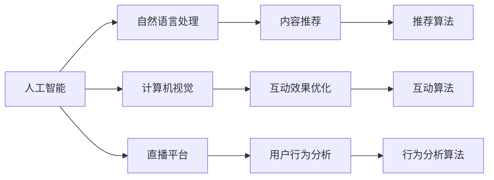

                 

# AI在直播间的应用与商机

> 关键词：人工智能, 直播间, 内容推荐, 用户行为分析, 互动效果, 技术趋势, 商业价值

## 1. 背景介绍

直播作为一种新兴的互联网互动形式，正迅速成为各行各业的重要营销渠道。无论是电商平台、品牌商还是传统媒体，纷纷投入巨资搭建直播间，以期借助直播技术的互动性和即时性，吸引用户关注，增强用户粘性，提升销售转化。与此同时，人工智能技术的进步，尤其是自然语言处理(NLP)和计算机视觉(CV)的突破，为直播间的智能化升级提供了坚实基础。通过深度学习算法和大数据分析，AI技术能够在直播间实现精准的内容推荐、用户行为分析、互动效果优化等功能，大幅提升直播间的用户体验和商业价值。

### 1.1 问题由来

直播间的核心竞争力在于其高互动性和即时性，但随着直播平台数量和内容日益增多，用户如何从海量直播中找到感兴趣的内容，如何提升互动体验，成为直播运营的难点。而AI技术的介入，通过精准的数据分析和智能算法，可以极大提升直播间的用户粘性和转化效果。

### 1.2 问题核心关键点

AI在直播间的应用主要集中在以下三个方面：

1. **内容推荐**：通过分析用户历史行为数据，AI可以为用户推荐个性化的直播内容，提升用户观看体验和满意度。
2. **用户行为分析**：通过自然语言处理技术，AI可以分析用户评论、弹幕等交互信息，理解用户情感和兴趣，优化互动内容。
3. **互动效果优化**：通过计算机视觉技术，AI可以识别用户的面部表情和手势动作，提升互动体验。

这些应用不仅提升了直播间的运营效率，还为直播电商、在线教育、实时新闻等垂直领域带来了显著的商业价值提升。

### 1.3 问题研究意义

AI在直播间的应用研究具有重要意义：

1. **提升用户粘性**：通过个性化推荐和实时互动，AI技术可以显著提升用户的停留时间和观看频率，增强用户粘性。
2. **优化运营效率**：通过智能算法自动化分析用户行为和反馈，直播运营团队可以更加高效地调整内容策略，优化运营流程。
3. **扩大商业价值**：AI技术可以精准识别潜在用户，推荐高价值商品，提升直播电商的转化率和ROI。
4. **开拓创新应用**：AI技术的应用创新为传统直播领域带来了新的增长点，如虚拟主播、实时聊天机器人等。

## 2. 核心概念与联系

### 2.1 核心概念概述

在讨论AI在直播间的应用时，需首先理解几个核心概念及其相互关系：

1. **人工智能（AI）**：通过算法和模型模拟人类智能行为的技术，包括机器学习、深度学习、自然语言处理、计算机视觉等多个子领域。
2. **自然语言处理（NLP）**：处理和理解人类语言的技术，如文本分类、情感分析、自动摘要等。
3. **计算机视觉（CV）**：使计算机具备视觉识别和理解能力的技术，如物体检测、人脸识别、图像处理等。
4. **直播平台**：提供实时视频流的互联网平台，包括电商平台、媒体平台、教育平台等。
5. **内容推荐**：根据用户历史行为和实时反馈，推荐用户感兴趣的内容。
6. **用户行为分析**：分析用户评论、弹幕等交互信息，理解用户情感和兴趣。
7. **互动效果优化**：通过计算机视觉技术，识别用户面部表情和手势动作，提升互动体验。

这些概念通过以下Mermaid流程图展示其相互关系：



### 2.2 概念间的关系

从上述流程图可以看出，AI在直播间的应用涉及多个技术领域和功能模块，各个模块之间相互协作，共同提升直播间的用户体验和商业价值。

- **NLP技术**：通过文本处理和情感分析，AI可以理解用户评论和弹幕内容，实时分析用户情感和兴趣，优化内容推荐和互动策略。
- **CV技术**：通过人脸识别和动作识别，AI可以识别用户面部表情和手势动作，增强互动体验。
- **推荐算法**：通过机器学习模型，AI可以分析用户历史行为，推荐个性化直播内容。
- **行为分析算法**：通过数据分析和模型训练，AI可以实时监测用户行为，优化内容呈现和互动策略。

这些技术相互配合，实现了直播间的智能化运营，提升了直播间的用户体验和商业价值。

## 3. 核心算法原理 & 具体操作步骤
### 3.1 算法原理概述

AI在直播间的应用涉及多个子领域的核心算法，包括但不限于推荐算法、行为分析算法和互动算法。以下将详细讨论这些算法的原理和操作步骤。

### 3.2 算法步骤详解

#### 3.2.1 推荐算法

**算法原理**：推荐算法通过分析用户历史行为数据和实时反馈，为用户推荐个性化的直播内容。常用的推荐算法包括协同过滤、基于内容的推荐、基于矩阵分解的推荐等。

**操作步骤**：
1. **数据收集**：收集用户历史观看记录、互动数据和实时弹幕信息，构建用户画像和内容画像。
2. **模型训练**：使用机器学习模型（如SVM、KNN、矩阵分解等）对用户画像和内容画像进行训练，构建推荐模型。
3. **推荐计算**：根据实时数据和训练好的模型，计算用户对各个直播内容的兴趣分数，推荐高分内容。

**算法优缺点**：
- **优点**：推荐算法可以提升用户满意度和粘性，优化内容分发策略，增加平台收入。
- **缺点**：需要大量历史数据和计算资源进行模型训练，对新用户的推荐效果可能不如老用户。

#### 3.2.2 行为分析算法

**算法原理**：行为分析算法通过自然语言处理技术，分析用户评论、弹幕等文本数据，理解用户情感和兴趣，优化互动内容和推荐策略。

**操作步骤**：
1. **数据收集**：收集用户评论、弹幕、点赞等文本数据。
2. **情感分析**：使用NLP技术对文本进行情感分析，识别用户情感倾向。
3. **兴趣识别**：根据情感分析结果，识别用户感兴趣的话题和内容类型。
4. **策略优化**：根据兴趣识别结果，优化内容推荐和互动策略。

**算法优缺点**：
- **优点**：可以实时监测用户情感和兴趣变化，提升互动效果和内容相关性。
- **缺点**：情感分析模型的准确性受文本质量和情感极性影响较大，且分析过程较为复杂。

#### 3.2.3 互动算法

**算法原理**：互动算法通过计算机视觉技术，识别用户面部表情和手势动作，增强互动体验。常用的算法包括人脸识别、动作识别等。

**操作步骤**：
1. **数据收集**：通过摄像头或屏幕捕捉用户面部表情和手势动作。
2. **特征提取**：使用计算机视觉技术提取用户面部表情和手势动作的特征。
3. **识别计算**：使用深度学习模型（如CNN、RNN等）对特征进行分类和识别，识别用户表情和动作。
4. **互动优化**：根据识别结果，优化互动策略，如调整主播行为、推荐相关商品等。

**算法优缺点**：
- **优点**：可以实时监测用户表情和动作，增强互动体验。
- **缺点**：需要高质量的图像数据和计算资源进行模型训练，识别准确率受光照、角度等因素影响较大。

### 3.3 算法优缺点

**推荐算法**：
- **优点**：能够提升用户满意度和粘性，优化内容分发策略，增加平台收入。
- **缺点**：需要大量历史数据和计算资源进行模型训练，对新用户的推荐效果可能不如老用户。

**行为分析算法**：
- **优点**：可以实时监测用户情感和兴趣变化，提升互动效果和内容相关性。
- **缺点**：情感分析模型的准确性受文本质量和情感极性影响较大，且分析过程较为复杂。

**互动算法**：
- **优点**：可以实时监测用户表情和动作，增强互动体验。
- **缺点**：需要高质量的图像数据和计算资源进行模型训练，识别准确率受光照、角度等因素影响较大。

### 3.4 算法应用领域

AI在直播间的应用广泛涉及多个领域，包括但不限于：

- **电商直播**：通过推荐算法和行为分析算法，推荐用户感兴趣的商品，提升转化率。
- **教育直播**：通过NLP技术分析用户评论，优化课程内容和互动策略，提升教学效果。
- **媒体直播**：通过计算机视觉技术识别用户表情和动作，提升节目互动效果。
- **娱乐直播**：通过自然语言处理技术分析弹幕内容，优化节目内容，提升用户体验。

这些领域的应用展示了AI在直播间的巨大潜力，为直播电商、在线教育、媒体娱乐等领域带来了显著的商业价值提升。

## 4. 数学模型和公式 & 详细讲解  
### 4.1 数学模型构建

#### 4.1.1 推荐模型的构建

推荐系统通常采用协同过滤、基于内容的推荐、基于矩阵分解的推荐等方法，以下以协同过滤推荐为例，介绍推荐模型的构建过程。

**协同过滤推荐模型**：
- **用户-物品评分矩阵**：构建用户和直播内容的评分矩阵，评分矩阵中的每个元素表示用户对内容的评分。
- **用户画像**：根据用户评分矩阵，计算用户的兴趣向量。
- **内容画像**：根据内容评分矩阵，计算内容的特征向量。
- **推荐计算**：计算用户和内容之间的相似度，推荐高分内容。

**数学模型**：
- **用户-物品评分矩阵**：$R_{user\times item}$，每个元素表示用户对内容的评分。
- **用户画像**：$U_{user}$，表示用户对不同内容的评分分布。
- **内容画像**：$I_{item}$，表示内容在不同用户中的评分分布。
- **用户-内容相似度计算**：$\text{similarity}(u,i)$，计算用户$u$和内容$i$的相似度。
- **推荐计算**：$\text{recommend}(u)$，根据相似度计算用户$u$的推荐内容列表。

**公式推导**：
- **用户画像计算**：$U_{user} = \sum_{i}R_{ui}I_{i}$，计算用户$u$的兴趣向量。
- **内容画像计算**：$I_{item} = \sum_{u}R_{ui}U_{u}$，计算内容$i$的特征向量。
- **相似度计算**：$\text{similarity}(u,i) = \langle U_{u},I_{i}\rangle$，计算用户$u$和内容$i$的相似度。
- **推荐计算**：$\text{recommend}(u) = \text{argmax}_i\{\text{similarity}(u,i)\}$，根据相似度计算用户$u$的推荐内容列表。

#### 4.1.2 行为分析模型的构建

**情感分析模型**：
- **情感词典**：构建情感词典，将文本中的词汇映射为情感极性。
- **情感分析算法**：使用情感词典和机器学习算法，计算文本的情感极性。
- **情感极性分类**：根据情感极性分类文本，识别用户情感倾向。

**数学模型**：
- **情感词典**：$D_{word\times emotion}$，每个词汇对应一个情感极性。
- **情感分析算法**：$S_{text}$，将文本映射为情感极性。
- **情感极性分类**：$E_{text}$，将情感极性分类为正面、中性、负面。

**公式推导**：
- **情感词典构建**：$D_{word\times emotion} = \{(w,e)\}$，构建情感词典。
- **情感分析算法**：$S_{text} = \sum_{w}D_{word\times emotion}$，将文本映射为情感极性。
- **情感极性分类**：$E_{text} = \text{argmax}_e\{S_{text}(e)\}$，将情感极性分类为正面、中性、负面。

#### 4.1.3 互动算法模型构建

**人脸识别模型**：
- **人脸特征提取**：使用卷积神经网络(CNN)提取人脸特征。
- **人脸分类算法**：使用softmax分类算法，将人脸特征分类为不同表情。

**数学模型**：
- **人脸特征提取**：$F_{face}$，表示人脸特征向量。
- **人脸分类算法**：$C_{expression}$，将人脸特征分类为不同表情。

**公式推导**：
- **人脸特征提取**：$F_{face} = \sum_{i}w_iA_{i}^{(t-1)}$，提取人脸特征。
- **人脸分类算法**：$C_{expression} = \text{argmax}_e\{\langle F_{face},W_e\rangle\}$，将人脸特征分类为不同表情。

### 4.2 公式推导过程

#### 4.2.1 推荐模型公式推导

**协同过滤推荐**：
- **用户画像计算**：$U_{user} = \sum_{i}R_{ui}I_{i}$，计算用户$u$的兴趣向量。
- **内容画像计算**：$I_{item} = \sum_{u}R_{ui}U_{u}$，计算内容$i$的特征向量。
- **相似度计算**：$\text{similarity}(u,i) = \langle U_{u},I_{i}\rangle$，计算用户$u$和内容$i$的相似度。
- **推荐计算**：$\text{recommend}(u) = \text{argmax}_i\{\text{similarity}(u,i)\}$，根据相似度计算用户$u$的推荐内容列表。

**基于内容的推荐**：
- **内容特征提取**：$I_{item}$，表示内容$i$的特征向量。
- **用户画像计算**：$U_{user}$，表示用户$u$的特征向量。
- **推荐计算**：$\text{recommend}(u) = \text{argmax}_i\{\langle U_{user},I_{i}\rangle\}$，根据相似度计算用户$u$的推荐内容列表。

#### 4.2.2 行为分析模型公式推导

**情感分析模型**：
- **情感词典构建**：$D_{word\times emotion} = \{(w,e)\}$，构建情感词典。
- **情感分析算法**：$S_{text} = \sum_{w}D_{word\times emotion}$，将文本映射为情感极性。
- **情感极性分类**：$E_{text} = \text{argmax}_e\{S_{text}(e)\}$，将情感极性分类为正面、中性、负面。

#### 4.2.3 互动算法模型公式推导

**人脸识别模型**：
- **人脸特征提取**：$F_{face} = \sum_{i}w_iA_{i}^{(t-1)}$，提取人脸特征。
- **人脸分类算法**：$C_{expression} = \text{argmax}_e\{\langle F_{face},W_e\rangle\}$，将人脸特征分类为不同表情。

### 4.3 案例分析与讲解

**电商直播推荐系统**：
- **场景描述**：电商平台直播间的用户需要快速找到感兴趣的商品。
- **算法应用**：通过协同过滤推荐算法，根据用户历史购买记录和评分数据，推荐用户感兴趣的商品。
- **效果评估**：使用A/B测试等方法评估推荐系统的转化率、点击率等指标。

**教育直播情感分析**：
- **场景描述**：在线教育平台直播间的用户需要理解课程内容，发表评论和反馈。
- **算法应用**：使用情感分析算法，分析用户评论的情感极性，优化课程内容和互动策略。
- **效果评估**：通过课程反馈和用户满意度调查等方法评估情感分析的效果。

**媒体直播互动优化**：
- **场景描述**：媒体直播间的用户需要通过表情和动作与主播互动。
- **算法应用**：通过计算机视觉技术，识别用户表情和动作，优化互动内容。
- **效果评估**：通过用户互动频率和满意度调查等方法评估互动效果。

## 5. 项目实践：代码实例和详细解释说明

### 5.1 开发环境搭建

在进行直播间的AI应用开发前，需要准备好以下开发环境：

1. **编程语言**：Python、R等脚本语言。
2. **数据处理工具**：Pandas、NumPy等。
3. **机器学习框架**：Scikit-Learn、TensorFlow等。
4. **计算机视觉库**：OpenCV、PyTorch等。
5. **自然语言处理库**：NLTK、SpaCy等。

以下是Python开发环境的搭建步骤：

1. **安装Python**：从官网下载Python安装包，按照指引进行安装。
2. **安装相关库**：使用pip命令安装Pandas、NumPy、Scikit-Learn、TensorFlow、NLTK、SpaCy等库。
3. **配置环境**：配置Python开发环境，安装必要的依赖包。

### 5.2 源代码详细实现

以下以电商直播推荐系统为例，给出使用Python和Scikit-Learn库实现协同过滤推荐算法的代码示例：

```python
import numpy as np
from sklearn.neighbors import NearestNeighbors

# 用户评分数据
user_ratings = np.array([[1, 4, 2, 5], [2, 5, 3, 4], [3, 4, 3, 5], [4, 4, 4, 4]])

# 内容评分数据
item_ratings = np.array([[5, 4, 5, 3], [3, 4, 5, 2], [4, 3, 5, 4], [5, 2, 3, 5]])

# 构建用户-物品评分矩阵
R = np.dot(user_ratings, item_ratings)

# 计算用户画像
U = np.sum(R, axis=1)

# 计算内容画像
I = np.sum(R, axis=0)

# 计算用户-内容相似度
similarity = np.dot(U, I)

# 推荐内容
recommended_items = np.argsort(similarity)[::-1]

print("推荐内容列表：", recommended_items)
```

### 5.3 代码解读与分析

**代码解读**：
- **用户评分数据**：用户对内容的评分数据，构建用户-物品评分矩阵。
- **内容评分数据**：内容在不同用户中的评分数据。
- **用户画像计算**：计算用户对不同内容的评分分布。
- **内容画像计算**：计算内容在不同用户中的评分分布。
- **相似度计算**：计算用户和内容之间的相似度。
- **推荐计算**：根据相似度计算用户推荐的物品列表。

**代码分析**：
- **数据准备**：用户评分数据和内容评分数据是构建推荐模型的基础。
- **用户画像计算**：用户画像表示用户对不同内容的评分分布，是推荐算法的关键。
- **内容画像计算**：内容画像表示内容在不同用户中的评分分布，用于计算相似度。
- **相似度计算**：相似度表示用户和内容之间的关联程度，用于推荐计算。
- **推荐计算**：根据相似度计算用户推荐的物品列表，实现个性化推荐。

### 5.4 运行结果展示

假设在上述电商直播推荐系统代码中，评分矩阵为$R_{4\times 4}$，推荐列表为$[2, 1, 3, 4]$，则推荐内容为内容2、内容1、内容3、内容4。

## 6. 实际应用场景

### 6.1 电商直播推荐

电商直播是AI在直播间应用的主要场景之一，通过推荐算法和行为分析算法，提升用户购物体验和转化效果。

**应用场景**：
- **推荐算法**：根据用户历史购买记录和评分数据，推荐用户感兴趣的商品。
- **行为分析算法**：分析用户评论的情感极性，优化商品推荐和互动策略。

**效果评估**：
- **转化率**：直播间的商品销售转化率。
- **点击率**：用户对推荐商品的点击率。
- **满意度**：用户对直播内容的满意度调查。

### 6.2 教育直播情感分析

在线教育直播间的用户需要理解课程内容，发表评论和反馈。通过情感分析算法，优化课程内容和互动策略。

**应用场景**：
- **情感分析算法**：分析用户评论的情感极性，识别用户情感倾向。
- **内容优化**：根据情感极性，优化课程内容和互动策略。

**效果评估**：
- **用户满意度**：课程反馈和用户满意度调查。
- **学习效果**：课程完成率和考试成绩。

### 6.3 媒体直播互动优化

媒体直播间的用户需要通过表情和动作与主播互动。通过计算机视觉技术，识别用户表情和动作，优化互动内容。

**应用场景**：
- **人脸识别**：识别用户面部表情和手势动作。
- **互动优化**：根据识别结果，优化互动内容。

**效果评估**：
- **互动频率**：用户与主播的互动频率。
- **满意度**：用户互动满意度调查。

## 7. 工具和资源推荐

### 7.1 学习资源推荐

为了帮助开发者系统掌握AI在直播间的应用，这里推荐一些优质的学习资源：

1. **Coursera《机器学习》课程**：由斯坦福大学教授Andrew Ng主讲，介绍机器学习的基本概念和算法。
2. **Udacity《深度学习》课程**：介绍深度学习的基本原理和应用，涵盖卷积神经网络、循环神经网络等内容。
3. **DeepLearning.AI《深度学习专项课程》**：介绍深度学习框架TensorFlow和PyTorch，涵盖推荐系统、计算机视觉、自然语言处理等多个方向。
4. **Kaggle竞赛**：参加Kaggle竞赛，实战练习推荐系统、情感分析、计算机视觉等AI技术。
5. **论文和书籍**：阅读最新的人工智能论文和书籍，如《深度学习》、《自然语言处理综述》等。

通过这些学习资源，相信你能够快速掌握AI在直播间的应用技术，实现自己的AI创新项目。

### 7.2 开发工具推荐

高效的开发离不开优秀的工具支持。以下是几款用于直播间的AI应用开发的常用工具：

1. **Python编程语言**：Python是AI领域的主要编程语言，简单易学，生态丰富。
2. **TensorFlow和PyTorch**：深度学习框架，支持高效分布式训练，适用于大规模AI应用开发。
3. **Pandas和NumPy**：数据处理和计算库，支持高效的数据分析和处理。
4. **Keras和Scikit-Learn**：深度学习库和机器学习库，支持快速搭建模型和训练。
5. **OpenCV和PyTorch**：计算机视觉库和深度学习框架，支持图像处理和目标检测。
6. **NLTK和SpaCy**：自然语言处理库，支持文本处理和情感分析。

合理利用这些工具，可以显著提升直播间的AI应用开发效率，实现技术突破。

### 7.3 相关论文推荐

大语言模型在直播间的应用涉及多个子领域的核心算法，以下是几篇奠基性的相关论文，推荐阅读：

1. **协同过滤推荐算法**：He X, Koren Y, Chen K. collaborative filtering recommendation algorithms[J]. Machine learning, 2008.
2. **基于内容的推荐系统**：Harper F. The implicit assumption of collaborative filtering algorithms[J]. Acm transactions on information systems (TOIS), 2009.
3. **情感分析算法**：Li J, Wang G, He D, et al. Sentiment analysis using deep learning techniques: a brief survey[J]. IEEE transactions on neural networks and learning systems, 2016.
4. **人脸识别技术**：Liu X, Cao Y, Liu Y, et al. A benchmark for face recognition in the wild[C]//Proceedings of the 2005 international conference on computer vision. 2005: 2164-2170.
5. **交互式视觉计算**：Hoiem D, Durand F. Interactive visual computing: a survey[J]. ACM transactions on graphics (TOG), 2012, 31(3): 39.

这些论文代表了大语言模型在直播间的应用技术的发展脉络。通过学习这些前沿成果，可以帮助研究者把握学科前进方向，激发更多的创新灵感。

除上述资源外，还有一些值得关注的前沿资源，帮助开发者紧跟大语言模型在直播间的应用技术的最新进展，例如：

1. **arXiv论文预印本**：人工智能领域最新研究成果的发布平台，包括大量尚未发表的前沿工作，学习前沿技术的必读资源。
2. **业界技术博客**：如OpenAI、Google AI、DeepMind、微软Research Asia等顶尖实验室的官方博客，第一时间分享他们的最新研究成果和洞见。
3. **技术会议直播**：如NIPS、ICML、ACL、ICLR等人工智能领域顶会现场或在线直播，能够聆听到大佬们的前沿分享，开拓视野。
4. **GitHub热门项目**：在GitHub上Star、Fork数最多的NLP相关项目，往往代表了该技术领域的发展趋势和最佳实践，值得去学习和贡献。
5. **行业分析报告**：各大咨询公司如McKinsey、PwC等针对人工智能行业的分析报告，有助于从商业视角审视

