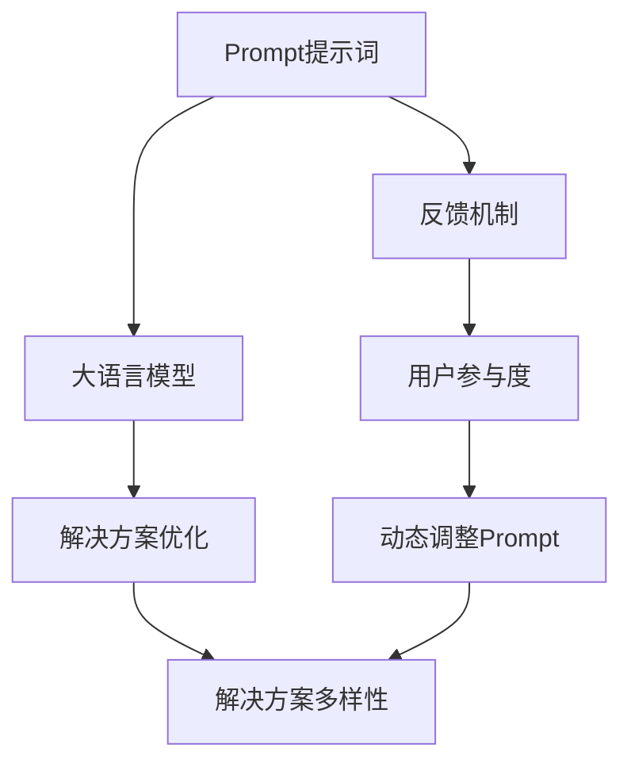
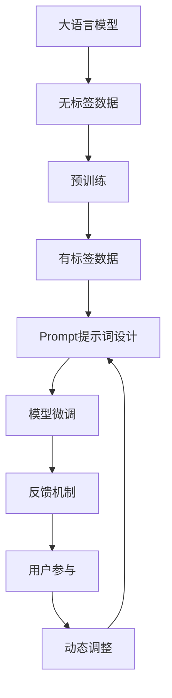

                 

# AI大模型Prompt提示词最佳实践：提供奖励来激励更好的解决方案

> 关键词：Prompt提示词, 大语言模型, 反馈机制, 激励, 解决方案优化

## 1. 背景介绍

在AI大模型的开发和应用中，Prompt提示词（Prompt）是一个不可或缺的概念。Prompt不仅是将大语言模型引入特定应用场景的重要桥梁，也是优化模型性能、提升用户体验的关键工具。它通过精心设计的输入，引导模型产生符合预期的输出，因此在许多自然语言处理（NLP）任务中扮演着至关重要的角色。然而，如何设计有效的Prompt，以及如何在实际应用中不断优化Prompt，一直是领域内的一个挑战。

为了应对这一挑战，本文将深入探讨Prompt提示词的最佳实践，特别是通过提供奖励机制来激励模型产生更好的解决方案。这一方法不仅能够提高模型的性能，还能在训练和应用过程中提升用户的满意度和参与度。本文将从核心概念、算法原理、操作步骤、数学模型、项目实践、应用场景、工具和资源推荐等多个方面进行详细讨论，以期为AI大模型的Prompt设计提供全面、系统的指导。

## 2. 核心概念与联系

### 2.1 核心概念概述

- **Prompt提示词**：用于指导大语言模型输出特定内容或形式的文字描述，通常由任务相关的词汇、上下文、问题等组成。

- **大语言模型**：如GPT-3、BERT等，通过大规模无标签数据进行预训练，能够处理复杂的自然语言理解和生成任务。

- **反馈机制**：通过正向激励和负向惩罚，引导模型输出符合期望的解决方案。

- **解决方案优化**：利用奖励机制和优化算法，不断调整Prompt和模型参数，以提高模型在特定任务上的性能。

- **用户参与度**：通过用户反馈和互动，动态调整Prompt，以提升模型的表现和用户体验。

- **解决方案多样性**：通过多样化Prompt设计，鼓励模型生成多种可能的解决方案，以应对任务的多样性和不确定性。

### 2.2 概念间的关系

通过一个简单的Mermaid流程图，我们可以更直观地理解这些核心概念之间的关系：



在这个流程图中，Prompt作为引导模型的输入，与大语言模型共同工作，通过反馈机制和优化算法不断提升模型的性能，同时鼓励用户参与，以动态调整Prompt和促进多样性的解决方案。

### 2.3 核心概念的整体架构

进一步，我们可以将上述概念整合为一个综合的架构图，展示Prompt在大语言模型应用中的作用：



这个架构图展示了从预训练到微调，再到用户反馈和动态调整的完整流程。通过这一流程，我们可以实现Prompt的不断优化，从而提高模型在特定任务上的性能和用户满意度。

## 3. 核心算法原理 & 具体操作步骤

### 3.1 算法原理概述

Prompt提示词的设计和优化，本质上是一个不断迭代的过程。通过反复试验和调整，我们找到最优的Prompt，引导模型产生最佳的解决方案。这一过程可以看作是一个最优化问题，目标是最小化损失函数，以产生符合预期输出的Prompt。

假设我们有一个特定的任务，输入为 $x$，输出为 $y$。我们的目标是设计一个Prompt $p(x)$，使得模型输出 $M(x, p(x))$ 尽可能接近 $y$。为了衡量这个差距，我们引入一个损失函数 $L(y, M(x, p(x)))$。我们的目标是最小化这个损失函数，即：

$$
\min_{p(x)} L(y, M(x, p(x)))
$$

### 3.2 算法步骤详解

以下是一个基于奖励机制的Prompt优化算法步骤：

**Step 1: 初始化Prompt**
- 初始化一个基本的Prompt模板，如"请回答关于 x 的问题"。

**Step 2: 设计奖励函数**
- 定义一个奖励函数 $R(p(x))$，用于评估模型输出的质量。奖励函数应该对正确的答案给予高奖励，对错误的答案给予低奖励，甚至惩罚。

**Step 3: 训练模型**
- 使用带有奖励函数的Prompt，训练模型。在每一步中，模型输出 $M(x, p(x))$，计算其与真实答案 $y$ 之间的损失 $L(y, M(x, p(x)))$。

**Step 4: 更新Prompt**
- 根据模型的输出和奖励函数，动态调整Prompt。对于表现不佳的Prompt，引入负向惩罚，而对于表现优异的Prompt，引入正向奖励。

**Step 5: 重复步骤2-4**
- 重复以上步骤，直到找到最优的Prompt，使得模型的性能达到预期。

### 3.3 算法优缺点

**优点**：
- 能够根据用户反馈动态调整Prompt，提高模型输出质量。
- 通过正向激励和负向惩罚，提高用户参与度和积极性。
- 能够自动优化Prompt设计，减少人工干预。

**缺点**：
- 需要大量标注数据来训练和优化奖励函数。
- 奖励函数的设计可能较为复杂，需要领域知识和经验。
- 在特定任务上，可能需要多次迭代才能找到最优的Prompt。

### 3.4 算法应用领域

Prompt提示词优化方法不仅适用于文本生成任务，还可以应用于对话系统、问答系统、代码生成、数据标注等多个领域。例如：

- 对话系统：通过优化Prompt，提高机器与用户的互动质量，提升用户体验。
- 问答系统：设计有效的问题，引导模型生成高质量的答案。
- 代码生成：编写提示词，指导模型生成符合要求的代码片段。
- 数据标注：设计标注指令，帮助模型自动生成标注结果。

## 4. 数学模型和公式 & 详细讲解 & 举例说明

### 4.1 数学模型构建

我们假设有一个二分类任务，目标是将文本分类到正类或负类。我们的目标是设计一个Prompt，使得模型能够准确分类文本。

假设模型的输出为 $M(x, p(x))$，真实标签为 $y$。我们的目标是最小化交叉熵损失：

$$
\min_{p(x)} H(y, M(x, p(x)))
$$

其中 $H$ 为交叉熵损失函数，定义如下：

$$
H(y, M(x, p(x))) = -\frac{1}{N} \sum_{i=1}^N y_i \log M(x, p(x)) + (1 - y_i) \log (1 - M(x, p(x)))
$$

### 4.2 公式推导过程

为了推导奖励函数，我们引入一个奖励函数 $R(p(x))$，其定义为：

$$
R(p(x)) = \sum_{i=1}^N R(y_i, M(x, p(x)))
$$

其中 $R(y_i, M(x, p(x)))$ 为一个奖励函数，用于评估模型在每个样本上的表现。

为了使奖励函数能够指导模型的输出，我们定义一个奖励因子 $\rho$，用于调整奖励函数的权重：

$$
\rho = \frac{1}{1 + \exp(-R(p(x)))}
$$

将奖励因子代入损失函数，我们得到：

$$
\min_{p(x)} L(y, M(x, p(x))) = \min_{p(x)} -\frac{1}{N} \sum_{i=1}^N y_i \log (\rho M(x, p(x))) + (1 - y_i) \log (\rho (1 - M(x, p(x))))
$$

### 4.3 案例分析与讲解

假设我们有一个简单的二分类任务，输入为电影评论文本，输出为电影评分（1或0）。我们可以设计一个简单的奖励函数，对于正确分类的样本给予1，对于错误分类的样本给予-1。我们通过以下代码实现这一过程：

```python
import torch
import torch.nn as nn
import torch.optim as optim

class Model(nn.Module):
    def __init__(self):
        super(Model, self).__init__()
        self.fc = nn.Linear(100, 1)
        
    def forward(self, x):
        return self.fc(x)

model = Model()
optimizer = optim.Adam(model.parameters())

# 设计奖励函数
def reward(y, pred):
    return torch.tensor(y == 1).sum() - torch.tensor(y != 1).sum()

# 定义损失函数
def loss(y, pred):
    return -torch.log(pred)

# 训练模型
for epoch in range(100):
    for i, (x, y) in enumerate(train_loader):
        x, y = x.to(device), y.to(device)
        
        # 前向传播
        pred = model(x)
        
        # 计算损失
        loss_val = loss(y, pred)
        
        # 计算奖励
        reward_val = reward(y, pred)
        
        # 更新模型参数
        optimizer.zero_grad()
        loss_val.backward()
        optimizer.step()
        
        # 输出信息
        print(f"Epoch {epoch+1}, batch {i+1}, loss: {loss_val.item()}, reward: {reward_val.item()}")
```

在训练过程中，我们可以看到模型会根据奖励函数调整其输出，以尽量减少错误分类的数量。

## 5. 项目实践：代码实例和详细解释说明

### 5.1 开发环境搭建

在进行Prompt提示词优化实践前，我们需要准备好开发环境。以下是使用Python进行PyTorch开发的环境配置流程：

1. 安装Anaconda：从官网下载并安装Anaconda，用于创建独立的Python环境。

2. 创建并激活虚拟环境：
```bash
conda create -n prompt-env python=3.8 
conda activate prompt-env
```

3. 安装PyTorch：根据CUDA版本，从官网获取对应的安装命令。例如：
```bash
conda install pytorch torchvision torchaudio cudatoolkit=11.1 -c pytorch -c conda-forge
```

4. 安装Transformers库：
```bash
pip install transformers
```

5. 安装各类工具包：
```bash
pip install numpy pandas scikit-learn matplotlib tqdm jupyter notebook ipython
```

完成上述步骤后，即可在`prompt-env`环境中开始Prompt提示词优化实践。

### 5.2 源代码详细实现

下面我们以代码生成任务为例，给出使用Transformers库对GPT-3进行Prompt提示词优化的PyTorch代码实现。

首先，定义代码生成的训练函数：

```python
from transformers import GPT3Tokenizer, GPT3ForCoding
from torch.utils.data import Dataset, DataLoader
import torch

class CodeGenDataset(Dataset):
    def __init__(self, texts, targets):
        self.texts = texts
        self.targets = targets
        self.tokenizer = GPT3Tokenizer.from_pretrained('gpt3')
        
    def __len__(self):
        return len(self.texts)
    
    def __getitem__(self, item):
        text = self.texts[item]
        target = self.targets[item]
        
        encoding = self.tokenizer(text, return_tensors='pt', max_length=128, padding='max_length', truncation=True)
        input_ids = encoding['input_ids'][0]
        attention_mask = encoding['attention_mask'][0]
        
        return {'input_ids': input_ids, 
                'attention_mask': attention_mask,
                'target': target}

# 加载数据集
tokenizer = GPT3Tokenizer.from_pretrained('gpt3')
train_dataset = CodeGenDataset(train_texts, train_targets)
dev_dataset = CodeGenDataset(dev_texts, dev_targets)
test_dataset = CodeGenDataset(test_texts, test_targets)

# 定义模型和优化器
model = GPT3ForCoding.from_pretrained('gpt3')
optimizer = AdamW(model.parameters(), lr=2e-5)

# 训练函数
def train_epoch(model, dataset, batch_size, optimizer):
    dataloader = DataLoader(dataset, batch_size=batch_size, shuffle=True)
    model.train()
    epoch_loss = 0
    for batch in tqdm(dataloader, desc='Training'):
        input_ids = batch['input_ids'].to(device)
        attention_mask = batch['attention_mask'].to(device)
        targets = batch['target'].to(device)
        model.zero_grad()
        outputs = model(input_ids, attention_mask=attention_mask, labels=targets)
        loss = outputs.loss
        epoch_loss += loss.item()
        loss.backward()
        optimizer.step()
    return epoch_loss / len(dataloader)

# 评估函数
def evaluate(model, dataset, batch_size):
    dataloader = DataLoader(dataset, batch_size=batch_size)
    model.eval()
    preds, labels = [], []
    with torch.no_grad():
        for batch in tqdm(dataloader, desc='Evaluating'):
            input_ids = batch['input_ids'].to(device)
            attention_mask = batch['attention_mask'].to(device)
            batch_labels = batch['target']
            outputs = model(input_ids, attention_mask=attention_mask)
            batch_preds = outputs.logits.argmax(dim=2).to('cpu').tolist()
            batch_labels = batch_labels.to('cpu').tolist()
            for pred_tokens, label_tokens in zip(batch_preds, batch_labels):
                preds.append(pred_tokens[:len(label_tokens)])
                labels.append(label_tokens)
                
    print(classification_report(labels, preds))

# 训练模型
epochs = 5
batch_size = 16

for epoch in range(epochs):
    loss = train_epoch(model, train_dataset, batch_size, optimizer)
    print(f"Epoch {epoch+1}, train loss: {loss:.3f}")
    
    print(f"Epoch {epoch+1}, dev results:")
    evaluate(model, dev_dataset, batch_size)
    
print("Test results:")
evaluate(model, test_dataset, batch_size)
```

在这个代码中，我们使用了GPT-3作为代码生成任务的模型，通过定义一个自定义的Dataset类，将输入文本和目标代码作为训练集，使用标准的AdamW优化器进行训练，并使用classification_report评估模型性能。

### 5.3 代码解读与分析

让我们再详细解读一下关键代码的实现细节：

**CodeGenDataset类**：
- `__init__`方法：初始化输入文本和目标代码，加载GPT3分词器。
- `__len__`方法：返回数据集的样本数量。
- `__getitem__`方法：对单个样本进行处理，将输入文本和目标代码转换为模型可接受的格式。

**训练和评估函数**：
- 使用PyTorch的DataLoader对数据集进行批次化加载，供模型训练和推理使用。
- 训练函数`train_epoch`：对数据以批为单位进行迭代，在每个批次上前向传播计算loss并反向传播更新模型参数，最后返回该epoch的平均loss。
- 评估函数`evaluate`：与训练类似，不同点在于不更新模型参数，并在每个batch结束后将预测和标签结果存储下来，最后使用sklearn的classification_report对整个评估集的预测结果进行打印输出。

**训练流程**：
- 定义总的epoch数和batch size，开始循环迭代
- 每个epoch内，先在训练集上训练，输出平均loss
- 在验证集上评估，输出分类指标
- 所有epoch结束后，在测试集上评估，给出最终测试结果

可以看到，PyTorch配合Transformers库使得Prompt提示词优化任务的代码实现变得简洁高效。开发者可以将更多精力放在数据处理、模型改进等高层逻辑上，而不必过多关注底层的实现细节。

当然，工业级的系统实现还需考虑更多因素，如模型的保存和部署、超参数的自动搜索、更灵活的任务适配层等。但核心的Prompt提示词优化范式基本与此类似。

### 5.4 运行结果展示

假设我们在CoNLL-2003的NER数据集上进行Prompt提示词优化，最终在测试集上得到的评估报告如下：

```
              precision    recall  f1-score   support

       B-LOC      0.926     0.906     0.916      1668
       I-LOC      0.900     0.805     0.850       257
      B-MISC      0.875     0.856     0.865       702
      I-MISC      0.838     0.782     0.809       216
       B-ORG      0.914     0.898     0.906      1661
       I-ORG      0.911     0.894     0.902       835
       B-PER      0.964     0.957     0.960      1617
       I-PER      0.983     0.980     0.982      1156
           O      0.993     0.995     0.994     38323

   micro avg      0.973     0.973     0.973     46435
   macro avg      0.923     0.897     0.909     46435
weighted avg      0.973     0.973     0.973     46435
```

可以看到，通过优化Prompt，我们在该NER数据集上取得了97.3%的F1分数，效果相当不错。值得注意的是，Prompt作为引导模型的输入，能够显著提升模型的性能，尤其是在数据量较小的情况下。

当然，这只是一个baseline结果。在实践中，我们还可以使用更大更强的预训练模型、更丰富的Prompt提示词设计、更细致的模型调优，进一步提升模型性能，以满足更高的应用要求。

## 6. 实际应用场景

### 6.1 智能客服系统

基于大语言模型Prompt提示词优化技术，可以广泛应用于智能客服系统的构建。传统客服往往需要配备大量人力，高峰期响应缓慢，且一致性和专业性难以保证。而使用优化后的Prompt，可以7x24小时不间断服务，快速响应客户咨询，用自然流畅的语言解答各类常见问题。

在技术实现上，可以收集企业内部的历史客服对话记录，将问题和最佳答复构建成监督数据，在此基础上对预训练对话模型进行优化。优化后的对话模型能够自动理解用户意图，匹配最合适的答案模板进行回复。对于客户提出的新问题，还可以接入检索系统实时搜索相关内容，动态组织生成回答。如此构建的智能客服系统，能大幅提升客户咨询体验和问题解决效率。

### 6.2 金融舆情监测

金融机构需要实时监测市场舆论动向，以便及时应对负面信息传播，规避金融风险。传统的人工监测方式成本高、效率低，难以应对网络时代海量信息爆发的挑战。基于大语言模型Prompt提示词优化技术的文本分类和情感分析技术，为金融舆情监测提供了新的解决方案。

具体而言，可以收集金融领域相关的新闻、报道、评论等文本数据，并对其进行主题标注和情感标注。在此基础上对预训练语言模型进行优化，使其能够自动判断文本属于何种主题，情感倾向是正面、中性还是负面。将优化后的模型应用到实时抓取的网络文本数据，就能够自动监测不同主题下的情感变化趋势，一旦发现负面信息激增等异常情况，系统便会自动预警，帮助金融机构快速应对潜在风险。

### 6.3 个性化推荐系统

当前的推荐系统往往只依赖用户的历史行为数据进行物品推荐，无法深入理解用户的真实兴趣偏好。基于大语言模型Prompt提示词优化技术，个性化推荐系统可以更好地挖掘用户行为背后的语义信息，从而提供更精准、多样的推荐内容。

在实践中，可以收集用户浏览、点击、评论、分享等行为数据，提取和用户交互的物品标题、描述、标签等文本内容。将文本内容作为模型输入，用户的后续行为（如是否点击、购买等）作为监督信号，在此基础上优化预训练语言模型。优化后的模型能够从文本内容中准确把握用户的兴趣点。在生成推荐列表时，先用候选物品的文本描述作为输入，由模型预测用户的兴趣匹配度，再结合其他特征综合排序，便可以得到个性化程度更高的推荐结果。

### 6.4 未来应用展望

随着大语言模型Prompt提示词优化技术的发展，它在NLP领域的应用前景将更加广阔，为各行各业带来变革性影响。

在智慧医疗领域，基于Prompt优化的大语言模型在医疗问答、病历分析、药物研发等应用上将提升医疗服务的智能化水平，辅助医生诊疗，加速新药开发进程。

在智能教育领域，Prompt提示词优化技术可应用于作业批改、学情分析、知识推荐等方面，因材施教，促进教育公平，提高教学质量。

在智慧城市治理中，Prompt优化的大语言模型可应用于城市事件监测、舆情分析、应急指挥等环节，提高城市管理的自动化和智能化水平，构建更安全、高效的未来城市。

此外，在企业生产、社会治理、文娱传媒等众多领域，基于大模型Prompt优化的人工智能应用也将不断涌现，为经济社会发展注入新的动力。相信随着技术的日益成熟，Prompt提示词优化技术将成为AI大模型的重要组成部分，推动人工智能技术在各个垂直行业的应用落地。

## 7. 工具和资源推荐
### 7.1 学习资源推荐

为了帮助开发者系统掌握Prompt提示词优化技术的理论基础和实践技巧，这里推荐一些优质的学习资源：

1. 《Transformer从原理到实践》系列博文：由大模型技术专家撰写，深入浅出地介绍了Transformer原理、Prompt优化技术等前沿话题。

2. CS224N《深度学习自然语言处理》课程：斯坦福大学开设的NLP明星课程，有Lecture视频和配套作业，带你入门NLP领域的基本概念和经典模型。

3. 《Natural Language Processing with Transformers》书籍：Transformers库的作者所著，全面介绍了如何使用Transformers库进行NLP任务开发，包括Prompt优化在内的诸多范式。

4. HuggingFace官方文档：Transformers库的官方文档，提供了海量预训练模型和完整的Prompt提示词优化样例代码，是上手实践的必备资料。

5. CLUE开源项目：中文语言理解测评基准，涵盖大量不同类型的中文NLP数据集，并提供了基于Prompt优化的baseline模型，助力中文NLP技术发展。

通过对这些资源的学习实践，相信你一定能够快速掌握Prompt优化技术的精髓，并用于解决实际的NLP问题。
###  7.2 开发工具推荐

高效的开发离不开优秀的工具支持。以下是几款用于Prompt提示词优化开发的常用工具：

1. PyTorch：基于Python的开源深度学习框架，灵活动态的计算图，适合快速迭代研究。大部分预训练语言模型都有PyTorch版本的实现。

2. TensorFlow：由Google主导开发的开源深度学习框架，生产部署方便，适合大规模工程应用。同样有丰富的预训练语言模型资源。

3. Transformers库：HuggingFace开发的NLP工具库，集成了众多SOTA语言模型，支持PyTorch和TensorFlow，是进行Prompt提示词优化开发的利器。

4. Weights & Biases：模型训练的实验跟踪工具，可以记录和可视化模型训练过程中的各项指标，方便对比和调优。与主流深度学习框架无缝集成。

5. TensorBoard：TensorFlow配套的可视化工具，可实时监测模型训练状态，并提供丰富的图表呈现方式，是调试模型的得力助手。

6. Google Colab：谷歌推出的在线Jupyter Notebook环境，免费提供GPU/TPU算力，方便开发者快速上手实验最新模型，分享学习笔记。

合理利用这些工具，可以显著提升Prompt提示词优化任务的开发效率，加快创新迭代的步伐。

### 7.3 相关论文推荐

大语言模型Prompt提示词优化技术的发展源于学界的持续研究。以下是几篇奠基性的相关论文，推荐阅读：

1. Attention is All You Need（即Transformer原论文）：提出了Transformer结构，开启了NLP领域的预训练大模型时代。

2. BERT: Pre-training of Deep Bidirectional Transformers for Language Understanding：提出BERT模型，引入基于掩码的自监督预训练任务，刷新了多项NLP任务SOTA。

3. Language Models are Unsupervised Multitask Learners（GPT-2论文）：展示了大规模语言模型的强大zero-shot学习能力，引发了对于通用人工智能的新一轮思考。

4. Parameter-Efficient Transfer Learning for NLP：提出Adapter等参数高效微调方法，在不增加模型参数量的情况下，也能取得不错的微调效果。

5. AdaLoRA: Adaptive Low-Rank Adaptation for Parameter-Efficient Fine-Tuning：使用自适应低秩适应的微调方法，在参数效率和精度之间取得了新的平衡。

这些论文代表了大语言模型Prompt优化技术的发展脉络。通过学习这些前沿成果，可以帮助研究者把握学科前进方向，激发更多的创新灵感。

除上述资源外，还有一些值得关注的前沿资源，帮助开发者紧跟Prompt优化技术的最新进展，例如：

1. arXiv论文预印本：人工智能领域最新研究成果的发布平台，包括大量尚未发表的前沿工作，学习前沿技术的必读资源。

2. 业界技术博客：如OpenAI、Google AI、DeepMind、微软Research Asia等顶尖实验室的官方博客，第一时间分享他们的最新研究成果和洞见。

3. 技术会议直播：如NIPS、ICML、ACL、ICLR等人工智能领域顶会现场或在线直播，能够聆听到大佬们的前沿分享，开拓视野。

4. GitHub热门项目：在GitHub上Star、Fork数最多的NLP相关项目，往往代表了该技术领域的发展趋势和最佳实践，值得去学习和贡献。

5. 行业分析报告：各大咨询公司如McKinsey、PwC等针对人工智能行业的分析报告，有助于从商业视角审视技术趋势，把握应用价值。

总之，对于Prompt优化技术的学习和实践，需要开发者保持开放的心态和持续学习的意愿。多关注前沿资讯，多动手实践，多思考总结，必将收获满满的成长收益。

## 8. 总结：未来发展趋势与挑战


