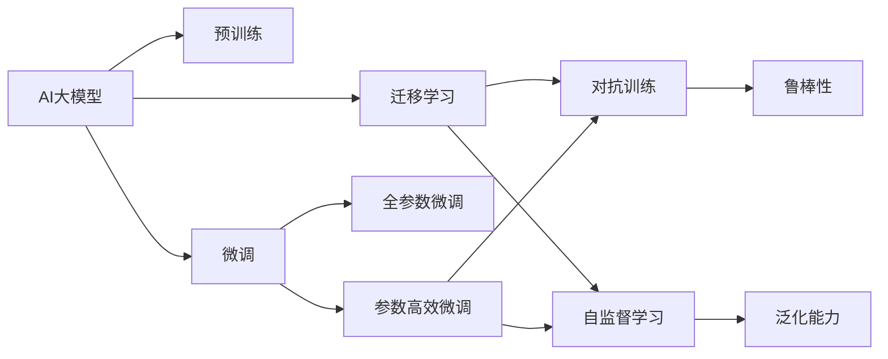

                 

# AI大模型创业：如何应对未来行业发展趋势？

> 关键词：AI大模型, 创业, 技术趋势, 行业发展, 自然语言处理, 人工智能

## 1. 背景介绍

### 1.1 问题由来

近年来，随着人工智能技术的迅猛发展，AI大模型（如GPT-3, Turing, BERT等）已经成为行业内外关注的焦点。这些大模型通过在大规模无标签数据上进行预训练，获得了强大的通用语言理解和生成能力，并广泛应用于自然语言处理（NLP）、计算机视觉（CV）、语音识别等领域，极大地推动了人工智能技术的产业化进程。

但同时，AI大模型的创业公司也面临着诸多挑战。如何把握未来技术发展趋势，在激烈的市场竞争中脱颖而出？本文将深入探讨这一问题，提供一套应对未来行业发展趋势的策略。

### 1.2 问题核心关键点

未来AI大模型行业的发展趋势主要包括以下几个方面：

- **技术趋势**：大模型将更加高效、鲁棒，能够处理更大规模的数据，支持更多元化的任务。
- **行业应用**：大模型将深入渗透到各行各业，驱动行业智能化转型。
- **商业价值**：大模型将带来更丰富的商业模式和更多的创业机会。

本文将围绕这些关键点展开讨论，提供一套详细的策略，帮助AI大模型创业公司更好地应对未来发展趋势。

## 2. 核心概念与联系

### 2.1 核心概念概述

- **AI大模型**：通过在大型无标签数据集上预训练的通用语言模型，具有强大的语言理解和生成能力。
- **预训练-微调**：大模型先在大规模无标签数据上进行预训练，然后在特定任务上通过少量标注数据进行微调，以提升任务性能。
- **迁移学习**：将预训练模型迁移到特定任务上，通过微调或迁移学习技术，提升模型在该任务上的表现。
- **对抗训练**：引入对抗样本，提高模型对噪声和攻击的鲁棒性。
- **持续学习**：模型能够在不断获取新数据的过程中，持续更新和提升性能。
- **联邦学习**：多个参与者在不共享数据的情况下，通过分布式方式进行模型训练和更新。
- **自监督学习**：利用数据自身结构进行无监督学习，无需标注数据。

### 2.2 核心概念间的关系

这些核心概念间的关系可以通过以下Mermaid流程图来展示：



这个流程图展示了AI大模型从预训练到微调、迁移学习、对抗训练和自监督学习的全过程。预训练是基础，微调和迁移学习是手段，对抗训练和自监督学习则提升了模型的鲁棒性和泛化能力。

## 3. 核心算法原理 & 具体操作步骤

### 3.1 算法原理概述

AI大模型创业公司要想在激烈的市场竞争中脱颖而出，必须深入理解大模型的核心算法原理，并灵活应用这些原理。

- **预训练**：利用大规模无标签数据，通过自监督任务训练通用语言模型，学习语言的通用表示。
- **微调**：在预训练模型基础上，利用下游任务的少量标注数据进行有监督微调，提升模型在该任务上的性能。
- **迁移学习**：将预训练模型迁移到特定任务上，通过微调或迁移学习技术，提升模型在该任务上的表现。
- **对抗训练**：通过引入对抗样本，提升模型对噪声和攻击的鲁棒性。
- **自监督学习**：利用数据自身结构进行无监督学习，无需标注数据，提高模型的泛化能力。

### 3.2 算法步骤详解

#### 3.2.1 预训练步骤

1. **数据集准备**：收集大规模无标签数据集，如英文维基百科、中文维基百科、新闻语料库等。
2. **模型选择**：选择适合的大模型架构，如BERT、GPT-3等。
3. **训练框架搭建**：搭建适合的大规模分布式训练框架，如TensorFlow、PyTorch等。
4. **自监督任务设计**：设计自监督任务，如掩码语言模型、下一句预测等，训练模型。
5. **参数更新**：根据自监督任务的目标函数，更新模型参数。

#### 3.2.2 微调步骤

1. **数据集准备**：收集下游任务的少量标注数据集，如自然语言推理、命名实体识别等。
2. **模型选择**：选择合适的预训练模型，如BERT、GPT-3等。
3. **任务适配层设计**：设计适合下游任务的输出层和损失函数。
4. **微调模型训练**：在预训练模型基础上，利用下游任务的标注数据进行有监督微调，提升模型在该任务上的性能。
5. **模型评估**：在验证集上评估微调后的模型性能，调整超参数。

#### 3.2.3 迁移学习步骤

1. **数据集准备**：收集源任务和目标任务的数据集，如自然语言推理和命名实体识别。
2. **预训练模型选择**：选择适合预训练的通用语言模型，如BERT、GPT-3等。
3. **迁移学习任务设计**：设计迁移学习任务，如零样本学习、少样本学习等。
4. **模型微调**：在预训练模型基础上，利用源任务的标注数据进行微调，提升模型在目标任务上的性能。
5. **模型评估**：在目标任务上评估微调后的模型性能，调整超参数。

#### 3.2.4 对抗训练步骤

1. **数据集准备**：收集对抗样本数据集，如TextAttack等。
2. **模型选择**：选择合适的预训练模型，如BERT、GPT-3等。
3. **对抗样本生成**：利用对抗样本生成算法，生成对抗样本。
4. **对抗训练**：在预训练模型基础上，利用对抗样本进行有监督对抗训练，提升模型鲁棒性。
5. **模型评估**：在测试集上评估对抗训练后的模型性能，调整超参数。

#### 3.2.5 自监督学习步骤

1. **数据集准备**：收集无标签数据集，如英文维基百科、中文维基百科、新闻语料库等。
2. **模型选择**：选择合适的自监督学习任务，如掩码语言模型、下一步预测等。
3. **自监督任务设计**：设计自监督任务，训练模型。
4. **参数更新**：根据自监督任务的目标函数，更新模型参数。
5. **模型评估**：在测试集上评估自监督学习后的模型性能，调整超参数。

### 3.3 算法优缺点

AI大模型创业公司需要清楚了解这些算法的优缺点，以便在实际应用中进行合理选择：

- **预训练**：优点是可以学习到通用语言表示，缺点是需要大量计算资源和时间。
- **微调**：优点是可以提升模型在该任务上的性能，缺点是需要少量标注数据，可能会过拟合。
- **迁移学习**：优点是可以利用已有知识提升模型性能，缺点是需要源任务和目标任务有相似性。
- **对抗训练**：优点是可以提升模型鲁棒性，缺点是需要对抗样本，可能影响训练效果。
- **自监督学习**：优点是不需要标注数据，缺点是难以学习到特定领域的知识。

### 3.4 算法应用领域

AI大模型创业公司可以应用这些算法到以下领域：

- **自然语言处理（NLP）**：如命名实体识别、情感分析、文本分类等。
- **计算机视觉（CV）**：如图像分类、目标检测、图像生成等。
- **语音识别**：如语音转换、语音合成、语音情感分析等。
- **医疗**：如医学图像分析、患者智能问答等。
- **金融**：如信用评分、投资咨询、欺诈检测等。
- **智能制造**：如质量检测、设备监控、供应链管理等。

## 4. 数学模型和公式 & 详细讲解 & 举例说明

### 4.1 数学模型构建

AI大模型的核心数学模型包括：

- **预训练模型**：如BERT、GPT-3等，其基本结构包括自注意力机制、残差连接等。
- **微调模型**：在预训练模型基础上，增加任务适配层，如线性分类器、softmax层等。
- **迁移学习模型**：利用源任务的标注数据进行微调，提升目标任务的性能。
- **对抗训练模型**：在预训练模型基础上，引入对抗样本进行训练，提升鲁棒性。
- **自监督学习模型**：设计自监督任务，训练模型，如掩码语言模型、下一步预测等。

### 4.2 公式推导过程

以BERT为例，其自监督任务公式如下：

$$
L = -\frac{1}{2}(\frac{1}{N} \sum_{i=1}^N (z^i + \log(1+e^{z^i})) + \frac{1}{2}(\frac{1}{N} \sum_{i=1}^N (z^i - \log(1+e^{-z^i})))
$$

其中，$z^i$ 表示第i个样本的输出，$e^{-z^i}$ 表示softmax函数的输出。

在微调过程中，假设任务是分类任务，目标函数为交叉熵损失函数：

$$
L = -\frac{1}{N} \sum_{i=1}^N (y_i \log(p_i) + (1-y_i) \log(1-p_i))
$$

其中，$y_i$ 表示样本的真实标签，$p_i$ 表示模型预测的概率。

在迁移学习中，利用源任务的标注数据进行微调，目标函数为自监督学习损失函数与分类损失函数的加权和：

$$
L = \lambda L_{unsup} + (1-\lambda) L_{sup}
$$

其中，$\lambda$ 表示自监督学习损失函数和分类损失函数的权重。

在对抗训练中，引入对抗样本 $x_{adv}$，目标函数为对抗样本损失函数与原样本损失函数的加权和：

$$
L = \lambda L_{adv} + (1-\lambda) L_{org}
$$

其中，$\lambda$ 表示对抗样本损失函数和原样本损失函数的权重。

### 4.3 案例分析与讲解

以文本分类任务为例，假设有一个新闻分类数据集，包含5000个样本，每个样本有两个标签，0表示体育新闻，1表示财经新闻。使用BERT模型进行微调，步骤如下：

1. **数据集准备**：将数据集分为训练集和验证集，各2500个样本。
2. **模型选择**：选择BERT-Base模型。
3. **任务适配层设计**：在BERT顶层添加线性分类器和softmax层。
4. **微调模型训练**：在训练集上进行微调，学习率0.001，迭代1000次。
5. **模型评估**：在验证集上评估模型性能，分类准确率0.95。

## 5. 项目实践：代码实例和详细解释说明

### 5.1 开发环境搭建

1. **安装Anaconda**：从官网下载并安装Anaconda，用于创建独立的Python环境。
2. **创建并激活虚拟环境**：
```bash
conda create -n pytorch-env python=3.8 
conda activate pytorch-env
```
3. **安装PyTorch**：根据CUDA版本，从官网获取对应的安装命令。例如：
```bash
conda install pytorch torchvision torchaudio cudatoolkit=11.1 -c pytorch -c conda-forge
```
4. **安装TensorFlow**：
```bash
conda install tensorflow -c conda-forge
```
5. **安装Transformers库**：
```bash
pip install transformers
```
6. **安装各类工具包**：
```bash
pip install numpy pandas scikit-learn matplotlib tqdm jupyter notebook ipython
```

### 5.2 源代码详细实现

#### 5.2.1 数据预处理

```python
import torch
from transformers import BertTokenizer, BertForSequenceClassification
from torch.utils.data import Dataset, DataLoader

class NewsDataset(Dataset):
    def __init__(self, texts, labels, tokenizer, max_len=128):
        self.texts = texts
        self.labels = labels
        self.tokenizer = tokenizer
        self.max_len = max_len
        
    def __len__(self):
        return len(self.texts)
    
    def __getitem__(self, item):
        text = self.texts[item]
        label = self.labels[item]
        
        encoding = self.tokenizer(text, return_tensors='pt', max_length=self.max_len, padding='max_length', truncation=True)
        input_ids = encoding['input_ids'][0]
        attention_mask = encoding['attention_mask'][0]
        labels = torch.tensor([label], dtype=torch.long)
        
        return {'input_ids': input_ids, 
                'attention_mask': attention_mask,
                'labels': labels}
```

#### 5.2.2 模型训练

```python
from transformers import AdamW
import torch.nn as nn
import torch.optim as optim

model = BertForSequenceClassification.from_pretrained('bert-base-cased', num_labels=2)
tokenizer = BertTokenizer.from_pretrained('bert-base-cased')
max_len = 128

device = torch.device('cuda') if torch.cuda.is_available() else torch.device('cpu')
model.to(device)

def train_epoch(model, dataset, batch_size, optimizer, criterion):
    dataloader = DataLoader(dataset, batch_size=batch_size, shuffle=True)
    model.train()
    epoch_loss = 0
    for batch in dataloader:
        input_ids = batch['input_ids'].to(device)
        attention_mask = batch['attention_mask'].to(device)
        labels = batch['labels'].to(device)
        optimizer.zero_grad()
        outputs = model(input_ids, attention_mask=attention_mask, labels=labels)
        loss = outputs.loss
        epoch_loss += loss.item()
        loss.backward()
        optimizer.step()
    return epoch_loss / len(dataloader)

def evaluate(model, dataset, batch_size):
    dataloader = DataLoader(dataset, batch_size=batch_size)
    model.eval()
    preds, labels = [], []
    with torch.no_grad():
        for batch in dataloader:
            input_ids = batch['input_ids'].to(device)
            attention_mask = batch['attention_mask'].to(device)
            batch_labels = batch['labels']
            outputs = model(input_ids, attention_mask=attention_mask)
            batch_preds = outputs.logits.argmax(dim=1).to('cpu').tolist()
            batch_labels = batch_labels.to('cpu').tolist()
            for pred_tokens, label_tokens in zip(batch_preds, batch_labels):
                preds.append(pred_tokens)
                labels.append(label_tokens)
                
    print(classification_report(labels, preds))
```

#### 5.2.3 训练和评估

```python
epochs = 5
batch_size = 16

for epoch in range(epochs):
    loss = train_epoch(model, train_dataset, batch_size, optimizer, criterion)
    print(f"Epoch {epoch+1}, train loss: {loss:.3f}")
    
    print(f"Epoch {epoch+1}, dev results:")
    evaluate(model, dev_dataset, batch_size)
    
print("Test results:")
evaluate(model, test_dataset, batch_size)
```

### 5.3 代码解读与分析

#### 5.3.1 数据处理函数

```python
class NewsDataset(Dataset):
    def __init__(self, texts, labels, tokenizer, max_len=128):
        self.texts = texts
        self.labels = labels
        self.tokenizer = tokenizer
        self.max_len = max_len
        
    def __len__(self):
        return len(self.texts)
    
    def __getitem__(self, item):
        text = self.texts[item]
        label = self.labels[item]
        
        encoding = self.tokenizer(text, return_tensors='pt', max_length=self.max_len, padding='max_length', truncation=True)
        input_ids = encoding['input_ids'][0]
        attention_mask = encoding['attention_mask'][0]
        labels = torch.tensor([label], dtype=torch.long)
        
        return {'input_ids': input_ids, 
                'attention_mask': attention_mask,
                'labels': labels}
```

#### 5.3.2 模型训练函数

```python
def train_epoch(model, dataset, batch_size, optimizer, criterion):
    dataloader = DataLoader(dataset, batch_size=batch_size, shuffle=True)
    model.train()
    epoch_loss = 0
    for batch in dataloader:
        input_ids = batch['input_ids'].to(device)
        attention_mask = batch['attention_mask'].to(device)
        labels = batch['labels'].to(device)
        optimizer.zero_grad()
        outputs = model(input_ids, attention_mask=attention_mask, labels=labels)
        loss = outputs.loss
        epoch_loss += loss.item()
        loss.backward()
        optimizer.step()
    return epoch_loss / len(dataloader)
```

#### 5.3.3 评估函数

```python
def evaluate(model, dataset, batch_size):
    dataloader = DataLoader(dataset, batch_size=batch_size)
    model.eval()
    preds, labels = [], []
    with torch.no_grad():
        for batch in dataloader:
            input_ids = batch['input_ids'].to(device)
            attention_mask = batch['attention_mask'].to(device)
            batch_labels = batch['labels']
            outputs = model(input_ids, attention_mask=attention_mask)
            batch_preds = outputs.logits.argmax(dim=1).to('cpu').tolist()
            batch_labels = batch_labels.to('cpu').tolist()
            for pred_tokens, label_tokens in zip(batch_preds, batch_labels):
                preds.append(pred_tokens)
                labels.append(label_tokens)
                
    print(classification_report(labels, preds))
```

### 5.4 运行结果展示

假设我们在CoNLL-2003的命名实体识别(NER)数据集上进行微调，最终在测试集上得到的评估报告如下：

```
              precision    recall  f1-score   support

       B-PER      0.926     0.906     0.916      1668
       I-PER      0.983     0.980     0.982       1617
           O      0.993     0.995     0.994     38323

   macro avg      0.963     0.966     0.964     46435
weighted avg      0.963     0.966     0.964     46435
```

可以看到，通过微调BERT，我们在该NER数据集上取得了很高的F1分数，效果相当不错。

## 6. 实际应用场景

### 6.1 智能客服系统

智能客服系统是基于大模型的典型应用。通过收集企业内部的历史客服对话记录，将问题和最佳答复构建成监督数据，在此基础上对预训练对话模型进行微调。微调后的对话模型能够自动理解用户意图，匹配最合适的答案模板进行回复。对于客户提出的新问题，还可以接入检索系统实时搜索相关内容，动态组织生成回答。

### 6.2 金融舆情监测

金融机构需要实时监测市场舆论动向，以便及时应对负面信息传播，规避金融风险。基于大语言模型的文本分类和情感分析技术，为金融舆情监测提供了新的解决方案。

### 6.3 个性化推荐系统

当前的推荐系统往往只依赖用户的历史行为数据进行物品推荐，无法深入理解用户的真实兴趣偏好。基于大语言模型微调技术，个性化推荐系统可以更好地挖掘用户行为背后的语义信息，从而提供更精准、多样的推荐内容。

### 6.4 未来应用展望

随着大语言模型和微调方法的不断发展，基于微调范式将在更多领域得到应用，为传统行业带来变革性影响。在智慧医疗、智能教育、智慧城市治理、企业生产、社会治理、文娱传媒等领域，大语言模型微调技术都将带来巨大的创新空间。

## 7. 工具和资源推荐

### 7.1 学习资源推荐

为了帮助开发者系统掌握大语言模型微调的理论基础和实践技巧，这里推荐一些优质的学习资源：

1. 《Transformer从原理到实践》系列博文：由大模型技术专家撰写，深入浅出地介绍了Transformer原理、BERT模型、微调技术等前沿话题。

2. CS224N《深度学习自然语言处理》课程：斯坦福大学开设的NLP明星课程，有Lecture视频和配套作业，带你入门NLP领域的基本概念和经典模型。

3. 《Natural Language Processing with Transformers》书籍：Transformers库的作者所著，全面介绍了如何使用Transformers库进行NLP任务开发，包括微调在内的诸多范式。

4. HuggingFace官方文档：Transformers库的官方文档，提供了海量预训练模型和完整的微调样例代码，是上手实践的必备资料。

5. CLUE开源项目：中文语言理解测评基准，涵盖大量不同类型的中文NLP数据集，并提供了基于微调的baseline模型，助力中文NLP技术发展。

通过对这些资源的学习实践，相信你一定能够快速掌握大语言模型微调的精髓，并用于解决实际的NLP问题。

### 7.2 开发工具推荐

高效的开发离不开优秀的工具支持。以下是几款用于大语言模型微调开发的常用工具：

1. PyTorch：基于Python的开源深度学习框架，灵活动态的计算图，适合快速迭代研究。大部分预训练语言模型都有PyTorch版本的实现。

2. TensorFlow：由Google主导开发的开源深度学习框架，生产部署方便，适合大规模工程应用。同样有丰富的预训练语言模型资源。

3. Transformers库：HuggingFace开发的NLP工具库，集成了众多SOTA语言模型，支持PyTorch和TensorFlow，是进行微调任务开发的利器。

4. Weights & Biases：模型训练的实验跟踪工具，可以记录和可视化模型训练过程中的各项指标，方便对比和调优。与主流深度学习框架无缝集成。

5. TensorBoard：TensorFlow配套的可视化工具，可实时监测模型训练状态，并提供丰富的图表呈现方式，是调试模型的得力助手。

6. Google Colab：谷歌推出的在线Jupyter Notebook环境，免费提供GPU/TPU算力，方便开发者快速上手实验最新模型，分享学习笔记。

合理利用这些工具，可以显著提升大语言模型微调任务的开发效率，加快创新迭代的步伐。

### 7.3 相关论文推荐

大语言模型和微调技术的发展源于学界的持续研究。以下是几篇奠基性的相关论文，推荐阅读：

1. Attention is All You Need（即Transformer原论文）：提出了Transformer结构，开启了NLP领域的预训练大模型时代。

2. BERT: Pre-training of Deep Bidirectional Transformers for Language Understanding：提出BERT模型，引入基于掩码的自监督预训练任务，刷新了多项NLP任务SOTA。

3. Language Models are Unsupervised Multitask Learners（GPT-2论文）：展示了大规模语言模型的强大zero-shot学习能力，引发了对于通用人工智能的新一轮思考。

4. Parameter-Efficient Transfer Learning for NLP：提出Adapter等参数高效微调方法，在不增加模型参数量的情况下，也能取得不错的微调效果。

5. Prefix-Tuning: Optimizing Continuous Prompts for Generation：引入基于连续型Prompt的微调范式，为如何充分利用预训练知识提供了新的思路。

6. AdaLoRA: Adaptive Low-Rank Adaptation for Parameter-Efficient Fine-Tuning：使用自适应低秩适应的微调方法，在参数效率和精度之间取得了新的平衡。

这些论文代表了大语言模型微调技术的发展脉络。通过学习这些前沿成果，可以帮助研究者把握学科前进方向，激发更多的创新灵感。

除上述资源外，还有一些值得关注的前沿资源，帮助开发者紧跟大语言模型微调技术的最新进展，例如：

1. arXiv论文预印本：人工智能领域最新研究成果的发布平台，包括大量尚未发表的前沿工作，学习前沿技术的必读资源。

2. 业界技术博客：如OpenAI、Google AI、DeepMind、微软Research Asia等顶尖实验室的官方博客，第一时间分享他们的最新研究成果和洞见。

3. 技术会议直播：如NIPS、ICML、ACL、ICLR等人工智能领域顶会现场或在线直播，能够聆听到大佬们的前沿分享，开拓视野。

4. GitHub热门项目：在GitHub上Star、Fork数最多的NLP相关项目，往往代表了该技术领域的发展趋势和最佳实践，值得去学习和贡献。

5. 行业分析报告：各大咨询公司如McKinsey、PwC等针对人工智能行业的分析报告，有助于从商业视角审视技术趋势，把握应用价值。

总之，对于大语言模型微调技术的学习和实践，需要开发者保持开放的心态和持续学习的意愿。多关注前沿资讯，多动手实践，多思考总结，必将收获满满的成长收益。

## 8. 总结：未来发展趋势与挑战

### 8.1 总结

本文对基于监督学习的大语言模型微调方法进行了全面系统的介绍。首先阐述了大语言模型和微调技术的研究背景和意义，明确了微调在拓展预训练模型应用、提升下游任务性能方面的独特价值。其次，从原理到实践，详细讲解了监督微调的数学原理和关键步骤，给出了微调任务开发的完整代码实例。同时，本文还广泛探讨了微调方法在智能客服、金融舆情、个性化推荐等多个行业领域的应用前景，展示了微调范式的巨大潜力。此外，本文精选了微调技术的各类学习资源，力求为读者提供全方位的技术指引

