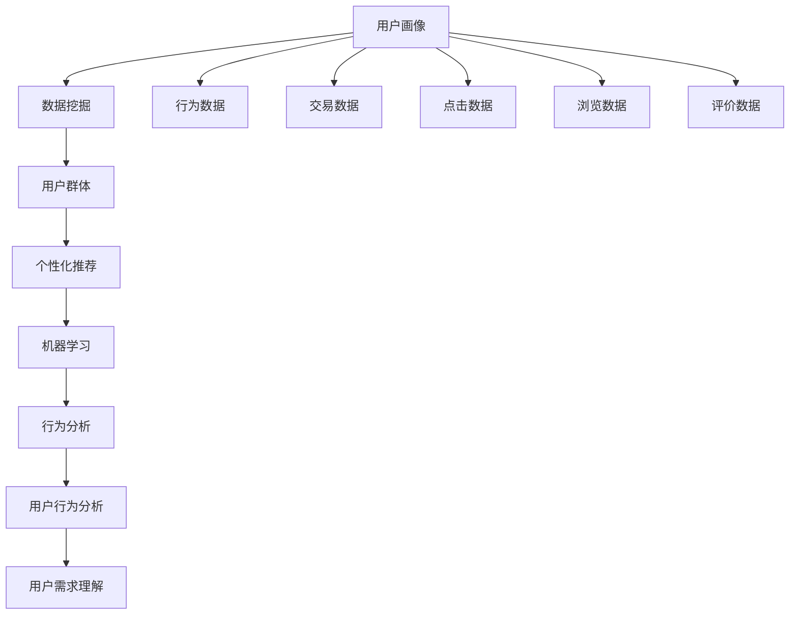
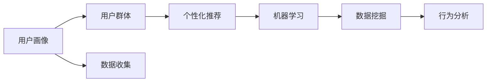
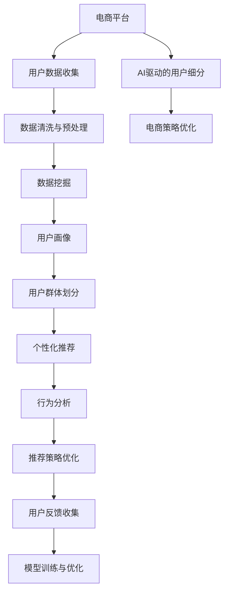

                 

# AI如何帮助电商企业进行用户细分

> 关键词：用户细分, AI驱动, 电商策略, 客户画像, 个性化推荐, 数据挖掘, 行为分析

## 1. 背景介绍

### 1.1 问题由来
在数字化转型浪潮下，电商行业迎来了前所未有的机遇与挑战。随着市场竞争的日益激烈，如何在海量用户中精准把握不同群体的需求，制定有效策略，成为电商企业致胜的关键。传统的用户细分方法依赖于人工调研和数据分析，耗时长、成本高，且往往难以把握用户深层次的细分特征。

AI技术，特别是机器学习和大数据技术，为电商企业提供了一种高效、精准的用户细分手段。通过AI技术，电商企业可以从海量用户行为数据中挖掘出丰富的用户特征，构建详尽的客户画像，从而实现个性化营销、产品推荐等目标，显著提升用户体验和转化率。

### 1.2 问题核心关键点
用户细分是电商企业进行精准营销、提高客户满意度和忠诚度的核心任务。通过AI驱动的用户细分，电商企业可以：
1. **识别不同用户群体**：基于用户行为数据，自动识别出具有相似特征的群体。
2. **把握用户需求**：深入分析用户行为，理解其真实需求，为产品设计和营销策略提供依据。
3. **实现个性化推荐**：根据用户画像，提供个性化的产品推荐和优惠券，提升用户体验和转化率。
4. **预测用户行为**：利用机器学习模型预测用户未来行为，优化库存管理和定价策略。

AI驱动的用户细分已成为电商企业实现用户价值最大化、提升竞争力的重要手段。然而，如何将AI技术与电商用户细分紧密结合，构建高效、准确的用户画像，仍需深入研究和实践。

### 1.3 问题研究意义
AI驱动的用户细分对电商企业具有重要意义：
1. **提高用户满意度**：通过个性化推荐和精准营销，提升用户购买体验，增加用户粘性。
2. **优化营销策略**：深入了解用户需求，制定更有效的营销活动，提升广告投放ROI。
3. **增强市场竞争力**：在激烈的市场竞争中，通过精准的用户细分和个性化策略，抢占市场先机。
4. **降低运营成本**：通过数据驱动的用户细分，减少人工调研成本，提高运营效率。

## 2. 核心概念与联系

### 2.1 核心概念概述

在电商领域，用户细分通常涉及以下几个核心概念：

- **用户画像(User Profile)**：以用户为核心，通过数据分析和挖掘，构建出用户的多维度特征描述。
- **用户群体(Customer Segment)**：基于用户画像，将用户划分为具有相似特征的群体。
- **个性化推荐(Personalized Recommendation)**：根据用户画像和行为数据，为用户提供个性化的产品和服务推荐。
- **机器学习(Machine Learning)**：利用数据训练模型，自动发现用户特征和行为规律。
- **数据挖掘(Data Mining)**：从大量数据中提取有价值的信息，构建用户画像和用户群体。
- **行为分析(Behavioral Analysis)**：分析用户行为模式，理解其需求和偏好。

这些概念之间的联系通过以下Mermaid流程图来展示：



这个流程图展示了用户细分的关键流程：

1. **数据收集**：通过行为数据、交易数据、点击数据、浏览数据、评价数据等多维度数据，收集用户的详细信息。
2. **数据挖掘**：利用数据挖掘技术，提取用户特征，构建用户画像。
3. **用户群体划分**：根据用户画像，将用户划分为不同的群体。
4. **个性化推荐**：基于用户群体和用户画像，进行个性化产品推荐。
5. **行为分析**：通过行为分析技术，理解用户行为模式和需求，进一步优化推荐策略。

### 2.2 概念间的关系

这些核心概念之间的关系通过以下Mermaid流程图来展示：



这个流程图展示了用户细分的流程逻辑：

1. **数据收集**：通过不同渠道收集用户的多维度数据。
2. **数据挖掘**：利用数据挖掘技术，构建详尽的用户画像。
3. **用户群体划分**：根据用户画像，将用户划分为不同群体。
4. **个性化推荐**：根据用户群体和画像，进行个性化推荐。
5. **行为分析**：通过行为分析技术，优化推荐策略，提升用户满意度。

### 2.3 核心概念的整体架构

最后，我们用一个综合的流程图来展示这些核心概念在大规模电商用户细分的整体架构：



这个综合流程图展示了从数据收集到策略优化的全过程：

1. **电商平台**：作为数据来源，提供用户的交易、行为等数据。
2. **用户数据收集**：通过各种渠道收集用户的多维度数据。
3. **数据清洗与预处理**：对数据进行清洗和预处理，去除噪声和异常值。
4. **数据挖掘**：利用数据挖掘技术，构建详尽的用户画像。
5. **用户群体划分**：根据用户画像，将用户划分为不同群体。
6. **个性化推荐**：基于用户群体和画像，进行个性化推荐。
7. **行为分析**：通过行为分析技术，优化推荐策略，提升用户满意度。
8. **电商策略优化**：根据推荐效果和用户反馈，优化电商策略。

通过这些流程图，我们可以更清晰地理解电商用户细分的各个环节及其相互关系，为后续深入讨论具体的技术方法和应用场景奠定基础。

## 3. 核心算法原理 & 具体操作步骤
### 3.1 算法原理概述

AI驱动的用户细分通常基于机器学习和数据挖掘技术。其核心思想是通过大规模用户数据，构建详尽的用户画像和群体划分，以实现精准的用户细分。

假设电商平台上有大量用户数据 $D=\{(x_i, y_i)\}_{i=1}^N$，其中 $x_i$ 为用户特征向量， $y_i$ 为用户行为标签（如购买、浏览、点击等）。用户细分的目标是找到最佳的特征选择和模型参数，使得模型能够准确预测用户行为。

形式化地，假设用户行为模型为 $F_{\theta}(x)$，其中 $\theta$ 为模型参数，$F_{\theta}(x)$ 为模型的预测结果。用户细分的目标是最小化预测误差，即：

$$
\hat{\theta}=\mathop{\arg\min}_{\theta} \mathcal{L}(F_{\theta}(D))
$$

其中 $\mathcal{L}$ 为预测误差损失函数，通常采用均方误差（MSE）或交叉熵损失函数。

### 3.2 算法步骤详解

AI驱动的用户细分一般包括以下关键步骤：

**Step 1: 数据收集与预处理**

1. **数据收集**：从电商平台收集用户的多维度数据，包括行为数据、交易数据、点击数据、浏览数据、评价数据等。
2. **数据预处理**：对数据进行清洗、归一化、去重等预处理操作，去除噪声和异常值。

**Step 2: 特征工程**

1. **特征选择**：从原始数据中提取有用的特征，如用户ID、购买金额、浏览时间、点击次数等。
2. **特征组合**：通过组合、变换等方法，构造新的特征，如购买频率、平均浏览时间、点击率等。
3. **特征降维**：利用PCA、LDA等降维技术，减少特征维度，降低计算复杂度。

**Step 3: 模型训练**

1. **模型选择**：选择合适的机器学习模型，如随机森林、深度神经网络、梯度提升树等。
2. **模型训练**：利用数据集进行模型训练，得到模型参数 $\theta$。
3. **模型评估**：在验证集上评估模型性能，调整模型参数，优化模型表现。

**Step 4: 用户画像与群体划分**

1. **用户画像**：根据模型预测的用户行为，构建详尽的用户画像，描述用户的特征和行为模式。
2. **用户群体划分**：将用户划分为不同的群体，利用聚类算法（如K-means、层次聚类等）进行自动划分。
3. **群体评估**：评估不同群体的用户行为和特征，确定群体的代表性。

**Step 5: 个性化推荐**

1. **推荐模型**：基于用户画像和群体划分，选择合适的推荐模型，如协同过滤、基于内容的推荐等。
2. **推荐优化**：通过A/B测试等方法，优化推荐策略，提升用户体验和转化率。
3. **实时推荐**：将推荐系统集成到电商平台，实现实时推荐。

**Step 6: 行为分析与策略优化**

1. **行为分析**：分析用户行为数据，理解用户需求和偏好，进行用户行为预测。
2. **策略优化**：根据行为分析结果，优化电商策略，如定价策略、库存管理等。
3. **反馈收集**：收集用户反馈，评估推荐效果，持续优化模型和策略。

### 3.3 算法优缺点

AI驱动的用户细分具有以下优点：

1. **高效精准**：利用机器学习和大数据技术，能够高效地构建详尽的用户画像和群体划分，提升用户分细分的精度和效率。
2. **自适应性强**：模型能够自动学习用户特征和行为模式，适应用户行为的变化，持续优化推荐策略。
3. **扩展性强**：支持多种数据源和多种模型，适用于不同规模和不同类型的电商平台。

同时，该方法也存在一些缺点：

1. **数据依赖度高**：模型性能高度依赖于数据质量和多样性，数据不全或噪声较大会影响模型效果。
2. **模型复杂度高**：模型选择和训练过程较为复杂，需要专业的数据科学和机器学习知识。
3. **隐私问题**：用户行为数据可能涉及隐私问题，需要严格的隐私保护措施。

### 3.4 算法应用领域

AI驱动的用户细分在电商领域具有广泛的应用：

1. **个性化推荐**：通过用户画像和行为分析，为每个用户推荐个性化的商品和优惠信息。
2. **精准营销**：基于用户群体，制定针对性的营销活动，提升广告投放效果。
3. **库存管理**：通过预测用户需求，优化库存管理和供应链策略。
4. **风险控制**：通过行为分析，识别高风险用户，提升信用评估和风险控制能力。

## 4. 数学模型和公式 & 详细讲解  
### 4.1 数学模型构建

假设用户行为模型为线性回归模型，形式如下：

$$
y = \theta^T \cdot x + b
$$

其中 $y$ 为预测的用户行为标签， $\theta$ 为模型参数， $x$ 为特征向量， $b$ 为截距项。模型的损失函数为均方误差（MSE）：

$$
\mathcal{L}(\theta) = \frac{1}{N}\sum_{i=1}^N (y_i - \hat{y}_i)^2
$$

其中 $\hat{y}_i$ 为模型预测的用户行为标签， $N$ 为样本数。

### 4.2 公式推导过程

利用梯度下降算法优化模型参数 $\theta$，目标是最小化损失函数 $\mathcal{L}(\theta)$。梯度下降的更新公式为：

$$
\theta \leftarrow \theta - \eta \nabla_{\theta}\mathcal{L}(\theta)
$$

其中 $\eta$ 为学习率。

对均方误差损失函数求导，得到梯度表达式：

$$
\nabla_{\theta}\mathcal{L}(\theta) = -\frac{2}{N}\sum_{i=1}^N (y_i - \hat{y}_i)x_i
$$

代入梯度下降更新公式，得到模型参数的更新表达式：

$$
\theta \leftarrow \theta - \frac{\eta}{N}\sum_{i=1}^N (y_i - \hat{y}_i)x_i
$$

通过上述公式，可以利用梯度下降算法高效地训练线性回归模型，预测用户行为。

### 4.3 案例分析与讲解

假设某电商平台收集了用户的浏览数据、点击数据、购买数据等，需要构建用户画像并进行用户细分。我们首先对数据进行预处理，去除噪声和异常值。然后，选择购买金额、浏览时间、点击次数等特征进行特征工程，构造新的特征，如平均浏览时间、购买频率等。最后，利用线性回归模型进行训练和预测，得到用户的行为标签和画像。

具体步骤如下：

1. **数据预处理**：对数据进行清洗和归一化，去除异常值和噪声。
2. **特征工程**：选择购买金额、浏览时间、点击次数等特征，构造新的特征，如平均浏览时间、购买频率等。
3. **模型训练**：利用训练集进行线性回归模型的训练，得到模型参数 $\theta$。
4. **用户画像**：根据模型预测的用户行为，构建详尽的用户画像，描述用户的特征和行为模式。
5. **用户群体划分**：将用户划分为不同的群体，利用聚类算法进行自动划分。

通过上述步骤，可以高效地构建详尽的用户画像和群体划分，实现精准的用户细分。

## 5. 项目实践：代码实例和详细解释说明
### 5.1 开发环境搭建

在进行用户细分项目开发前，我们需要准备好开发环境。以下是使用Python进行Pandas、NumPy、Scikit-learn等库开发的环境配置流程：

1. 安装Anaconda：从官网下载并安装Anaconda，用于创建独立的Python环境。

2. 创建并激活虚拟环境：
```bash
conda create -n user细分-env python=3.8 
conda activate user细分-env
```

3. 安装相关库：
```bash
pip install pandas numpy scikit-learn matplotlib
```

4. 安装可视化库：
```bash
pip install matplotlib
```

完成上述步骤后，即可在`user细分-env`环境中开始项目开发。

### 5.2 源代码详细实现

下面我们以用户行为预测为例，给出使用Scikit-learn库对线性回归模型进行训练和预测的Python代码实现。

```python
import pandas as pd
from sklearn.model_selection import train_test_split
from sklearn.linear_model import LinearRegression
from sklearn.metrics import mean_squared_error

# 读取数据
data = pd.read_csv('user_behavior_data.csv')

# 特征选择
X = data[['购买金额', '浏览时间', '点击次数']]
y = data['购买频率']

# 划分训练集和测试集
X_train, X_test, y_train, y_test = train_test_split(X, y, test_size=0.2, random_state=42)

# 训练模型
model = LinearRegression()
model.fit(X_train, y_train)

# 预测并评估
y_pred = model.predict(X_test)
mse = mean_squared_error(y_test, y_pred)
print(f'均方误差：{mse:.3f}')
```

上述代码实现了线性回归模型的训练和预测过程。

### 5.3 代码解读与分析

让我们再详细解读一下关键代码的实现细节：

**数据读取**：使用Pandas库读取CSV格式的用户行为数据，构建特征和标签。

**特征选择**：选择购买金额、浏览时间、点击次数等特征，构造新的特征，如平均浏览时间、购买频率等。

**模型训练**：利用训练集进行线性回归模型的训练，得到模型参数。

**模型评估**：在测试集上评估模型性能，计算均方误差。

**结果输出**：输出模型的均方误差，评估模型的预测能力。

### 5.4 运行结果展示

假设我们训练的模型在测试集上得到的均方误差为0.1，表示模型能够较好地预测用户的购买频率。通过进一步优化模型和特征工程，可以进一步提升模型的预测精度。

## 6. 实际应用场景
### 6.1 智能推荐系统

AI驱动的用户细分在智能推荐系统中具有重要应用。通过用户细分，推荐系统能够更好地理解用户需求和偏好，提供个性化的商品推荐。

在实际应用中，推荐系统通常会根据用户的历史行为数据，构建详尽的用户画像和群体划分。然后，基于用户画像和群体划分，选择合适的推荐算法，如协同过滤、基于内容的推荐等，进行个性化推荐。推荐系统还可以利用行为分析技术，预测用户未来的行为，优化推荐策略，提升用户体验和转化率。

### 6.2 精准营销

精准营销是电商企业实现高转化率的关键。通过AI驱动的用户细分，电商企业能够深入了解不同用户群体的需求和行为特征，制定针对性的营销活动，提升广告投放效果。

在实际应用中，电商平台可以利用用户细分的结果，对不同用户群体进行针对性广告投放和优惠活动，如优惠券、满减等。同时，通过行为分析技术，实时监测广告效果，及时调整营销策略，提升广告ROI。

### 6.3 库存管理

库存管理是电商企业运营中的重要环节。通过AI驱动的用户细分，电商平台能够预测用户需求，优化库存管理和供应链策略，避免缺货和库存积压。

在实际应用中，电商平台可以利用用户细分的结果，预测不同用户群体的购买需求，优化库存管理和补货策略。同时，通过行为分析技术，实时监测库存水平和销售情况，及时调整库存策略，提升运营效率。

### 6.4 风险控制

电商企业在进行信用评估和风险控制时，需要深入了解用户行为特征和信用记录。通过AI驱动的用户细分，电商平台能够识别高风险用户，提升信用评估和风险控制能力。

在实际应用中，电商平台可以利用用户细分的结果，对用户进行信用评分和风险评估。同时，通过行为分析技术，实时监测用户行为，及时发现风险用户，提升风险控制能力。

## 7. 工具和资源推荐
### 7.1 学习资源推荐

为了帮助开发者系统掌握AI驱动的用户细分技术，这里推荐一些优质的学习资源：

1. 《Python数据科学手册》系列博文：由数据科学专家撰写，深入浅出地介绍了数据科学的基本概念和Python库的使用。

2. Kaggle《用户行为分析》竞赛：Kaggle平台上的用户行为分析竞赛，提供了大量真实数据和竞赛教程，帮助开发者实践和提升数据科学能力。

3. Coursera《机器学习》课程：由斯坦福大学开设的机器学习课程，系统介绍了机器学习的基本概念和算法，适合初学者和进阶者。

4. Udacity《深度学习》纳米学位：Udacity平台上的深度学习课程，涵盖深度学习的基本概念和实践，适合深入学习深度学习算法。

5. Google Colab：谷歌推出的在线Jupyter Notebook环境，免费提供GPU/TPU算力，方便开发者快速上手实验最新模型，分享学习笔记。

通过对这些资源的学习实践，相信你一定能够快速掌握AI驱动的用户细分技术，并用于解决实际的电商用户细分问题。

### 7.2 开发工具推荐

高效的开发离不开优秀的工具支持。以下是几款用于AI驱动用户细分的常用工具：

1. Jupyter Notebook：用于数据处理和模型训练的轻量级开发环境，支持多种Python库的集成。

2. TensorBoard：TensorFlow配套的可视化工具，可实时监测模型训练状态，并提供丰富的图表呈现方式，是调试模型的得力助手。

3. HuggingFace Transformers库：HuggingFace开发的NLP工具库，集成了多个预训练语言模型，支持深度学习模型的快速训练和推理。

4. scikit-learn：用于数据挖掘和机器学习的Python库，提供多种模型和算法，适合快速迭代研究。

5. pandas：用于数据处理和分析的Python库，提供多种数据结构和操作函数，适合高效处理大规模数据集。

6. NumPy：用于科学计算的Python库，提供高效的多维数组和数学函数，适合高效进行数值计算和数据分析。

合理利用这些工具，可以显著提升AI驱动用户细分的开发效率，加快创新迭代的步伐。

### 7.3 相关论文推荐

AI驱动的用户细分领域的研究发展迅速，以下是几篇奠基性的相关论文，推荐阅读：

1. "Customer Segmentation in E-commerce: A Survey and Taxonomy"：一篇综述性论文，介绍了电商领域中的用户细分方法和应用，适合初学者了解基本概念和前沿进展。

2. "A Deep Learning Approach for User Segmentation"：提出了一种基于深度神经网络的用户细分方法，适用于电商平台用户细分，适合深入了解深度学习在用户细分中的应用。

3. "Behavioral Clustering for Customer Segmentation"：提出了一种基于行为数据的用户细分方法，适用于电商平台的个性化推荐和精准营销，适合了解行为数据在用户细分中的应用。

4. "Analysing the Impact of Machine Learning on Customer Segmentation"：一篇分析性论文，介绍了机器学习对用户细分的影响，适合深入了解机器学习在用户细分中的应用效果。

这些论文代表了AI驱动用户细分领域的发展脉络。通过学习这些前沿成果，可以帮助研究者把握学科前进方向，激发更多的创新灵感。

除上述资源外，还有一些值得关注的前沿资源，帮助开发者紧跟AI驱动用户细分技术的最新进展，例如：

1. arXiv论文预印本：人工智能领域最新研究成果的发布平台，包括大量尚未发表的前沿工作，学习前沿技术的必读资源。

2. 业界技术博客：如Google AI、Amazon AI、IBM Research Asia等顶尖实验室的官方博客，第一时间分享他们的最新研究成果和洞见。

3. 技术会议直播：如NIPS、ICML、CVPR等人工智能领域顶会现场或在线直播，能够聆听到大佬们的前沿分享，开拓视野。

4. GitHub热门项目：在GitHub上Star、Fork数最多的AI驱动用户细分相关项目，往往代表了该技术领域的发展趋势和最佳实践，值得去学习和贡献。

5. 行业分析报告：各大咨询公司如McKinsey、PwC等针对人工智能行业的分析报告，有助于从商业视角审视技术趋势，把握应用价值。

总之，对于AI驱动用户细分技术的学习和实践，需要开发者保持开放的心态和持续学习的意愿。多关注前沿资讯，多动手实践，多思考总结，必将收获满满的成长收益。

## 8. 总结：未来发展趋势与挑战
### 8.1 总结

本文对AI驱动的用户细分方法进行了全面系统的介绍。首先阐述了电商行业对用户细分的迫切需求和AI技术的解决方案，明确了用户细分在电商策略优化中的重要意义。其次，从原理到实践，详细讲解了AI驱动用户细分的数学模型和操作步骤，给出了用户细分项目的完整代码实例。同时，本文还广泛探讨了用户细分在智能推荐、精准营销、库存管理等多个场景中的应用，展示了AI技术的广泛潜力。此外，本文精选了用户细分的各类学习资源，力求为读者提供全方位的技术指引。

通过本文的系统梳理，可以看到，AI驱动的用户细分已成为电商企业实现用户价值最大化、提升竞争力的重要手段。然而，如何在实际应用中高效地构建详尽的用户画像和群体划分，仍然需要深入研究和实践。

### 8.2 未来发展趋势

展望未来，AI驱动的用户细分技术将呈现以下几个发展趋势：

1. **多模态用户细分**：除了行为数据外，将结合用户画像中的多模态数据（如文本、图像、音频等）进行用户细分，提升用户细分的精准度和深度。

2. **实时用户细分**：通过实时分析用户行为数据，进行动态的用户细分和推荐，提升用户体验和转化率。

3. **自适应用户细分**：根据用户行为的变化，自动调整用户细分的策略，实现用户细分的动态优化。

4. **跨领域用户细分**：结合不同领域的数据，进行联合用户细分，提升用户细分的全面性和实用性。

5. **自动化用户细分**：通过自动化流程，实现用户细分的快速迭代和优化，降低人工干预的复杂度。

6. **隐私保护用户细分**：在用户细分的各个环节，引入隐私保护技术，保障用户数据的隐私和安全。

这些趋势凸显了AI驱动用户细分技术的广阔前景。这些方向的探索发展，必将进一步提升用户细分的精度和效率，为电商企业带来更多的商业价值。

### 8.3 面临的挑战

尽管AI驱动的用户细分技术已经取得了瞩目成就，但在迈向更加智能化、普适化应用的过程中，它仍面临诸多挑战：

1. **数据质量问题**：用户行为数据的质量直接影响用户细分的精度和效果。数据不完整、不一致或存在噪声，可能导致模型性能下降。

2. **模型复杂度高**：用户细分的模型选择和训练过程较为复杂，需要专业的数据科学和机器学习知识。

3. **隐私问题**：用户行为数据可能涉及隐私问题，需要严格的隐私保护措施。

4. **计算资源需求高**：用户细分的模型训练和推理需要高性能计算资源，对计算硬件提出较高要求。

5. **模型解释性不足**：用户细分的模型通常是“黑盒”模型，难以解释其内部工作机制和决策逻辑

