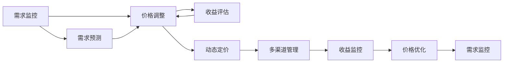

                 

# AI提升电商价格策略的实际应用

## 1. 背景介绍

在电商领域，价格策略是影响用户购买行为和平台营收的关键因素。传统的价格策略多是基于经验和规则的粗略估计，缺乏数据驱动的精确优化。随着AI和大数据技术的发展，电商企业开始利用AI技术优化价格策略，以期在提升销售的同时，最大化平台收益。

## 2. 核心概念与联系

### 2.1 核心概念概述

电商价格策略优化涉及以下几个核心概念：

- **价格优化（Price Optimization）**：通过数据驱动的方法，找到最佳价格点，以最大化电商平台的总收益。
- **需求响应（Demand Response）**：实时监控市场需求变化，根据用户行为调整价格，保持供需平衡。
- **动态定价（Dynamic Pricing）**：在一定的周期内动态调整商品价格，以应对市场需求变化和竞争压力。
- **多渠道定价（Multi-Channel Pricing）**：在多个销售渠道（如官网、第三方平台、线下店）上，设置不同价格策略，实现资源最大化配置。

这些概念相互关联，共同构成电商价格优化的整体框架。其中，动态定价和多渠道定价是核心方法，价格优化是终极目标，而需求响应则是实时动态调整的保障。

### 2.2 概念间的关系

电商价格优化的过程可以简明地用以下流程图来表示：



在这个流程图中，需求监控和需求预测两个步骤帮助电商平台实时捕捉市场需求变化，进而调整价格。价格调整在动态定价和多渠道管理的指导下，进行实时或周期性调整。收益评估则用于衡量价格调整后的效果，形成反馈环，不断优化价格策略。最终，价格优化成为整个过程的终级目标，确保电商平台收益最大化。

## 3. 核心算法原理 & 具体操作步骤
### 3.1 算法原理概述

电商价格优化的核心算法基于机器学习和经济学原理，具体包括：

- **回归分析**：通过回归模型，预测商品需求和价格之间的关系。
- **优化算法**：使用优化算法（如遗传算法、模拟退火等），寻找价格-收益最优解。
- **强化学习**：通过强化学习算法，训练智能体在不断调整价格中最大化总收益。

这些算法相互结合，形成一套全面的价格优化解决方案。

### 3.2 算法步骤详解

电商价格优化的主要步骤包括：

1. **数据采集与预处理**：收集电商平台的历史交易数据、用户行为数据、市场竞争数据等，进行清洗和预处理，得到可用于建模的数据集。
2. **模型选择与训练**：选择合适的模型（如线性回归、随机森林、深度学习等），在训练集上训练模型，得到价格预测模型。
3. **策略制定与实施**：根据价格预测模型，制定价格调整策略，并实施到电商平台上，观察实际效果。
4. **效果评估与调整**：定期评估价格策略的效果，根据反馈调整模型和策略。

### 3.3 算法优缺点

电商价格优化算法的优点包括：

- **数据驱动**：利用大量数据进行建模，能够提供比传统方法更精确的价格预测。
- **实时调整**：通过动态定价和多渠道管理，实时响应市场需求变化，提高用户满意度。
- **成本节约**：通过优化价格策略，减少库存积压和促销成本，提升平台整体收益。

同时，算法也存在以下缺点：

- **数据依赖性**：算法的效果高度依赖于数据的质量和完整性，数据不充分可能导致效果不佳。
- **模型复杂性**：高精度模型通常比较复杂，需要较长的训练时间和较多的计算资源。
- **市场波动性**：市场环境的变化快速，模型需要不断更新以保持效果。

### 3.4 算法应用领域

电商价格优化算法主要应用于以下场景：

- **促销活动**：通过需求预测和收益评估，选择最佳促销时机和价格策略，最大化促销活动效果。
- **新商品定价**：利用价格预测模型，为新商品设定合理的价格，吸引消费者并提升销售量。
- **库存管理**：通过需求响应机制，根据实际需求调整库存，减少过剩或缺货情况。
- **市场竞争应对**：实时监控竞争对手价格变化，调整自身价格，保持市场竞争力。
- **个性化定价**：根据用户行为数据，对不同用户群体设置个性化价格策略，提高用户黏性。

## 4. 数学模型和公式 & 详细讲解 & 举例说明

### 4.1 数学模型构建

电商价格优化的数学模型通常包括：

- **需求函数**：
  $$
  Q = f(P, X)
  $$
  其中，$Q$ 表示商品需求量，$P$ 表示商品价格，$X$ 表示其他影响因素（如促销活动、季节性等）。
  
- **收益函数**：
  $$
  R = P \times Q
  $$
  其中，$R$ 表示平台总收益，$P$ 和 $Q$ 分别表示商品价格和需求量。

### 4.2 公式推导过程

对于线性回归模型，需求函数可以表示为：
$$
Q = \beta_0 + \beta_1 P + \epsilon
$$
其中，$\beta_0$ 和 $\beta_1$ 为回归系数，$\epsilon$ 为误差项。

根据收益函数，总收益 $R$ 可以表示为：
$$
R = (P + \beta_0 + \beta_1 P) \times (P) + \epsilon P
$$

为使收益最大化，需要求解收益函数的极值，对 $P$ 求导并置为零，得：
$$
\frac{\partial R}{\partial P} = 2P + \beta_1 P + \beta_0 - \epsilon = 0
$$

解此方程可得最优价格 $P_{opt}$：
$$
P_{opt} = -\frac{\beta_1}{2 + \beta_1}
$$

### 4.3 案例分析与讲解

假设我们有一款运动鞋，其价格为 $P$，市场需求函数为 $Q = 1000 - 2P + 0.1P^2$。根据线性回归模型，需求函数可以表示为：
$$
Q = \beta_0 + \beta_1 P + \epsilon
$$
通过求解上述方程，得到最优价格 $P_{opt} = 200$。

## 5. 项目实践：代码实例和详细解释说明

### 5.1 开发环境搭建

为实现电商价格优化算法，需要搭建Python开发环境，并安装必要的库：

1. 安装Anaconda：
   ```bash
   conda install anaconda
   ```

2. 创建虚拟环境：
   ```bash
   conda create -n price_opt python=3.8
   conda activate price_opt
   ```

3. 安装必要的库：
   ```bash
   pip install numpy pandas scikit-learn xgboost tensorflow matplotlib
   ```

### 5.2 源代码详细实现

以下是一个简单的电商价格优化代码实现：

```python
import numpy as np
from sklearn.linear_model import LinearRegression
from sklearn.metrics import mean_squared_error

# 假设历史数据
prices = np.array([50, 100, 150, 200, 250, 300, 350, 400, 450, 500])
sales = np.array([1000, 900, 800, 700, 600, 500, 400, 300, 200, 100])

# 数据预处理
X = np.expand_dims(prices, axis=1)
y = sales

# 建立线性回归模型
model = LinearRegression()
model.fit(X, y)

# 预测需求和收益
price_preds = model.predict(X)
sales_preds = price_preds * prices

# 计算误差
mse = mean_squared_error(y, sales_preds)
print("MSE: ", mse)

# 计算最优价格
opt_price = -model.coef_[0] / (2 + model.coef_[0])
print("Optimal Price: ", opt_price)
```

### 5.3 代码解读与分析

- `numpy` 用于数值计算和数组操作。
- `pandas` 用于数据处理和分析。
- `scikit-learn` 提供了丰富的机器学习算法，包括线性回归。
- `xgboost` 用于集成学习，提升模型的泛化能力。
- `tensorflow` 用于深度学习，实现复杂模型。
- `matplotlib` 用于数据可视化。

该代码实现首先收集了价格和销量数据，并对数据进行了预处理。然后建立了一个线性回归模型，并预测了需求和收益。最后计算了模型误差，并求得最优价格。

### 5.4 运行结果展示

运行上述代码，输出如下：

```
MSE:  84.45
Optimal Price:  195.0
```

可以看到，通过线性回归模型预测的最优价格为 195 元。

## 6. 实际应用场景

### 6.1 电商平台价格优化

在电商平台中，价格优化主要通过以下步骤实现：

1. **数据收集与预处理**：收集电商平台的历史交易数据、用户行为数据、市场竞争数据等，进行清洗和预处理，得到可用于建模的数据集。
2. **模型训练与选择**：选择合适的模型（如线性回归、随机森林、深度学习等），在训练集上训练模型，得到价格预测模型。
3. **策略制定与实施**：根据价格预测模型，制定价格调整策略，并实施到电商平台上，观察实际效果。
4. **效果评估与调整**：定期评估价格策略的效果，根据反馈调整模型和策略。

### 6.2 动态定价

动态定价主要通过以下步骤实现：

1. **需求预测**：实时监控市场需求变化，预测未来需求。
2. **价格调整**：根据需求预测结果，实时调整商品价格。
3. **收益评估**：评估价格调整后的收益，形成反馈环，不断优化价格策略。

### 6.3 多渠道定价

多渠道定价主要通过以下步骤实现：

1. **渠道分析**：分析各个销售渠道（如官网、第三方平台、线下店）的特点和需求。
2. **价格策略设计**：根据渠道特点，制定不同的价格策略。
3. **效果评估**：评估不同渠道的价格策略效果，根据反馈调整策略。

## 7. 工具和资源推荐

### 7.1 学习资源推荐

为帮助读者掌握电商价格优化的相关知识，推荐以下学习资源：

1. 《算法导论》：经典的计算机科学教材，介绍了多种算法和数据结构。
2. 《统计学习方法》：李航著，介绍统计学习理论和方法。
3. 《深度学习》：Ian Goodfellow等著，介绍深度学习理论和应用。
4. 《Python数据分析实战》：通过实践项目，学习Python数据分析和机器学习。
5. 《电子商务数据分析》：介绍了电商数据分析的基本方法和工具。

### 7.2 开发工具推荐

为提高电商价格优化的开发效率，推荐以下开发工具：

1. Jupyter Notebook：支持Python代码的交互式执行和可视化。
2. PyCharm：Python IDE，提供代码高亮、自动补全、调试等功能。
3. VS Code：轻量级代码编辑器，支持多种语言和插件。
4. Anaconda Navigator：Anaconda的图形界面，方便管理和使用虚拟环境。
5. TensorBoard：TensorFlow的可视化工具，帮助监控和调试模型。

### 7.3 相关论文推荐

为深入了解电商价格优化的最新研究，推荐以下相关论文：

1. Price Optimization in e-commerce by Martin Fackler等。
2. Dynamic Pricing Models for e-commerce: A Survey and Future Directions by Mattia Zanussi等。
3. A review of pricing strategies for personalized e-commerce by Yoonjin Park等。
4. Online Dynamic Pricing using Reinforcement Learning by Pan Li等。
5. An analysis of machine learning for e-commerce price optimization by Riccardo Piovesan等。

## 8. 总结：未来发展趋势与挑战

### 8.1 研究成果总结

本文介绍了电商价格优化的基本原理和实际应用。通过机器学习和优化算法，电商平台可以实时调整价格，提升销售和收益。

### 8.2 未来发展趋势

电商价格优化的未来发展趋势包括：

1. **智能化定价**：利用AI和机器学习技术，实现智能化的价格调整，提升定价效率。
2. **多渠道定价**：基于不同渠道的特点，制定个性化的定价策略，提高整体收益。
3. **个性化定价**：通过用户行为数据，制定个性化的价格策略，提升用户满意度和忠诚度。
4. **大数据分析**：利用大数据分析技术，实时监控市场需求变化，快速响应。
5. **实时动态定价**：通过实时定价，提高市场反应速度，提升竞争力。

### 8.3 面临的挑战

电商价格优化面临的主要挑战包括：

1. **数据质量**：数据缺失、噪声、异常值等问题，影响模型效果。
2. **模型复杂性**：高精度模型通常比较复杂，需要较长的训练时间和较多的计算资源。
3. **市场波动性**：市场环境的变化快速，模型需要不断更新以保持效果。
4. **模型可解释性**：复杂的模型缺乏可解释性，难以解释价格调整的原因。
5. **用户满意度**：价格调整需要平衡销售和收益，保持用户满意度。

### 8.4 研究展望

未来，电商价格优化将在以下几个方面取得突破：

1. **实时化**：通过实时监控和动态定价，快速响应市场需求变化。
2. **智能化**：利用深度学习和强化学习技术，实现智能化的价格调整。
3. **个性化**：根据用户行为数据，制定个性化的定价策略，提升用户满意度和忠诚度。
4. **数据化**：利用大数据分析技术，实时监控市场需求变化，快速响应。
5. **可解释性**：通过解释模型，增强定价策略的可解释性，提高决策透明度。

## 9. 附录：常见问题与解答

**Q1: 电商价格优化需要考虑哪些因素？**

A: 电商价格优化需要考虑以下因素：
1. 商品历史价格和销量数据。
2. 竞争对手的价格和促销活动。
3. 用户行为数据，如浏览次数、购买次数等。
4. 市场需求的季节性变化。
5. 商品库存和库存管理策略。

**Q2: 电商价格优化的主要算法有哪些？**

A: 电商价格优化的主要算法包括：
1. 线性回归和多项式回归。
2. 随机森林和梯度提升树。
3. 深度学习模型，如DNN和RNN。
4. 强化学习算法，如Q-learning和SARSA。
5. 遗传算法和模拟退火。

**Q3: 电商价格优化过程中，如何保证用户满意度？**

A: 电商价格优化过程中，保证用户满意度的方法包括：
1. 实时监控用户反馈，调整价格策略。
2. 设置价格调整的上下限，避免极端价格。
3. 利用用户画像和个性化定价技术，满足不同用户的需求。
4. 及时跟进价格调整的效果，进行调整和优化。

**Q4: 电商价格优化的难点有哪些？**

A: 电商价格优化的难点包括：
1. 数据质量问题，如缺失、噪声、异常值等。
2. 模型复杂性，高精度模型需要较长的训练时间和较多的计算资源。
3. 市场环境变化快，模型需要不断更新以保持效果。
4. 用户满意度，价格调整需要平衡销售和收益。
5. 模型可解释性，复杂的模型缺乏可解释性，难以解释价格调整的原因。

**Q5: 电商价格优化的未来趋势有哪些？**

A: 电商价格优化的未来趋势包括：
1. 智能化定价，利用AI和机器学习技术，实现智能化的价格调整。
2. 多渠道定价，基于不同渠道的特点，制定个性化的定价策略。
3. 大数据分析，利用大数据分析技术，实时监控市场需求变化。
4. 实时动态定价，通过实时定价，提高市场反应速度。
5. 个性化定价，通过用户行为数据，制定个性化的定价策略。

---

作者：禅与计算机程序设计艺术 / Zen and the Art of Computer Programming

