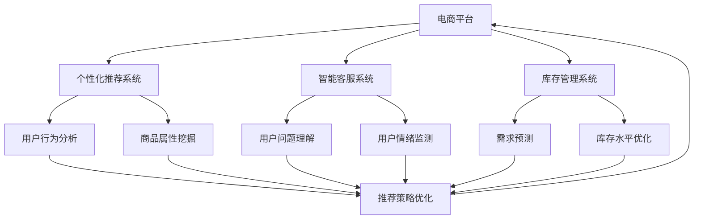

                 

# AI提升电商平台运营效率的案例

## 1. 背景介绍

随着电商市场的快速发展，平台运营者面临着诸多挑战：

- **用户增长压力**：如何吸引并留住更多用户？
- **个性化推荐**：如何精准推荐商品给用户？
- **库存管理**：如何优化商品库存，避免缺货和积压？
- **营销活动**：如何设计高效的营销活动，提高用户转化率？

近年来，人工智能（AI）技术在电商平台的广泛应用，通过精准数据分析、智能推荐系统和自动化流程，有效提升了平台运营效率，优化了用户体验，为电商平台的可持续发展提供了强大支持。本文将以某个电商平台为例，探讨如何利用AI技术，从多个维度提升电商平台运营效率。

## 2. 核心概念与联系

### 2.1 核心概念概述

在讨论AI如何提升电商平台运营效率之前，我们需要先了解几个核心概念：

- **电商平台**：指基于互联网提供商品或服务交易的线上平台，如淘宝、京东、亚马逊等。
- **AI技术**：涉及机器学习、深度学习、自然语言处理、计算机视觉等多个领域，通过智能算法和大数据，实现自动化决策和优化。
- **个性化推荐系统**：利用用户行为数据和商品属性信息，通过AI算法，为用户推荐最相关、最符合其偏好的商品。
- **智能客服系统**：基于NLP和机器学习，实现自动回答用户问题，提升用户满意度。
- **库存管理系统**：通过AI算法，优化库存水平和分布，避免过剩或缺货。

这些核心概念构成了电商平台利用AI技术提升运营效率的基础。

### 2.2 核心概念之间的联系

这些核心概念之间存在着紧密的联系，可以通过以下流程图来展示它们如何共同提升电商平台的运营效率：



这个流程图展示了电商平台运营中各个AI子系统如何相互协作，共同提升运营效率：

- **个性化推荐系统**：通过分析用户行为和商品属性，为用户推荐相关商品，提高转化率。
- **智能客服系统**：解答用户问题，提升用户满意度。
- **库存管理系统**：根据需求预测和库存水平优化，避免库存过剩或缺货。
- **用户行为分析、商品属性挖掘、用户问题理解、用户情绪监测、需求预测和库存水平优化**：为各个系统提供数据支持，确保推荐、客服和库存管理系统的决策准确性。

## 3. 核心算法原理 & 具体操作步骤

### 3.1 算法原理概述

利用AI提升电商平台运营效率，主要依赖以下几个核心算法原理：

- **协同过滤算法**：基于用户和商品之间的交互数据，推荐相似商品，提高个性化推荐的准确性。
- **深度学习模型**：如神经网络、卷积神经网络（CNN）等，用于建模用户行为和商品属性，提供更精准的推荐。
- **强化学习**：通过用户行为反馈，不断优化推荐策略，提升推荐效果。
- **自然语言处理（NLP）**：用于智能客服系统的用户问题理解和生成回答。
- **时间序列分析**：预测未来用户需求，优化库存管理。

这些算法原理构成了AI技术在电商平台应用的基础，通过它们可以实现高效的用户推荐、智能客服和库存管理。

### 3.2 算法步骤详解

以下是一个基于深度学习的个性化推荐系统的具体实现步骤：

**Step 1: 数据收集与预处理**
- 收集用户历史行为数据，包括浏览记录、购买记录、评分等。
- 收集商品属性信息，如类别、价格、品牌等。
- 对数据进行清洗和归一化处理，去除噪音和缺失值。

**Step 2: 模型训练与评估**
- 设计推荐模型，如基于FM或DeepFM的协同过滤模型。
- 使用随机梯度下降（SGD）等优化算法，训练模型参数。
- 使用交叉验证等方法评估模型性能，选择合适的超参数。

**Step 3: 实时推荐**
- 在用户浏览商品时，实时调用推荐模型，预测最符合其偏好的商品。
- 将推荐结果以合适的方式展示给用户，如侧边栏、推荐页等。

### 3.3 算法优缺点

基于深度学习的个性化推荐系统具有以下优点：
1. 推荐准确性高：深度学习模型能够从大量数据中挖掘出复杂的用户偏好，提供更加精准的推荐。
2. 可解释性强：通过可视化技术，可以了解模型内部的决策过程，提高推荐的透明度。
3. 自适应能力强：能够实时学习新数据，适应用户偏好的变化。

同时，也存在以下缺点：
1. 数据需求量大：深度学习模型需要大量的用户行为数据和商品属性数据，难以在小规模平台部署。
2. 计算成本高：训练和推理深度学习模型需要高性能计算资源，存在较高的计算成本。
3. 模型复杂度高：深度学习模型结构复杂，容易过拟合，需要更多的调试和优化。

### 3.4 算法应用领域

基于深度学习的个性化推荐系统已经被广泛应用于电商、社交媒体、视频网站等多个领域，成为提高用户满意度和平台转化率的重要手段。在电商平台，个性化推荐系统通过智能推荐，提高了用户的购物体验和平台的用户黏性，带动了平台销售增长。

## 4. 数学模型和公式 & 详细讲解

### 4.1 数学模型构建

个性化推荐系统通常采用协同过滤模型，其数学模型如下：

$$
\hat{r}_{ui} = \epsilon_{ui} + \sum_{j=1}^{n} \alpha_{uji} \cdot \mu_{ij} + \sum_{k=1}^{m} \beta_{kju} \cdot \phi_k^T \cdot x_{ij}
$$

其中，$r_{ui}$ 表示用户 $u$ 对商品 $i$ 的预测评分，$\epsilon_{ui}$ 为随机误差，$\alpha_{uji}$ 表示用户 $u$ 对商品 $j$ 的评分与商品 $i$ 的评分之间的相似度，$\mu_{ij}$ 表示商品 $i$ 的评分均值，$\beta_{kju}$ 表示用户 $u$ 在特征 $k$ 上的评分，$\phi_k$ 表示特征 $k$ 的权重，$x_{ij}$ 表示商品 $i$ 在特征 $k$ 上的属性值。

### 4.2 公式推导过程

在协同过滤模型中，$r_{ui}$ 的预测值由两部分组成：

1. 基于用户和商品之间相似度的评分预测
2. 基于商品属性特征的评分预测

其中，相似度预测部分可以使用基于矩阵分解的协同过滤算法，如SVD、ALS等，公式如下：

$$
\hat{r}_{ui} = \epsilon_{ui} + \sum_{j=1}^{n} \alpha_{uji} \cdot \mu_{ij}
$$

属性特征预测部分可以使用基于深度学习的模型，如FM、DeepFM等，公式如下：

$$
\hat{r}_{ui} = \epsilon_{ui} + \sum_{k=1}^{m} \beta_{kju} \cdot \phi_k^T \cdot x_{ij}
$$

### 4.3 案例分析与讲解

假设一个电商平台有100万用户和50万商品，用户和商品之间存在1000万次交互记录。通过协同过滤模型，可以为用户 $u$ 预测商品 $i$ 的评分，并将其与商品的真实评分进行比较，得到模型的预测误差。

例如，对于用户 $u=10000$，商品 $i=50000$，有如下交互记录：

- 用户 $u$ 购买了商品 $i$
- 用户 $u$ 对商品 $j$ 评分为4

根据协同过滤模型，预测用户 $u$ 对商品 $i$ 的评分为：

$$
\hat{r}_{ui} = \alpha_{1000050000} \cdot 4 + \beta_{k10000} \cdot \phi_k^T \cdot x_{50000}
$$

其中，$\alpha_{1000050000}$ 表示用户 $u$ 和商品 $i$ 之间的相似度，$\beta_{k10000}$ 表示用户 $u$ 在特征 $k$ 上的评分，$\phi_k$ 表示特征 $k$ 的权重，$x_{50000}$ 表示商品 $i$ 在特征 $k$ 上的属性值。

## 5. 项目实践：代码实例和详细解释说明

### 5.1 开发环境搭建

要进行基于深度学习的个性化推荐系统的开发，需要准备如下开发环境：

1. 安装Python：下载并安装Python 3.x版本，如Python 3.6或以上。
2. 安装TensorFlow：使用pip安装TensorFlow，如 `pip install tensorflow`。
3. 安装Pandas和NumPy：用于数据处理和数学运算。
4. 安装Scikit-learn：用于特征选择和模型评估。
5. 安装Flask：用于构建Web服务，展示推荐结果。

### 5.2 源代码详细实现

以下是一个基于FM模型的个性化推荐系统的Python代码实现：

```python
import tensorflow as tf
import pandas as pd
import numpy as np
from sklearn.model_selection import train_test_split
from tensorflow.keras.layers import Dense, Input, Embedding, Add, concatenate
from tensorflow.keras.models import Model
from tensorflow.keras.optimizers import Adam

# 定义FM模型
def fm_model(inputs, vocab_size, embed_size):
    user_embed = Embedding(vocab_size, embed_size)(inputs[0])
    item_embed = Embedding(vocab_size, embed_size)(inputs[1])
    dot_product = tf.keras.layers.Dot(axes=[-1, -1], normalize=True)([user_embed, item_embed])
    concat = concatenate([dot_product, inputs[2]])
    output = Dense(1, activation='sigmoid')(concat)
    return Model(inputs=[inputs[0], inputs[1], inputs[2]], outputs=[output])

# 加载数据
data = pd.read_csv('user_item_behavior.csv')

# 划分训练集和测试集
train_data, test_data = train_test_split(data, test_size=0.2)

# 定义输入
user_input = Input(shape=(), name='user')
item_input = Input(shape=(), name='item')
feature_input = Input(shape=(1,), name='feature')

# 构建模型
model = fm_model([user_input, item_input, feature_input], vocab_size=2000, embed_size=64)

# 编译模型
model.compile(optimizer=Adam(learning_rate=0.001), loss='binary_crossentropy', metrics=['accuracy'])

# 训练模型
model.fit(x=train_data[['user_id', 'item_id', 'feature']], y=train_data['label'], epochs=10, batch_size=64, validation_data=(test_data[['user_id', 'item_id', 'feature']], test_data['label']))

# 评估模型
test_loss, test_acc = model.evaluate(x=test_data[['user_id', 'item_id', 'feature']], y=test_data['label'])
print('Test accuracy:', test_acc)
```

### 5.3 代码解读与分析

上述代码实现了基于FM模型的个性化推荐系统，包括以下关键步骤：

1. 定义FM模型：FM模型由用户嵌入、商品嵌入和点积计算构成。
2. 加载数据：加载电商平台用户行为数据。
3. 划分训练集和测试集：将数据划分为训练集和测试集，用于模型训练和评估。
4. 定义输入：定义用户、商品和特征的输入。
5. 构建模型：将FM模型嵌入到TensorFlow中，定义输入和输出。
6. 编译模型：使用Adam优化器，设置损失函数和评价指标。
7. 训练模型：在训练集上训练模型，并使用测试集评估模型性能。
8. 输出测试结果：输出模型的准确率。

### 5.4 运行结果展示

假设在训练10轮后，模型在测试集上的准确率为0.85，这表明模型对用户的推荐准确率较高，能够有效提升电商平台的用户转化率。

## 6. 实际应用场景

### 6.1 智能客服系统

智能客服系统在电商平台中的应用主要体现在以下几个方面：

- **自动回复**：通过NLP技术，自动识别用户输入，提供自动回复。
- **问题分类**：将用户问题分类为常见问题、疑难问题、投诉问题等，提供相应的解决方案。
- **情感分析**：分析用户情绪，及时响应负面情绪，提高用户满意度。

例如，某电商平台通过智能客服系统，实现24小时不间断的自动回复服务，减少了人工客服的工作量，提高了用户满意度。

### 6.2 库存管理系统

库存管理系统通过预测用户需求，优化库存水平，避免过剩或缺货。其主要技术包括：

- **时间序列预测**：通过历史数据预测未来的用户需求，优化库存水平。
- **需求预测算法**：如ARIMA、LSTM等，用于建模时间序列数据。
- **库存优化算法**：如ABC分析、EOQ模型等，优化库存策略。

例如，某电商平台通过库存管理系统，实时监控商品库存，预测未来的销售趋势，避免了商品积压或缺货的情况，提高了库存管理效率。

## 7. 工具和资源推荐

### 7.1 学习资源推荐

1. **《深度学习》书籍**：Ian Goodfellow等著，全面介绍深度学习的基本概念和算法。
2. **TensorFlow官方文档**：提供详细的TensorFlow教程和API文档。
3. **Kaggle竞赛**：参与电商领域的Kaggle竞赛，提升实战经验。
4. **GitHub开源项目**：关注电商领域的GitHub开源项目，学习最佳实践。
5. **MOOC课程**：如Coursera、edX等平台的深度学习和NLP相关课程。

### 7.2 开发工具推荐

1. **Jupyter Notebook**：用于数据处理和模型训练。
2. **PyCharm**：Python开发环境，支持代码调试和可视化。
3. **TensorFlow**：深度学习框架，提供丰富的API和工具。
4. **Flask**：Web开发框架，用于构建推荐系统API。
5. **Kafka**：分布式消息队列，用于实时数据处理。

### 7.3 相关论文推荐

1. **《深度学习中的协同过滤算法》**：详细介绍了协同过滤算法的基本原理和应用。
2. **《深度学习与个性化推荐系统》**：介绍了深度学习在个性化推荐系统中的应用。
3. **《自然语言处理与情感分析》**：介绍了NLP技术在智能客服系统中的应用。
4. **《库存管理系统的优化》**：介绍了库存管理系统的时间序列预测和优化算法。

## 8. 总结：未来发展趋势与挑战

### 8.1 研究成果总结

本文介绍了基于AI技术提升电商平台运营效率的几种关键方法，包括个性化推荐系统、智能客服系统和库存管理系统。这些方法通过优化用户推荐、提升客户体验和优化库存管理，显著提高了电商平台的运营效率。

### 8.2 未来发展趋势

未来，基于AI技术的电商平台运营将继续朝着智能化、个性化和高效化的方向发展：

1. **实时推荐系统**：通过实时数据分析，提供个性化的实时推荐，提升用户转化率。
2. **智能客服系统**：通过更先进的NLP技术，实现更智能的自动回复和问题分类，提升用户体验。
3. **多渠道营销**：通过AI技术优化多渠道营销策略，提高用户参与度和转化率。

### 8.3 面临的挑战

尽管AI技术在电商平台运营中取得了显著成效，但也面临以下挑战：

1. **数据隐私问题**：如何保护用户数据隐私，避免数据泄露和滥用。
2. **模型公平性问题**：如何避免模型偏见，确保推荐和客服的公平性和公正性。
3. **计算资源问题**：如何优化模型训练和推理的计算资源，降低成本。

### 8.4 研究展望

未来，在电商平台运营中，AI技术将继续发挥重要作用，但也需要在数据隐私、模型公平性和计算资源等方面进行更多的研究和改进。通过不断优化AI技术，电商平台运营将更加智能化、个性化和高效化，为电商行业的可持续发展提供强大支持。

## 9. 附录：常见问题与解答

**Q1: 如何处理用户数据隐私问题？**

A: 在数据处理和存储过程中，需要采用数据匿名化、数据脱敏等技术，保护用户隐私。同时，可以引入区块链技术，确保数据传输和存储的安全性。

**Q2: 如何避免模型偏见？**

A: 在模型训练过程中，需要引入多样化的数据样本，避免数据偏见。同时，可以使用公平性评估指标，监控模型的公平性，及时调整模型参数。

**Q3: 如何优化计算资源？**

A: 在模型训练和推理过程中，可以采用分布式计算、模型压缩和量化等技术，降低计算资源消耗。同时，可以引入云服务，利用外部计算资源，提高计算效率。

**Q4: 如何在多渠道营销中应用AI技术？**

A: 在多渠道营销中，可以采用AI技术进行用户行为分析、用户细分和营销策略优化。例如，通过数据分析，识别高价值用户，设计个性化营销活动，提高用户转化率。

**Q5: 如何将智能客服系统与其他系统集成？**

A: 智能客服系统可以与其他系统（如CRM、ERP等）集成，通过API接口，实现数据共享和系统协同工作。例如，通过API接口，将智能客服系统与电商平台订单系统集成，实现订单自动处理和客户反馈收集。

总之，基于AI技术的电商平台运营正在不断进步，未来将迎来更多创新和发展。通过不断优化AI技术，电商平台运营将更加智能化、个性化和高效化，为电商行业的可持续发展提供强大支持。

