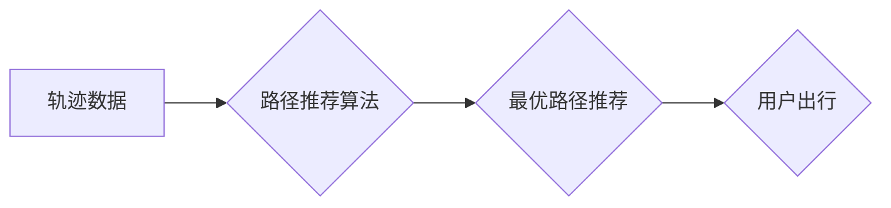

## 基于轨迹数据的最优路径推荐算法设计与实现

> 关键词：轨迹数据，路径推荐，最优路径，机器学习，深度学习，地理空间分析

## 1. 背景介绍

在当今数据爆炸的时代，轨迹数据作为一种反映用户行为和移动模式的重要信息源，在城市规划、交通管理、物流配送、精准营销等领域发挥着越来越重要的作用。如何有效地挖掘轨迹数据中的价值，并将其应用于路径推荐，成为了一个重要的研究方向。

传统的路径推荐算法主要依赖于用户历史行为数据和静态地图信息，但这些方法往往难以捕捉用户动态变化的偏好和需求。而基于轨迹数据的路径推荐算法，能够更全面地了解用户的移动轨迹和行为模式，从而提供更精准、更个性化的路径推荐服务。

## 2. 核心概念与联系

### 2.1 轨迹数据

轨迹数据是指用户在空间中移动过程中记录的时空信息序列，通常包含用户的位置、时间戳、速度等属性。轨迹数据可以来自各种来源，例如 GPS 定位、手机基站定位、WiFi 定位等。

### 2.2 路径推荐

路径推荐是指根据用户的历史轨迹数据、当前位置和目标地点，推荐一条最优路径，以满足用户的出行需求。最优路径的定义可以根据不同的场景和用户需求进行调整，例如最短路径、最快速路径、最经济路径等。

### 2.3 核心概念关系

**Mermaid 流程图**



## 3. 核心算法原理 & 具体操作步骤

### 3.1 算法原理概述

基于轨迹数据的最优路径推荐算法通常采用机器学习或深度学习方法，通过学习用户历史轨迹数据中的模式和规律，预测用户的未来出行行为，并推荐最优路径。常见的算法包括：

* **基于规则的算法:** 根据预先设定的规则，例如时间、距离、交通状况等，推荐路径。
* **基于聚类的算法:** 将用户轨迹数据进行聚类，将具有相似出行行为的用户归为一类，并根据类别的特征推荐路径。
* **基于预测的算法:** 利用机器学习模型，预测用户的未来出行目的地和时间，并根据预测结果推荐路径。

### 3.2 算法步骤详解

以基于预测的算法为例，其具体操作步骤如下：

1. **数据预处理:** 对轨迹数据进行清洗、格式化、特征提取等操作，例如去除噪声数据、将时间戳转换为时间特征、提取用户速度、方向等信息。
2. **模型训练:** 选择合适的机器学习模型，例如支持向量机、决策树、神经网络等，对预处理后的轨迹数据进行训练，学习用户出行行为的模式和规律。
3. **路径规划:** 根据训练好的模型，预测用户的未来出行目的地和时间，并利用路径规划算法，例如 Dijkstra 算法、A* 算法等，推荐一条最优路径。
4. **结果评估:** 使用评价指标，例如准确率、召回率、F1 值等，评估算法的性能。

### 3.3 算法优缺点

**优点:**

* 能够更精准地预测用户的出行行为，提供更个性化的路径推荐。
* 可以考虑多种因素，例如时间、距离、交通状况等，推荐更合理的路径。

**缺点:**

* 需要大量的轨迹数据进行训练，数据质量对算法性能有重要影响。
* 模型训练过程复杂，需要专业的机器学习知识和技术。

### 3.4 算法应用领域

基于轨迹数据的路径推荐算法在以下领域具有广泛的应用前景：

* **城市交通管理:** 优化交通流量，缓解拥堵状况，提高出行效率。
* **物流配送:** 规划最优配送路线，提高配送效率和降低成本。
* **精准营销:** 根据用户的轨迹数据，精准推送广告和促销信息。
* **旅游推荐:** 根据用户的兴趣和历史轨迹，推荐个性化的旅游路线和景点。

## 4. 数学模型和公式 & 详细讲解 & 举例说明

### 4.1 数学模型构建

假设用户 $u$ 的轨迹数据为 $T_u = \{ (x_1, t_1), (x_2, t_2),..., (x_n, t_n) \}$, 其中 $x_i$ 表示用户在时间 $t_i$ 处的地理位置，$n$ 表示轨迹数据点的数量。

我们可以构建一个基于用户轨迹数据的路径推荐模型，其目标是预测用户 $u$ 在时间 $t$ 处的下一个位置 $x_{n+1}$。

### 4.2 公式推导过程

可以使用以下公式来预测用户 $u$ 在时间 $t$ 处的下一个位置 $x_{n+1}$:

$$
x_{n+1} = f(T_u, t)
$$

其中，$f$ 是一个机器学习模型，例如神经网络，它将用户轨迹数据 $T_u$ 和当前时间 $t$ 作为输入，输出用户下一个位置的预测值 $x_{n+1}$。

### 4.3 案例分析与讲解

例如，我们可以使用一个简单的线性回归模型来预测用户的下一个位置。假设用户的轨迹数据可以表示为一个二维向量，其中每个元素代表用户的经度和纬度。我们可以将用户的历史轨迹数据作为训练集，训练一个线性回归模型，该模型可以将用户的历史轨迹数据和当前时间作为输入，输出用户的下一个位置的预测值。

## 5. 项目实践：代码实例和详细解释说明

### 5.1 开发环境搭建

* 操作系统：Windows/Linux/macOS
* Python 版本：3.6+
* 必要的库：pandas, numpy, scikit-learn, geopandas

### 5.2 源代码详细实现

```python
import pandas as pd
from sklearn.linear_model import LinearRegression

# 加载轨迹数据
data = pd.read_csv('trajectory_data.csv')

# 数据预处理
#...

# 训练线性回归模型
model = LinearRegression()
model.fit(X_train, y_train)

# 预测下一个位置
#...

```

### 5.3 代码解读与分析

* 首先，我们使用 pandas 库加载轨迹数据。
* 然后，我们进行数据预处理，例如去除噪声数据、提取特征等。
* 接下来，我们使用 scikit-learn 库中的 LinearRegression 模型训练一个线性回归模型。
* 最后，我们使用训练好的模型预测用户的下一个位置。

### 5.4 运行结果展示

运行结果将显示用户的下一个位置的预测值，以及预测结果的准确率等指标。

## 6. 实际应用场景

### 6.1 城市交通管理

基于轨迹数据的路径推荐算法可以帮助城市交通管理部门优化交通流量，缓解拥堵状况，提高出行效率。例如，可以根据用户的轨迹数据预测交通拥堵区域，并推荐避开拥堵路段的路径。

### 6.2 物流配送

基于轨迹数据的路径推荐算法可以帮助物流配送公司规划最优配送路线，提高配送效率和降低成本。例如，可以根据用户的轨迹数据预测用户在特定时间段内的需求，并根据预测结果优化配送路线。

### 6.3 精准营销

基于轨迹数据的路径推荐算法可以帮助商家进行精准营销，根据用户的轨迹数据推送个性化的广告和促销信息。例如，可以根据用户的轨迹数据预测用户可能感兴趣的商品或服务，并推送相关的广告信息。

### 6.4 未来应用展望

随着轨迹数据的积累和分析技术的进步，基于轨迹数据的路径推荐算法将在未来发挥更重要的作用。例如，可以结合其他数据源，例如天气预报、交通状况等，提供更精准、更智能的路径推荐服务。

## 7. 工具和资源推荐

### 7.1 学习资源推荐

* **书籍:**
    * 《机器学习》 - 周志华
    * 《深度学习》 - Ian Goodfellow
* **在线课程:**
    * Coursera: Machine Learning
    * edX: Deep Learning

### 7.2 开发工具推荐

* **Python:** 
    * pandas
    * numpy
    * scikit-learn
    * geopandas
* **地图API:**
    * Google Maps API
    * Baidu Maps API

### 7.3 相关论文推荐

* **基于轨迹数据的路径推荐算法研究**
* **深度学习在路径推荐中的应用**

## 8. 总结：未来发展趋势与挑战

### 8.1 研究成果总结

基于轨迹数据的路径推荐算法取得了显著的进展，能够提供更精准、更个性化的路径推荐服务。

### 8.2 未来发展趋势

* **多模态数据融合:** 将轨迹数据与其他数据源，例如用户画像、天气预报、交通状况等进行融合，提供更全面的路径推荐服务。
* **个性化推荐:** 基于用户的历史轨迹数据、偏好和需求，提供更个性化的路径推荐服务。
* **实时路径规划:** 基于实时交通状况和用户需求，进行动态路径规划，提供更灵活、更便捷的出行体验。

### 8.3 面临的挑战

* **数据隐私保护:** 轨迹数据包含用户的隐私信息，如何保护用户隐私是需要解决的关键问题。
* **算法复杂度:** 基于深度学习的路径推荐算法计算复杂度较高，需要更高效的算法和硬件支持。
* **数据质量:** 轨迹数据的质量直接影响算法性能，需要开发有效的轨迹数据清洗和预处理方法。

### 8.4 研究展望

未来，基于轨迹数据的路径推荐算法将继续朝着更智能、更个性化、更安全的方向发展，为用户提供更便捷、更舒适的出行体验。

## 9. 附录：常见问题与解答

* **Q1: 如何处理轨迹数据中的噪声数据？**

* **A1:** 可以使用移动平均法、中值滤波法等方法进行噪声数据处理。

* **Q2: 如何评估路径推荐算法的性能？**

* **A2:** 可以使用准确率、召回率、F1 值等指标进行评估。

* **Q3: 如何保护用户隐私？**

* **A3:** 可以使用数据脱敏、加密等技术保护用户隐私。


作者：禅与计算机程序设计艺术 / Zen and the Art of Computer Programming 
