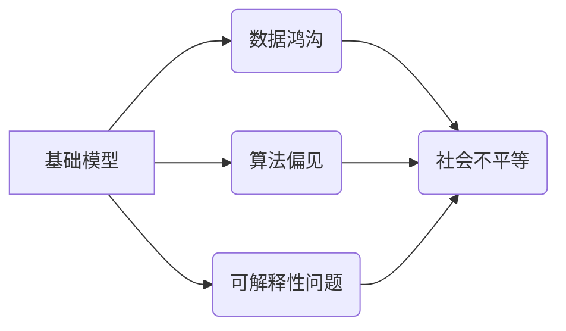

## 基础模型的社会不平等问题

> 关键词：基础模型、社会不平等、算法偏见、数据鸿沟、可解释性、公平性、伦理

### 1. 背景介绍

基础模型（Foundation Models）近年来在人工智能领域掀起了一场革命。这些模型通常拥有庞大的参数规模和广泛的知识储备，能够在多种任务上表现出惊人的泛化能力。从自然语言处理到计算机视觉，基础模型已经取得了突破性的进展，为我们带来了许多便利和可能性。然而，在基础模型的蓬勃发展的同时，也逐渐暴露出一系列社会不平等问题，这些问题不容忽视。

### 2. 核心概念与联系

**2.1 基础模型的定义**

基础模型是指在海量数据上预训练的强大通用人工智能模型。它们通常具有以下特点：

* **规模庞大:** 基础模型拥有数亿甚至数十亿个参数，使其能够学习到复杂的模式和关系。
* **多任务学习:** 基础模型可以被微调到执行多种不同的任务，例如文本生成、图像识别、机器翻译等。
* **泛化能力强:** 基于其广泛的知识储备，基础模型能够在未见过的任务和数据上表现出良好的泛化能力。

**2.2 社会不平等问题**

社会不平等是指不同社会群体之间在资源、机会、权利等方面的不公平分配。在人工智能领域，基础模型的开发和应用可能会加剧社会不平等，主要体现在以下几个方面：

* **数据鸿沟:** 基础模型的训练依赖于海量数据，而数据往往由少数机构或国家掌握，导致数据资源分配不均，不利于发展中国家和边缘群体参与人工智能的建设。
* **算法偏见:** 基础模型的训练数据可能包含社会偏见，导致模型在某些群体上表现出不公平的结果，例如种族、性别、年龄等方面的歧视。
* **可解释性问题:** 基础模型的决策过程往往难以理解，这使得其应用在一些关键领域，例如医疗、司法等，存在伦理风险和信任问题。

**2.3 核心概念关系图**

### 3. 核心算法原理 & 具体操作步骤

**3.1 算法原理概述**

基础模型通常采用自监督学习（Self-Supervised Learning）的方式进行预训练。这种方法利用大量的未标记数据，通过设计特定的预训练任务，例如语言建模、图像分类等，让模型学习到通用的表示能力。

**3.2 算法步骤详解**

1. **数据收集和预处理:** 收集海量文本、图像、音频等数据，并进行清洗、格式化等预处理操作。
2. **模型架构设计:** 选择合适的模型架构，例如Transformer、CNN等，并根据任务需求进行调整。
3. **预训练任务设计:** 设计特定的预训练任务，例如语言建模、图像分类等，并构建相应的损失函数。
4. **模型训练:** 利用预训练数据和任务，训练模型参数，使其能够学习到通用的表示能力。
5. **模型微调:** 将预训练好的模型微调到具体的下游任务，例如文本生成、机器翻译等。

**3.3 算法优缺点**

**优点:**

* **泛化能力强:** 基于海量数据的预训练，基础模型能够在多种任务上表现出良好的泛化能力。
* **效率高:** 预训练模型可以复用，减少了下游任务的训练时间和资源消耗。
* **创新潜力大:** 基础模型的开放性和可定制性，为人工智能的创新发展提供了广阔的空间。

**缺点:**

* **数据依赖性强:** 基础模型的性能依赖于训练数据的质量和数量，数据鸿沟问题可能导致模型的公平性问题。
* **计算资源消耗大:** 基础模型的训练需要大量的计算资源，这对于资源有限的机构或个人来说是一个挑战。
* **可解释性问题:** 基础模型的决策过程往往难以理解，这使得其应用在一些关键领域存在伦理风险和信任问题。

**3.4 算法应用领域**

基础模型在各个领域都有广泛的应用，例如：

* **自然语言处理:** 文本生成、机器翻译、问答系统、情感分析等。
* **计算机视觉:** 图像识别、物体检测、图像生成、视频分析等。
* **语音识别:** 语音转文本、语音合成、语音助手等。
* **科学研究:** 蛋白质结构预测、药物发现、材料科学等。

### 4. 数学模型和公式 & 详细讲解 & 举例说明

**4.1 数学模型构建**

基础模型的训练通常基于深度学习框架，例如TensorFlow、PyTorch等。这些框架提供了一系列数学模型和算法，用于处理海量数据和学习复杂的模式。

**4.2 公式推导过程**

深度学习模型的训练过程本质上是一个优化问题，目标是找到模型参数，使得模型在训练数据上的损失函数最小化。损失函数通常采用交叉熵损失或均方误差损失等。

**4.3 案例分析与讲解**

例如，在自然语言处理任务中，可以使用Transformer模型进行文本生成。Transformer模型的架构包含多层编码器和解码器，每个层包含多头注意力机制和前馈神经网络。

**4.3.1 多头注意力机制**

多头注意力机制可以捕捉文本序列中不同位置之间的依赖关系。其公式如下：

$$
Attention(Q, K, V) = softmax(\frac{QK^T}{\sqrt{d_k}})V
$$

其中，Q、K、V分别代表查询矩阵、键矩阵和值矩阵，$d_k$代表键向量的维度。

**4.3.2 前馈神经网络**

前馈神经网络是一个简单的多层感知机，其公式如下：

$$
f(x) = \sigma(W_2 \sigma(W_1 x + b_1) + b_2)
$$

其中，$x$代表输入向量，$W_1$、$W_2$分别代表第一层和第二层的权重矩阵，$b_1$、$b_2$分别代表第一层和第二层的偏置向量，$\sigma$代表激活函数。

### 5. 项目实践：代码实例和详细解释说明

**5.1 开发环境搭建**

使用Python语言和深度学习框架TensorFlow或PyTorch进行基础模型的开发和训练。

**5.2 源代码详细实现**

使用代码实现基础模型的架构和训练流程，例如使用Transformer模型进行文本生成任务。

**5.3 代码解读与分析**

详细解释代码中的关键部分，例如多头注意力机制、前馈神经网络、损失函数等。

**5.4 运行结果展示**

展示模型在训练数据上的性能指标，例如准确率、困惑度等，并进行可视化分析。

### 6. 实际应用场景

**6.1 自然语言处理**

* **聊天机器人:** 基于基础模型的聊天机器人能够进行更自然、更流畅的对话。
* **机器翻译:** 基于基础模型的机器翻译系统能够提供更准确、更流畅的翻译结果。
* **文本摘要:** 基于基础模型的文本摘要系统能够自动生成文本的简洁摘要。

**6.2 计算机视觉**

* **图像识别:** 基于基础模型的图像识别系统能够识别各种物体、场景和人物。
* **图像生成:** 基于基础模型的图像生成系统能够生成逼真的图像，例如人脸、风景等。
* **视频分析:** 基于基础模型的视频分析系统能够自动识别视频中的事件、人物和物体。

**6.3 其他领域**

* **医疗诊断:** 基于基础模型的医疗诊断系统能够辅助医生进行疾病诊断。
* **金融风险评估:** 基于基础模型的金融风险评估系统能够识别潜在的金融风险。
* **科学研究:** 基于基础模型的科学研究系统能够加速科学发现。

**6.4 未来应用展望**

基础模型在未来将有更广泛的应用，例如：

* **个性化教育:** 基于基础模型的个性化教育系统能够根据学生的学习情况提供定制化的学习内容。
* **智能家居:** 基于基础模型的智能家居系统能够更好地理解用户的需求，提供更智能化的服务。
* **自动驾驶:** 基于基础模型的自动驾驶系统能够提高驾驶安全性和效率。

### 7. 工具和资源推荐

**7.1 学习资源推荐**

* **书籍:**
    * Deep Learning by Ian Goodfellow, Yoshua Bengio, and Aaron Courville
    * Hands-On Machine Learning with Scikit-Learn, Keras & TensorFlow by Aurélien Géron
* **课程:**
    * Stanford CS231n: Convolutional Neural Networks for Visual Recognition
    * Deep Learning Specialization by Andrew Ng on Coursera

**7.2 开发工具推荐**

* **深度学习框架:** TensorFlow, PyTorch, Keras
* **编程语言:** Python
* **云计算平台:** Google Cloud Platform, Amazon Web Services, Microsoft Azure

**7.3 相关论文推荐**

* Attention Is All You Need (Vaswani et al., 2017)
* BERT: Pre-training of Deep Bidirectional Transformers for Language Understanding (Devlin et al., 2018)
* GPT-3: Language Models are Few-Shot Learners (Brown et al., 2020)

### 8. 总结：未来发展趋势与挑战

**8.1 研究成果总结**

基础模型在人工智能领域取得了显著的进展，展现出强大的泛化能力和应用潜力。

**8.2 未来发展趋势**

* **模型规模进一步扩大:** 随着计算资源的不断发展，基础模型的规模将继续扩大，学习能力将进一步提升。
* **多模态学习:** 基础模型将融合文本、图像、音频等多种模态数据，实现更全面的知识表示。
* **可解释性增强:** 研究人员将致力于提高基础模型的可解释性，使其决策过程更加透明和可信。

**8.3 面临的挑战**

* **数据鸿沟:** 数据资源分配不均，可能导致基础模型在某些群体上表现出不公平的结果。
* **计算资源消耗:** 基础模型的训练需要大量的计算资源，这对于资源有限的机构或个人来说是一个挑战。
* **伦理风险:** 基础模型的应用可能带来伦理风险，例如算法偏见、隐私泄露等，需要谨慎对待。

**8.4 研究展望**

未来研究将重点关注以下几个方面:

* **解决数据鸿沟问题:** 开发新的数据收集和预处理方法，促进数据资源的公平分配。
* **降低计算资源消耗:** 研究新的训练算法和硬件架构，降低基础模型的训练成本。
* **增强模型可解释性:** 开发新的可解释性技术，使基础模型的决策过程更加透明和可信。

### 9. 附录：常见问题与解答

**9.1 如何评估基础模型的公平性？**

可以使用各种公平性评估指标，例如不公平度、差异化等，来评估基础模型在不同群体上的表现差异。

**9.2 如何缓解基础模型的算法偏见？**

可以通过以下方法缓解算法偏见:

* 使用更加公平的训练数据。
* 在训练过程中加入公平性约束。
* 开发新的算法和模型架构，减少算法偏见的产生。

**9.3 如何提高基础模型的可解释性？**

可以通过以下方法提高基础模型的可解释性:

* 使用可解释性模型，例如线性模型、决策树等。
* 使用注意力机制等技术，分析模型对输入数据的关注点。
* 使用可视化技术，展示模型的决策过程。

作者：禅与计算机程序设计艺术 / Zen and the Art of Computer Programming 
