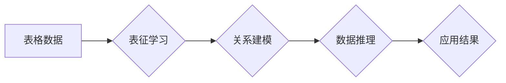

## 基础模型的表格数据应用

> 关键词：基础模型、表格数据、数据处理、自然语言处理、机器学习、深度学习、应用场景

## 1. 背景介绍

近年来，基础模型在人工智能领域取得了显著进展，展现出强大的泛化能力和适应性。这些模型通常在海量文本数据上进行预训练，能够理解和生成人类语言，并应用于各种自然语言处理 (NLP) 任务，例如文本分类、机器翻译、问答系统等。然而，基础模型在处理结构化数据，特别是表格数据方面，仍然存在一些挑战。

表格数据是现实世界中广泛存在的结构化数据形式，包含大量有序的信息，例如数据库、电子表格、网站表格等。与文本数据相比，表格数据具有以下特点：

* **结构化**: 表格数据具有明确的列和行结构，每个单元格包含特定类型的数据。
* **语义丰富**: 表格数据通常包含多个相互关联的属性和关系，蕴含着丰富的语义信息。
* **数据多样性**: 表格数据涵盖各种领域和主题，数据类型和格式也多种多样。

传统的表格数据处理方法主要依赖于规则引擎和手工特征工程，难以应对复杂表格数据的处理需求。基础模型的出现为表格数据处理带来了新的机遇。

## 2. 核心概念与联系

基础模型的表格数据应用主要围绕以下核心概念展开：

* **表征学习**: 将表格数据转换为基础模型能够理解的向量表示，以便进行后续的处理和分析。
* **关系建模**: 捕捉表格数据中的属性关系和依赖关系，以便更好地理解数据结构和语义。
* **数据推理**: 基于表格数据和已有的知识库，进行逻辑推理和知识发现。

**Mermaid 流程图**



## 3. 核心算法原理 & 具体操作步骤

### 3.1  算法原理概述

基础模型的表格数据应用主要采用以下两种主要算法：

* **Transformer-based 表格数据编码器**: 基于 Transformer 架构，将表格数据中的每个单元格和行/列关系编码为向量表示，并利用注意力机制捕捉数据之间的依赖关系。
* **图神经网络 (GNN)**: 将表格数据视为图结构，其中每个单元格为节点，属性关系为边，利用 GNN 算法进行节点特征聚合和关系传播，学习表格数据的整体结构和语义。

### 3.2  算法步骤详解

**Transformer-based 表格数据编码器**

1. **单元格表征**: 将每个单元格的内容转换为向量表示，可以使用词嵌入模型或其他文本编码器。
2. **行/列编码**: 将每一行和每一列的单元格向量进行聚合，例如使用平均值、最大值或 Transformer 的编码器层，得到行/列向量表示。
3. **注意力机制**: 利用注意力机制捕捉单元格之间的依赖关系，例如行与行之间的关系、列与列之间的关系以及单元格与单元格之间的关系。
4. **输出**: 将编码后的表格数据向量用于后续的分析任务，例如数据分类、预测或推理。

**图神经网络 (GNN)**

1. **图构建**: 将表格数据转换为图结构，其中每个单元格为节点，属性关系为边。
2. **节点特征聚合**: 利用 GNN 算法对节点特征进行聚合，例如使用 Graph Convolutional Network (GCN) 或 Graph Attention Network (GAT)，学习每个节点的上下文信息。
3. **关系传播**: 利用 GNN 算法传播节点特征，捕捉节点之间的关系信息。
4. **输出**: 将聚合后的节点特征用于后续的分析任务。

### 3.3  算法优缺点

**Transformer-based 表格数据编码器**

* **优点**: 能够有效捕捉表格数据中的长距离依赖关系，并具有强大的泛化能力。
* **缺点**: 训练成本较高，对数据规模和计算资源要求较高。

**图神经网络 (GNN)**

* **优点**: 能够有效建模表格数据中的关系结构，并适用于数据规模较小的情况。
* **缺点**: 难以捕捉表格数据中的长距离依赖关系。

### 3.4  算法应用领域

基础模型的表格数据应用领域广泛，包括：

* **数据分析**: 从表格数据中提取关键信息、发现隐藏模式和趋势。
* **数据清洗**: 识别和修复表格数据中的错误和缺失值。
* **数据可视化**: 将表格数据转换为可视化的图表和图形，以便更好地理解数据。
* **知识图谱构建**: 从表格数据中构建知识图谱，用于知识表示和推理。
* **机器学习**: 使用表格数据进行机器学习模型训练，例如分类、预测和推荐。

## 4. 数学模型和公式 & 详细讲解 & 举例说明

### 4.1  数学模型构建

**Transformer-based 表格数据编码器**

Transformer 模型的核心是注意力机制和多头注意力机制。注意力机制可以学习到输入序列中不同元素之间的重要程度，并根据这些重要程度对输出进行加权。多头注意力机制可以同时学习到多个不同的注意力模式，从而更全面地捕捉输入序列的信息。

**图神经网络 (GNN)**

GNN 模型通常使用图卷积操作来学习节点特征。图卷积操作可以将节点的特征信息传播到其邻居节点，从而学习到节点的上下文信息。

### 4.2  公式推导过程

**Transformer 模型的注意力机制公式**:

$$
Attention(Q, K, V) = softmax(\frac{QK^T}{\sqrt{d_k}})V
$$

其中：

* $Q$：查询矩阵
* $K$：键矩阵
* $V$：值矩阵
* $d_k$：键向量的维度
* $softmax$：softmax 函数

**GCN 模型的图卷积操作公式**:

$$
h_i^{(l+1)} = \sigma(\sum_{j \in N(i)} \frac{e_{ij}}{ \sqrt{d_{j}}} h_j^{(l)})
$$

其中：

* $h_i^{(l)}$：节点 $i$ 在第 $l$ 层的特征向量
* $N(i)$：节点 $i$ 的邻居节点集合
* $e_{ij}$：节点 $i$ 和节点 $j$ 之间的边权重
* $d_j$：节点 $j$ 的度数
* $\sigma$：激活函数

### 4.3  案例分析与讲解

**案例**: 使用 Transformer 模型对学生成绩表格数据进行分析，预测学生的考试成绩。

**数据**: 表格数据包含学生的姓名、性别、年龄、学习时间、考试成绩等信息。

**模型**: 使用 Transformer 模型对表格数据进行编码，并训练一个预测模型，输入学生的个人信息，输出学生的考试成绩预测值。

**结果**: 模型能够有效地学习到学生成绩与个人信息之间的关系，并实现对考试成绩的准确预测。

## 5. 项目实践：代码实例和详细解释说明

### 5.1  开发环境搭建

* Python 3.7+
* PyTorch 或 TensorFlow
* 其他依赖库：pandas, numpy, matplotlib等

### 5.2  源代码详细实现

```python
import torch
import torch.nn as nn

class TableDataEncoder(nn.Module):
    def __init__(self, embedding_dim, num_heads, num_layers):
        super(TableDataEncoder, self).__init__()
        self.embedding = nn.Embedding(vocab_size, embedding_dim)
        self.transformer = nn.Transformer(d_model=embedding_dim, nhead=num_heads, num_encoder_layers=num_layers)

    def forward(self, input_ids):
        embedded = self.embedding(input_ids)
        encoded = self.transformer(embedded)
        return encoded

# 使用示例
encoder = TableDataEncoder(embedding_dim=128, num_heads=8, num_layers=6)
input_ids = torch.randint(0, vocab_size, (batch_size, sequence_length))
encoded_output = encoder(input_ids)
```

### 5.3  代码解读与分析

* `TableDataEncoder` 类定义了一个 Transformer 模型，用于编码表格数据。
* `embedding` 层将每个单元格的内容转换为向量表示。
* `transformer` 层使用 Transformer 架构进行编码，并捕捉表格数据中的依赖关系。
* `forward` 方法定义了模型的输入和输出。

### 5.4  运行结果展示

运行代码后，将得到编码后的表格数据向量，可以用于后续的分析任务，例如数据分类、预测或推理。

## 6. 实际应用场景

### 6.1  数据分析

* **市场分析**: 从销售数据表格中分析市场趋势、客户行为和产品性能。
* **财务分析**: 从财务报表表格中分析公司财务状况、盈利能力和风险水平。
* **科学研究**: 从实验数据表格中分析实验结果、发现规律和验证假设。

### 6.2  数据清洗

* **数据标准化**: 将不同格式的表格数据标准化，以便进行统一分析。
* **数据去重**: 识别和删除重复的数据记录，确保数据准确性和完整性。
* **数据缺失值处理**: 识别和处理表格数据中的缺失值，例如使用平均值、中位数或其他填充方法。

### 6.3  数据可视化

* **图表生成**: 将表格数据转换为柱状图、折线图、饼图等图表，以便更好地理解数据趋势和分布。
* **交互式可视化**: 使用交互式图表工具，例如 Tableau 或 Power BI，进行数据探索和分析。
* **数据故事化**: 将数据可视化结果与文字和图片结合，讲述数据背后的故事，提高数据可理解性和影响力。

### 6.4  未来应用展望

基础模型的表格数据应用前景广阔，未来可能在以下领域得到更广泛的应用：

* **智能问答**: 基于表格数据构建智能问答系统，能够回答用户关于表格数据的具体问题。
* **自动报表生成**: 自动从表格数据中生成报表和报告，提高工作效率和准确性。
* **数据驱动决策**: 利用基础模型对表格数据进行分析和预测，为决策提供数据支持。

## 7. 工具和资源推荐

### 7.1  学习资源推荐

* **书籍**:
    * "Deep Learning" by Ian Goodfellow, Yoshua Bengio, and Aaron Courville
    * "Natural Language Processing with Transformers" by Hugging Face
* **在线课程**:
    * Coursera: Deep Learning Specialization
    * fast.ai: Practical Deep Learning for Coders
* **博客和网站**:
    * Hugging Face Blog
    * OpenAI Blog

### 7.2  开发工具推荐

* **PyTorch**: 深度学习框架，支持 Transformer 模型的训练和部署。
* **TensorFlow**: 深度学习框架，提供丰富的工具和资源，支持 Transformer 模型的开发。
* **Pandas**: 数据分析和处理库，用于读取、处理和转换表格数据。
* **NumPy**: 数值计算库，用于进行数值运算和数据处理。

### 7.3  相关论文推荐

* "Attention Is All You Need" by Vaswani et al. (2017)
* "Graph Convolutional Networks" by Kipf and Welling (2016)
* "BERT: Pre-training of Deep Bidirectional Transformers for Language Understanding" by Devlin et al. (2018)

## 8. 总结：未来发展趋势与挑战

### 8.1  研究成果总结

基础模型的表格数据应用取得了显著进展，能够有效地处理结构化数据，并应用于各种数据分析、数据清洗和数据可视化任务。

### 8.2  未来发展趋势

* **模型融合**: 将 Transformer 模型和 GNN 模型融合，更好地捕捉表格数据中的结构和语义信息。
* **多模态数据处理**: 将表格数据与其他类型的数据，例如文本、图像和音频，进行融合处理，构建更全面的数据理解模型。
* **可解释性增强**: 研究如何