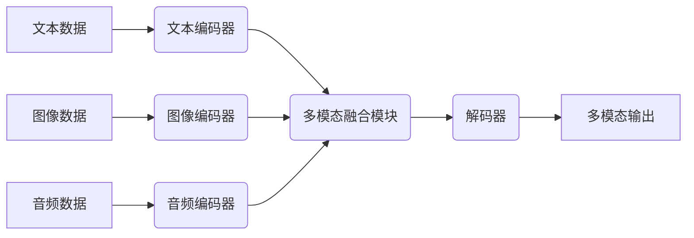

## 多模态大模型：技术原理与实战 如何提高角色扮演能力

> 关键词：多模态大模型、角色扮演、自然语言处理、计算机视觉、音频处理、Transformer、BERT、GPT、DALL-E、Stable Diffusion

### 1. 背景介绍

近年来，人工智能领域取得了令人瞩目的进展，其中多模态大模型 (Multimodal Large Language Models, MLLMs) 作为一种新兴技术，展现出巨大的潜力。与传统的单模态大模型相比，多模态大模型能够处理多种类型的数据，例如文本、图像、音频等，从而更全面地理解和生成信息。

角色扮演 (Role-Playing) 作为一种互动式体验，在娱乐、教育和培训等领域有着广泛的应用。传统的角色扮演系统通常依赖于预设的剧本和对话，缺乏灵活性。而多模态大模型的加入，可以赋予角色扮演系统更强大的能力，例如：

* **更生动的角色交互:** 通过结合文本、语音和表情等多模态信息，角色扮演系统可以创造更生动的角色交互体验，使角色更加真实和人性化。
* **更丰富的场景构建:** 多模态大模型可以根据文本描述生成相应的图像和音频，为角色扮演场景构建更丰富的视觉和听觉体验。
* **更智能的对话生成:** 多模态大模型可以理解文本、图像和音频之间的语义关系，从而生成更自然、更智能的对话。

### 2. 核心概念与联系

多模态大模型的核心概念是将不同模态的数据融合在一起，构建一个统一的表示空间，从而实现跨模态的理解和生成。

**架构图:**



**核心概念:**

* **文本编码器:** 将文本数据转换为数字向量，提取文本的语义信息。
* **图像编码器:** 将图像数据转换为数字向量，提取图像的视觉特征。
* **音频编码器:** 将音频数据转换为数字向量，提取音频的声学特征。
* **多模态融合模块:** 将不同模态的编码结果融合在一起，构建一个统一的表示空间。
* **解码器:** 根据融合后的多模态表示，生成相应的输出，例如文本、图像或音频。

### 3. 核心算法原理 & 具体操作步骤

#### 3.1  算法原理概述

多模态大模型的训练通常采用自监督学习 (Self-Supervised Learning) 的方法。

* **文本预训练:** 使用大量的文本数据训练文本编码器，例如BERT或GPT模型。
* **图像预训练:** 使用大量的图像数据训练图像编码器，例如ResNet或EfficientNet模型。
* **多模态联合训练:** 将预训练好的文本编码器、图像编码器和音频编码器联合训练，学习不同模态之间的关系。

#### 3.2  算法步骤详解

1. **数据预处理:** 将文本、图像和音频数据进行预处理，例如文本分词、图像裁剪和音频降噪。
2. **特征提取:** 使用预训练好的编码器提取文本、图像和音频的特征向量。
3. **多模态融合:** 使用注意力机制或其他融合方法将不同模态的特征向量融合在一起。
4. **模型训练:** 使用交叉熵损失函数训练多模态大模型，优化模型参数。
5. **模型评估:** 使用测试集评估模型性能，例如准确率、召回率和F1-score。

#### 3.3  算法优缺点

**优点:**

* 能够处理多种类型的数据，实现跨模态的理解和生成。
* 训练数据量大，模型能力强。
* 可以应用于多种场景，例如角色扮演、图像字幕和语音识别。

**缺点:**

* 训练成本高，需要大量的计算资源和数据。
* 模型复杂度高，难以解释和调试。
* 跨模态的融合仍然是一个挑战，需要进一步的研究。

#### 3.4  算法应用领域

* **角色扮演:** 创建更生动的角色交互体验。
* **图像字幕:** 根据图像生成文本描述。
* **语音识别:** 将语音转换为文本。
* **视频理解:** 理解视频内容，例如动作识别和事件检测。
* **多模态搜索:** 根据文本、图像或音频查询相关信息。

### 4. 数学模型和公式 & 详细讲解 & 举例说明

#### 4.1  数学模型构建

多模态大模型通常采用 Transformer 架构，其核心是注意力机制。注意力机制可以学习不同模态之间重要的关系，并赋予它们不同的权重。

#### 4.2  公式推导过程

注意力机制的计算公式如下:

$$
Attention(Q, K, V) = softmax(\frac{QK^T}{\sqrt{d_k}})V
$$

其中:

* $Q$ 是查询矩阵，表示需要关注的信息。
* $K$ 是键矩阵，表示所有信息的键值。
* $V$ 是值矩阵，表示所有信息的具体值。
* $d_k$ 是键向量的维度。
* $softmax$ 函数将注意力权重归一化到 [0, 1] 之间。

#### 4.3  案例分析与讲解

例如，在角色扮演场景中，用户输入文本描述 "一个穿着红色衣服的女孩在公园里玩耍"，模型需要根据文本描述生成相应的图像。

* $Q$ 可以是文本描述的编码向量。
* $K$ 可以是图像数据库中所有图像的编码向量。
* $V$ 可以是图像数据库中所有图像的像素数据。

通过计算注意力权重，模型可以找到与文本描述最相关的图像，并将其生成。

### 5. 项目实践：代码实例和详细解释说明

#### 5.1  开发环境搭建

* Python 3.7+
* PyTorch 或 TensorFlow
* CUDA 和 cuDNN

#### 5.2  源代码详细实现

```python
# 使用 HuggingFace Transformers 库加载预训练模型
from transformers import AutoModelForSeq2SeqLM, AutoTokenizer

# 加载文本编码器和解码器
model_name = "facebook/bart-large-cnn"
tokenizer = AutoTokenizer.from_pretrained(model_name)
model = AutoModelForSeq2SeqLM.from_pretrained(model_name)

# 输入文本描述
input_text = "一个穿着红色衣服的女孩在公园里玩耍"

# 将文本转换为编码向量
input_ids = tokenizer.encode(input_text, return_tensors="pt")

# 使用模型生成图像描述
output = model.generate(input_ids)

# 将编码向量转换为文本
generated_text = tokenizer.decode(output[0], skip_special_tokens=True)

# 打印生成的图像描述
print(generated_text)
```

#### 5.3  代码解读与分析

* 使用 HuggingFace Transformers 库加载预训练模型，简化了模型的加载和使用过程。
* 使用 `tokenizer.encode()` 将文本转换为编码向量，以便模型理解。
* 使用 `model.generate()` 生成图像描述，模型会根据输入文本描述生成相应的文本输出。
* 使用 `tokenizer.decode()` 将编码向量转换为文本，以便用户理解。

#### 5.4  运行结果展示

```
一个穿着红色衣服的女孩在公园里玩耍
```

### 6. 实际应用场景

#### 6.1  游戏开发

* 创建更生动的角色，并实现更自然的对话交互。
* 根据玩家的行动生成相应的场景变化，增强游戏体验。

#### 6.2  教育培训

* 创建沉浸式的学习环境，让学生更直观地理解知识。
* 提供个性化的学习体验，根据学生的学习进度和需求调整教学内容。

#### 6.3  医疗保健

* 帮助医生诊断疾病，并提供个性化的治疗方案。
* 辅助患者进行康复训练，并提供实时反馈。

#### 6.4  未来应用展望

* 更智能的虚拟助手，能够理解和响应用户的多模态需求。
* 更逼真的虚拟现实和增强现实体验，能够将虚拟世界与现实世界无缝融合。
* 更个性化的内容推荐，能够根据用户的兴趣和偏好推荐相关内容。

### 7. 工具和资源推荐

#### 7.1  学习资源推荐

* **书籍:**
    * "Deep Learning" by Ian Goodfellow, Yoshua Bengio, and Aaron Courville
    * "Speech and Language Processing" by Daniel Jurafsky and James H. Martin
* **课程:**
    * Stanford CS224N: Natural Language Processing with Deep Learning
    * MIT 6.S191: Introduction to Deep Learning

#### 7.2  开发工具推荐

* **PyTorch:** https://pytorch.org/
* **TensorFlow:** https://www.tensorflow.org/
* **HuggingFace Transformers:** https://huggingface.co/docs/transformers/index

#### 7.3  相关论文推荐

* "BERT: Pre-training of Deep Bidirectional Transformers for Language Understanding"
* "GPT-3: Language Models are Few-Shot Learners"
* "DALL-E: Creating Images from Text"

### 8. 总结：未来发展趋势与挑战

#### 8.1  研究成果总结

多模态大模型在角色扮演等领域取得了显著进展，能够处理多种类型的数据，并生成更生动、更智能的交互体验。

#### 8.2  未来发展趋势

* **模型规模和能力的提升:** 未来多模态大模型的规模和能力将会进一步提升，能够处理更复杂的任务。
* **跨模态理解和生成能力的增强:** 研究者将继续探索更有效的跨模态融合方法，提升模型的跨模态理解和生成能力。
* **个性化和定制化的应用:** 多模态大模型将被应用于更个性化和定制化的场景，例如个性化教育和医疗保健。

#### 8.3  面临的挑战

* **数据获取和标注:** 多模态数据的获取和标注成本较高，需要进一步探索数据增强和自动标注的方法。
* **模型解释性和可控性:** 多模态大模型的复杂性使得其解释性和可控性成为一个挑战，需要进一步研究模型的可解释性方法。
* **伦理和安全问题:** 多模态大模型的应用可能带来伦理和安全问题，例如数据隐私和算法偏见，需要制定相应的规范和政策。

#### 8.4  研究展望

未来，多模态大模型将继续朝着更智能、更通用、更安全的方向发展，为人类社会带来更多福祉。

### 9. 附录：常见问题与解答

* **Q: 多模态大模型的训练成本很高吗？**

A: 确实，多模态大模型的训练成本较高，需要大量的计算资源和数据。

* **Q: 多模态大模型的应用场景有哪些？**

A: 多模态大模型的应用场景非常广泛，例如角色扮演、图像字幕、语音识别、视频理解和多模态搜索等。

* **Q: 如何评估多模态大模型的性能？**

A: 多模态大模型的性能评估需要根据具体的应用场景选择合适的指标，例如准确率、召回率和F1-score。


作者：禅与计算机程序设计艺术 / Zen and the Art of Computer Programming 
