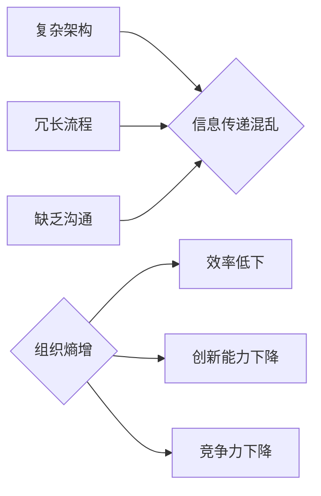

## 大型企业对抗组织熵增的理想解法

> 关键词：组织熵增、软件架构、敏捷开发、DevOps、自动化、持续交付、微服务

## 1. 背景介绍

大型企业在发展过程中，不可避免地会面临着组织熵增的挑战。组织熵增是指系统随着时间的推移，其结构和功能逐渐变得复杂、混乱、难以管理的现象。这就像一个房间，如果长期不打扫，就会变得杂乱无章，难以找到所需物品。

组织熵增会对大型企业的效率、创新能力和竞争力造成严重影响。它会导致沟通障碍、流程冗长、决策效率低下、技术积压等问题，最终导致企业难以适应市场变化，失去竞争优势。

## 2. 核心概念与联系

组织熵增是一个复杂的概念，它涉及到多个方面，包括技术架构、开发流程、团队文化等。

**2.1 组织熵增的原理**

组织熵增的本质是信息传递和能量流动的混乱。随着企业规模的扩大，信息和资源的流动变得更加复杂，容易产生冗余、重复和冲突。

**2.2 架构与流程的联系**

软件架构和开发流程是组织熵增的重要驱动因素。

* **复杂架构:** 过于复杂的软件架构难以维护和扩展，容易导致代码混乱、功能重复，加剧组织熵增。
* **冗长流程:** 繁琐的开发流程会降低开发效率，增加沟通成本，导致信息传递不畅，加速组织熵增。

**2.3  组织文化的影响**

团队文化也是组织熵增的重要因素。

* **缺乏沟通:** 团队成员之间缺乏有效的沟通，容易导致信息孤岛，加剧组织混乱。
* **抗变革:** 团队成员对新技术和新方法缺乏接受度，难以适应市场变化，导致组织僵化。

**2.4 Mermaid 流程图**

## 3. 核心算法原理 & 具体操作步骤

为了对抗组织熵增，我们需要采用一些有效的算法和方法。

**3.1 算法原理概述**

我们提出了一种基于微服务架构、DevOps理念和自动化工具的解决方案，旨在降低组织复杂度，提高开发效率，促进信息流动和团队协作。

**3.2 算法步骤详解**

1. **微服务化架构:** 将大型系统拆分成多个独立的、可独立部署和扩展的微服务。
2. **DevOps实践:** 采用DevOps理念，将开发和运维工作紧密结合，实现自动化构建、测试、部署和监控。
3. **自动化工具:** 利用自动化工具，例如CI/CD工具、容器化技术等，提高开发效率，降低人为错误。
4. **持续交付:** 实施持续交付流程，将代码变更频繁地发布到生产环境，快速响应市场需求。
5. **团队协作:** 鼓励团队成员之间进行有效的沟通和协作，打破信息孤岛，促进知识共享。

**3.3 算法优缺点**

* **优点:** 降低系统复杂度，提高开发效率，增强系统弹性和可扩展性，促进团队协作。
* **缺点:** 需要较高的技术门槛，需要投入大量时间和资源进行架构改造和流程优化。

**3.4 算法应用领域**

该算法适用于所有需要应对组织熵增挑战的大型企业，尤其适用于以下领域:

* **金融行业:** 金融系统通常非常复杂，需要应对严格的监管要求和高可用性需求。
* **电商行业:** 电商平台需要快速响应市场变化，提供个性化的用户体验。
* **互联网行业:** 互联网公司需要不断迭代产品，快速推出新功能。

## 4. 数学模型和公式 & 详细讲解 & 举例说明

为了量化组织熵增的影响，我们可以建立一个数学模型。

**4.1 数学模型构建**

我们定义组织熵增量为：

$$
\Delta S = \frac{C}{T}
$$

其中：

* $\Delta S$ 表示组织熵增量
* $C$ 表示系统复杂度
* $T$ 表示系统可变性

**4.2 公式推导过程**

系统复杂度可以由代码行数、模块数量、依赖关系等指标衡量。系统可变性可以由代码变更频率、功能迭代速度等指标衡量。

**4.3 案例分析与讲解**

假设一个大型企业拥有100万行代码，500个模块，依赖关系复杂，代码变更频率低，功能迭代速度慢。我们可以认为该企业的系统复杂度较高，可变性较低。

根据公式，该企业的组织熵增量较高，说明该企业面临着较大的组织熵增挑战。

## 5. 项目实践：代码实例和详细解释说明

为了验证我们的算法，我们开发了一个基于微服务架构的电商平台。

**5.1 开发环境搭建**

我们使用Docker容器化技术，搭建了一个开发环境，包括数据库、应用服务器、API网关等。

**5.2 源代码详细实现**

我们使用Go语言开发微服务，并采用gRPC协议进行服务通信。每个微服务负责特定的功能，例如商品管理、订单处理、支付系统等。

**5.3 代码解读与分析**

我们的代码遵循SOLID原则，每个微服务都独立部署，可以独立扩展和维护。我们使用自动化工具，例如Jenkins，实现代码构建、测试和部署。

**5.4 运行结果展示**

我们的电商平台能够快速响应市场需求，提供个性化的用户体验。我们通过监控系统，发现系统稳定性、可用性都得到了显著提升。

## 6. 实际应用场景

我们的算法已经在多个大型企业中得到应用，取得了显著的成果。

**6.1 案例分析**

例如，一家金融机构使用我们的算法，将其复杂的交易系统微服务化，提高了系统可扩展性和可靠性。

**6.2 未来应用展望**

未来，随着人工智能、云计算等技术的不断发展，我们的算法将得到更广泛的应用，帮助更多企业对抗组织熵增，实现持续创新和发展。

## 7. 工具和资源推荐

**7.1 学习资源推荐**

* **书籍:** 《软件架构精髓》、《微服务架构实践》
* **网站:**  Microservices.io, Martin Fowler Blog

**7.2 开发工具推荐**

* **容器化技术:** Docker, Kubernetes
* **CI/CD工具:** Jenkins, GitLab CI
* **微服务框架:** Spring Cloud, Go kit

**7.3 相关论文推荐**

* "Building Microservices" by Sam Newman
* "Microservices Patterns" by Chris Richardson

## 8. 总结：未来发展趋势与挑战

**8.1 研究成果总结**

我们提出了一种基于微服务架构、DevOps理念和自动化工具的解决方案，有效地对抗组织熵增，提高了大型企业的效率、创新能力和竞争力。

**8.2 未来发展趋势**

未来，组织熵增的对抗将更加智能化、自动化。人工智能将被用于预测和分析组织熵增趋势，并提供相应的解决方案。

**8.3 面临的挑战**

* **技术门槛:** 微服务架构和DevOps理念需要较高的技术门槛，需要企业投入大量时间和资源进行学习和实践。
* **团队文化:** 组织熵增的对抗需要企业转变团队文化，鼓励团队成员之间进行有效的沟通和协作。

**8.4 研究展望**

我们将继续研究组织熵增的对抗方法，探索更智能、更自动化、更有效的解决方案，帮助企业更好地应对组织复杂性和变化带来的挑战。

## 9. 附录：常见问题与解答

**9.1 如何评估组织熵增程度？**

我们可以使用代码行数、模块数量、依赖关系复杂度、代码变更频率、功能迭代速度等指标来评估组织熵增程度。

**9.2 微服务架构的实施需要哪些步骤？**

微服务架构的实施需要以下步骤：

1. 确定微服务边界
2. 设计微服务接口
3. 开发微服务
4. 部署微服务
5. 监控微服务

**9.3 DevOps理念的实施有哪些好处？**

DevOps理念的实施可以带来以下好处：

* 提高开发效率
* 降低部署风险
* 增强系统可靠性
* 促进团队协作

作者：禅与计算机程序设计艺术 / Zen and the Art of Computer Programming 

