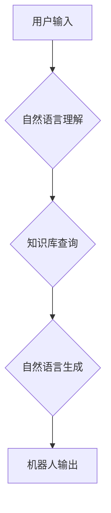

## 大模型问答机器人的自然语言技术

> 关键词：大模型、问答机器人、自然语言处理、Transformer、BERT、GPT、知识图谱、语义理解

## 1. 背景介绍

近年来，人工智能技术取得了飞速发展，自然语言处理（NLP）领域也取得了突破性进展。大模型问答机器人作为一种新型的智能交互系统，在人们的生活和工作中扮演着越来越重要的角色。它能够理解人类的自然语言输入，并生成准确、流畅、有意义的文本输出，从而实现人机自然、流畅的对话。

传统的问答系统主要依赖于规则和模板匹配，难以处理复杂、开放式的问答场景。而大模型问答机器人则通过训练海量文本数据，学习语言的语义和结构，能够理解更复杂的语言含义，并生成更自然、更符合语境的回答。

## 2. 核心概念与联系

### 2.1 自然语言处理（NLP）

自然语言处理（NLP）是人工智能领域的一个重要分支，旨在使计算机能够理解、处理和生成人类语言。NLP技术涵盖了多种任务，例如文本分类、情感分析、机器翻译、问答系统等。

### 2.2 大模型

大模型是指参数量巨大、训练数据量庞大的深度学习模型。大模型通常具有强大的泛化能力和表示能力，能够在多种NLP任务中取得优异的性能。

### 2.3 问答机器人

问答机器人是一种能够与人类进行对话，并回答用户问题的智能系统。问答机器人通常由自然语言理解模块、知识库模块和自然语言生成模块组成。

**核心概念与联系流程图**



## 3. 核心算法原理 & 具体操作步骤

### 3.1 算法原理概述

大模型问答机器人主要依赖于Transformer模型和BERT模型等预训练语言模型。

Transformer模型是一种新型的深度学习架构，能够有效地处理序列数据，例如文本。BERT模型是基于Transformer模型的预训练语言模型，通过在大量的文本数据上进行预训练，学习了语言的语义和结构。

### 3.2 算法步骤详解

1. **预训练语言模型:** 使用BERT等预训练语言模型对大量文本数据进行预训练，学习语言的语义和结构。
2. **下游任务微调:** 将预训练的语言模型用于问答任务，通过在问答数据集上进行微调，使其能够更好地理解问题和生成答案。
3. **问题理解:** 将用户输入的问题进行分析，提取关键信息，例如问题类型、实体、关系等。
4. **知识库查询:** 根据问题信息，从知识库中查询相关知识。
5. **答案生成:** 使用微调后的语言模型生成符合语境的答案。
6. **答案评估:** 对生成的答案进行评估，例如准确性、流畅性、相关性等。

### 3.3 算法优缺点

**优点:**

* 能够理解更复杂的语言含义。
* 生成更自然、更符合语境的答案。
* 泛化能力强，能够应用于多种问答场景。

**缺点:**

* 训练成本高，需要大量的计算资源和数据。
* 容易受到训练数据的影响，可能存在偏差或错误。
* 缺乏对真实世界知识的理解，难以回答一些需要常识推理的问题。

### 3.4 算法应用领域

大模型问答机器人具有广泛的应用领域，例如：

* **客服机器人:** 自动回答用户常见问题，提高客服效率。
* **教育机器人:** 为学生提供个性化的学习辅导，解答学习疑问。
* **搜索引擎:** 理解用户搜索意图，提供更精准的搜索结果。
* **医疗诊断:** 辅助医生进行疾病诊断，提供医疗信息咨询。

## 4. 数学模型和公式 & 详细讲解 & 举例说明

### 4.1 数学模型构建

大模型问答机器人的数学模型通常基于Transformer模型的架构，其核心是注意力机制。注意力机制能够学习文本中不同词语之间的关系，从而更好地理解上下文信息。

### 4.2 公式推导过程

Transformer模型的注意力机制使用以下公式计算每个词语的注意力权重：

$$
\text{Attention}(Q, K, V) = \text{softmax}\left(\frac{Q K^T}{\sqrt{d_k}}\right) V
$$

其中：

* $Q$：查询矩阵
* $K$：键矩阵
* $V$：值矩阵
* $d_k$：键向量的维度
* $\text{softmax}$：softmax函数

### 4.3 案例分析与讲解

假设我们有一个句子：“我爱吃苹果”。

* $Q$：查询矩阵表示每个词语对其他词语的关注程度。
* $K$：键矩阵表示每个词语的特征信息。
* $V$：值矩阵表示每个词语的语义信息。

通过计算注意力权重，我们可以得到每个词语对其他词语的关注程度，例如，“我”对“爱”的关注程度最高，因为它们是主语和谓语的关系。

## 5. 项目实践：代码实例和详细解释说明

### 5.1 开发环境搭建

* Python 3.6+
* TensorFlow/PyTorch
* CUDA/cuDNN

### 5.2 源代码详细实现

```python
# 使用HuggingFace Transformers库加载预训练模型
from transformers import AutoModelForQuestionAnswering, AutoTokenizer

model_name = "bert-base-uncased"
tokenizer = AutoTokenizer.from_pretrained(model_name)
model = AutoModelForQuestionAnswering.from_pretrained(model_name)

# 定义输入文本和问题
context = "我爱吃苹果。"
question = "我爱吃什么?"

# 对文本进行token化
inputs = tokenizer(context, question, return_tensors="pt")

# 使用模型进行预测
outputs = model(**inputs)

# 获取答案
answer_start = outputs.start_logits.argmax().item()
answer_end = outputs.end_logits.argmax().item()
answer = tokenizer.decode(inputs["input_ids"][0][answer_start:answer_end+1])

# 打印答案
print(answer)
```

### 5.3 代码解读与分析

* 使用HuggingFace Transformers库加载预训练模型，例如BERT模型。
* 对输入文本和问题进行token化，将文本转换为模型可以理解的格式。
* 使用模型进行预测，获取答案的起始位置和结束位置。
* 使用tokenizer解码答案，将token转换为可读文本。

### 5.4 运行结果展示

```
苹果
```

## 6. 实际应用场景

大模型问答机器人已经应用于许多实际场景，例如：

### 6.1 客服机器人

许多企业使用大模型问答机器人作为客服机器人，自动回答用户常见问题，例如订单查询、退换货政策等。

### 6.2 教育机器人

一些教育机构使用大模型问答机器人作为学习助手，为学生提供个性化的学习辅导，解答学习疑问。

### 6.3 搜索引擎

一些搜索引擎使用大模型问答机器人来理解用户搜索意图，并提供更精准的搜索结果。

### 6.4 未来应用展望

未来，大模型问答机器人将应用于更多领域，例如：

* **医疗诊断:** 辅助医生进行疾病诊断，提供医疗信息咨询。
* **法律咨询:** 为用户提供法律咨询服务，解答法律问题。
* **金融理财:** 为用户提供个性化的理财建议。

## 7. 工具和资源推荐

### 7.1 学习资源推荐

* **HuggingFace Transformers库:** https://huggingface.co/docs/transformers/index
* **BERT模型论文:** https://arxiv.org/abs/1810.04805
* **Transformer模型论文:** https://arxiv.org/abs/1706.03762

### 7.2 开发工具推荐

* **TensorFlow:** https://www.tensorflow.org/
* **PyTorch:** https://pytorch.org/

### 7.3 相关论文推荐

* **XLNet:** https://arxiv.org/abs/1906.08237
* **RoBERTa:** https://arxiv.org/abs/1907.11692
* **T5:** https://arxiv.org/abs/1910.10683

## 8. 总结：未来发展趋势与挑战

### 8.1 研究成果总结

大模型问答机器人技术取得了显著进展，能够理解更复杂的语言含义，生成更自然、更符合语境的答案。

### 8.2 未来发展趋势

* **模型规模更大:** 训练更大规模的模型，提升模型的性能和泛化能力。
* **多模态交互:** 将文本、图像、音频等多模态信息融合到问答系统中，实现更丰富的交互体验。
* **个性化定制:** 根据用户的需求和偏好，定制个性化的问答机器人。

### 8.3 面临的挑战

* **数据质量:** 大模型需要海量高质量的数据进行训练，数据质量直接影响模型性能。
* **计算资源:** 训练大模型需要大量的计算资源，成本较高。
* **伦理问题:** 大模型问答机器人可能存在偏见或错误，需要解决伦理问题。

### 8.4 研究展望

未来，大模型问答机器人将朝着更智能、更安全、更可靠的方向发展，为人们的生活和工作带来更多便利。


## 9. 附录：常见问题与解答

**Q1: 大模型问答机器人与传统问答系统的区别是什么？**

**A1:** 传统问答系统主要依赖于规则和模板匹配，难以处理复杂、开放式的问答场景。而大模型问答机器人则通过训练海量文本数据，学习语言的语义和结构，能够理解更复杂的语言含义，并生成更自然、更符合语境的答案。

**Q2: 如何训练一个大模型问答机器人？**

**A2:** 训练一个大模型问答机器人需要以下步骤：

1. 收集海量文本数据。
2. 使用预训练语言模型对数据进行预训练。
3. 将预训练模型用于问答任务，在问答数据集上进行微调。
4. 对模型进行评估和优化。

**Q3: 大模型问答机器人的应用场景有哪些？**

**A3:** 大模型问答机器人的应用场景非常广泛，例如：客服机器人、教育机器人、搜索引擎、医疗诊断、法律咨询、金融理财等。


作者：禅与计算机程序设计艺术 / Zen and the Art of Computer Programming 
