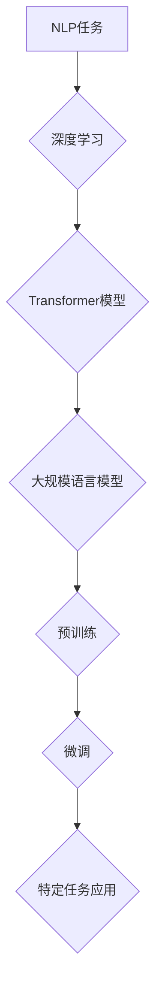

## 大规模语言模型从理论到实践 本书的内容安排

> 关键词：大规模语言模型、Transformer、深度学习、自然语言处理、文本生成、机器翻译、预训练、微调

### 1. 背景介绍

近年来，深度学习技术取得了飞速发展，特别是Transformer模型的出现，彻底改变了自然语言处理（NLP）领域的面貌。大规模语言模型（LLM）作为深度学习在NLP领域的顶尖成果，展现出强大的文本理解和生成能力，在机器翻译、文本摘要、对话系统、代码生成等领域取得了突破性进展。

本书旨在为读者提供从理论到实践的全面指南，帮助读者深入理解LLM的原理、架构、算法和应用。我们将从LLM的起源和发展历程开始，介绍其核心概念和技术原理，并深入探讨其背后的数学模型和算法设计。此外，我们将通过代码实例和实际应用场景，展示LLM的开发和应用实践，并展望其未来发展趋势和挑战。

### 2. 核心概念与联系

**2.1  自然语言处理（NLP）**

NLP是人工智能的一个分支，致力于使计算机能够理解、处理和生成人类语言。NLP的任务包括文本分类、情感分析、机器翻译、文本摘要等。

**2.2  深度学习（Deep Learning）**

深度学习是机器学习的一种高级形式，它利用多层神经网络来学习数据中的复杂模式。深度学习在图像识别、语音识别、自然语言处理等领域取得了显著成果。

**2.3  Transformer模型**

Transformer模型是一种基于注意力机制的深度学习模型，它能够有效地处理长距离依赖关系，在自然语言处理任务中表现出色。

**2.4  大规模语言模型（LLM）**

LLM是指参数量巨大、训练数据海量的大型语言模型。LLM通常基于Transformer模型架构，拥有数十亿甚至数千亿个参数，能够学习到丰富的语言知识和模式。

**2.5  预训练和微调**

预训练是指在大量文本数据上训练LLM，使其学习到通用的语言表示。微调是指在特定任务数据上对预训练的LLM进行进一步训练，使其能够胜任特定任务。

**2.6  LLM的应用场景**

LLM在多个领域都有广泛的应用，包括：

* **机器翻译:** 将一种语言翻译成另一种语言。
* **文本摘要:** 将长篇文本压缩成简短的摘要。
* **对话系统:** 与人类进行自然语言对话。
* **代码生成:** 根据自然语言描述生成代码。
* **文本创作:** 生成诗歌、小说、剧本等创意文本。

**2.7  Mermaid 流程图**



### 3. 核心算法原理 & 具体操作步骤

**3.1  算法原理概述**

LLM的核心算法是Transformer模型，它基于注意力机制，能够有效地处理长距离依赖关系。Transformer模型由编码器和解码器两部分组成。编码器将输入文本序列编码成上下文向量，解码器根据上下文向量生成输出文本序列。

**3.2  算法步骤详解**

1. **输入嵌入:** 将输入文本序列中的每个单词转换为向量表示。
2. **编码器:** 将输入嵌入序列通过多层Transformer编码器进行处理，每个编码器层包含多头注意力机制和前馈神经网络。
3. **解码器:** 将编码器的输出作为上下文信息，通过多层Transformer解码器生成输出文本序列。
4. **输出解码:** 将解码器的输出向量转换为单词，生成最终的输出文本。

**3.3  算法优缺点**

**优点:**

* **处理长距离依赖关系:** 注意力机制能够有效地捕捉文本序列中的长距离依赖关系。
* **并行计算:** Transformer模型的架构允许并行计算，提高训练效率。
* **可扩展性:** Transformer模型可以轻松扩展到更大的规模，训练更强大的LLM。

**缺点:**

* **训练成本高:** 训练大型Transformer模型需要大量的计算资源和时间。
* **参数量大:** Transformer模型的参数量巨大，需要大量的存储空间。
* **可解释性低:** Transformer模型的内部机制比较复杂，难以解释其决策过程。

**3.4  算法应用领域**

Transformer模型和LLM在多个领域都有广泛的应用，包括：

* **机器翻译:** Google Translate、DeepL等机器翻译系统都采用了Transformer模型。
* **文本摘要:** BART、T5等模型能够生成高质量的文本摘要。
* **对话系统:** ChatGPT、LaMDA等对话系统都基于Transformer模型。
* **代码生成:** Codex、GitHub Copilot等代码生成工具都使用了LLM。
* **文本创作:** GPT-3等模型能够生成诗歌、小说、剧本等创意文本。

### 4. 数学模型和公式 & 详细讲解 & 举例说明

**4.1  数学模型构建**

LLM的数学模型主要基于神经网络，其中包括多层感知机（MLP）、注意力机制和位置编码等组件。

* **多层感知机（MLP）:** MLP是一种基本的深度学习模型，它由多个全连接层组成。

* **注意力机制:** 注意力机制能够学习到文本序列中重要信息的位置，并赋予它们更高的权重。

* **位置编码:** 由于Transformer模型没有循环结构，无法直接学习到文本序列中的位置信息，因此需要使用位置编码来嵌入位置信息。

**4.2  公式推导过程**

注意力机制的核心公式是计算每个单词对其他单词的注意力权重。

$$
Attention(Q, K, V) = softmax(\frac{QK^T}{\sqrt{d_k}})V
$$

其中：

* $Q$ 是查询矩阵，表示当前单词的表示。
* $K$ 是键矩阵，表示其他单词的表示。
* $V$ 是值矩阵，表示其他单词的语义信息。
* $d_k$ 是键向量的维度。

**4.3  案例分析与讲解**

假设我们有一个句子“我爱学习编程”，我们要计算“学习”这个单词对其他单词的注意力权重。

* $Q$ 是“学习”的向量表示。
* $K$ 是其他单词的向量表示，例如“我”、“爱”、“编程”。
* $V$ 是其他单词的语义信息。

通过计算注意力权重，我们可以得到“学习”这个单词对其他单词的关注程度，例如，“学习”对“编程”的注意力权重可能比较高，因为它们在语义上相关。

### 5. 项目实践：代码实例和详细解释说明

**5.1  开发环境搭建**

* 安装Python和必要的库，例如PyTorch、TensorFlow等。
* 下载预训练的LLM模型权重文件。

**5.2  源代码详细实现**

```python
import torch
from transformers import AutoModelForSeq2SeqLM, AutoTokenizer

# 加载预训练模型和词典
model_name = "t5-base"
tokenizer = AutoTokenizer.from_pretrained(model_name)
model = AutoModelForSeq2SeqLM.from_pretrained(model_name)

# 输入文本
input_text = "翻译一下这句话：Hello, world!"

# Token化输入文本
input_ids = tokenizer.encode(input_text, return_tensors="pt")

# 生成输出文本
output = model.generate(input_ids)

# 解码输出文本
output_text = tokenizer.decode(output[0], skip_special_tokens=True)

# 打印输出文本
print(output_text)
```

**5.3  代码解读与分析**

* 使用`transformers`库加载预训练的T5模型和词典。
* 将输入文本进行Token化，转换为模型可以理解的格式。
* 使用`model.generate()`函数生成输出文本。
* 使用`tokenizer.decode()`函数解码输出文本，转换为人类可读的格式。

**5.4  运行结果展示**

```
你好，世界！
```

### 6. 实际应用场景

**6.1  机器翻译**

LLM可以用于将一种语言翻译成另一种语言，例如将英文翻译成中文。

**6.2  文本摘要**

LLM可以用于生成长篇文本的简短摘要，例如将新闻文章压缩成几句话。

**6.3  对话系统**

LLM可以用于构建能够与人类进行自然语言对话的聊天机器人。

**6.4  未来应用展望**

LLM在未来将有更广泛的应用，例如：

* **个性化教育:** 根据学生的学习情况提供个性化的学习内容和辅导。
* **医疗诊断:** 辅助医生进行疾病诊断和治疗方案制定。
* **法律服务:** 自动分析法律文件，提供法律建议。

### 7. 工具和资源推荐

**7.1  学习资源推荐**

* **书籍:**
    * 《深度学习》
    * 《自然语言处理》
    * 《Transformer模型详解》
* **在线课程:**
    * Coursera上的深度学习课程
    * edX上的自然语言处理课程
* **博客和网站:**
    * The Gradient
    * Towards Data Science
    * Hugging Face

**7.2  开发工具推荐**

* **PyTorch:** 一个开源的深度学习框架。
* **TensorFlow:** 另一个开源的深度学习框架。
* **transformers:** 一个用于加载和使用预训练语言模型的库。

**7.3  相关论文推荐**

* 《Attention Is All You Need》
* 《BERT: Pre-training of Deep Bidirectional Transformers for Language Understanding》
* 《GPT-3: Language Models are Few-Shot Learners》

### 8. 总结：未来发展趋势与挑战

**8.1  研究成果总结**

近年来，LLM取得了显著进展，在多个NLP任务上取得了突破性成果。

**8.2  未来发展趋势**

* **模型规模更大:** 随着计算资源的不断发展，LLM的规模将继续扩大，模型能力将进一步提升。
* **训练数据更丰富:** 训练数据将更加丰富多样，覆盖更多领域和语言。
* **应用场景更广泛:** LLM将应用于更多领域，例如教育、医疗、法律等。

**8.3  面临的挑战**

* **可解释性:** LLM的内部机制比较复杂，难以解释其决策过程。
* **偏见和公平性:** LLM可能存在偏见和不公平性，需要进行更深入的研究和解决。
* **安全性和隐私性:** LLM的应用需要考虑安全性和隐私性问题。

**8.4  研究展望**

未来研究将集中在以下几个方面：

* **提高LLM的可解释性:** 研究更有效的解释LLM决策的方法。
* **解决LLM的偏见和公平性问题:** 开发新的训练方法和评估指标，减少LLM的偏见和不公平性。
* **确保LLM的安全性和隐私性:** 研究LLM的安全性和隐私性问题，并开发相应的解决方案。

### 9. 附录：常见问题与解答

**9.1  LLM的训练需要多大的计算资源？**

LLM的训练需要大量的计算资源，例如GPU集群。

**9.2  如何评估LLM的性能？**

LLM的性能可以通过多种指标评估，例如准确率、BLEU分数、ROUGE分数等。

**9.3  LLM可以用于哪些具体的应用场景？**

LLM可以用于机器翻译、文本摘要、对话系统、代码生成、文本创作等多个应用场景。


作者：禅与计算机程序设计艺术 / Zen and the Art of Computer Programming