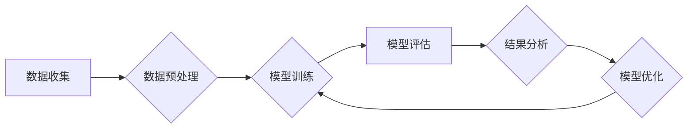

## 大规模语言模型从理论到实践 模型评估概述

> 关键词：大规模语言模型、模型评估、指标体系、基准测试、实际应用

### 1. 背景介绍

近年来，大规模语言模型（Large Language Models，LLMs）在自然语言处理领域取得了令人瞩目的成就。从文本生成、翻译到问答和代码编写，LLMs展现出强大的能力，深刻地改变了我们与语言交互的方式。然而，随着模型规模的不断扩大，如何有效地评估 LLMs 的性能和泛化能力成为了一个至关重要的课题。

传统的自然语言处理评估指标，例如准确率、召回率和F1-score，在处理复杂文本任务时往往显得不足。LLMs 的输出往往是连续的文本序列，而这些指标难以捕捉文本的语义和结构信息。因此，我们需要开发新的评估指标体系，能够更全面地衡量 LLMs 的能力。

### 2. 核心概念与联系

**2.1 模型评估概述**

模型评估是机器学习中一个至关重要的环节，它用于衡量模型的性能和泛化能力。对于 LLMs，模型评估的目标是评估模型在各种自然语言处理任务上的表现，例如：

* **文本生成:** 评估模型生成文本的流畅度、语法正确性和语义相关性。
* **文本分类:** 评估模型对文本进行分类的准确率和召回率。
* **问答:** 评估模型回答问题的能力和准确性。
* **机器翻译:** 评估模型翻译文本的准确性和流畅度。

**2.2 指标体系**

LLMs 的评估指标体系应涵盖以下几个方面：

* **语言质量:** 评估模型生成文本的流畅度、语法正确性和语义相关性。
* **任务性能:** 评估模型在特定任务上的准确率、召回率和F1-score。
* **鲁棒性:** 评估模型对噪声、错误和异常输入的抵抗能力。
* **公平性:** 评估模型在不同群体和背景下的表现是否公平。

**2.3 基准测试**

基准测试是模型评估的重要工具，它提供了一系列标准化的测试任务和数据集，用于比较不同模型的性能。一些常用的 LLMs 基准测试包括：

* **GLUE:** General Language Understanding Evaluation
* **SuperGLUE:** Super GLUE Benchmark
* **SQuAD:** Stanford Question Answering Dataset
* **WMT:** Workshop on Machine Translation

**2.4 流程图**



### 3. 核心算法原理 & 具体操作步骤

**3.1 算法原理概述**

LLMs 通常基于 Transformer 架构，该架构利用注意力机制来捕捉文本序列中的长距离依赖关系。Transformer 模型由编码器和解码器组成，编码器用于将输入文本序列编码为隐藏表示，解码器则利用这些隐藏表示生成输出文本序列。

**3.2 算法步骤详解**

1. **输入嵌入:** 将输入文本序列中的每个单词转换为向量表示。
2. **编码器:** 将嵌入向量输入到编码器中，编码器通过多层 Transformer 块进行处理，最终生成文本序列的隐藏表示。
3. **解码器:** 将隐藏表示输入到解码器中，解码器通过多层 Transformer 块和一个线性层生成输出文本序列。
4. **输出解码:** 将输出的向量表示转换为单词，生成最终的文本输出。

**3.3 算法优缺点**

**优点:**

* 能够捕捉长距离依赖关系。
* 训练效率高。
* 在各种自然语言处理任务上表现出色。

**缺点:**

* 模型规模庞大，训练成本高。
* 对训练数据要求高。
* 存在潜在的偏差和公平性问题。

**3.4 算法应用领域**

LLMs 在以下领域具有广泛的应用前景：

* **文本生成:** 写作、翻译、对话系统。
* **信息检索:** 搜索引擎、问答系统。
* **代码生成:** 自动生成代码、代码补全。
* **数据分析:** 文本摘要、情感分析。

### 4. 数学模型和公式 & 详细讲解 & 举例说明

**4.1 数学模型构建**

LLMs 的数学模型通常基于概率论和统计学原理。模型的目标是学习一个概率分布，该分布能够生成符合语义和语法规则的文本序列。

**4.2 公式推导过程**

Transformer 模型的核心是注意力机制，其数学公式如下：

$$
Attention(Q, K, V) = \frac{exp(Q \cdot K^T / \sqrt{d_k})}{exp(Q \cdot K^T / \sqrt{d_k})} \cdot V
$$

其中：

* $Q$：查询矩阵
* $K$：键矩阵
* $V$：值矩阵
* $d_k$：键向量的维度

**4.3 案例分析与讲解**

假设我们有一个句子 "The cat sat on the mat"，将其转换为词嵌入向量，然后输入到 Transformer 模型的编码器中。编码器会通过注意力机制计算每个词与其他词之间的相关性，并生成每个词的隐藏表示。这些隐藏表示将被传递到解码器中，解码器会根据这些隐藏表示生成下一个词的概率分布，最终生成完整的文本序列。

### 5. 项目实践：代码实例和详细解释说明

**5.1 开发环境搭建**

* Python 3.7+
* PyTorch 或 TensorFlow
* CUDA 和 cuDNN

**5.2 源代码详细实现**

```python
import torch
import torch.nn as nn

class Transformer(nn.Module):
    def __init__(self, vocab_size, embedding_dim, num_heads, num_layers):
        super(Transformer, self).__init__()
        self.embedding = nn.Embedding(vocab_size, embedding_dim)
        self.encoder = nn.TransformerEncoder(nn.TransformerEncoderLayer(embedding_dim, num_heads), num_layers)
        self.decoder = nn.TransformerDecoder(nn.TransformerDecoderLayer(embedding_dim, num_heads), num_layers)
        self.linear = nn.Linear(embedding_dim, vocab_size)

    def forward(self, src, tgt):
        src = self.embedding(src)
        tgt = self.embedding(tgt)
        src = self.encoder(src)
        tgt = self.decoder(tgt, src)
        output = self.linear(tgt)
        return output
```

**5.3 代码解读与分析**

* `Transformer` 类定义了 Transformer 模型的结构。
* `embedding` 层将单词转换为词嵌入向量。
* `encoder` 和 `decoder` 层分别负责编码和解码文本序列。
* `linear` 层将隐藏表示转换为单词概率分布。

**5.4 运行结果展示**

训练好的 Transformer 模型可以用于各种自然语言处理任务，例如文本生成、机器翻译和问答。

### 6. 实际应用场景

**6.1 文本生成**

LLMs 可以用于生成各种类型的文本，例如：

* **小说、诗歌和剧本:** 通过学习大量的文本数据，LLMs 可以生成具有创意和情感的文本。
* **新闻报道和文章:** LLMs 可以自动生成新闻报道和文章，节省人力成本。
* **对话系统:** LLMs 可以用于构建更自然和流畅的对话系统。

**6.2 信息检索**

LLMs 可以用于改进信息检索系统，例如：

* **搜索引擎:** LLMs 可以理解用户查询的语义，并返回更相关的搜索结果。
* **问答系统:** LLMs 可以回答用户的问题，并提供更详细和准确的答案。

**6.3 代码生成**

LLMs 可以用于自动生成代码，例如：

* **代码补全:** LLMs 可以根据上下文自动补全代码。
* **代码翻译:** LLMs 可以将代码从一种编程语言翻译到另一种编程语言。

**6.4 未来应用展望**

LLMs 的应用前景广阔，未来可能在以下领域发挥更大的作用：

* **教育:** 个性化学习、自动批改作业。
* **医疗:** 辅助诊断、生成医疗报告。
* **法律:** 法律文本分析、合同审查。

### 7. 工具和资源推荐

**7.1 学习资源推荐**

* **论文:** "Attention Is All You Need"
* **书籍:** "Deep Learning"
* **在线课程:** Coursera, edX

**7.2 开发工具推荐**

* **PyTorch:** https://pytorch.org/
* **TensorFlow:** https://www.tensorflow.org/

**7.3 相关论文推荐**

* "BERT: Pre-training of Deep Bidirectional Transformers for Language Understanding"
* "GPT-3: Language Models are Few-Shot Learners"
* "T5: Text-to-Text Transfer Transformer"

### 8. 总结：未来发展趋势与挑战

**8.1 研究成果总结**

近年来，LLMs 在自然语言处理领域取得了显著进展，展现出强大的能力和潜力。

**8.2 未来发展趋势**

* 模型规模的进一步扩大
* 训练数据的多样化和高质量
* 算法的改进和创新
* 伦理和公平性的研究

**8.3 面临的挑战**

* 训练成本高
* 数据偏差和公平性问题
* 可解释性和透明度问题
* 安全性和隐私问题

**8.4 研究展望**

未来，LLMs 将继续朝着更强大、更安全、更可解释的方向发展，并在更多领域发挥重要作用。

### 9. 附录：常见问题与解答

**9.1 如何选择合适的 LLMs 模型？**

选择合适的 LLMs 模型取决于具体的应用场景和需求。需要考虑模型规模、性能、训练数据、成本等因素。

**9.2 如何评估 LLMs 模型的性能？**

可以使用各种评估指标和基准测试来评估 LLMs 模型的性能，例如准确率、召回率、BLEU分数等。

**9.3 如何解决 LLMs 模型的偏差问题？**

可以通过使用更丰富和多样化的训练数据、开发公平性评估指标、设计对抗训练方法等方式来解决 LLMs 模型的偏差问题。


作者：禅与计算机程序设计艺术 / Zen and the Art of Computer Programming 
