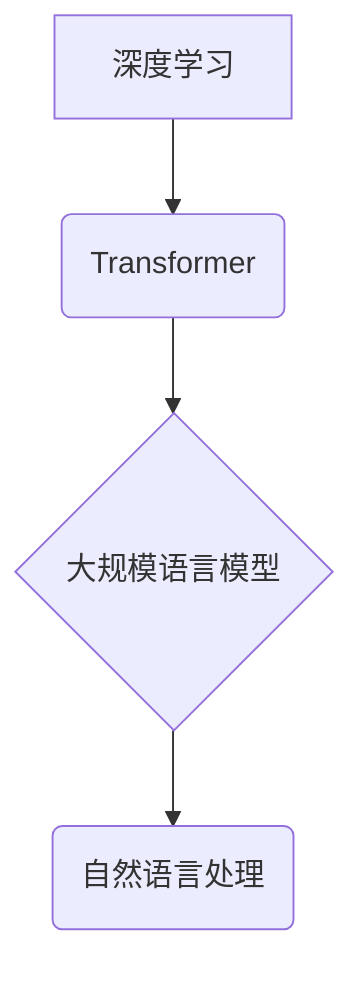

## 大规模语言模型从理论到实践 综合应用框架

> 关键词：大规模语言模型、Transformer、深度学习、自然语言处理、文本生成、机器翻译、问答系统

### 1. 背景介绍

近年来，深度学习技术取得了飞速发展，特别是Transformer模型的出现，彻底改变了自然语言处理（NLP）领域的面貌。大规模语言模型（LLM）作为深度学习在NLP领域的顶尖成果，展现出强大的文本理解和生成能力，在机器翻译、文本摘要、问答系统、代码生成等领域取得了突破性进展。

然而，LLM的应用并非一帆风顺。其训练成本高昂，部署难度大，以及潜在的伦理风险等问题也亟待解决。因此，构建一个从理论到实践的综合应用框架，能够有效地指导LLM的开发、应用和监管，显得尤为重要。

### 2. 核心概念与联系

**2.1 核心概念**

* **大规模语言模型 (LLM):** 指参数量达到数十亿甚至千亿级别的深度学习模型，通过学习海量文本数据，掌握了丰富的语言知识和模式。
* **Transformer:**  一种基于注意力机制的深度学习架构，能够有效地处理长距离依赖关系，是构建LLM的基础。
* **深度学习 (Deep Learning):** 一种机器学习方法，利用多层神经网络模拟人类大脑的学习过程，能够从复杂数据中提取特征和模式。
* **自然语言处理 (NLP):**  计算机科学的一个分支，致力于使计算机能够理解、处理和生成人类语言。

**2.2 架构关系**



**2.3 联系解释**

深度学习是构建LLM的基础，Transformer是LLM的核心架构，而LLM则应用于自然语言处理领域，解决各种语言理解和生成任务。

### 3. 核心算法原理 & 具体操作步骤

**3.1 算法原理概述**

LLM的核心算法是Transformer模型，其主要特点是利用注意力机制来处理文本序列中的长距离依赖关系。注意力机制能够赋予模型不同词语在句子中的不同权重，从而更好地理解上下文信息。

**3.2 算法步骤详解**

1. **词嵌入:** 将每个词语映射到一个低维向量空间中，表示词语的语义信息。
2. **编码器:** 利用多层Transformer模块对输入文本序列进行编码，提取文本的语义特征。
3. **解码器:** 利用多层Transformer模块对编码后的文本序列进行解码，生成目标文本序列。
4. **输出层:** 将解码器的输出映射到目标词汇表，预测每个词语的概率分布。

**3.3 算法优缺点**

* **优点:** 能够有效处理长距离依赖关系，具有强大的文本理解和生成能力。
* **缺点:** 训练成本高昂，参数量大，部署难度大。

**3.4 算法应用领域**

* 机器翻译
* 文本摘要
* 问答系统
* 代码生成
* 文本分类
* 情感分析

### 4. 数学模型和公式 & 详细讲解 & 举例说明

**4.1 数学模型构建**

LLM的数学模型主要基于Transformer架构，其核心是注意力机制。注意力机制可以表示为一个加权求和操作，权重由一个注意力函数计算得到。

**4.2 公式推导过程**

假设输入文本序列为 $x = (x_1, x_2,..., x_n)$，目标文本序列为 $y = (y_1, y_2,..., y_m)$。

* **注意力函数:**

$$
\text{Attention}(Q, K, V) = \text{softmax}\left(\frac{Q K^T}{\sqrt{d_k}}\right) V
$$

其中，$Q$, $K$, $V$ 分别为查询矩阵、键矩阵和值矩阵，$d_k$ 为键向量的维度。

* **Transformer模块:**

Transformer模块由多头注意力层、前馈神经网络和残差连接组成。

**4.3 案例分析与讲解**

例如，在机器翻译任务中，输入文本序列为源语言句子，目标文本序列为目标语言句子。Transformer模型通过注意力机制学习源语言句子中每个词语与目标语言句子中每个词语之间的关系，从而生成准确的翻译结果。

### 5. 项目实践：代码实例和详细解释说明

**5.1 开发环境搭建**

* Python 3.7+
* PyTorch 或 TensorFlow
* CUDA 和 cuDNN

**5.2 源代码详细实现**

```python
import torch
import torch.nn as nn

class Transformer(nn.Module):
    def __init__(self, vocab_size, embedding_dim, num_heads, num_layers):
        super(Transformer, self).__init__()
        self.embedding = nn.Embedding(vocab_size, embedding_dim)
        self.transformer_layers = nn.ModuleList([
            nn.TransformerEncoderLayer(embedding_dim, num_heads)
            for _ in range(num_layers)
        ])
        self.linear = nn.Linear(embedding_dim, vocab_size)

    def forward(self, x):
        x = self.embedding(x)
        for layer in self.transformer_layers:
            x = layer(x)
        x = self.linear(x)
        return x
```

**5.3 代码解读与分析**

* `__init__` 方法初始化模型参数，包括词嵌入层、Transformer层和输出层。
* `forward` 方法定义模型的正向传播过程，将输入序列经过词嵌入层、Transformer层和输出层，最终得到目标序列的概率分布。

**5.4 运行结果展示**

通过训练和测试，可以评估模型的性能，例如BLEU分数、准确率等。

### 6. 实际应用场景

**6.1 机器翻译**

LLM可以用于机器翻译，例如将英文翻译成中文。

**6.2 文本摘要**

LLM可以用于文本摘要，例如将一篇长篇文章总结成几句话。

**6.3 问答系统**

LLM可以用于问答系统，例如回答用户提出的问题。

**6.4 代码生成**

LLM可以用于代码生成，例如根据自然语言描述生成代码。

**6.5 未来应用展望**

LLM在未来将应用于更多领域，例如：

* 个性化教育
* 医疗诊断
* 法律咨询
* 创意写作

### 7. 工具和资源推荐

**7.1 学习资源推荐**

* **书籍:**
    * 《深度学习》
    * 《自然语言处理》
* **课程:**
    * Coursera: 自然语言处理
    * Stanford: CS224N: 自然语言处理与深度学习

**7.2 开发工具推荐**

* **PyTorch:** 深度学习框架
* **TensorFlow:** 深度学习框架
* **Hugging Face Transformers:** 预训练Transformer模型库

**7.3 相关论文推荐**

* 《Attention Is All You Need》
* 《BERT: Pre-training of Deep Bidirectional Transformers for Language Understanding》
* 《GPT-3: Language Models are Few-Shot Learners》

### 8. 总结：未来发展趋势与挑战

**8.1 研究成果总结**

LLM取得了显著的进展，在文本理解和生成任务上展现出强大的能力。

**8.2 未来发展趋势**

* 模型规模进一步扩大
* 训练效率提升
* 泛化能力增强
* 跨语言理解

**8.3 面临的挑战**

* 训练成本高昂
* 潜在的伦理风险
* 数据偏见问题
* 可解释性问题

**8.4 研究展望**

未来研究将集中在解决上述挑战，开发更安全、更可靠、更可解释的LLM。

### 9. 附录：常见问题与解答

* **什么是LLM？**

LLM是指参数量达到数十亿甚至千亿级别的深度学习模型，通过学习海量文本数据，掌握了丰富的语言知识和模式。

* **LLM的应用领域有哪些？**

LLM的应用领域非常广泛，包括机器翻译、文本摘要、问答系统、代码生成、文本分类、情感分析等。

* **如何训练LLM？**

LLM的训练需要大量的计算资源和海量文本数据。常用的训练方法包括自监督学习和强化学习。

* **LLM有哪些伦理风险？**

LLM可能存在生成虚假信息、传播偏见、侵犯隐私等伦理风险。因此，在开发和应用LLM时，需要认真考虑这些风险，并采取相应的措施进行规避。


作者：禅与计算机程序设计艺术 / Zen and the Art of Computer Programming 
