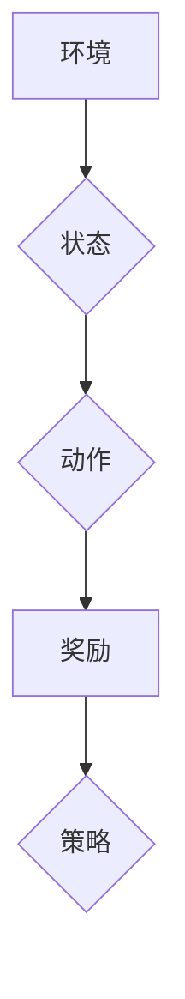

## 大语言模型原理基础与前沿 REINFORCE、TRPO和PPO

> 关键词：大语言模型、强化学习、REINFORCE、TRPO、PPO、策略梯度、值函数估计、稳定性、样本效率

## 1. 背景介绍

近年来，大语言模型（Large Language Models，LLMs）在自然语言处理领域取得了令人瞩目的成就。从文本生成、翻译到问答和代码编写，LLMs展现出强大的能力，深刻地改变了我们与语言交互的方式。

然而，训练这些庞大的模型需要海量数据和计算资源，并且传统的监督学习方法难以有效地处理开放域文本任务。强化学习（Reinforcement Learning，RL）作为一种新的训练 paradigm，为LLMs的训练提供了新的思路。

强化学习的核心思想是通过奖励机制引导模型学习最优的行为策略。在LLMs的训练中，我们可以将文本生成视为一个马尔可夫决策过程（Markov Decision Process，MDP），其中模型需要根据输入文本序列选择下一个词作为输出，并根据生成的文本序列获得奖励。通过不断地学习和调整策略，模型最终能够生成高质量、符合语义的文本。

## 2. 核心概念与联系

### 2.1 强化学习基本概念

强化学习的核心概念包括：

* **环境（Environment）：** LLMs的训练环境通常是一个文本语料库，环境会根据模型的输入提供反馈信息，例如下一个词的概率分布。
* **代理（Agent）：** LLMs本身就是代理，它会根据环境的反馈信息选择行动，即选择下一个词作为输出。
* **状态（State）：** LLMs在每个时间步的状态由当前输入文本序列决定。
* **动作（Action）：** LLMs的动作是选择下一个词作为输出。
* **奖励（Reward）：** 模型根据生成的文本序列获得奖励，奖励函数通常衡量生成的文本的质量和流畅度。
* **策略（Policy）：** 策略是一个映射关系，将状态映射到动作的概率分布。

### 2.2  策略梯度方法

策略梯度方法是强化学习中常用的训练策略的方法。其核心思想是通过梯度上升来优化策略，使得模型能够获得更高的奖励。

**Mermaid 流程图**



### 2.3  值函数估计

值函数估计是另一种常用的强化学习方法，它试图估计每个状态的价值，即从该状态开始执行最优策略所能获得的总奖励。值函数估计可以帮助模型更好地选择动作，从而获得更高的奖励。

## 3. 核心算法原理 & 具体操作步骤

### 3.1  算法原理概述

REINFORCE、TRPO和PPO都是基于策略梯度的强化学习算法，它们都试图通过优化策略来最大化模型的奖励。

* **REINFORCE:**  REINFORCE算法是最基本的策略梯度算法，它直接使用蒙特卡罗采样来估计策略梯度，并通过梯度上升来更新策略。
* **TRPO:** TRPO算法试图在更新策略时保证策略变化的范围有限，从而提高算法的稳定性。
* **PPO:** PPO算法是TRPO算法的改进版本，它通过引入一个惩罚项来限制策略变化的范围，并提高了算法的样本效率。

### 3.2  算法步骤详解

**REINFORCE**

1. 初始化策略参数 θ。
2. 从环境中收集经验轨迹 (s_t, a_t, r_t, s_{t+1})。
3. 计算每个时间步的优势函数 A_t = R_t + γ * V(s_{t+1}) - V(s_t)。
4. 更新策略参数 θ = θ + α * ∇_θ log π(a_t | s_t) * A_t。

**TRPO**

1. 初始化策略参数 θ。
2. 从环境中收集经验轨迹 (s_t, a_t, r_t, s_{t+1})。
3. 计算策略梯度 ∇_θ log π(a_t | s_t) * A_t。
4. 使用KL散度约束策略更新，找到最优的策略更新方向。

**PPO**

1. 初始化策略参数 θ。
2. 从环境中收集经验轨迹 (s_t, a_t, r_t, s_{t+1})。
3. 计算优势函数 A_t = R_t + γ * V(s_{t+1}) - V(s_t)。
4. 使用 clipped surrogate objective 函数更新策略参数 θ。

### 3.3  算法优缺点

**REINFORCE**

* **优点:** 简单易懂，易于实现。
* **缺点:** 容易出现高方差问题，训练不稳定。

**TRPO**

* **优点:** 稳定性高，能够保证策略更新的范围有限。
* **缺点:** 计算复杂度高，训练速度慢。

**PPO**

* **优点:** 稳定性高，样本效率高，训练速度快。
* **缺点:** 仍然存在一些理论上的挑战。

### 3.4  算法应用领域

* **文本生成:** 使用强化学习训练LLMs生成高质量、流畅的文本。
* **机器翻译:** 使用强化学习训练LLMs进行机器翻译任务。
* **对话系统:** 使用强化学习训练LLMs构建更自然、更智能的对话系统。
* **代码生成:** 使用强化学习训练LLMs进行代码生成任务。

## 4. 数学模型和公式 & 详细讲解 & 举例说明

### 4.1  数学模型构建

强化学习的数学模型可以表示为一个马尔可夫决策过程（MDP）。

* **状态空间 S:** 所有可能的系统状态的集合。
* **动作空间 A:** 在每个状态下可以采取的所有动作的集合。
* **状态转移概率 P(s'|s,a):** 从状态 s 执行动作 a 后转移到状态 s' 的概率。
* **奖励函数 R(s,a):** 在状态 s 执行动作 a 后获得的奖励。
* **折扣因子 γ:**  衡量未来奖励的价值。

### 4.2  公式推导过程

**策略梯度公式:**

$$
\nabla_{\theta} J(\theta) = \mathbb{E}_{\tau \sim \pi_{\theta}} \left[ \nabla_{\theta} \log \pi_{\theta}(a_t | s_t) \cdot A_t \right]
$$

其中:

* J(θ) 是策略函数 π(θ) 的期望奖励。
* τ 是一个经验轨迹。
* A_t 是优势函数，表示在时间步 t 执行动作 a_t 的价值超过平均价值的程度。

**TRPO 约束:**

$$
KL(\pi_{\theta} || \pi_{\theta'}) \leq \delta
$$

其中:

* KL(π_θ || π_θ') 是策略 π_θ 和 π_θ' 之间的 KL 散度。
* δ 是一个预设的阈值。

**PPO clipped surrogate objective 函数:**

$$
L^{CLIP}(\theta) = \min \left[ r(s_t, a_t) \cdot \frac{\pi_{\theta}(a_t | s_t)}{\pi_{\theta'}(a_t | s_t)}, clip(\frac{\pi_{\theta}(a_t | s_t)}{\pi_{\theta'}(a_t | s_t)}, 1 - \epsilon, 1 + \epsilon) \cdot r(s_t, a_t) \right]
$$

其中:

* r(s_t, a_t) 是奖励函数。
* ε 是一个小的正数。

### 4.3  案例分析与讲解

假设我们训练一个 LLMs 来生成英文句子。我们可以将每个单词作为动作，将句子作为状态。奖励函数可以设计为根据生成的句子的语法正确性和语义合理性来评估。

使用 REINFORCE 算法，我们可以从环境中收集经验轨迹，并计算每个时间步的优势函数。然后，我们可以使用策略梯度公式更新策略参数，使得模型能够生成更高奖励的句子。

使用 TRPO 算法，我们可以通过 KL 散度约束来保证策略更新的范围有限，从而提高算法的稳定性。

使用 PPO 算法，我们可以通过 clipped surrogate objective 函数来限制策略更新的范围，并提高算法的样本效率。

## 5. 项目实践：代码实例和详细解释说明

### 5.1  开发环境搭建

* Python 3.7+
* TensorFlow 或 PyTorch
* 其他必要的库，例如 NumPy、Pandas 等

### 5.2  源代码详细实现

```python
import tensorflow as tf

# 定义策略网络
class PolicyNetwork(tf.keras.Model):
    def __init__(self, vocab_size, embedding_dim, hidden_dim):
        super(PolicyNetwork, self).__init__()
        self.embedding = tf.keras.layers.Embedding(vocab_size, embedding_dim)
        self.lstm = tf.keras.layers.LSTM(hidden_dim)
        self.dense = tf.keras.layers.Dense(vocab_size, activation='softmax')

    def call(self, inputs):
        x = self.embedding(inputs)
        x = self.lstm(x)
        outputs = self.dense(x)
        return outputs

# 定义强化学习算法
class PPO:
    def __init__(self, policy_network, learning_rate, gamma, clip_ratio):
        self.policy_network = policy_network
        self.optimizer = tf.keras.optimizers.Adam(learning_rate)
        self.gamma = gamma
        self.clip_ratio = clip_ratio

    def train(self, states, actions, rewards, next_states, dones):
        # 计算优势函数
        advantages = self.calculate_advantages(rewards, dones)

        # 更新策略网络
        with tf.GradientTape() as tape:
            # 计算策略网络的输出
            logits = self.policy_network(states)

            # 计算 clipped surrogate objective
            loss = self.calculate_loss(logits, actions, advantages)

        # 更新策略网络参数
        gradients = tape.gradient(loss, self.policy_network.trainable_variables)
        self.optimizer.apply_gradients(zip(gradients, self.policy_network.trainable_variables))

    def calculate_advantages(self, rewards, dones):
        # 计算优势函数
        advantages = []
        R = 0
        for i in reversed(range(len(rewards))):
            R = rewards[i] + self.gamma * R * (1 - dones[i])
            advantages.insert(0, R)
        return advantages

    def calculate_loss(self, logits, actions, advantages):
        # 计算 clipped surrogate objective
        #...

```

### 5.3  代码解读与分析

* **PolicyNetwork:** 定义了策略网络的结构，包括嵌入层、LSTM 层和全连接层。
* **PPO:** 定义了 PPO 算法的类，包括策略网络、优化器、折扣因子和 clipped surrogate objective 的参数。
* **train() 方法:** 训练 PPO 算法，计算优势函数，并更新策略网络参数。
* **calculate_advantages() 方法:** 计算优势函数。
* **calculate_loss() 方法:** 计算 clipped surrogate objective。

### 5.4  运行结果展示

运行代码后，可以观察模型在训练过程中奖励的增长趋势，以及生成的文本的质量。

## 6. 实际应用场景

* **对话系统:** 使用强化学习训练对话系统，使其能够更好地理解用户意图，并生成更自然、更流畅的回复。
* **游戏 AI:** 使用强化学习训练游戏 AI，使其能够学习游戏规则，并制定更有效的策略。
* **推荐系统:** 使用强化学习训练推荐系统，使其能够根据用户的历史行为推荐更相关的商品或内容。

### 6.4  未来应用展望

* **更复杂的文本生成任务:**