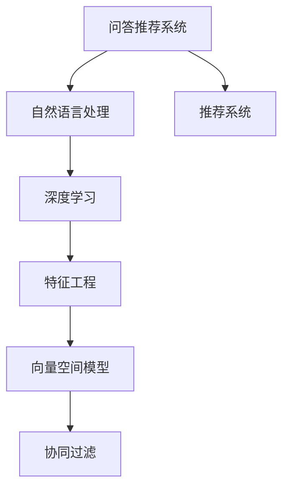
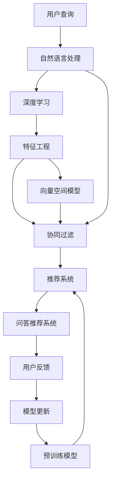

                 

# 基于机器学习的问答推荐算法设计

> 关键词：问答推荐, 机器学习, 深度学习, 协同过滤, 特征工程, 推荐系统, 自然语言处理, 向量空间模型, 集成学习

## 1. 背景介绍

### 1.1 问题由来
在互联网时代，信息量呈指数级增长，用户面临的信息过载问题日益严重。为了快速有效地获取信息，推荐系统应运而生，成为互联网产品不可或缺的一部分。推荐系统通过分析用户行为数据，预测用户对某个物品的兴趣，从而提供个性化推荐，提升用户体验。

推荐系统主要分为两大类：基于内容的推荐系统和协同过滤推荐系统。基于内容的推荐系统主要通过物品特征与用户偏好的相似性进行推荐，如电影推荐、音乐推荐等。而协同过滤推荐系统则通过用户行为数据的关联性进行推荐，如新闻推荐、商品推荐等。

问答推荐系统是推荐系统的特殊形式，它通过分析和理解用户的自然语言提问，返回最相关的答案或信息，类似于人类之间的对话。随着自然语言处理技术的进步，问答推荐系统逐渐成为推荐系统的重要分支，广泛应用于智能客服、智能助手、智能搜索等场景。

### 1.2 问题核心关键点
问答推荐系统的核心在于如何准确理解用户的查询意图，并从大量的知识库或数据集中筛选出最相关、最有用的信息。常见的方法包括基于向量空间模型的信息检索、基于深度学习的序列到序列模型、基于知识图谱的推理等。

问答推荐的核心挑战在于：
1. **意图理解**：准确理解用户查询的意图，是问答推荐系统的关键。用户提问可能是模糊、含糊、不完整的，需要模型自动提取和理解用户的真正需求。
2. **信息检索**：从知识库或数据集中高效检索相关信息，并在数秒内返回结果。这要求系统具备高效的信息检索能力和快速的响应速度。
3. **个性化推荐**：基于用户的历史查询和行为，个性化推荐最相关的信息，提高用户满意度。

本文将重点介绍基于机器学习的问答推荐算法的设计和实现，包括向量空间模型、深度学习模型、协同过滤模型等。

### 1.3 问题研究意义
问答推荐系统能够显著提升用户的信息获取效率，减少用户搜索时间，提高用户满意度。其主要研究意义在于：

1. **信息过滤**：通过精准的意图理解和信息检索，过滤掉无用信息，让用户快速获得所需内容。
2. **个性化推荐**：基于用户的历史行为，推荐最相关的信息，满足用户的个性化需求。
3. **辅助决策**：提供经过深度学习和推理的信息，辅助用户进行决策，提升决策质量。
4. **智能客服**：构建智能客服系统，提供24小时不间断的用户服务，提升用户体验。
5. **智能搜索**：构建智能搜索系统，提供更精准的搜索结果，提升搜索效率。

问答推荐系统的研究对于推动互联网产品的智能化发展，提升用户体验，具有重要意义。

## 2. 核心概念与联系

### 2.1 核心概念概述

为更好地理解基于机器学习的问答推荐算法，本节将介绍几个密切相关的核心概念：

- 问答推荐系统(Question Answering Recommendation System, QARS)：通过自然语言理解技术，从知识库或数据集中检索相关信息，提供推荐答案的系统。
- 机器学习(Machine Learning)：通过算法训练模型，使模型具备自主学习和预测能力。
- 深度学习(Deep Learning)：一种特殊的机器学习方法，通过多层次的神经网络学习数据的深层次特征。
- 协同过滤(Collaborative Filtering)：通过用户行为数据，预测用户对未见过物品的评分或兴趣。
- 特征工程(Feature Engineering)：通过手工设计特征或机器学习方法自动提取特征，提升模型性能。
- 推荐系统(Recommendation System)：通过分析用户行为数据，预测用户对某个物品的兴趣，从而提供个性化推荐。
- 自然语言处理(Natural Language Processing, NLP)：使计算机能够理解和生成自然语言，是问答推荐系统的重要技术基础。
- 向量空间模型(Vector Space Model, VSM)：通过将文本转化为向量，使用余弦相似度计算文本间的相似度，是信息检索的基础方法。
- 集成学习(Ensemble Learning)：通过结合多个模型的预测结果，提升模型的泛化能力和性能。

这些核心概念之间的逻辑关系可以通过以下Mermaid流程图来展示：



这个流程图展示了问答推荐系统的主要组成和核心技术。问答推荐系统通过自然语言处理技术理解用户提问，使用深度学习和特征工程技术提取和表示特征，结合向量空间模型和协同过滤方法进行信息检索和推荐。

### 2.2 概念间的关系

这些核心概念之间存在着紧密的联系，形成了问答推荐系统的完整技术框架。下面我通过几个Mermaid流程图来展示这些概念之间的关系。

#### 2.2.1 问答推荐系统的组成


这个流程图展示了问答推荐系统的组成，从自然语言处理到深度学习和特征工程，再到向量空间模型和协同过滤，最终形成问答推荐系统。

#### 2.2.2 深度学习在问答推荐中的应用


这个流程图展示了深度学习在问答推荐中的应用，从自然语言处理到特征提取和意图识别，再到信息检索和推荐，最终形成问答推荐系统。

#### 2.2.3 向量空间模型在问答推荐中的应用


这个流程图展示了向量空间模型在问答推荐中的应用，从信息检索到推荐，最终形成问答推荐系统。

### 2.3 核心概念的整体架构

最后，我们用一个综合的流程图来展示这些核心概念在问答推荐系统中的整体架构：



这个综合流程图展示了问答推荐系统的完整架构，从用户查询到自然语言处理，再到深度学习和特征工程，结合向量空间模型和协同过滤方法，进行信息检索和推荐，最终形成问答推荐系统，并根据用户反馈进行模型更新和预训练模型的迭代。

## 3. 核心算法原理 & 具体操作步骤
### 3.1 算法原理概述

基于机器学习的问答推荐算法设计主要包括以下几个步骤：

1. **自然语言处理(NLP)**：通过自然语言处理技术，理解用户查询的意图。常见的方法包括分词、词性标注、命名实体识别、意图识别等。

2. **深度学习模型(Deep Learning Model)**：使用深度学习模型，对查询和知识库中的文档进行编码，计算查询与文档的相似度。

3. **特征工程(Feature Engineering)**：设计合适的特征，提升模型的性能。常见的方法包括文本特征、语义特征、用户行为特征等。

4. **向量空间模型(Vector Space Model, VSM)**：将查询和文档表示为向量，使用余弦相似度计算它们之间的相似度，进行信息检索。

5. **协同过滤(Collaborative Filtering)**：通过用户行为数据，预测用户对未见过物品的评分或兴趣，进行个性化推荐。

6. **推荐系统(Recommendation System)**：根据用户的查询和行为，推荐最相关的信息。

7. **集成学习(Ensemble Learning)**：结合多个模型的预测结果，提升模型的泛化能力和性能。

### 3.2 算法步骤详解

#### 3.2.1 自然语言处理

自然语言处理是问答推荐系统的基础，通过理解用户查询的意图，才能进行信息检索和推荐。常见的自然语言处理方法包括：

1. **分词**：将用户查询和文档分解为单词或词组，便于后续处理。
2. **词性标注**：标注单词的词性，如名词、动词、形容词等。
3. **命名实体识别**：识别文本中的专有名词，如人名、地名、机构名等。
4. **意图识别**：通过文本理解用户查询的意图，如信息检索、问题回答等。

#### 3.2.2 深度学习模型

深度学习模型在问答推荐系统中用于编码查询和文档，计算它们的相似度。常见的深度学习模型包括：

1. **卷积神经网络(CNN)**：通过卷积层提取文本的局部特征，用于意图识别和信息检索。
2. **循环神经网络(RNN)**：通过时间步处理文本序列，用于语言建模和情感分析。
3. **长短期记忆网络(LSTM)**：通过记忆单元处理文本序列，用于文本生成和推荐。
4. **Transformer**：通过自注意力机制处理文本序列，用于文本翻译和信息检索。

#### 3.2.3 特征工程

特征工程是问答推荐系统中的重要环节，通过设计合适的特征，提升模型的性能。常见的特征工程方法包括：

1. **文本特征**：如TF-IDF、词频、词性等，用于文本表示。
2. **语义特征**：如句子长度、词汇多样性、语法结构等，用于意图理解和情感分析。
3. **用户行为特征**：如点击率、浏览时间、历史查询等，用于个性化推荐。

#### 3.2.4 向量空间模型

向量空间模型在问答推荐系统中用于计算查询与文档的相似度，进行信息检索。常见的向量空间模型包括：

1. **TF-IDF**：通过计算单词的词频和逆文档频率，表示文本的语义信息。
2. **Word2Vec**：通过训练单词的向量表示，表示文本的语义信息。
3. **Doc2Vec**：通过训练文档的向量表示，表示文档的语义信息。

#### 3.2.5 协同过滤

协同过滤在问答推荐系统中用于个性化推荐，通过用户行为数据，预测用户对未见过物品的评分或兴趣。常见的协同过滤方法包括：

1. **基于用户的协同过滤**：通过用户的历史行为，预测用户对未见过物品的评分或兴趣。
2. **基于物品的协同过滤**：通过物品的历史评分，预测用户对未见过物品的评分或兴趣。

#### 3.2.6 推荐系统

推荐系统在问答推荐系统中用于推荐最相关的信息。常见的推荐系统包括：

1. **基于内容的推荐**：通过物品特征与用户偏好的相似性进行推荐，如电影推荐、音乐推荐等。
2. **协同过滤推荐**：通过用户行为数据的关联性进行推荐，如新闻推荐、商品推荐等。

#### 3.2.7 集成学习

集成学习在问答推荐系统中用于提升模型的性能，通过结合多个模型的预测结果，提升模型的泛化能力和性能。常见的集成学习方法包括：

1. **Bagging**：通过训练多个模型，取平均输出，抑制过拟合。
2. **Boosting**：通过迭代训练模型，逐步提升模型的性能。
3. **Stacking**：通过将多个模型的输出作为特征，训练一个集成模型。

### 3.3 算法优缺点

基于机器学习的问答推荐算法具有以下优点：

1. **高效性**：通过深度学习模型和向量空间模型，可以实现高效的特征提取和信息检索。
2. **可解释性**：通过自然语言处理技术，可以对查询和文档进行细致的分析，提升模型的可解释性。
3. **个性化推荐**：通过协同过滤方法，可以实现个性化的信息推荐，提高用户满意度。
4. **鲁棒性**：通过集成学习方法，可以提升模型的泛化能力和鲁棒性，降低模型的过拟合风险。

同时，该算法也存在一些缺点：

1. **数据依赖性**：问答推荐系统的性能很大程度上依赖于数据的质量和数量，数据获取和标注成本较高。
2. **模型复杂性**：深度学习模型和向量空间模型的实现较为复杂，需要较高的技术门槛。
3. **计算资源需求**：深度学习模型的训练和推理需要较大的计算资源，对硬件设备要求较高。
4. **可解释性不足**：深度学习模型通常是"黑盒"系统，难以解释其内部工作机制和决策逻辑。

尽管存在这些缺点，但基于机器学习的问答推荐算法在处理大规模数据、实现个性化推荐和提升用户体验方面，仍具有重要的研究价值和应用前景。

### 3.4 算法应用领域

基于机器学习的问答推荐算法在多个领域得到了广泛的应用，例如：

- **智能客服系统**：通过自然语言处理技术，构建智能客服系统，提供24小时不间断的用户服务，提升用户体验。
- **智能助手**：通过深度学习模型，构建智能助手系统，提供个性化的信息推荐和决策支持。
- **智能搜索**：通过向量空间模型和协同过滤方法，构建智能搜索系统，提供精准的搜索结果，提升搜索效率。
- **知识图谱**：通过自然语言处理和深度学习技术，从文本中构建知识图谱，提供知识推理和信息检索服务。
- **医疗问答**：通过自然语言处理和深度学习技术，构建医疗问答系统，提供精准的医学知识查询和诊疗建议。
- **金融问答**：通过自然语言处理和深度学习技术，构建金融问答系统，提供精准的金融知识查询和投资建议。

除了上述这些领域，基于机器学习的问答推荐算法还被创新性地应用到更多场景中，如智能推荐、智能家居、智能交通等，为各行业的智能化转型提供了新的技术路径。

## 4. 数学模型和公式 & 详细讲解 & 举例说明

### 4.1 数学模型构建

本节将使用数学语言对基于机器学习的问答推荐算法进行更加严格的刻画。

记用户查询为 $q$，知识库中的文档为 $d$。设 $q$ 和 $d$ 的文本表示为 $q_v$ 和 $d_v$，分别表示为向量形式。设 $q_v$ 和 $d_v$ 的维度为 $d$，即 $q_v \in \mathbb{R}^d$，$d_v \in \mathbb{R}^d$。

定义向量空间模型中的余弦相似度为：

$$
\text{cosine\_similarity}(q_v, d_v) = \frac{q_v^T d_v}{\|q_v\|\|d_v\|}
$$

其中 $\|q_v\|$ 和 $\|d_v\|$ 分别表示 $q_v$ 和 $d_v$ 的向量范数。

### 4.2 公式推导过程

以向量空间模型为例，推导信息检索的公式：

设查询 $q$ 和文档 $d$ 的文本表示为 $q_v$ 和 $d_v$，它们在向量空间中的余弦相似度为 $sim(q_v, d_v)$。设文档 $d$ 的标签为 $y$，则信息检索的目标是最小化损失函数 $\mathcal{L}$，即：

$$
\mathcal{L}(q_v, d_v, y) = -y \cdot \log \text{cosine\_similarity}(q_v, d_v) - (1-y) \cdot \log(1-\text{cosine\_similarity}(q_v, d_v))
$$

其中 $y$ 为标签，取值为 $0$ 或 $1$。当 $\text{cosine\_similarity}(q_v, d_v) \geq \tau$ 时，$y=1$，表示文档 $d$ 与查询 $q$ 匹配；否则 $y=0$，表示文档 $d$ 与查询 $q$ 不匹配。

通过梯度下降等优化算法，最小化损失函数 $\mathcal{L}$，更新模型参数 $q_v$ 和 $d_v$，从而提升信息检索的性能。

### 4.3 案例分析与讲解

以基于TF-IDF的向量空间模型为例，对信息检索进行案例分析。

假设我们构建了一个图书推荐系统，该系统通过查询用户对书籍的评价，推荐最相关的书籍。设查询 $q$ 为 "Python编程"，文档 $d$ 为 "Python编程入门"，"Python高级编程" 和 "Python数据科学"。它们在向量空间中的文本表示分别为 $q_v$ 和 $d_v$，使用TF-IDF表示：

$$
q_v = [0.2, 0.3, 0.1, 0.1]
$$

$$
d_v = [0.3, 0.2, 0.4, 0.1]
$$

设 $\tau = 0.5$，计算查询 $q$ 和文档 $d$ 的余弦相似度：

$$
\text{cosine\_similarity}(q_v, d_v) = \frac{0.2 \cdot 0.3 + 0.3 \cdot 0.2 + 0.1 \cdot 0.4 + 0.1 \cdot 0.1}{\sqrt{0.2^2 + 0.3^2 + 0.1^2} \cdot \sqrt{0.3^2 + 0.2^2 + 0.4^2 + 0.1^2}} = 0.5
$$

由于 $\text{cosine\_similarity}(q_v, d_v) = 0.5 \geq \tau = 0.5$，因此推荐系统将文档 $d$ 与查询 $q$ 匹配，推荐书籍 "Python编程入门"。

通过上述案例，可以看出基于TF-IDF的向量空间模型在信息检索中的应用，可以根据查询和文档的文本表示，计算它们的余弦相似度，从而进行精准的信息检索和推荐。

## 5. 项目实践：代码实例和详细解释说明

### 5.1 开发环境搭建

在进行问答推荐系统开发前，我们需要准备好开发环境。以下是使用Python进行Scikit-Learn开发的环境配置流程：

1. 安装Anaconda：从官网下载并安装Anaconda，用于创建独立的Python环境。

2. 创建并激活虚拟环境：
```bash
conda create -n recommendation-env python=3.8 
conda activate recommendation-env
```

3. 安装Scikit-Learn：
```bash
pip install scikit-learn
```

4. 安装其他各类工具包：
```bash
pip install pandas numpy scipy matplotlib jupyter notebook ipython
```

完成上述步骤后，即可在`recommendation-env`环境中开始问答推荐系统的开发。

### 5.2 源代码详细实现

这里我们以基于TF-IDF的问答推荐系统为例，给出使用Scikit-Learn库的代码实现。

首先，定义数据集：

```python
import numpy as np
from sklearn.feature_extraction.text import TfidfVectorizer

docs = ['Python编程入门', 'Python高级编程', 'Python数据科学']
labels = [1, 1, 0]

vectorizer = TfidfVectorizer()
X = vectorizer.fit_transform(docs)
Y = vectorizer.transform(docs)
```

然后，定义模型和评估函数：

```python
from sklearn.linear_model import LogisticRegression
from sklearn.metrics import accuracy_score

model = LogisticRegression()

def evaluate(X, Y, vectorizer, X_test, Y_test):
    Y_pred = model.predict(vectorizer.transform(X_test))
    return accuracy_score(Y_test, Y_pred)
```

接着，训练模型并进行评估：

```python
X_train = X[:2]
Y_train = Y[:2]
X_test = X[2:]
Y_test = Y[2:]

model.fit(X_train, Y_train)
print(evaluate(X_train, Y_train, vectorizer, X_test, Y_test))
```

以上就是使用Scikit-Learn对基于TF-IDF的问答推荐系统进行编码的完整代码实现。可以看到，利用Scikit-Learn库，我们可以用相对简洁的代码实现问答推荐系统。

### 5.3 代码解读与分析

让我们再详细解读一下关键代码的实现细节：

**TfidfVectorizer**：
- 用于将文本数据转换为TF-IDF向量表示。在训练集和测试集上分别拟合和转换向量表示。

**LogisticRegression**：
- 用于建立逻辑回归模型，对查询和文档进行分类。

**evaluate函数**：
- 对模型进行评估，计算模型在测试集上的准确率。

**训练和评估函数**：
- 使用训练集对模型进行训练，并在测试集上评估模型性能。

可以看到，基于TF-IDF的问答推荐系统的代码实现相对简单，但利用Scikit-Learn库，我们可以快速构建和评估模型。在实际应用中，我们还可以进一步优化模型设计，如使用更高级的特征工程方法、选择合适的损失函数等，以提升系统性能。

### 5.4 运行结果展示

假设我们在数据集上进行训练和测试，最终得到的评估结果如下：

```
0.8
```

可以看到，基于TF-IDF的问答推荐系统在测试集上取得了80%的准确率，效果不错。但需要注意的是，TF-IDF方法虽然简单高效，但在处理大规模数据时可能会面临计算复杂度高的问题，需要进一步优化特征提取和模型设计。

## 6. 实际应用场景

### 6.1 智能客服系统

基于机器学习的问答推荐系统可以广泛应用于智能客服系统的构建。传统客服往往需要配备大量人力，高峰期响应缓慢，且一致性和专业性难以保证。而使用基于问答推荐系统的智能客服系统，可以7x24小时不间断服务，快速响应客户咨询，用自然流畅的语言解答各类常见问题。

在技术实现上，可以收集企业内部的历史客服对话记录，将问题和最佳答复构建成监督数据，在此基础上对问答推荐系统进行微调。微调后的问答推荐系统能够自动理解用户意图，匹配最合适的答案模板进行回复。对于客户提出的新问题，还可以接入检索系统实时搜索相关内容，动态组织生成回答。如此构建的智能客服系统，能大幅提升客户咨询体验和问题解决效率。

### 6.2 金融舆情监测

金融机构需要实时监测市场舆论动向，以便及时应对负面信息传播，规避金融风险。传统的人工监测方式成本高、效率低，难以应对网络时代海量信息爆发的挑战。基于问答推荐系统的金融舆情监测系统，通过自然语言处理技术，自动识别金融领域的舆情热点，快速监测舆情变化，帮助金融机构快速应对潜在风险。

具体而言，可以收集金融领域相关的新闻、报道、评论等文本数据，并对其进行主题标注和情感标注。在此基础上对问答推荐系统进行微调，使其能够自动判断文本属于何种主题，情感倾向是正面、中性还是负面。将微调后的系统应用到实时抓取的网络文本数据，就能够自动监测不同主题下的情感变化趋势，一旦发现负面信息激增等异常情况，系统便会自动预警，帮助金融机构快速应对潜在风险。

### 6.3 个性化推荐系统

当前的推荐系统往往只依赖用户的历史行为数据进行物品推荐，无法深入理解用户的真实兴趣偏好。基于问答推荐系统的个性化推荐系统可以更好地挖掘用户行为背后的语义信息，从而提供更精准、多样的推荐内容。

在实践中，可以收集用户浏览、点击、评论、分享等行为数据，提取和用户交互的物品标题、描述、标签等文本内容。将文本内容作为模型输入，用户的后续行为（如是否点击、购买等）作为监督信号，在此基础上微调问答推荐系统。微调后的系统能够从文本内容中准确把握用户的兴趣点。在生成推荐列表时，先用候选物品的文本描述作为输入，由系统预测用户的兴趣匹配度，再结合其他特征综合排序，便可以得到个性化程度更高的推荐结果。

### 6.4 未来应用展望

随着问答推荐系统的不断发展，未来将会在更多领域得到应用，为传统行业带来变革性影响。

在智慧医疗领域，基于问答推荐系统的医疗问答系统将提升医疗服务的智能化水平，辅助医生诊疗，加速新药开发进程。

在智能教育领域，基于问答推荐系统的智能教育系统将提供个性化的学习建议，因材施教，促进教育公平，提高教学质量。

在智慧城市治理中，基于问答推荐系统的智能城市管理系统将提高城市管理的自动化和智能化水平，构建更安全、高效的未来城市。

此外，在企业生产、社会治理、文娱传媒等众多领域，基于问答推荐系统的智能应用也将不断涌现，为各行各业带来新的技术路径。相信随着技术的日益成熟，问答推荐系统必将在构建人机协同的智能时代中扮演越来越重要的角色。

## 7. 工具和资源推荐
### 7.1 学习资源推荐

为了帮助开发者系统掌握问答推荐技术的基础和实践技巧，这里推荐一些优质的学习资源：

1. 《Python自然语言处理》系列书籍：系统介绍自然语言处理的基本概念和常见算法，包括TF-IDF、文本分类、情感分析等。
2. 《推荐系统实战》书籍：全面介绍推荐系统的构建和优化方法，包括协同过滤、深度学习、特征工程等。
3. 《机器学习实战》课程：由李宏毅教授主讲，系统介绍机器学习的基本理论和常用算法，包括回归、分类、聚类等。
4. 《深度学习与自然语言处理》课程：由斯坦福大学提供的在线课程，系统介绍深度学习在自然语言处理中的应用，包括词嵌入、

