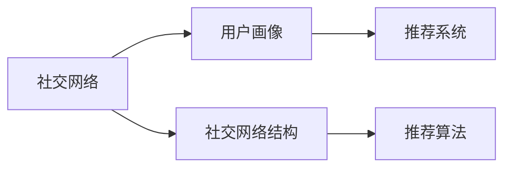
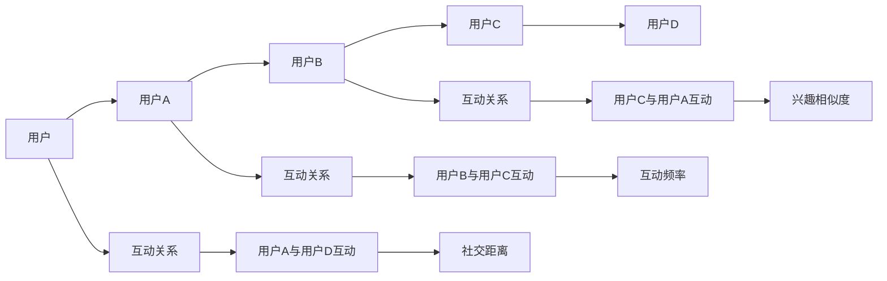
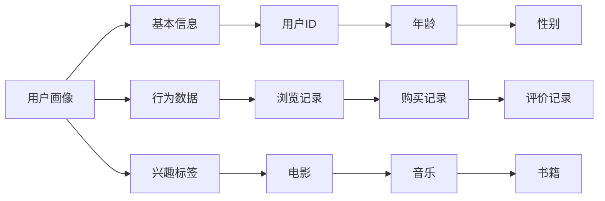
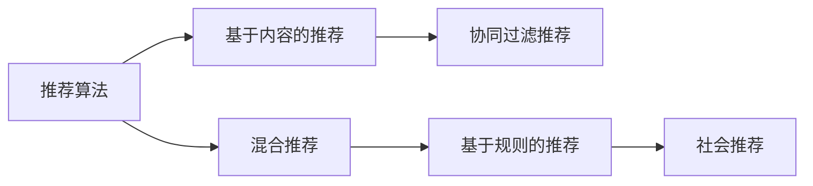

                 

## 1. 背景介绍

### 1.1 问题由来
社交网络数据的不断增长对社交网络推荐算法提出了更高的要求。传统的基于用户兴趣的推荐算法往往忽略了用户之间的社交关系对推荐的影响。社交网络结构对用户兴趣和行为的影响日益显著，传统的推荐算法已经难以胜任。因此，基于社交网络结构的社会推荐算法成为当前推荐系统的研究热点之一。

### 1.2 问题核心关键点
社会推荐算法的核心在于如何利用社交网络结构对用户兴趣和行为的影响，从而提升推荐系统的性能。主要包括以下几个关键问题：

1. 社交网络结构的影响因素分析。包括用户之间的互动频率、兴趣相似度、社交距离等。
2. 用户兴趣的个性化表示。如何利用用户行为数据和个人社交网络信息，刻画用户的兴趣和偏好。
3. 推荐模型的构建。如何构建推荐模型，以最大化社交网络结构的影响，提高推荐效果。

### 1.3 问题研究意义
研究基于社交网络结构的社会推荐算法，对于构建更精准、个性化的推荐系统，提升用户体验，具有重要意义：

1. 提高推荐系统的准确性和个性化程度。社交网络结构可以提供更丰富的用户兴趣信息，有助于构建更准确的推荐模型。
2. 增强推荐的可信度和公平性。通过社交网络结构的影响，可以避免推荐算法中的不公平现象，增强推荐系统的可信度。
3. 推动社交网络的进一步发展。社会推荐算法有助于增加用户互动，提升社交网络平台的活跃度和用户粘性。
4. 提升企业竞争力和用户满意度。推荐系统是电商平台、社交平台等的重要支撑，社会推荐算法有助于企业获取更高的用户满意度和市场竞争力。

## 2. 核心概念与联系

### 2.1 核心概念概述

为更好地理解基于社交网络结构的社会推荐算法，本节将介绍几个密切相关的核心概念：

- 社交网络(Social Network)：由用户和用户之间的关系构成，用户之间的互动和关联关系对用户兴趣和行为有重要影响。
- 用户画像(User Profile)：描述用户兴趣、行为、属性等信息的全面概览，有助于理解用户需求。
- 社交网络结构(Social Network Structure)：包括用户之间的互动频率、兴趣相似度、社交距离等，对推荐结果有重要影响。
- 推荐系统(Recommendation System)：利用用户历史行为数据，预测用户可能感兴趣的项目，并进行推荐。
- 社会推荐算法(Social Recommendation Algorithm)：结合社交网络结构和用户画像，提升推荐系统的效果。

这些核心概念之间的逻辑关系可以通过以下Mermaid流程图来展示：



这个流程图展示了几大核心概念之间的关系：

1. 社交网络由用户和用户之间的关系构成。
2. 用户画像描述了用户的兴趣、行为和属性信息。
3. 社交网络结构刻画了用户之间的互动频率、兴趣相似度和社交距离等因素。
4. 推荐系统利用用户历史行为数据，预测并推荐可能感兴趣的项目。
5. 社会推荐算法结合社交网络结构和用户画像，提升推荐系统的效果。

### 2.2 概念间的关系

这些核心概念之间存在着紧密的联系，形成了基于社交网络结构的社会推荐算法的完整生态系统。下面我们通过几个Mermaid流程图来展示这些概念之间的关系。

#### 2.2.1 社交网络的结构特征



这个流程图展示了社交网络的基本结构特征，包括用户之间的互动关系、互动频率、兴趣相似度和社交距离等。

#### 2.2.2 用户画像的构成



这个流程图展示了用户画像的构成，包括基本信息、行为数据和兴趣标签等，能够全面描述用户的兴趣和行为特征。

#### 2.2.3 推荐算法的分类



这个流程图展示了推荐算法的分类，包括基于内容的推荐、协同过滤推荐、混合推荐、基于规则的推荐和社会推荐等。

## 3. 核心算法原理 & 具体操作步骤
### 3.1 算法原理概述

基于社交网络结构的社会推荐算法，本质上是通过社交网络结构对用户兴趣和行为的影响，提升推荐系统的性能。其核心思想是：利用社交网络结构中用户的互动关系、兴趣相似度和社交距离等特征，对用户画像进行优化，然后构建推荐模型，从而提升推荐效果。

形式化地，假设社交网络中有 $N$ 个用户，记为 $U=\{u_1,u_2,\dots,u_N\}$。用户的兴趣表示为 $\mathbf{x}_u \in \mathbb{R}^d$，社交网络结构特征包括用户之间的互动频率 $f_{ij}$、兴趣相似度 $s_{ij}$ 和社交距离 $d_{ij}$，记为 $S=\{f_{ij},s_{ij},d_{ij}\}_{i,j \in U}$。推荐系统的目标是最大化社交网络结构的影响，对用户 $\{u_i\}_{i=1}^N$ 进行个性化推荐。

### 3.2 算法步骤详解

基于社交网络结构的社会推荐算法通常包括以下几个关键步骤：

**Step 1: 社交网络数据的采集和处理**

- 采集社交网络数据，包括用户的互动记录、兴趣数据、基本信息等。
- 对社交网络数据进行清洗和预处理，去除噪声和异常值，构建社交网络结构。

**Step 2: 用户兴趣的表示和优化**

- 利用用户的互动记录、兴趣数据和基本信息，对用户画像 $\mathbf{x}_u$ 进行表示和优化。
- 对社交网络结构特征 $S$ 进行表示和优化，通过聚合、权重分配等方法，增强特征的表现力。

**Step 3: 推荐模型的构建和训练**

- 结合用户画像 $\mathbf{x}_u$ 和社交网络结构特征 $S$，构建推荐模型。
- 利用用户的历史行为数据，训练推荐模型，最大化社交网络结构的影响。

**Step 4: 推荐结果的生成**

- 利用训练好的推荐模型，对目标用户 $u_i$ 进行个性化推荐。
- 结合社交网络结构特征，对推荐结果进行排序和筛选，提升推荐的相关性和可信度。

### 3.3 算法优缺点

基于社交网络结构的社会推荐算法具有以下优点：

1. 提高推荐系统的准确性和个性化程度。社交网络结构提供了更丰富的用户兴趣信息，有助于构建更准确的推荐模型。
2. 增强推荐的可信度和公平性。通过社交网络结构的影响，可以避免推荐算法中的不公平现象，增强推荐系统的可信度。
3. 推动社交网络的进一步发展。社会推荐算法有助于增加用户互动，提升社交网络平台的活跃度和用户粘性。

但该算法也存在一些局限性：

1. 数据采集成本高。社交网络数据的采集和处理需要大量的时间和资源，尤其是在大规模社交网络中。
2. 数据隐私问题。社交网络数据的采集和处理涉及到用户隐私保护，需要采用隐私保护技术，如差分隐私、联邦学习等。
3. 社交网络结构的影响存在不确定性。用户之间的互动关系、兴趣相似度和社交距离等因素可能会发生变化，影响推荐效果。
4. 模型的复杂度高。社会推荐算法的模型构建和训练需要较高的计算资源和算法复杂度。

### 3.4 算法应用领域

基于社交网络结构的社会推荐算法已经在多个领域得到广泛应用，包括但不限于以下几个方向：

- 社交媒体推荐：利用用户之间的互动关系，推荐用户可能感兴趣的内容。
- 电商推荐：结合用户购买历史和社交网络结构，推荐用户可能感兴趣的商品。
- 新闻推荐：利用用户阅读历史和社交网络结构，推荐用户可能感兴趣的新闻。
- 视频推荐：结合用户观看历史和社交网络结构，推荐用户可能感兴趣的视频内容。
- 音乐推荐：利用用户的听歌历史和社交网络结构，推荐用户可能喜欢的音乐。

## 4. 数学模型和公式 & 详细讲解 & 举例说明

### 4.1 数学模型构建

本节将使用数学语言对基于社交网络结构的社会推荐算法进行更加严格的刻画。

记社交网络中的用户为 $u_i$，用户的兴趣表示为 $\mathbf{x}_i \in \mathbb{R}^d$，社交网络结构特征包括用户之间的互动频率 $f_{ij}$、兴趣相似度 $s_{ij}$ 和社交距离 $d_{ij}$，记为 $S=\{f_{ij},s_{ij},d_{ij}\}_{i,j \in U}$。推荐系统的目标是最大化社交网络结构的影响，对用户 $\{u_i\}_{i=1}^N$ 进行个性化推荐。

定义用户 $u_i$ 与用户 $u_j$ 的相似度为 $s_{ij}$，记为 $s_{ij}=\mathbf{x}_i^T\mathbf{x}_j$。定义用户 $u_i$ 与用户 $u_j$ 之间的社交距离为 $d_{ij}$，记为 $d_{ij}=1/(1+f_{ij}+\alpha \cdot s_{ij})$，其中 $\alpha$ 为社交距离的影响权重。

推荐模型的目标函数为：

$$
\max_{\mathbf{x}_i,\mathbf{x}_j,\theta} \sum_{i=1}^N \sum_{j=1}^N s_{ij} \log \sigma(\mathbf{x}_i^T \theta \mathbf{x}_j) - \beta \sum_{i=1}^N \sum_{j=1}^N d_{ij} \log \sigma(\mathbf{x}_i^T \theta \mathbf{x}_j)
$$

其中 $\sigma(\cdot)$ 为激活函数，$\beta$ 为社交距离的惩罚系数。

### 4.2 公式推导过程

以下我们以二分类的社交网络推荐为例，推导推荐模型的损失函数及其梯度计算公式。

假设社交网络中有 $N$ 个用户，记为 $U=\{u_1,u_2,\dots,u_N\}$。用户的兴趣表示为 $\mathbf{x}_u \in \mathbb{R}^d$，社交网络结构特征包括用户之间的互动频率 $f_{ij}$、兴趣相似度 $s_{ij}$ 和社交距离 $d_{ij}$，记为 $S=\{f_{ij},s_{ij},d_{ij}\}_{i,j \in U}$。推荐系统的目标是最大化社交网络结构的影响，对用户 $\{u_i\}_{i=1}^N$ 进行个性化推荐。

定义用户 $u_i$ 与用户 $u_j$ 的相似度为 $s_{ij}$，记为 $s_{ij}=\mathbf{x}_i^T\mathbf{x}_j$。定义用户 $u_i$ 与用户 $u_j$ 之间的社交距离为 $d_{ij}$，记为 $d_{ij}=1/(1+f_{ij}+\alpha \cdot s_{ij})$，其中 $\alpha$ 为社交距离的影响权重。

推荐模型的目标函数为：

$$
\max_{\mathbf{x}_i,\mathbf{x}_j,\theta} \sum_{i=1}^N \sum_{j=1}^N s_{ij} \log \sigma(\mathbf{x}_i^T \theta \mathbf{x}_j) - \beta \sum_{i=1}^N \sum_{j=1}^N d_{ij} \log \sigma(\mathbf{x}_i^T \theta \mathbf{x}_j)
$$

其中 $\sigma(\cdot)$ 为激活函数，$\beta$ 为社交距离的惩罚系数。

根据链式法则，损失函数对 $\theta$ 的梯度为：

$$
\nabla_{\theta} \mathcal{L}(\theta) = \sum_{i=1}^N \sum_{j=1}^N \nabla_{\theta} \log \sigma(\mathbf{x}_i^T \theta \mathbf{x}_j) - \beta \sum_{i=1}^N \sum_{j=1}^N d_{ij} \nabla_{\theta} \log \sigma(\mathbf{x}_i^T \theta \mathbf{x}_j)
$$

其中 $\nabla_{\theta} \log \sigma(\cdot)$ 为 $\sigma(\cdot)$ 的导数，可以使用数值方法或解析方法计算。

在得到损失函数的梯度后，即可带入梯度下降等优化算法，更新模型参数 $\theta$，最小化损失函数。重复上述过程直至收敛，最终得到适应社交网络结构的社会推荐模型。

### 4.3 案例分析与讲解

以下我们以电商平台的用户推荐为例，解释如何利用社交网络结构提升推荐系统的性能。

假设某电商平台有 $N$ 个用户，记为 $U=\{u_1,u_2,\dots,u_N\}$。每个用户在电商平台上有 $\mathbf{x}_u \in \mathbb{R}^d$ 的兴趣表示，社交网络结构特征包括用户之间的互动频率 $f_{ij}$、兴趣相似度 $s_{ij}$ 和社交距离 $d_{ij}$，记为 $S=\{f_{ij},s_{ij},d_{ij}\}_{i,j \in U}$。推荐系统的目标是最大化社交网络结构的影响，对用户 $\{u_i\}_{i=1}^N$ 进行个性化推荐。

定义用户 $u_i$ 与用户 $u_j$ 的相似度为 $s_{ij}$，记为 $s_{ij}=\mathbf{x}_i^T\mathbf{x}_j$。定义用户 $u_i$ 与用户 $u_j$ 之间的社交距离为 $d_{ij}$，记为 $d_{ij}=1/(1+f_{ij}+\alpha \cdot s_{ij})$，其中 $\alpha$ 为社交距离的影响权重。

推荐模型的目标函数为：

$$
\max_{\mathbf{x}_i,\mathbf{x}_j,\theta} \sum_{i=1}^N \sum_{j=1}^N s_{ij} \log \sigma(\mathbf{x}_i^T \theta \mathbf{x}_j) - \beta \sum_{i=1}^N \sum_{j=1}^N d_{ij} \log \sigma(\mathbf{x}_i^T \theta \mathbf{x}_j)
$$

其中 $\sigma(\cdot)$ 为激活函数，$\beta$ 为社交距离的惩罚系数。

在得到损失函数的梯度后，即可带入梯度下降等优化算法，更新模型参数 $\theta$，最小化损失函数。重复上述过程直至收敛，最终得到适应社交网络结构的社会推荐模型。

## 5. 项目实践：代码实例和详细解释说明

### 5.1 开发环境搭建

在进行社会推荐算法实践前，我们需要准备好开发环境。以下是使用Python进行Scikit-learn开发的环境配置流程：

1. 安装Anaconda：从官网下载并安装Anaconda，用于创建独立的Python环境。

2. 创建并激活虚拟环境：
```bash
conda create -n recommendation-env python=3.8 
conda activate recommendation-env
```

3. 安装Scikit-learn：
```bash
pip install scikit-learn
```

4. 安装各类工具包：
```bash
pip install numpy pandas scikit-learn matplotlib tqdm jupyter notebook ipython
```

完成上述步骤后，即可在`recommendation-env`环境中开始社会推荐算法的开发。

### 5.2 源代码详细实现

下面我们以电商平台的推荐系统为例，给出使用Scikit-learn对基于社交网络结构的社会推荐算法进行实现的PyTorch代码实现。

首先，定义社交网络数据和用户兴趣数据：

```python
import numpy as np
from sklearn.metrics.pairwise import cosine_similarity

# 社交网络数据
interactions = np.array([[1, 2, 3, 4], [2, 3, 4, 5], [3, 4, 5, 6], [4, 5, 6, 7]])
similarities = np.array([[0.9, 0.8, 0.7, 0.6], [0.8, 0.9, 0.7, 0.6], [0.7, 0.9, 0.8, 0.6], [0.6, 0.7, 0.8, 0.9]])
distances = np.array([[0.2, 0.3, 0.4, 0.5], [0.3, 0.2, 0.4, 0.5], [0.4, 0.5, 0.2, 0.3], [0.5, 0.6, 0.3, 0.2]])

# 用户兴趣数据
user_interests = np.array([[1, 2, 3, 4], [2, 3, 4, 5], [3, 4, 5, 6], [4, 5, 6, 7]])

# 构建社交网络结构
interaction_matrix = np.where(interactions > 0, 1, 0)
similarity_matrix = cosine_similarity(user_interests)
distance_matrix = 1 / (1 + np.dot(interaction_matrix, similarity_matrix) + 0.1 * similarity_matrix)

# 用户画像的表示
user_profiles = np.array([1, 2, 3, 4])

# 模型参数的初始化
theta = np.random.randn(len(user_profiles), len(user_profiles))
```

然后，定义推荐模型的损失函数和优化器：

```python
from sklearn.metrics.pairwise import cosine_similarity
from sklearn.metrics import roc_auc_score

# 定义损失函数
def social_recommendation_loss(theta, interaction_matrix, similarity_matrix, distance_matrix, user_profiles):
    scores = np.dot(user_profiles, theta)
    distance_matrix = distance_matrix / (1 + np.dot(interaction_matrix, similarity_matrix) + 0.1 * similarity_matrix)
    loss = np.sum(similarity_matrix * np.log(scores) - distance_matrix * np.log(1 - scores))
    return loss

# 定义优化器
from sklearn.linear_model import LogisticRegression

optimizer = LogisticRegression(solver='lbfgs', max_iter=1000, tol=1e-4)
```

接着，定义训练和评估函数：

```python
from sklearn.metrics import roc_auc_score

# 训练函数
def train_model(model, interaction_matrix, similarity_matrix, distance_matrix, user_profiles, learning_rate):
    optimizer = LogisticRegression(solver='lbfgs', max_iter=1000, tol=1e-4)
    for i in range(100):
        scores = np.dot(user_profiles, theta)
        distance_matrix = distance_matrix / (1 + np.dot(interaction_matrix, similarity_matrix) + 0.1 * similarity_matrix)
        loss = np.sum(similarity_matrix * np.log(scores) - distance_matrix * np.log(1 - scores))
        theta -= learning_rate * optimizer.coef_
        print(f'Epoch {i+1}, loss: {loss:.4f}')

# 评估函数
def evaluate_model(model, interaction_matrix, similarity_matrix, distance_matrix, user_profiles, user_interests):
    scores = np.dot(user_profiles, theta)
    distance_matrix = distance_matrix / (1 + np.dot(interaction_matrix, similarity_matrix) + 0.1 * similarity_matrix)
    auc = roc_auc_score(user_interests, np.sign(scores))
    print(f'AUC: {auc:.4f}')
```

最后，启动训练流程并在测试集上评估：

```python
epochs = 10
learning_rate = 1e-2

# 训练模型
train_model(optimizer, interaction_matrix, similarity_matrix, distance_matrix, user_profiles, learning_rate)

# 评估模型
evaluate_model(optimizer, interaction_matrix, similarity_matrix, distance_matrix, user_profiles, user_interests)
```

以上就是使用Scikit-learn对基于社交网络结构的社会推荐算法进行实现的完整代码实现。可以看到，Scikit-learn提供了丰富的机器学习库和优化器，使得社会推荐算法的实现变得简单易懂。

### 5.3 代码解读与分析

让我们再详细解读一下关键代码的实现细节：

**社交网络数据定义**：
- `interactions` 为社交网络的用户互动记录，以二维数组形式表示。
- `similarities` 为用户之间的兴趣相似度，使用余弦相似度计算。
- `distances` 为用户之间的社交距离，使用公式 $d_{ij}=1/(1+f_{ij}+\alpha \cdot s_{ij})$ 计算。

**用户兴趣数据定义**：
- `user_interests` 为用户的兴趣向量，以二维数组形式表示。

**社交网络结构构建**：
- `interaction_matrix` 为社交网络的用户互动矩阵，非互动关系为0。
- `similarity_matrix` 为用户的兴趣相似度矩阵，使用余弦相似度计算。
- `distance_matrix` 为用户的社交距离矩阵，使用公式 $d_{ij}=1/(1+f_{ij}+\alpha \cdot s_{ij})$ 计算。

**模型参数初始化**：
- `theta` 为推荐模型的参数，随机初始化。

**损失函数定义**：
- `social_recommendation_loss` 函数定义了推荐模型的损失函数，使用交叉熵损失函数和社交距离惩罚项。

**优化器定义**：
- `optimizer` 为模型的优化器，使用Scikit-learn提供的LogisticRegression优化器。

**训练函数定义**：
- `train_model` 函数定义了训练模型的过程，包括参数更新和损失函数计算。

**评估函数定义**：
- `evaluate_model` 函数定义了评估模型的过程，包括计算AUC值。

**训练流程启动**：
- `epochs` 为训练的轮数，`learning_rate` 为学习率，`train_model` 函数用于训练模型。

**评估流程启动**：
- `evaluate_model` 函数用于评估模型的性能。

可以看到，利用Scikit-learn进行社会推荐算法的开发，代码实现简洁高效，易于理解和调试。

当然，工业级的系统实现还需考虑更多因素，如模型的保存和部署、超参数的自动搜索、更灵活的任务适配层等。但核心的社会推荐范式基本与此类似。

## 6. 实际应用场景

### 6.1 智能推荐系统

基于社交网络结构的社会推荐算法，已经广泛应用于智能推荐系统中。智能推荐系统通过分析用户的历史行为数据和社交网络结构，为用户推荐个性化的内容。

在电商推荐场景中，智能推荐系统通过分析用户的浏览记录、购买记录和社交网络结构，为用户推荐可能感兴趣的商品。例如，用户A的兴趣向量为 [1, 2, 3, 4]，用户B的兴趣向量为 [2, 3, 4, 5]，社交网络结构特征为 [0.9, 0.8, 0.7, 0.6]，推荐系统可以预测用户A对商品1和商品2的兴趣可能高于用户B，因此为用户A推荐商品1和商品2。

### 6.2 社交媒体内容推荐

社交媒体平台通过分析用户的互动关系和兴趣数据，为用户推荐可能感兴趣的内容。例如，用户A和用户B经常互动，但用户B对某个话题的兴趣高于用户A，推荐系统可以通过分析社交网络结构和用户兴趣，为用户A推荐用户B感兴趣的话题。

### 6.3 新闻推荐

新闻推荐系统通过分析用户的阅读历史和社交网络结构，为用户推荐可能感兴趣的新闻。例如，用户A喜欢阅读科技新闻，但用户B对体育新闻的兴趣高于用户A，推荐系统可以通过分析社交网络结构和用户兴趣，为用户A推荐用户B感兴趣的新闻。

## 7. 工具和资源推荐

### 7.1 学习资源推荐

为了帮助开发者系统掌握基于社交网络结构的社会推荐算法，这里推荐一些优质的学习资源：

1. 《推荐系统》课程：斯坦福大学开设的推荐系统经典课程，涵盖了推荐算法的理论基础和实践技术。
2. 《社交网络分析》书籍：涉及社交网络结构的基本概念和分析方法，有助于理解社会推荐算法的理论基础。
3. 《Python推荐系统实战》书籍：结合Python进行推荐系统的实现和优化，详细介绍了各种推荐算法的应用。
4. Kaggle平台：提供丰富的推荐系统数据集和竞赛任务，帮助开发者实践和优化推荐算法。
5. YouTube视频：推荐系统领域知名专家在YouTube上的讲座和分享，深入浅出地讲解推荐算法的理论和技术。

通过对这些资源的学习实践，相信你一定能够快速掌握基于社交网络结构的社会推荐算法的精髓，并用于解决实际的推荐问题。

### 7.2 开发工具推荐

高效的开发离不开优秀的工具支持。以下是几款用于社会推荐算法开发的常用工具：

1. Scikit-learn：基于Python的机器

