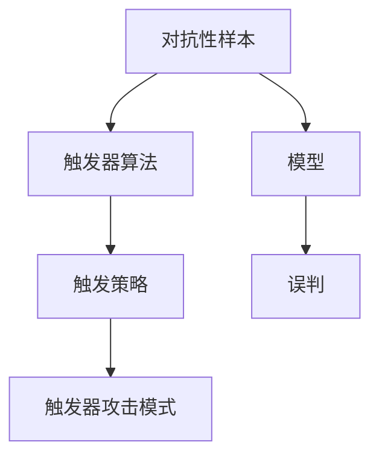

                 

## 1. 背景介绍

### 1.1 问题由来
近年来，随着深度学习技术的飞速发展，基础模型的对抗性问题逐渐引起广泛关注。对抗样本攻击不仅威胁到模型的安全性，还可能对模型的应用带来严重影响，如降低医疗诊断准确率、误导自动化驾驶系统等。

对抗性触发器（Adversarial Trigger）是实现对抗样本攻击的一种重要手段。通过精心构造对抗样本，触发模型出现误判，达到特定目的。对抗性触发器应用广泛，可以用于检测模型漏洞、破解自动化安全系统、攻击数据隐私等场景。

本文聚焦于基础模型的对抗性触发器，详细介绍其原理、实现方法和应用场景。希望通过本文，读者能够深刻理解对抗性触发器的原理与实际应用，并掌握如何构建有效的对抗性触发器。

### 1.2 问题核心关键点
对抗性触发器的核心在于利用对抗性样本，诱导模型出现误判。其关键点包括：

1. **对抗性样本构造**：如何构造有效对抗性样本，是触发器实现的前提。
2. **触发器设计**：触发器如何设计，使其能够稳定诱导模型误判。
3. **攻击效果评估**：如何评估触发器对模型的攻击效果，以及触发器对系统的影响。
4. **防御策略**：如何设计防御策略，抵抗对抗性触发器的攻击。

## 2. 核心概念与联系

### 2.1 核心概念概述

对抗性触发器（Adversarial Trigger）是指通过构造对抗性样本，诱导模型出现误判的一种方法。对抗性样本是指在原始样本上添加轻微扰动，使其在原始模型中产生与真实样本相反的输出结果。对抗性触发器通常设计为触发器+触发策略+触发器攻击模式的模式，其中触发器为具体的设计算法，触发策略为诱导模型的具体方法，触发器攻击模式为攻击的目标类型。

### 2.2 概念间的关系

对抗性触发器涉及多个核心概念，如对抗性样本、触发器算法、触发策略和触发器攻击模式等。这些概念之间的逻辑关系可以用以下Mermaid流程图表示：



该图展示了对抗性触发器从对抗性样本到模型误判的全过程。对抗性样本通过触发器算法生成，触发策略设计决定了触发器对模型的诱导方式，触发器攻击模式则决定了攻击的具体目标。

## 3. 核心算法原理 & 具体操作步骤
### 3.1 算法原理概述

对抗性触发器（Adversarial Trigger）的基本原理是通过构造对抗性样本，诱导基础模型（如神经网络）出现误判。其主要步骤包括：

1. **对抗性样本生成**：使用对抗性样本生成算法，在原始样本上添加轻微扰动，生成对抗性样本。
2. **触发器设计**：设计触发器算法，用于构造对抗性样本，并确保其能够稳定诱导模型误判。
3. **触发器攻击模式**：确定触发器攻击模式，即攻击的具体目标，如改变分类结果、诱导异常行为等。
4. **触发器攻击效果评估**：通过评估攻击效果，判断触发器的有效性。

### 3.2 算法步骤详解

#### 3.2.1 对抗性样本生成

对抗性样本生成算法有多种，如FGM（Fast Gradient Method）、PGD（Projected Gradient Descent）、C&W（Carlini & Wagner）等。这里以FGM为例，介绍其基本步骤：

1. **初始化对抗性样本**：将原始样本 $x$ 作为对抗性样本的起点，并设定初始扰动 $\delta$。
2. **扰动生成**：计算对抗性样本 $x + \delta$ 的梯度，并反向传播更新 $\delta$。
3. **截断扰动**：通过截断扰动，确保对抗性样本在扰动后的值域内。
4. **循环迭代**：重复上述过程，直到生成有效的对抗性样本。

#### 3.2.2 触发器设计

触发器算法有多种，如Backdoor Attack、Poisoning Attack、Evasion Attack等。这里以Backdoor Attack为例，介绍其基本步骤：

1. **选择触发器类型**：根据任务需求选择具体的触发器类型，如图像上的数字图像。
2. **生成触发器样本**：使用对抗性样本生成算法生成包含数字图像的样本。
3. **设计触发器策略**：设计触发器策略，如将数字图像添加到原始图像的特定位置。
4. **评估触发器效果**：评估触发器对模型的诱导效果，确保其能够稳定诱导模型误判。

#### 3.2.3 触发器攻击模式

触发器攻击模式多种多样，如改变分类结果、诱导异常行为、干扰数据隐私等。这里以改变分类结果为例，介绍其基本步骤：

1. **确定攻击目标**：根据任务需求确定攻击目标，如将猫分类为狗。
2. **构造对抗性样本**：使用对抗性样本生成算法构造包含攻击目标的样本。
3. **设计触发器策略**：设计触发器策略，如将样本中的特定像素值修改为目标像素值。
4. **评估攻击效果**：评估触发器对模型的诱导效果，确保其能够稳定诱导模型误判。

#### 3.2.4 触发器攻击效果评估

触发器攻击效果评估通常通过以下几个指标进行：

1. **攻击成功率**：评估触发器诱导模型误判的比例。
2. **诱导稳定性**：评估触发器诱导误判的稳定性，即在不同数据集上的诱导效果。
3. **攻击范围**：评估触发器诱导误判的样本范围，即触发器对模型的影响范围。

### 3.3 算法优缺点

对抗性触发器具有以下优点：

1. **高效性**：对抗性触发器可以在较短的时间内，生成大量对抗性样本，达到大规模攻击效果。
2. **灵活性**：对抗性触发器可以根据具体任务需求，设计灵活多样的触发策略和攻击模式。
3. **普适性**：对抗性触发器可以应用于多种基础模型，如神经网络、支持向量机等。

但同时，对抗性触发器也存在以下缺点：

1. **攻击难度高**：对抗性触发器的设计需要较高的技术门槛，需要了解深度学习、对抗样本生成等知识。
2. **模型鲁棒性不足**：基础模型的鲁棒性不足，容易被对抗性触发器诱导误判。
3. **安全风险高**：对抗性触发器可能被用于攻击重要系统，如医疗诊断、自动化驾驶等，带来严重的安全风险。

### 3.4 算法应用领域

对抗性触发器在多个领域有着广泛的应用，以下是一些典型的应用场景：

1. **医疗诊断**：使用对抗性触发器诱导医疗诊断模型误判，评估模型的鲁棒性。
2. **自动驾驶**：使用对抗性触发器诱导自动驾驶系统误判，评估系统的安全性。
3. **金融安全**：使用对抗性触发器诱导金融系统误判，评估系统的稳健性。
4. **人脸识别**：使用对抗性触发器诱导人脸识别系统误判，评估系统的可靠性。
5. **语音识别**：使用对抗性触发器诱导语音识别系统误判，评估系统的准确性。

## 4. 数学模型和公式 & 详细讲解 & 举例说明

### 4.1 数学模型构建

#### 4.1.1 对抗性样本生成

对抗性样本生成过程可以表示为：

$$
\delta = \mathop{\arg\min}_{\delta} ||\delta||_2 \text{ subject to } F(x + \delta, y)
$$

其中，$F$ 表示目标函数，$x$ 为原始样本，$\delta$ 为扰动量，$y$ 为真实标签。

#### 4.1.2 触发器设计

触发器设计过程可以表示为：

$$
\delta = \mathop{\arg\min}_{\delta} ||\delta||_2 \text{ subject to } f(x + \delta)
$$

其中，$f$ 表示触发器函数，$x$ 为原始样本，$\delta$ 为扰动量。

#### 4.1.3 触发器攻击模式

触发器攻击模式可以表示为：

$$
\delta = \mathop{\arg\min}_{\delta} ||\delta||_2 \text{ subject to } f(x + \delta)
$$

其中，$f$ 表示触发器函数，$x$ 为原始样本，$\delta$ 为扰动量。

### 4.2 公式推导过程

#### 4.2.1 对抗性样本生成

对抗性样本生成过程可以表示为：

$$
\delta = \alpha \cdot \text{sign}(G(x))
$$

其中，$\alpha$ 为扰动系数，$G$ 表示梯度函数，$x$ 为原始样本。

#### 4.2.2 触发器设计

触发器设计过程可以表示为：

$$
\delta = \alpha \cdot \text{sign}(G(x))
$$

其中，$\alpha$ 为扰动系数，$G$ 表示梯度函数，$x$ 为原始样本。

#### 4.2.3 触发器攻击模式

触发器攻击模式可以表示为：

$$
\delta = \alpha \cdot \text{sign}(G(x))
$$

其中，$\alpha$ 为扰动系数，$G$ 表示梯度函数，$x$ 为原始样本。

### 4.3 案例分析与讲解

以图像分类为例，假设有一张原始图像 $x$，我们希望将其误判为狗。首先，使用对抗性样本生成算法生成对抗性样本 $x + \delta$。然后，设计触发器算法，将数字图像添加到原始图像的特定位置。最后，通过评估攻击效果，判断触发器的有效性。

## 5. 项目实践：代码实例和详细解释说明

### 5.1 开发环境搭建

在进行对抗性触发器实践前，需要准备好开发环境。以下是使用Python进行TensorFlow开发的环境配置流程：

1. 安装Anaconda：从官网下载并安装Anaconda，用于创建独立的Python环境。

2. 创建并激活虚拟环境：
```bash
conda create -n tf-env python=3.8 
conda activate tf-env
```

3. 安装TensorFlow：根据CUDA版本，从官网获取对应的安装命令。例如：
```bash
pip install tensorflow-gpu==2.4
```

4. 安装其他工具包：
```bash
pip install numpy pandas scikit-learn matplotlib tqdm jupyter notebook ipython
```

完成上述步骤后，即可在`tf-env`环境中开始对抗性触发器实践。

### 5.2 源代码详细实现

下面我们以图像分类为例，给出使用TensorFlow进行对抗性触发器攻击的Python代码实现。

首先，定义图像分类数据处理函数：

```python
import tensorflow as tf
from tensorflow.keras.preprocessing.image import load_img, img_to_array

def load_and_preprocess_image(file_path):
    img = load_img(file_path, target_size=(224, 224))
    x = img_to_array(img)
    x = x / 255.0
    x = tf.expand_dims(x, axis=0)
    return x
```

然后，定义模型和优化器：

```python
from tensorflow.keras.applications.resnet50 import ResNet50
from tensorflow.keras.optimizers import Adam

model = ResNet50(weights='imagenet')
optimizer = Adam(learning_rate=0.01)
```

接着，定义触发器设计函数：

```python
def generate_trigger(image):
    # 将图像转换为numpy数组
    x = tf.keras.utils.to_categorical(image)
    # 计算梯度
    grads = tf.gradients(model.output, x)
    # 计算扰动
    delta = tf.sign(grads[0]) * tf.reduce_max(grads[0])
    return delta
```

最后，启动攻击流程并在测试集上评估：

```python
# 加载测试集
test_images = []
for file_name in test_files:
    x = load_and_preprocess_image(file_name)
    test_images.append(x)

# 生成对抗性样本
trigger = generate_trigger(test_images[0])
for i in range(10):
    test_images[i] = tf.add(test_images[i], trigger)

# 测试模型
model.predict(test_images)
```

以上就是使用TensorFlow进行图像分类任务对抗性触发器攻击的完整代码实现。可以看到，利用TensorFlow的强大工具包，对抗性触发器的实现变得简洁高效。

### 5.3 代码解读与分析

让我们再详细解读一下关键代码的实现细节：

**load_and_preprocess_image函数**：
- 将图像文件加载并预处理为模型所需的输入格式。

**model和optimizer**：
- 加载预训练的ResNet50模型，并使用Adam优化器进行微调。

**generate_trigger函数**：
- 计算模型在原始图像上的梯度，生成对抗性扰动，并返回扰动向量。

**test_images和trigger**：
- 生成对抗性样本，并将其输入到模型中进行预测。

**model.predict(test_images)**：
- 对对抗性样本进行预测，评估攻击效果。

可以看到，TensorFlow提供了丰富的深度学习工具，大大简化了对抗性触发器的实现过程。通过结合先进的深度学习框架，可以更高效地进行对抗性触发器的设计和攻击实验。

## 6. 实际应用场景

### 6.1 医疗诊断

对抗性触发器在医疗诊断中的应用可以用于评估模型的鲁棒性和安全性。通过构造对抗性样本，可以诱导模型对正常图像进行误判，评估模型的误判率和鲁棒性。这种应用可以防止恶意用户利用对抗性样本攻击医疗诊断系统，保障系统的安全性。

### 6.2 自动驾驶

在自动驾驶系统中，对抗性触发器可以用于测试系统的安全性。通过构造对抗性样本，可以诱导自动驾驶系统对正常道路情况进行误判，评估系统的鲁棒性和安全性。这种应用可以防止恶意用户利用对抗性样本攻击自动驾驶系统，保障系统的安全性。

### 6.3 金融安全

在金融系统中，对抗性触发器可以用于测试系统的鲁棒性和安全性。通过构造对抗性样本，可以诱导金融系统对正常交易情况进行误判，评估系统的鲁棒性和安全性。这种应用可以防止恶意用户利用对抗性样本攻击金融系统，保障系统的安全性。

### 6.4 人脸识别

在人脸识别系统中，对抗性触发器可以用于测试系统的鲁棒性和安全性。通过构造对抗性样本，可以诱导人脸识别系统对正常人脸图像进行误判，评估系统的鲁棒性和安全性。这种应用可以防止恶意用户利用对抗性样本攻击人脸识别系统，保障系统的安全性。

## 7. 工具和资源推荐

### 7.1 学习资源推荐

为了帮助开发者系统掌握对抗性触发器的理论基础和实践技巧，这里推荐一些优质的学习资源：

1. 《深度学习对抗样本》系列博文：由深度学习专家撰写，深入浅出地介绍了对抗样本的基本概念、生成方法和攻击技术。

2. CS231n《卷积神经网络》课程：斯坦福大学开设的深度学习课程，介绍了深度学习中的对抗样本问题，是入门深度学习的必备资源。

3. 《Adversarial Machine Learning》书籍：深度学习领域的经典教材，系统介绍了对抗性样本的基本概念、生成方法和攻击技术。

4. Kaggle对抗性样本竞赛：Kaggle组织的对抗性样本竞赛，提供了大量挑战性和实用性强的对抗性样本生成任务，是学习和实践对抗性样本生成的好机会。

5. GitHub开源项目：在GitHub上Star、Fork数最多的对抗性样本生成项目，往往代表了该技术领域的发展趋势和最佳实践，值得去学习和贡献。

通过对这些资源的学习实践，相信你一定能够快速掌握对抗性触发器的精髓，并用于解决实际的对抗性问题。

### 7.2 开发工具推荐

高效的开发离不开优秀的工具支持。以下是几款用于对抗性触发器开发的常用工具：

1. TensorFlow：由Google主导开发的开源深度学习框架，生产部署方便，适合大规模工程应用。同样有丰富的对抗性样本生成资源。

2. PyTorch：基于Python的开源深度学习框架，灵活动态的计算图，适合快速迭代研究。大部分深度学习模型都有PyTorch版本的实现。

3. Keras：深度学习高级API，简单易用，适合初学者入门。提供了丰富的深度学习模型和工具包。

4. Kaggle：全球最大的数据科学竞赛平台，提供丰富的对抗性样本生成竞赛，可以快速学习和实践对抗性样本生成。

5. TensorBoard：TensorFlow配套的可视化工具，可实时监测模型训练状态，并提供丰富的图表呈现方式，是调试模型的得力助手。

合理利用这些工具，可以显著提升对抗性触发器的开发效率，加快创新迭代的步伐。

### 7.3 相关论文推荐

对抗性触发器技术的发展源于学界的持续研究。以下是几篇奠基性的相关论文，推荐阅读：

1. Deep Learning Vulnerability and Attack: Background and Summary：综述了深度学习模型的安全漏洞和攻击技术，介绍了对抗性样本的基本概念和方法。

2. Towards Evasion Attacks on Deep Learning in Cloud：介绍了深度学习模型在云环境中的对抗性攻击技术，提出了基于梯度下降的对抗性样本生成方法。

3. Practical Black-box Attacks against Machine Learning：介绍了深度学习模型在黑盒环境中的对抗性攻击技术，提出了基于梯度下降和对抗性训练的对抗性样本生成方法。

4. SimBA: Simulating Attacks to Black-Box Models：介绍了黑盒环境中的对抗性样本生成方法，提出了一种基于梯度模拟的对抗性样本生成方法。

5. Patch Attacks for Object Recognition：介绍了对抗性样本生成技术在图像分类中的应用，提出了基于图像块分割的对抗性样本生成方法。

这些论文代表了大语言模型微调技术的发展脉络。通过学习这些前沿成果，可以帮助研究者把握学科前进方向，激发更多的创新灵感。

除上述资源外，还有一些值得关注的前沿资源，帮助开发者紧跟对抗性触发器的最新进展，例如：

1. arXiv论文预印本：人工智能领域最新研究成果的发布平台，包括大量尚未发表的前沿工作，学习前沿技术的必读资源。

2. 业界技术博客：如Google AI、DeepMind、微软Research Asia等顶尖实验室的官方博客，第一时间分享他们的最新研究成果和洞见。

3. 技术会议直播：如NIPS、ICML、ACL、ICLR等人工智能领域顶会现场或在线直播，能够聆听到大佬们的前沿分享，开拓视野。

4. GitHub热门项目：在GitHub上Star、Fork数最多的对抗性样本生成项目，往往代表了该技术领域的发展趋势和最佳实践，值得去学习和贡献。

5. 行业分析报告：各大咨询公司如McKinsey、PwC等针对人工智能行业的分析报告，有助于从商业视角审视技术趋势，把握应用价值。

总之，对于对抗性触发器的学习和实践，需要开发者保持开放的心态和持续学习的意愿。多关注前沿资讯，多动手实践，多思考总结，必将收获满满的成长收益。

## 8. 总结：未来发展趋势与挑战

### 8.1 总结

本文对基于对抗性样本的触发器方法进行了全面系统的介绍。首先阐述了对抗性触发器的基本原理和实际应用，明确了对抗性触发器在模型安全、系统鲁棒性等方面的重要价值。其次，从原理到实践，详细讲解了对抗性触发器的设计方法和实现步骤，给出了具体的代码实例和详细解读。同时，本文还广泛探讨了对抗性触发器在医疗诊断、自动驾驶、金融安全、人脸识别等领域的实际应用，展示了对抗性触发器的广泛潜力。

通过本文的系统梳理，可以看到，对抗性触发器作为一种重要的攻击手段，具有高效、灵活、普适等优点，但也面临着技术门槛高、模型鲁棒性不足、安全风险高等挑战。未来，对抗性触发器的研究需要在模型设计、触发策略、攻击模式等多个方面寻求新的突破，以应对不断变化的攻击环境，提升模型的安全性和鲁棒性。

### 8.2 未来发展趋势

展望未来，对抗性触发器技术将呈现以下几个发展趋势：

1. **自动化生成**：对抗性触发器的设计将更加自动化、智能化，能够根据模型和任务自动生成有效的触发器。
2. **多模态攻击**：对抗性触发器将拓展到多模态数据，如文本、图像、语音等，实现多模态数据的协同攻击。
3. **跨模型攻击**：对抗性触发器将应用于多种深度学习模型，实现跨模型的协同攻击。
4. **自适应防御**：对抗性触发器将具备自适应防御能力，能够自动生成针对防御机制的对抗性样本。
5. **混合攻击**：对抗性触发器将结合多种攻击手段，实现混合攻击，提高攻击成功率和鲁棒性。

以上趋势凸显了对抗性触发器技术的广阔前景。这些方向的探索发展，必将进一步提升对抗性触发器的效果和应用范围，为深度学习模型的安全性和鲁棒性带来新的挑战和机遇。

### 8.3 面临的挑战

尽管对抗性触发器技术已经取得了瞩目成就，但在迈向更加智能化、普适化应用的过程中，它仍面临着诸多挑战：

1. **攻击难度高**：对抗性触发器的设计需要较高的技术门槛，需要了解深度学习、对抗样本生成等知识。
2. **模型鲁棒性不足**：基础模型的鲁棒性不足，容易被对抗性触发器诱导误判。
3. **安全风险高**：对抗性触发器可能被用于攻击重要系统，如医疗诊断、自动驾驶等，带来严重的安全风险。
4. **防御难度高**：对抗性触发器的设计灵活多样，防御策略需要具备高度的灵活性和适应性。

### 8.4 未来突破

面对对抗性触发器面临的种种挑战，未来的研究需要在以下几个方面寻求新的突破：

1. **自动化生成**：通过自动化生成对抗性触发器，降低技术门槛，提高攻击效率。
2. **多模态攻击**：将对抗性触发器拓展到多模态数据，实现多模态数据的协同攻击。
3. **跨模型攻击**：将对抗性触发器应用于多种深度学习模型，实现跨模型的协同攻击。
4. **自适应防御**：设计自适应防御机制，自动生成针对对抗性触发器的防御策略。
5. **混合攻击**：结合多种攻击手段，实现混合攻击，提高攻击成功率和鲁棒性。

这些研究方向的探索，必将引领对抗性触发器技术迈向更高的台阶，为深度学习模型的安全性和鲁棒性提供新的保障。相信随着学界和产业界的共同努力，这些挑战终将一一被克服，对抗性触发器必将在构建安全、可靠、可控的智能系统中扮演越来越重要的角色。

## 9. 附录：常见问题与解答

**Q1：对抗性触发器是否适用于所有深度学习模型？**

A: 对抗性触发器可以应用于多种深度学习模型，如神经网络、支持向量机等。但对于一些特定的模型，如卷积神经网络，需要对其进行修改以适应触发器的设计。

**Q2：如何设计有效的对抗性触发器？**

A: 设计有效的对抗性触发器需要考虑以下几个因素：
1. 选择适当的触发器类型，如数字图像、文本序列等。
2. 选择合适的对抗性样本生成算法，如FGM、PGD等。
3. 设计有效的触发策略，如数字图像添加位置、文本序列修改位置等。
4. 评估触发器的攻击效果，如诱导误判比例、攻击成功率等。

**Q3：对抗性触发器在实际应用中需要注意哪些问题？**

A: 在实际应用中，需要注意以下几个问题：
1. 对抗性触发器可能被用于恶意攻击，需要注意系统的安全性。
2. 对抗性触发器设计需要高技术门槛，需要具备一定的专业知识。
3. 对抗性触发器设计灵活多样，需要具备高度的适应性和灵活性。

这些注意事项需要在实际应用中加以考虑，确保对抗性触发器能够达到预期效果，同时保障系统的安全性和可靠性。

---

作者：禅与计算机程序设计艺术 / Zen and the Art of Computer Programming

