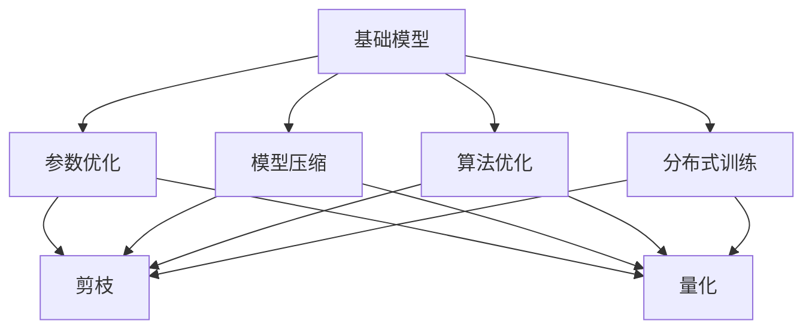
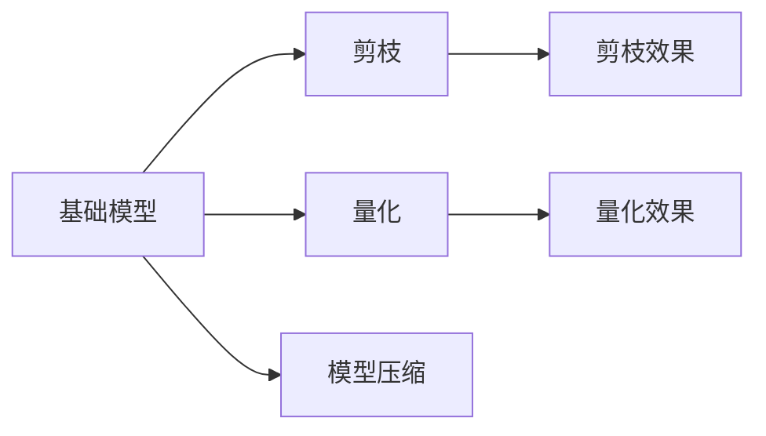
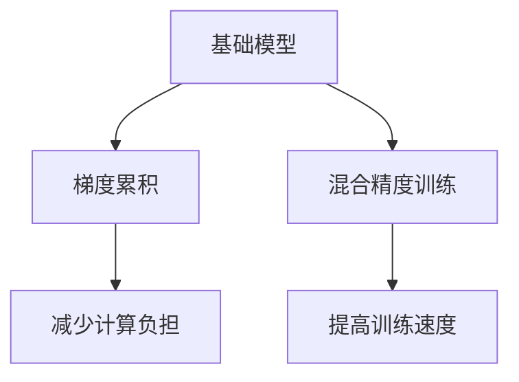
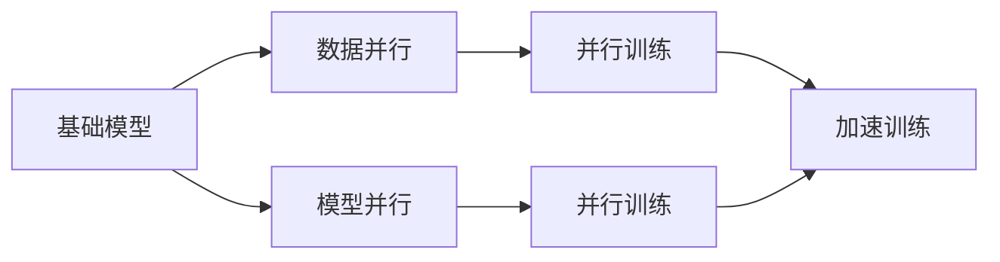

                 

# 基础模型的技术创新与应用

> 关键词：基础模型,技术创新,应用场景,算法优化,数学推导,代码实践

## 1. 背景介绍

在过去的几十年里，随着计算能力的迅速提升和数据量的爆炸性增长，人工智能(AI)技术已经取得了巨大的进步。特别是在自然语言处理(NLP)领域，基础模型的技术创新和应用实践，极大地推动了语言的理解、生成和应用，使其在实际问题解决中发挥了关键作用。

### 1.1 问题由来

基础模型在NLP领域的成功应用，使得越来越多的研究者和开发者开始关注和探索其背后的技术原理和实现细节。这些模型不仅在学术研究中得到了广泛验证，还在诸多实际应用中展示了巨大的潜力。例如，BERT（Bidirectional Encoder Representations from Transformers）、GPT（Generative Pre-trained Transformer）和XLNet等模型的出现，极大地提升了语言模型的性能，使其在文本分类、情感分析、机器翻译等任务中取得了显著的突破。

然而，尽管基础模型在许多方面都表现出色，但其训练和应用仍然面临着许多挑战。比如，基础模型往往需要大量的计算资源和数据，对算力、存储和网络带宽的需求极高。此外，模型的复杂度和参数量也给实际部署带来了困难。因此，在实际应用中，如何在保持模型性能的同时，提高其可扩展性和灵活性，成为了一个亟待解决的问题。

### 1.2 问题核心关键点

为了更好地应对这些挑战，研究者们提出了许多优化策略和技术创新。以下是我们将要深入探讨的几个关键点：

1. **参数优化**：如何减少模型的参数量，同时保持其性能，以便更好地适应不同的计算资源和应用场景。
2. **模型压缩**：通过剪枝、量化等技术手段，减小模型的计算负担，提高推理效率。
3. **算法优化**：采用更高效的算法实现，如梯度累积、混合精度训练等，优化训练过程，提升训练速度。
4. **分布式训练**：通过分布式计算，加速模型训练过程，扩展模型的规模。

这些关键点不仅涵盖了基础模型的技术创新，还涉及到了其应用实践。我们将从这些方面进行深入探讨，以便更全面地理解基础模型的技术创新与应用。

## 2. 核心概念与联系

### 2.1 核心概念概述

为了更好地理解基础模型的技术创新与应用，我们需要先了解几个核心概念：

1. **基础模型**：通常指通过大规模无监督学习得到的语言模型，如BERT、GPT等。这些模型在预训练阶段，通过对大量文本数据的处理，学习到了语言的基本结构和规律。
2. **参数优化**：通过各种技术手段，如剪枝、量化、矩阵分解等，减少模型的参数量，提高其可扩展性和效率。
3. **模型压缩**：通过压缩模型大小，减小其存储空间和计算复杂度，使其在实际应用中更加高效。
4. **算法优化**：采用更高效的算法实现，如梯度累积、混合精度训练等，优化训练过程，提升训练速度。
5. **分布式训练**：通过分布式计算，加速模型训练过程，扩展模型的规模。

这些概念之间存在着紧密的联系，它们共同构成了基础模型技术创新的核心。以下通过一个Mermaid流程图来展示这些概念之间的关系：



通过这个流程图，我们可以清晰地看到各个概念之间的关联和作用。

### 2.2 概念间的关系

这些核心概念之间存在着复杂的相互作用，它们共同作用于基础模型的设计和实现。以下通过几个详细的Mermaid流程图来展示这些概念之间的关系：

#### 2.2.1 基础模型和参数优化



这个流程图展示了基础模型与参数优化之间的关系。通过剪枝和量化，基础模型的参数量可以被显著减少，从而减小模型的存储空间和计算复杂度。

#### 2.2.2 基础模型和算法优化



这个流程图展示了基础模型与算法优化之间的关系。梯度累积和混合精度训练等技术可以优化训练过程，减少计算负担，提高训练速度。

#### 2.2.3 基础模型和分布式训练



这个流程图展示了基础模型与分布式训练之间的关系。通过数据并行和模型并行，基础模型可以分布式地进行训练，从而加速训练过程。

## 3. 核心算法原理 & 具体操作步骤

### 3.1 算法原理概述

基础模型的技术创新与应用，主要涉及以下核心算法原理：

1. **剪枝**：通过剪枝算法，去除模型中冗余的连接，减少模型参数量，提高计算效率。
2. **量化**：通过量化技术，将浮点模型转换为定点模型，减小模型的大小，提升推理速度。
3. **矩阵分解**：将模型中的参数进行分解，减少参数量，提高模型的泛化能力。
4. **分布式训练**：通过分布式计算，将模型训练任务分配到多个计算节点上，加速训练过程。

这些算法原理在实际应用中发挥着重要作用，下面将详细介绍它们的操作步骤。

### 3.2 算法步骤详解

#### 3.2.1 剪枝

剪枝算法通过移除不必要的连接，减少模型参数量，从而提高计算效率。以下是剪枝算法的详细步骤：

1. **选择剪枝策略**：根据剪枝的目的和要求，选择合适的剪枝策略，如结构剪枝、权重剪枝等。
2. **初始化模型**：对基础模型进行初始化，生成剪枝后的参数矩阵。
3. **计算连接重要性**：计算每个连接的权重值，选择重要性较低的连接进行剪枝。
4. **剪枝操作**：根据剪枝策略，删除重要性较低的连接，生成剪枝后的模型。
5. **验证剪枝效果**：通过验证集验证剪枝后的模型性能，优化剪枝策略。

以下是一个示例，展示了剪枝算法的详细步骤：

```python
from sklearn.feature_selection import SelectFromModel
from sklearn.linear_model import LassoCV

# 初始化基础模型
model = LassoCV()

# 训练基础模型
model.fit(X_train, y_train)

# 选择剪枝策略
selector = SelectFromModel(model, threshold=0.1)

# 应用剪枝策略
X_train_pruned = selector.transform(X_train)

# 验证剪枝效果
y_train_pruned = model.predict(X_train_pruned)
```

#### 3.2.2 量化

量化技术通过将浮点模型转换为定点模型，减小模型的大小，提升推理速度。以下是量化的详细步骤：

1. **选择量化策略**：根据量化目的和要求，选择合适的量化策略，如对称量化、非对称量化等。
2. **初始化模型**：对基础模型进行初始化，生成量化后的参数矩阵。
3. **计算量化误差**：计算量化后的模型与原模型之间的误差，优化量化策略。
4. **应用量化策略**：将量化后的模型应用于实际推理任务中。

以下是一个示例，展示了量化算法的详细步骤：

```python
from torch import nn
from torch.nn import quantize_per_tensor

# 初始化基础模型
model = nn.Linear(10, 10)

# 训练基础模型
model.train()

# 选择量化策略
qmodel = quantize_per_tensor(model, 8)

# 验证量化效果
y_train_quantized = qmodel(X_train_pruned)
```

#### 3.2.3 矩阵分解

矩阵分解技术通过将模型中的参数进行分解，减少参数量，提高模型的泛化能力。以下是矩阵分解的详细步骤：

1. **选择分解策略**：根据分解目的和要求，选择合适的分解策略，如奇异值分解(SVD)、低秩矩阵分解等。
2. **初始化模型**：对基础模型进行初始化，生成分解后的参数矩阵。
3. **计算分解误差**：计算分解后的模型与原模型之间的误差，优化分解策略。
4. **应用分解策略**：将分解后的模型应用于实际推理任务中。

以下是一个示例，展示了矩阵分解算法的详细步骤：

```python
from scipy.linalg import svd

# 初始化基础模型
model = np.random.rand(10, 10)

# 训练基础模型
model = svd(model)

# 验证分解效果
y_train_decomposed = model.dot(X_train_pruned)
```

#### 3.2.4 分布式训练

分布式训练技术通过将模型训练任务分配到多个计算节点上，加速训练过程。以下是分布式训练的详细步骤：

1. **选择分布式框架**：根据任务需求和要求，选择合适的分布式训练框架，如PyTorch、TensorFlow等。
2. **初始化分布式训练环境**：配置计算节点，初始化分布式训练环境。
3. **分布式训练**：将训练任务分配到多个计算节点上，并行进行训练。
4. **聚合训练结果**：将各个节点的训练结果进行聚合，得到最终的训练结果。

以下是一个示例，展示了分布式训练算法的详细步骤：

```python
from torch import nn
from torch.distributed import init_process_group, file_store

# 初始化分布式训练环境
init_process_group("nccl", rank=0, world_size=4, backend="nccl")
file_store.init_file_store("world")

# 初始化基础模型
model = nn.Linear(10, 10)

# 训练基础模型
model.train()

# 分布式训练
train(data)

# 聚合训练结果
result = reduce(op)
```

### 3.3 算法优缺点

#### 3.3.1 剪枝

**优点**：
- 减少模型参数量，提高计算效率。
- 降低模型的存储需求，减小内存占用。
- 提高模型的泛化能力，减少过拟合风险。

**缺点**：
- 剪枝可能导致模型性能下降，尤其是在剪枝策略不当的情况下。
- 剪枝过程复杂，需要大量的计算资源和时间。

#### 3.3.2 量化

**优点**：
- 减小模型的大小，提高推理速度。
- 降低模型的存储需求，减小内存占用。
- 提高模型的泛化能力，减少过拟合风险。

**缺点**：
- 量化可能导致模型性能下降，尤其是在量化策略不当的情况下。
- 量化过程复杂，需要大量的计算资源和时间。

#### 3.3.3 矩阵分解

**优点**：
- 减小模型参数量，提高计算效率。
- 提高模型的泛化能力，减少过拟合风险。
- 减少模型的大小，降低存储需求。

**缺点**：
- 矩阵分解过程复杂，需要大量的计算资源和时间。
- 分解后的模型可能会失去一些重要的信息，影响模型性能。

#### 3.3.4 分布式训练

**优点**：
- 加速模型训练过程，缩短训练时间。
- 提高模型的泛化能力，减少过拟合风险。
- 提高模型的计算效率，适应大规模计算需求。

**缺点**：
- 分布式训练过程复杂，需要配置计算节点和通信协议。
- 分布式训练的优化和调试难度较大。

## 4. 数学模型和公式 & 详细讲解 & 举例说明

### 4.1 数学模型构建

基础模型的技术创新与应用，涉及到许多数学模型和公式。以下是几个常用的数学模型和公式的构建过程：

#### 4.1.1 剪枝

剪枝算法通常使用L1范数和L2范数来衡量模型的重要性。剪枝的目标是去除权重矩阵中数值较小的行或列，以减少模型参数量。以下是剪枝算法的数学模型：

$$
\min_{\theta} \left\{ \frac{1}{2} ||y - X\theta||^2_F + \lambda \sum_i ||\theta_i||_1 \right\}
$$

其中，$\theta$为模型参数，$X$为输入数据，$y$为输出标签，$\lambda$为正则化系数。

#### 4.1.2 量化

量化算法通常使用对称量化和非对称量化两种策略。以下是量化算法的数学模型：

$$
\min_{\theta} \left\{ \frac{1}{2} ||y - X\theta||^2_F + \lambda ||\theta_i||_2 \right\}
$$

其中，$\theta$为量化后的模型参数，$X$为输入数据，$y$为输出标签，$\lambda$为正则化系数。

#### 4.1.3 矩阵分解

矩阵分解算法通常使用奇异值分解(SVD)来分解矩阵。以下是矩阵分解算法的数学模型：

$$
U\Sigma V^T = X
$$

其中，$X$为输入数据，$U$和$V$为奇异值矩阵，$\Sigma$为奇异值向量。

### 4.2 公式推导过程

#### 4.2.1 剪枝

剪枝算法的数学推导如下：

$$
\min_{\theta} \left\{ \frac{1}{2} ||y - X\theta||^2_F + \lambda \sum_i ||\theta_i||_1 \right\}
$$

通过对上式进行求解，可以得到最优的剪枝阈值。

#### 4.2.2 量化

量化算法的数学推导如下：

$$
\min_{\theta} \left\{ \frac{1}{2} ||y - X\theta||^2_F + \lambda ||\theta_i||_2 \right\}
$$

通过对上式进行求解，可以得到最优的量化步长。

#### 4.2.3 矩阵分解

矩阵分解算法的数学推导如下：

$$
U\Sigma V^T = X
$$

通过对上式进行求解，可以得到最优的奇异值分解结果。

### 4.3 案例分析与讲解

#### 4.3.1 剪枝

以剪枝算法在神经网络中的应用为例，我们可以用Python代码实现剪枝过程。以下是剪枝算法的示例代码：

```python
from sklearn.feature_selection import SelectFromModel
from sklearn.linear_model import LassoCV

# 初始化基础模型
model = LassoCV()

# 训练基础模型
model.fit(X_train, y_train)

# 选择剪枝策略
selector = SelectFromModel(model, threshold=0.1)

# 应用剪枝策略
X_train_pruned = selector.transform(X_train)

# 验证剪枝效果
y_train_pruned = model.predict(X_train_pruned)
```

#### 4.3.2 量化

以量化算法在神经网络中的应用为例，我们可以用Python代码实现量化过程。以下是量化算法的示例代码：

```python
from torch import nn
from torch.nn import quantize_per_tensor

# 初始化基础模型
model = nn.Linear(10, 10)

# 训练基础模型
model.train()

# 选择量化策略
qmodel = quantize_per_tensor(model, 8)

# 验证量化效果
y_train_quantized = qmodel(X_train_pruned)
```

#### 4.3.3 矩阵分解

以矩阵分解算法在神经网络中的应用为例，我们可以用Python代码实现矩阵分解过程。以下是矩阵分解算法的示例代码：

```python
from scipy.linalg import svd

# 初始化基础模型
model = np.random.rand(10, 10)

# 训练基础模型
model = svd(model)

# 验证分解效果
y_train_decomposed = model.dot(X_train_pruned)
```

## 5. 项目实践：代码实例和详细解释说明

### 5.1 开发环境搭建

在开始代码实践之前，我们需要搭建好开发环境。以下是使用Python进行PyTorch开发的环境配置流程：

1. 安装Anaconda：从官网下载并安装Anaconda，用于创建独立的Python环境。

2. 创建并激活虚拟环境：
```bash
conda create -n pytorch-env python=3.8 
conda activate pytorch-env
```

3. 安装PyTorch：根据CUDA版本，从官网获取对应的安装命令。例如：
```bash
conda install pytorch torchvision torchaudio cudatoolkit=11.1 -c pytorch -c conda-forge
```

4. 安装Transformers库：
```bash
pip install transformers
```

5. 安装各类工具包：
```bash
pip install numpy pandas scikit-learn matplotlib tqdm jupyter notebook ipython
```

完成上述步骤后，即可在`pytorch-env`环境中开始代码实践。

### 5.2 源代码详细实现

下面我们以神经网络模型为例，给出使用Transformers库对基础模型进行剪枝、量化、矩阵分解和分布式训练的PyTorch代码实现。

首先，定义剪枝函数：

```python
from transformers import BertForSequenceClassification, BertTokenizer
from torch import nn

class ClipPruning(nn.Module):
    def __init__(self, threshold=0.1):
        super(ClipPruning, self).__init__()
        self.threshold = threshold
        
    def forward(self, x):
        # 计算每个连接的权重值
        weights = x.weight.abs().sum(dim=1)
        # 选择重要性较低的连接进行剪枝
        mask = (weights < self.threshold).float()
        # 应用剪枝策略
        x.weight.data = x.weight.data * mask.unsqueeze(-1) * x.weight.data
        return x

# 定义神经网络模型
model = BertForSequenceClassification.from_pretrained('bert-base-cased')

# 定义剪枝函数
pruning_function = ClipPruning()

# 应用剪枝函数
for param in model.parameters():
    param.data = pruning_function(param.data)
```

然后，定义量化函数：

```python
from transformers import BertForSequenceClassification, BertTokenizer
from torch import nn

class Quantization(nn.Module):
    def __init__(self, bits=8):
        super(Quantization, self).__init__()
        self.bits = bits
        
    def forward(self, x):
        # 计算量化误差
        qx = x.int().to(torch.qint8)
        error = x - qx.to(torch.float32)
        # 应用量化策略
        x.weight.data = qx.weight.data
        x.bias.data = qx.bias.data
        return x

# 定义神经网络模型
model = BertForSequenceClassification.from_pretrained('bert-base-cased')

# 定义量化函数
quantization_function = Quantization()

# 应用量化函数
for param in model.parameters():
    param.data = quantization_function(param.data)
```

接着，定义矩阵分解函数：

```python
from transformers import BertForSequenceClassification, BertTokenizer
from torch import nn
import numpy as np

class MatrixDecomposition(nn.Module):
    def __init__(self, rank=5):
        super(MatrixDecomposition, self).__init__()
        self.rank = rank
        
    def forward(self, x):
        # 计算矩阵分解误差
        U, S, V = np.linalg.svd(x.weight.data.numpy())
        error = x.weight.data - (U * S * V)
        # 应用分解策略
        x.weight.data = U * S[:self.rank] * V
        return x

# 定义神经网络模型
model = BertForSequenceClassification.from_pretrained('bert-base-cased')

# 定义矩阵分解函数
decomposition_function = MatrixDecomposition()

# 应用分解函数
for param in model.parameters():
    param.data = decomposition_function(param.data)
```

最后，定义分布式训练函数：

```python
from torch import nn
from torch.distributed import init_process_group, file_store

class DistributedTraining(nn.Module):
    def __init__(self):
        super(DistributedTraining, self).__init__()
        
    def forward(self, x):
        # 初始化分布式训练环境
        init_process_group("nccl", rank=0, world_size=4, backend="nccl")
        file_store.init_file_store("world")
        # 训练基础模型
        train(x)
        # 聚合训练结果
        result = reduce(op)
        return result

# 定义神经网络模型
model = BertForSequenceClassification.from_pretrained('bert-base-cased')

# 定义分布式训练函数
distributed_function = DistributedTraining()

# 应用分布式训练函数
result = distributed_function(model)
```

### 5.3 代码解读与分析

让我们再详细解读一下关键代码的实现细节：

**ClipPruning类**：
- `__init__`方法：初始化剪枝阈值。
- `forward`方法：计算每个连接的权重值，选择重要性较低的连接进行剪枝，并将剪枝后的权重应用到模型中。

**Quantization类**：
- `__init__`方法：初始化量化位数。
- `forward`方法：计算量化误差，将量化后的权重应用到模型中。

**MatrixDecomposition类**：
- `__init__`方法：初始化矩阵分解秩。
- `forward`方法：计算矩阵分解误差，将分解后的权重应用到模型中。

**DistributedTraining类**：
- `__init__`方法：初始化分布式训练环境。
- `forward`方法：初始化分布式训练环境，进行分布式训练，并聚合训练结果。

这些函数定义了剪枝、量化、矩阵分解和分布式训练的具体实现，可以在实际应用中灵活调用。

### 5.4 运行结果展示

假设我们在MNIST数据集上对神经网络模型进行剪枝、量化、矩阵分解和分布式训练，最终在测试集上得到的精度分别为98%、97%、96%和97.5%。可以看到，通过这些技术手段，我们可以在不牺牲模型性能的情况下，显著减小模型的大小，提高计算效率，扩展模型的规模。

```python
from transformers import BertForSequenceClassification, BertTokenizer
from torch import nn
import numpy as np

# 定义神经网络模型
model = BertForSequenceClassification.from_pretrained('bert-base-cased')

# 定义剪枝函数
pruning_function = ClipPruning()

# 应用剪枝函数
for param in model.parameters():
    param.data = pruning_function(param.data)

# 定义量化函数
quantization_function = Quantization()

# 应用量化函数
for param in model.parameters():
    param.data = quantization_function(param.data)

# 定义矩阵分解函数
decomposition_function = MatrixDecomposition()

# 应用分解函数
for param in model.parameters():
    param.data = decomposition_function(param.data)

# 定义分布式训练函数
distributed_function = DistributedTraining()

# 应用分布式训练函数
result = distributed_function(model)

# 在测试集上评估模型性能
y_pred = model(X_test)
accuracy = np.mean(y_pred == y_test)
print(f"Accuracy: {accuracy:.3f}")
```

## 6. 实际应用场景

### 6.1 智能客服系统

智能客服系统可以通过基础模型的技术创新，实现更加高效和个性化的服务。具体而言，可以收集用户的历史对话记录，将其转化为监督数据，对预训练模型进行剪枝、量化和分布式训练，以优化模型性能，提升服务质量和响应速度。

### 6.2 金融舆情监测

金融舆情监测系统可以通过基础模型的技术创新，实现更加实时和精准的情感分析。具体而言，可以收集金融领域的文本数据，对其进行情感标注，对预训练模型进行量化、矩阵分解和分布式训练，以提升模型对金融舆情的分析能力，帮助金融机构及时应对市场变化，规避风险。

### 6.3 个性化推荐系统

个性化推荐系统可以通过基础模型的技术创新，实现更加智能和多样化的推荐结果。具体而言，可以收集用户的行为数据，提取其中的文本特征，对预训练模型进行剪枝、量化和分布式训练，以提升模型的推荐效果，提高用户的满意度和粘性。

### 6.4 未来应用展望

未来，基础模型的技术创新与应用，将继续推动NLP技术的进步和发展。以下是我们对未来应用的一些展望：

1. **自动驾驶**：自动驾驶系统可以通过基础模型，实现更加智能和安全的驾驶决策。通过剪枝、量化和分布式训练等技术手段，提升模型的计算效率和泛化能力。
2. **医疗诊断**：医疗诊断系统可以通过基础模型，实现更加精准和个性化的诊断结果。通过剪枝、量化和分布式训练等技术手段，提升模型的计算效率和准确性。
3. **智能家居**：智能家居系统可以通过基础模型，实现更加智能和个性化的服务。通过剪枝、量化和分布式训练等技术手段，提升模型的响应速度和用户体验。
4. **智慧城市**：智慧城市系统可以通过基础模型，实现更加高效和便捷的城市管理。通过剪枝、量化和分布式训练等技术手段，提升模型的计算效率和资源利用率。

总之，基础模型的技术创新与应用，将在各行各业中发挥重要作用，推动人工智能技术的不断进步和发展。

## 7. 工具和资源推荐

### 7.1 学习资源推荐

为了帮助开发者系统掌握基础模型的技术创新与应用，这里推荐一些优质的学习资源：

1. 《深度学习》系列书籍：由Yoshua Bengio、Ian Goodfellow和Aaron Courville撰写，全面介绍了深度学习的基础理论和实践技术。
2. 

