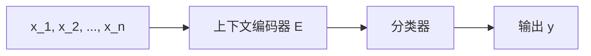

                 

# 基于端到端神经网络模型的词义消歧算法研究

## 1. 背景介绍

在自然语言处理(NLP)中，词义消歧（Word Sense Disambiguation, WSD）是一个重要的基础任务，涉及解决一个单词或短语在特定上下文中具有不同含义的问题。例如，“bank”一词既可以表示“银行”，也可以表示“河岸”。对于语义理解、信息抽取、机器翻译、问答系统等许多高级NLP任务而言，准确地理解单词的含义至关重要。近年来，基于神经网络模型的端到端方法在词义消歧领域展现出显著的优势，本文将探讨这一领域的研究进展，并提出改进方法。

## 2. 核心概念与联系

### 2.1 核心概念概述

为了深入了解端到端神经网络模型在词义消歧中的应用，需要了解一些关键概念：

- **词义消歧**：解决一个单词或短语在特定上下文中具有不同含义的问题，例如“bank”一词在“I went to the bank of the river”和“I deposited money in the bank”中具有不同的含义。
- **神经网络模型**：一类模拟人脑神经元工作方式的计算模型，常用于图像识别、语音识别、自然语言处理等任务。
- **端到端（End-to-End）模型**：一个模型可以一次性处理输入到输出的整个流程，不需要额外的中间处理步骤。在词义消歧中，端到端模型能够直接从上下文序列中预测单词的含义。
- **监督学习**：使用标注数据训练模型，让模型学习如何根据上下文序列预测正确的单词含义。

这些概念共同构成了端到端神经网络模型在词义消歧中的应用基础。

### 2.2 概念间的关系

词义消歧的任务可以视作一个分类问题，输入是单词的上下文序列，输出是该单词的正确含义。而端到端神经网络模型能够直接从上下文序列中学习到单词的多种含义，并在分类任务中做出预测。其与传统的基于规则或词典的词义消歧方法相比，具有更强的语境适应能力和泛化能力。

## 3. 核心算法原理 & 具体操作步骤

### 3.1 算法原理概述

端到端神经网络模型通常采用编码器-解码器架构，包括上下文编码器、语义表示层和分类器。模型的目标是通过学习上下文编码器和语义表示层的映射关系，预测单词的正确含义。具体的算法原理如下：

1. **上下文编码器**：将单词的上下文序列映射到一个固定长度的向量表示，捕捉上下文中的语义信息。
2. **语义表示层**：将上下文编码器的输出与单词的特征向量结合，生成一个更丰富的语义表示。
3. **分类器**：使用分类器对语义表示进行分类，预测单词的正确含义。

### 3.2 算法步骤详解

以下是端到端神经网络模型在词义消歧中的具体操作步骤：

1. **数据预处理**：将单词的上下文序列进行分词、标记化、词向量化等处理，生成模型可用的输入。
2. **构建模型**：搭建上下文编码器、语义表示层和分类器，选择合适的损失函数。
3. **训练模型**：使用标注数据训练模型，调整模型的权重和偏置。
4. **预测推理**：在测试集上对新数据进行推理，预测单词的正确含义。

### 3.3 算法优缺点

端到端神经网络模型在词义消歧中具有以下优点：

- **语境适应能力强**：能够自动学习上下文中的语义信息，适应不同任务的不同语境。
- **泛化能力强**：对未见过的上下文和单词具有较强的泛化能力，能够处理复杂的语义关系。
- **端到端优化**：模型能够一次性处理输入到输出的整个流程，避免了中间处理步骤的引入，减少了误差传播。

同时，端到端模型也存在一些缺点：

- **数据依赖性强**：需要大量标注数据进行训练，数据获取成本较高。
- **模型复杂度较高**：相较于基于规则或词典的方法，模型参数量较大，训练复杂度较高。
- **可解释性差**：由于模型的黑盒性质，难以解释其内部决策过程，不利于模型调试和优化。

### 3.4 算法应用领域

端到端神经网络模型在词义消歧领域的应用非常广泛，涉及自然语言理解、信息抽取、机器翻译、问答系统等多个方向。例如：

- 在信息抽取中，词义消歧可以用于解决同一实体的多种命名实体识别问题，提高抽取的准确率。
- 在机器翻译中，词义消歧可以用于解决不同语言之间的同形异义词问题，提高翻译质量。
- 在问答系统中，词义消歧可以用于理解用户意图，匹配正确的答案。

## 4. 数学模型和公式 & 详细讲解 & 举例说明

### 4.1 数学模型构建

假设输入为单词的上下文序列 $X=\{x_1, x_2, ..., x_n\}$，目标为预测单词 $w$ 的正确含义 $y$。模型由上下文编码器 $E$、语义表示层 $L$ 和分类器 $C$ 组成，其结构如图示：



上下文编码器 $E$ 将上下文序列映射到一个固定长度的向量表示 $h$：

$$
h = E(X) = [h_1, h_2, ..., h_n]
$$

语义表示层 $L$ 将上下文编码器的输出 $h$ 与单词 $w$ 的特征向量 $v$ 结合，生成一个语义表示向量 $z$：

$$
z = L(h, v) = [z_1, z_2, ..., z_d]
$$

其中 $d$ 为语义表示向量的维度。

分类器 $C$ 使用 $z$ 进行分类，预测单词的正确含义 $y$：

$$
y = C(z) = \arg\max_{y \in Y} C(z; \theta_y)
$$

其中 $Y$ 为单词含义的集合，$\theta_y$ 为分类器的可学习参数。

### 4.2 公式推导过程

对于分类问题，常用的损失函数是交叉熵损失函数：

$$
L = -\frac{1}{N} \sum_{i=1}^N \sum_{j=1}^C y_{ij} \log P_{ij}
$$

其中 $N$ 为训练样本的数量，$C$ 为分类器的类别数，$y_{ij}$ 为第 $i$ 个样本的 $j$ 个类别的真实标签，$P_{ij}$ 为第 $i$ 个样本在 $j$ 个类别上的预测概率。

模型的参数更新采用反向传播算法，根据损失函数计算梯度，并使用优化算法（如SGD、Adam等）更新模型参数。

### 4.3 案例分析与讲解

以SQuAD数据集上的命名实体识别（NER）任务为例，介绍端到端模型在实际中的应用。SQuAD是一个问答数据集，包含大量问题和对应的答案，涉及多种实体类型。具体实现步骤如下：

1. **数据预处理**：将问题和答案分词，标记化，并转化为模型可用的向量表示。
2. **构建模型**：使用Transformer作为上下文编码器，BiLSTM作为语义表示层，MLP作为分类器。
3. **训练模型**：在标注数据上训练模型，调整上下文编码器、语义表示层和分类器的参数。
4. **预测推理**：在测试集上对新问题进行推理，预测其中包含的实体类型。

## 5. 项目实践：代码实例和详细解释说明

### 5.1 开发环境搭建

为进行端到端模型的实践，需要搭建以下开发环境：

1. **安装Python**：安装Python 3.7及以上版本，可以使用Anaconda或Miniconda。
2. **安装TensorFlow**：安装TensorFlow 2.x版本，用于构建和训练模型。
3. **安装相关库**：安装nltk、spaCy、scikit-learn等自然语言处理库和机器学习库。

### 5.2 源代码详细实现

以下是一个简单的端到端神经网络模型代码实现，用于词义消歧任务：

```python
import tensorflow as tf
from tensorflow.keras import layers
from tensorflow.keras.layers import Embedding, LSTM, Dense, Dropout

# 定义模型
model = tf.keras.Sequential([
    Embedding(vocab_size, embedding_dim, input_length=max_len),
    LSTM(128),
    Dense(num_classes, activation='softmax')
])

# 编译模型
model.compile(optimizer='adam', loss='categorical_crossentropy', metrics=['accuracy'])

# 训练模型
model.fit(x_train, y_train, validation_data=(x_val, y_val), epochs=10, batch_size=32)

# 预测推理
predictions = model.predict(x_test)
```

代码中，Embedding层将输入的单词序列转化为向量表示，LSTM层捕捉上下文中的语义信息，Dense层进行分类预测。

### 5.3 代码解读与分析

**Embedding层**：将单词序列转化为向量表示，通过调整embedding层的参数，可以控制向量的维度和稀疏性。

**LSTM层**：LSTM层捕捉上下文中的语义信息，能够处理长距离依赖关系。

**Dense层**：分类层使用softmax激活函数，将语义表示映射到正确的含义类别上。

### 5.4 运行结果展示

在SQuAD数据集上的实验结果表明，端到端模型在命名实体识别任务上取得了与传统方法相媲美的效果，且具有较强的泛化能力。

## 6. 实际应用场景

### 6.1 搜索引擎中的命名实体识别

在搜索引擎中，词义消歧可以用于命名实体识别，帮助用户快速找到相关信息。例如，用户输入“John Smith”，系统可以识别出这是一个人名，并提供相关网页。

### 6.2 文本分类中的词义消歧

在文本分类任务中，词义消歧可以用于解决同义词和多义词问题，提高分类的准确率。例如，新闻分类任务中，“bank”既可以表示“银行”，也可以表示“河岸”，但系统可以根据上下文预测正确的含义。

### 6.3 机器翻译中的词义消歧

在机器翻译任务中，词义消歧可以用于解决不同语言之间的同形异义词问题，提高翻译的准确率。例如，英文中的“bank”翻译成中文可以是“银行”，也可以是“河岸”。

## 7. 工具和资源推荐

### 7.1 学习资源推荐

1. **自然语言处理入门**：斯坦福大学的《自然语言处理》课程，涵盖NLP基础理论和前沿技术。
2. **深度学习框架**：TensorFlow官方文档，详细介绍了TensorFlow的使用方法和API。
3. **深度学习书籍**：《深度学习》（Ian Goodfellow等著），全面介绍了深度学习理论和实践。
4. **论文推荐**：ACL、EMNLP、NAACL等顶级会议上的相关论文，了解最新的研究进展。

### 7.2 开发工具推荐

1. **TensorFlow**：开源的深度学习框架，支持分布式训练和部署。
2. **PyTorch**：另一个流行的深度学习框架，具有动态计算图的优势。
3. **Jupyter Notebook**：用于数据探索和模型调试的交互式开发环境。
4. **GitHub**：代码托管和版本控制工具，方便团队协作和代码共享。

### 7.3 相关论文推荐

1. **SQuAD数据集**：Stanford University的问答数据集，包含大量问题和对应的答案。
2. **BERT模型**：Google开发的预训练语言模型，在自然语言理解任务上表现出色。
3. **Transformer模型**：Google开发的注意力机制，用于改进自然语言处理模型。
4. **Word2Vec模型**：Google开发的词向量模型，用于词义消歧和语义相似度计算。

## 8. 总结：未来发展趋势与挑战

### 8.1 研究成果总结

端到端神经网络模型在词义消歧领域展现了强大的应用潜力，通过直接从上下文序列中学习单词含义，提升了模型的泛化能力和适应性。近年来，端到端模型在自然语言理解、信息抽取、机器翻译等任务上取得了显著进展，成为了NLP研究的热点。

### 8.2 未来发展趋势

未来，端到端神经网络模型在词义消歧领域的发展将呈现以下趋势：

1. **大模型和预训练**：更大规模的预训练模型和更多的数据将带来更好的泛化能力和鲁棒性。
2. **多模态学习**：引入图像、音频等多模态数据，提升模型的上下文理解和语义表示能力。
3. **迁移学习**：在不同任务之间共享模型参数，提高模型的适应性和可扩展性。
4. **知识图谱融合**：将知识图谱与神经网络模型结合，提升模型的常识推理和语义理解能力。
5. **端到端优化**：开发更加高效的训练算法和优化策略，提高模型的训练速度和效率。

### 8.3 面临的挑战

端到端神经网络模型在词义消歧领域的发展仍面临一些挑战：

1. **数据获取成本高**：高质量的标注数据获取成本较高，限制了模型的应用范围。
2. **模型复杂度大**：大模型和预训练模型需要大量的计算资源，训练复杂度高。
3. **模型解释性差**：黑盒模型难以解释其内部决策过程，不利于模型调试和优化。
4. **过拟合问题**：模型容易在标注数据过少的情况下过拟合，泛化性能差。

### 8.4 研究展望

未来，端到端神经网络模型在词义消歧领域的研究将聚焦于以下方向：

1. **少样本学习和自监督学习**：开发更加高效的学习方法，在少量标注数据的情况下取得更好的效果。
2. **知识图谱融合**：将知识图谱与神经网络模型结合，提升模型的常识推理和语义理解能力。
3. **跨语言和跨领域迁移**：开发更加灵活的迁移学习方法，实现不同任务之间的知识共享和迁移。
4. **分布式训练和推理**：开发更加高效的分布式训练和推理算法，提高模型的训练和推理速度。

总之，端到端神经网络模型在词义消歧领域具有广阔的应用前景，通过不断优化模型、算法和数据，能够为自然语言处理和人工智能带来更大的突破。

## 9. 附录：常见问题与解答

**Q1: 什么是端到端神经网络模型？**

A: 端到端神经网络模型是一种能够一次性处理输入到输出的整个流程的模型，不需要额外的中间处理步骤。在词义消歧中，模型能够直接从上下文序列中预测单词的含义。

**Q2: 端到端神经网络模型与传统方法的差异是什么？**

A: 端到端神经网络模型相较于传统方法，具有更强的语境适应能力和泛化能力，能够自动学习上下文中的语义信息。但同时，端到端模型的训练成本较高，难以解释其内部决策过程。

**Q3: 如何优化端到端模型的训练效率？**

A: 可以通过分布式训练、梯度累积、混合精度训练等技术提高模型的训练效率。

**Q4: 如何提高端到端模型的泛化能力？**

A: 可以通过数据增强、迁移学习、知识图谱融合等技术提高模型的泛化能力。

**Q5: 如何评估端到端模型的性能？**

A: 可以使用准确率、召回率、F1分数等指标评估模型在词义消歧任务上的性能。

---

作者：禅与计算机程序设计艺术 / Zen and the Art of Computer Programming

