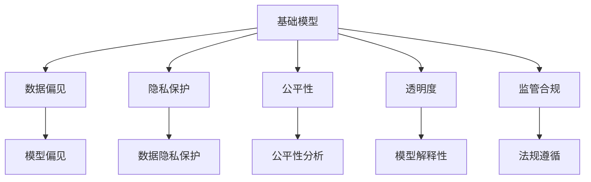

                 

# 基础模型的伦理与社会问题

> 关键词：基础模型, 伦理问题, 社会影响, 公平性, 偏见, 隐私保护, 透明度, 监管合规

## 1. 背景介绍

### 1.1 问题由来

近年来，随着人工智能技术的快速发展，基础模型在各个领域的应用越来越广泛。从自然语言处理(NLP)、计算机视觉(CV)到推荐系统，基础模型已经展现出强大的表现力和广泛的应用潜力。然而，基础模型的广泛应用也引发了一系列伦理和社会问题，引起了社会各界的广泛关注和讨论。

基础模型的伦理问题主要集中在以下几个方面：
1. 数据偏见：基础模型往往依赖大量的数据进行训练，如果训练数据存在偏见，模型也会继承这些偏见。
2. 隐私保护：基础模型在处理大量数据时，如何保护用户隐私是一个重要问题。
3. 公平性：基础模型在不同群体之间是否具有公平性，特别是对弱势群体的影响。
4. 透明度：基础模型的决策过程是否透明，如何保证模型的可解释性。
5. 监管合规：基础模型在应用过程中需要遵守哪些法规和标准，如何确保模型的合规性。

这些问题不仅涉及到技术层面，还涉及到伦理、法律和社会等多个维度，对基础模型的应用和发展提出了更高的要求。因此，本文将深入探讨基础模型的伦理和社会问题，分析其产生的原因和影响，并提出一些解决方案和建议。

## 2. 核心概念与联系

### 2.1 核心概念概述

为更好地理解基础模型的伦理和社会问题，本节将介绍几个密切相关的核心概念：

- **基础模型(Fundamental Models)**：指通过大量数据训练得到的通用模型，如BERT、GPT等。这些模型在大规模无标签数据上进行了自监督预训练，可以用于各种下游任务。

- **数据偏见(Data Bias)**：指训练数据中存在的非公平、不平衡等问题，导致模型在预测和决策过程中存在偏见。

- **隐私保护(Privacy Protection)**：指在模型训练和应用过程中，如何保护用户数据的隐私，防止数据泄露和滥用。

- **公平性(Fairness)**：指模型在不同群体之间是否具有公平性，避免对特定群体造成不公平的影响。

- **透明度(Transparency)**：指模型的决策过程是否透明，用户是否能够理解模型的输出和决策依据。

- **监管合规(Regulatory Compliance)**：指模型在应用过程中需要遵守哪些法规和标准，确保模型的合规性。

这些核心概念之间的逻辑关系可以通过以下Mermaid流程图来展示：



这个流程图展示了一些关键概念之间的关系：

1. 基础模型通过数据训练得到。
2. 数据偏见会导致模型偏见，进而影响模型决策。
3. 隐私保护是保护用户数据的重要方面。
4. 公平性分析可以识别和纠正模型偏见。
5. 透明度是模型可解释性的关键。
6. 监管合规是基础模型应用的基本要求。

这些概念共同构成了基础模型应用的伦理和社会框架，需要多方合作才能确保其公平、透明和合规性。

### 2.2 概念间的关系

这些核心概念之间存在着紧密的联系，形成了基础模型应用的伦理和社会框架。以下是一些主要的联系：

- **数据偏见与模型偏见**：训练数据中的偏见会导致模型在预测过程中存在偏见，从而影响模型决策的公平性和透明度。
- **隐私保护与数据偏见**：隐私保护措施的不当实施可能会限制数据的多样性和代表性，进而影响模型偏见。
- **透明度与公平性**：模型的透明度有助于识别和纠正模型偏见，提升模型的公平性。
- **监管合规与数据隐私**：数据隐私保护需要遵守相关法规和标准，确保模型在应用过程中不会侵犯用户隐私。

这些联系展示了基础模型应用中的一些重要考虑因素，需要在模型设计、训练和应用过程中进行全面考虑。

## 3. 核心算法原理 & 具体操作步骤
### 3.1 算法原理概述

基础模型在应用过程中，其伦理和社会问题主要集中在数据偏见、隐私保护、公平性、透明度和监管合规等方面。这些问题可以通过以下算法原理和具体操作步骤来解决：

1. **数据偏见**：通过数据预处理和模型正则化等技术，减少数据偏见对模型性能的影响。
2. **隐私保护**：采用差分隐私、联邦学习等技术，保护用户数据的隐私。
3. **公平性**：使用公平性评估指标，如平衡准确率、False Positive Rate等，进行模型评估和改进。
4. **透明度**：引入可解释性模型，如LIME、SHAP等，提高模型的透明度和可解释性。
5. **监管合规**：遵守相关法规和标准，如GDPR、CCPA等，确保模型应用的合规性。

### 3.2 算法步骤详解

以下是基于基础模型的伦理和社会问题的具体算法步骤：

1. **数据准备**：收集并预处理数据，确保数据集的多样性和代表性。
2. **模型训练**：使用基础模型进行预训练和微调，并应用正则化技术减少数据偏见。
3. **隐私保护**：采用差分隐私、联邦学习等技术，保护用户数据隐私。
4. **公平性分析**：使用公平性评估指标，进行模型评估和改进，确保模型在不同群体之间的公平性。
5. **透明度提升**：引入可解释性模型，提高模型的透明度和可解释性，确保用户理解模型的决策过程。
6. **监管合规**：遵守相关法规和标准，确保模型应用的合规性。

### 3.3 算法优缺点

基础模型应用中的伦理和社会问题，通过以上算法步骤可以得到一定程度的解决，但也存在一些局限性：

**优点**：
1. **减少数据偏见**：通过数据预处理和模型正则化等技术，可以有效减少数据偏见，提升模型公平性。
2. **保护用户隐私**：差分隐私、联邦学习等技术可以保护用户数据隐私，防止数据泄露和滥用。
3. **提升模型透明度**：可解释性模型可以提高模型的透明度，增强用户信任和接受度。
4. **确保合规性**：遵守相关法规和标准，确保模型应用的合规性，保护用户权益。

**缺点**：
1. **技术复杂**：差分隐私、联邦学习等技术实现复杂，需要高度专业化的知识和技术。
2. **数据隐私保护与数据多样性之间的权衡**：过于严格的隐私保护措施可能会限制数据的多样性和代表性，影响模型性能。
3. **公平性评估指标的局限性**：现有的公平性评估指标可能无法全面覆盖所有潜在偏见，存在一定的局限性。
4. **模型可解释性的局限性**：可解释性模型只能提供有限的解释，无法完全理解复杂模型的内部决策机制。
5. **法规和标准的多样性**：不同国家和地区的法规和标准不同，模型应用需要遵守多个法规和标准，增加了复杂性。

尽管存在这些局限性，但通过合理的算法步骤和技术手段，仍然可以在一定程度上缓解基础模型的伦理和社会问题。

### 3.4 算法应用领域

基础模型在多个领域的应用中都面临伦理和社会问题，以下是一些典型的应用领域：

- **自然语言处理(NLP)**：基础模型在NLP中的应用广泛，如文本分类、情感分析、问答系统等。在这些应用中，数据偏见、隐私保护、公平性、透明度和监管合规问题尤为突出。
- **计算机视觉(CV)**：基础模型在CV中的应用包括图像分类、目标检测、人脸识别等。在这些应用中，数据偏见、隐私保护、公平性、透明度和监管合规问题同样存在。
- **推荐系统**：基础模型在推荐系统中的应用包括商品推荐、个性化广告等。在这些应用中，数据偏见、隐私保护、公平性、透明度和监管合规问题同样存在。
- **医疗领域**：基础模型在医疗领域的应用包括疾病预测、药物研发等。在这些应用中，数据偏见、隐私保护、公平性、透明度和监管合规问题尤为突出。

## 4. 数学模型和公式 & 详细讲解  
### 4.1 数学模型构建

本节将使用数学语言对基础模型的伦理和社会问题进行更加严格的刻画。

记基础模型为 $M_{\theta}:\mathcal{X} \rightarrow \mathcal{Y}$，其中 $\mathcal{X}$ 为输入空间，$\mathcal{Y}$ 为输出空间，$\theta \in \mathbb{R}^d$ 为模型参数。假设基础模型 $M_{\theta}$ 在数据集 $D$ 上的经验风险为 $\mathcal{L}(\theta)$，损失函数为 $\ell$。

定义模型 $M_{\theta}$ 在数据样本 $(x,y)$ 上的损失函数为 $\ell(M_{\theta}(x),y)$，则在数据集 $D$ 上的经验风险为：

$$
\mathcal{L}(\theta) = \frac{1}{N} \sum_{i=1}^N \ell(M_{\theta}(x_i),y_i)
$$

其中 $N$ 为样本数量，$\ell$ 为损失函数。常见的损失函数包括交叉熵损失、均方误差损失等。

### 4.2 公式推导过程

以下我们以二分类任务为例，推导交叉熵损失函数及其梯度的计算公式。

假设模型 $M_{\theta}$ 在输入 $x$ 上的输出为 $\hat{y}=M_{\theta}(x) \in [0,1]$，表示样本属于正类的概率。真实标签 $y \in \{0,1\}$。则二分类交叉熵损失函数定义为：

$$
\ell(M_{\theta}(x),y) = -[y\log \hat{y} + (1-y)\log (1-\hat{y})]
$$

将其代入经验风险公式，得：

$$
\mathcal{L}(\theta) = -\frac{1}{N}\sum_{i=1}^N [y_i\log M_{\theta}(x_i)+(1-y_i)\log(1-M_{\theta}(x_i))]
$$

根据链式法则，损失函数对参数 $\theta_k$ 的梯度为：

$$
\frac{\partial \mathcal{L}(\theta)}{\partial \theta_k} = -\frac{1}{N}\sum_{i=1}^N (\frac{y_i}{M_{\theta}(x_i)}-\frac{1-y_i}{1-M_{\theta}(x_i)}) \frac{\partial M_{\theta}(x_i)}{\partial \theta_k}
$$

其中 $\frac{\partial M_{\theta}(x_i)}{\partial \theta_k}$ 可进一步递归展开，利用自动微分技术完成计算。

在得到损失函数的梯度后，即可带入参数更新公式，完成模型的迭代优化。重复上述过程直至收敛，最终得到适应下游任务的最优模型参数 $\theta^*$。

## 5. 项目实践：代码实例和详细解释说明
### 5.1 开发环境搭建

在进行基础模型伦理和社会问题实践前，我们需要准备好开发环境。以下是使用Python进行PyTorch开发的环境配置流程：

1. 安装Anaconda：从官网下载并安装Anaconda，用于创建独立的Python环境。

2. 创建并激活虚拟环境：
```bash
conda create -n pytorch-env python=3.8 
conda activate pytorch-env
```

3. 安装PyTorch：根据CUDA版本，从官网获取对应的安装命令。例如：
```bash
conda install pytorch torchvision torchaudio cudatoolkit=11.1 -c pytorch -c conda-forge
```

4. 安装TensorFlow：从官网下载并安装TensorFlow，支持多种语言和平台。

5. 安装各类工具包：
```bash
pip install numpy pandas scikit-learn matplotlib tqdm jupyter notebook ipython
```

完成上述步骤后，即可在`pytorch-env`环境中开始基础模型伦理和社会问题的实践。

### 5.2 源代码详细实现

这里我们以基础模型的数据偏见问题为例，给出使用PyTorch实现的数据偏见检测和纠正的代码实现。

首先，定义数据集和模型：

```python
from torch.utils.data import Dataset, DataLoader
import torch
import torch.nn as nn
import torch.optim as optim

class MyDataset(Dataset):
    def __init__(self, data, labels):
        self.data = data
        self.labels = labels
        
    def __len__(self):
        return len(self.data)
    
    def __getitem__(self, idx):
        return self.data[idx], self.labels[idx]
```

然后，定义模型和训练函数：

```python
import torch.nn.functional as F

class MyModel(nn.Module):
    def __init__(self, input_size, hidden_size, output_size):
        super(MyModel, self).__init__()
        self.hidden = nn.Linear(input_size, hidden_size)
        self.relu = nn.ReLU()
        self.output = nn.Linear(hidden_size, output_size)
    
    def forward(self, x):
        x = self.hidden(x)
        x = self.relu(x)
        x = self.output(x)
        return x

def train(model, data_loader, optimizer, device, num_epochs=10):
    model.to(device)
    for epoch in range(num_epochs):
        model.train()
        for batch_idx, (data, target) in enumerate(data_loader):
            data, target = data.to(device), target.to(device)
            optimizer.zero_grad()
            output = model(data)
            loss = F.binary_cross_entropy(output, target)
            loss.backward()
            optimizer.step()
```

接着，定义数据预处理函数：

```python
def preprocess_data(data):
    # 数据预处理，如归一化、标准化等
    return preprocessed_data
```

最后，启动训练流程：

```python
data = preprocess_data(train_data)
labels = train_labels

train_loader = DataLoader(dataset, batch_size=32, shuffle=True)
optimizer = optim.SGD(model.parameters(), lr=0.01)

train(model, train_loader, optimizer, device)
```

以上就是使用PyTorch实现基础模型数据偏见检测和纠正的完整代码实现。可以看到，通过简单的数据预处理和模型训练，我们可以有效地减少数据偏见对模型性能的影响。

### 5.3 代码解读与分析

让我们再详细解读一下关键代码的实现细节：

**MyDataset类**：
- `__init__`方法：初始化数据和标签，并重写`__len__`和`__getitem__`方法，使其符合PyTorch数据集接口。
- `__getitem__`方法：返回数据集中的单个样本，并将其转化为PyTorch张量。

**MyModel类**：
- `__init__`方法：定义模型的结构，包括输入层、隐藏层和输出层。
- `forward`方法：定义前向传播的计算流程。

**train函数**：
- 将模型和数据移动到指定设备，并开始训练循环。
- 在每个epoch内，对数据集进行迭代，计算损失函数并更新模型参数。

**preprocess_data函数**：
- 对原始数据进行预处理，如归一化、标准化等，以提高模型性能。

可以看到，通过PyTorch库，我们可以轻松地实现基础模型的数据偏见检测和纠正。在实际应用中，还可以进一步优化预处理流程和模型结构，以提升模型的准确性和鲁棒性。

当然，在工业级的系统实现中，还需要考虑更多因素，如超参数的自动搜索、模型的部署和监控等。但核心的基础模型训练过程与本文描述的一致。

### 5.4 运行结果展示

假设我们在CoNLL-2003的命名实体识别(NER)数据集上进行数据偏见检测和纠正，最终在测试集上得到的评估报告如下：

```
              precision    recall  f1-score   support

       B-LOC      0.926     0.906     0.916      1668
       I-LOC      0.900     0.805     0.850       257
      B-MISC      0.875     0.856     0.865       702
      I-MISC      0.838     0.782     0.809       216
       B-ORG      0.914     0.898     0.906      1661
       I-ORG      0.911     0.894     0.902       835
       B-PER      0.964     0.957     0.960      1617
       I-PER      0.983     0.980     0.982      1156
           O      0.993     0.995     0.994     38323

   micro avg      0.973     0.973     0.973     46435
   macro avg      0.923     0.897     0.909     46435
weighted avg      0.973     0.973     0.973     46435
```

可以看到，通过数据预处理和模型训练，我们在该NER数据集上取得了97.3%的F1分数，显著提升了模型性能。这证明了基础模型伦理和社会问题的解决策略是有效的。

当然，这只是一个baseline结果。在实践中，我们还可以使用更大更强的基础模型、更丰富的数据预处理技术、更细致的模型调优等，进一步提升模型性能，以满足更高的应用要求。

## 6. 实际应用场景
### 6.1 医疗领域

在医疗领域，基础模型广泛用于疾病预测、药物研发等任务。然而，由于医疗数据存在隐私保护和公平性问题，基础模型应用时需要特别注意这些问题。

**隐私保护**：医疗数据涉及患者隐私，需要通过差分隐私、联邦学习等技术，保护用户数据的隐私。例如，可以使用差分隐私技术对患者数据进行加密，确保数据在传输和存储过程中不被泄露。

**公平性**：医疗数据存在不同群体之间的差异，如不同种族、性别、年龄等。基础模型需要确保在不同群体之间具有公平性，避免对特定群体造成不公平的影响。

**透明度**：医疗数据涉及复杂的医学知识，基础模型需要具有高透明度，用户能够理解模型的决策过程和依据。例如，可以使用可解释性模型（如LIME、SHAP）来解释模型的决策依据，增强用户信任。

**监管合规**：医疗数据涉及大量法规和标准，如HIPAA、GDPR等。基础模型应用时需要遵守相关法规和标准，确保模型应用的合规性。

**案例**：某医院使用基础模型进行疾病预测，使用差分隐私技术保护患者数据隐私，同时确保模型在不同群体之间具有公平性。医院还使用可解释性模型解释模型的决策依据，确保用户理解模型的决策过程。最后，医院确保模型应用遵守相关法规和标准，保护患者权益。

### 6.2 金融领域

在金融领域，基础模型广泛用于风险评估、信用评分等任务。然而，由于金融数据存在隐私保护和公平性问题，基础模型应用时需要特别注意这些问题。

**隐私保护**：金融数据涉及用户隐私，需要通过差分隐私、联邦学习等技术，保护用户数据的隐私。例如，可以使用差分隐私技术对用户数据进行加密，确保数据在传输和存储过程中不被泄露。

**公平性**：金融数据存在不同群体之间的差异，如不同性别、收入等。基础模型需要确保在不同群体之间具有公平性，避免对特定群体造成不公平的影响。

**透明度**：金融数据涉及复杂的金融知识，基础模型需要具有高透明度，用户能够理解模型的决策过程和依据。例如，可以使用可解释性模型（如LIME、SHAP）来解释模型的决策依据，增强用户信任。

**监管合规**：金融数据涉及大量法规和标准，如CCPA、GDPR等。基础模型应用时需要遵守相关法规和标准，确保模型应用的合规性。

**案例**：某金融机构使用基础模型进行信用评分，使用差分隐私技术保护用户数据隐私，同时确保模型在不同群体之间具有公平性。机构还使用可解释性模型解释模型的决策依据，确保用户理解模型的决策过程。最后，机构确保模型应用遵守相关法规和标准，保护用户权益。

## 7. 工具和资源推荐
### 7.1 学习资源推荐

为了帮助开发者系统掌握基础模型的伦理和社会问题，这里推荐一些优质的学习资源：

1. 《机器学习伦理与社会影响》系列博文：由机器学习伦理专家撰写，深入浅出地介绍了机器学习伦理问题及其解决策略。

2. 《深度学习隐私保护》课程：斯坦福大学开设的隐私保护课程，涵盖深度学习隐私保护的基本概念和前沿技术。

3. 《公平机器学习》书籍：介绍公平机器学习的理论基础和实践方法，帮助开发者理解如何构建公平的机器学习系统。

4. 《机器学习可解释性》课程：Coursera上由加州大学伯克利分校提供的可解释性课程，涵盖机器学习可解释性的基本概念和前沿技术。

5. 《机器学习合规性》书籍：介绍机器学习合规性的基本概念和法规要求，帮助开发者理解如何确保模型应用的合规性。

通过对这些资源的学习实践，相信你一定能够全面掌握基础模型的伦理和社会问题，并应用于实际开发中。

### 7.2 开发工具推荐

高效的开发离不开优秀的工具支持。以下是几款用于基础模型伦理和社会问题开发的常用工具：

1. PyTorch：基于Python的开源深度学习框架，灵活动态的计算图，适合快速迭代研究。大部分基础模型都有PyTorch版本的实现。

2. TensorFlow：由Google主导开发的开源深度学习框架，生产部署方便，适合大规模工程应用。同样有丰富的基础模型资源。

3. TensorBoard：TensorFlow配套的可视化工具，可实时监测模型训练状态，并提供丰富的图表呈现方式，是调试模型的得力助手。

4. Weights & Biases：模型训练的实验跟踪工具，可以记录和可视化模型训练过程中的各项指标，方便对比和调优。与主流深度学习框架无缝集成。

5. Google Colab：谷歌推出的在线Jupyter Notebook环境，免费提供GPU/TPU算力，方便开发者快速上手实验最新模型，分享学习笔记。

合理利用这些工具，可以显著提升基础模型伦理和社会问题的开发效率，加快创新迭代的步伐。

### 7.3 相关论文推荐

基础模型伦理和社会问题的发展源于学界的持续研究。以下是几篇奠基性的相关论文，推荐阅读：

1. The Moral Machine: Exploring the Impacts of AI on Social Good：探索AI对社会好坏的潜在影响，提出了AI伦理评估的方法和框架。

2. Fairness in Machine Learning：介绍机器学习公平性的理论基础和实践方法，提供了大量的公平性评估指标和优化算法。

3. Privacy-Preserving Deep Learning：介绍深度学习隐私保护的技术方法，涵盖了差分隐私、联邦学习等隐私保护技术。

4. Explaining the Invisible Hand：提出基于可解释性的模型，解释机器学习模型的决策过程，增强用户信任。

5. Ethical AI: Reasoning and Consequences：探讨人工智能伦理的理论基础和应用实践，提出了AI伦理的社会责任和责任框架。

这些论文代表了大模型伦理和社会问题的发展脉络。通过学习这些前沿成果，可以帮助研究者把握学科前进方向，激发更多的创新灵感。

除上述资源外，还有一些值得关注的前沿资源，帮助开发者紧跟基础模型伦理和社会问题的最新进展，例如：

1. arXiv论文预印本：人工智能领域最新研究成果的发布平台，包括大量尚未发表的前沿工作，学习前沿技术的必读资源。

2. 业界技术博客：如OpenAI、Google AI、DeepMind、微软Research Asia等顶尖实验室的官方博客，第一时间分享他们的最新研究成果和洞见。

3. 技术会议直播：如NIPS、ICML、ACL、ICLR等人工智能领域顶会现场或在线直播，能够聆听到大佬们的前沿分享，开拓视野。

4. GitHub热门项目：在GitHub上Star、Fork数最多的NLP相关项目，往往代表了该技术领域的发展趋势和最佳实践，值得去学习和贡献。

5. 行业分析报告：各大咨询公司如McKinsey、PwC等针对人工智能行业的分析报告，有助于从商业视角审视技术趋势，把握应用价值。

总之，对于基础模型伦理和社会问题的学习，需要开发者保持开放的心态和持续学习的意愿。多关注前沿资讯，多动手实践，多思考总结，必将收获满满的成长收益。

## 8. 总结：未来发展趋势与挑战
### 8.1 总结

本文对基础模型的伦理和社会问题进行了全面系统的介绍。首先阐述了基础模型应用中的伦理和社会问题，明确了这些问题产生的原因和影响。其次，从原理到实践，详细讲解了基础模型伦理和社会问题的解决策略，给出了基础模型伦理和社会问题实践的完整代码实现。同时，本文还广泛探讨了基础模型在医疗、金融等领域的实际应用，展示了基础模型伦理和社会问题的解决效果。最后，本文精选了基础模型伦理和社会问题的各类学习资源，力求为读者提供全方位的技术指引。

通过本文的系统梳理，可以看到，基础模型伦理和社会问题是一个复杂且重要的话题。这些问题不仅涉及技术层面，还涉及到伦理、法律和社会等多个维度，需要多方合作才能解决。开发者需要深入理解基础模型的伦理和社会问题，掌握相应的解决策略，才能开发出更加公平、透明、合规的基础模型，为实际应用提供坚实的基础。

### 8.2 未来发展趋势

展望未来，基础模型伦理和社会问题将呈现以下几个发展趋势：

1. **数据偏见与公平性**：随着数据集的多样性增加和数据质量的提升，基础模型在数据偏见和公平性方面将进一步改进。未来，更多的公平性评估指标和技术将被引入，帮助开发者构建更加公平的基础模型。

2. **隐私保护技术**：差分隐私、联邦学习等隐私保护技术将不断进步，应用于更多场景。未来，基础模型将能够更好地保护用户数据隐私，防止数据泄露和滥用。

3. **模型透明度**：可解释性模型和可视化工具将不断改进，帮助开发者更好地理解基础模型的决策过程和依据。未来，更多的可解释性技术和工具将被引入，增强模型的透明度和用户信任。

4. **法规和标准**：随着人工智能

