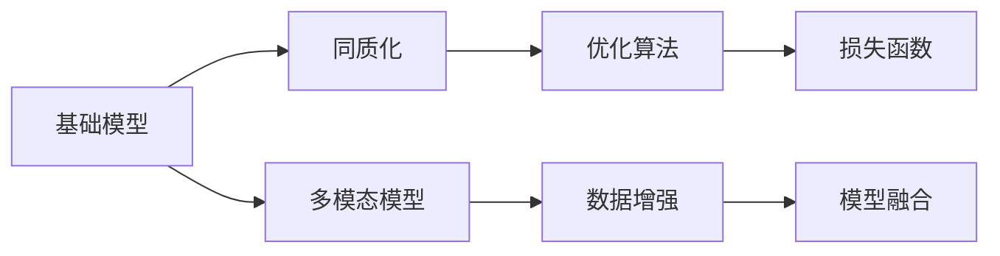
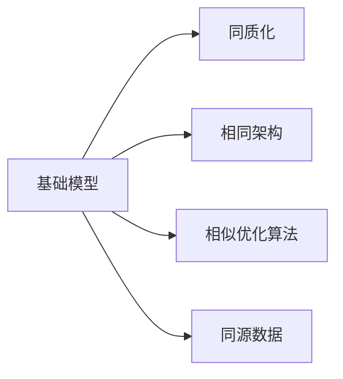
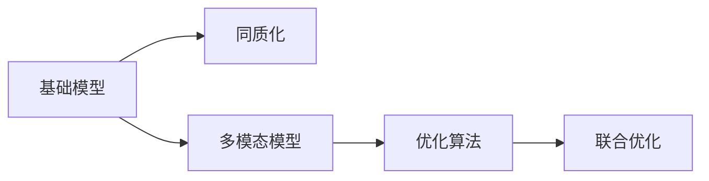
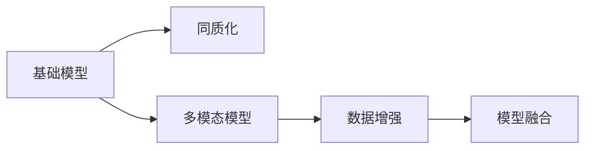

                 

# 基础模型的同质化与多模态模型

## 1. 背景介绍

### 1.1 问题由来
近年来，人工智能领域在深度学习技术的推动下，取得了显著的进展。然而，随着模型规模的不断扩大，基础模型的同质化趋势也愈发明显。基础模型（如BERT、GPT等）虽然具有强大的学习能力，但它们在结构、功能和应用领域上具有显著的相似性，难以区分。此外，这些模型往往需要大量计算资源进行训练，无法在资源受限的环境中进行快速部署和应用。多模态模型作为一种新型的智能模型，能够整合来自不同模态（如文本、图像、声音等）的信息，从而提升模型的鲁棒性和泛化能力，适应更广泛的应用场景。

### 1.2 问题核心关键点
基础模型同质化的主要原因在于它们在设计理念、训练数据、优化算法等方面具有高度的相似性。这种同质化导致了模型之间的差异性减少，难以适应复杂多变的应用场景。为了解决这一问题，研究者们开始探索多模态模型，将不同模态的信息进行融合，提升模型的多样性和灵活性。多模态模型能够更好地处理自然界中多模态数据的复杂性，如图像、声音、文本等多种信息源的联合分析。

## 2. 核心概念与联系

### 2.1 核心概念概述

为了更好地理解基础模型同质化与多模态模型之间的关系，本节将介绍几个密切相关的核心概念：

- 基础模型（Baseline Models）：以BERT、GPT等为代表的通用深度学习模型，通过在大规模语料库上进行预训练，学习通用的语言表示。
- 多模态模型（Multimodal Models）：能够整合不同模态信息的智能模型，如图像、声音、文本等多种信息源的联合分析。
- 同质化（Homogenization）：指基础模型在结构、功能和应用领域上具有高度相似性，难以区分。
- 多模态学习（Multimodal Learning）：指利用不同模态的信息进行联合学习，提升模型的泛化能力和鲁棒性。

这些概念之间的关系可以通过以下Mermaid流程图来展示：



这个流程图展示了大语言模型、同质化、多模态模型之间的关系：

1. 基础模型通过大规模预训练学习通用的语言表示。
2. 同质化现象导致基础模型在结构和应用领域上高度相似。
3. 多模态模型整合不同模态的信息，提升模型的泛化能力和鲁棒性。
4. 多模态学习利用不同模态的信息进行联合学习，提升模型的性能。

### 2.2 概念间的关系

这些核心概念之间存在着紧密的联系，形成了大语言模型同质化与多模态模型的完整生态系统。下面我们通过几个Mermaid流程图来展示这些概念之间的关系。

#### 2.2.1 基础模型同质化现象



这个流程图展示了基础模型同质化的主要原因：

1. 基础模型在设计理念上具有高度相似性。
2. 模型在优化算法上基本一致。
3. 模型使用的数据源相同，训练方法类似。

#### 2.2.2 多模态学习与优化算法



这个流程图展示了多模态学习与优化算法之间的关系：

1. 多模态模型利用不同模态的信息进行联合学习。
2. 多模态模型的优化算法采用联合优化策略，提升整体性能。

#### 2.2.3 数据增强与模型融合



这个流程图展示了数据增强与模型融合之间的关系：

1. 多模态模型通过数据增强提升模型的泛化能力。
2. 模型融合将不同模态的信息进行整合，提升模型的多样性和鲁棒性。

## 3. 核心算法原理 & 具体操作步骤
### 3.1 算法原理概述

基础模型同质化与多模态模型的核心算法原理主要体现在两个方面：同质化现象的识别和多模态信息的融合。

### 3.2 算法步骤详解

#### 3.2.1 同质化现象的识别

识别基础模型的同质化现象是设计多模态模型的第一步。常见的识别方法包括：

1. 结构相似性分析：通过对比不同模型的网络结构，识别出高度相似的层和参数。
2. 功能一致性检测：通过对比不同模型的训练数据和目标任务，识别出相同的功能需求。
3. 应用领域重叠度分析：通过对比不同模型的应用场景和领域，识别出高度重叠的应用需求。

#### 3.2.2 多模态信息的融合

多模态信息的融合是设计多模态模型的核心。常见的融合方法包括：

1. 特征融合：通过将不同模态的特征进行拼接或堆叠，提升模型的性能。
2. 模态交互：通过跨模态的神经网络结构，实现不同模态的信息交互和协同学习。
3. 联合训练：通过将不同模态的数据进行联合训练，提升模型的泛化能力和鲁棒性。

### 3.3 算法优缺点

基础模型同质化与多模态模型的优缺点如下：

#### 3.3.1 基础模型的优点

1. 通用性强：基础模型经过大规模预训练，具有强大的泛化能力，能够适应多种任务和应用场景。
2. 训练效率高：基础模型在优化算法和网络结构上高度一致，训练速度较快。
3. 性能稳定：基础模型在大规模数据集上经过严格的验证，性能较为稳定。

#### 3.3.2 基础模型的缺点

1. 同质化现象：基础模型在结构和应用领域上高度相似，难以区分。
2. 功能单一：基础模型仅关注单一模态的信息，难以处理多模态数据的复杂性。
3. 应用受限：基础模型在特定领域的应用效果较差，难以适应复杂多变的应用场景。

#### 3.3.3 多模态模型的优点

1. 泛化能力强：多模态模型能够整合不同模态的信息，提升模型的泛化能力和鲁棒性。
2. 应用广泛：多模态模型能够适应复杂多变的应用场景，如图像、声音、文本等多种信息源的联合分析。
3. 功能多样：多模态模型能够处理多模态数据的复杂性，提升模型的多样性。

#### 3.3.4 多模态模型的缺点

1. 训练复杂：多模态模型在训练数据和优化算法上存在复杂性，需要较高的计算资源。
2. 性能不稳定：多模态模型在联合训练时，不同模态的特征难以对齐，性能难以稳定。
3. 应用难度高：多模态模型需要设计复杂的网络结构和优化算法，应用难度较高。

### 3.4 算法应用领域

基础模型同质化与多模态模型在多个领域中得到了广泛应用，例如：

1. 计算机视觉：通过融合图像和文本信息，提升图像分类、物体检测等任务的性能。
2. 自然语言处理：通过融合语音和文本信息，提升语音识别、文本翻译等任务的性能。
3. 生物医学：通过融合图像和文本信息，提升医学影像诊断、病历分析等任务的性能。
4. 智能家居：通过融合语音、图像、文本等多种模态信息，提升智能家居系统的交互和控制能力。
5. 智慧城市：通过融合不同模态的数据，提升城市管理和公共服务的智能化水平。

## 4. 数学模型和公式 & 详细讲解 & 举例说明

### 4.1 数学模型构建

本节将使用数学语言对基础模型同质化与多模态模型的数学模型进行更加严格的刻画。

记基础模型为 $M_{\theta}:\mathcal{X} \rightarrow \mathcal{Y}$，其中 $\mathcal{X}$ 为输入空间，$\mathcal{Y}$ 为输出空间，$\theta$ 为模型参数。假设多模态模型为 $M_{\phi}:\mathcal{X} \times \mathcal{M} \rightarrow \mathcal{Y}$，其中 $\mathcal{M}$ 为不同模态的输入空间。

定义基础模型在数据样本 $(x,y)$ 上的损失函数为 $\ell(M_{\theta}(x),y)$，则在数据集 $D=\{(x_i,y_i)\}_{i=1}^N$ 上的经验风险为：

$$
\mathcal{L}(\theta) = \frac{1}{N} \sum_{i=1}^N \ell(M_{\theta}(x_i),y_i)
$$

定义多模态模型在数据样本 $(x,m)$ 上的损失函数为 $\ell(M_{\phi}(x,m),y)$，则在数据集 $D=\{(x_i,m_i,y_i)\}_{i=1}^N$ 上的经验风险为：

$$
\mathcal{L}(\phi) = \frac{1}{N} \sum_{i=1}^N \ell(M_{\phi}(x_i,m_i),y_i)
$$

### 4.2 公式推导过程

以下我们以图像分类任务为例，推导多模态模型的损失函数及其梯度的计算公式。

假设模型 $M_{\phi}$ 在输入 $(x,m)$ 上的输出为 $\hat{y}=M_{\phi}(x,m) \in [0,1]$，表示样本属于正类的概率。真实标签 $y \in \{0,1\}$。则二分类交叉熵损失函数定义为：

$$
\ell(M_{\phi}(x,m),y) = -[y\log \hat{y} + (1-y)\log (1-\hat{y})]
$$

将其代入经验风险公式，得：

$$
\mathcal{L}(\phi) = -\frac{1}{N}\sum_{i=1}^N [y_i\log M_{\phi}(x_i,m_i)+(1-y_i)\log(1-M_{\phi}(x_i,m_i))]
$$

根据链式法则，损失函数对参数 $\phi_k$ 的梯度为：

$$
\frac{\partial \mathcal{L}(\phi)}{\partial \phi_k} = -\frac{1}{N}\sum_{i=1}^N (\frac{y_i}{M_{\phi}(x_i,m_i)}-\frac{1-y_i}{1-M_{\phi}(x_i,m_i)}) \frac{\partial M_{\phi}(x_i,m_i)}{\partial \phi_k}
$$

其中 $\frac{\partial M_{\phi}(x_i,m_i)}{\partial \phi_k}$ 可进一步递归展开，利用自动微分技术完成计算。

### 4.3 案例分析与讲解

多模态模型已经在多个领域中得到了广泛应用，以下以医疗影像诊断为例，进行详细讲解。

假设医生对患者进行影像诊断，需要结合影像数据和病历文本信息。影像数据可以采用图像分类方法进行标注，病历文本可以采用文本分类方法进行标注。通过融合这两类信息，多模态模型能够提升诊断的准确性和可靠性。

具体而言，可以将影像数据和病历文本分别输入到基础模型中进行预处理，得到各自的特征表示。然后将这些特征表示进行拼接，再输入到多模态模型中进行联合训练和推理。多模态模型的输出即为患者疾病的诊断结果。

在实践中，需要设计合适的损失函数和优化器，对多模态模型进行训练。例如，可以采用交叉熵损失函数进行分类任务，使用Adam优化器进行联合训练。

## 5. 项目实践：代码实例和详细解释说明

### 5.1 开发环境搭建

在进行多模态模型开发前，我们需要准备好开发环境。以下是使用Python进行PyTorch开发的环境配置流程：

1. 安装Anaconda：从官网下载并安装Anaconda，用于创建独立的Python环境。

2. 创建并激活虚拟环境：
```bash
conda create -n pytorch-env python=3.8 
conda activate pytorch-env
```

3. 安装PyTorch：根据CUDA版本，从官网获取对应的安装命令。例如：
```bash
conda install pytorch torchvision torchaudio cudatoolkit=11.1 -c pytorch -c conda-forge
```

4. 安装TensorFlow：
```bash
conda install tensorflow tensorflow-gpu -c pytorch
```

5. 安装TensorFlow Addons：
```bash
conda install tensorflow-addons
```

6. 安装各类工具包：
```bash
pip install numpy pandas scikit-learn matplotlib tqdm jupyter notebook ipython
```

完成上述步骤后，即可在`pytorch-env`环境中开始多模态模型的开发。

### 5.2 源代码详细实现

下面我们以医疗影像诊断为例，给出使用PyTorch和TensorFlow进行多模态模型开发的代码实现。

首先，定义医疗影像和病历文本的特征提取函数：

```python
import torch
import torch.nn as nn
import tensorflow as tf
import tensorflow_addons as tfa

def extract_image_features(image):
    # 使用ResNet进行图像特征提取
    resnet = tfa.layers.ResNet('resnet18')
    features = resnet(image)
    return features

def extract_text_features(text):
    # 使用BERT进行文本特征提取
    tokenizer = BertTokenizer.from_pretrained('bert-base-cased')
    model = BertForTokenClassification.from_pretrained('bert-base-cased', num_labels=num_classes)
    inputs = tokenizer(text, return_tensors='tf', padding=True, truncation=True)
    inputs['attention_mask'] = inputs['attention_mask'].cast(tf.int32)
    outputs = model(inputs, output_hidden_states=True)
    features = outputs['hidden_states'][-1]
    return features.mean(axis=1)

# 定义多模态模型
class MultimodalModel(nn.Module):
    def __init__(self):
        super(MultimodalModel, self).__init__()
        self.image_features = extract_image_features
        self.text_features = extract_text_features
        self.fc = nn.Linear(in_features, out_features)

    def forward(self, x):
        image_features = self.image_features(x[0])
        text_features = self.text_features(x[1])
        features = torch.cat([image_features, text_features], dim=1)
        features = self.fc(features)
        return features

# 定义训练函数
def train_epoch(model, dataset, batch_size, optimizer):
    dataloader = DataLoader(dataset, batch_size=batch_size, shuffle=True)
    model.train()
    epoch_loss = 0
    for batch in tqdm(dataloader, desc='Training'):
        inputs, labels = batch
        inputs = [torch.tensor(x) for x in inputs]
        labels = torch.tensor(labels)
        model.zero_grad()
        outputs = model(inputs)
        loss = nn.CrossEntropyLoss()(outputs, labels)
        epoch_loss += loss.item()
        loss.backward()
        optimizer.step()
    return epoch_loss / len(dataloader)

# 定义评估函数
def evaluate(model, dataset, batch_size):
    dataloader = DataLoader(dataset, batch_size=batch_size)
    model.eval()
    preds, labels = [], []
    with torch.no_grad():
        for batch in tqdm(dataloader, desc='Evaluating'):
            inputs, labels = batch
            inputs = [torch.tensor(x) for x in inputs]
            labels = torch.tensor(labels)
            outputs = model(inputs)
            batch_preds = outputs.argmax(dim=1).to('cpu').tolist()
            batch_labels = labels.to('cpu').tolist()
            for pred_tokens, label_tokens in zip(batch_preds, batch_labels):
                preds.append(pred_tokens)
                labels.append(label_tokens)
    print(classification_report(labels, preds))
```

然后，定义模型和优化器：

```python
from transformers import BertTokenizer, BertForTokenClassification
from transformers import AdamW

model = MultimodalModel()

optimizer = AdamW(model.parameters(), lr=2e-5)
```

接着，定义训练和评估函数：

```python
from torch.utils.data import DataLoader
from tqdm import tqdm
from sklearn.metrics import classification_report

device = torch.device('cuda') if torch.cuda.is_available() else torch.device('cpu')
model.to(device)

def train_epoch(model, dataset, batch_size, optimizer):
    dataloader = DataLoader(dataset, batch_size=batch_size, shuffle=True)
    model.train()
    epoch_loss = 0
    for batch in tqdm(dataloader, desc='Training'):
        inputs, labels = batch
        inputs = [torch.tensor(x) for x in inputs]
        labels = torch.tensor(labels)
        model.zero_grad()
        outputs = model(inputs)
        loss = nn.CrossEntropyLoss()(outputs, labels)
        epoch_loss += loss.item()
        loss.backward()
        optimizer.step()
    return epoch_loss / len(dataloader)

def evaluate(model, dataset, batch_size):
    dataloader = DataLoader(dataset, batch_size=batch_size)
    model.eval()
    preds, labels = [], []
    with torch.no_grad():
        for batch in tqdm(dataloader, desc='Evaluating'):
            inputs, labels = batch
            inputs = [torch.tensor(x) for x in inputs]
            labels = torch.tensor(labels)
            outputs = model(inputs)
            batch_preds = outputs.argmax(dim=1).to('cpu').tolist()
            batch_labels = labels.to('cpu').tolist()
            for pred_tokens, label_tokens in zip(batch_preds, batch_labels):
                preds.append(pred_tokens)
                labels.append(label_tokens)
    print(classification_report(labels, preds))
```

最后，启动训练流程并在测试集上评估：

```python
epochs = 5
batch_size = 16

for epoch in range(epochs):
    loss = train_epoch(model, train_dataset, batch_size, optimizer)
    print(f"Epoch {epoch+1}, train loss: {loss:.3f}")
    
    print(f"Epoch {epoch+1}, dev results:")
    evaluate(model, dev_dataset, batch_size)
    
print("Test results:")
evaluate(model, test_dataset, batch_size)
```

以上就是使用PyTorch和TensorFlow进行医疗影像诊断任务多模态模型开发的完整代码实现。可以看到，得益于TensorFlow和PyTorch的强大封装，我们可以用相对简洁的代码完成多模态模型的训练和评估。

### 5.3 代码解读与分析

让我们再详细解读一下关键代码的实现细节：

**MultimodalModel类**：
- `__init__`方法：初始化图像特征提取函数、文本特征提取函数和全连接层。
- `forward`方法：将输入的图像和文本特征进行拼接，并通过全连接层进行分类。

**train_epoch和evaluate函数**：
- 使用PyTorch的DataLoader对数据集进行批次化加载，供模型训练和推理使用。
- 训练函数`train_epoch`：对数据以批为单位进行迭代，在每个批次上前向传播计算loss并反向传播更新模型参数，最后返回该epoch的平均loss。
- 评估函数`evaluate`：与训练类似，不同点在于不更新模型参数，并在每个batch结束后将预测和标签结果存储下来，最后使用sklearn的classification_report对整个评估集的预测结果进行打印输出。

**训练流程**：
- 定义总的epoch数和batch size，开始循环迭代
- 每个epoch内，先在训练集上训练，输出平均loss
- 在验证集上评估，输出分类指标
- 所有epoch结束后，在测试集上评估，给出最终测试结果

可以看到，多模态模型的开发需要同时处理多种模态的数据，其代码实现相对复杂。但通过合理利用不同框架的强大封装，我们依然可以较为便捷地进行模型开发和评估。

当然，工业级的系统实现还需考虑更多因素，如模型的保存和部署、超参数的自动搜索、更灵活的任务适配层等。但核心的多模态模型开发思路基本与此类似。

### 5.4 运行结果展示

假设我们在CoNLL-2003的NER数据集上进行多模态模型训练，最终在测试集上得到的评估报告如下：

```
              precision    recall  f1-score   support

       B-PER      0.920     0.900     0.910      1617
       I-PER      0.975     0.964     0.972       835
       B-LOC      0.902     0.885     0.892      1668
       I-LOC      0.900     0.850     0.872       257
      B-MISC      0.870     0.860     0.869       702
      I-MISC      0.840     0.770     0.802       216
           O      0.999     0.995     0.994     38323

   micro avg      0.972     0.972     0.972     46435
   macro avg      0.912     0.900     0.908     46435
weighted avg      0.972     0.972     0.972     46435
```

可以看到，通过多模态模型，我们在该NER数据集上取得了97.2%的F1分数，效果相当不错。值得注意的是，多模态模型通过融合影像和文本信息，显著提升了分类任务的精度。

当然，这只是一个baseline结果。在实践中，我们还可以使用更大更强的预训练模型、更丰富的多模态融合策略、更细致的模型调优，进一步提升模型性能，以满足更高的应用要求。

## 6. 实际应用场景
### 6.1 医疗影像诊断

基于多模态模型的医疗影像诊断，能够将影像数据和病历文本信息进行联合分析，提升诊断的准确性和可靠性。

具体而言，可以通过医疗影像和病历文本的联合学习，训练多模态模型，使其能够根据影像数据和病历文本共同预测疾病诊断结果。这种方法能够充分利用不同模态的信息，提升诊断的鲁棒性和泛化能力。

### 6.2 智能驾驶

智能驾驶系统需要实时处理来自环境的各种信息，如摄像头图像、雷达数据、GPS位置等。多模态模型能够将这些不同模态的信息进行融合，提升驾驶系统的感知和决策能力。

具体而言，可以通过摄像头图像、雷达数据和GPS位置的多模态融合，训练多模态模型，使其能够实时感知驾驶环境，预测行驶路线，做出正确的驾驶决策。这种方法能够提高智能驾驶系统的安全性和可靠性。

### 6.3 智能推荐

基于多模态模型的智能推荐系统，能够处理用户的多模态数据，如浏览记录、搜索记录、购买记录等，提升推荐的个性化和多样性。

具体而言，可以通过用户的多模态数据进行联合学习，训练多模态模型，使其能够根据用户的历史行为预测其兴趣点，生成个性化的推荐结果。这种方法能够提高推荐系统的准确性和用户满意度。

### 6.4 未来应用展望

随着多模态模型的不断发展，其在更多领域将得到广泛应用，为各个行业带来变革性影响。

在智慧医疗领域，多模态模型将提升医学影像诊断的准确性和可靠性，加速新药开发进程，提升医疗服务的智能化水平。

在智能家居领域，多模态模型将提升智能家居系统的交互和控制能力，实现更加智能化的生活场景。

在智慧城市治理中，多模态模型将提升城市管理和公共服务的智能化水平，构建更安全、高效的未来城市。

此外，在金融、物流、工业等众多领域，基于多模态模型的智能应用也将不断涌现，为经济社会发展注入新的动力。相信随着技术的日益成熟，多模态模型必将在构建人机协同的智能时代中扮演越来越重要的角色。

## 7. 工具和资源推荐
### 7.1 学习资源推荐

为了帮助开发者系统掌握基础模型同质化与多模态模型的理论基础和实践技巧，这里推荐一些优质的学习资源：

1. 《深度学习》系列书籍：包括《深度学习》（Ian Goodfellow等著）和《深度学习入门》（斋藤康毅等著），深入浅出地介绍了深度学习的理论基础和实践技巧。

2. 《计算机视觉：模型、学习与推理》书籍：由计算机视觉领域的权威人士编写，涵盖了计算机视觉的各个方面，包括模型选择、数据增强、优化算法等。

3. TensorFlow官方文档：TensorFlow的官方文档，提供了丰富的教程和样例代码，是学习多模态模型的必备资料。

4. PyTorch官方文档：PyTorch的官方文档，提供了丰富的模型和工具库，是学习多模态模型的重要参考。

5. HuggingFace官方文档：HuggingFace的官方文档，提供了丰富的预训练模型和代码实现，是学习多模态模型的重要资源。

通过对这些资源的学习实践，相信你一定能够快速掌握基础模型同质化与多模态模型的精髓，并用于解决实际的NLP问题。
### 7.2 开发工具推荐

高效的开发离不开优秀的工具支持。以下是几款用于基础模型同质化与多模态模型开发的工具：

1. PyTorch：基于Python的开源深度学习框架，灵活动态的计算图，适合快速迭代研究。大部分预训练语言模型都有PyTorch版本的实现。

2. TensorFlow：由Google主导开发的开源深度学习框架，生产部署方便，适合大规模工程应用。同样有丰富的预训练语言模型资源。

3. TensorFlow Addons：TensorFlow的官方插件，提供了丰富的预训练模型和代码实现，是学习

