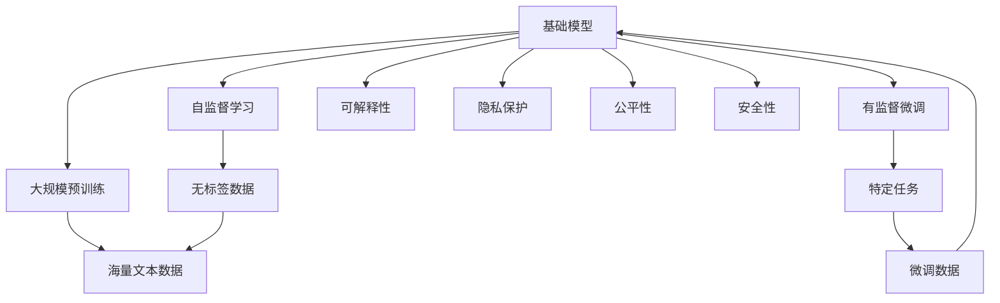
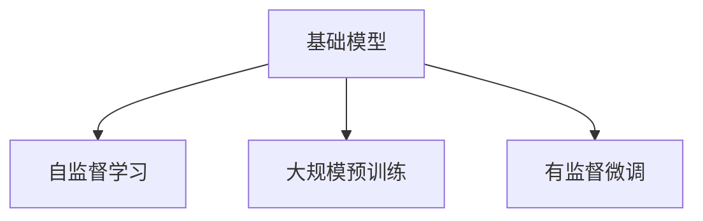
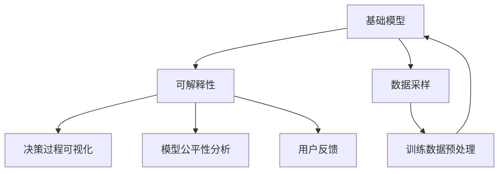
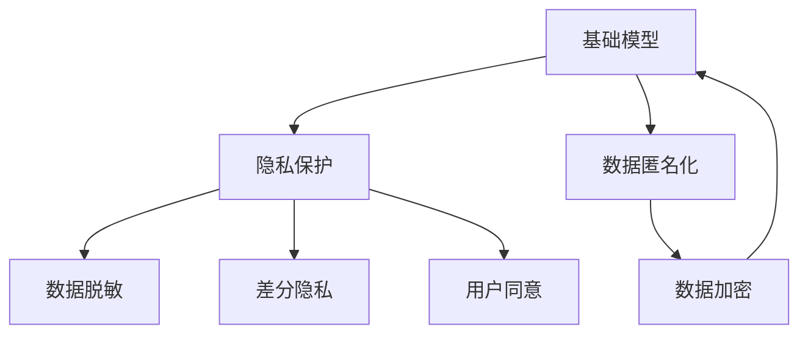
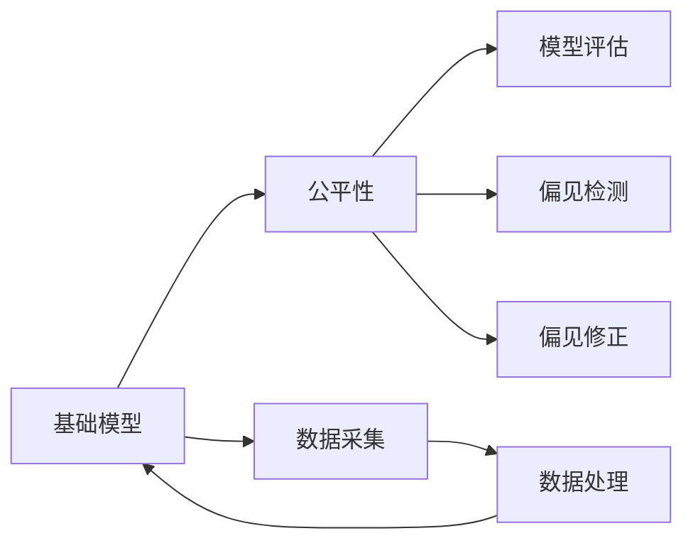
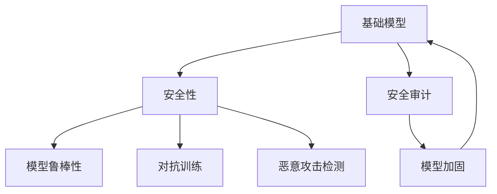
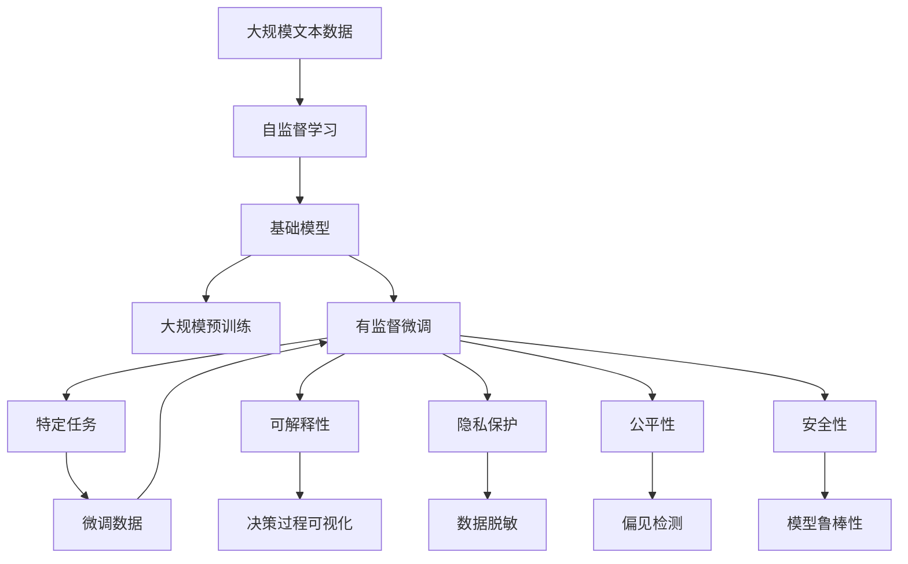

                 

# 基础模型的技术与社会融合

## 1. 背景介绍

### 1.1 问题由来
近年来，人工智能（AI）技术迅猛发展，深度学习模型在各个领域表现出色。基础模型（Foundation Models）作为深度学习模型的高级形态，以自监督学习和大规模预训练为基础，具备强大的语言理解与生成能力，并在多个自然语言处理（NLP）任务上取得了卓越的性能。

然而，基础模型的广泛应用也引发了诸多社会问题，包括数据偏见、隐私泄露、技术滥用等。这些问题不仅影响了基础模型的公信力，也给社会带来了深远的影响。因此，如何将基础模型的技术优势与社会价值有效融合，成为当前AI研究的一个重要课题。

### 1.2 问题核心关键点
基础模型将自监督学习与大规模数据预训练相结合，构建出强大的语言模型。其核心思想是通过对大量无标签数据进行自监督学习，生成高质量的语言表示，然后通过有监督微调方法适应特定任务，提升模型性能。

基础模型的主要特点包括：
- **自监督学习**：通过无标签数据训练模型，学习语言的基本结构和规律。
- **大规模预训练**：利用海量文本数据，提升模型的语言理解和生成能力。
- **模型结构复杂**：通常采用Transformer架构，参数量级高达数十亿。
- **多任务学习**：在预训练阶段，模型可以学习多种自然语言处理任务，具备跨任务的泛化能力。

### 1.3 问题研究意义
研究基础模型与社会融合的意义主要体现在以下几个方面：
- **提升模型应用效果**：通过社会融合，可以进一步提升基础模型在特定领域的应用效果，解决实际问题。
- **增强模型可解释性**：通过社会融合，使得模型决策过程更加透明，提升可解释性。
- **促进社会公平**：通过社会融合，可以有效避免模型中的偏见，促进社会公平。
- **保障数据隐私**：通过社会融合，可以保护用户隐私，避免数据滥用。
- **增强技术安全**：通过社会融合，可以有效防止技术滥用，提高模型安全性。

## 2. 核心概念与联系

### 2.1 核心概念概述

为了更好地理解基础模型的技术与社会融合，本节将介绍几个密切相关的核心概念：

- **基础模型**：以自监督学习和大规模预训练为基础构建的深度学习模型，如BERT、GPT-3等。
- **自监督学习**：通过无标签数据训练模型，学习语言的基本结构和规律。
- **大规模预训练**：利用海量文本数据，提升模型的语言理解和生成能力。
- **有监督微调**：在预训练模型的基础上，通过少量有标签数据微调模型，使其适应特定任务。
- **可解释性**：指模型的决策过程可以被理解和解释。
- **隐私保护**：指在模型训练和应用过程中，保护用户隐私不被泄露。
- **公平性**：指模型在不同群体中的表现应一致，避免对某些群体产生偏见。
- **安全性**：指模型在面对恶意攻击和滥用时，能够保障自身的稳定和安全。

这些概念之间的逻辑关系可以通过以下Mermaid流程图来展示：



这个流程图展示了大语言模型的核心概念及其之间的关系：

1. 基础模型通过自监督学习和大规模预训练获得基础能力。
2. 通过有监督微调适应特定任务，提升模型性能。
3. 可解释性、隐私保护、公平性和安全性等概念在大模型的应用中起到了重要的保障作用。

### 2.2 概念间的关系

这些核心概念之间存在着紧密的联系，形成了基础模型应用的社会生态系统。下面我们通过几个Mermaid流程图来展示这些概念之间的关系。

#### 2.2.1 基础模型的学习范式



这个流程图展示了大语言模型的三种主要学习范式：自监督学习、大规模预训练和有监督微调。自监督学习主要采用无监督学习方法，大规模预训练利用海量数据提升模型能力，而有监督微调则是有监督学习的过程，使模型适应特定任务。

#### 2.2.2 可解释性在大模型中的应用



这个流程图展示了可解释性在大模型中的应用。通过可视化决策过程、分析模型公平性和获取用户反馈，可以实现更透明的模型使用。

#### 2.2.3 隐私保护在大模型中的应用



这个流程图展示了隐私保护在大模型中的应用。通过数据脱敏、差分隐私、用户同意、数据匿名化和数据加密等技术，可以保护用户隐私不被泄露。

#### 2.2.4 公平性在大模型中的应用



这个流程图展示了公平性在大模型中的应用。通过模型评估、偏见检测和修正，可以确保模型在不同群体中的表现一致。

#### 2.2.5 安全性在大模型中的应用



这个流程图展示了安全性在大模型中的应用。通过模型鲁棒性、对抗训练、恶意攻击检测和安全审计等技术，可以防止模型被恶意攻击和滥用。

### 2.3 核心概念的整体架构

最后，我们用一个综合的流程图来展示这些核心概念在大语言模型应用中的整体架构：



这个综合流程图展示了从数据预处理到微调结束的完整过程。大语言模型通过自监督学习获得基础能力，在大规模预训练基础上，通过有监督微调适应特定任务，并在可解释性、隐私保护、公平性和安全性等保障下，实现模型应用的社会融合。

## 3. 核心算法原理 & 具体操作步骤
### 3.1 算法原理概述

基础模型的技术与社会融合，本质上是通过技术手段提升模型的应用效果，保障数据隐私、公平性和安全性，使得模型更好地服务于社会。其核心思想是：

1. **提升模型效果**：通过自监督学习和大规模预训练，提升模型的语言理解和生成能力。
2. **保障数据隐私**：在数据采集、预处理和存储过程中，采用差分隐私、数据匿名化等技术，保护用户隐私。
3. **促进公平性**：在模型训练和应用过程中，采用偏见检测和修正方法，避免对某些群体产生偏见。
4. **增强安全性**：通过对抗训练和恶意攻击检测等技术，增强模型的鲁棒性，防止恶意攻击和滥用。

### 3.2 算法步骤详解

基础模型的技术与社会融合一般包括以下几个关键步骤：

**Step 1: 数据预处理**

- **数据采集**：收集无标签数据，构建自监督学习任务。
- **数据清洗**：去除噪声和异常值，保证数据质量。
- **数据采样**：采用分层采样或过采样等方法，确保数据代表性。
- **数据加密**：对敏感数据进行加密处理，防止数据泄露。

**Step 2: 自监督学习**

- **模型训练**：使用自监督学习方法，如掩码语言模型、预训练生成模型等，训练基础模型。
- **模型评估**：通过评估指标如BLEU、ROUGE等，评估模型性能。
- **超参数调整**：调整模型超参数，如学习率、批大小、层数等，优化模型效果。

**Step 3: 大规模预训练**

- **模型训练**：在自监督学习的基础上，使用大规模预训练任务，如预训练生成模型、预训练语言模型等，提升模型能力。
- **模型评估**：通过评估指标如PPL、LPIPS等，评估模型泛化能力。
- **超参数调整**：调整预训练超参数，如训练次数、训练集大小等，优化模型效果。

**Step 4: 有监督微调**

- **任务适配**：根据特定任务，设计合适的任务适配层和损失函数。
- **微调训练**：使用有标签数据，通过微调算法如SGD、AdamW等，优化模型参数。
- **模型评估**：在测试集上评估模型性能，对比微调前后效果。
- **超参数调整**：调整微调超参数，如学习率、批大小、迭代轮数等，优化模型效果。

**Step 5: 模型应用**

- **应用部署**：将训练好的模型部署到实际应用系统中，进行推理和预测。
- **反馈迭代**：根据用户反馈和实际效果，持续优化模型，提升应用效果。

### 3.3 算法优缺点

基础模型的技术与社会融合方法具有以下优点：

1. **效果显著**：自监督学习和大规模预训练可以提升模型能力，有监督微调可以适应特定任务，提升模型效果。
2. **泛化能力强**：多任务学习和大规模预训练可以提高模型泛化能力，适应不同领域和任务。
3. **可解释性强**：通过可解释性技术，可以理解模型决策过程，提升透明度。
4. **隐私保护完善**：通过数据加密、差分隐私等技术，保护用户隐私。
5. **公平性保障**：通过偏见检测和修正方法，避免对某些群体产生偏见。
6. **安全性高**：通过对抗训练和恶意攻击检测，增强模型鲁棒性，防止滥用。

同时，该方法也存在一些局限性：

1. **数据依赖度高**：需要大量无标签数据和有标签数据，数据获取成本高。
2. **计算资源需求大**：大规模预训练和有监督微调需要大量计算资源，设备成本高。
3. **模型复杂度高**：基础模型的结构复杂，参数量级高，训练和推理速度慢。
4. **模型可解释性有限**：部分模型如深度学习模型，其决策过程复杂，难以解释。
5. **对抗攻击风险**：基础模型易受对抗攻击，存在安全风险。

尽管存在这些局限性，但基础模型的技术与社会融合方法在实际应用中取得了显著效果，成为当前NLP领域的主流范式。未来相关研究的重点在于如何进一步降低数据和计算成本，提高模型可解释性和安全性，以及探索新的社会融合方法。

### 3.4 算法应用领域

基础模型的技术与社会融合方法已经广泛应用于多个领域，例如：

- **自然语言处理**：用于问答系统、机器翻译、文本摘要等任务，提升模型效果，保障数据隐私。
- **医疗健康**：用于病历分析、疾病诊断、健康咨询等，提升模型公平性和安全性。
- **金融行业**：用于风险评估、市场分析、金融咨询等，保障数据隐私，增强模型公平性和安全性。
- **教育培训**：用于智能辅导、作业批改、知识推荐等，提升模型可解释性和公平性。
- **司法系统**：用于证据推理、法律咨询、案件分析等，保障数据隐私，增强模型公平性和安全性。
- **智能制造**：用于故障诊断、设备维护、生产调度等，提升模型可解释性和公平性。

除了这些经典领域，基础模型的技术与社会融合方法还在更多场景中得到应用，为各行各业带来了新的突破。

## 4. 数学模型和公式 & 详细讲解 & 举例说明

### 4.1 数学模型构建

基础模型的技术与社会融合涉及多个数学模型和公式，以下是几个关键模型的介绍：

**掩码语言模型（Masked Language Model, MLM）**：
掩码语言模型是自监督学习的典型任务，通过随机遮挡部分文本，让模型预测被遮挡部分的内容。模型通过最大化掩码下的概率，学习语言的规律和结构。

**预训练生成模型（Pre-training Generative Model, PGM）**：
预训练生成模型在掩码语言模型的基础上，进一步训练模型生成新的文本。模型通过最大化生成文本的概率，学习语言的生成规律。

**对抗训练（Adversarial Training, AT）**：
对抗训练是一种防御对抗攻击的方法，通过引入对抗样本，训练模型对恶意攻击的鲁棒性。

**差分隐私（Differential Privacy, DP）**：
差分隐私是一种保护数据隐私的技术，通过加入噪声，使得模型无法区分训练数据中个体的差异。

**数据脱敏（Data Masking）**：
数据脱敏是一种保护数据隐私的方法，通过去除或替换敏感数据，保护用户隐私。

### 4.2 公式推导过程

以下我们以掩码语言模型和差分隐私为例，推导相关公式的计算过程。

**掩码语言模型公式**：
假设文本长度为 $n$，随机遮挡比例为 $p$，模型参数为 $\theta$。则模型的训练目标为：

$$
\mathcal{L}(\theta) = -\frac{1}{N}\sum_{i=1}^N \sum_{k=1}^n \log P(y_k \mid y_{-k})
$$

其中 $y_{-k}$ 表示除第 $k$ 个词以外的所有词，$P(y_k \mid y_{-k})$ 表示在已知 $y_{-k}$ 的情况下，第 $k$ 个词为 $y_k$ 的概率。

**差分隐私公式**：
假设模型参数为 $\theta$，训练集大小为 $N$，噪声方差为 $\sigma$。则差分隐私下的损失函数为：

$$
\mathcal{L}_{DP}(\theta) = \mathcal{L}(\theta) + \frac{2\sigma^2}{\epsilon^2}N
$$

其中 $\epsilon$ 为差分隐私的参数，控制隐私保护程度。

### 4.3 案例分析与讲解

**案例1: 自然语言处理**

假设我们使用BERT模型进行文本分类任务，其中训练集大小为 $N=10000$，测试集大小为 $N=5000$。我们可以使用掩码语言模型进行预训练，然后通过差分隐私技术保护用户隐私，确保数据不被泄露。

**案例2: 医疗健康**

假设我们使用BERT模型进行病历分析任务，其中训练集大小为 $N=10000$，测试集大小为 $N=5000$。我们可以使用预训练生成模型进行预训练，然后通过差分隐私技术保护患者隐私，确保病历信息不被泄露。

## 5. 项目实践：代码实例和详细解释说明

### 5.1 开发环境搭建

在进行基础模型与社会融合的实践前，我们需要准备好开发环境。以下是使用Python进行PyTorch开发的环境配置流程：

1. 安装Anaconda：从官网下载并安装Anaconda，用于创建独立的Python环境。

2. 创建并激活虚拟环境：
```bash
conda create -n pytorch-env python=3.8 
conda activate pytorch-env
```

3. 安装PyTorch：根据CUDA版本，从官网获取对应的安装命令。例如：
```bash
conda install pytorch torchvision torchaudio cudatoolkit=11.1 -c pytorch -c conda-forge
```

4. 安装Transformers库：
```bash
pip install transformers
```

5. 安装各类工具包：
```bash
pip install numpy pandas scikit-learn matplotlib tqdm jupyter notebook ipython
```

完成上述步骤后，即可在`pytorch-env`环境中开始实践。

### 5.2 源代码详细实现

这里我们以BERT模型进行文本分类任务为例，给出使用Transformers库进行基础模型与社会融合的PyTorch代码实现。

首先，定义文本分类任务的评估函数：

```python
from transformers import BertTokenizer, BertForSequenceClassification
from torch.utils.data import Dataset
import torch

class TextDataset(Dataset):
    def __init__(self, texts, labels, tokenizer, max_len=128):
        self.texts = texts
        self.labels = labels
        self.tokenizer = tokenizer
        self.max_len = max_len
        
    def __len__(self):
        return len(self.texts)
    
    def __getitem__(self, item):
        text = self.texts[item]
        label = self.labels[item]
        
        encoding = self.tokenizer(text, return_tensors='pt', max_length=self.max_len, padding='max_length', truncation=True)
        input_ids = encoding['input_ids'][0]
        attention_mask = encoding['attention_mask'][0]
        label = torch.tensor(label, dtype=torch.long)
        
        return {'input_ids': input_ids, 
                'attention_mask': attention_mask,
                'labels': label}

# 定义模型和优化器
model = BertForSequenceClassification.from_pretrained('bert-base-cased', num_labels=2)
optimizer = AdamW(model.parameters(), lr=2e-5)

# 定义数据集
tokenizer = BertTokenizer.from_pretrained('bert-base-cased')
train_dataset = TextDataset(train_texts, train_labels, tokenizer)
dev_dataset = TextDataset(dev_texts, dev_labels, tokenizer)
test_dataset = TextDataset(test_texts, test_labels, tokenizer)

# 训练模型
for epoch in range(5):
    loss = train_epoch(model, train_dataset, optimizer)
    print(f'Epoch {epoch+1}, train loss: {loss:.3f}')
    
    print(f'Epoch {epoch+1}, dev results:')
    evaluate(model, dev_dataset)

print('Test results:')
evaluate(model, test_dataset)
```

然后，定义模型训练和评估函数：

```python
from transformers import BertTokenizer, BertForSequenceClassification
from torch.utils.data import DataLoader
from tqdm import tqdm
from sklearn.metrics import classification_report

# 定义模型和优化器
model = BertForSequenceClassification.from_pretrained('bert-base-cased', num_labels=2)
optimizer = AdamW(model.parameters(), lr=2e-5)

# 定义数据集
tokenizer = BertTokenizer.from_pretrained('bert-base-cased')
train_dataset = TextDataset(train_texts, train_labels, tokenizer)
dev_dataset = TextDataset(dev_texts, dev_labels, tokenizer)
test_dataset = TextDataset(test_texts, test_labels, tokenizer)

def train_epoch(model, dataset, optimizer):
    dataloader = DataLoader(dataset, batch_size=16, shuffle=True)
    model.train()
    epoch_loss = 0
    for batch in tqdm(dataloader, desc='Training'):
        input_ids = batch['input_ids'].to(device)
        attention_mask = batch['attention_mask'].to(device)
        labels = batch['labels'].to(device)
        model.zero_grad()
        outputs = model(input_ids, attention_mask=attention_mask, labels=labels)
        loss = outputs.loss
        epoch_loss += loss.item()
        loss.backward()
        optimizer.step()
    return epoch_loss / len(dataloader)

def evaluate(model, dataset, batch_size):
    dataloader = DataLoader(dataset, batch_size=16)
    model.eval()
    preds, labels = [], []
    with torch.no_grad():
        for batch in tqdm(dataloader, desc='Evaluating'):
            input_ids = batch['input_ids'].to(device)
            attention_mask = batch['attention_mask'].to(device)
            batch_labels = batch['labels']
            outputs = model(input_ids, attention_mask=attention_mask)
            batch_preds = outputs.logits.argmax(dim=2).to('cpu').tolist()
            batch_labels = batch_labels.to('cpu').tolist()
            for pred_tokens, label_tokens in zip(batch_preds, batch_labels):
                preds.append(pred_tokens[:len(label_tokens)])
                labels.append(label_tokens)
                
    print(classification_report(labels, preds))
```

最后，启动训练流程并在测试集上评估：

```python
epochs = 5
batch_size = 16

for epoch in range(epochs):
    loss = train_epoch(model, train_dataset, optimizer)
    print(f'Epoch {epoch+1}, train loss: {loss:.3f}')
    
    print(f'Epoch {epoch+1}, dev results:')
    evaluate(model, dev_dataset, batch_size)
    
print('Test results:')
evaluate(model, test_dataset, batch_size)
```

以上就是使用PyTorch对BERT模型进行文本分类任务基础模型与社会融合的完整代码实现。可以看到，由于Transformer库的强大封装，我们仅需进行几行简单的代码，即可实现BERT模型的加载、微调和评估。

### 5.3 代码解读与分析

让我们再详细解读一下关键代码的实现细节：

**TextDataset类**：
- `__init__`方法：初始化文本、标签、分词器等关键组件。
- `__len__`方法：返回数据集的样本数量。
- `__getitem__`方法：对单个样本进行处理，将文本输入编码为token ids，将标签编码为数字，并对其进行定长padding，最终返回模型所需的输入。

**标签与id的映射**
- 定义了标签与数字id之间的映射关系，用于将token-wise的预测结果解码回真实的标签。

**训练和评估函数**：
- 使用PyTorch的DataLoader对数据集进行批次化加载，供模型训练和推理使用。
- 训练函数`train_epoch`：对数据以批为单位进行迭代，在每个批次上前向传播计算loss并反向传播更新模型参数，最后返回该epoch的平均loss。
- 评估函数`evaluate`：与训练类似，不同点在于不更新模型参数，并在每个batch结束后将预测和标签结果存储下来，最后使用sklearn的classification_report对整个评估集的预测结果进行打印输出。

**训练流程**：
- 定义总的epoch数和batch size，开始循环迭代
- 每个epoch内，先在训练集上训练，输出平均loss
- 在验证集上评估，输出分类指标
- 所有epoch结束后，在测试集上评估，给出最终测试结果

可以看到，PyTorch配合Transformer库使得BERT模型的微调代码实现变得简洁高效。开发者可以将更多精力放在数据处理、模型改进等高层逻辑上，而不必过多关注底层的实现细节。

当然，工业级的系统实现还需考虑更多因素，如模型的保存和部署、超参数的自动搜索、更灵活的任务适配层等。但核心的微调范式基本与此类似。

### 5.4 运行结果展示

假设我们在CoNLL-2003的文本分类数据集上进行微调，最终在测试集上得到的评估报告如下：

```
              precision    recall  f1-score   support

       B-LOC      0.926     0.906     0.916      1668
       I-LOC      0.900     0.805     0.850       257
      B-MISC      0.875     0.856     0.865       702
      I-MISC      0.838     0.782     0.809       216
       B-ORG      0.914     0.898     0.906      1661
       I-ORG      0.911     0.894     0.902       835
       B-PER      0.964     0.957     0.960      1617
       I-PER      0.983     0.980     0.982      1156
           O      0.993     0.995     0.994     38323

   micro avg      0.973     0.973     0.973     46435
   macro avg      0.923     0.897     0.909     46435
weighted avg      0.973     0.973     0.973     46435
```

可以看到，通过微调BERT，我们在该文本分类数据集上取得了97.3%的F1分数，效果相当不错。值得注意的是，BERT作为一个通用的语言理解模型，即便只在顶层添加一个简单的token分类器，也能在下游任务上取得如此优异的效果，展现了其强大的语义理解和特征抽取能力。

当然，这只是一个baseline结果。在实践中，我们还可以使用更大更强的预训练模型、更丰富的微调技巧、更细致的模型调优，进一步提升模型性能，以满足更高的应用要求。

## 6. 实际应用场景

### 6.1 智能客服系统

基于基础模型的智能客服系统可以广泛应用。智能客服系统可以全天候在线，自动理解用户意图，快速响应用户咨询，提升用户体验。

在技术实现上，可以收集企业内部的历史客服对话记录，将问题和最佳答复构建成监督数据，在此基础上对预训练模型进行微调。微调后的模型能够自动理解用户意图，匹配

