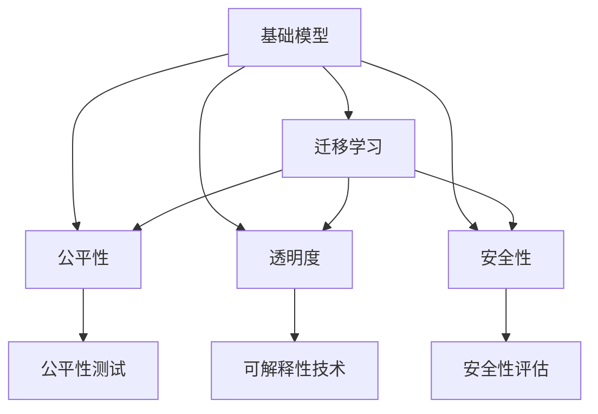

                 

# 基础模型的技术研究与社会责任

## 1. 背景介绍

### 1.1 问题由来
随着人工智能技术的迅速发展，尤其是深度学习在图像、语音、自然语言处理等领域的广泛应用，基础模型（Foundation Models）成为了新一代AI技术的核心。基础模型指的是在特定领域或任务中表现优异的大型预训练模型，例如谷歌的BERT、OpenAI的GPT、微软的T5等。这些模型通过大规模数据训练，具备了丰富的领域知识和广泛的适用性，能够在各种任务上进行微调，实现高效的迁移学习。

然而，基础模型也引发了一系列社会责任和伦理问题，例如偏见、公平性、透明性、安全性等。这些问题不仅仅是技术挑战，更是社会和伦理层面的重大课题。本文将从技术研究和社交责任两个角度出发，探讨基础模型的发展与面临的挑战，并提出相应的解决方案。

### 1.2 问题核心关键点
基础模型的研究涉及多个关键点，包括但不限于：
- **数据偏见**：预训练数据中可能包含歧视性的社会偏见，导致模型输出产生不公平的偏见。
- **透明性**：基础模型通常是一个"黑盒"系统，难以解释其决策过程，影响了公众的信任和使用。
- **公平性**：模型在处理不同群体数据时，可能会表现出不同的公平性，这与社会公正的要求相悖。
- **安全性**：基础模型可能会被恶意利用，产生误导性或有害的输出，影响社会稳定和安全。

### 1.3 问题研究意义
研究基础模型的技术和社会责任问题，对于推动AI技术的健康发展，构建公平、透明、安全的AI系统具有重要意义：
- **促进AI公平性**：确保模型在处理不同群体数据时，能够做到公平、无偏见。
- **增强模型透明性**：提升AI系统的可解释性和可理解性，增加公众信任度。
- **提升模型安全性**：避免模型被恶意利用，保护用户隐私和安全。
- **推动社会责任**：引导AI技术在伦理和法律框架下健康发展，服务社会公益。

## 2. 核心概念与联系

### 2.1 核心概念概述
为了更好地理解基础模型及其相关问题，本文将介绍几个核心概念：

- **基础模型**：通过大规模无标签数据训练得到的，具备强大表征能力的大型预训练模型。如BERT、GPT、T5等。
- **迁移学习**：利用预训练模型在特定任务上的微调，将模型知识迁移到新任务上，提升模型性能。
- **公平性**：模型在处理不同数据集时，应尽可能保证输出结果的公平性，避免对某些群体的歧视。
- **透明度**：模型应具备一定的透明性，用户和开发者能够理解和解释模型的决策过程。
- **安全性**：模型应具备一定的鲁棒性，避免被恶意利用，保护用户隐私和安全。

这些概念之间存在着紧密的联系，形成一个完整的AI技术和社会责任体系。基础模型通过迁移学习在特定任务上表现出色，但同时也会带来公平性、透明度和安全性等问题，需要在技术上和社会上进行综合考虑和解决。

### 2.2 概念间的关系

这些核心概念之间的关系可以用以下Mermaid流程图来展示：



这个流程图展示了基础模型及其相关概念的相互关系：
- 基础模型通过迁移学习在特定任务上表现出色。
- 迁移学习过程中涉及公平性、透明度和安全性问题。
- 公平性、透明度和安全性问题需要通过测试和评估技术进行解决。

## 3. 核心算法原理 & 具体操作步骤
### 3.1 算法原理概述
基础模型的迁移学习过程通常包括以下步骤：
1. **预训练**：在大规模无标签数据上训练基础模型，学习通用的语言表示。
2. **微调**：在特定任务的标注数据上对基础模型进行微调，使其适应新任务。
3. **评估**：在验证集和测试集上评估微调后的模型性能，确保公平性、透明度和安全性。

### 3.2 算法步骤详解
以下是基础模型迁移学习的一般步骤：

1. **数据准备**：收集预训练和微调所需的数据集，确保数据的多样性和代表性。
2. **模型选择**：选择适合的基础模型，如BERT、GPT、T5等。
3. **预训练**：在大规模无标签数据上训练基础模型，学习通用的语言表示。
4. **微调**：在特定任务的标注数据上对基础模型进行微调，优化模型在特定任务上的性能。
5. **评估**：在验证集和测试集上评估微调后的模型性能，确保公平性、透明度和安全性。
6. **部署**：将微调后的模型部署到实际应用中，并持续监控和更新。

### 3.3 算法优缺点
基础模型的迁移学习具有以下优点：
- **高效性**：在大规模数据上预训练的基础模型，可以通过微调快速适应新任务，提升模型性能。
- **广泛适用性**：基础模型适用于各种NLP任务，如分类、匹配、生成等。
- **可解释性**：微调后的模型可以通过迁移学习的方式，减少模型复杂度，提高可解释性。

但同时也存在以下缺点：
- **数据依赖**：基础模型依赖于大规模无标签数据进行预训练，获取高质量数据成本较高。
- **模型复杂度**：预训练和微调过程中，模型复杂度较高，计算资源需求大。
- **公平性问题**：预训练数据和微调数据可能包含社会偏见，导致模型输出存在偏见。

### 3.4 算法应用领域
基础模型已经在自然语言处理、计算机视觉、语音识别等多个领域得到广泛应用，取得了显著成效。例如：
- **自然语言处理**：基础模型在文本分类、命名实体识别、问答系统、机器翻译等任务上表现出色。
- **计算机视觉**：基础模型在图像分类、目标检测、图像生成等任务上表现优异。
- **语音识别**：基础模型在语音识别、语音合成、情感分析等任务上实现了显著突破。

## 4. 数学模型和公式 & 详细讲解
### 4.1 数学模型构建
假设基础模型为$f(x; \theta)$，其中$x$为输入数据，$\theta$为模型参数。基础模型通过预训练和微调后的输出为$y=f(x; \theta)$。

### 4.2 公式推导过程
以文本分类任务为例，假设训练集为$D=\{(x_i, y_i)\}_{i=1}^N$，其中$x_i$为输入文本，$y_i$为标签。微调的目标是最小化交叉熵损失函数：

$$
\min_{\theta} \frac{1}{N} \sum_{i=1}^N \ell(f(x_i; \theta), y_i)
$$

其中$\ell$为交叉熵损失函数：

$$
\ell(f(x; \theta), y) = -\sum_{i=1}^K y_i \log f(x_i; \theta)
$$

### 4.3 案例分析与讲解
假设基础模型为BERT，预训练后的输出为$h(x; \theta)$。对于文本分类任务，微调过程如下：
1. 对训练集进行标注，获取标注数据集$D$。
2. 对预训练模型$f(x; \theta)$进行微调，优化目标函数：

$$
\min_{\theta} \frac{1}{N} \sum_{i=1}^N -y_i \log f(x_i; \theta)
$$

3. 在验证集和测试集上评估模型性能，确保模型公平性、透明度和安全性。

## 5. 项目实践：代码实例和详细解释说明
### 5.1 开发环境搭建
要实现基础模型的迁移学习，需要准备以下开发环境：
1. **安装Python**：选择合适版本的Python，如3.7或3.8。
2. **安装依赖库**：安装TensorFlow、PyTorch、HuggingFace Transformers等库。
3. **配置GPU环境**：确保GPU环境正确配置，支持模型训练和推理。

### 5.2 源代码详细实现
以下是一个使用TensorFlow实现基础模型迁移学习的Python代码示例：

```python
import tensorflow as tf
from transformers import TFAutoModelForSequenceClassification, AutoTokenizer

# 加载预训练模型和分词器
model_name = 'bert-base-uncased'
tokenizer = AutoTokenizer.from_pretrained(model_name)
model = TFAutoModelForSequenceClassification.from_pretrained(model_name, num_labels=2)

# 准备数据
train_data = ...
train_labels = ...
val_data = ...
val_labels = ...

# 定义模型和损失函数
optimizer = tf.keras.optimizers.Adam(learning_rate=2e-5)
model.compile(optimizer=optimizer, loss=tf.keras.losses.SparseCategoricalCrossentropy(from_logits=True), metrics=['accuracy'])

# 训练模型
history = model.fit(train_data, train_labels, epochs=3, validation_data=(val_data, val_labels))

# 评估模型
val_loss, val_acc = model.evaluate(val_data, val_labels)
print(f'Validation Loss: {val_loss}, Validation Accuracy: {val_acc}')

# 预测新样本
new_data = ...
new_labels = model.predict(new_data)
```

### 5.3 代码解读与分析
以上代码实现了使用BERT进行文本分类任务的迁移学习过程。首先加载预训练模型和分词器，然后准备训练集和验证集数据。接着定义模型和损失函数，并使用Adam优化器进行训练。在训练过程中，记录模型在验证集上的损失和准确率。最后使用模型进行预测，并输出结果。

## 6. 实际应用场景
### 6.1 智能客服系统
基础模型在智能客服系统中得到广泛应用，能够自动回答用户咨询，提升服务效率。例如，可以构建一个基于BERT的智能客服系统，对用户的自然语言输入进行分词、理解，并匹配最佳答案进行回复。

### 6.2 金融舆情监测
基础模型在金融舆情监测中发挥重要作用，能够实时监测金融市场动态，预警异常情况。例如，可以构建一个基于BERT的舆情监测系统，对新闻、评论等文本数据进行情感分析，及时发现负面舆情，帮助金融机构采取应对措施。

### 6.3 个性化推荐系统
基础模型在个性化推荐系统中表现出色，能够根据用户行为和偏好，推荐符合用户兴趣的商品。例如，可以构建一个基于BERT的推荐系统，对用户浏览、点击等行为数据进行分析，生成个性化的商品推荐列表。

### 6.4 未来应用展望
未来，基础模型将在更多领域得到应用，推动AI技术的普及和应用。例如：
- **智慧医疗**：基础模型可用于医学图像分析、病历文本理解、医疗知识库构建等，提升医疗服务质量。
- **教育领域**：基础模型可用于智能答疑、学习路径推荐、知识图谱构建等，提升教育效果和效率。
- **智慧城市**：基础模型可用于城市事件监测、舆情分析、应急管理等，提升城市治理能力。

## 7. 工具和资源推荐
### 7.1 学习资源推荐
- **《深度学习基础》**：了解深度学习的基本原理和应用。
- **《Transformer简介》**：理解Transformer模型及其在NLP领域的应用。
- **《基础模型伦理与公平性》**：探讨基础模型在伦理和公平性方面的挑战及解决方案。

### 7.2 开发工具推荐
- **TensorFlow**：功能强大的深度学习框架，支持大规模模型训练和推理。
- **PyTorch**：灵活易用的深度学习框架，适合研究和开发。
- **HuggingFace Transformers**：预训练模型的封装库，提供了丰富的模型和工具支持。

### 7.3 相关论文推荐
- **"Training GPT-3"**：谷歌的研究论文，讨论了GPT-3的训练和优化方法。
- **"Fairness in Machine Learning"**：MIT的研究论文，探讨了机器学习中的公平性问题。
- **"Explainable AI"**：哈佛大学的研究论文，讨论了AI可解释性的挑战和解决方案。

## 8. 总结：未来发展趋势与挑战
### 8.1 研究成果总结
基础模型的技术研究在过去几年中取得了显著进展，推动了NLP、计算机视觉、语音识别等多个领域的发展。未来，基础模型将继续在更广泛的应用领域发挥重要作用。

### 8.2 未来发展趋势
未来基础模型的发展趋势包括：
- **模型规模扩大**：预训练模型和微调模型的规模将继续扩大，提升模型的表达能力和泛化能力。
- **模型结构优化**：优化模型结构和计算图，提升推理速度和资源利用率。
- **多模态融合**：融合视觉、语音、文本等多种模态信息，提升模型的多模态理解和推理能力。
- **伦理和公平性**：提升模型的公平性和透明度，确保模型在处理不同数据集时的公正性。

### 8.3 面临的挑战
基础模型在发展过程中仍面临诸多挑战：
- **数据获取成本高**：获取高质量的数据集成本较高，影响模型训练和微调效果。
- **模型复杂度高**：基础模型的规模和复杂度不断增加，计算资源需求大。
- **公平性和透明性问题**：基础模型可能存在偏见和黑盒问题，影响模型在实际应用中的公平性和透明度。

### 8.4 研究展望
未来基础模型的研究需要在以下几个方面进行突破：
- **无监督和半监督学习**：探索无标签数据和半标签数据的利用方式，减少对标注数据的需求。
- **参数高效微调**：开发更多参数高效的微调方法，提升模型效率和可解释性。
- **因果推理和可解释性**：引入因果推理和可解释性技术，增强模型的透明性和公正性。
- **跨领域迁移**：提升模型的跨领域迁移能力，推动AI技术的广泛应用。

## 9. 附录：常见问题与解答
### 附录：常见问题与解答
**Q1：基础模型是否存在数据偏见？**

A: 基础模型可能存在数据偏见，因为预训练数据可能包含社会偏见。解决数据偏见问题需要收集更多样化的数据，并在训练过程中加入公平性约束。

**Q2：基础模型的透明度如何提升？**

A: 基础模型的透明度可以通过可解释性技术提升，如特征可视化、模型蒸馏、可解释性模型等。这些技术可以帮助用户理解模型的决策过程，增加信任度。

**Q3：基础模型如何提升公平性？**

A: 基础模型的公平性可以通过多样性数据集、公平性约束、公平性评估等技术提升。确保模型在处理不同群体数据时，能够做到公平、无偏见。

**Q4：基础模型的安全性如何保障？**

A: 基础模型的安全性可以通过对抗训练、模型压缩、访问控制等技术保障。避免模型被恶意利用，保护用户隐私和安全。

**Q5：基础模型的伦理问题如何解决？**

A: 基础模型的伦理问题需要从数据、模型、应用等多个维度进行综合考虑。建立伦理审查机制，确保模型在应用过程中遵守社会规范和伦理要求。

本文从技术研究和社会责任两个角度，探讨了基础模型的发展现状和面临的挑战。未来，基础模型的技术和社会责任研究需要进一步深入，推动AI技术的健康发展，服务于社会公益和人类福祉。

作者：禅与计算机程序设计艺术 / Zen and the Art of Computer Programming

