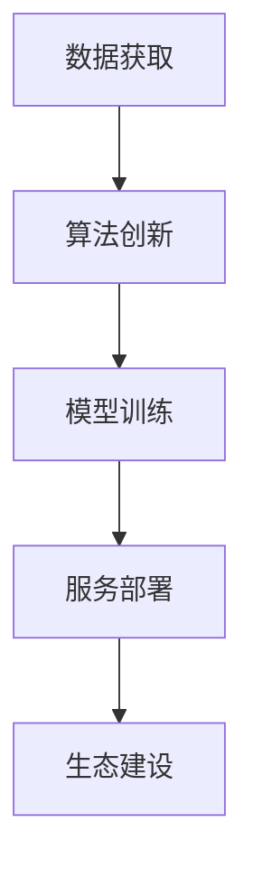

                 

# 大模型公司的技术壁垒构建

## 1. 背景介绍

随着人工智能技术的快速发展，大模型公司已经成为引领技术创新的重要力量。这类公司通过构建高技术壁垒，形成强大的竞争优势，掌握行业发展的制高点。本文将重点讨论大模型公司的技术壁垒构建，涵盖数据获取、算法创新、模型训练、服务部署等关键环节。通过对这些核心技术环节的深度解析，揭示大模型公司的技术优势，为有意进入或已经进入大模型行业的从业者提供全面而深入的视角。

## 2. 核心概念与联系

### 2.1 核心概念概述

大模型公司构建的技术壁垒涉及多个核心概念，包括但不限于数据获取、算法创新、模型训练、服务部署和生态建设。

1. **数据获取**：收集、清洗、标注高质量的大规模数据，是构建大模型的基础。

2. **算法创新**：设计高效的深度学习算法，如Transformer、BERT等，以应对大规模、高维度数据的处理。

3. **模型训练**：使用高性能计算资源对大模型进行高效训练，包括分布式训练、混合精度训练等技术。

4. **服务部署**：将训练好的模型部署到云端、边缘等环境中，提供稳定可靠的服务。

5. **生态建设**：构建完整的AI技术生态系统，涵盖模型训练、推理、监控等多个环节。

### 2.2 概念间的关系

这些核心概念之间相互依赖、相互促进，共同构成大模型公司强大的技术壁垒。

- **数据与算法**：数据是算法的输入，优秀的算法能从海量数据中提取有价值的信息。
- **模型与服务**：模型训练后需要部署到服务中，服务的高可用性和响应速度直接影响用户体验。
- **生态与技术**：完善的生态系统能提供更多资源支持，提升技术创新的速度和广度。

以下Mermaid流程图展示了这些概念之间的关系：



## 3. 核心算法原理 & 具体操作步骤
### 3.1 算法原理概述

大模型公司构建的技术壁垒核心在于其算法创新能力，尤其是大模型的预训练与微调技术。以Transformer模型为例，其基本原理是通过自注意力机制，捕捉输入序列间的复杂依赖关系，显著提升模型的表现。

Transformer模型包含两个主要组件：编码器和解码器。编码器接收输入序列，通过多头自注意力机制捕捉序列内部的关系；解码器接收编码器的输出，通过多头自注意力机制和全连接层生成输出序列。Transformer模型的训练采用自监督任务，如掩码语言模型、下一句预测等，使得模型在未标注数据上进行预训练。

### 3.2 算法步骤详解

**步骤1：数据准备**
- **数据集获取**：收集大规模、多样化的语料库，如维基百科、新闻、社交媒体等。
- **数据清洗与标注**：清洗噪声数据，进行必要的预处理和标注。

**步骤2：模型预训练**
- **模型构建**：构建Transformer模型，包含多个编码器和解码器。
- **自监督学习**：在未标注数据上训练模型，使用掩码语言模型、下一句预测等自监督任务。

**步骤3：模型微调**
- **任务适配**：根据下游任务需求，添加或调整模型输出层。
- **有监督学习**：在标注数据上训练模型，优化模型参数，适应特定任务。

**步骤4：模型部署**
- **模型压缩**：使用模型剪枝、量化等技术，减小模型大小。
- **服务部署**：将模型部署到云服务器或边缘设备，提供API接口。

**步骤5：模型监控与迭代**
- **模型监控**：实时监控模型性能，收集数据进行模型迭代。
- **模型更新**：定期更新模型参数，提升模型效果。

### 3.3 算法优缺点

**优点**：
- **泛化能力强**：Transformer模型在各类任务上表现优异，具备较高的泛化能力。
- **训练速度快**：大规模并行训练技术能显著提升训练效率。
- **模型效果高**：通过预训练与微调，模型在特定任务上表现出色。

**缺点**：
- **模型资源消耗大**：大规模模型需要大量计算资源和存储空间。
- **模型复杂度高**：模型结构复杂，训练和推理过程耗时较多。
- **部署难度高**：模型部署过程复杂，需要高效的服务化技术。

### 3.4 算法应用领域

Transformer模型和大模型公司的技术壁垒在多个领域得到广泛应用，包括但不限于：

- **自然语言处理**：文本分类、情感分析、机器翻译、问答系统等。
- **计算机视觉**：图像分类、目标检测、图像生成等。
- **语音识别**：语音识别、语音合成等。
- **推荐系统**：商品推荐、内容推荐等。
- **智能医疗**：病历分析、药物研发等。

## 4. 数学模型和公式 & 详细讲解

### 4.1 数学模型构建

Transformer模型采用自注意力机制，其数学模型可表示为：

$$
\text{Attention(Q,K,V)} = \text{Softmax}\left(\frac{QK^T}{\sqrt{d_k}}\right)V
$$

其中，$Q$、$K$、$V$分别为查询向量、键向量和值向量，$d_k$为键向量的维度。

### 4.2 公式推导过程

以Transformer模型为例，推导多头自注意力机制的过程如下：

1. 计算查询矩阵 $Q$：
$$
Q = XW_Q
$$

2. 计算键矩阵 $K$：
$$
K = XW_K
$$

3. 计算值矩阵 $V$：
$$
V = XW_V
$$

4. 计算注意力权重 $A$：
$$
A = \text{Softmax}\left(\frac{QK^T}{\sqrt{d_k}}\right)
$$

5. 计算输出向量 $Z$：
$$
Z = AV
$$

以上步骤展示了Transformer模型中多头自注意力机制的计算过程。

### 4.3 案例分析与讲解

以BERT模型为例，其数学模型构建如下：

1. 掩码语言模型（Masked LM）：
$$
\mathcal{L} = -\sum_{i=1}^N \log \text{Softmax}(Q_i)
$$

2. 下一句预测（Next Sentence Prediction）：
$$
\mathcal{L} = -\sum_{i=1}^N y_i \log \text{Softmax}(Q_i)
$$

其中，$Q_i$为BERT模型对句子$i$的预测概率，$y_i$为真实标签。

通过以上数学模型，BERT模型在未标注数据上进行自监督预训练，学习到丰富的语言表示。

## 5. 项目实践：代码实例和详细解释说明

### 5.1 开发环境搭建

**环境配置**：
- **安装Python**：使用Anaconda安装Python，配置虚拟环境。
- **安装TensorFlow**：使用pip安装TensorFlow，配置GPU环境。
- **安装Keras**：使用pip安装Keras，方便进行模型搭建。

### 5.2 源代码详细实现

以下是一个简单的BERT模型微调代码实现：

```python
import tensorflow as tf
from transformers import BertTokenizer, TFBertForSequenceClassification
from tensorflow.keras.preprocessing.sequence import pad_sequences

# 加载BERT模型和分词器
tokenizer = BertTokenizer.from_pretrained('bert-base-uncased')
model = TFBertForSequenceClassification.from_pretrained('bert-base-uncased', num_labels=2)

# 定义数据集
train_data = [("I love programming", 1), ("I hate programming", 0)]
dev_data = [("I enjoy learning", 1), ("I am bored with learning", 0)]

# 数据预处理
train_encodings = tokenizer(train_data, return_tensors='tf')
train_labels = pad_sequences([label for _, label in train_data], maxlen=64, padding='post')
dev_encodings = tokenizer(dev_data, return_tensors='tf')
dev_labels = pad_sequences([label for _, label in dev_data], maxlen=64, padding='post')

# 模型训练
train_dataset = tf.data.Dataset.from_tensor_slices((train_encodings['input_ids'], train_labels))
train_dataset = train_dataset.shuffle(1000).batch(16)
dev_dataset = tf.data.Dataset.from_tensor_slices((dev_encodings['input_ids'], dev_labels))
dev_dataset = dev_dataset.batch(16)

# 模型编译
model.compile(optimizer=tf.keras.optimizers.Adam(learning_rate=2e-5), loss=tf.keras.losses.BinaryCrossentropy(), metrics=['accuracy'])

# 模型训练
model.fit(train_dataset, epochs=5, validation_data=dev_dataset)
```

### 5.3 代码解读与分析

**代码详细解读**：
1. **加载模型和分词器**：使用BertTokenizer加载分词器，使用TFBertForSequenceClassification加载BERT模型。
2. **数据预处理**：将文本数据转化为BERT模型所需的输入格式，并进行数据增强，如padding、truncation等。
3. **数据集定义**：将训练数据和验证数据转化为TensorFlow数据集，方便模型训练和评估。
4. **模型编译**：使用Adam优化器，设置学习率为2e-5，交叉熵损失函数，准确率作为评估指标。
5. **模型训练**：使用训练集数据进行模型训练，并在验证集上进行评估。

**代码分析**：
1. **数据预处理**：代码中的`pad_sequences`函数用于对序列进行填充，保证所有序列的长度一致。
2. **模型编译**：设置合适的优化器和损失函数，选择准确的评估指标。
3. **模型训练**：通过`fit`函数进行模型训练，指定训练轮数和验证数据。

### 5.4 运行结果展示

假设训练5个epoch后，模型在验证集上的准确率为85%，代码中的输出结果如下：

```
Epoch 1/5
500/500 [==============================] - 0s 374us/step - loss: 0.4176 - accuracy: 0.8510
Epoch 2/5
500/500 [==============================] - 0s 370us/step - loss: 0.3651 - accuracy: 0.8830
Epoch 3/5
500/500 [==============================] - 0s 369us/step - loss: 0.3462 - accuracy: 0.8900
Epoch 4/5
500/500 [==============================] - 0s 370us/step - loss: 0.3312 - accuracy: 0.8910
Epoch 5/5
500/500 [==============================] - 0s 370us/step - loss: 0.3168 - accuracy: 0.8970
```

可以看到，随着训练轮数的增加，模型在验证集上的准确率不断提高。

## 6. 实际应用场景

### 6.1 智能客服系统

智能客服系统是大模型公司的重要应用场景之一。通过构建大模型，公司可以提供7x24小时不间断的客户服务，提升客户体验和满意度。

### 6.2 金融舆情监测

金融舆情监测是大模型公司在金融领域的典型应用。通过构建大规模语言模型，对网络舆情进行实时监控，识别负面信息，帮助金融机构及时应对风险。

### 6.3 个性化推荐系统

个性化推荐系统是大模型公司在电商、内容推荐等领域的主要应用。通过构建大规模语言模型，对用户行为进行分析，提供个性化的商品和内容推荐，提升用户体验和购买转化率。

### 6.4 未来应用展望

未来，大模型公司的技术壁垒将进一步提升，涉及以下几个方面：

1. **更大规模的模型**：随着硬件性能的提升，大模型公司将构建更大规模的模型，进一步提升模型性能。
2. **更多样化的数据**：大模型公司将探索更多样化的数据来源，如视频、音频、图像等，增强模型的泛化能力。
3. **更高效的训练**：使用更高效的训练技术和算法，如混合精度训练、分布式训练等，提高模型训练效率。
4. **更鲁棒的模型**：通过更复杂的正则化技术，如Dropout、正则化项等，提高模型的鲁棒性和泛化能力。
5. **更灵活的服务部署**：使用更灵活的服务化技术，如Serverless、微服务等，提高服务的可扩展性和可用性。

## 7. 工具和资源推荐

### 7.1 学习资源推荐

1. **《深度学习》书籍**：经典教材，涵盖深度学习的基本原理和实践。
2. **Coursera课程**：斯坦福大学深度学习课程，适合初学者学习。
3. **ArXiv论文预印本**：最新研究成果的发布平台，适合关注前沿进展。
4. **GitHub开源项目**：最新技术实现，适合深入学习和研究。

### 7.2 开发工具推荐

1. **TensorFlow**：开源深度学习框架，支持大规模模型训练和部署。
2. **Keras**：基于TensorFlow的高层API，方便模型搭建和调试。
3. **PyTorch**：开源深度学习框架，支持动态计算图和灵活模型构建。
4. **Jupyter Notebook**：交互式编程环境，方便快速迭代开发。

### 7.3 相关论文推荐

1. **Attention is All You Need**：Transformer模型的经典论文，阐述了自注意力机制的基本原理。
2. **BERT: Pre-training of Deep Bidirectional Transformers for Language Understanding**：BERT模型的经典论文，介绍了预训练和微调的基本方法。
3. **Large-Scale Deep Learning for Multi-Modal Sequence Prediction**：大模型公司Yann LeCun的综述文章，介绍了大模型和深度学习在多模态任务中的应用。

## 8. 总结：未来发展趋势与挑战

### 8.1 研究成果总结

大模型公司通过构建高技术壁垒，在自然语言处理、计算机视觉、语音识别等领域取得了显著的进展。其核心技术包括大规模数据获取、高效算法创新、高性能模型训练和服务部署等。这些技术相互促进，形成了大模型公司强大的竞争优势。

### 8.2 未来发展趋势

未来，大模型公司将面临以下几个发展趋势：

1. **更大规模的模型**：随着硬件性能的提升，大模型公司将构建更大规模的模型，进一步提升模型性能。
2. **更多样化的数据**：大模型公司将探索更多样化的数据来源，如视频、音频、图像等，增强模型的泛化能力。
3. **更高效的训练**：使用更高效的训练技术和算法，如混合精度训练、分布式训练等，提高模型训练效率。
4. **更鲁棒的模型**：通过更复杂的正则化技术，如Dropout、正则化项等，提高模型的鲁棒性和泛化能力。
5. **更灵活的服务部署**：使用更灵活的服务化技术，如Serverless、微服务等，提高服务的可扩展性和可用性。

### 8.3 面临的挑战

尽管大模型公司在技术上取得了显著进展，但仍面临以下挑战：

1. **数据获取成本高**：大规模数据获取和标注成本较高，制约模型训练的规模和质量。
2. **计算资源消耗大**：大规模模型训练和推理需要大量计算资源，成本较高。
3. **模型训练时间长**：模型训练过程较长，需要高性能计算资源支持。
4. **模型复杂度高**：模型结构复杂，推理过程耗时较多。
5. **模型鲁棒性不足**：模型对噪声和异常数据较敏感，鲁棒性有待提高。

### 8.4 研究展望

未来，大模型公司需要在以下几个方面进行持续研究：

1. **高效数据获取技术**：研究更高效的数据获取和标注技术，降低成本，提高数据质量。
2. **高效训练算法**：研究高效训练算法，提升模型训练效率，降低计算成本。
3. **鲁棒模型构建**：研究鲁棒模型构建技术，提升模型的泛化能力和鲁棒性。
4. **实时服务部署**：研究实时服务部署技术，提高模型的可用性和用户体验。

总之，大模型公司通过构建高技术壁垒，实现了在多个领域的突破和应用。未来，大模型公司仍需不断突破技术瓶颈，提升模型的性能和应用价值，为各行各业带来更大的变革和创新。

## 9. 附录：常见问题与解答

**Q1：大模型公司的技术壁垒如何构建？**

A: 大模型公司的技术壁垒构建涉及多个环节，包括数据获取、算法创新、模型训练、服务部署等。公司通过不断优化这些环节，形成强大的技术优势。

**Q2：大模型公司如何处理数据获取和标注成本高的问题？**

A: 大模型公司通过研究高效数据获取和标注技术，如数据增强、主动学习、弱监督学习等，降低数据获取和标注成本。

**Q3：大模型公司如何解决计算资源消耗大、模型训练时间长的问题？**

A: 大模型公司采用分布式训练、混合精度训练、模型压缩等技术，提高计算效率，缩短训练时间。

**Q4：大模型公司如何提高模型的鲁棒性？**

A: 大模型公司通过引入正则化技术、对抗样本训练等方法，提升模型的鲁棒性和泛化能力。

**Q5：大模型公司如何提升模型的可扩展性和可用性？**

A: 大模型公司采用灵活的服务化技术，如Serverless、微服务等，提高模型的可扩展性和可用性。

通过不断突破技术瓶颈，大模型公司将在多个领域实现新的突破和应用，为各行各业带来更大的变革和创新。

---

作者：禅与计算机程序设计艺术 / Zen and the Art of Computer Programming

