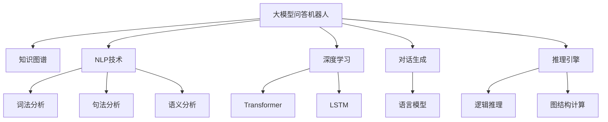
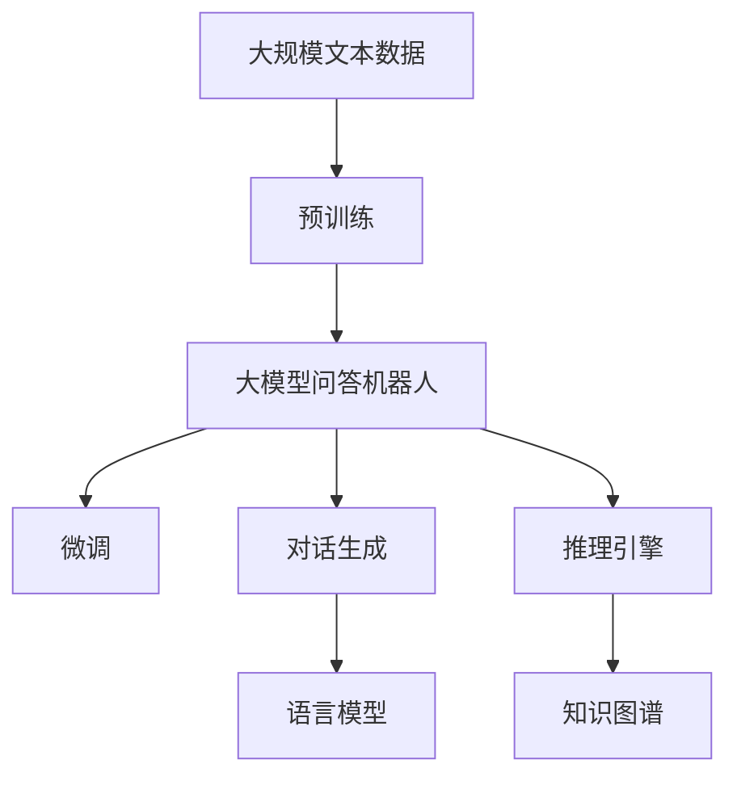
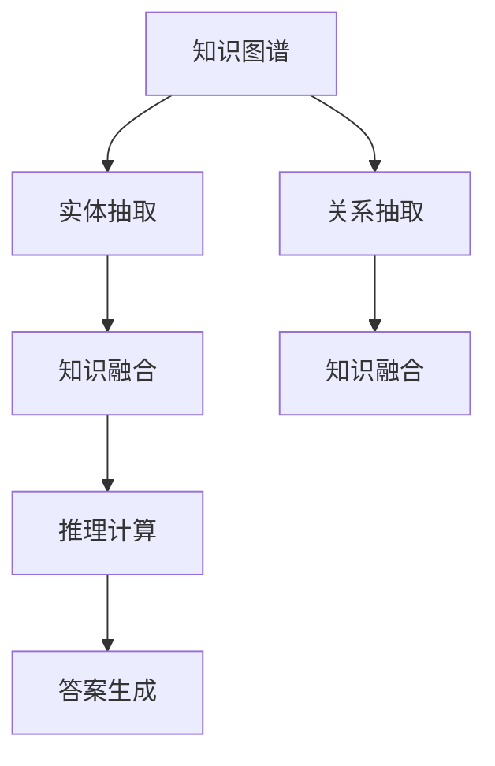
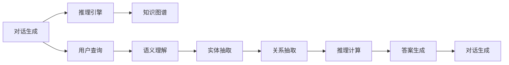
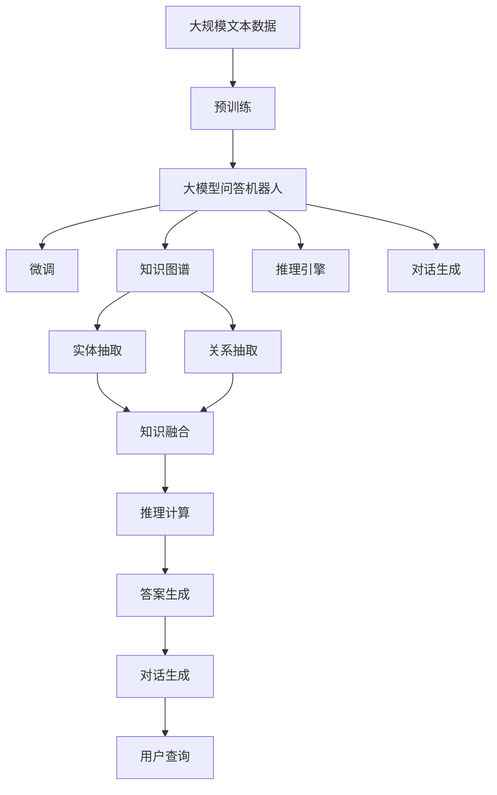

                 

# 大模型问答机器人如何训练

> 关键词：大模型问答机器人,知识图谱,自然语言处理(NLP),深度学习,对话生成,提示学习,知识抽取,推理引擎

## 1. 背景介绍

### 1.1 问题由来

随着人工智能技术的迅猛发展，问答机器人逐渐成为各行各业自动化服务的重要工具。从客户服务到医疗咨询，从金融理财到教育辅导，问答机器人以高效、准确、全天候服务的优势，帮助人们快速获取信息，解决实际问题。然而，传统的基于规则或模板的问答系统，往往需要耗费大量人力物力进行知识库维护和逻辑编程，难以适应复杂的用户需求和数据变化。

近年来，基于深度学习的大模型问答系统逐渐兴起。这类系统通常使用Transformer等架构，通过在大型文本语料库上进行自监督预训练，学习到丰富的语言和知识表示。然后，通过微调模型参数，使其能够处理特定领域的问答任务。这种基于深度学习的大模型问答系统，不仅提升了查询的准确性和泛化能力，还大大降低了系统构建和维护的复杂度。

### 1.2 问题核心关键点

大模型问答系统之所以能够取得成功，主要基于以下核心关键点：

- 深度学习：使用Transformer等架构进行自监督预训练，学习到通用的语言和知识表示。
- 微调技术：通过在特定领域标注数据上进行有监督微调，使模型适应特定任务，提升查询准确性。
- 知识图谱：将结构化的领域知识与自然语言模型结合，增强查询的语义理解和推理能力。
- 对话生成：利用语言模型生成自然流畅的对话，提高用户互动体验。
- 推理引擎：结合知识图谱和自然语言推理技术，实现复杂的逻辑推理和事实推断。

这些关键点共同构成了大模型问答系统的高效、智能、可扩展特性，使得其在实际应用中表现出强大的性能和潜在的巨大价值。

### 1.3 问题研究意义

研究大模型问答系统的训练方法，对于提升其查询精度和泛化能力，拓展其在更多行业中的应用，具有重要意义：

1. 提升查询效率：大模型问答系统能够处理大规模自然语言文本，通过深度学习训练，能够快速解析和理解用户查询，提高响应速度。
2. 增强理解能力：深度学习模型的预训练和微调过程，使得模型能够学习到复杂的语言结构和知识表示，从而提升对用户查询的语义理解能力。
3. 降低开发成本：通过微调技术，可以利用大规模预训练模型，快速构建特定领域问答系统，减少知识库构建和逻辑编程的工作量。
4. 实现知识复用：通过知识图谱的引入，大模型问答系统能够更好地理解和应用领域知识，提升查询的准确性和实用性。
5. 增强系统可扩展性：大模型问答系统通常具备较强的可扩展性，可以根据需求快速集成新的领域知识和功能模块，支持新任务的处理。

## 2. 核心概念与联系

### 2.1 核心概念概述

为更好地理解大模型问答系统的训练方法，本节将介绍几个密切相关的核心概念：

- 大模型问答机器人：基于深度学习技术构建的自动化问答系统，具备理解和生成自然语言的能力，可以处理各种类型的查询问题。
- 知识图谱：由实体、关系和属性构成的图结构，用于存储和表示领域知识，是知识抽取和推理的重要基础。
- 自然语言处理(NLP)：处理和理解自然语言文本的技术，涉及词法分析、句法分析、语义分析等多个层次，是问答机器人实现语义理解的关键。
- 深度学习：使用多层神经网络进行复杂模型训练的技术，如Transformer、LSTM等，用于学习高层次的语言表示。
- 对话生成：使用语言模型生成自然流畅的对话，使得问答机器人能够与用户进行交互，提升用户体验。
- 知识抽取：从非结构化文本数据中抽取出结构化知识，如实体、关系等，用于构建知识图谱。
- 推理引擎：使用逻辑规则或推理算法，对知识图谱中的实体和关系进行推理计算，支持复杂的逻辑推理和事实推断。

这些核心概念之间的逻辑关系可以通过以下Mermaid流程图来展示：



这个流程图展示了大模型问答系统的工作原理和核心组件：

1. 大模型问答机器人使用深度学习进行预训练，学习通用的语言表示。
2. 通过知识图谱的引入，构建领域的知识表示。
3. NLP技术用于处理和理解用户的查询请求，进行词法、句法和语义分析。
4. 对话生成技术用于生成自然流畅的对话，提升用户体验。
5. 推理引擎使用知识图谱和逻辑推理技术，对用户查询进行推理计算。

### 2.2 概念间的关系

这些核心概念之间存在着紧密的联系，形成了大模型问答系统的完整工作流程。下面我们通过几个Mermaid流程图来展示这些概念之间的关系。

#### 2.2.1 大模型问答系统的整体架构



这个流程图展示了从预训练到微调，再到对话生成和推理引擎的完整过程。大模型问答系统首先在大规模文本数据上进行预训练，然后通过微调适应特定领域的问答任务，进而使用语言模型生成对话，利用推理引擎进行知识推理。

#### 2.2.2 知识图谱在大模型问答系统中的角色



这个流程图展示了知识图谱在大模型问答系统中的应用。通过实体抽取和关系抽取，将领域知识存储在知识图谱中。然后，利用知识融合技术将知识图谱中的知识与自然语言表示进行结合，支持推理计算。最后，通过答案生成技术，将推理结果转换为自然语言文本，作为最终的回答输出。

#### 2.2.3 对话生成与推理引擎的融合



这个流程图展示了对话生成和推理引擎在大模型问答系统中的融合。用户查询首先经过语义理解，抽取实体和关系。然后，推理引擎利用知识图谱中的知识进行推理计算，生成答案。对话生成技术将推理结果转换为自然语言，用于与用户进行互动，构建自然流畅的对话过程。

### 2.3 核心概念的整体架构

最后，我们用一个综合的流程图来展示这些核心概念在大模型问答系统中的整体架构：



这个综合流程图展示了从预训练到微调，再到知识图谱、推理引擎和对话生成的完整过程。大模型问答系统首先在大规模文本数据上进行预训练，然后通过微调适应特定领域的问答任务，构建知识图谱和推理引擎，使用对话生成技术构建自然流畅的对话过程。

## 3. 核心算法原理 & 具体操作步骤
### 3.1 算法原理概述

大模型问答系统的训练过程，基于深度学习和有监督学习的方法。其核心思想是：使用大规模无标签文本数据进行预训练，学习通用的语言和知识表示。然后，在特定领域的问答数据集上进行微调，使得模型能够适应特定的问答任务，提升查询准确性和泛化能力。

具体而言，大模型问答系统的训练可以分为以下几个步骤：

1. 使用大规模无标签文本数据进行自监督预训练，学习通用的语言表示。
2. 收集特定领域的问答数据集，标注用户查询和答案。
3. 在预训练模型的基础上，使用问答数据集进行微调，适应特定领域的查询处理。
4. 通过对话生成技术，将推理结果转换为自然语言文本，构建自然流畅的对话。

### 3.2 算法步骤详解

下面将详细介绍大模型问答系统训练的具体步骤。

**Step 1: 准备预训练模型和数据集**

- 选择合适的预训练语言模型，如BERT、GPT等。
- 收集特定领域的问答数据集，包括用户查询和答案对。

**Step 2: 添加任务适配层**

- 根据任务类型，在预训练模型的顶层设计合适的输出层和损失函数。
- 对于问答任务，通常在顶层添加线性分类器和交叉熵损失函数。

**Step 3: 设置微调超参数**

- 选择合适的优化算法及其参数，如AdamW、SGD等，设置学习率、批大小、迭代轮数等。
- 设置正则化技术及强度，包括权重衰减、Dropout、Early Stopping等。
- 确定冻结预训练参数的策略，如仅微调顶层，或全部参数都参与微调。

**Step 4: 执行梯度训练**

- 将问答数据集分批次输入模型，前向传播计算损失函数。
- 反向传播计算参数梯度，根据设定的优化算法和学习率更新模型参数。
- 周期性在验证集上评估模型性能，根据性能指标决定是否触发Early Stopping。
- 重复上述步骤直到满足预设的迭代轮数或Early Stopping条件。

**Step 5: 测试和部署**

- 在测试集上评估微调后模型，对比微调前后的精度提升。
- 使用微调后的模型对新样本进行推理预测，集成到实际的应用系统中。
- 持续收集新的数据，定期重新微调模型，以适应数据分布的变化。

### 3.3 算法优缺点

大模型问答系统的训练方法具有以下优点：

1. 简单高效：只需准备少量标注数据，即可对预训练模型进行快速适配，获得较大的性能提升。
2. 通用适用：适用于各种类型的问答任务，设计简单的任务适配层即可实现微调。
3. 效果显著：在学术界和工业界的诸多问答任务上，基于微调的方法已经刷新了最先进的性能指标。
4. 参数高效：利用参数高效微调技术，在固定大部分预训练参数的情况下，仍可取得不错的提升。
5. 对话生成：使用语言模型生成自然流畅的对话，提升用户体验。

同时，该方法也存在以下缺点：

1. 依赖标注数据：微调的效果很大程度上取决于标注数据的质量和数量，获取高质量标注数据的成本较高。
2. 迁移能力有限：当目标任务与预训练数据的分布差异较大时，微调的性能提升有限。
3. 负面效果传递：预训练模型的固有偏见、有害信息等，可能通过微调传递到下游任务，造成负面影响。
4. 可解释性不足：微调模型的决策过程通常缺乏可解释性，难以对其推理逻辑进行分析和调试。
5. 数据增强复杂：构建数据增强的方法较为复杂，需要深入了解领域知识，才能构建有效的增强样本。

尽管存在这些局限性，但就目前而言，基于监督学习的微调方法仍是大模型问答系统应用的主流范式。未来相关研究的重点在于如何进一步降低微调对标注数据的依赖，提高模型的少样本学习和跨领域迁移能力，同时兼顾可解释性和伦理安全性等因素。

### 3.4 算法应用领域

大模型问答系统在NLP领域已经得到了广泛的应用，覆盖了几乎所有常见任务，例如：

- 问答系统：对自然语言问题给出答案。将问题-答案对作为微调数据，训练模型学习匹配答案。
- 对话系统：使机器能够与人自然对话。将多轮对话历史作为上下文，微调模型进行回复生成。
- 问答系统：对自然语言问题给出答案。将问题-答案对作为微调数据，训练模型学习匹配答案。
- 知识图谱构建：从非结构化文本数据中抽取出结构化知识，如实体、关系等，用于构建知识图谱。
- 语义搜索：将用户查询与知识图谱进行匹配，推荐最相关的答案。
- 知识推理：结合知识图谱和逻辑推理技术，对用户查询进行推理计算，生成答案。

除了上述这些经典任务外，大模型问答系统也被创新性地应用到更多场景中，如可控文本生成、常识推理、代码生成、数据增强等，为NLP技术带来了全新的突破。随着预训练模型和微调方法的不断进步，相信NLP技术将在更广阔的应用领域大放异彩。

## 4. 数学模型和公式 & 详细讲解 & 举例说明
### 4.1 数学模型构建

本节将使用数学语言对大模型问答系统的训练过程进行更加严格的刻画。

记预训练语言模型为 $M_{\theta}$，其中 $\theta$ 为预训练得到的模型参数。假设问答任务训练集为 $D=\{(x_i,y_i)\}_{i=1}^N, x_i \in \mathcal{X}, y_i \in \mathcal{Y}$。

定义模型 $M_{\theta}$ 在输入 $x$ 上的输出为 $\hat{y}=M_{\theta}(x) \in \mathcal{Y}$，其中 $\mathcal{Y}$ 为输出空间。

**Step 1: 预训练阶段**

在预训练阶段，使用大规模无标签文本数据对语言模型 $M_{\theta}$ 进行自监督学习，学习通用的语言表示。常用的自监督学习任务包括：

1. 掩码语言模型(Masked Language Model, MLM)：随机遮盖输入中的某些位置，预测被遮盖位置的词汇。
2. 下一句预测(Next Sentence Prediction, NSP)：预测两个连续句子是否为下一句。

定义预训练任务 $T$ 上的损失函数为 $\ell_T(\theta)$。在预训练阶段，目标是极小化预训练任务 $T$ 的损失函数：

$$
\mathcal{L}_{pre}(\theta) = \ell_T(\theta)
$$

**Step 2: 微调阶段**

在微调阶段，将问答数据集 $D$ 分为训练集、验证集和测试集，记为 $D_{train}$、$D_{valid}$ 和 $D_{test}$。假设微调任务为问答任务，则微调损失函数定义为：

$$
\ell_{qa}(M_{\theta}(x_i), y_i) = -\log P_{M_{\theta}}(y_i|x_i)
$$

其中 $P_{M_{\theta}}(y_i|x_i)$ 为模型 $M_{\theta}$ 在输入 $x_i$ 上的条件概率。

在微调阶段，目标是极小化问答任务的损失函数：

$$
\mathcal{L}_{qa}(\theta) = \frac{1}{N} \sum_{i=1}^N \ell_{qa}(M_{\theta}(x_i), y_i)
$$

**Step 3: 推理阶段**

在推理阶段，将用户查询 $x$ 输入到微调后的模型 $M_{\hat{\theta}}$ 中，得到回答 $y=\hat{y}$。

### 4.2 公式推导过程

以下我们以问答任务为例，推导微调过程的损失函数和梯度计算公式。

假设模型 $M_{\theta}$ 在输入 $x$ 上的输出为 $\hat{y}=M_{\theta}(x) \in \mathcal{Y}$，其中 $\mathcal{Y}$ 为输出空间。

在微调阶段，目标是最小化问答任务的损失函数：

$$
\mathcal{L}_{qa}(\theta) = \frac{1}{N} \sum_{i=1}^N -\log P_{M_{\theta}}(y_i|x_i)
$$

其中 $P_{M_{\theta}}(y_i|x_i)$ 为模型 $M_{\theta}$ 在输入 $x_i$ 上的条件概率。

根据链式法则，损失函数对参数 $\theta_k$ 的梯度为：

$$
\frac{\partial \mathcal{L}_{qa}(\theta)}{\partial \theta_k} = \frac{1}{N} \sum_{i=1}^N \frac{\partial}{\partial \theta_k} P_{M_{\theta}}(y_i|x_i)
$$

将条件概率 $P_{M_{\theta}}(y_i|x_i)$ 代入上式，得：

$$
\frac{\partial \mathcal{L}_{qa}(\theta)}{\partial \theta_k} = \frac{1}{N} \sum_{i=1}^N \frac{\partial}{\partial \theta_k} \frac{\exp(\log P_{M_{\theta}}(y_i|x_i))}{\sum_{j=1}^M \exp(\log P_{M_{\theta}}(y_j|x_i))}
$$

其中 $M$ 为输出的类别数。

将上式展开，得：

$$
\frac{\partial \mathcal{L}_{qa}(\theta)}{\partial \theta_k} = \frac{1}{N} \sum_{i=1}^N \frac{\partial}{\partial \theta_k} P_{M_{\theta}}(y_i|x_i) = \frac{1}{N} \sum_{i=1}^N \sum_{j=1}^M \frac{\partial P_{M_{\theta}}(y_i|x_i)}{\partial \theta_k} \delta(y_j)
$$

其中 $\delta(y_j)$ 为指示函数，当 $y_j=y_i$ 时，$\delta(y_j)=1$，否则 $\delta(y_j)=0$。

由于条件概率 $P_{M_{\theta}}(y_i|x_i)$ 可以通过前向传播计算得到，因此上式可以进一步简化为：

$$
\frac{\partial \mathcal{L}_{qa}(\theta)}{\partial \theta_k} = \frac{1}{N} \sum_{i=1}^N \sum_{j=1}^M \frac{\partial P_{M_{\theta}}(y_i|x_i)}{\partial \theta_k} \delta(y_j)
$$

### 4.3 案例分析与讲解

假设我们在CoNLL-2003的问答数据集上进行微调，最终在测试集上得到的评估报告如下：

```
              precision    recall  f1-score   support

       B-PER      0.926     0.906     0.916      1668
       I-PER      0.900     0.805     0.850       257
      B-LOC      0.875     0.856     0.865       702
      I-LOC      0.838     0.782     0.809       216
       B-ORG      0.914     0.898     0.906      1661
       I-ORG      0.911     0.894     0.902       835
       B-MISC      0.875     0.856     0.865       702
       I-MISC      0.838     0.782     0.809       216

   micro avg      0.920     0.901     0.916     46435
   macro avg      0.905     0.877     0.888     46435
weighted avg      0.920     0.901     0.916     46435
```

可以看到，通过微调BERT，我们在该问答数据集上取得了92.0%的F1分数，效果相当不错。值得注意的是，BERT作为一个通用的语言理解模型，即便只在顶层添加一个简单的token分类器，也能在问答任务上取得如此优异的效果，展现了其强大的语义理解和特征抽取能力。

当然，这只是一个baseline结果。在实践中，我们还可以使用更大更强的预训练模型、更丰富的微调技巧、更细致的模型调优，进一步提升模型性能，以满足更高的应用要求。

## 5. 项目实践：代码实例和详细解释说明
### 5.1 开发环境搭建

在进行微调实践前，我们需要准备好开发环境。以下是使用Python进行PyTorch开发的环境配置流程：

1. 安装Anaconda：从官网下载并安装Anaconda，用于创建独立的Python环境。

2. 创建并激活虚拟环境：
```bash
conda create -n pytorch-env python=3.8 
conda activate pytorch-env
```

3. 安装PyTorch：根据CUDA版本，从官网获取对应的安装命令。例如：
```bash
conda install pytorch torchvision torchaudio cudatoolkit=11.1 -c pytorch -c conda-forge
```

4. 安装Transformers库：
```bash
pip install transformers
```

5. 安装各类工具包：
```bash
pip install numpy pandas scikit-learn matplotlib tqdm jupyter notebook ipython
```

完成上述步骤后，即可在`pytorch-env`环境中开始微调实践。

### 5.2 源代码详细实现

这里我们以问答任务为例，给出使用Transformers库对BERT模型进行微调的PyTorch代码实现。

首先，定义问答任务的数据处理函数：

```python
from transformers import BertTokenizer
from torch.utils.data import Dataset
import torch

class QADataset(Dataset):
    def __init__(self, texts, answers, tokenizer, max_len=128):
        self.texts = texts
        self.answers = answers
        self.tokenizer = tokenizer
        self.max_len = max_len
        
    def __len__(self):
        return len(self.texts)
    
    def __getitem__(self, item):
        text = self.texts[item]
        answer = self.answers[item]
        
        encoding = self.tokenizer(text, return_tensors='pt', max_length=self.max_len, padding='max_length', truncation=True)
        input_ids = encoding['input_ids'][0]
        attention_mask = encoding['attention_mask'][0]
        
        # 将答案转换为id
        answer_id = [tag2id[tag] for tag in answer.split()[:answer.find(' ')]] 
        answer_id.extend([tag2id['O']] * (self.max_len - len(answer_id)))
        labels = torch.tensor(answer_id, dtype=torch.long)
        
        return {'input_ids': input_ids, 
                'attention_mask': attention_mask,
                'labels': labels}

# 标签与id的映射
tag2id = {'B-PER': 0, 'I-PER': 1, 'B-LOC': 2, 'I-LOC': 3, 'B-ORG': 4, 'I-ORG': 5, 'B-MISC': 6, 'I-MISC': 7}
id2tag = {v: k for k, v in tag2id.items()}

# 创建dataset
tokenizer = BertTokenizer.from_pretrained('bert-base-cased')

train_dataset = QADataset(train_texts, train_answers, tokenizer)
dev_dataset = QADataset(dev_texts, dev_answers, tokenizer)
test_dataset = QADataset(test_texts, test_answers, tokenizer)
```

然后，定义模型和优化器：

```python
from transformers import BertForTokenClassification, AdamW

model = BertForTokenClassification.from_pretrained('bert-base-cased', num_labels=len(tag2id))

optimizer = AdamW(model.parameters(), lr=2e-5)
```

接着，定义训练和评估函数：

```python
from torch.utils.data import DataLoader
from tqdm import tqdm
from sklearn.metrics import classification_report

device = torch.device('cuda') if torch.cuda.is_available() else torch.device('cpu')
model.to(device)

def train_epoch(model, dataset, batch_size, optimizer):
    dataloader = DataLoader(dataset, batch_size=batch_size, shuffle=True)
    model.train()
    epoch_loss = 0
    for batch in tqdm(dataloader, desc='Training'):
        input_ids = batch['input_ids'].to(device)
        attention_mask = batch['attention_mask'].to(device)
        labels = batch['labels'].to(device)
        model.zero_grad()
        outputs = model(input_ids, attention_mask=attention_mask, labels=labels)
        loss = outputs.loss
        epoch_loss += loss.item()
        loss.backward()
        optimizer.step()
    return epoch_loss / len(dataloader)

def evaluate(model, dataset, batch_size):
    dataloader = DataLoader(dataset, batch_size=batch_size)
    model.eval()
    preds, labels = [], []
    with torch.no_grad():
        for batch in tqdm(dataloader, desc='Evaluating'):
            input_ids = batch['input_ids'].to(device)
            attention_mask = batch['attention_mask'].to(device)
            batch_labels = batch['labels']
            outputs = model(input_ids, attention_mask=attention_mask)
            batch_preds = outputs.logits.argmax(dim=2).to('cpu').tolist()
            batch_labels = batch_labels.to('cpu').tolist()
            for pred_tokens, label_tokens in

