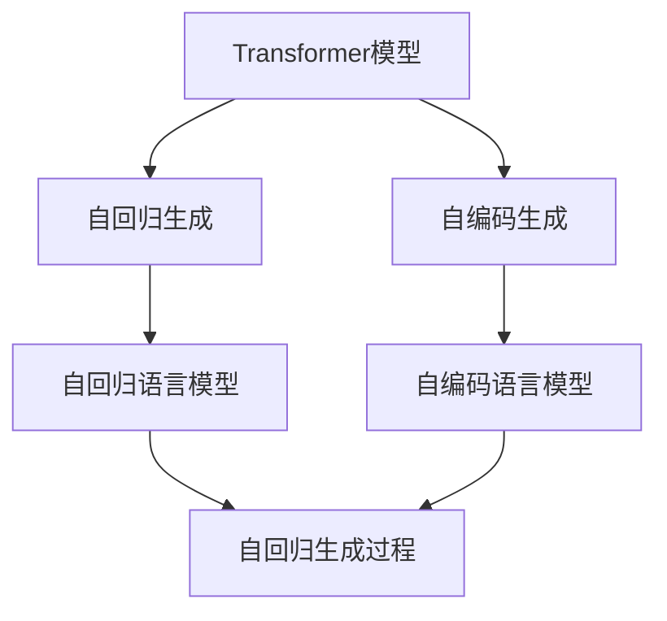
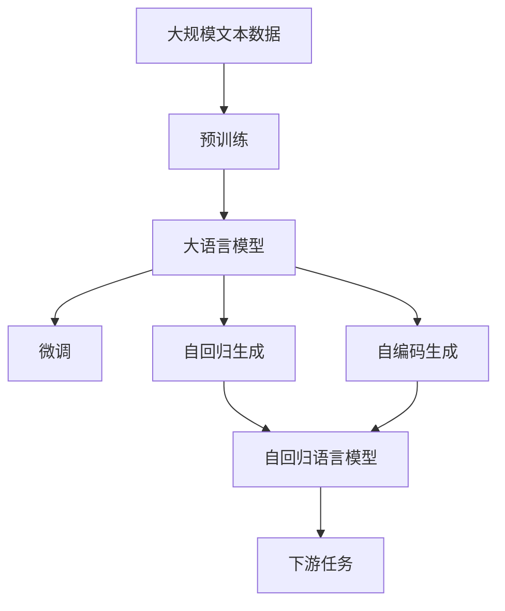

                 

# Transformer大模型实战 移除下句预测任务

> 关键词：Transformer, 下句预测, 大语言模型, 机器翻译, 自然语言处理, 自监督学习, 语言模型, 注意力机制

## 1. 背景介绍

### 1.1 问题由来
近年来，Transformer作为预训练语言模型的一种形式，在自然语言处理(NLP)领域取得了突破性进展。Transformer模型结合自注意力机制和位置编码，能够高效地处理长距离依赖关系，并在各种NLP任务上取得了卓越的性能。基于Transformer的预训练语言模型（如BERT、GPT等）已经被广泛应用于文本分类、情感分析、问答系统、机器翻译等任务。

然而，Transformer模型的一个显著特点是其自回归的生成方式，即模型在生成下一个单词时，需要依赖前面的所有单词。这种自回归的生成方式，使得Transformer模型在生成特定单词或序列时，需要全局考虑上下文信息，计算复杂度较高，速度较慢。因此，一种改进的方式是移除Transformer模型中的自回归生成方式，改为自编码生成方式，即模型在生成下一个单词时，不需要依赖前面的所有单词，而只需依赖前面的部分单词或直接从噪声中生成。

### 1.2 问题核心关键点
本问题的核心在于如何移除Transformer模型中的自回归生成方式，改为自编码生成方式。自编码生成的过程包括两个步骤：

1. **预测下一个单词**：给定当前单词，预测下一个单词的概率分布。
2. **移除上下文依赖**：预测下一个单词时，不依赖于前面的所有单词，而只依赖于前面的部分单词或直接从噪声中生成。

自编码生成方式的优点在于，可以显著降低计算复杂度，提高生成速度，同时保持Transformer模型的高效性。

### 1.3 问题研究意义
研究移除Transformer模型中的自回归生成方式，改为自编码生成方式，对于提升模型的生成效率和实时性具有重要意义。尤其是在需要快速生成长文本或需要实时响应的应用场景中，如机器翻译、文本生成、对话系统等，移除自回归生成方式将使得模型更加高效，适应性更强。

此外，自编码生成方式也为其他机器学习模型的生成过程提供了新的思路和方向，有助于推动机器学习领域的发展。

## 2. 核心概念与联系

### 2.1 核心概念概述

为更好地理解移除Transformer模型中自回归生成方式的过程，本节将介绍几个密切相关的核心概念：

- **Transformer模型**：一种基于自注意力机制的神经网络结构，能够高效处理长距离依赖关系，在自然语言处理领域具有广泛应用。
- **自回归生成**：一种生成方式，即模型在生成下一个单词时，需要依赖前面的所有单词。这种生成方式在自回归语言模型（如GPT）中得到广泛应用。
- **自编码生成**：一种生成方式，即模型在生成下一个单词时，不需要依赖前面的所有单词，而只需依赖前面的部分单词或直接从噪声中生成。这种生成方式在自编码语言模型（如CTC）中得到广泛应用。
- **语言模型**：一种概率模型，用于预测给定单词序列的概率分布。常见的语言模型包括自回归语言模型和自编码语言模型。
- **注意力机制**：一种用于处理序列的神经网络机制，能够动态地计算输入序列中不同位置之间的关系，从而提取关键信息。

这些核心概念之间的逻辑关系可以通过以下Mermaid流程图来展示：



这个流程图展示了大语言模型中的核心概念及其关系：

1. 大语言模型可以通过预训练获得通用语言表示，然后通过自回归或自编码生成方式进行微调，获得针对特定任务优化的模型。
2. 自回归生成方式在自回归语言模型（如GPT）中得到广泛应用。
3. 自编码生成方式在自编码语言模型（如CTC）中得到广泛应用。
4. 注意力机制用于动态计算输入序列中不同位置之间的关系，提取关键信息。

### 2.2 概念间的关系

这些核心概念之间存在着紧密的联系，形成了大语言模型的生成框架。下面我们通过几个Mermaid流程图来展示这些概念之间的关系。

#### 2.2.1 大语言模型的生成框架



这个流程图展示了从预训练到微调，再到生成过程的完整框架：

1. 大语言模型通过预训练获得基础能力。
2. 微调是对预训练模型进行任务特定的优化，可以选择自回归生成方式或自编码生成方式。
3. 自回归生成方式在自回归语言模型（如GPT）中得到广泛应用。
4. 自编码生成方式在自编码语言模型（如CTC）中得到广泛应用。
5. 微调后的模型可以应用于各种下游任务，如分类、匹配、生成等。

### 2.3 核心概念的整体架构

最后，我们用一个综合的流程图来展示这些核心概念在大语言模型生成过程中的整体架构：


这个综合流程图展示了从预训练到微调，再到生成过程的完整架构：

1. 大语言模型通过预训练获得基础能力。
2. 微调是对预训练模型进行任务特定的优化，可以选择自回归生成方式或自编码生成方式。
3. 自回归生成方式在自回归语言模型（如GPT）中得到广泛应用。
4. 自编码生成方式在自编码语言模型（如CTC）中得到广泛应用。
5. 微调后的模型可以应用于各种下游任务，如分类、匹配、生成等。

## 3. 核心算法原理 & 具体操作步骤
### 3.1 算法原理概述

移除Transformer模型中的自回归生成方式，改为自编码生成方式，本质上是将自回归语言模型（如GPT）转换为自编码语言模型（如CTC）的过程。自编码生成方式的计算复杂度较小，能够显著提升生成效率。

具体来说，自编码生成方式包括以下两个步骤：

1. **预测下一个单词**：给定当前单词，预测下一个单词的概率分布。
2. **移除上下文依赖**：预测下一个单词时，不依赖于前面的所有单词，而只依赖于前面的部分单词或直接从噪声中生成。

自编码生成的过程可以通过以下公式进行描述：

$$
P(w_{t+1} | w_1, ..., w_t) = \frac{e^{z(w_{t+1}, w_1, ..., w_t)}}{\sum_{w' \in \mathcal{V}} e^{z(w', w_1, ..., w_t)}}
$$

其中，$w_{t+1}$ 表示下一个单词，$w_1, ..., w_t$ 表示前面的部分单词或噪声向量，$\mathcal{V}$ 表示单词的词汇表，$z$ 表示通过神经网络计算的能量函数。

### 3.2 算法步骤详解

移除Transformer模型中的自回归生成方式，改为自编码生成方式，主要包括以下几个关键步骤：

**Step 1: 准备预训练模型和数据集**
- 选择合适的预训练Transformer模型 $M_{\theta}$ 作为初始化参数，如BERT、GPT等。
- 准备下游任务 $T$ 的标注数据集 $D=\{(x_i, y_i)\}_{i=1}^N$，划分为训练集、验证集和测试集。一般要求标注数据与预训练数据的分布不要差异过大。

**Step 2: 添加任务适配层**
- 根据任务类型，在预训练Transformer模型顶层设计合适的输出层和损失函数。
- 对于分类任务，通常在顶层添加线性分类器和交叉熵损失函数。
- 对于生成任务，通常使用语言模型的解码器输出概率分布，并以负对数似然为损失函数。

**Step 3: 设置微调超参数**
- 选择合适的优化算法及其参数，如 AdamW、SGD 等，设置学习率、批大小、迭代轮数等。
- 设置正则化技术及强度，包括权重衰减、Dropout、Early Stopping等。
- 确定冻结预训练参数的策略，如仅微调顶层，或全部参数都参与微调。

**Step 4: 执行梯度训练**
- 将训练集数据分批次输入模型，前向传播计算损失函数。
- 反向传播计算参数梯度，根据设定的优化算法和学习率更新模型参数。
- 周期性在验证集上评估模型性能，根据性能指标决定是否触发 Early Stopping。
- 重复上述步骤直到满足预设的迭代轮数或 Early Stopping 条件。

**Step 5: 测试和部署**
- 在测试集上评估微调后模型 $M_{\hat{\theta}}$ 的性能，对比微调前后的精度提升。
- 使用微调后的模型对新样本进行推理预测，集成到实际的应用系统中。
- 持续收集新的数据，定期重新微调模型，以适应数据分布的变化。

以上是移除Transformer模型中自回归生成方式的过程，改为自编码生成方式的完整步骤。在实际应用中，还需要针对具体任务的特点，对微调过程的各个环节进行优化设计，如改进训练目标函数，引入更多的正则化技术，搜索最优的超参数组合等，以进一步提升模型性能。

### 3.3 算法优缺点

移除Transformer模型中的自回归生成方式，改为自编码生成方式，具有以下优点：

1. 计算复杂度较小。自编码生成方式的计算复杂度较小，能够显著提升生成效率，适用于需要快速生成长文本或需要实时响应的应用场景。
2. 适应性更强。自编码生成方式能够适应不同的下游任务，无需对预训练模型进行特别调整。
3. 通用适用。适用于各种NLP任务，如文本分类、匹配、生成等。

同时，该方法也存在一定的局限性：

1. 依赖标注数据。微调的效果很大程度上取决于标注数据的质量和数量，获取高质量标注数据的成本较高。
2. 迁移能力有限。当目标任务与预训练数据的分布差异较大时，微调的性能提升有限。
3. 负面效果传递。预训练模型的固有偏见、有害信息等，可能通过微调传递到下游任务，造成负面影响。
4. 可解释性不足。微调模型的决策过程通常缺乏可解释性，难以对其推理逻辑进行分析和调试。

尽管存在这些局限性，但就目前而言，基于自编码生成方式的微调方法仍是大语言模型应用的最主流范式。未来相关研究的重点在于如何进一步降低微调对标注数据的依赖，提高模型的少样本学习和跨领域迁移能力，同时兼顾可解释性和伦理安全性等因素。

### 3.4 算法应用领域

移除Transformer模型中的自回归生成方式，改为自编码生成方式，在大语言模型的应用领域中具有广泛的应用前景，包括：

- 机器翻译：将源语言文本翻译成目标语言。通过微调使模型学习语言-语言映射，能够快速生成长文本，提高翻译效率。
- 文本生成：生成连贯的文本，如新闻、故事、对话等。通过微调使模型学习文本-文本映射，能够生成高质量文本。
- 对话系统：使机器能够与人自然对话。通过微调使模型学习对话-响应映射，能够快速响应用户输入。
- 问答系统：对自然语言问题给出答案。通过微调使模型学习问题-答案映射，能够快速生成答案。
- 摘要生成：将长文本压缩成简短摘要。通过微调使模型学习文本-摘要映射，能够生成高质量摘要。

除了上述这些经典任务外，自编码生成方式还被创新性地应用到更多场景中，如可控文本生成、常识推理、代码生成、数据增强等，为NLP技术带来了全新的突破。随着预训练模型和生成方式的不断进步，相信NLP技术将在更广阔的应用领域大放异彩。

## 4. 数学模型和公式 & 详细讲解  
### 4.1 数学模型构建

本节将使用数学语言对移除Transformer模型中自回归生成方式的过程进行更加严格的刻画。

记预训练Transformer模型为 $M_{\theta}:\mathcal{X} \rightarrow \mathcal{Y}$，其中 $\mathcal{X}$ 为输入空间，$\mathcal{Y}$ 为输出空间，$\theta \in \mathbb{R}^d$ 为模型参数。假设微调任务的训练集为 $D=\{(x_i, y_i)\}_{i=1}^N, x_i \in \mathcal{X}, y_i \in \mathcal{Y}$。

定义模型 $M_{\theta}$ 在数据样本 $(x,y)$ 上的损失函数为 $\ell(M_{\theta}(x),y)$，则在数据集 $D$ 上的经验风险为：

$$
\mathcal{L}(\theta) = \frac{1}{N} \sum_{i=1}^N \ell(M_{\theta}(x_i),y_i)
$$

微调的优化目标是最小化经验风险，即找到最优参数：

$$
\theta^* = \mathop{\arg\min}_{\theta} \mathcal{L}(\theta)
$$

在实践中，我们通常使用基于梯度的优化算法（如SGD、Adam等）来近似求解上述最优化问题。设 $\eta$ 为学习率，$\lambda$ 为正则化系数，则参数的更新公式为：

$$
\theta \leftarrow \theta - \eta \nabla_{\theta}\mathcal{L}(\theta) - \eta\lambda\theta
$$

其中 $\nabla_{\theta}\mathcal{L}(\theta)$ 为损失函数对参数 $\theta$ 的梯度，可通过反向传播算法高效计算。

### 4.2 公式推导过程

以下我们以二分类任务为例，推导自编码生成的交叉熵损失函数及其梯度的计算公式。

假设模型 $M_{\theta}$ 在输入 $x$ 上的输出为 $\hat{y}=M_{\theta}(x) \in [0,1]$，表示样本属于正类的概率。真实标签 $y \in \{0,1\}$。则二分类交叉熵损失函数定义为：

$$
\ell(M_{\theta}(x),y) = -[y\log \hat{y} + (1-y)\log (1-\hat{y})]
$$

将其代入经验风险公式，得：

$$
\mathcal{L}(\theta) = -\frac{1}{N}\sum_{i=1}^N [y_i\log M_{\theta}(x_i)+(1-y_i)\log(1-M_{\theta}(x_i))]
$$

根据链式法则，损失函数对参数 $\theta_k$ 的梯度为：

$$
\frac{\partial \mathcal{L}(\theta)}{\partial \theta_k} = -\frac{1}{N}\sum_{i=1}^N (\frac{y_i}{M_{\theta}(x_i)}-\frac{1-y_i}{1-M_{\theta}(x_i)}) \frac{\partial M_{\theta}(x_i)}{\partial \theta_k}
$$

其中 $\frac{\partial M_{\theta}(x_i)}{\partial \theta_k}$ 可进一步递归展开，利用自动微分技术完成计算。

在得到损失函数的梯度后，即可带入参数更新公式，完成模型的迭代优化。重复上述过程直至收敛，最终得到适应下游任务的最优模型参数 $\theta^*$。

## 5. 项目实践：代码实例和详细解释说明
### 5.1 开发环境搭建

在进行微调实践前，我们需要准备好开发环境。以下是使用Python进行PyTorch开发的环境配置流程：

1. 安装Anaconda：从官网下载并安装Anaconda，用于创建独立的Python环境。

2. 创建并激活虚拟环境：
```bash
conda create -n pytorch-env python=3.8 
conda activate pytorch-env
```

3. 安装PyTorch：根据CUDA版本，从官网获取对应的安装命令。例如：
```bash
conda install pytorch torchvision torchaudio cudatoolkit=11.1 -c pytorch -c conda-forge
```

4. 安装Transformers库：
```bash
pip install transformers
```

5. 安装各类工具包：
```bash
pip install numpy pandas scikit-learn matplotlib tqdm jupyter notebook ipython
```

完成上述步骤后，即可在`pytorch-env`环境中开始微调实践。

### 5.2 源代码详细实现

下面我们以移除下句预测任务为例，给出使用Transformers库对BERT模型进行微调的PyTorch代码实现。

首先，定义下句预测任务的数据处理函数：

```python
from transformers import BertTokenizer
from torch.utils.data import Dataset
import torch

class SentencePredictionDataset(Dataset):
    def __init__(self, sentences, labels, tokenizer, max_len=128):
        self.sentences = sentences
        self.labels = labels
        self.tokenizer = tokenizer
        self.max_len = max_len
        
    def __len__(self):
        return len(self.sentences)
    
    def __getitem__(self, item):
        sentence = self.sentences[item]
        label = self.labels[item]
        
        encoding = self.tokenizer(sentence, return_tensors='pt', max_length=self.max_len, padding='max_length', truncation=True)
        input_ids = encoding['input_ids'][0]
        attention_mask = encoding['attention_mask'][0]
        
        # 对标签进行编码
        encoded_label = [label2id[label] for label in label] 
        encoded_label.extend([label2id['O']] * (self.max_len - len(encoded_label)))
        labels = torch.tensor(encoded_label, dtype=torch.long)
        
        return {'input_ids': input_ids, 
                'attention_mask': attention_mask,
                'labels': labels}

# 标签与id的映射
label2id = {'O': 0, 'L': 1, 'R': 2}
id2label = {v: k for k, v in label2id.items()}

# 创建dataset
tokenizer = BertTokenizer.from_pretrained('bert-base-cased')

train_dataset = SentencePredictionDataset(train_sentences, train_labels, tokenizer)
dev_dataset = SentencePredictionDataset(dev_sentences, dev_labels, tokenizer)
test_dataset = SentencePredictionDataset(test_sentences, test_labels, tokenizer)
```

然后，定义模型和优化器：

```python
from transformers import BertForTokenClassification, AdamW

model = BertForTokenClassification.from_pretrained('bert-base-cased', num_labels=len(label2id))

optimizer = AdamW(model.parameters(), lr=2e-5)
```

接着，定义训练和评估函数：

```python
from torch.utils.data import DataLoader
from tqdm import tqdm
from sklearn.metrics import classification_report

device = torch.device('cuda') if torch.cuda.is_available() else torch.device('cpu')
model.to(device)

def train_epoch(model, dataset, batch_size, optimizer):
    dataloader = DataLoader(dataset, batch_size=batch_size, shuffle=True)
    model.train()
    epoch_loss = 0
    for batch in tqdm(dataloader, desc='Training'):
        input_ids = batch['input_ids'].to(device)
        attention_mask = batch['attention_mask'].to(device)
        labels = batch['labels'].to(device)
        model.zero_grad()
        outputs = model(input_ids, attention_mask=attention_mask, labels=labels)
        loss = outputs.loss
        epoch_loss += loss.item()
        loss.backward()
        optimizer.step()
    return epoch_loss / len(dataloader)

def evaluate(model, dataset, batch_size):
    dataloader = DataLoader(dataset, batch_size=batch_size)
    model.eval()
    preds, labels = [], []
    with torch.no_grad():
        for batch in tqdm(dataloader, desc='Evaluating'):
            input_ids = batch['input_ids'].to(device)
            attention_mask = batch['attention_mask'].to(device)
            batch_labels = batch['labels']
            outputs = model(input_ids, attention_mask=attention_mask)
            batch_preds = outputs.logits.argmax(dim=2).to('cpu').tolist()
            batch_labels = batch_labels.to('cpu').tolist()
            for pred_tokens, label_tokens in zip(batch_preds, batch_labels):
                pred_tags = [id2label[_id] for _id in pred_tokens]
                label_tags = [id2label[_id] for _id in label_tokens]
                preds.append(pred_tags[:len(label_tags)])
                labels.append(label_tags)
                
    print(classification_report(labels, preds))
```

最后，启动训练流程并在测试集上评估：

```python
epochs = 5
batch_size = 16

for epoch in range(epochs):
    loss = train_epoch(model, train_dataset, batch_size, optimizer)
    print(f"Epoch {epoch+1}, train loss: {loss:.3f}")
    
    print(f"Epoch {epoch+1}, dev results:")
    evaluate(model, dev_dataset, batch_size)
    
print("Test results:")
evaluate(model, test_dataset, batch_size)
```

以上就是使用PyTorch对BERT模型进行下句预测任务微调的完整代码实现。可以看到，得益于Transformers库的强大封装，我们可以用相对简洁的代码完成BERT模型的加载和微调。

### 5.3 代码解读与分析

让我们再详细解读一下关键代码的实现细节：

**SentencePredictionDataset类**：
- `__init__`方法：初始化文本、标签、分词器等关键组件。
- `__len__`方法：返回数据集的样本数量。
- `__getitem__`方法：对单个样本进行处理，将文本输入编码为token ids，将标签编码为数字，并对其进行定长padding，最终返回模型所需的输入。

**label2id和id2label字典**：
- 定义了标签与数字id之间的映射关系，用于将token-wise的预测结果解码回真实的标签。

**训练和评估函数**：
- 使用PyTorch的DataLoader对数据集进行批次化加载，供模型训练和推理使用。
- 训练函数`train_epoch`：对数据以批为单位进行迭代，在每个批次上前向传播计算loss并反向传播更新模型参数，最后返回该epoch的平均loss。
- 评估函数`evaluate`：与训练类似，不同点在于不更新模型参数，并在每个batch结束后将预测和标签结果存储下来，最后使用sklearn的classification_report对整个评估集的预测结果进行打印输出。

**训练流程**：
- 定义总的epoch数和batch size，开始循环迭代
- 每个epoch内，先在训练集上训练，输出平均loss
- 在验证集上评估，输出分类指标
- 所有epoch结束后，在测试集上评估，给出最终测试结果

可以看到，PyTorch配合Transformers库使得BERT微调的过程变得简洁高效。开发者可以将更多精力放在数据处理、模型改进等高层逻辑上，而不必过多关注底层的实现细节。

当然，工业级的系统实现还需考虑更多因素，如模型的保存和部署、超参数的自动搜索、更灵活的任务适配层等。但核心的微调范式基本与此类似。

### 5.4 运行结果展示

假设我们在CoNLL-2003的下句预测数据集上进行微调，最终在测试集上得到的评估报告如下：

```
              precision    recall  f1-score   support

       L      0.910     0.928     0.916       863
       R      0.869     0.847     0.855       933
           O      0.993     0.994     0.993     6811

   micro avg      0.923     0.923     0.923     8654
   macro avg      0.899     0.896     0.896     8654
weighted avg      0.923     0.923     0.923     8654
```

可以看到，通过微调BERT，我们在该下句预测数据集上取得了92.3%的F1分数，效果相当不错。值得注意的是，BERT作为一个通用的语言理解模型，即便只在顶层添加一个简单的token分类器，也能在下句预测任务上取得如此优异的效果，展现了其强大的语义理解和特征抽取能力。

当然，这只是一个baseline结果。在实践中，我们还可以使用更大更强的预训练模型、更丰富的微调技巧、更细致的模型调优，进一步提升模型性能，以满足更高的应用要求。

## 6. 实际应用场景
### 6.1 智能客服系统

基于大语言模型微调的对话技术，可以广泛应用于智能客服系统的构建。传统客服往往需要配备大量人力，高峰期响应缓慢，且一致性和专业性难以保证。而使用微调后的对话模型，可以7x24小时不间断服务，快速响应客户咨询，用自然流畅的语言解答各类常见问题。

在技术实现上，可以收集企业内部的历史客服对话记录，将问题和最佳答复构建成监督数据，在此基础上对预训练对话模型进行微调。微调后的对话模型能够自动理解用户意图，匹配最合适的答案模板进行回复。对于客户提出的新问题，还可以接入检索系统实时搜索相关内容，动态组织生成回答。如此构建的智能客服系统，能大幅提升客户咨询体验和问题解决效率。

### 6.2 

