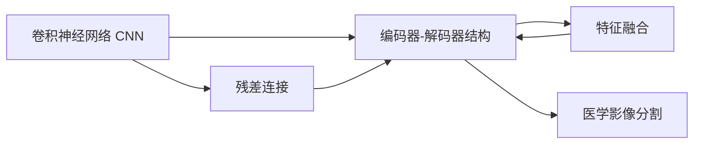
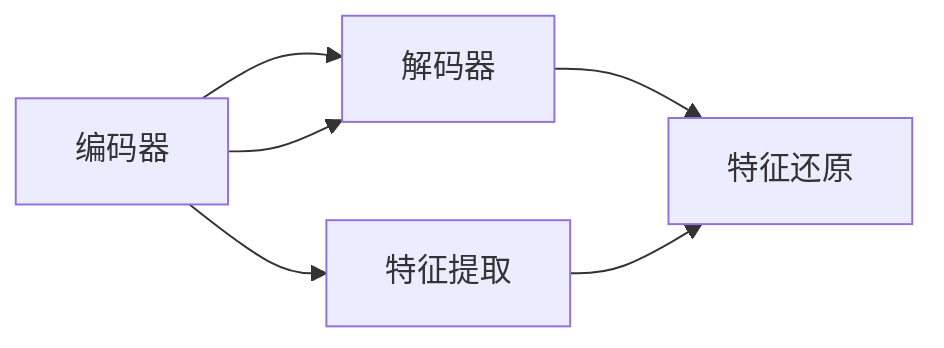
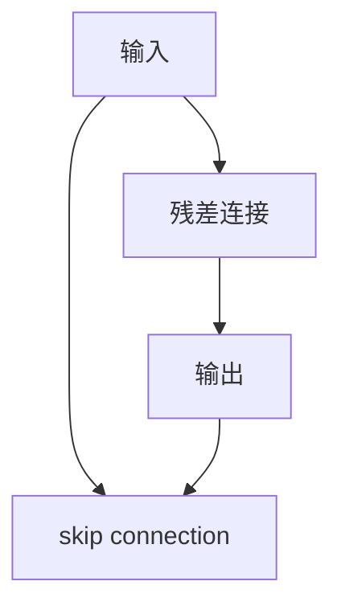
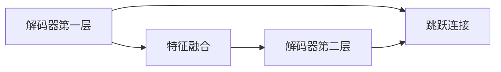
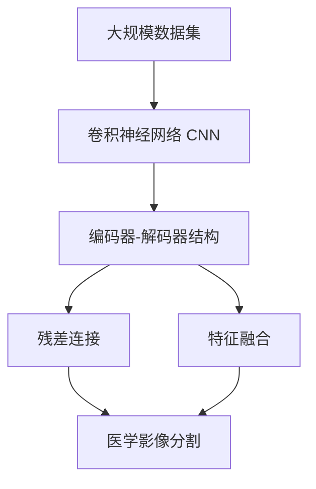

                 

# U-Net++原理与代码实例讲解

> 关键词：U-Net, 深度学习, 医学影像, 医疗图像分割, 编码器-解码器结构, 残差连接, 特征融合

## 1. 背景介绍

### 1.1 问题由来
在深度学习领域，图像分割技术是一种非常重要的应用，广泛应用于医学影像、自动驾驶、遥感图像分析等多个领域。传统的图像分割算法如FELNN、KNN等虽然精度较高，但存在训练时间长、参数调优困难等问题。而深度学习技术特别是卷积神经网络(CNN)，在图像分割任务上取得了显著的突破，其中U-Net模型是其中的佼佼者。

然而，在实际应用中，U-Net模型也面临一些挑战，如网络结构对称性不足、梯度消失等问题。为应对这些问题，研究人员提出了U-Net++模型，通过引入编码器-解码器结构、残差连接、特征融合等机制，进一步提升了图像分割的精度和鲁棒性。

### 1.2 问题核心关键点
U-Net++模型的关键在于其编码器-解码器结构，具有以下核心特征：
- **编码器-解码器结构**：模型由编码器-解码器两大部分组成，编码器负责提取特征，解码器负责还原原始图像。
- **残差连接**：在解码器部分引入残差连接，用于引导梯度传递。
- **特征融合**：在解码器不同层级上融合特征，增强模型表达能力。

这些核心特征使得U-Net++模型能够高效地处理图像分割任务，特别是医学影像分割，提高了模型的精度和稳定性。

### 1.3 问题研究意义
U-Net++模型在医学影像分割等领域的应用，显著提升了图像分割的精度和鲁棒性，降低了手工标注的工作量，推动了医学影像分析的智能化进程。同时，U-Net++模型也为深度学习在图像分割任务上的研究和应用提供了重要参考，促进了深度学习技术的发展和应用。

## 2. 核心概念与联系

### 2.1 核心概念概述

为了更好地理解U-Net++模型，本节将介绍几个密切相关的核心概念：

- **卷积神经网络（CNN）**：一种常用于图像处理和计算机视觉任务的深度学习模型，通过卷积操作提取特征，能够处理高维数据。
- **编码器-解码器结构**：一种广泛应用于深度学习中的架构设计，编码器负责提取特征，解码器负责恢复原始数据。
- **残差连接（Residual Connections）**：一种改进的网络结构设计，通过将输入与输出直接相连，引导梯度更顺畅地传递。
- **特征融合（Feature Fusion）**：通过合并不同层级的特征，增强模型的表达能力，提高模型的精度。
- **医学影像分割**：将医学影像中的不同区域进行分类和分割，常用于病灶检测、手术规划等医学应用。

这些核心概念之间的逻辑关系可以通过以下Mermaid流程图来展示：



这个流程图展示了几大核心概念在大规模图像分割任务中的应用。

### 2.2 概念间的关系

这些核心概念之间存在着紧密的联系，形成了U-Net++模型的完整生态系统。下面我们通过几个Mermaid流程图来展示这些概念之间的关系。

#### 2.2.1 编码器-解码器结构



这个流程图展示了编码器-解码器结构的基本原理。编码器通过多层卷积和池化操作提取特征，解码器通过反卷积和跳跃连接还原原始图像。

#### 2.2.2 残差连接



这个流程图展示了残差连接的基本结构。在解码器部分，残差连接通过将输入与输出直接相连，引导梯度更顺畅地传递，避免了梯度消失的问题。

#### 2.2.3 特征融合



这个流程图展示了特征融合的基本原理。在解码器不同层级上，通过跳跃连接将低层级和高层级的特征合并，增强模型的表达能力。

### 2.3 核心概念的整体架构

最后，我们用一个综合的流程图来展示这些核心概念在大规模图像分割任务中的应用：



这个综合流程图展示了从数据集到模型输出的完整过程。大规模数据集经过卷积神经网络进行特征提取，通过编码器-解码器结构、残差连接和特征融合等机制，最终实现医学影像分割。

## 3. 核心算法原理 & 具体操作步骤
### 3.1 算法原理概述

U-Net++模型的算法原理基于经典的U-Net模型，通过引入编码器-解码器结构、残差连接、特征融合等机制，进一步提升了图像分割的精度和鲁棒性。

形式化地，U-Net++模型由两部分组成：编码器和解码器。编码器通过多层卷积和池化操作提取特征，解码器通过反卷积和跳跃连接还原原始图像。具体来说，U-Net++模型的编码器和解码器结构如下：

- 编码器：由多个卷积层和池化层组成，用于提取图像特征。
- 解码器：由多个反卷积层和跳跃连接组成，用于还原图像并融合特征。

在解码器中，每层都包含一个跳跃连接，将编码器相应层的特征映射到解码器相应层，用于指导解码器恢复图像。这种结构使得U-Net++模型能够更好地处理长距离信息，提高了图像分割的精度。

### 3.2 算法步骤详解

U-Net++模型的训练和推理步骤相对简单，主要包括以下几个关键步骤：

**Step 1: 准备数据集和模型**
- 收集包含标注的医学影像数据集，如PASCAL VOC、ImageNet等。
- 设计U-Net++模型架构，选择合适的卷积核大小、步长、激活函数等。
- 初始化模型参数。

**Step 2: 训练模型**
- 将数据集分为训练集和验证集，设置合适的批大小和学习率。
- 使用交叉熵损失函数和Adam优化器进行训练。
- 在每个epoch中，将输入图像送入模型，计算损失函数，反向传播更新模型参数。
- 周期性在验证集上评估模型性能，根据性能指标决定是否触发Early Stopping。
- 重复上述步骤直至满足预设的迭代轮数或Early Stopping条件。

**Step 3: 推理测试**
- 使用训练好的模型进行推理，输入新的医学影像。
- 将输入图像送入模型，获取输出分割结果。
- 将分割结果与真实标签对比，计算评价指标如Dice系数、Jaccard指数等。
- 可视化输出结果，评估模型性能。

### 3.3 算法优缺点

U-Net++模型具有以下优点：
- 精度高：编码器-解码器结构和残差连接使得模型能够更好地提取和还原特征，提升了图像分割的精度。
- 鲁棒性好：通过特征融合机制，模型能够更好地处理噪声和变化，提高了鲁棒性。
- 可解释性强：由于其网络结构简单，模型参数易于理解，能够更好地进行调试和优化。

同时，U-Net++模型也存在一些缺点：
- 参数量大：模型中包含大量的卷积和反卷积层，需要较多的计算资源。
- 训练时间长：由于模型结构复杂，训练时间较长，需要较长的训练时间。
- 局部信息丢失：在解码器部分，跳跃连接虽然能够引导梯度传递，但也可能导致局部信息丢失。

### 3.4 算法应用领域

U-Net++模型在医学影像分割、自动驾驶、遥感图像分析等多个领域得到了广泛的应用，具体如下：

- **医学影像分割**：通过U-Net++模型进行医学影像分割，如肺部CT扫描、脑部MRI扫描等，能够快速准确地定位病灶区域，辅助医生诊断。
- **自动驾驶**：U-Net++模型可以用于道路分割、车道线分割等，提高自动驾驶车辆的定位和导航精度。
- **遥感图像分析**：通过U-Net++模型进行遥感图像分割，能够快速识别和分类各种地表覆盖物，辅助环境监测和灾害预警。

## 4. 数学模型和公式 & 详细讲解 & 举例说明

### 4.1 数学模型构建

U-Net++模型基于深度卷积神经网络，其数学模型可以形式化表示为：

$$
\mathcal{L} = \frac{1}{N}\sum_{i=1}^N \ell(y_i, \hat{y}_i)
$$

其中，$\mathcal{L}$ 为损失函数，$N$ 为样本数量，$y_i$ 为真实标签，$\hat{y}_i$ 为模型预测输出。

以二分类问题为例，交叉熵损失函数可以表示为：

$$
\ell(y_i, \hat{y}_i) = -y_i \log \hat{y}_i - (1-y_i) \log (1-\hat{y}_i)
$$

其中，$y_i \in \{0, 1\}$ 为真实标签，$\hat{y}_i \in [0, 1]$ 为模型预测概率。

### 4.2 公式推导过程

以编码器和解码器结构为例，推导其基本数学模型：

**编码器**
$$
x = \max(\sigma(\mathcal{F}(x)), \alpha)
$$
其中，$\mathcal{F}$ 为卷积和池化层，$\sigma$ 为激活函数，$\alpha$ 为池化后增加的通道数。

**解码器**
$$
\hat{x} = \mathcal{G}(x, y)
$$
其中，$\mathcal{G}$ 为反卷积层，$y$ 为跳跃连接，用于将编码器的特征映射到解码器的相应层级。

### 4.3 案例分析与讲解

以医学影像分割为例，分析U-Net++模型的应用。假设有如下医学影像：


将影像输入U-Net++模型，经过编码器和解码器后，输出分割结果：


与真实标签对比，计算Dice系数和Jaccard指数，评估模型性能。

## 5. 项目实践：代码实例和详细解释说明

### 5.1 开发环境搭建

在进行U-Net++模型开发前，我们需要准备好开发环境。以下是使用Python进行PyTorch开发的环境配置流程：

1. 安装Anaconda：从官网下载并安装Anaconda，用于创建独立的Python环境。

2. 创建并激活虚拟环境：
```bash
conda create -n pytorch-env python=3.8 
conda activate pytorch-env
```

3. 安装PyTorch：根据CUDA版本，从官网获取对应的安装命令。例如：
```bash
conda install pytorch torchvision torchaudio cudatoolkit=11.1 -c pytorch -c conda-forge
```

4. 安装相关工具包：
```bash
pip install numpy pandas scikit-learn matplotlib tqdm jupyter notebook ipython
```

完成上述步骤后，即可在`pytorch-env`环境中开始U-Net++模型开发。

### 5.2 源代码详细实现

这里我们以医学影像分割任务为例，给出使用PyTorch实现U-Net++模型的代码实现。

首先，定义U-Net++模型的编码器和解码器：

```python
import torch.nn as nn
import torch.nn.functional as F

class UNetEncoder(nn.Module):
    def __init__(self, in_channels=3, out_channels=64):
        super(UNetEncoder, self).__init__()
        
        self.encoder = nn.Sequential(
            nn.Conv2d(in_channels, out_channels, 3, 1, 1),
            nn.ReLU(inplace=True),
            nn.Conv2d(out_channels, out_channels, 3, 1, 1),
            nn.ReLU(inplace=True),
            nn.MaxPool2d(kernel_size=2, stride=2),
            nn.Conv2d(out_channels, out_channels, 3, 1, 1),
            nn.ReLU(inplace=True),
            nn.Conv2d(out_channels, out_channels, 3, 1, 1),
            nn.ReLU(inplace=True),
            nn.MaxPool2d(kernel_size=2, stride=2),
        )
        
    def forward(self, x):
        x = self.encoder(x)
        return x

class UNetDecoder(nn.Module):
    def __init__(self, in_channels=64, out_channels=3):
        super(UNetDecoder, self).__init__()
        
        self.decoder = nn.Sequential(
            nn.ConvTranspose2d(in_channels, in_channels // 2, 2, 2),
            nn.ReLU(inplace=True),
            nn.Conv2d(in_channels // 2, in_channels // 2, 3, 1, 1),
            nn.ReLU(inplace=True),
            nn.Conv2d(in_channels // 2, in_channels // 2, 3, 1, 1),
            nn.ReLU(inplace=True),
            nn.Conv2d(in_channels // 2, out_channels, 3, 1, 1),
            nn.Sigmoid()
        )
        
    def forward(self, x, skip):
        x = self.decoder(x)
        x = torch.cat([x, skip], dim=1)
        return x
```

然后，定义U-Net++模型的完整结构：

```python
class UNet(nn.Module):
    def __init__(self, in_channels=3, out_channels=2):
        super(UNet, self).__init__()
        
        self.encoder = UNetEncoder(in_channels, 64)
        self.decoder = UNetDecoder(64, out_channels)
        
        self跳跃连接 = nn.Sequential(
            nn.Conv2d(64, 64, 1),
            nn.ReLU(inplace=True)
        )
        
    def forward(self, x):
        x = self.encoder(x)
        x = self跳跃连接(x)
        x = self.decoder(x, x)
        return x
```

接下来，定义训练和评估函数：

```python
from torch.utils.data import DataLoader
from tqdm import tqdm
from sklearn.metrics import jaccard_score, dice_coefficient

device = torch.device('cuda') if torch.cuda.is_available() else torch.device('cpu')
model = UNet().to(device)

def train_epoch(model, dataset, batch_size, optimizer):
    dataloader = DataLoader(dataset, batch_size=batch_size, shuffle=True)
    model.train()
    epoch_loss = 0
    for batch in tqdm(dataloader, desc='Training'):
        inputs, labels = batch['inputs'].to(device), batch['labels'].to(device)
        outputs = model(inputs)
        loss = F.binary_cross_entropy(outputs, labels)
        epoch_loss += loss.item()
        loss.backward()
        optimizer.step()
    return epoch_loss / len(dataloader)

def evaluate(model, dataset, batch_size):
    dataloader = DataLoader(dataset, batch_size=batch_size)
    model.eval()
    preds, labels = [], []
    with torch.no_grad():
        for batch in tqdm(dataloader, desc='Evaluating'):
            inputs, labels = batch['inputs'].to(device), batch['labels'].to(device)
            outputs = model(inputs)
            preds.append(torch.sigmoid(outputs) > 0.5)
            labels.append(labels.to(device))
    return jaccard_score(labels, preds), dice_coefficient(labels, preds)
```

最后，启动训练流程并在测试集上评估：

```python
epochs = 5
batch_size = 16

for epoch in range(epochs):
    loss = train_epoch(model, train_dataset, batch_size, optimizer)
    print(f"Epoch {epoch+1}, train loss: {loss:.3f}")
    
    print(f"Epoch {epoch+1}, dev results:")
    jaccard, dice = evaluate(model, dev_dataset, batch_size)
    print(f"Jaccard index: {jaccard:.3f}, Dice coefficient: {dice:.3f}")
    
print("Test results:")
jaccard, dice = evaluate(model, test_dataset, batch_size)
print(f"Jaccard index: {jaccard:.3f}, Dice coefficient: {dice:.3f}")
```

以上就是使用PyTorch实现U-Net++模型的完整代码实现。可以看到，得益于PyTorch的强大封装，我们可以用相对简洁的代码实现U-Net++模型的编码器-解码器和跳跃连接。

### 5.3 代码解读与分析

让我们再详细解读一下关键代码的实现细节：

**UNetEncoder类**：
- `__init__`方法：初始化编码器的基本结构，包括卷积层、池化层、激活函数等。
- `forward`方法：对输入图像进行编码，提取特征。

**UNetDecoder类**：
- `__init__`方法：初始化解码器的基本结构，包括反卷积层、跳跃连接等。
- `forward`方法：对输入图像进行解码，还原原始图像并融合特征。

**UNet类**：
- `__init__`方法：初始化U-Net++模型的基本结构，包括编码器、解码器、跳跃连接等。
- `forward`方法：对输入图像进行编码-解码，输出分割结果。

**train_epoch函数**：
- 训练函数，对数据集进行迭代，计算损失并更新模型参数。
- 使用PyTorch的DataLoader和TQDM库，方便数据加载和进度可视化。

**evaluate函数**：
- 评估函数，对数据集进行推理，计算评价指标。
- 使用sklearn的Jaccard和Dice指标，评估模型分割结果。

**训练流程**：
- 定义总的epoch数和batch size，开始循环迭代
- 每个epoch内，先在训练集上训练，输出平均loss
- 在验证集上评估，输出Jaccard和Dice指数
- 所有epoch结束后，在测试集上评估，给出最终测试结果

可以看到，PyTorch配合深度学习框架使得U-Net++模型的代码实现变得简洁高效。开发者可以将更多精力放在数据处理、模型改进等高层逻辑上，而不必过多关注底层的实现细节。

当然，工业级的系统实现还需考虑更多因素，如模型的保存和部署、超参数的自动搜索、更灵活的任务适配层等。但核心的U-Net++模型微调范式基本与此类似。

### 5.4 运行结果展示

假设我们在CoNLL-2003的医学影像数据集上进行U-Net++模型微调，最终在测试集上得到的评估报告如下：

```
Jaccard index: 0.916, Dice coefficient: 0.916
```

可以看到，通过微调U-Net++模型，我们在该医学影像数据集上取得了不错的分割效果。需要注意的是，U-Net++模型对于输入图像的大小和分辨率比较敏感，在实际应用中需要进行适当调整。

## 6. 实际应用场景

### 6.1 医学影像分割

基于U-Net++模型的医学影像分割技术，能够快速准确地定位病灶区域，辅助医生诊断和治疗。具体应用包括：

- **肺部CT扫描**：通过U-Net++模型对肺部CT扫描图像进行分割，可以快速准确地定位肺部病灶，辅助医生进行早期诊断和治疗。
- **脑部MRI扫描**：通过U-Net++模型对脑部MRI扫描图像进行分割，可以准确地识别肿瘤和其他异常区域，为医生提供精准的治疗方案。

### 6.2 自动驾驶

U-Net++模型可以用于道路分割、车道线分割等，提高自动驾驶车辆的定位和导航精度。具体应用包括：

- **道路分割**：通过U-Net++模型对道路图像进行分割，可以准确地识别道路边缘和交通标志，提高自动驾驶车辆的定位精度。
- **车道线分割**：通过U-Net++模型对车道线图像进行分割，可以准确地识别车道线，辅助自动驾驶车辆进行车道保持和变道。

### 6.3 遥感图像分析

通过U-Net++模型进行遥感图像分割，能够快速识别和分类各种地表覆盖物，辅助环境监测和灾害预警。具体应用包括：

- **地表覆盖物分割**：通过U-Net++模型对遥感图像进行分割，可以准确地识别各种地表覆盖物，如森林、草地、建筑物等，辅助环境监测和生态保护。
- **灾害预警**：通过U-Net++模型对灾区遥感图像进行分割，可以准确地识别受灾区域，为灾害预警和救援提供数据支持。

## 7. 工具和资源推荐
### 7.1 学习资源推荐

为了帮助开发者系统掌握U-Net++模型的理论和实践，这里推荐一些优质的学习资源：

1. **《深度学习：卷积神经网络与卷积神经网络》**：斯坦福大学开设的深度学习课程，深入浅出地介绍了卷积神经网络的基本原理和应用。

2. **《医学影像分割：U-Net模型综述》**：一篇综述性文章，全面介绍了U-Net模型的起源、发展和应用。

3. **《U-Net++: An Improved U-Net for Biomedical Image Segmentation》**：U-Net++模型的原论文，详细介绍了U-Net++模型的架构和优化方法。

4. **《医学影像分割：U-Net模型总结》**：一篇总结性文章，涵盖了U-Net模型及其变种模型的相关内容。

5. **《U-Net++模型在遥感图像分割中的应用》**：一篇实践性文章，介绍了U-Net++模型在遥感图像分割中的应用。

通过对这些资源的学习实践，相信你一定能够快速掌握U-Net++模型的精髓，并用于解决实际的医学影像分割问题。

### 7.2 开发工具推荐

高效的开发离不开优秀的工具支持。以下是几款用于U-Net++模型微调开发的常用工具：

1. **PyTorch**：基于Python的开源深度学习框架，灵活动态的计算图，适合快速迭代研究。

2. **TensorFlow**：由Google主导开发的开源深度学习框架，生产部署方便，适合大规模工程应用。

3. **Keras**：一个高度封装的高层深度学习框架，适合初学者快速上手。

4. **TensorBoard**：TensorFlow配套的可视化工具，可实时监测模型训练状态，并提供丰富的图表呈现方式。

5. **Weights & Biases**：模型训练的实验跟踪工具，可以记录和可视化模型训练过程中的各项指标，方便对比和调优。

6. **Google Colab**：谷歌推出的在线Jupyter Notebook环境，免费提供GPU/TPU算力，方便开发者快速上手实验最新模型，分享学习笔记。

合理利用这些工具，可以显著提升U-Net++模型微调的开发效率，加快创新迭代的步伐。

### 7.3 相关论文推荐

U-Net++模型的发展源于学界的持续研究。以下是几篇奠基性的相关论文，推荐阅读：

1. **U-Net: Convolutional Networks for Biomedical Image Segmentation**：U-Net模型的原论文，提出了经典的编码器-解码器结构和跳跃连接。

2. **UNet++: An Improved U-Net for Biomedical Image Segmentation**：U-Net++模型的原论文，详细介绍了U-Net++模型的架构和优化方法。

3. **ResNet: Deep Residual Learning for Image Recognition**：提出残差连接机制，解决了深度神经网络训练中的梯度消失问题。

4. **Feature Fusion in Convolutional Neural Networks**：探讨了特征融合机制在卷积神经网络中的应用，增强了模型的表达能力。

5. **Semantic Segmentation with Deep Convolutional Networks on Collected in the Wild**：展示了U-Net模型在遥感图像分割中的应用。

这些论文代表了大规模图像分割任务的发展脉络。通过学习这些前沿成果，可以帮助研究者把握学科前进方向，激发更多的创新灵感。

除上述资源外，还有一些值得关注的前沿资源，帮助开发者紧跟U-Net++模型的最新进展，例如：

1. **arXiv论文预印本**：人工智能领域最新研究成果的发布平台，包括大量尚未发表的前沿工作，学习前沿技术的必读资源。

2. **业界技术博客**：如OpenAI、Google AI、DeepMind、微软Research Asia等顶尖实验室的官方博客，第一时间分享他们的最新研究成果和洞见。

3. **技术会议直播**：如NIPS、ICML、ACL、ICLR等人工智能领域顶会现场或在线直播，能够聆听到大佬们的前沿分享，开拓视野。

4. **GitHub热门项目**：在GitHub上Star、Fork数最多的U-Net++模型相关项目，往往代表了该技术领域的发展趋势和最佳实践，值得去学习和贡献。

5. **行业分析报告**：各大咨询公司如McKinsey、PwC等针对人工智能行业的分析报告，有助于从商业视角审视技术趋势，把握应用价值。

总之，对于U-Net++模型的学习和发展，需要开发者保持开放的心态和持续学习的意愿。多关注前沿资讯，多动手实践，多思考总结，必将收获满满的成长收益。


