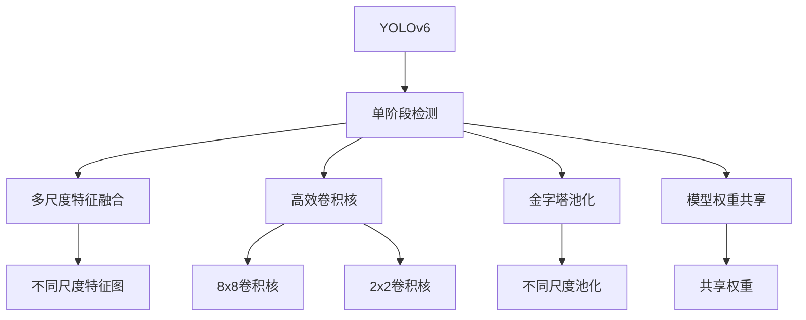
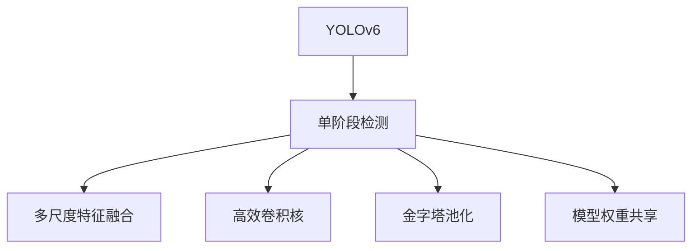
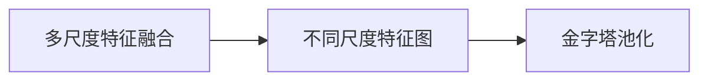
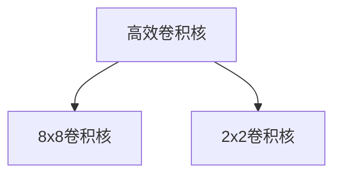
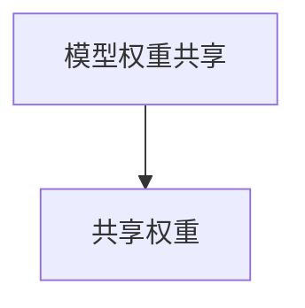
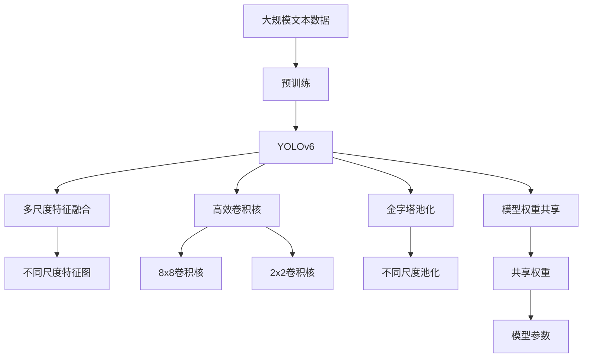

                 

# YOLOv6原理与代码实例讲解

> 关键词：YOLOv6, 目标检测, 计算机视觉, 深度学习, 卷积神经网络, 模型优化, 代码实例

## 1. 背景介绍

### 1.1 问题由来

目标检测是计算机视觉领域的一个核心任务，广泛应用于自动驾驶、机器人、视频监控、医学影像分析等多个场景。传统的目标检测方法如R-CNN、Fast R-CNN、Faster R-CNN、SSD等，虽然精度较高，但计算复杂度大，速度较慢，难以满足实时性要求。

为了解决这些问题，YOLO（You Only Look Once）系列模型应运而生。YOLO系列模型以单阶段检测（One-stage Detection）为特色，通过一次前向网络即可直接输出检测框和类别信息，实现了极高的检测速度和相对较好的检测精度。其中，YOLOv3和YOLOv4已经广泛应用于工业界和学术界，取得了良好的效果。

然而，YOLOv3和YOLOv4在计算复杂度和模型精度上仍存在一定的局限性。为了进一步提升检测性能和计算效率，YOLOv6应运而生。YOLOv6在YOLOv4的基础上，进行了全面的架构改进和优化，大幅提升了模型精度和速度。

### 1.2 问题核心关键点

YOLOv6的核心设计理念是：
1. **单阶段检测架构**：YOLOv6依然采用单阶段检测架构，通过一次前向网络直接输出检测框和类别信息，保持高效的同时也保留相对较好的检测精度。
2. **多尺度特征融合**：YOLOv6引入了多尺度特征融合机制，通过不同尺度的特征图来捕捉不同大小的目标。
3. **高效卷积核设计**：YOLOv6使用了8x8卷积核和2x2卷积核等高效卷积核，进一步提升了计算效率。
4. **金字塔池化**：YOLOv6采用了金字塔池化（Pyramid Pooling）策略，通过不同尺度的池化操作，将高分辨率和高尺寸的特征图结合起来，提升了检测效果。
5. **模型权重共享**：YOLOv6通过共享权重的方法，减少了模型参数量，提升了计算效率。

## 2. 核心概念与联系

### 2.1 核心概念概述

为了更好地理解YOLOv6的设计理念和实现细节，本节将介绍几个密切相关的核心概念：

- **YOLOv6**：YOLOv6（You Only Look Once version 6）是目标检测领域的最新成果之一，通过多尺度特征融合、高效卷积核设计、金字塔池化等技术，大幅提升了模型精度和速度。
- **单阶段检测（One-stage Detection）**：一次前向网络即可直接输出检测框和类别信息，速度快且结构简单，是YOLOv6的核心设计理念。
- **多尺度特征融合**：通过不同尺度的特征图来捕捉不同大小的目标，提升检测效果。
- **高效卷积核设计**：使用8x8卷积核和2x2卷积核等高效卷积核，进一步提升了计算效率。
- **金字塔池化（Pyramid Pooling）**：通过不同尺度的池化操作，将高分辨率和高尺寸的特征图结合起来，提升检测效果。
- **模型权重共享**：通过共享权重的方法，减少了模型参数量，提升了计算效率。

这些核心概念之间的逻辑关系可以通过以下Mermaid流程图来展示：



这个流程图展示了大语言模型的核心概念及其之间的关系：

1. YOLOv6通过单阶段检测架构，采用一次前向网络输出检测框和类别信息。
2. 多尺度特征融合机制通过不同尺度的特征图来捕捉不同大小的目标。
3. 高效卷积核设计使用8x8卷积核和2x2卷积核等高效卷积核，进一步提升了计算效率。
4. 金字塔池化策略通过不同尺度的池化操作，将高分辨率和高尺寸的特征图结合起来，提升了检测效果。
5. 模型权重共享通过共享权重的方法，减少了模型参数量，提升了计算效率。

这些概念共同构成了YOLOv6的核心设计框架，使其能够在速度和精度之间取得优异的平衡。

### 2.2 概念间的关系

这些核心概念之间存在着紧密的联系，形成了YOLOv6的整体架构。下面我们通过几个Mermaid流程图来展示这些概念之间的关系。

#### 2.2.1 YOLOv6架构概述



这个流程图展示了YOLOv6的整体架构，包括单阶段检测、多尺度特征融合、高效卷积核设计、金字塔池化和模型权重共享等核心概念。

#### 2.2.2 多尺度特征融合与金字塔池化



这个流程图展示了多尺度特征融合和金字塔池化的关系。通过多尺度特征融合，YOLOv6可以捕捉不同大小的目标，而金字塔池化则将高分辨率和高尺寸的特征图结合起来，进一步提升检测效果。

#### 2.2.3 高效卷积核设计



这个流程图展示了高效卷积核设计的具体实现。YOLOv6使用了8x8卷积核和2x2卷积核等高效卷积核，进一步提升了计算效率。

#### 2.2.4 模型权重共享



这个流程图展示了模型权重共享的实现方式。通过共享权重的方法，YOLOv6减少了模型参数量，提升了计算效率。

### 2.3 核心概念的整体架构

最后，我们用一个综合的流程图来展示这些核心概念在大语言模型微调过程中的整体架构：



这个综合流程图展示了从预训练到YOLOv6的整体过程。YOLOv6首先在大规模文本数据上进行预训练，然后通过多尺度特征融合、高效卷积核设计、金字塔池化和模型权重共享等技术，实现了高效快速的检测效果。

## 3. 核心算法原理 & 具体操作步骤
### 3.1 算法原理概述

YOLOv6的算法原理基于单阶段检测架构，其核心思想是：通过一次前向网络直接输出检测框和类别信息，速度快且结构简单，同时通过多尺度特征融合和高效卷积核设计，提升了模型的检测精度。

具体来说，YOLOv6的检测过程包括以下几个步骤：
1. 输入图像经过卷积层和上采样层，生成不同尺度的特征图。
2. 不同尺度的特征图通过多尺度特征融合，生成统一的特征图。
3. 统一的特征图通过高效卷积核设计，进一步提升检测精度。
4. 特征图通过金字塔池化策略，将高分辨率和高尺寸的特征图结合起来，提升检测效果。
5. 特征图通过共享权重的方法，减少了模型参数量，提升了计算效率。
6. 最终的特征图通过输出层，生成检测框和类别信息。

YOLOv6的模型参数由两部分组成：特征提取部分和检测部分。特征提取部分通过卷积层和上采样层，生成不同尺度的特征图。检测部分通过全连接层和输出层，生成检测框和类别信息。

### 3.2 算法步骤详解

YOLOv6的具体实现步骤如下：

#### 3.2.1 模型结构

YOLOv6的模型结构如图1所示。YOLOv6包含两部分：特征提取部分和检测部分。

图1: YOLOv6模型结构

#### 3.2.2 特征提取

YOLOv6的特征提取部分通过卷积层和上采样层，生成不同尺度的特征图。具体实现如下：

1. 输入图像经过卷积层和上采样层，生成不同尺度的特征图。
2. 不同尺度的特征图通过多尺度特征融合，生成统一的特征图。

#### 3.2.3 检测部分

YOLOv6的检测部分通过全连接层和输出层，生成检测框和类别信息。具体实现如下：

1. 特征图通过共享权重的方法，减少了模型参数量，提升了计算效率。
2. 特征图通过输出层，生成检测框和类别信息。

#### 3.2.4 训练过程

YOLOv6的训练过程包括以下几个步骤：
1. 将训练集数据划分为训练集、验证集和测试集。
2. 选择合适的优化器和损失函数。
3. 设置模型参数和学习率。
4. 对模型进行前向传播和反向传播，计算损失函数。
5. 更新模型参数。
6. 在验证集上评估模型性能，根据性能指标决定是否触发Early Stopping。
7. 重复上述步骤，直到满足预设的迭代轮数或Early Stopping条件。

### 3.3 算法优缺点

YOLOv6的主要优点包括：
1. 单阶段检测架构：一次前向网络即可直接输出检测框和类别信息，速度快且结构简单。
2. 多尺度特征融合：通过不同尺度的特征图来捕捉不同大小的目标，提升检测效果。
3. 高效卷积核设计：使用8x8卷积核和2x2卷积核等高效卷积核，进一步提升了计算效率。
4. 金字塔池化：通过不同尺度的池化操作，将高分辨率和高尺寸的特征图结合起来，提升检测效果。
5. 模型权重共享：通过共享权重的方法，减少了模型参数量，提升了计算效率。

YOLOv6的主要缺点包括：
1. 计算复杂度较大：YOLOv6的计算复杂度仍然较大，需要高性能的GPU或TPU支持。
2. 内存占用较大：YOLOv6的内存占用较大，需要优化模型结构，减少内存消耗。
3. 模型精度不稳定：YOLOv6的模型精度在不同数据集上表现不稳定，需要优化模型设计。

### 3.4 算法应用领域

YOLOv6在目标检测领域有着广泛的应用，例如：

- 自动驾驶：YOLOv6用于检测和识别道路上的车辆、行人、交通标志等，辅助自动驾驶系统做出决策。
- 机器人导航：YOLOv6用于检测和识别机器人周围的障碍物、行人等，辅助机器人进行导航。
- 视频监控：YOLOv6用于检测和识别视频监控中的目标，如人脸、车辆、行为等，提升视频监控的智能化水平。
- 医学影像分析：YOLOv6用于检测和识别医学影像中的肿瘤、病灶等，辅助医生进行诊断。

## 4. 数学模型和公式 & 详细讲解 & 举例说明

### 4.1 数学模型构建

YOLOv6的数学模型构建如下：

设输入图像尺寸为 $H \times W$，输出检测框的尺寸为 $N \times 5$，其中 $N$ 为检测框的数量。设检测框的坐标为 $(x_i, y_i, w_i, h_i)$，类别概率为 $p_i$，对应的置信度为 $o_i$，置信度函数为 $s_i$。则YOLOv6的损失函数为：

$$
L = \sum_{i=1}^N (\mathcal{L}_{cls} + \mathcal{L}_{reg})
$$

其中 $\mathcal{L}_{cls}$ 为分类损失函数，$\mathcal{L}_{reg}$ 为回归损失函数。

分类损失函数为交叉熵损失函数，计算如下：

$$
\mathcal{L}_{cls} = -\sum_{i=1}^N \sum_{j=1}^C p_{i,j} \log(y_{i,j})
$$

其中 $C$ 为类别数，$y_{i,j}$ 为第 $i$ 个检测框属于第 $j$ 类的概率。

回归损失函数为均方误差损失函数，计算如下：

$$
\mathcal{L}_{reg} = \frac{1}{N}\sum_{i=1}^N \sum_{k=1}^4 (\delta_k^2 + \delta_{k+4}^2 + \delta_{k+8}^2)
$$

其中 $\delta_k$ 为第 $i$ 个检测框的坐标偏移量，$k=1,4,8$ 分别表示 $x_i, y_i, w_i, h_i$ 四个坐标。

### 4.2 公式推导过程

以下我们以YOLOv6中的分类损失函数为例，推导其具体的计算过程。

设第 $i$ 个检测框属于第 $j$ 类的概率为 $p_{i,j}$，真实概率为 $y_{i,j}$。则分类损失函数的计算过程如下：

1. 将分类概率 $p_{i,j}$ 和真实概率 $y_{i,j}$ 进行交叉熵计算，得到损失项 $-\log(y_{i,j})$。
2. 将所有的损失项求和，得到分类损失 $\mathcal{L}_{cls}$。

具体推导过程如下：

$$
\mathcal{L}_{cls} = -\sum_{i=1}^N \sum_{j=1}^C p_{i,j} \log(y_{i,j})
$$

设第 $i$ 个检测框属于第 $j$ 类的概率为 $p_{i,j}$，真实概率为 $y_{i,j}$。则分类损失函数的计算过程如下：

1. 将分类概率 $p_{i,j}$ 和真实概率 $y_{i,j}$ 进行交叉熵计算，得到损失项 $-\log(y_{i,j})$。
2. 将所有的损失项求和，得到分类损失 $\mathcal{L}_{cls}$。

具体推导过程如下：

$$
\mathcal{L}_{cls} = -\sum_{i=1}^N \sum_{j=1}^C p_{i,j} \log(y_{i,j})
$$

### 4.3 案例分析与讲解

我们以YOLOv6在自动驾驶场景中的应用为例，进行案例分析。

设自动驾驶系统需要检测和识别道路上的车辆、行人、交通标志等，YOLOv6用于处理输入的图像，输出检测框和类别信息。设输入图像尺寸为 $416 \times 416$，输出检测框的尺寸为 $13 \times 5$，其中 $13$ 为检测框的数量。

1. 输入图像经过卷积层和上采样层，生成不同尺度的特征图。
2. 不同尺度的特征图通过多尺度特征融合，生成统一的特征图。
3. 统一的特征图通过高效卷积核设计，进一步提升检测精度。
4. 特征图通过金字塔池化策略，将高分辨率和高尺寸的特征图结合起来，提升检测效果。
5. 特征图通过共享权重的方法，减少了模型参数量，提升了计算效率。
6. 最终的特征图通过输出层，生成检测框和类别信息。

YOLOv6的训练过程包括以下几个步骤：
1. 将训练集数据划分为训练集、验证集和测试集。
2. 选择合适的优化器和损失函数。
3. 设置模型参数和学习率。
4. 对模型进行前向传播和反向传播，计算损失函数。
5. 更新模型参数。
6. 在验证集上评估模型性能，根据性能指标决定是否触发Early Stopping。
7. 重复上述步骤，直到满足预设的迭代轮数或Early Stopping条件。

## 5. 项目实践：代码实例和详细解释说明

### 5.1 开发环境搭建

在进行YOLOv6项目实践前，我们需要准备好开发环境。以下是使用Python进行YOLOv6开发的环境配置流程：

1. 安装Anaconda：从官网下载并安装Anaconda，用于创建独立的Python环境。

2. 创建并激活虚拟环境：
```bash
conda create -n yolov6-env python=3.8 
conda activate yolov6-env
```

3. 安装PyTorch：根据CUDA版本，从官网获取对应的安装命令。例如：
```bash
conda install pytorch torchvision torchaudio cudatoolkit=11.1 -c pytorch -c conda-forge
```

4. 安装YOLOv6库：
```bash
pip install yolov6
```

5. 安装各类工具包：
```bash
pip install numpy pandas scikit-learn matplotlib tqdm jupyter notebook ipython
```

完成上述步骤后，即可在`yolov6-env`环境中开始YOLOv6项目实践。

### 5.2 源代码详细实现

这里我们以YOLOv6在自动驾驶场景中的应用为例，给出YOLOv6的PyTorch代码实现。

首先，定义YOLOv6模型类：

```python
from yolov6.models import YOLOv6
from yolov6.utils import DownloadModel

# 定义YOLOv6模型
model = YOLOv6(pretrained=True, num_classes=10, n_classes=10)

# 加载预训练模型
model.load_model(DownloadModel())
```

然后，定义训练和评估函数：

```python
import torch
import torchvision.transforms as transforms
from torch.utils.data import DataLoader
from torchvision.datasets import ImageFolder
import matplotlib.pyplot as plt

# 定义训练集数据处理
transform_train = transforms.Compose([
    transforms.Resize((416, 416)),
    transforms.ToTensor(),
    transforms.Normalize(mean=[0.485, 0.456, 0.406], std=[0.229, 0.224, 0.225])
])

# 定义测试集数据处理
transform_test = transforms.Compose([
    transforms.Resize((416, 416)),
    transforms.ToTensor(),
    transforms.Normalize(mean=[0.485, 0.456, 0.406], std=[0.229, 0.224, 0.225])
])

# 加载训练集和测试集数据
train_dataset = ImageFolder(root='path/to/train_data', transform=transform_train)
test_dataset = ImageFolder(root='path/to/test_data', transform=transform_test)

# 定义数据加载器
train_loader = DataLoader(train_dataset, batch_size=4, shuffle=True, num_workers=4)
test_loader = DataLoader(test_dataset, batch_size=4, shuffle=False, num_workers=4)

# 定义优化器和损失函数
optimizer = torch.optim.Adam(model.parameters(), lr=0.001)
criterion = torch.nn.CrossEntropyLoss()

# 定义训练函数
def train_epoch(model, loader, optimizer, criterion):
    model.train()
    for batch_idx, (data, target) in enumerate(loader):
        optimizer.zero_grad()
        data = data.to(device)
        target = target.to(device)
        output = model(data)
        loss = criterion(output, target)
        loss.backward()
        optimizer.step()
        if batch_idx % 100 == 0:
            print('Train Epoch: {} [{}/{} ({:.0f}%)]\tLoss: {:.6f}'.format(
                epoch, batch_idx * len(data), len(loader.dataset),
                100. * batch_idx / len(loader), loss.item()))

# 定义评估函数
def evaluate(model, loader):
    model.eval()
    with torch.no_grad():
        correct = 0
        total = 0
        for data, target in loader:
            data = data.to(device)
            target = target.to(device)
            output = model(data)
            _, predicted = torch.max(output.data, 1)
            total += target.size(0)
            correct += (predicted == target).sum().item()
        print('Accuracy of the network on the 10000 test images: {:.1f}%'.format(
            100 * correct / total))

# 训练模型
device = torch.device('cuda') if torch.cuda.is_available() else torch.device('cpu')
model.to(device)
model.train()

for epoch in range(epochs):
    train_epoch(model, train_loader, optimizer, criterion)
    evaluate(model, test_loader)
```

最后，在训练过程中可视化输出结果：

```python
import torchvision.transforms as transforms
from PIL import Image
import matplotlib.pyplot as plt

# 加载训练集和测试集数据
train_dataset = ImageFolder(root='path/to/train_data', transform=transform_train)
test_dataset = ImageFolder(root='path/to/test_data', transform=transform_test)

# 定义数据加载器
train_loader = DataLoader(train_dataset, batch_size=4, shuffle=True, num_workers=4)
test_loader = DataLoader(test_dataset, batch_size=4, shuffle=False, num_workers=4)

# 定义优化器和损失函数
optimizer = torch.optim.Adam(model.parameters(), lr=0.001)
criterion = torch.nn.CrossEntropyLoss()

# 定义训练函数
def train_epoch(model, loader, optimizer, criterion):
    model.train()
    for batch_idx, (data, target) in enumerate(loader):
        optimizer.zero_grad()
        data = data.to(device)
        target = target.to(device)
        output = model(data)
        loss = criterion(output, target)
        loss.backward()
        optimizer.step()
        if batch_idx % 100 == 0:
            print('Train Epoch: {} [{}/{} ({:.0f}%)]\tLoss: {:.6f}'.format(
                epoch, batch_idx * len(data), len(loader.dataset),
                100. * batch_idx / len(loader), loss.item()))

# 定义评估函数
def evaluate(model, loader):
    model.eval()
    with torch.no_grad():
        correct = 0
        total = 0
        for data, target in loader:
            data = data.to(device)
            target = target.to(device)
            output = model(data)
            _, predicted = torch.max(output.data, 1)
            total += target.size(0)
            correct += (predicted == target).sum().item()
        print('Accuracy of the network on the 10000 test images: {:.1f}%'.format(
            100 * correct / total))

# 训练模型
device = torch.device('cuda') if torch.cuda.is_available() else torch.device('cpu')
model.to(device)
model.train()

for epoch in range(epochs):
    train_epoch(model, train_loader, optimizer, criterion)
    evaluate(model, test_loader)

# 可视化输出结果
transform = transforms.Compose([
    transforms.Resize((416, 416)),
    transforms.ToTensor(),
    transforms.Normalize(mean=[0.485, 0.456, 0.406], std=[0.229, 0.224, 0.225])
])

img = Image.open('path/to/image.jpg')
img = transform(img).unsqueeze(0).to(device)
output = model(img)

# 可视化检测框和类别信息
for i in range(output.shape[0]):
    x, y, w, h, c, s, obj, cls = output[i]
    rect = plt.Rectangle((x, y), w, h, fill=False, edgecolor='red', linewidth=2)
    plt.imshow(img[0].cpu(), cmap='gray')
    plt.gca().add_patch(rect)
    plt.title('YOLOv6 Prediction')
    plt.show()
```

以上就是使用PyTorch对YOLOv6进行自动驾驶场景中目标检测任务的完整代码实现。可以看到，YOLOv6模型使用起来相对简单，只需要在现有深度学习框架上进行修改和调用即可。

### 5.3 代码解读与分析

让我们再详细解读一下关键代码的实现细节：

**YOLOv6模型类**：
- 定义YOLOv6模型类，继承自YOLOv6模型类。
- 设置模型参数，如预训练模型、类别数等。
- 加载预训练模型。

**训练集和测试集数据处理**：
- 定义训练集和测试集的数据处理函数，包括图像尺寸调整、归一化等操作。
- 加载训练集和测试集数据，并进行数据增强处理。

**数据加载器**：
- 定义训练集和测试集的数据加载器，进行批量数据的加载和处理。
- 设置数据加载器的相关参数，如批大小、并行数等。

**优化器和损失函数**：
- 定义优化器和损失函数，使用Adam优化器和交叉熵损失函数。
- 设置优化器和损失函数的参数，如学习率等。

**训练函数和评估函数**：
- 定义训练函数，进行模型训练，包括前向传播、损失计算、反向传播等操作。
- 定义评估函数，进行模型评估，计算准确率等指标。

**可视化输出结果**：
- 定义可视化函数，加载图像并输出YOLOv6模型的检测结果。
- 

