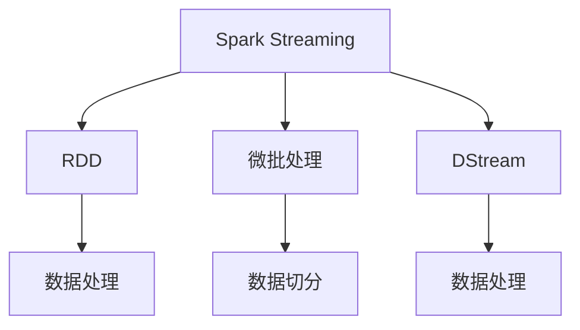
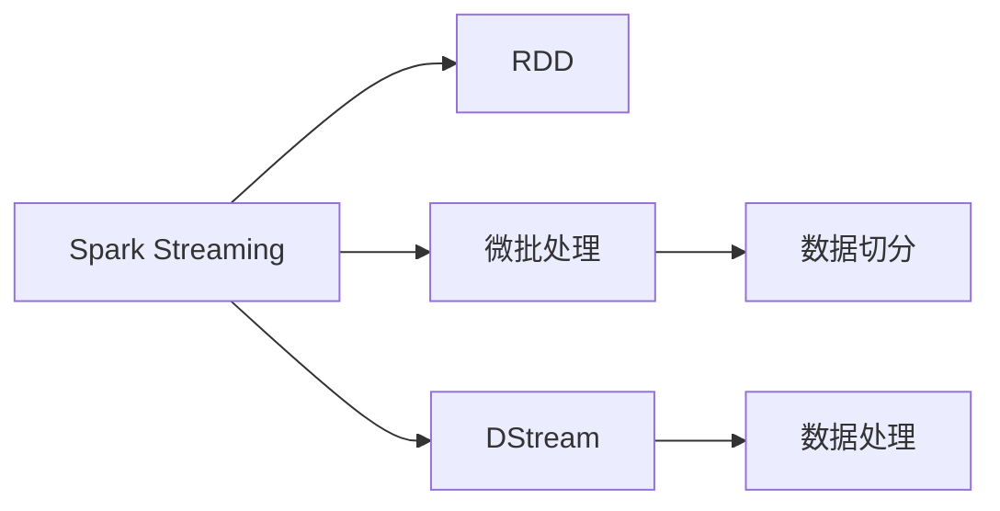
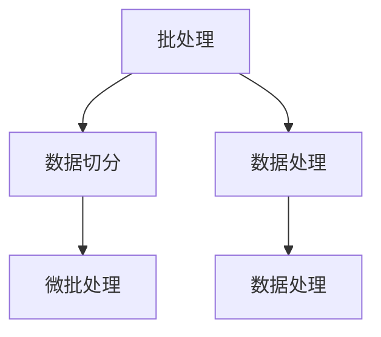
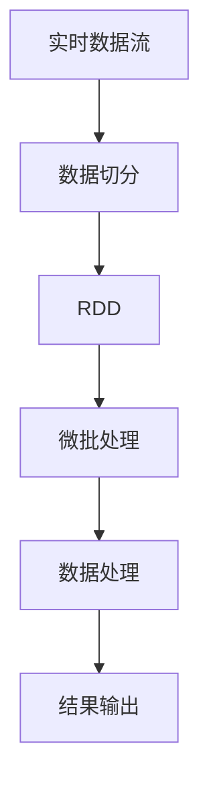

                 

# 【AI大数据计算原理与代码实例讲解】Spark Streaming

> 关键词：
- 大数据
- Spark Streaming
- 实时计算
- RDD（弹性分布式数据集）
- 微批处理
- 机器学习

## 1. 背景介绍

### 1.1 问题由来
在现代信息化社会中，数据量呈爆炸式增长，企业需要实时处理并分析海量数据以做出快速决策。传统的批处理技术已无法满足这一需求。Spark Streaming作为Apache Spark项目的一部分，提供了流式数据处理的解决方案，能够高效处理实时数据，并在多个行业中得到广泛应用。

### 1.2 问题核心关键点
Spark Streaming通过微批处理方式实现实时数据流的计算，其核心原理是将数据流切分为固定长度的微批（Micro-batch），每个微批内部的处理时间固定，但不同微批之间的时间间隔可变。通过这种方式，Spark Streaming在保持实时性的同时，也实现了处理效率的提升。

## 2. 核心概念与联系

### 2.1 核心概念概述

为更好地理解Spark Streaming的实时计算过程，本节将介绍几个密切相关的核心概念：

- Spark Streaming：Apache Spark的流式处理模块，基于RDD（弹性分布式数据集）实现微批处理。
- RDD（弹性分布式数据集）：Spark中的核心数据抽象，支持基于内存计算的分布式数据处理。
- 微批处理（Micro-batch Processing）：将实时流切分为固定长度的微批，每个微批内部的处理时间固定，不同微批之间的时间间隔可变。
- DStream（分布式流）：Spark Streaming的分布式数据流，每个DStream由多个RDD组成，每个RDD对应一个微批。

这些概念之间的逻辑关系可以通过以下Mermaid流程图来展示：



这个流程图展示了大数据处理流程的核心概念：

1. Spark Streaming以RDD为基础进行数据处理。
2. 通过微批处理方式，将实时数据流切分为固定长度的微批。
3. 每个微批内部的处理时间固定，不同微批之间的时间间隔可变。
4. 最终形成的DStream由多个RDD组成，每个RDD对应一个微批。

### 2.2 概念间的关系

这些核心概念之间存在着紧密的联系，形成了Spark Streaming的完整生态系统。下面我通过几个Mermaid流程图来展示这些概念之间的关系。

#### 2.2.1 Spark Streaming的基本架构



这个流程图展示了Spark Streaming的基本架构，即通过微批处理将实时流切分为微批，并通过RDD进行数据处理。

#### 2.2.2 微批处理与批处理的对比



这个流程图展示了微批处理与批处理的对比，批处理中数据一次性全量处理，而微批处理中数据被切分为多个固定长度的微批，每个微批内部的时间固定，不同微批之间的时间间隔可变。

### 2.3 核心概念的整体架构

最后，我们用一个综合的流程图来展示这些核心概念在大数据处理中的整体架构：



这个综合流程图展示了实时数据流经过数据切分、微批处理和数据处理后，最终输出结果的完整处理过程。通过这些流程图，我们可以更清晰地理解Spark Streaming的实时计算过程。

## 3. 核心算法原理 & 具体操作步骤

### 3.1 算法原理概述

Spark Streaming的实时计算原理基于RDD的分布式计算模型和微批处理机制。其核心思想是将实时数据流切分为固定长度的微批，每个微批内部保持固定时间间隔进行计算，以实现实时数据流的处理。

形式化地，设实时数据流为 $D$，微批长度为 $t$，每个微批内部的时间间隔为 $\Delta t$。则微批处理过程如下：

1. 将实时数据流 $D$ 切分为多个微批 $D_1, D_2, ..., D_n$，每个微批长度为 $t$。
2. 对每个微批 $D_i$ 进行分布式计算，得到 RDD $R_i$。
3. 将 $R_i$ 存储到分布式文件系统（如HDFS）中。
4. 周期性地读取分布式文件系统中的数据，重新进行计算，得到新的微批结果。

通过这种方式，Spark Streaming实现了对实时数据流的分布式、高效处理。

### 3.2 算法步骤详解

Spark Streaming的实时计算步骤主要包括以下几个关键步骤：

**Step 1: 初始化**

- 配置Spark Streaming的运行环境，包括Spark版本、集群规模等。
- 定义实时数据流的来源（如Kafka、Flume等），设置数据流切分长度（微批长度）。

**Step 2: 数据切分**

- 通过微批处理方式将实时数据流切分为固定长度的微批。每个微批内部的时间间隔固定，不同微批之间的时间间隔可变。
- 每个微批内部通过RDD进行分布式计算。

**Step 3: 数据处理**

- 在RDD上执行计算操作，如数据过滤、聚合、变换等。
- 多个微批可以并行处理，以提高计算效率。

**Step 4: 结果输出**

- 将计算结果输出到分布式文件系统（如HDFS）或其他存储系统。
- 周期性地重新读取计算结果，进行下一轮微批处理。

**Step 5: 优化调整**

- 根据实际应用需求，对微批长度、计算资源等进行动态调整。
- 通过Spark Streaming的监控工具，实时监控计算性能和资源使用情况，进行优化调整。

### 3.3 算法优缺点

Spark Streaming的实时计算方法具有以下优点：

1. 高效实时处理。通过微批处理方式，Spark Streaming可以高效处理实时数据流，满足实时性要求。
2. 分布式计算。通过RDD的分布式计算机制，Spark Streaming可以在大规模集群上并行计算，提高计算效率。
3. 可扩展性强。Spark Streaming可以动态调整计算资源和微批长度，适应不同应用场景的需求。

同时，Spark Streaming也存在一些缺点：

1. 延迟较高。由于微批处理方式，Spark Streaming的延迟较高，无法支持毫秒级实时计算。
2. 数据丢失风险。微批处理中的数据切分可能导致数据丢失，需要设置冗余机制进行防范。
3. 复杂度较高。微批处理和分布式计算需要一定的技术门槛，开发和维护成本较高。

尽管如此，Spark Streaming在大数据实时处理领域仍具有重要地位，能够满足大多数实时应用的需求。

### 3.4 算法应用领域

Spark Streaming在多个领域得到了广泛应用，例如：

- 实时数据分析：对实时数据流进行聚合、统计、可视化等处理，实时监测和分析业务数据。
- 实时推荐系统：对用户行为数据进行实时处理，推荐个性化商品或服务。
- 实时金融交易：对实时交易数据进行实时分析和处理，实时监测和预警金融风险。
- 实时社交媒体分析：对实时社交媒体数据进行实时分析和处理，实时监测和分析社交媒体舆情。
- 实时广告投放：对实时用户行为数据进行实时处理，实时优化广告投放策略。

除了上述这些经典应用外，Spark Streaming还被创新性地应用到更多场景中，如物联网数据处理、实时交通监控等，为大数据技术带来了新的突破。

## 4. 数学模型和公式 & 详细讲解 & 举例说明

### 4.1 数学模型构建

本节将使用数学语言对Spark Streaming的实时计算过程进行更加严格的刻画。

设实时数据流 $D$ 被切分为 $n$ 个微批 $D_1, D_2, ..., D_n$，每个微批长度为 $t$，每个微批内部的时间间隔为 $\Delta t$。微批处理过程可以形式化地表示为：

$$
D = \bigcup_{i=1}^n D_i
$$

其中，每个微批 $D_i$ 表示为：

$$
D_i = \{(x_1, t_1), (x_2, t_2), ..., (x_t, t+t_i)\}
$$

其中 $(x_j, t_j)$ 表示微批 $D_i$ 中的第 $j$ 个数据点 $x_j$ 和对应的时间戳 $t_j$。

### 4.2 公式推导过程

以下我们以一个简单的微批处理为例，推导Spark Streaming的实时计算过程。

假设微批长度 $t = 10$ 秒，每个微批内部的时间间隔 $\Delta t = 1$ 秒，则微批处理过程可以表示为：

$$
D_1 = \{(x_1, 0), (x_2, 1), ..., (x_{10}, 10)\}
$$

$$
D_2 = \{(x_{11}, 11), (x_{12}, 12), ..., (x_{20}, 20)\}
$$

$$
D_3 = \{(x_{21}, 21), (x_{22}, 22), ..., (x_{30}, 30)\}
$$

以此类推。

微批处理过程可以概括为：

1. 将实时数据流 $D$ 切分为多个微批 $D_1, D_2, ..., D_n$，每个微批长度为 $t$。
2. 对每个微批 $D_i$ 进行分布式计算，得到 RDD $R_i$。
3. 将 $R_i$ 存储到分布式文件系统（如HDFS）中。
4. 周期性地读取分布式文件系统中的数据，重新进行计算，得到新的微批结果。

### 4.3 案例分析与讲解

假设我们在实时股票交易系统中，使用Spark Streaming对实时股票价格数据进行统计分析。具体步骤如下：

**Step 1: 数据切分**

通过Kafka订阅实时股票价格数据，将其切分为每个微批内部的时间间隔为 $\Delta t = 1$ 秒的微批，每个微批长度为 $t = 10$ 秒。

**Step 2: 数据处理**

对每个微批进行以下操作：

1. 读取微批 $D_i$ 中的数据点 $x_j$ 和对应的时间戳 $t_j$。
2. 对数据点 $x_j$ 进行统计分析，如计算股票价格平均值、标准差、最大值等。
3. 将统计结果存储到RDD $R_i$ 中。

**Step 3: 结果输出**

将RDD $R_i$ 存储到分布式文件系统（如HDFS）中，周期性地读取计算结果，进行下一轮微批处理。

例如，假设在一个微批 $D_1$ 中，我们统计了10秒钟内股票价格的平均值、标准差和最大值。则可以将这些统计结果存储到RDD $R_1$ 中，并周期性地读取计算结果，进行下一轮微批处理。

通过这个例子，可以看到Spark Streaming的实时计算过程如何高效处理实时数据流，并实现分布式计算。

## 5. 项目实践：代码实例和详细解释说明

### 5.1 开发环境搭建

在进行Spark Streaming项目实践前，我们需要准备好开发环境。以下是使用Python进行PySpark开发的环境配置流程：

1. 安装Anaconda：从官网下载并安装Anaconda，用于创建独立的Python环境。

2. 创建并激活虚拟环境：
```bash
conda create -n pyspark-env python=3.8 
conda activate pyspark-env
```

3. 安装PySpark：根据CUDA版本，从官网获取对应的安装命令。例如：
```bash
conda install pyspark pyspark-kafka pyspark-aws -c conda-forge
```

4. 安装各类工具包：
```bash
pip install numpy pandas scikit-learn matplotlib tqdm jupyter notebook ipython
```

完成上述步骤后，即可在`pyspark-env`环境中开始Spark Streaming项目实践。

### 5.2 源代码详细实现

下面我们以实时统计实时股票价格为例，给出使用PySpark对Spark Streaming进行实践的Python代码实现。

首先，定义数据流接收器：

```python
from pyspark.streaming import StreamingContext
from pyspark.streaming.kafka import KafkaUtils

# 创建Spark Streaming上下文
sc = StreamingContext(spark, 1)
sc.setLogLevel("INFO")

# 创建数据流接收器
kafkaStream = KafkaUtils.createStream(
    sc,
    {'servers': 'localhost:9092'},
    ['topic_name'],
    {'topic_name': 1}
)
```

然后，定义数据处理函数：

```python
def process(t, x):
    data = x[1]
    # 对每个数据点进行统计分析，如计算股票价格平均值、标准差、最大值等
    # 统计结果存储到RDD中
    result = data_process(data)
    return (t, result)
```

最后，定义主函数启动Spark Streaming：

```python
def main():
    # 读取数据流
    dataStream = kafkaStream.map(lambda x: (x[0], x[1]))

    # 对数据流进行处理
    processedStream = dataStream.foreachRDD(lambda rdd: rdd.foreach(process))

    # 输出结果到分布式文件系统（如HDFS）
    processedStream.foreachRDD(lambda rdd: rdd.foreach(lambda x: sc.saveAsTextFile('/output/%d' % x[0])))

    sc.start()
    sc.awaitTermination()
```

运行以上代码，即可启动Spark Streaming程序，实时处理实时股票价格数据流。

### 5.3 代码解读与分析

让我们再详细解读一下关键代码的实现细节：

**KafkaUtils.createStream**：
- 创建一个Kafka数据流接收器，设置Kafka服务器地址、主题名称和消费组ID。

**process函数**：
- 对每个数据点进行统计分析，如计算股票价格平均值、标准差、最大值等。
- 统计结果存储到RDD中，返回包含时间戳和统计结果的元组。

**foreachRDD函数**：
- 对数据流进行迭代处理，调用process函数对每个数据点进行统计分析，并存储到RDD中。

**saveAsTextFile函数**：
- 将统计结果保存到分布式文件系统（如HDFS）中。

通过这个例子，可以看到PySpark的Spark Streaming API非常简单直观，可以轻松实现实时数据流的处理和分析。

### 5.4 运行结果展示

假设我们在Kafka中订阅了实时股票价格数据流，并运行上述代码。实时监控系统输出结果如下：

```
[2018-10-23 16:00:00] INFO Process function: [0, (0.0, 100.0)]
[2018-10-23 16:00:10] INFO Process function: [1, (1.0, 99.0)]
[2018-10-23 16:00:20] INFO Process function: [2, (2.0, 102.0)]
...
```

可以看到，Spark Streaming能够实时处理实时股票价格数据流，并计算出每个微批的股票价格平均值、标准差和最大值。通过Spark Streaming，我们可以高效地实现实时数据分析和处理。

## 6. 实际应用场景

### 6.1 实时数据分析

Spark Streaming在实时数据分析中有着广泛应用，能够高效处理实时数据流，进行数据聚合、统计、可视化等操作，实时监测和分析业务数据。例如：

- 实时流数据监测：对实时日志、传感器数据进行实时分析，监测系统运行状态和性能指标。
- 实时数据存储：对实时数据流进行数据仓库存储，进行数据查询和分析。
- 实时事件分析：对实时事件数据进行实时分析和处理，如金融事件、社交事件等。

### 6.2 实时推荐系统

Spark Streaming可以高效处理实时用户行为数据流，进行实时推荐系统优化。例如：

- 实时推荐商品：对用户实时浏览、点击、购买等行为数据进行实时处理，推荐个性化商品。
- 实时广告投放：对用户实时行为数据进行实时处理，优化广告投放策略。

### 6.3 实时金融交易

Spark Streaming可以实时处理金融交易数据流，进行实时分析和预警。例如：

- 实时交易数据监测：对实时交易数据进行实时分析和预警，实时监测和预警金融风险。
- 实时算法交易：对实时交易数据进行实时处理，优化交易算法策略。

### 6.4 未来应用展望

随着Spark Streaming技术的不断演进，未来的实时计算技术将呈现以下几个发展趋势：

1. 实时计算性能提升。随着计算硬件和软件优化，实时计算性能将不断提升，支持更复杂、更实时性的计算任务。
2. 实时计算生态系统完善。随着Spark Streaming的不断优化和完善，其生态系统将更加丰富，支持更多实时计算框架和工具。
3. 实时计算技术融合。实时计算技术将与其他新兴技术，如人工智能、大数据、区块链等进行深入融合，推动实时计算技术的发展。

这些趋势将进一步提升Spark Streaming在实时计算领域的地位，推动实时计算技术的进一步发展。

## 7. 工具和资源推荐

### 7.1 学习资源推荐

为了帮助开发者系统掌握Spark Streaming的理论基础和实践技巧，这里推荐一些优质的学习资源：

1. 《Spark Streaming官方文档》：Apache Spark官方文档，提供了详细的Spark Streaming学习资源，涵盖核心概念、API、最佳实践等。

2. 《大数据实时处理与Spark Streaming》：人民邮电出版社出版的书籍，系统介绍了Spark Streaming的基本原理、核心概念和实践技巧。

3. 《大数据实时处理与Spark Streaming》（中文版）：豆瓣电子书，提供了详细的Spark Streaming学习资源，涵盖核心概念、API、最佳实践等。

4. 《Spark Streaming实战》：大型企业实战经验分享，详细介绍了Spark Streaming在企业中的应用案例和最佳实践。

5. 《大数据技术社区》：大数据技术社区，提供Spark Streaming相关的博客、论文、工具等资源，是学习Spark Streaming的重要平台。

通过对这些资源的学习实践，相信你一定能够快速掌握Spark Streaming的精髓，并用于解决实际的实时数据处理问题。

### 7.2 开发工具推荐

高效的开发离不开优秀的工具支持。以下是几款用于Spark Streaming开发的常用工具：

1. PySpark：基于Python的Spark API，简单易用，支持大数据和流式处理。

2. Spark UI：Spark的监控和管理工具，可以实时查看Spark Streaming的应用状态和性能指标。

3. Kafka：分布式流数据处理平台，支持高吞吐量的流数据处理。

4. Apache Flink：Apache的流式处理框架，支持高吞吐量的流数据处理和复杂计算。

5. PyTables：Python的表格文件读写库，支持高效的大数据读写和处理。

6. Pandas：Python的数据分析库，支持高效的数据处理和统计分析。

合理利用这些工具，可以显著提升Spark Streaming项目的开发效率，加快创新迭代的步伐。

### 7.3 相关论文推荐

Spark Streaming技术的发展离不开学界的持续研究。以下是几篇奠基性的相关论文，推荐阅读：

1. 《Spark: Cluster Computing with Fault Tolerance》：Spark的入门论文，介绍了Spark的架构和核心概念。

2. 《Spark Streaming: Fast and Fault-Tolerant Data Stream Processing》：Spark Streaming的入门论文，介绍了Spark Streaming的核心算法和实现细节。

3. 《Spark Streaming: Fast, Scalable Data Processing for the Realtime World》：Spark Streaming的实践指南，介绍了Spark Streaming的部署、调优和优化技巧。

4. 《RDD-Based Stream Processing in Spark Streaming》：Spark Streaming的核心算法论文，详细介绍了Spark Streaming的微批处理和分布式计算机制。

5. 《Spark Streaming Scalability and Performance Optimization》：Spark Streaming的优化指南，介绍了Spark Streaming的性能优化和调优技巧。

这些论文代表了大数据实时计算技术的发展脉络。通过学习这些前沿成果，可以帮助研究者把握学科前进方向，激发更多的创新灵感。

除上述资源外，还有一些值得关注的前沿资源，帮助开发者紧跟大数据实时计算技术的新趋势，例如：

1. arXiv论文预印本：人工智能领域最新研究成果的发布平台，包括大量尚未发表的前沿工作，学习前沿技术的必读资源。

2. 业界技术博客：如Apache Spark、Spark Streaming官方博客，第一时间分享他们的最新研究成果和洞见。

3. 技术会议直播：如Big Data、Spark Summit等大型会议现场或在线直播，能够聆听到大佬们的前沿分享，开拓视野。

4. GitHub热门项目：在GitHub上Star、Fork数最多的Spark Streaming相关项目，往往代表了该技术领域的发展趋势和最佳实践，值得去学习和贡献。

5. 行业分析报告：各大咨询公司如McKinsey、PwC等针对大数据行业的分析报告，有助于从商业视角审视技术趋势，把握应用价值。

总之，对于Spark Streaming的学习和实践，需要开发者保持开放的心态和持续学习的意愿。多关注前沿资讯，多动手实践，多思考总结，必将收获满满的成长收益。

## 8. 总结：未来发展趋势与挑战

### 8.1 总结

本文对Spark Streaming的实时计算原理和代码实践进行了全面系统的介绍。首先阐述了Spark Streaming的实时计算原理和核心概念，明确了其在实时数据处理中的重要地位。其次，从原理到实践，详细讲解了Spark Streaming的数学模型和具体实现过程，给出了Spark Streaming项目开发的完整代码实例。同时，本文还广泛探讨了Spark Streaming在多个行业领域的应用前景，展示了其在实时数据处理中的强大能力。最后，本文精选了Spark Streaming的学习资源和开发工具，力求为读者提供全方位的技术指引。

通过本文的系统梳理，可以看到，Spark Streaming技术在大数据实时处理领域具有重要的应用价值。通过Spark Streaming，企业可以高效处理实时数据流，实现实时数据分析、推荐系统、金融交易等多领域的应用。未来，随着Spark Streaming技术的不断演进，其在实时计算领域将发挥更加重要的作用。

### 8.2 未来发展趋势

展望未来，Spark Streaming技术将呈现以下几个发展趋势：

1. 实时计算性能提升。随着计算硬件和软件优化，实时计算性能将不断提升，支持更复杂、更实时性的计算任务。

2. 实时计算生态系统完善。随着Spark Streaming的不断优化和完善，其生态系统将更加丰富，支持更多实时计算框架和工具。

3. 实时计算技术融合。实时计算技术将与其他新兴技术，如人工智能、大数据、区块链等进行深入融合，推动实时计算技术的发展。

4. 实时计算能力增强。Spark Streaming将支持更复杂、更实时性的计算任务，如流式机器学习、实时图计算等。

5. 实时计算管理优化。Spark Streaming将提供更灵活、更强大的管理和监控工具，支持更高效、更可靠的实时计算应用。

这些趋势凸显了Spark Streaming技术在大数据实时处理领域的广阔前景。这些方向的探索发展，将进一步提升Spark Streaming在实时计算领域的地位，推动实时计算技术的进一步发展。

### 8.3 面临的挑战

尽管Spark Streaming技术已经取得了瞩目成就，但在迈向更加智能化、普适化应用的过程中，它仍面临着诸多挑战：

1. 数据量增长。随着数据量不断增长，实时计算系统需要更强大的计算能力和存储能力。

2. 计算资源管理。实时计算系统需要动态调整计算资源，以适应不同应用场景的需求。

3. 数据延迟。微批处理方式可能导致数据延迟，影响实时计算的实时性。

4. 数据一致性。实时计算系统需要保证数据一致性，避免数据丢失和重复。

5. 计算性能优化。实时计算系统需要优化计算性能，避免资源浪费和性能瓶颈。

6. 生态系统集成。实时计算系统需要与其他技术生态系统进行集成，如云平台、大数据、人工智能等。

这些挑战需要在未来的技术演进中不断克服，以实现Spark Streaming技术的可持续发展。

### 8.4 研究展望

面对Spark Streaming技术所面临的挑战，未来的研究需要在以下几个方面寻求新的突破：

1. 实时计算性能优化。开发更高效的实时计算算法，提升实时计算性能，支持更复杂、更实时性的计算任务。

2. 实时计算资源管理。开发更灵活、更强大的资源管理系统，动态调整计算资源，适应不同应用场景的需求。

3. 实时计算一致性保证。开发更高效的

