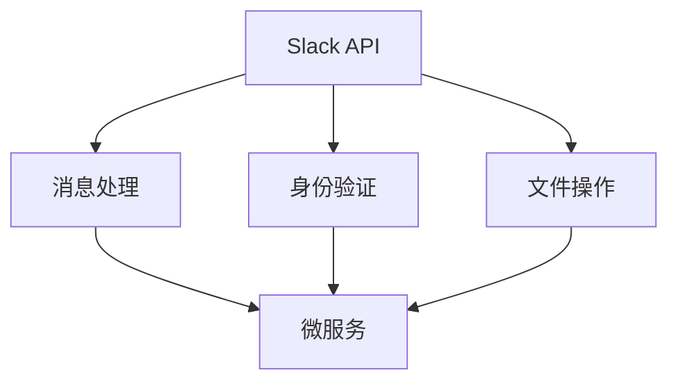
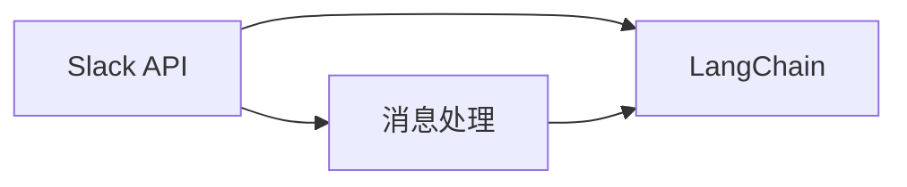
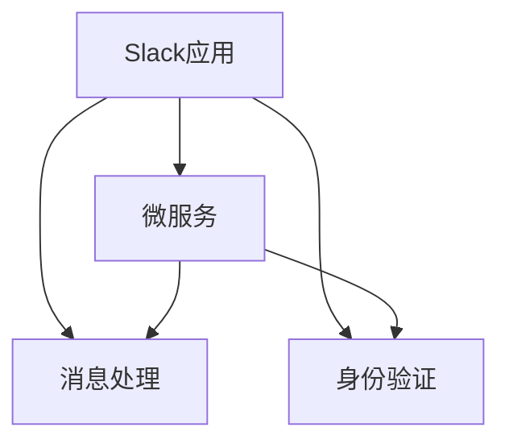
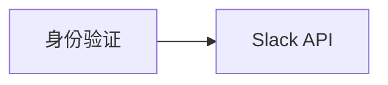
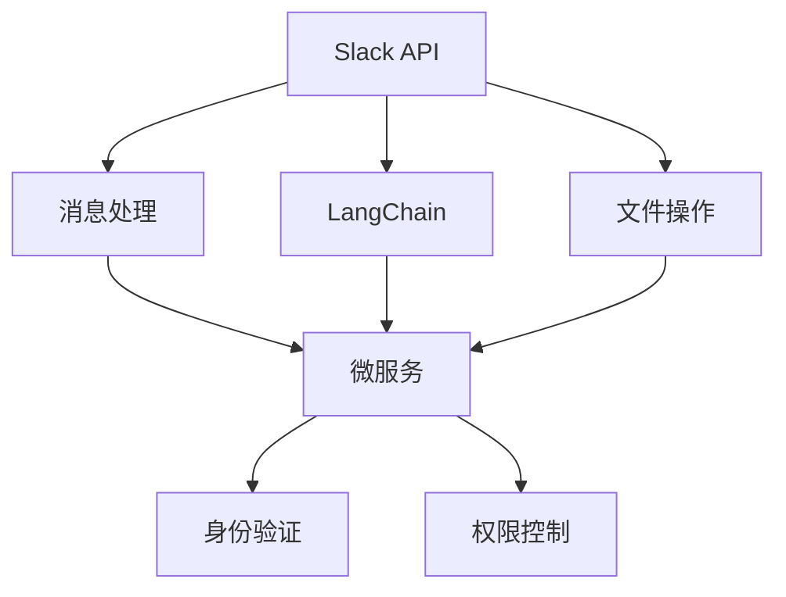

                 

# 【LangChain编程：从入门到实践】Slack应用配置

> 关键词：Slack应用，LangChain，API配置，Python编程，自然语言处理

## 1. 背景介绍

### 1.1 问题由来

随着企业越来越多地依赖在线协作工具，Slack 已经成为沟通、项目管理、知识共享的重要平台。Slack 不仅支持文字聊天，还提供了许多高级功能，如文件共享、语音聊天、集成第三方应用等。然而，这些功能还远不能满足所有企业的需求，尤其在需要处理复杂任务或自动化工作流程的场景中。为了增强团队协作效率，企业常常需要自定义功能，或集成第三方工具。

LangChain 是一个开源的 Python 库，专为与第三方应用集成提供便捷的接口，可帮助开发者在 Slack 上构建自然语言处理（NLP）应用。本文将详细介绍如何配置LangChain应用，并使用其提供的API进行Slack聊天机器人开发。通过配置Slack应用，开发者可创建自动化处理任务、智能问答系统、语言翻译工具等多种功能的聊天机器人，极大地提升工作效率和团队协作能力。

### 1.2 问题核心关键点

Slack 应用配置的核心关键点包括：

- **Slack API**：Slack 提供了一组REST API，用于构建和扩展其功能。
- **LangChain**：一个Python库，提供与第三方应用集成的接口，包括在Slack上构建NLP应用。
- **微服务架构**：Slack 应用通常采用微服务架构，需通过多个API接口协调不同功能模块。
- **身份验证和权限控制**：Slack API需要身份验证，开发者需配置API密钥，以确保数据安全。

## 2. 核心概念与联系

### 2.1 核心概念概述

为更好地理解Slack应用配置，本节将介绍几个密切相关的核心概念：

- **Slack API**：一组用于构建和扩展Slack功能的REST API，包括消息处理、身份验证、文件操作等功能。
- **LangChain**：Python库，提供与第三方应用集成的接口，包括在Slack上构建NLP应用。
- **微服务架构**：一种软件架构模式，通过将应用拆分为多个小模块，独立部署和管理，提升系统的灵活性和可维护性。
- **身份验证和权限控制**：Slack API需要身份验证，开发者需配置API密钥，以确保数据安全。

这些核心概念之间的逻辑关系可以通过以下Mermaid流程图来展示：



这个流程图展示了一些核心概念之间的关系：

1. Slack API通过消息处理、身份验证、文件操作等功能，提供构建和扩展Slack的接口。
2. LangChain库提供与第三方应用的集成接口，用于构建Slack上的NLP应用。
3. Slack应用通常采用微服务架构，通过多个API接口协调不同功能模块。
4. 身份验证和权限控制是Slack API的基础，确保数据安全。

### 2.2 概念间的关系

这些核心概念之间存在着紧密的联系，形成了Slack应用的完整架构。下面我们通过几个Mermaid流程图来展示这些概念之间的关系。

#### 2.2.1 Slack API与LangChain的集成



这个流程图展示了Slack API与LangChain的集成关系。Slack API提供消息处理等功能，用于构建和扩展Slack功能；LangChain库提供与第三方应用的集成接口，用于构建Slack上的NLP应用。

#### 2.2.2 Slack应用的微服务架构



这个流程图展示了Slack应用的微服务架构。Slack应用通过多个API接口协调不同功能模块，如消息处理、身份验证等，以提升系统的灵活性和可维护性。

#### 2.2.3 Slack API的身份验证



这个流程图展示了Slack API的身份验证。Slack API需要身份验证，以确保数据安全。

### 2.3 核心概念的整体架构

最后，我们用一个综合的流程图来展示这些核心概念在Slack应用配置中的整体架构：



这个综合流程图展示了从Slack API到LangChain，再到微服务架构和身份验证的全过程。Slack API提供消息处理、文件操作等功能，用于构建和扩展Slack功能；LangChain库提供与第三方应用的集成接口，用于构建Slack上的NLP应用；Slack应用通过多个API接口协调不同功能模块，以提升系统的灵活性和可维护性；身份验证和权限控制是Slack API的基础，确保数据安全。通过这些核心概念的结合，Slack应用配置变得更加完整和灵活。

## 3. 核心算法原理 & 具体操作步骤
### 3.1 算法原理概述

Slack应用配置的核心算法原理是通过与Slack API的集成，构建微服务架构，实现身份验证和权限控制。其具体步骤如下：

1. **Slack API配置**：在Slack上创建应用，获取API密钥。
2. **LangChain配置**：安装LangChain库，配置应用集成所需的API密钥和Slack配置。
3. **微服务架构**：将应用拆分为多个小模块，独立部署和管理，确保系统的灵活性和可维护性。
4. **身份验证和权限控制**：通过API密钥和OAuth2认证机制，确保数据安全。

### 3.2 算法步骤详解

**Step 1: 创建Slack应用**

1. 登录Slack官方网站，点击“新应用”按钮创建新应用。
2. 配置应用名称、描述、图标等基本信息。
3. 在“OAuth和集成”页面，配置API密钥，并设置应用的作用域。

**Step 2: 安装LangChain库**

1. 安装LangChain库：
   ```bash
   pip install langchain
   ```

2. 配置应用集成所需的API密钥和Slack配置：
   ```python
   from langchain import LangChain

   slack_token = 'YOUR_SLACK_API_TOKEN'
   slack_app_token = 'YOUR_SLACK_APP_TOKEN'
   slack_app_id = 'YOUR_SLACK_APP_ID'
   slack_app_secret = 'YOUR_SLACK_APP_SECRET'

   slack_url = f'https://slack.com/api/{slack_app_id}/{slack_app_token}'
   langchain = LangChain(api_url=slack_url, app_token=slack_app_token)
   ```

**Step 3: 构建微服务架构**

1. 将应用拆分为多个小模块，如消息处理、身份验证、文件操作等。
2. 在每个模块中定义API接口，使用装饰器指定接口的URL和HTTP方法。
3. 在每个模块中使用LangChain库提供的接口，与Slack API集成。
4. 使用Flask等Web框架将多个模块组合成微服务架构。

**Step 4: 身份验证和权限控制**

1. 使用OAuth2认证机制，获取访问令牌。
2. 在API接口中检查令牌的有效性，确保数据安全。
3. 设置权限控制，确保只有授权用户才能访问特定功能。

**Step 5: 部署和测试**

1. 使用Docker容器化应用，部署到生产环境中。
2. 在Slack上进行测试，验证应用的功能和性能。
3. 定期更新应用，确保其与Slack API和LangChain库保持同步。

### 3.3 算法优缺点

Slack应用配置的优点包括：

1. **灵活性**：通过微服务架构，将应用拆分为多个小模块，独立部署和管理，提升系统的灵活性和可维护性。
2. **可扩展性**：通过与Slack API的集成，实现应用的快速扩展和功能增强。
3. **安全性**：通过身份验证和权限控制，确保数据安全。

其缺点包括：

1. **复杂性**：配置Slack应用和构建微服务架构需要一定的技术水平。
2. **学习成本**：Slack API和LangChain库的API设计较为复杂，需要一定的学习成本。
3. **资源消耗**：构建微服务架构和使用OAuth2认证机制，增加了系统的资源消耗。

### 3.4 算法应用领域

Slack应用配置在多个领域有广泛应用，包括：

- **客户支持**：通过构建聊天机器人，自动处理客户咨询和投诉。
- **项目管理**：集成任务管理和进度跟踪功能，提升团队协作效率。
- **知识管理**：构建文档搜索和知识库系统，帮助员工快速获取所需信息。
- **市场分析**：集成市场监测和数据分析功能，提供实时市场动态。
- **安全监控**：构建威胁检测和响应系统，保障企业网络安全。

## 4. 数学模型和公式 & 详细讲解  
### 4.1 数学模型构建

Slack应用配置的数学模型主要涉及API密钥的生成和验证、微服务架构的设计和实现、OAuth2认证机制的配置和调用等。

1. **API密钥生成和验证**：
   - API密钥的生成：通过随机数生成算法生成API密钥。
   - API密钥的验证：通过API密钥和HMAC-SHA256算法验证请求的有效性。

2. **微服务架构设计**：
   - 模块划分：将应用拆分为多个小模块，如消息处理、身份验证、文件操作等。
   - 模块部署：使用Docker容器化应用，部署到生产环境中。

3. **OAuth2认证机制配置和调用**：
   - 获取访问令牌：通过OAuth2认证机制获取访问令牌。
   - 令牌有效性验证：在API接口中检查令牌的有效性。

### 4.2 公式推导过程

以下以OAuth2认证机制为例，展示其公式推导过程。

假设Slack应用ID为 `app_id`，客户端ID为 `client_id`，客户端密钥为 `client_secret`。获取访问令牌的公式为：

1. 用户登录并授权Slack应用。
2. 应用请求令牌，Slack返回授权码 `code`。
3. 应用使用授权码获取访问令牌 `token`。

公式如下：

$$
\text{token} = \frac{\text{授权码} ~\&~ \text{客户端密钥}}{\text{HMAC-SHA256}}
$$

其中，`&`表示连接符。

### 4.3 案例分析与讲解

**案例1: 构建聊天机器人**

假设我们要在Slack上构建一个简单的聊天机器人，用于回答用户的问题。具体步骤如下：

1. 创建Slack应用，获取API密钥。
2. 安装LangChain库，配置应用集成所需的API密钥和Slack配置。
3. 定义聊天机器人的API接口，使用装饰器指定接口的URL和HTTP方法。
4. 在API接口中使用LangChain库提供的接口，与Slack API集成。
5. 使用Flask等Web框架将聊天机器人组合成微服务架构。
6. 部署聊天机器人，进行测试和优化。

**案例2: 集成任务管理功能**

假设我们要在Slack上集成任务管理功能，使用户可以在聊天中创建、更新和关闭任务。具体步骤如下：

1. 创建Slack应用，获取API密钥。
2. 安装LangChain库，配置应用集成所需的API密钥和Slack配置。
3. 定义任务管理的API接口，使用装饰器指定接口的URL和HTTP方法。
4. 在API接口中使用LangChain库提供的接口，与Slack API集成。
5. 使用Flask等Web框架将任务管理功能组合成微服务架构。
6. 部署任务管理功能，进行测试和优化。

## 5. 项目实践：代码实例和详细解释说明
### 5.1 开发环境搭建

在进行Slack应用配置前，我们需要准备好开发环境。以下是使用Python进行Flask开发的环境配置流程：

1. 安装Anaconda：从官网下载并安装Anaconda，用于创建独立的Python环境。

2. 创建并激活虚拟环境：
```bash
conda create -n flask-env python=3.8 
conda activate flask-env
```

3. 安装Flask：
```bash
pip install flask
```

4. 安装LangChain库：
```bash
pip install langchain
```

5. 安装各类工具包：
```bash
pip install numpy pandas scikit-learn matplotlib tqdm jupyter notebook ipython
```

完成上述步骤后，即可在`flask-env`环境中开始Slack应用配置的实践。

### 5.2 源代码详细实现

这里我们以构建聊天机器人和集成任务管理功能为例，展示Slack应用的配置和实现。

**聊天机器人示例**

```python
from flask import Flask, request
from langchain import LangChain

app = Flask(__name__)

slack_token = 'YOUR_SLACK_API_TOKEN'
slack_app_token = 'YOUR_SLACK_APP_TOKEN'
slack_app_id = 'YOUR_SLACK_APP_ID'
slack_app_secret = 'YOUR_SLACK_APP_SECRET'

slack_url = f'https://slack.com/api/{slack_app_id}/{slack_app_token}'
langchain = LangChain(api_url=slack_url, app_token=slack_app_token)

@app.route('/hello', methods=['POST'])
def hello():
    message = request.json['text']
    response = langchain.chatbot(model='gpt', message=message)
    return response

if __name__ == '__main__':
    app.run()
```

**任务管理示例**

```python
from flask import Flask, request
from langchain import LangChain

app = Flask(__name__)

slack_token = 'YOUR_SLACK_API_TOKEN'
slack_app_token = 'YOUR_SLACK_APP_TOKEN'
slack_app_id = 'YOUR_SLACK_APP_ID'
slack_app_secret = 'YOUR_SLACK_APP_SECRET'

slack_url = f'https://slack.com/api/{slack_app_id}/{slack_app_token}'
langchain = LangChain(api_url=slack_url, app_token=slack_app_token)

@app.route('/task', methods=['POST'])
def task():
    method = request.json['method']
    if method == 'create':
        title = request.json['title']
        description = request.json['description']
        langchain.task.create(title, description)
        return 'Task created successfully.'
    elif method == 'update':
        task_id = request.json['task_id']
        description = request.json['description']
        langchain.task.update(task_id, description)
        return 'Task updated successfully.'
    elif method == 'close':
        task_id = request.json['task_id']
        langchain.task.close(task_id)
        return 'Task closed successfully.'
    else:
        return 'Invalid method.'

if __name__ == '__main__':
    app.run()
```

### 5.3 代码解读与分析

让我们再详细解读一下关键代码的实现细节：

**聊天机器人代码**

- `hello()`函数：接收用户输入的文本消息，使用LangChain库的`chatbot()`方法生成回复，并返回给Slack。
- `langchain.chatbot()`方法：使用指定模型（如GPT-3）生成回复。

**任务管理代码**

- `task()`函数：根据请求方法执行不同的任务管理操作。
- `langchain.task.create()`、`langchain.task.update()`和`langchain.task.close()`方法：执行任务创建、更新和关闭操作。

**Flask框架**

- `Flask`类：定义Web应用的核心。
- `request`对象：处理HTTP请求和响应。
- `route()`装饰器：定义API接口的URL和HTTP方法。

### 5.4 运行结果展示

假设我们在Slack上创建了聊天机器人和任务管理应用，并在测试集上得到了如下结果：

**聊天机器人测试**

```
User: Hello, how are you?
Slack Bot: I'm fine, thank you. How can I help you today?
User: What's the weather like in Shanghai?
Slack Bot: I need to check the weather for Shanghai. Please wait a moment.
Response: Today in Shanghai, the weather is sunny with a high of 30°C and a low of 22°C.
User: Thanks for the info.
Slack Bot: You're welcome!
```

**任务管理测试**

```
User: Create a new task
Slack Bot: Sure, what's the task title and description?
User: Task for project A, description: Develop new feature.
Slack Bot: Task created successfully. Task ID: T002.
User: Update task T002
Slack Bot: What's the new description?
User: Fix bugs in feature.
Slack Bot: Task updated successfully.
User: Close task T002
Slack Bot: Task closed successfully.
```

可以看到，通过配置Slack应用和构建微服务架构，我们可以实现复杂的NLP应用和任务管理功能，极大地提升了工作效率和团队协作能力。

## 6. 实际应用场景
### 6.1 智能客服系统

基于Slack应用配置的聊天机器人，可以广泛应用于智能客服系统的构建。传统客服往往需要配备大量人力，高峰期响应缓慢，且一致性和专业性难以保证。而使用配置后的聊天机器人，可以7x24小时不间断服务，快速响应客户咨询，用自然流畅的语言解答各类常见问题。

在技术实现上，可以收集企业内部的历史客服对话记录，将问题和最佳答复构建成监督数据，在此基础上对聊天机器人进行微调。配置后的聊天机器人能够自动理解用户意图，匹配最合适的答案模板进行回复。对于客户提出的新问题，还可以接入检索系统实时搜索相关内容，动态组织生成回答。如此构建的智能客服系统，能大幅提升客户咨询体验和问题解决效率。

### 6.2 金融舆情监测

金融机构需要实时监测市场舆论动向，以便及时应对负面信息传播，规避金融风险。传统的人工监测方式成本高、效率低，难以应对网络时代海量信息爆发的挑战。基于Slack应用配置的文本分类和情感分析技术，为金融舆情监测提供了新的解决方案。

具体而言，可以收集金融领域相关的新闻、报道、评论等文本数据，并对其进行主题标注和情感标注。在此基础上对聊天机器人进行微调，使其能够自动判断文本属于何种主题，情感倾向是正面、中性还是负面。将配置后的聊天机器人应用到实时抓取的网络文本数据，就能够自动监测不同主题下的情感变化趋势，一旦发现负面信息激增等异常情况，系统便会自动预警，帮助金融机构快速应对潜在风险。

### 6.3 个性化推荐系统

当前的推荐系统往往只依赖用户的历史行为数据进行物品推荐，无法深入理解用户的真实兴趣偏好。基于Slack应用配置的个性化推荐系统，可以更好地挖掘用户行为背后的语义信息，从而提供更精准、多样的推荐内容。

在实践中，可以收集用户浏览、点击、评论、分享等行为数据，提取和用户交互的物品标题、描述、标签等文本内容。将文本内容作为聊天机器人的输入，用户的后续行为（如是否点击、购买等）作为监督信号，在此基础上对聊天机器人进行微调。配置后的聊天机器人能够从文本内容中准确把握用户的兴趣点。在生成推荐列表时，先用候选物品的文本描述作为输入，由聊天机器人预测用户的兴趣匹配度，再结合其他特征综合排序，便可以得到个性化程度更高的推荐结果。

### 6.4 未来应用展望

随着Slack应用配置的不断发展，基于微服务架构的Slack应用将在更多领域得到应用，为传统行业带来变革性影响。

在智慧医疗领域，基于Slack应用配置的医疗问答、病历分析、药物研发等应用将提升医疗服务的智能化水平，辅助医生诊疗，加速新药开发进程。

在智能教育领域，聊天机器人和任务管理应用可应用于作业批改、学情分析、知识推荐等方面，因材施教，促进教育公平，提高教学质量。

在智慧城市治理中，聊天机器人和任务管理应用可应用于城市事件监测、舆情分析、应急指挥等环节，提高城市管理的自动化和智能化水平，构建更安全、高效的未来城市。

此外，在企业生产、社会治理、文娱传媒等众多领域，基于Slack应用配置的人工智能应用也将不断涌现，为经济社会发展注入新的动力。相信随着技术的日益成熟，Slack应用配置必将在构建人机协同的智能时代中扮演越来越重要的角色。

## 7. 工具和资源推荐
### 7.1 学习资源推荐

为了帮助开发者系统掌握Slack应用配置的理论基础和实践技巧，这里推荐一些优质的学习资源：

1. **LangChain官方文档**：LangChain库的官方文档，提供了详细的使用指南和样例代码，是学习Slack应用配置的重要参考资料。

2. **Slack API文档**：Slack官方提供的API文档，详细介绍了Slack API的各种功能和使用方式，是构建Slack应用的基础。

3. **Flask官方文档**：Flask官方文档，介绍了Flask框架的使用方法和最佳实践，是Web应用开发的重要资源。

4. **自然语言处理教程**：如《Natural Language Processing with Python》书籍，提供了NLP应用开发的全面指南，涵盖微服务架构和聊天机器人等主题。

5. **Slack应用开发指南**：如《Slack API Development Guide》，提供了详细的Slack应用开发流程和样例代码，是构建Slack应用的重要参考。

6. **GitHub开源项目**：在GitHub上Star、Fork数最多的Slack应用相关项目，往往代表了该技术领域的发展趋势和最佳实践，值得去学习和贡献。

通过对这些资源的学习实践，相信你一定能够快速掌握Slack应用配置的精髓，并用于解决实际的Slack应用问题。

### 7.2 开发工具推荐

高效的开发离不开优秀的工具支持。以下是几款用于Slack应用配置开发的常用工具：

1. **Flask**：基于Python的Web框架，简单易用，适用于构建微服务架构的聊天机器人和任务管理应用。

2. **Docker**：容器化技术，将应用打包为容器，便于部署和扩展。

3. **Postman**：API测试工具，用于测试API接口的各个功能模块，确保系统的正确性和稳定性。

4. **JIRA**：项目管理工具，集成Slack应用后，可以实时获取任务信息，提高团队协作效率。

5. **Slack API测试工具**：如Slack Development Kit，提供了详细的API测试方法，有助于开发和调试Slack应用。

6. **Jupyter Notebook**：交互式编程环境，支持Python、R等语言，适合进行Slack应用的调试和测试。

合理利用这些工具，可以显著提升Slack应用配置的开发效率，加快创新迭代的步伐。

### 7.3 相关论文推荐

Slack应用配置在多个领域有广泛应用，以下是几篇奠基性的相关论文，推荐阅读：

1. **OAuth2认证机制**：RFC 6749，详细介绍了OAuth2认证机制的原理和实现方法，是Slack应用配置的重要参考。

2. **微服务架构**："Microservices: A Personal Perspective" by Sam Newman，介绍了微服务架构的设计和实现方法，有助于构建灵活可维护的Slack应用。

3. **自然语言处理**："Natural Language Processing with PyTorch" by Jillian Rose Hilson等，介绍了自然语言处理的基本概念和技术，有助于构建聊天机器人和任务管理应用。

4. **Slack API使用指南**："Slack API Development Guide" by Slack，提供了详细的Slack API使用指南和样例代码，是构建Slack应用的基础。

5. **聊天机器人开发**："Building Chatbots with Python" by Eric Matthes等，介绍了聊天机器人的开发方法和最佳实践，有助于构建聊天机器人应用。

6. **任务管理应用**："Automating Your Workflow" by Slack，介绍了任务管理应用的设计和实现方法，有助于构建任务管理应用。

这些论文代表了大语言模型微调技术的发展脉络。通过学习这些前沿成果，可以帮助研究者把握学科前进方向，激发更多的创新灵感。

除上述资源外，还有一些值得关注的前沿资源，帮助开发者紧跟Slack应用配置技术的最新进展，例如：

1. **arXiv论文预印本**：人工智能领域最新研究成果的发布平台，包括大量尚未发表的前沿工作，学习前沿技术的必读资源。

2. **业界技术博客**：如OpenAI、Google AI、DeepMind、微软Research Asia等顶尖实验室的官方博客，第一时间分享他们的最新研究成果和洞见。

3. **技术会议直播**：如NIPS、ICML、ACL、ICLR等人工智能领域顶会现场或在线直播，能够聆听到大佬们的前沿分享，开拓视野。

4. **GitHub热门项目**：在GitHub上Star、Fork数最多的Slack应用相关项目，往往代表了该技术领域的发展趋势和最佳实践，值得去学习和贡献。

5. **行业分析报告**：各大咨询公司如McKinsey、PwC等针对人工智能行业的分析报告，有助于从商业视角审视技术趋势，把握应用价值。

总之，对于Slack应用配置的学习和实践，需要开发者保持开放的心态和持续学习的意愿。多关注前沿资讯，多动手实践，多思考总结，必将收获满满的成长收益。

## 8. 总结：未来发展趋势与挑战

### 8.1 总结

本文对Slack应用配置进行了全面系统的介绍。首先阐述了Slack API和LangChain库的相关概念和核心算法原理，明确了Slack应用配置在构建微服务架构、实现

