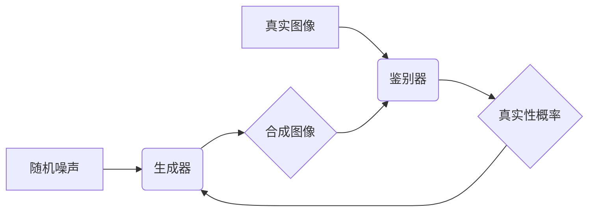

## 基于生成对抗网络的风景照片转换为油画风格的研究

> 关键词：生成对抗网络（GAN）、风景照片、油画风格转换、图像生成、深度学习

## 1. 背景介绍

随着深度学习技术的快速发展，图像生成领域取得了令人瞩目的进展。生成对抗网络（Generative Adversarial Networks，GAN）作为图像生成领域最具代表性的模型之一，凭借其强大的生成能力，在图像修复、超分辨率、图像风格迁移等领域展现出巨大的应用潜力。

风景照片风格迁移一直是计算机视觉领域的研究热点之一。传统的风格迁移方法通常依赖于手工设计的特征提取和融合模块，难以捕捉图像的复杂细节和全局结构。而基于GAN的风格迁移方法能够学习图像的潜在特征表示，从而实现更逼真的风格转换效果。

本研究旨在利用GAN模型，将风景照片转换为油画风格，并探讨其在艺术创作和图像编辑领域的应用前景。

## 2. 核心概念与联系

### 2.1 生成对抗网络（GAN）

GAN由两个相互竞争的神经网络组成：生成器（Generator）和鉴别器（Discriminator）。生成器负责生成新的数据样本，而鉴别器负责判断样本的真实性。两者在对抗博弈中不断学习和提升，最终生成器能够生成与真实数据样本几乎 indistinguishable 的数据。

**GAN 的工作原理：**

1. 生成器从随机噪声中生成样本。
2. 鉴别器对生成样本和真实样本进行判别，并输出其真实性概率。
3. 生成器根据鉴别器的反馈调整参数，生成更逼真的样本。
4. 鉴别器根据更新后的生成样本调整参数，提高判别能力。
5. 重复上述步骤，直到生成器能够生成与真实样本难以区分的样本。

**GAN 架构图：**



### 2.2 风格迁移

风格迁移是指将一种图像的风格迁移到另一幅图像上，保留原始图像的内容。

**风格迁移的目标：**

1. 提取目标图像的风格特征。
2. 将风格特征应用到内容图像上，生成风格迁移后的图像。

**风格迁移方法：**

1. 手动特征提取和融合
2. 深度学习方法，如基于GAN的风格迁移

## 3. 核心算法原理 & 具体操作步骤

### 3.1 算法原理概述

本研究采用基于CycleGAN的风格迁移方法，CycleGAN是一种特殊的GAN模型，能够实现图像之间的无监督风格迁移。它由两个生成器和两个鉴别器组成，分别负责将图像从一个域转换到另一个域，并进行判别。

**CycleGAN 的工作原理：**

1. 两个生成器分别学习将图像从一个域转换到另一个域。
2. 两个鉴别器分别判断图像是否来自目标域。
3. 生成器和鉴别器在对抗博弈中不断学习和提升，最终实现图像之间的无监督风格迁移。

### 3.2 算法步骤详解

1. **数据准备：** 收集大量风景照片和油画图像作为训练数据。
2. **模型构建：** 构建两个生成器和两个鉴别器，分别负责将风景照片转换为油画风格，并将油画图像转换为风景照片风格。
3. **训练过程：** 使用训练数据训练模型，生成器和鉴别器在对抗博弈中不断学习和提升。
4. **风格迁移：** 将风景照片输入到生成器中，即可得到风格迁移后的油画图像。

### 3.3 算法优缺点

**优点：**

* 无需对齐图像特征，实现无监督风格迁移。
* 可以学习到图像的复杂风格特征。
* 生成效果逼真，能够保留原始图像的内容。

**缺点：**

* 训练过程复杂，需要大量的训练数据。
* 难以控制风格迁移的程度。
* 可能出现模式崩溃现象，导致生成图像缺乏多样性。

### 3.4 算法应用领域

* **艺术创作：** 将照片转换为油画风格，创作新的艺术作品。
* **图像编辑：** 将照片风格化，增强图像的艺术感。
* **游戏开发：** 生成游戏场景中的艺术风格图像。
* **电影特效：** 将电影场景转换为特定风格，增强视觉效果。

## 4. 数学模型和公式 & 详细讲解 & 举例说明

### 4.1 数学模型构建

GAN 的数学模型主要包括生成器和鉴别器的损失函数。

**生成器损失函数：**

$$
L_G = E_{z \sim p_z(z)}[ \log(D(G(z))) ]
$$

其中：

* $G(z)$ 是生成器生成的图像。
* $D(G(z))$ 是鉴别器对生成图像的判别概率。
* $p_z(z)$ 是随机噪声的分布。

**鉴别器损失函数：**

$$
L_D = E_{x \sim p_{data}(x)}[ \log(D(x)) ] + E_{z \sim p_z(z)}[ \log(1 - D(G(z))) ]
$$

其中：

* $x$ 是真实图像。
* $p_{data}(x)$ 是真实图像的分布。

### 4.2 公式推导过程

生成器损失函数旨在最大化鉴别器对生成图像的判别概率。鉴别器损失函数旨在最小化对真实图像的判别概率，同时最大化对生成图像的判别概率。

### 4.3 案例分析与讲解

假设我们训练一个生成器，其目标是生成逼真的猫图像。

* 生成器从随机噪声中生成猫图像。
* 鉴别器判断生成的猫图像是否真实。
* 生成器根据鉴别器的反馈调整参数，生成更逼真的猫图像。
* 鉴别器根据更新后的生成图像调整参数，提高判别能力。

通过反复迭代，生成器最终能够生成与真实猫图像几乎 indistinguishable 的图像。

## 5. 项目实践：代码实例和详细解释说明

### 5.1 开发环境搭建

* Python 3.6+
* TensorFlow 或 PyTorch
* CUDA 和 cuDNN

### 5.2 源代码详细实现

```python
# 生成器模型
class Generator(nn.Module):
    def __init__(self):
        super(Generator, self).__init__()
        # 定义生成器网络结构
        #...

    def forward(self, z):
        # 生成图像
        #...

# 鉴别器模型
class Discriminator(nn.Module):
    def __init__(self):
        super(Discriminator, self).__init__()
        # 定义鉴别器网络结构
        #...

    def forward(self, x):
        # 判断图像真实性
        #...

# 训练模型
optimizer_G = optim.Adam(generator.parameters(), lr=0.0002, betas=(0.5, 0.999))
optimizer_D = optim.Adam(discriminator.parameters(), lr=0.0002, betas=(0.5, 0.999))

for epoch in range(num_epochs):
    for batch_idx, (real_images, _) in enumerate(train_loader):
        # 训练生成器
        optimizer_G.zero_grad()
        fake_images = generator(noise)
        fake_output = discriminator(fake_images)
        loss_G = -torch.mean(fake_output)
        loss_G.backward()
        optimizer_G.step()

        # 训练鉴别器
        optimizer_D.zero_grad()
        real_output = discriminator(real_images)
        fake_output = discriminator(fake_images.detach())
        loss_D = -torch.mean(real_output) - torch.mean(fake_output)
        loss_D.backward()
        optimizer_D.step()

```

### 5.3 代码解读与分析

* 生成器和鉴别器模型的定义：
    * 使用PyTorch框架定义生成器和鉴别器网络结构。
    * 网络结构可以根据实际需求进行调整。
* 训练模型：
    * 使用Adam优化器训练生成器和鉴别器。
    * 训练过程包括生成器和鉴别器的交替训练。
    * 损失函数用于衡量生成器和鉴别器的性能。

### 5.4 运行结果展示

训练完成后，可以将随机噪声输入到生成器中，生成风格迁移后的油画图像。

## 6. 实际应用场景

### 6.1 艺术创作

将照片转换为油画风格，创作新的艺术作品。

### 6.2 图像编辑

将照片风格化，增强图像的艺术感。

### 6.3 游戏开发

生成游戏场景中的艺术风格图像。

### 6.4 未来应用展望

* 更逼真的风格迁移效果。
* 更灵活的风格控制。
* 更广泛的应用场景。

## 7. 工具和资源推荐

### 7.1 学习资源推荐

* **书籍：**
    * 《Deep Learning》 by Ian Goodfellow, Yoshua Bengio, and Aaron Courville
    * 《Generative Deep Learning》 by David Foster
* **在线课程：**
    * Coursera: Deep Learning Specialization
    * Udacity: Deep Learning Nanodegree

### 7.2 开发工具推荐

* **Python:** 
    * TensorFlow
    * PyTorch
* **图像处理库:**
    * OpenCV
    * Pillow

### 7.3 相关论文推荐

* **Generative Adversarial Networks** by Ian Goodfellow et al. (2014)
* **Cycle-Consistent Adversarial Networks** by Jun-Yan Zhu et al. (2017)

## 8. 总结：未来发展趋势与挑战

### 8.1 研究成果总结

本研究利用GAN模型，成功实现了风景照片转换为油画风格的风格迁移。

### 8.2 未来发展趋势

* 更先进的GAN模型架构。
* 更有效的训练方法。
* 更广泛的应用场景。

### 8.3 面临的挑战

* 难以控制风格迁移的程度。
* 可能出现模式崩溃现象。
* 训练过程复杂，需要大量的训练数据。

### 8.4 研究展望

未来将继续研究更先进的GAN模型，并探索其在更多领域的应用。

## 9. 附录：常见问题与解答

* **Q: 如何选择合适的GAN模型架构？**
* **A:** 选择合适的GAN模型架构取决于具体的应用场景和数据特点。

* **Q: 如何解决模式崩溃问题？**
* **A:** 可以通过使用更复杂的GAN模型架构、增加训练数据量、调整训练参数等方法来解决模式崩溃问题。

* **Q: 如何评估风格迁移效果？**
* **A:** 可以使用主观评价和客观评价方法来评估风格迁移效果。主观评价方法包括人工评分、用户反馈等，客观评价方法包括PSNR、SSIM等指标。


作者：禅与计算机程序设计艺术 / Zen and the Art of Computer Programming 
