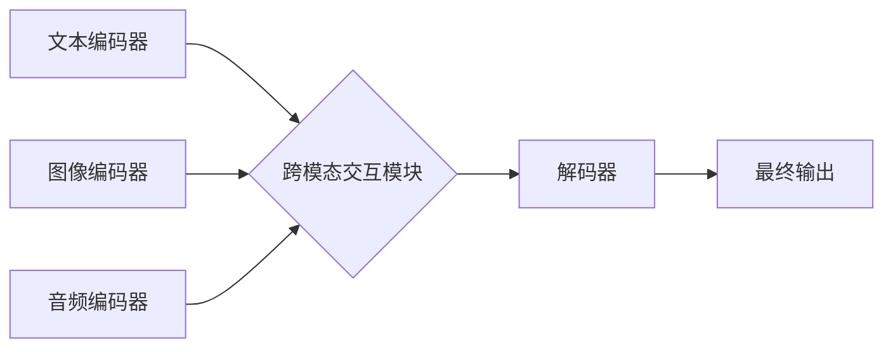

## 多模态大模型：技术原理与实战 BERT模型诞生之后行业持续摸索

> 关键词：多模态大模型、BERT、自然语言处理、计算机视觉、音频处理、跨模态学习、知识融合、应用场景

## 1. 背景介绍

近年来，深度学习技术取得了飞速发展，特别是Transformer模型的出现，如BERT、GPT等，在自然语言处理领域取得了突破性的进展。然而，现实世界的信息往往是多模态的，例如文本、图像、音频等多种形式的混合。单模态模型难以捕捉这些信息之间的复杂关系，限制了模型的理解和应用能力。因此，多模态大模型应运而生，旨在学习和理解多种模态数据之间的关联，从而实现更全面、更智能的认知和交互。

BERT模型的诞生标志着自然语言处理领域进入了一个新的时代，它通过预训练和微调的方式，在各种自然语言理解任务上取得了优异的性能。然而，BERT模型仅限于处理文本数据，无法处理其他模态数据，例如图像、音频等。因此，研究人员开始探索如何将多模态数据融合到模型中，以构建更强大的多模态大模型。

## 2. 核心概念与联系

多模态大模型的核心概念是跨模态学习，即学习不同模态数据之间的关系和映射。

**2.1 多模态数据**

多模态数据是指包含多种不同类型数据的集合，例如文本、图像、音频、视频等。

**2.2 跨模态学习**

跨模态学习是指学习不同模态数据之间的关系和映射，从而实现跨模态理解和生成。

**2.3 多模态大模型**

多模态大模型是指能够处理多种模态数据，并学习它们之间关系的大型深度学习模型。

**2.4 模型架构**

多模态大模型的架构通常包括以下几个部分：

* **模态编码器:** 负责将不同模态数据编码成特征向量。
* **跨模态交互模块:** 负责学习不同模态特征之间的关系。
* **解码器:** 负责根据编码后的特征生成最终输出。

**Mermaid 流程图**



## 3. 核心算法原理 & 具体操作步骤

### 3.1  算法原理概述

多模态大模型的训练目标是学习不同模态数据之间的映射关系，从而实现跨模态理解和生成。常用的训练方法包括：

* **联合训练:** 将不同模态的数据一起训练，学习它们的联合分布。
* **多任务学习:** 将多个跨模态任务联合训练，例如文本-图像匹配、文本-音频识别等。
* **自监督学习:** 利用无标签数据进行预训练，学习不同模态数据的内在表示。

### 3.2  算法步骤详解

1. **数据预处理:** 将不同模态的数据进行预处理，例如文本分词、图像裁剪、音频降噪等。
2. **模态编码:** 使用不同的编码器将不同模态的数据编码成特征向量。
3. **跨模态交互:** 使用跨模态交互模块学习不同模态特征之间的关系。
4. **解码:** 使用解码器根据编码后的特征生成最终输出。
5. **损失函数:** 使用合适的损失函数，例如交叉熵损失、均方误差损失等，对模型进行训练。

### 3.3  算法优缺点

**优点:**

* 能够学习不同模态数据之间的复杂关系。
* 能够实现跨模态理解和生成。
* 能够利用无标签数据进行预训练。

**缺点:**

* 训练数据量大，计算资源消耗高。
* 模型结构复杂，训练难度大。
* 跨模态关系学习仍然是一个挑战。

### 3.4  算法应用领域

多模态大模型在多个领域都有广泛的应用，例如：

* **图像字幕生成:** 将图像转换为文本描述。
* **视频理解:** 理解视频内容，例如动作识别、事件检测等。
* **文本-图像检索:** 根据文本查询图像。
* **多模态对话系统:** 能够理解和生成文本、图像、音频等多种模态的对话。

## 4. 数学模型和公式 & 详细讲解 & 举例说明

### 4.1  数学模型构建

多模态大模型的数学模型通常基于深度学习框架，例如TensorFlow、PyTorch等。模型的结构可以根据具体任务进行设计，但通常包括以下几个部分：

* **模态编码器:** 使用卷积神经网络（CNN）、循环神经网络（RNN）或Transformer等网络结构对不同模态数据进行编码。
* **跨模态交互模块:** 使用注意力机制、拼接操作或其他方法学习不同模态特征之间的关系。
* **解码器:** 使用解码器网络生成最终输出，例如文本、图像、音频等。

### 4.2  公式推导过程

跨模态交互模块的数学公式推导过程取决于具体的模型架构。例如，使用注意力机制的跨模态交互模块，其公式可以表示为：

$$
\text{Attention}(Q, K, V) = \frac{\text{softmax}(\frac{QK^T}{\sqrt{d_k}})V}{ \text{softmax}(\frac{QK^T}{\sqrt{d_k}}) }
$$

其中，$Q$, $K$, $V$ 分别代表查询矩阵、键矩阵和值矩阵，$d_k$ 代表键向量的维度。

### 4.3  案例分析与讲解

例如，在文本-图像匹配任务中，可以使用多模态大模型学习文本和图像之间的关系。模型可以将文本编码成文本向量，将图像编码成图像向量，然后使用注意力机制学习文本向量和图像向量之间的关系。最终，模型可以根据学习到的关系，预测文本和图像是否匹配。

## 5. 项目实践：代码实例和详细解释说明

### 5.1  开发环境搭建

使用Python语言开发多模态大模型，需要安装以下软件包：

* TensorFlow 或 PyTorch
* OpenCV (图像处理)
* Librosa (音频处理)
* NLTK 或 SpaCy (自然语言处理)

### 5.2  源代码详细实现

由于篇幅限制，这里只提供一个简单的文本-图像匹配模型的代码示例：

```python
import tensorflow as tf

# 定义文本编码器
text_encoder = tf.keras.Sequential([
    tf.keras.layers.Embedding(input_dim=vocab_size, output_dim=embedding_dim),
    tf.keras.layers.LSTM(units=hidden_size)
])

# 定义图像编码器
image_encoder = tf.keras.Sequential([
    tf.keras.layers.Conv2D(filters=32, kernel_size=(3, 3), activation='relu'),
    tf.keras.layers.MaxPooling2D(pool_size=(2, 2)),
    tf.keras.layers.Flatten()
])

# 定义跨模态交互模块
def cross_modal_interaction(text_embedding, image_embedding):
    # 使用注意力机制学习文本和图像之间的关系
    attention_weights = tf.keras.layers.Attention()([text_embedding, image_embedding])
    # 将注意力加权后的文本和图像特征拼接起来
    combined_embedding = tf.keras.layers.Concatenate()([text_embedding, image_embedding * attention_weights])
    return combined_embedding

# 定义解码器
decoder = tf.keras.Sequential([
    tf.keras.layers.Dense(units=hidden_size, activation='relu'),
    tf.keras.layers.Dense(units=1, activation='sigmoid')
])

# 定义模型
model = tf.keras.Model(inputs=[text_input, image_input], outputs=decoder(cross_modal_interaction(text_encoder(text_input), image_encoder(image_input))))

# 编译模型
model.compile(optimizer='adam', loss='binary_crossentropy', metrics=['accuracy'])

# 训练模型
model.fit(x=[text_data, image_data], y=labels, epochs=10)
```

### 5.3  代码解读与分析

* 文本编码器和图像编码器分别使用LSTM和CNN网络结构对文本和图像数据进行编码。
* 跨模态交互模块使用注意力机制学习文本和图像之间的关系。
* 解码器是一个简单的全连接网络，用于预测文本和图像是否匹配。
* 模型使用Adam优化器、二分类交叉熵损失函数和准确率作为评估指标进行训练。

### 5.4  运行结果展示

训练完成后，可以使用模型对新的文本-图像对进行预测，并评估模型的性能。

## 6. 实际应用场景

多模态大模型在多个实际应用场景中展现出强大的潜力，例如：

### 6.1  医疗诊断

* 将患者的病历、影像数据和生理数据融合，辅助医生进行更准确的诊断。
* 自动识别病灶，辅助医生进行手术规划。

### 6.2  教育培训

* 创建个性化的学习体验，根据学生的学习进度和风格提供相应的学习内容。
* 利用多模态数据进行知识评估，例如通过图像识别和文本理解来评估学生的学习成果。

### 6.3  智能客服

* 利用多模态数据理解用户的需求，提供更精准的回复。
* 通过语音识别和文本生成，实现人机自然交互。

### 6.4  未来应用展望

随着多模态大模型技术的不断发展，其应用场景将会更加广泛，例如：

* 更智能的虚拟助手
* 更沉浸式的虚拟现实体验
* 更精准的个性化推荐

## 7. 工具和资源推荐

### 7.1  学习资源推荐

* **书籍:**
    * 《深度学习》 by Ian Goodfellow, Yoshua Bengio, Aaron Courville
    * 《自然语言处理》 by Dan Jurafsky, James H. Martin
* **在线课程:**
    * Coursera: Deep Learning Specialization
    * Udacity: Natural Language Processing Nanodegree

### 7.2  开发工具推荐

* **TensorFlow:** https://www.tensorflow.org/
* **PyTorch:** https://pytorch.org/
* **OpenCV:** https://opencv.org/
* **Librosa:** https://librosa.org/

### 7.3  相关论文推荐

* **BERT: Pre-training of Deep Bidirectional Transformers for Language Understanding**
* **Vision Transformer (ViT)**
* **DALL-E: Creating Images from Text**

## 8. 总结：未来发展趋势与挑战

### 8.1  研究成果总结

多模态大模型在跨模态学习、理解和生成方面取得了显著进展，为人工智能的未来发展提供了新的方向。

### 8.2  未来发展趋势

* **模型规模和能力的提升:** 未来多模态大模型将会更加庞大，拥有更强的学习能力和泛化能力。
* **跨模态知识融合的深入研究:** 如何更好地融合不同模态之间的知识，实现更深入的理解和生成，是未来研究的重要方向。
* **面向特定领域的应用:** 多模态大模型将会被应用于更多特定领域，例如医疗、教育、金融等，为这些领域带来新的价值。

### 8.3  面临的挑战

* **数据获取和标注:** 多模态数据的获取和标注成本高，是限制多模态大模型发展的一大挑战。
* **模型训练和推理效率:** 多模态大模型的训练和推理效率仍然较低，需要进一步优化模型结构和训练方法。
* **伦理和安全问题:** 多模态大模型的应用可能会带来一些伦理和安全问题，例如数据隐私、算法偏见等，需要引起重视和解决。

### 8.4  研究展望

未来，多模态大模型的研究将会更加深入，将会带来