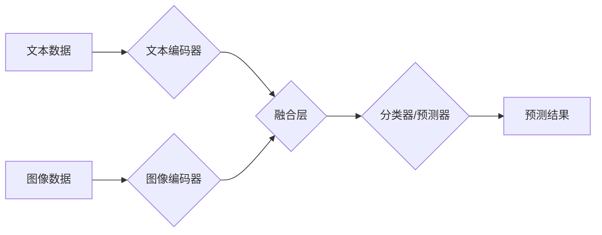

## 多模态模型在医疗领域的应用

> 关键词：多模态模型、医疗影像、自然语言处理、机器学习、深度学习、诊断辅助、病理分析

## 1. 背景介绍

医疗领域正处于数字化转型和智能化升级的关键时期。海量医疗数据，如影像、电子病历、基因信息等，为人工智能（AI）的应用提供了广阔空间。多模态模型作为一种能够处理多种数据类型并进行跨模态学习的强大工具，在医疗领域展现出巨大的潜力。

传统医疗诊断主要依赖于医生的经验和专业知识，但受限于医生经验、时间和资源等因素，诊断结果可能存在主观性、误差和延迟。多模态模型可以利用多种数据源，例如影像、病历、基因信息等，进行综合分析，辅助医生做出更准确、更快速、更个性化的诊断。

## 2. 核心概念与联系

多模态模型是指能够处理多种不同类型数据（如文本、图像、音频、视频等）并进行跨模态学习的机器学习模型。其核心概念是将不同模态的数据融合在一起，学习数据之间的潜在关系，从而获得更丰富的知识和更准确的预测结果。

**多模态模型架构**



**核心概念原理:**

* **模态编码:** 将不同模态的数据分别编码成向量表示，例如使用BERT模型对文本进行编码，使用ResNet模型对图像进行编码。
* **跨模态融合:** 将不同模态的编码向量进行融合，例如使用注意力机制、拼接操作等方法，学习不同模态之间的关系。
* **预测:** 利用融合后的特征进行分类、预测等任务。

## 3. 核心算法原理 & 具体操作步骤

### 3.1  算法原理概述

多模态模型的训练主要基于深度学习算法，例如卷积神经网络（CNN）、循环神经网络（RNN）和Transformer等。这些算法能够学习数据之间的复杂关系，并进行高效的特征提取和预测。

常见的多模态模型架构包括：

* **基于注意力的模型:**  例如BERT、XLNet等，能够学习不同模态之间的上下文关系，并进行更精准的融合。
* **基于图神经网络的模型:**  例如Graph Convolutional Network（GCN），能够建模数据之间的复杂关系，并进行更深入的分析。

### 3.2  算法步骤详解

1. **数据预处理:** 将不同模态的数据进行清洗、格式化、标注等操作，使其能够被模型所接受。
2. **模态编码:** 使用预训练的模型或训练自定义的模型，将不同模态的数据分别编码成向量表示。
3. **跨模态融合:** 使用注意力机制、拼接操作等方法，将不同模态的编码向量进行融合，学习数据之间的关系。
4. **模型训练:** 使用交叉熵损失函数等方法，训练多模态模型，使其能够进行准确的预测。
5. **模型评估:** 使用测试集评估模型的性能，例如准确率、召回率、F1-score等指标。

### 3.3  算法优缺点

**优点:**

* 能够利用多种数据源，获得更全面的信息。
* 能够学习数据之间的复杂关系，提高预测精度。
* 能够辅助医生做出更准确、更快速、更个性化的诊断。

**缺点:**

* 数据收集和标注成本高。
* 模型训练复杂，需要大量的计算资源。
* 模型解释性较差，难以理解模型的决策过程。

### 3.4  算法应用领域

* **医疗影像分析:**  例如癌症检测、肺部疾病诊断、骨骼骨折识别等。
* **病理分析:**  例如肿瘤分级、细胞类型识别等。
* **电子病历分析:**  例如疾病预测、患者风险评估等。
* **基因组学研究:**  例如疾病基因识别、药物研发等。

## 4. 数学模型和公式 & 详细讲解 & 举例说明

### 4.1  数学模型构建

多模态模型的数学模型通常基于深度学习框架，例如TensorFlow或PyTorch。模型的结构可以根据具体任务和数据类型进行设计，但一般包括以下几个部分:

* **模态编码器:**  每个模态的数据都使用一个独立的编码器进行处理，例如CNN用于图像编码，BERT用于文本编码。
* **融合层:**  将不同模态的编码向量进行融合，例如使用注意力机制或拼接操作。
* **预测层:**  根据融合后的特征进行分类、预测等任务。

### 4.2  公式推导过程

注意力机制是多模态模型中常用的融合方法之一。其核心思想是学习不同模态之间重要程度的权重，并根据这些权重对数据进行加权求和。

**注意力机制公式:**

$$
\text{Attention}(Q, K, V) = \text{softmax}\left(\frac{QK^T}{\sqrt{d_k}}\right)V
$$

其中:

* $Q$：查询向量
* $K$：键向量
* $V$：值向量
* $d_k$：键向量的维度
* $\text{softmax}$：softmax函数，用于计算每个键向量的权重

### 4.3  案例分析与讲解

例如，在医学影像分析任务中，可以使用注意力机制学习图像中与疾病相关的区域，并将其作为特征进行预测。

## 5. 项目实践：代码实例和详细解释说明

### 5.1  开发环境搭建

* Python 3.6+
* TensorFlow/PyTorch
* CUDA/cuDNN

### 5.2  源代码详细实现

```python
# 使用TensorFlow实现简单的多模态模型
import tensorflow as tf

# 定义文本编码器
text_encoder = tf.keras.Sequential([
    tf.keras.layers.Embedding(input_dim=10000, output_dim=128),
    tf.keras.layers.LSTM(units=64),
])

# 定义图像编码器
image_encoder = tf.keras.Sequential([
    tf.keras.layers.Conv2D(filters=32, kernel_size=(3, 3), activation='relu'),
    tf.keras.layers.MaxPooling2D(pool_size=(2, 2)),
    tf.keras.layers.Flatten(),
    tf.keras.layers.Dense(units=128),
])

# 定义融合层
def fusion_layer(text_embedding, image_embedding):
    # 使用注意力机制融合文本和图像特征
    attention_weights = tf.keras.layers.Dense(units=1, activation='sigmoid')(
        tf.keras.layers.Concatenate()([text_embedding, image_embedding])
    )
    weighted_text_embedding = tf.keras.layers.Multiply()([text_embedding, attention_weights])
    fused_embedding = tf.keras.layers.Add()([weighted_text_embedding, image_embedding])
    return fused_embedding

# 定义预测层
prediction_layer = tf.keras.layers.Dense(units=1, activation='sigmoid')

# 定义多模态模型
model = tf.keras.Model(
    inputs=[text_input, image_input],
    outputs=prediction_layer(fusion_layer(text_encoder(text_input), image_encoder(image_input)))
)

# 编译模型
model.compile(optimizer='adam', loss='binary_crossentropy', metrics=['accuracy'])

# 训练模型
model.fit(
    x=[text_data, image_data],
    y=labels,
    epochs=10,
    batch_size=32
)
```

### 5.3  代码解读与分析

* 代码首先定义了文本编码器和图像编码器，分别使用LSTM和CNN进行特征提取。
* 然后定义了一个融合层，使用注意力机制将文本和图像特征进行融合。
* 最后定义了一个预测层，使用sigmoid激活函数进行二分类预测。
* 模型使用Adam优化器，交叉熵损失函数和准确率作为评估指标进行训练。

### 5.4  运行结果展示

训练完成后，可以使用测试集评估模型的性能，例如准确率、召回率、F1-score等指标。

## 6. 实际应用场景

### 6.1  癌症检测

多模态模型可以结合影像、病历、基因信息等数据，提高癌症的早期检测和诊断准确率。例如，可以利用多模态模型分析CT扫描图像和病历信息，辅助医生判断肺癌的风险。

### 6.2  肺部疾病诊断

多模态模型可以分析X光片和病历信息，辅助医生诊断肺部疾病，例如肺炎、肺结核等。

### 6.3  骨骼骨折识别

多模态模型可以分析X光片和患者的运动轨迹等数据，识别骨骼骨折，并辅助医生制定治疗方案。

### 6.4  未来应用展望

随着医疗数据的不断积累和多模态模型技术的不断发展，其在医疗领域的应用前景广阔。未来，多模态模型将能够在以下方面发挥更大的作用:

* **个性化医疗:**  根据患者的个体特征，提供个性化的诊断和治疗方案。
* **远程医疗:**  通过远程医疗平台，将多模态模型应用于远程诊断和治疗。
* **药物研发:**  利用多模态模型分析药物的疗效和安全性，加速药物研发进程。

## 7. 工具和资源推荐

### 7.1  学习资源推荐

* **书籍:**
    * Deep Learning for Medical Image Analysis
    * Multimodal Machine Learning: Methods and Applications
* **在线课程:**
    * Coursera: Deep Learning Specialization
    * Udacity: Artificial Intelligence Nanodegree
* **博客和论坛:**
    * Towards Data Science
    * Kaggle

### 7.2  开发工具推荐

* **深度学习框架:**
    * TensorFlow
    * PyTorch
* **图像处理库:**
    * OpenCV
    * Pillow
* **自然语言处理库:**
    * NLTK
    * SpaCy

### 7.3  相关论文推荐

* **Attention Is All You Need**
* **BERT: Pre-training of Deep Bidirectional Transformers for Language Understanding**
* **Multimodal Deep Learning for Medical Image Analysis**

## 8. 总结：未来发展趋势与挑战

### 8.1  研究成果总结

多模态模型在医疗领域的应用取得了显著进展，能够辅助医生进行更准确、更快速、更个性化的诊断。

### 8.2  未来发展趋势

* **模型复杂度提升:**  开发更复杂、更强大的多模态模型，例如Transformer-based模型、图神经网络模型等。
* **数据规模扩大:**  收集和整合更多医疗数据，例如电子病历、基因组数据、影像数据等，为模型训练提供更丰富的样本。
* **解释性增强:**  提高多模态模型的解释性，使医生能够更好地理解模型的决策过程。

### 8.3  面临的挑战

* **数据隐私和安全:**  医疗数据具有高度敏感性，需要采取有效的措施保护患者隐私和数据安全。
* **模型可信度和可靠性:**  多模态模型的决策结果需要经过严格的验证和评估，确保其可靠性和安全性。
* **伦理问题:**  多模态模型的应用可能引发一些伦理问题，例如算法偏见、数据歧视等，需要进行深入的探讨和解决。

### 8.4  研究展望

未来，多模态模型将在医疗领域发挥越来越重要的作用，为患者提供更精准、更个性化的医疗服务。


## 9. 附录：常见问题与解答

**Q1: 多模态模型的训练数据需要多么丰富？**

**A1:** 多模态模型的训练数据需要足够丰富，以覆盖不同模态的数据类型和样本分布。一般来说，需要收集大量的标注数据，并进行数据清洗