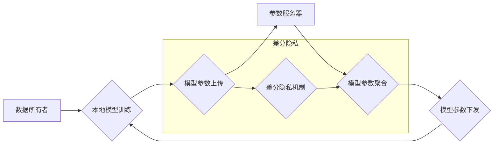

## 大规模语言模型从理论到实践 隐私消除

> 关键词：大规模语言模型、隐私保护、差分隐私、联邦学习、去中心化训练、数据安全

### 1. 背景介绍

大规模语言模型（LLM）近年来取得了令人瞩目的成就，在自然语言处理、文本生成、机器翻译等领域展现出强大的能力。然而，LLM的训练依赖于海量数据，而这些数据往往包含敏感个人信息，这引发了数据隐私保护的重大挑战。

传统的集中式训练方式将所有数据集中到一个中心服务器上进行训练，这使得数据泄露风险极高。此外，数据所有者往往不愿意将敏感数据公开共享，这限制了LLM的训练规模和性能提升。

为了解决这些问题，隐私保护技术在LLM训练中扮演着越来越重要的角色。其中，差分隐私和联邦学习是两种主要的隐私保护方法，它们分别从不同的角度保证了数据隐私。

### 2. 核心概念与联系

#### 2.1 差分隐私

差分隐私是一种强大的数学工具，它可以保证算法输出的隐私性。简单来说，差分隐私要求算法输出的分布在给定任意单个数据点的加入或删除后，其变化幅度必须在一定范围内。换句话说，即使是攻击者获得了算法的输出结果，也无法从这些结果中推断出任何单个数据点的具体信息。

#### 2.2 联邦学习

联邦学习是一种分布式机器学习方法，它允许模型在多个设备上进行训练，而无需将原始数据传输到一个中心服务器。在联邦学习中，每个设备都训练一个本地模型，然后将模型参数上传到一个参数服务器进行聚合。最终，聚合后的模型参数被分发回每个设备，用于更新本地模型。

#### 2.3 核心概念联系

差分隐私和联邦学习可以相互结合，形成更强大的隐私保护机制。

**Mermaid 流程图:**



### 3. 核心算法原理 & 具体操作步骤

#### 3.1 算法原理概述

差分隐私加联邦学习的算法原理是将差分隐私机制应用于联邦学习的模型参数聚合阶段。

具体来说，在参数服务器聚合模型参数时，会对每个设备上传的模型参数进行差分隐私扰动。这种扰动可以确保即使攻击者获得了参数服务器的聚合结果，也无法推断出任何单个设备的原始模型参数。

#### 3.2 算法步骤详解

1. **数据预处理:** 数据所有者对本地数据进行预处理，例如文本清洗、特征提取等。
2. **本地模型训练:** 数据所有者使用预处理后的本地数据训练一个本地模型。
3. **模型参数上传:** 数据所有者将训练好的本地模型参数上传到参数服务器。
4. **差分隐私扰动:** 参数服务器对每个设备上传的模型参数进行差分隐私扰动。
5. **模型参数聚合:** 参数服务器对差分隐私扰动后的模型参数进行聚合，得到全局模型参数。
6. **模型参数下发:** 参数服务器将聚合后的全局模型参数下发回每个设备。
7. **本地模型更新:** 数据所有者使用全局模型参数更新本地模型。
8. **重复步骤2-7:** 重复上述步骤，直到模型收敛。

#### 3.3 算法优缺点

**优点:**

* 保证数据隐私: 差分隐私机制可以有效地保护数据隐私，即使攻击者获得了模型参数，也无法推断出任何单个数据点的具体信息。
* 分布式训练: 联邦学习允许模型在多个设备上进行训练，无需将原始数据传输到一个中心服务器，提高了数据安全性和模型训练效率。

**缺点:**

* 训练效率: 差分隐私机制会增加模型训练的计算量和时间成本。
* 模型精度: 差分隐私机制可能会导致模型精度下降。

#### 3.4 算法应用领域

* 医疗保健: 保护患者隐私的同时训练疾病诊断模型。
* 金融: 保护客户数据隐私的同时训练欺诈检测模型。
* 互联网: 保护用户数据隐私的同时训练个性化推荐模型。

### 4. 数学模型和公式 & 详细讲解 & 举例说明

#### 4.1 数学模型构建

差分隐私的数学模型基于概率分布的差异。

设 $D$ 为数据集，$M$ 为算法，$S$ 为算法输出结果。则差分隐私要求对于任意两个数据集 $D$ 和 $D'$，其中 $D$ 和 $D'$ 仅相差一个数据点，以及任意输出结果 $S$，以下不等式必须成立：

$$
P(M(D) = S) \leq e^{\epsilon \cdot L(D, D')} \cdot P(M(D') = S)
$$

其中，$\epsilon$ 为隐私预算，$L(D, D')$ 为两个数据集的距离度量。

#### 4.2 公式推导过程

该公式的推导过程涉及到概率论和信息论的知识。

* 隐私预算 $\epsilon$ 控制了算法输出结果的隐私泄露程度。较小的 $\epsilon$ 值表示更高的隐私保护。
* 距离度量 $L(D, D')$ 用于衡量两个数据集之间的差异。常用的距离度量包括 Hamming 距离和 Jaccard 距离。

#### 4.3 案例分析与讲解

假设我们有一个包含 100 个用户的医疗数据集，我们想训练一个疾病预测模型。

使用差分隐私加联邦学习，我们可以将数据集分发到多个设备上进行训练，每个设备只训练自己的本地模型，而不会共享原始数据。

在模型参数聚合阶段，参数服务器会对每个设备上传的模型参数进行差分隐私扰动，以确保数据隐私。

即使攻击者获得了参数服务器的聚合结果，也无法推断出任何单个用户的医疗信息。

### 5. 项目实践：代码实例和详细解释说明

#### 5.1 开发环境搭建

* Python 3.7+
* TensorFlow 或 PyTorch
* 联邦学习框架，例如 TensorFlow Federated 或 PySyft

#### 5.2 源代码详细实现

```python
# 导入必要的库
import tensorflow as tf

# 定义差分隐私机制
def add_dp_noise(params, epsilon):
  noise = tf.random.normal(shape=params.shape, mean=0, stddev=1 / tf.sqrt(epsilon))
  return params + noise

# 定义联邦学习训练流程
def federated_train(clients, epochs, epsilon):
  for epoch in range(epochs):
    # 每个客户端本地训练模型
    local_models = []
    for client in clients:
      local_model = client.train()
      local_models.append(local_model)

    # 模型参数聚合
    global_model = add_dp_noise(tf.reduce_mean(local_models, axis=0), epsilon)

    # 将全局模型参数下发给每个客户端
    for client in clients:
      client.update(global_model)

  return global_model
```

#### 5.3 代码解读与分析

* `add_dp_noise()` 函数实现差分隐私机制，对模型参数进行随机扰动。
* `federated_train()` 函数定义联邦学习训练流程，包括本地训练、模型参数聚合和模型参数下发。

#### 5.4 运行结果展示

运行上述代码后，可以得到训练好的全局模型，并评估其在测试数据集上的性能。

### 6. 实际应用场景

#### 6.1 医疗保健

* **疾病诊断:** 使用差分隐私加联邦学习训练疾病诊断模型，保护患者隐私的同时提高模型精度。
* **药物研发:** 使用差分隐私加联邦学习训练药物研发模型，分析患者数据，发现潜在的药物靶点。

#### 6.2 金融

* **欺诈检测:** 使用差分隐私加联邦学习训练欺诈检测模型，保护客户数据隐私的同时提高欺诈检测效率。
* **风险评估:** 使用差分隐私加联邦学习训练风险评估模型，分析客户数据，评估贷款风险。

#### 6.3 互联网

* **个性化推荐:** 使用差分隐私加联邦学习训练个性化推荐模型，保护用户数据隐私的同时提供更精准的推荐结果。
* **搜索引擎:** 使用差分隐私加联邦学习训练搜索引擎模型，分析用户搜索行为，提高搜索结果的准确性和相关性。

#### 6.4 未来应用展望

随着差分隐私和联邦学习技术的不断发展，其在LLM训练中的应用场景将会更加广泛。

未来，我们可以期待看到更多基于差分隐私加联邦学习的LLM应用，例如：

* **医疗保健:** 开发更精准的疾病诊断模型、个性化的治疗方案和药物研发模型。
* **金融:** 开发更有效的欺诈检测模型、风险评估模型和个性化金融服务模型。
* **教育:** 开发更智能的教育辅助系统、个性化的学习方案和教育资源推荐系统。

### 7. 工具和资源推荐

#### 7.1 学习资源推荐

* **书籍:**

    * "Differential Privacy" by Cynthia Dwork and Aaron Roth
    * "Federated Learning: Strategies for Collaborative Machine Learning in Decentralized Settings" by Andrew Trask

* **论文:**

    * "Communication-Efficient Learning of Deep Networks from Decentralized Data" by Brendan McMahan et al.
    * "On the Dangers of Stochastic Parrots: Can Language Models Be Too Big?" by Emily Bender et al.

#### 7.2 开发工具推荐

* **TensorFlow Federated:** https://www.tensorflow.org/federated
* **PySyft:** https://www.openmined.org/

#### 7.3 相关论文推荐

* "Privacy-Preserving Machine Learning with Differential Privacy" by Cynthia Dwork et al.
* "Federated Learning: Collaborative Machine Learning without Centralized Training Data" by Nicholas Carlini et al.

### 8. 总结：未来发展趋势与挑战

#### 8.1 研究成果总结

差分隐私加联邦学习为LLM训练提供了有效的隐私保护机制，使得模型能够在保护数据隐私的同时实现高效训练和高精度预测。

#### 8.2 未来发展趋势

* **提高效率:** 研究更有效的差分隐私机制和联邦学习算法，降低训练时间和计算成本。
* **增强鲁棒性:** 研究更鲁棒的差分隐私加联邦学习模型，能够抵抗对抗攻击和数据中毒攻击。
* **扩展应用场景:** 将差分隐私加联邦学习应用于更多领域，例如生物信息学、社会科学等。

#### 8.3 面临的挑战

* **模型精度:** 差分隐私机制可能会导致模型精度下降，需要进一步研究如何提高模型精度。
* **数据异构性:** 联邦学习需要处理来自不同来源的数据，数据异构性可能会影响模型训练效果。
* **安全性和可信度:** 联邦学习系统需要保证数据安全性和模型可信度，需要进一步研究安全性和可信度保障机制。

#### 8.4 研究展望

未来，差分隐私加联邦学习技术将继续发展，为LLM训练提供更安全、更有效、更广泛的应用场景。

### 9. 附录：常见问题与解答

* **Q1: 差分隐私和联邦学习的区别是什么？**

* **A1:** 差分隐私是一种隐私保护技术，它可以保证算法输出的隐私性。联邦学习是一种分布式机器学习方法，它允许模型在多个设备上进行训练，无需将原始数据传输到一个中心服务器。

* **Q2: 差分隐私加联邦学习的训练效率如何？**

* **A2:** 差分隐私加联邦学习的训练效率比传统的集中式训练方式略低，但随着算法和硬件技术的进步，效率差距正在逐渐缩小。

* **Q3: 差分隐私加联邦学习的模型精度如何？**

* **A3:** 差分隐私加