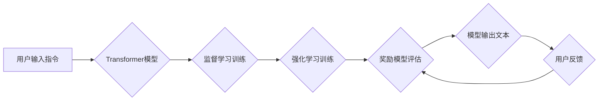

## 大语言模型原理与工程实践：InstructGPT

> 关键词：大语言模型、InstructGPT、监督学习、强化学习、文本生成、自然语言处理、AI应用

## 1. 背景介绍

近年来，深度学习技术取得了飞速发展，特别是Transformer模型的出现，为自然语言处理（NLP）领域带来了革命性的变革。大语言模型（LLM）作为深度学习在NLP领域的顶尖成果，展现出强大的文本理解和生成能力，在文本摘要、机器翻译、对话系统等领域取得了令人瞩目的成就。

InstructGPT是OpenAI基于GPT-3开发的一种指令跟随型大语言模型，它通过强化学习从人类反馈中学习，能够更准确地理解和执行用户的指令，从而提供更自然、更符合人类期望的文本输出。InstructGPT的出现标志着LLM朝着更智能、更实用化的方向迈进了一大步。

## 2. 核心概念与联系

InstructGPT的核心概念包括：

* **Transformer模型:** InstructGPT基于Transformer模型架构，该架构能够有效地捕捉文本序列中的长距离依赖关系，从而实现更准确的文本理解和生成。
* **监督学习:** InstructGPT在初始阶段通过监督学习的方式进行训练，利用大量标注好的文本数据学习语言模式和语法规则。
* **强化学习:** InstructGPT采用强化学习算法进行进一步的训练，通过与人类反馈交互，学习如何更好地理解和执行用户的指令。
* **奖励模型:** InstructGPT使用一个奖励模型来评估模型生成的文本质量，该模型根据人类反馈对文本进行评分，并将其作为强化学习的奖励信号。

**Mermaid 流程图:**

## 3. 核心算法原理 & 具体操作步骤

### 3.1  算法原理概述

InstructGPT的核心算法原理是结合监督学习和强化学习进行训练。

* **监督学习:** 在监督学习阶段，InstructGPT使用大量标注好的文本数据进行训练，学习语言模式和语法规则。训练目标是让模型能够根据给定的输入文本生成符合语法规则和语义逻辑的输出文本。
* **强化学习:** 在强化学习阶段，InstructGPT与人类交互，通过人类反馈来学习如何更好地理解和执行用户的指令。人类会对模型生成的文本进行评分，并将其作为强化学习的奖励信号。模型的目标是最大化奖励信号，从而学习生成更符合人类期望的文本。

### 3.2  算法步骤详解

1. **数据准备:** 收集大量文本数据，并进行标注，例如将文本数据分为不同的类别，或标注文本中的实体和关系。
2. **监督学习训练:** 使用标注好的文本数据训练Transformer模型，使其能够理解语言模式和语法规则。
3. **奖励模型训练:** 使用人类反馈数据训练奖励模型，该模型能够评估模型生成的文本质量。
4. **强化学习训练:** 使用奖励模型的输出作为强化学习的奖励信号，训练模型生成更符合人类期望的文本。
5. **模型评估:** 使用测试数据评估模型的性能，例如计算模型的准确率、BLEU分数等。

### 3.3  算法优缺点

**优点:**

* **强大的文本生成能力:** InstructGPT能够生成高质量、流畅的文本，并能够根据用户的指令进行定制化生成。
* **更准确的指令理解:** 通过强化学习，InstructGPT能够更好地理解用户的指令，并生成更符合预期结果的文本。
* **可扩展性强:** InstructGPT的架构能够轻松扩展，支持处理更长、更复杂的文本数据。

**缺点:**

* **训练成本高:** InstructGPT的训练需要大量的计算资源和时间。
* **数据依赖性强:** InstructGPT的性能取决于训练数据的质量和数量。
* **潜在的偏差问题:** InstructGPT可能存在训练数据中的偏差问题，导致模型生成带有偏见或歧视性的文本。

### 3.4  算法应用领域

InstructGPT在以下领域具有广泛的应用前景:

* **聊天机器人:** InstructGPT可以用于开发更智能、更自然的人机交互系统。
* **文本摘要:** InstructGPT可以自动生成文本摘要，帮助用户快速了解文章内容。
* **机器翻译:** InstructGPT可以用于开发更准确、更流畅的机器翻译系统。
* **代码生成:** InstructGPT可以根据用户的指令生成代码，提高开发效率。
* **创意写作:** InstructGPT可以帮助用户进行创意写作，例如生成故事、诗歌等。

## 4. 数学模型和公式 & 详细讲解 & 举例说明

### 4.1  数学模型构建

InstructGPT的数学模型主要基于Transformer架构，其核心是自注意力机制和多头注意力机制。

* **自注意力机制:** 自注意力机制能够捕捉文本序列中每个词与其他词之间的关系，从而理解词语之间的语义依赖。
* **多头注意力机制:** 多头注意力机制通过使用多个自注意力头，能够从不同的角度捕捉文本序列中的信息，从而提高模型的理解能力。

### 4.2  公式推导过程

自注意力机制的计算公式如下：

$$
Attention(Q, K, V) = softmax(\frac{QK^T}{\sqrt{d_k}})V
$$

其中：

* $Q$：查询矩阵
* $K$：键矩阵
* $V$：值矩阵
* $d_k$：键向量的维度
* $softmax$：softmax函数

### 4.3  案例分析与讲解

假设我们有一个文本序列“我爱学习编程”，其词向量表示为：

$$
Q = \begin{bmatrix} q_1 & q_2 & q_3 & q_4 & q_5 \end{bmatrix}
$$

$$
K = \begin{bmatrix} k_1 & k_2 & k_3 & k_4 & k_5 \end{bmatrix}
$$

$$
V = \begin{bmatrix} v_1 & v_2 & v_3 & v_4 & v_5 \end{bmatrix}
$$

其中 $q_i$、$k_i$ 和 $v_i$ 分别表示每个词的查询向量、键向量和值向量。

通过计算 $QK^T$，我们可以得到每个词与其他词之间的相似度得分。然后，使用 softmax 函数将这些得分归一化，得到每个词对其他词的注意力权重。最后，将注意力权重与值矩阵相乘，得到每个词的上下文表示。

## 5. 项目实践：代码实例和详细解释说明

### 5.1  开发环境搭建

InstructGPT的开发环境需要包含以下软件：

* Python 3.7+
* PyTorch 1.7+
* Transformers 库

### 5.2  源代码详细实现

InstructGPT的源代码主要包含以下部分：

* **模型架构定义:** 定义 InstructGPT 的 Transformer 模型架构，包括编码器、解码器和注意力机制。
* **数据加载和预处理:** 加载和预处理训练数据，例如将文本数据转换为词向量表示。
* **模型训练:** 使用监督学习和强化学习算法训练 InstructGPT 模型。
* **模型评估:** 使用测试数据评估模型的性能，例如计算模型的准确率、BLEU 分数等。

### 5.3  代码解读与分析

InstructGPT 的代码实现较为复杂，涉及到深度学习框架 PyTorch 和自然语言处理库 Transformers 的使用。

### 5.4  运行结果展示

InstructGPT 的训练结果可以根据模型的性能指标进行评估，例如准确率、BLEU 分数等。

## 6. 实际应用场景

InstructGPT 在以下实际应用场景中展现出强大的潜力:

* **智能客服:** InstructGPT 可以用于开发更智能、更自然的智能客服系统，能够理解用户的需求并提供更准确的回复。
* **个性化教育:** InstructGPT 可以根据学生的学习进度和需求，提供个性化的学习内容和辅导。
* **内容创作:** InstructGPT 可以帮助用户生成高质量的文本内容，例如文章、故事、诗歌等。

### 6.4  未来应用展望

InstructGPT 的未来应用前景十分广阔，随着技术的不断发展，它将在更多领域发挥重要作用，例如：

* **科学研究:** InstructGPT 可以帮助科学家分析大量文本数据，发现新的知识和规律。
* **法律领域:** InstructGPT 可以用于法律文本分析、合同审查等工作，提高效率和准确性。
* **医疗领域:** InstructGPT 可以用于医疗记录分析、疾病诊断等工作，辅助医生做出更准确的判断。

## 7. 工具和资源推荐

### 7.1  学习资源推荐

* **OpenAI 官方文档:** https://openai.com/blog/openai-api/
* **HuggingFace Transformers 库文档:** https://huggingface.co/docs/transformers/index

### 7.2  开发工具推荐

* **PyTorch:** https://pytorch.org/
* **Transformers 库:** https://huggingface.co/docs/transformers/index

### 7.3  相关论文推荐

* **Language Models are Few-Shot Learners:** https://arxiv.org/abs/2005.14165
* **InstructGPT: Training Language Models to Follow Instructions with Human Feedback:** https://arxiv.org/abs/2103.02155

## 8. 总结：未来发展趋势与挑战

### 8.1  研究成果总结

InstructGPT 的出现标志着大语言模型朝着更智能、更实用化的方向迈进了一大步。通过结合监督学习和强化学习，InstructGPT能够更好地理解和执行用户的指令，生成更符合人类期望的文本。

### 8.2  未来发展趋势

InstructGPT 的未来发展趋势包括：

* **模型规模的进一步扩大:** 更大的模型规模能够带来更强的文本理解和生成能力。
* **多模态学习:** 将文本与其他模态数据（例如图像、音频）进行融合，实现更全面的信息理解和生成。
* **可解释性增强:** 研究如何提高 InstructGPT 的可解释性，让用户更好地理解模型的决策过程。

### 8.3  面临的挑战

InstructGPT 还面临着一些挑战：

* **数据安全和隐私:** InstructGPT 的训练需要大量文本数据，如何保证数据安全和隐私是一个重要问题。
* **模型偏见和歧视:** InstructGPT 可能存在训练数据中的偏见问题，导致模型生成带有偏见或歧视性的文本。
* **伦理问题:** InstructGPT 的强大能力也带来了一些伦理问题，例如如何防止模型被用于恶意目的。

### 8.4  研究展望

未来，研究者将继续探索 InstructGPT 的潜力，开发更强大、更安全、更可解释的语言模型，推动人工智能技术在更多领域得到应用。

## 9. 附录：常见问题与解答

**Q1: InstructGPT 和 GPT-3 的区别是什么？**

**A1:** InstructGPT 是基于 GPT-3 开发的一种指令跟随型大语言模型，它通过强化学习从人类反馈中学习，能够更准确地理解和执行用户的指令。而 GPT-3 则是一个更通用的文本生成模型，它主要通过监督学习进行训练。

**Q2: 如何训练 InstructGPT 模型？**

**A2:** InstructGPT 的训练需要大量的计算资源和时间，需要使用监督学习和强化学习算法。具体步骤包括：

1. 使用监督学习训练 GPT-3 模型。
2. 使用人类反馈数据训练奖励模型。
3. 使用奖励模型的输出作为强化学习的奖励信号，训练 InstructGPT 模型。

**Q3: InstructGPT 的应用场景有哪些？**

**A3:** InstructGPT 在以下领域具有广泛的应用前景:

* 聊天机器人
* 文本摘要
* 机器翻译
* 代码生成
* 创意写作

**Q4: InstructGPT 的开源情况如何？