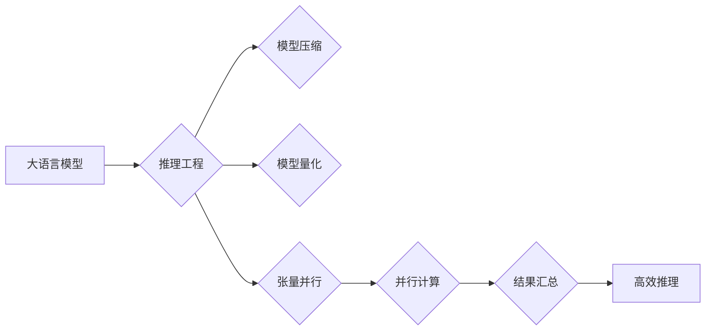

## 大语言模型原理与工程实践：大语言模型推理工程提高并行度：张量并行 

> 关键词：大语言模型、推理工程、张量并行、并行度、性能优化、深度学习

## 1. 背景介绍

近年来，大语言模型（LLM）在自然语言处理领域取得了显著的突破，展现出强大的文本生成、翻译、问答和代码生成能力。然而，LLM的推理过程通常需要消耗大量的计算资源和时间，这限制了其在实际应用中的部署和推广。为了提高LLM推理效率，并行化技术成为一个重要的研究方向。

张量并行是目前最常用的并行化技术之一，它将模型参数和数据分布到多个计算设备上，并通过并行计算加速推理过程。张量并行的应用可以显著提高LLM推理的吞吐量和效率，使其能够在更短的时间内处理更大的文本数据。

## 2. 核心概念与联系

### 2.1  大语言模型

大语言模型是指参数量巨大、训练数据海量的人工智能模型，能够理解和生成人类语言。它们通常基于Transformer架构，并通过大量的文本数据进行预训练，从而学习到丰富的语言知识和模式。

### 2.2  推理工程

推理工程是指将训练好的机器学习模型部署到实际应用环境中，并进行高效的推理过程的设计和优化。它包括模型压缩、量化、并行化等技术，旨在提高模型的推理速度、降低计算成本和内存占用。

### 2.3  张量并行

张量并行是一种将模型参数和数据分布到多个计算设备上，并通过并行计算加速推理过程的技术。它将模型的张量（tensor）拆分成多个子张量，分别分配到不同的设备上进行计算，最后将结果汇总得到最终的输出。

**Mermaid 流程图**



## 3. 核心算法原理 & 具体操作步骤

### 3.1  算法原理概述

张量并行的核心思想是将模型参数和数据分布到多个计算设备上，并通过并行计算加速推理过程。它将模型的张量拆分成多个子张量，分别分配到不同的设备上进行计算，最后将结果汇总得到最终的输出。

### 3.2  算法步骤详解

1. **模型划分:** 将模型参数和数据拆分成多个子张量，每个子张量分配到不同的计算设备上。
2. **数据并行:** 将输入数据拆分成多个子数据，每个子数据分配到不同的计算设备上进行处理。
3. **并行计算:** 在每个计算设备上，分别对子张量和子数据进行计算，得到子结果。
4. **结果汇总:** 将所有计算设备上的子结果汇总，得到最终的输出结果。

### 3.3  算法优缺点

**优点:**

* **提高并行度:** 可以充分利用多核CPU和GPU的计算能力，显著提高推理速度。
* **降低延迟:** 可以减少模型推理的延迟时间，提高用户体验。
* **处理大规模数据:** 可以处理更大的文本数据，扩展模型的应用场景。

**缺点:**

* **复杂性增加:** 需要考虑数据分布、模型划分和结果汇总等复杂问题。
* **通信开销:** 数据和模型参数之间的通信会增加计算开销。
* **硬件要求:** 需要支持多设备并行计算的硬件平台。

### 3.4  算法应用领域

张量并行技术广泛应用于各种深度学习领域，例如：

* **自然语言处理:** 大语言模型推理、机器翻译、文本摘要等。
* **计算机视觉:** 图像分类、目标检测、图像分割等。
* **语音识别:** 语音转文本、语音合成等。

## 4. 数学模型和公式 & 详细讲解 & 举例说明

### 4.1  数学模型构建

假设我们有一个包含 $N$ 个参数的深度学习模型，需要在 $P$ 个计算设备上进行并行计算。

* **模型参数:** $W = \{w_1, w_2,..., w_N\}$
* **计算设备:** $D = \{d_1, d_2,..., d_P\}$

我们将模型参数 $W$ 分配到 $P$ 个计算设备上，每个设备负责计算一部分模型参数。

### 4.2  公式推导过程

假设每个设备 $d_i$ 负责计算模型参数 $w_{i \cdot k : (i+1) \cdot k - 1}$，其中 $k$ 是每个设备分配的参数数量。

* **模型参数分配:** $W_i = \{w_{i \cdot k : (i+1) \cdot k - 1}\}$

每个设备 $d_i$ 对输入数据 $x_i$ 进行计算，得到子结果 $y_i$。

* **子结果计算:** $y_i = f(W_i, x_i)$

最终的输出结果 $y$ 是所有子结果 $y_i$ 的汇总。

* **结果汇总:** $y = \text{aggregate}(y_1, y_2,..., y_P)$

### 4.3  案例分析与讲解

例如，一个包含 1000 个参数的模型，在 4 个计算设备上进行张量并行。每个设备负责计算 250 个参数。

* **模型参数分配:** $W_1 = \{w_1, w_2,..., w_{250}\}$, $W_2 = \{w_{251}, w_{252},..., w_{500}\}$, $W_3 = \{w_{501}, w_{502},..., w_{750}\}$, $W_4 = \{w_{751}, w_{752},..., w_{1000}\}$

每个设备对输入数据进行计算，得到子结果。最终将四个子结果汇总，得到最终的输出结果。

## 5. 项目实践：代码实例和详细解释说明

### 5.1  开发环境搭建

* **操作系统:** Linux
* **深度学习框架:** PyTorch
* **GPU:** NVIDIA GeForce RTX 3090

### 5.2  源代码详细实现

```python
import torch
import torch.nn as nn
from torch.nn.parallel import DistributedDataParallel as DDP

# 定义模型
class MyModel(nn.Module):
    def __init__(self):
        super(MyModel, self).__init__()
        # 模型结构定义

    def forward(self, x):
        # 模型前向传播过程

# 初始化模型
model = MyModel()

# 定义数据并行策略
device_ids = [0, 1, 2, 3]  # 使用四个GPU
model = DDP(model, device_ids=device_ids)

# 加载数据
#...

# 进行推理
with torch.no_grad():
    output = model(input_data)

# 打印输出结果
print(output)
```

### 5.3  代码解读与分析

* **DistributedDataParallel:** PyTorch中的DDP模块实现了数据并行和模型并行。
* **device_ids:** 指定模型将分配到哪些GPU设备上。
* **with torch.no_grad()::** 在推理过程中禁用梯度计算，提高效率。

### 5.4  运行结果展示

运行代码后，模型将利用四个GPU进行并行计算，并输出推理结果。

## 6. 实际应用场景

张量并行技术广泛应用于各种实际应用场景，例如：

* **大型语言模型推理:** 将大型语言模型部署到云端平台，提供高效的文本生成、翻译和问答服务。
* **实时语音识别:** 在智能家居设备、车载系统等场景中，实现实时语音识别和理解。
* **图像识别和分析:** 在医疗影像分析、自动驾驶等领域，加速图像识别和分析过程。

### 6.4  未来应用展望

随着计算硬件的不断发展，张量并行技术将进一步提高LLM推理的效率和性能，使其能够应用于更多更复杂的场景。例如：

* **多模态LLM推理:** 将文本、图像、音频等多模态数据进行并行处理，构建更智能的交互系统。
* **边缘计算LLM推理:** 将LLM模型部署到边缘设备上，实现本地化推理和低延迟交互。
* **可解释性增强:** 通过并行计算和数据分析，提高LLM推理过程的可解释性和透明度。

## 7. 工具和资源推荐

### 7.1  学习资源推荐

* **书籍:**
    * Deep Learning with PyTorch
    * Hands-On Machine Learning with Scikit-Learn, Keras & TensorFlow
* **在线课程:**
    * Coursera: Deep Learning Specialization
    * Udacity: Deep Learning Nanodegree
* **博客和论坛:**
    * PyTorch官方博客
    * TensorFlow官方博客
    * Stack Overflow

### 7.2  开发工具推荐

* **深度学习框架:** PyTorch, TensorFlow
* **分布式训练框架:** Horovod, Ray
* **代码编辑器:** VS Code, Atom

### 7.3  相关论文推荐

* **张量并行论文:**
    * Deep Learning with Large-Scale Distributed Training
    * Parameter-Efficient Fine-Tuning for Large Language Models

## 8. 总结：未来发展趋势与挑战

### 8.1  研究成果总结

张量并行技术在LLM推理工程中取得了显著的成果，显著提高了推理速度和效率，推动了LLM在实际应用中的推广。

### 8.2  未来发展趋势

* **混合精度训练:** 利用不同精度的数据类型进行计算，提高训练效率和模型性能。
* **模型压缩和量化:** 减少模型参数量和计算复杂度，降低部署成本和内存占用。
* **自动并行化:** 自动生成并行化代码，降低开发门槛和时间成本。

### 8.3  面临的挑战

* **通信开销:** 数据和模型参数之间的通信会增加计算开销，需要进一步优化通信策略。
* **模型复杂度:** 随着模型规模的不断增长，并行化带来的挑战也会增加。
* **硬件限制:** 高效的并行计算需要强大的计算硬件支持，成本较高。

### 8.4  研究展望

未来研究将继续探索更有效的并行化技术，降低通信开销，提高模型性能和效率，推动LLM在更多领域得到应用。

## 9. 附录：常见问题与解答

* **Q1: 张量并行和数据并行有什么区别？**

* **A1:** 张量并行是指将模型参数和数据分布到多个计算设备上，并行计算模型推理过程。数据并行是指将数据分布到多个计算设备上，每个设备对数据进行独立计算，最后汇总结果。

* **Q2: 如何选择合适的并行化策略？**

* **A2:** 选择合适的并行化策略需要考虑模型规模、数据规模、硬件资源等因素。

* **Q3: 张量并行有什么缺点？**

* **A3:** 张量并行需要考虑数据分布、模型划分和结果汇总等复杂问题，通信开销较大，硬件要求较高。


作者：禅与计算机程序设计艺术 / Zen and the Art of Computer Programming 
