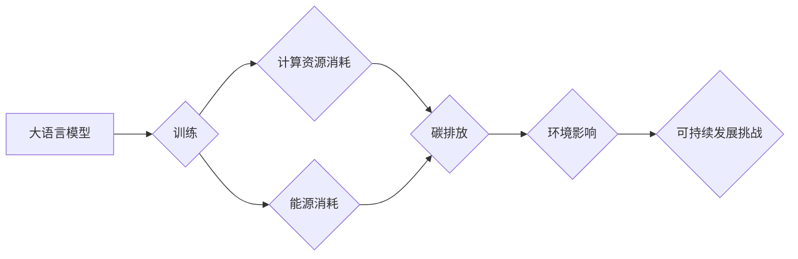

## 大语言模型原理基础与前沿 估算训练模型的排放量

> 关键词：大语言模型、训练成本、碳排放、环境影响、可持续发展、优化算法、高效训练

## 1. 背景介绍

近年来，大语言模型（LLM）在自然语言处理领域取得了令人瞩目的成就，展现出强大的文本生成、翻译、摘要和问答能力。这些模型通常由数十亿甚至数万亿个参数组成，能够学习和理解复杂的语言模式。然而，LLM的训练过程需要消耗大量的计算资源和能源，导致其碳排放量不容忽视。

随着人们对环境保护意识的增强，LLM的训练成本和碳排放问题逐渐成为研究热点。如何降低LLM的训练成本，同时保持其性能，成为一个重要的挑战。

## 2. 核心概念与联系

### 2.1  大语言模型

大语言模型是指参数量巨大、训练数据海量的人工智能模型，能够理解和生成人类语言。它们通常基于Transformer架构，利用自注意力机制学习语言的上下文关系。

### 2.2  训练成本

LLM的训练成本包括计算资源消耗、能源消耗和时间成本。计算资源主要指GPU、CPU等硬件设备，能源消耗主要指电力消耗。

### 2.3  碳排放

碳排放是指人类活动释放到大气中的二氧化碳和其他温室气体。LLM的训练过程会消耗大量的能源，从而产生相应的碳排放。

### 2.4  可持续发展

可持续发展是指满足当前需求，同时不损害子孙后代满足其自身需求的能力。LLM的训练应遵循可持续发展原则，降低其环境影响。

**Mermaid 流程图**

## 3. 核心算法原理 & 具体操作步骤

### 3.1  算法原理概述

LLM的训练主要基于深度学习算法，特别是Transformer架构。Transformer架构利用自注意力机制学习语言的上下文关系，能够捕捉长距离依赖关系。

训练过程可以概括为以下步骤：

1. **数据预处理:** 将文本数据进行清洗、分词、标记等预处理操作。
2. **模型构建:** 根据Transformer架构构建模型，并初始化模型参数。
3. **模型训练:** 使用训练数据训练模型，通过反向传播算法更新模型参数。
4. **模型评估:** 使用测试数据评估模型性能，并根据评估结果调整训练参数。
5. **模型部署:** 将训练好的模型部署到实际应用场景中。

### 3.2  算法步骤详解

1. **数据预处理:**

   - 清洗数据：去除停用词、标点符号等无用信息。
   - 分词：将文本分割成单词或子词。
   - 标记：为每个单词或子词添加标签，例如词性标注、命名实体识别等。

2. **模型构建:**

   - 定义模型结构：包括编码器、解码器、注意力机制等模块。
   - 初始化模型参数：使用随机初始化或预训练模型参数。

3. **模型训练:**

   - 使用训练数据输入模型，并计算模型输出与真实值的损失函数。
   - 通过反向传播算法更新模型参数，降低损失函数值。
   - 使用优化算法，例如Adam、SGD等，调整模型参数。

4. **模型评估:**

   - 使用测试数据输入模型，并计算模型性能指标，例如准确率、困惑度等。
   - 根据评估结果调整训练参数，例如学习率、批处理大小等。

5. **模型部署:**

   - 将训练好的模型部署到服务器或云平台，供用户访问。
   - 使用API接口提供模型服务。

### 3.3  算法优缺点

**优点:**

- 能够学习复杂的语言模式。
- 性能优异，在文本生成、翻译、摘要等任务中表现出色。

**缺点:**

- 训练成本高，需要消耗大量的计算资源和能源。
- 容易受到训练数据偏差的影响。
- 缺乏可解释性，难以理解模型的决策过程。

### 3.4  算法应用领域

LLM在多个领域都有广泛的应用，例如：

- 自然语言处理：文本生成、翻译、摘要、问答、对话系统等。
- 人工智能辅助：代码生成、文档写作、创意写作等。
- 医疗保健：疾病诊断、药物研发、患者咨询等。
- 教育科技：个性化学习、智能辅导等。

## 4. 数学模型和公式 & 详细讲解 & 举例说明

### 4.1  数学模型构建

LLM的训练基于深度学习算法，其核心是构建一个复杂的数学模型，能够映射输入文本到输出文本。

**Transformer架构**

Transformer架构的核心是自注意力机制，它能够捕捉文本序列中的长距离依赖关系。

**自注意力机制**

自注意力机制计算每个单词与其他单词之间的相关性，并根据相关性赋予每个单词不同的权重。

**公式:**

$$
Attention(Q, K, V) = softmax(\frac{QK^T}{\sqrt{d_k}})V
$$

其中：

- $Q$：查询矩阵
- $K$：键矩阵
- $V$：值矩阵
- $d_k$：键向量的维度
- $softmax$：softmax函数

**举例说明:**

假设我们有一个句子“我爱学习编程”，其词向量表示为：

$$
Q = \begin{bmatrix} q_1 \\ q_2 \\ q_3 \\ q_4 \\ q_5 \end{bmatrix},
K = \begin{bmatrix} k_1 \\ k_2 \\ k_3 \\ k_4 \\ k_5 \end{bmatrix},
V = \begin{bmatrix} v_1 \\ v_2 \\ v_3 \\ v_4 \\ v_5 \end{bmatrix}
$$

其中，$q_i$、$k_i$、$v_i$分别表示每个单词的查询向量、键向量和值向量。

通过自注意力机制，我们可以计算每个单词与其他单词之间的相关性，并根据相关性赋予每个单词不同的权重。最终，我们可以得到一个新的表示，其中每个单词都包含了其上下文信息。

### 4.2  公式推导过程

自注意力机制的公式推导过程可以参考相关文献，例如Vaswani et al. (2017)的论文《Attention Is All You Need》。

### 4.3  案例分析与讲解

可以通过实际案例分析，例如BERT模型的训练过程，来深入理解LLM的数学模型和公式。

## 5. 项目实践：代码实例和详细解释说明

### 5.1  开发环境搭建

LLM的开发环境通常需要配置强大的计算资源，例如GPU。可以使用云平台，例如AWS、Google Cloud、Azure等，搭建开发环境。

### 5.2  源代码详细实现

LLM的源代码通常开源，例如HuggingFace Transformers库。可以使用这些库进行模型训练和部署。

### 5.3  代码解读与分析

可以通过分析LLM的源代码，了解模型的结构、参数和训练过程。

### 5.4  运行结果展示

可以通过运行LLM的代码，生成文本、翻译文本、进行问答等，展示模型的性能。

## 6. 实际应用场景

### 6.1  文本生成

LLM可以用于生成各种类型的文本，例如文章、故事、诗歌等。

### 6.2  文本翻译

LLM可以用于将文本从一种语言翻译成另一种语言。

### 6.3  文本摘要

LLM可以用于生成文本的摘要，提取关键信息。

### 6.4  问答系统

LLM可以用于构建问答系统，回答用户的问题。

### 6.5  未来应用展望

LLM的应用场景还在不断扩展，未来可能应用于更多领域，例如：

- 个性化教育
- 智能客服
- 代码生成
- 创意写作

## 7. 工具和资源推荐

### 7.1  学习资源推荐

- **书籍:**

   - 《深度学习》
   - 《自然语言处理》
   - 《Transformer模型》

- **在线课程:**

   - Coursera
   - edX
   - Udacity

### 7.2  开发工具推荐

- **框架:**

   - TensorFlow
   - PyTorch
   - HuggingFace Transformers

- **库:**

   - NLTK
   - SpaCy
   - Gensim

### 7.3  相关论文推荐

- 《Attention Is All You Need》
- 《BERT: Pre-training of Deep Bidirectional Transformers for Language Understanding》
- 《GPT-3: Language Models are Few-Shot Learners》

## 8. 总结：未来发展趋势与挑战

### 8.1  研究成果总结

LLM在自然语言处理领域取得了显著进展，展现出强大的文本理解和生成能力。

### 8.2  未来发展趋势

LLM的未来发展趋势包括：

- 模型规模的进一步扩大
- 训练效率的提升
- 泛化能力的增强
- 可解释性的提高

### 8.3  面临的挑战

LLM面临的挑战包括：

- 训练成本高
- 数据偏差问题
- 安全性和隐私问题
- 伦理问题

### 8.4  研究展望

未来研究方向包括：

- 开发更有效的训练算法
- 探索新的模型架构
- 构建更安全、更可靠的LLM
- 促进LLM的伦理发展

## 9. 附录：常见问题与解答

### 9.1  LLM的训练需要多少计算资源？

LLM的训练需要大量的计算资源，例如GPU、TPU等。训练规模越大的模型，需要的计算资源就越多。

### 9.2  LLM的训练时间有多长？

LLM的训练时间取决于模型规模、训练数据量和训练硬件等因素。训练大型LLM可能需要数周甚至数月的时间。

### 9.3  如何降低LLM的训练成本？

可以采用以下方法降低LLM的训练成本：

- 使用更有效的训练算法
- 探索新的模型架构
- 利用云计算平台
- 共享训练资源

### 9.4  LLM的碳排放量如何计算？

LLM的碳排放量可以根据训练过程的能源消耗进行计算。

### 9.5  如何减少LLM的碳排放？

可以采用以下方法减少LLM的碳排放：

- 使用更节能的训练硬件
- 优化训练算法
- 利用可再生能源

作者：禅与计算机程序设计艺术 / Zen and the Art of Computer Programming 
