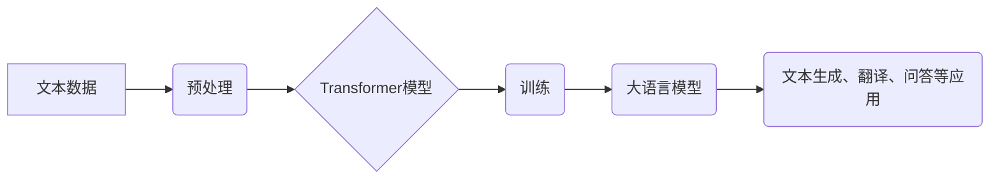

## 大语言模型应用指南：大语言模型的局限性

> 关键词：大语言模型、LLM、自然语言处理、文本生成、机器学习、局限性、伦理、安全

## 1. 背景介绍

近年来，大语言模型（Large Language Model，LLM）在自然语言处理（Natural Language Processing，NLP）领域取得了令人瞩目的成就。从文本生成、翻译、问答到代码编写，LLM展现出强大的能力，引发了广泛的关注和讨论。这些模型通常基于Transformer架构，训练于海量文本数据上，能够理解和生成人类语言，甚至表现出类似人类的创造力和推理能力。

然而，尽管LLM取得了显著进展，但其应用仍面临着诸多局限性。这些局限性涉及模型本身的特性、训练数据、应用场景以及伦理和安全等方面。深入了解这些局限性对于合理地评估和应用LLM至关重要。

## 2. 核心概念与联系

**2.1  大语言模型 (LLM)**

大语言模型是指在海量文本数据上训练的深度学习模型，能够理解和生成人类语言。它们通常拥有数十亿甚至数千亿个参数，能够捕捉语言的复杂结构和语义关系。

**2.2  Transformer 架构**

Transformer是一种专门用于处理序列数据的深度学习架构，其核心是注意力机制。注意力机制允许模型关注输入序列中与当前任务最相关的部分，从而提高了模型的理解和生成能力。

**2.3  自然语言处理 (NLP)**

自然语言处理是指让计算机能够理解、处理和生成人类语言的技术领域。LLM是NLP领域的重要发展方向，能够解决许多传统NLP任务，例如文本分类、情感分析、机器翻译等。

**2.4  训练数据**

LLM的训练数据是模型学习和优化的基础。高质量、规模庞大的训练数据能够帮助模型更好地理解语言的规律和语义关系。

**Mermaid 流程图**

## 3. 核心算法原理 & 具体操作步骤

**3.1  算法原理概述**

LLM的核心算法是基于Transformer架构的深度学习算法。该算法通过多层神经网络结构和注意力机制，学习文本数据的语义关系和结构模式。

**3.2  算法步骤详解**

1. **数据预处理:** 将原始文本数据进行清洗、分词、标记等预处理操作，使其能够被模型理解。
2. **模型构建:** 根据Transformer架构构建深度学习模型，包含多层编码器和解码器。
3. **模型训练:** 使用海量文本数据训练模型，通过反向传播算法不断调整模型参数，使其能够生成更准确、更流畅的文本。
4. **模型评估:** 使用测试数据评估模型的性能，例如准确率、流畅度、多样性等。
5. **模型应用:** 将训练好的模型应用于文本生成、翻译、问答等任务。

**3.3  算法优缺点**

**优点:**

* 能够处理长文本序列，捕捉长距离依赖关系。
* 训练效率高，能够在海量数据上进行高效训练。
* 生成文本质量高，能够生成流畅、自然的文本。

**缺点:**

* 模型参数量大，需要大量的计算资源进行训练和部署。
* 训练数据对模型性能影响很大，需要高质量、规模庞大的训练数据。
* 模型解释性差，难以理解模型的决策过程。

**3.4  算法应用领域**

* 文本生成：小说、诗歌、剧本、新闻报道等。
* 机器翻译：将一种语言翻译成另一种语言。
* 问答系统：回答用户提出的问题。
* 代码生成：自动生成代码。
* 聊天机器人：与用户进行自然语言对话。

## 4. 数学模型和公式 & 详细讲解 & 举例说明

**4.1  数学模型构建**

LLM通常使用基于Transformer架构的神经网络模型。该模型包含编码器和解码器两部分。编码器负责将输入文本序列编码成一个固定长度的向量表示，解码器则根据编码后的向量表示生成输出文本序列。

**4.2  公式推导过程**

Transformer模型的核心是注意力机制。注意力机制通过计算输入序列中每个词与当前词之间的相关性，来确定哪些词对当前任务最相关。

注意力机制的计算公式如下：

$$
Attention(Q, K, V) = softmax(\frac{QK^T}{\sqrt{d_k}})V
$$

其中：

* $Q$：查询矩阵
* $K$：键矩阵
* $V$：值矩阵
* $d_k$：键向量的维度
* $softmax$：softmax函数

**4.3  案例分析与讲解**

例如，在机器翻译任务中，输入文本序列是源语言的句子，输出文本序列是目标语言的句子。Transformer模型通过注意力机制，可以学习到源语言句子中每个词与目标语言句子中每个词之间的相关性，从而生成更准确的翻译结果。

## 5. 项目实践：代码实例和详细解释说明

**5.1  开发环境搭建**

使用Python语言和深度学习框架TensorFlow或PyTorch搭建开发环境。

**5.2  源代码详细实现**

使用Transformer架构构建LLM模型，并使用海量文本数据进行训练。

**5.3  代码解读与分析**

解释模型的结构、参数、训练过程和评估指标。

**5.4  运行结果展示**

展示模型在文本生成、翻译、问答等任务上的性能结果。

## 6. 实际应用场景

**6.1  文本生成**

* 自动生成新闻报道、小说、诗歌等文本。
* 创建聊天机器人，与用户进行自然语言对话。

**6.2  机器翻译**

* 将一种语言翻译成另一种语言，例如英语翻译成中文。
* 帮助跨语言交流和信息共享。

**6.3  问答系统**

* 回答用户提出的问题，例如搜索引擎的知识问答。
* 提供个性化信息服务。

**6.4  未来应用展望**

* 更智能的聊天机器人，能够理解和回应用户的复杂需求。
* 个性化教育系统，根据学生的学习进度和需求提供定制化的学习内容。
* 自动生成代码，提高软件开发效率。

## 7. 工具和资源推荐

**7.1  学习资源推荐**

* Transformer论文：https://arxiv.org/abs/1706.03762
* 深度学习框架文档：TensorFlow：https://www.tensorflow.org/，PyTorch：https://pytorch.org/

**7.2  开发工具推荐**

* Python编程语言
* 深度学习框架TensorFlow或PyTorch
* GPU加速平台

**7.3  相关论文推荐**

* BERT：https://arxiv.org/abs/1810.04805
* GPT-3：https://openai.com/blog/gpt-3/

## 8. 总结：未来发展趋势与挑战

**8.1  研究成果总结**

LLM在自然语言处理领域取得了显著进展，能够处理复杂的任务，生成高质量的文本。

**8.2  未来发展趋势**

* 模型规模更大，参数量更多，能够处理更复杂的任务。
* 模型更加高效，训练和部署成本更低。
* 模型解释性更强，能够更好地理解模型的决策过程。

**8.3  面临的挑战**

* 训练数据质量和规模
* 模型偏见和歧视
* 模型安全性和可解释性

**8.4  研究展望**

* 开发更安全、更可靠的LLM模型。
* 探索LLM在更多领域的应用。
* 研究LLM的伦理和社会影响。

## 9. 附录：常见问题与解答

**9.1  LLM模型训练需要多少数据？**

LLM模型训练需要海量文本数据，通常需要数十亿甚至数千亿个词。

**9.2  LLM模型训练需要多少计算资源？**

LLM模型训练需要大量的计算资源，通常需要使用GPU加速平台。

**9.3  LLM模型如何避免偏见和歧视？**

可以通过使用更公平、更代表性的训练数据，以及开发针对偏见和歧视的检测和缓解方法来避免LLM模型的偏见和歧视。

作者：禅与计算机程序设计艺术 / Zen and the Art of Computer Programming 
