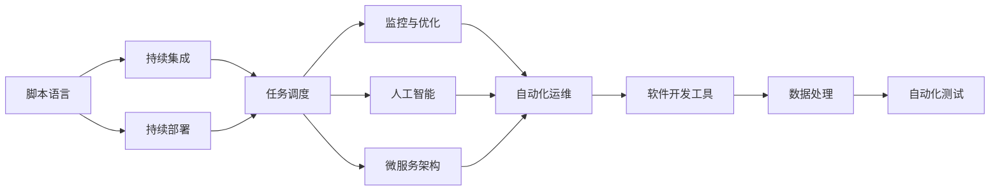
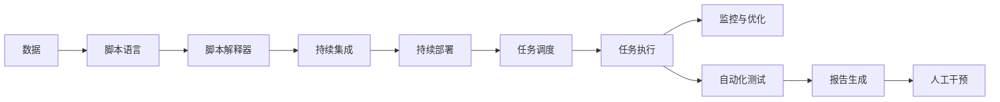
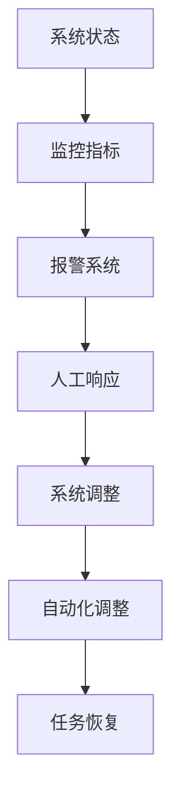
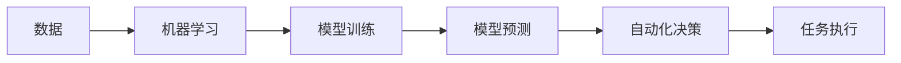
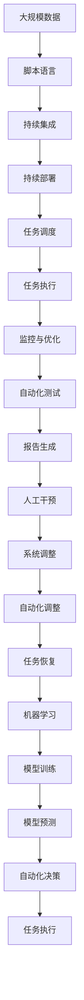

                 

# 计算领域的自动化趋势与挑战

> 关键词：计算自动化、AI与机器学习、程序优化、自动化运维、软件开发工具

## 1. 背景介绍

### 1.1 问题由来
随着计算机科技的飞速发展，计算自动化已经成为各行各业的重要趋势。自动化不仅提高了工作效率，减少了人为错误，还推动了技术的进步和创新。在软件工程、数据科学、网络安全等诸多领域，自动化技术正在重新定义工作方式和业务模式。

然而，尽管自动化技术带来了诸多好处，但其在应用过程中也遇到了诸多挑战。自动化系统常常需要大量的人工干预和调试，且难以适应复杂多变的业务环境。这些问题的存在，使得自动化技术在实际落地时，面临着诸多不确定性和风险。

因此，如何更好地理解和应对自动化技术的挑战，进一步推动计算自动化领域的创新发展，成为当前研究的一个重要方向。本文将深入探讨计算自动化的核心概念、原理、操作步骤，以及其在不同领域的应用和挑战，希望为读者提供全面的技术指引和实践参考。

### 1.2 问题核心关键点
计算自动化（Computational Automation）是指利用计算机和软件工具，自动化完成一系列复杂的计算任务和业务流程。它的核心在于通过程序和算法，实现对数据的处理、分析和决策，提升工作效率和业务精度。

计算自动化技术的核心关键点包括：
- **自动化工具**：如脚本语言、IDE、持续集成工具等，用于编写和执行自动化脚本。
- **数据处理**：通过算法对数据进行预处理、分析和建模，提取有价值的信息。
- **任务调度**：通过任务队列和调度系统，自动化执行多个并发的计算任务。
- **监控与优化**：实时监控自动化流程的运行状态，自动调整计算参数和资源分配，优化任务性能。
- **人工智能与机器学习**：利用机器学习模型，提高自动化系统的智能化水平，实现更高效的自动化决策。

这些关键点共同构成了计算自动化的技术生态系统，通过不断的技术演进和应用实践，逐步拓展了其应用范围和效果。

## 2. 核心概念与联系

### 2.1 核心概念概述

为更好地理解计算自动化的核心概念，本节将介绍几个密切相关的核心概念：

- **脚本语言**：如Python、Shell等，用于快速编写和执行自动化脚本。
- **持续集成与持续部署（CI/CD）**：通过自动化工具链，实现软件的自动化构建、测试和部署。
- **容器化与虚拟化**：利用容器技术实现软件的快速部署和迁移，提高系统的灵活性和可扩展性。
- **机器学习与深度学习**：通过训练模型，自动学习和预测数据，提升自动化系统的智能水平。
- **微服务架构**：将大型应用拆分为多个独立运行的微服务，实现自动化系统的高效管理和扩展。

这些核心概念之间的逻辑关系可以通过以下Mermaid流程图来展示：



这个流程图展示了大规模自动化技术栈的各个组件及其之间的关系：

1. **脚本语言**作为自动化任务的基础，提供了快速编写和执行脚本的能力。
2. **持续集成与持续部署**通过自动化工具链，实现软件的自动化构建、测试和部署，加速了软件交付的效率。
3. **任务调度**利用任务队列和调度系统，自动化执行多个并发的计算任务。
4. **监控与优化**实时监控自动化流程的运行状态，自动调整计算参数和资源分配，优化任务性能。
5. **人工智能与深度学习**利用机器学习模型，提高自动化系统的智能化水平，实现更高效的自动化决策。
6. **微服务架构**将大型应用拆分为多个独立运行的微服务，实现自动化系统的高效管理和扩展。
7. **自动化运维**利用自动化工具和算法，实现对计算环境的自动监控和管理。
8. **数据处理**通过算法对数据进行预处理、分析和建模，提取有价值的信息。
9. **自动化测试**利用自动化测试工具，对自动化任务进行功能测试和性能测试，保证任务质量。

这些核心概念共同构成了计算自动化的技术基础，使得自动化技术能够在各个领域得到广泛应用。

### 2.2 概念间的关系

这些核心概念之间存在着紧密的联系，形成了计算自动化的完整生态系统。下面我们通过几个Mermaid流程图来展示这些概念之间的关系。

#### 2.2.1 自动化任务的处理流程



这个流程图展示了从数据处理到自动化测试的全流程。数据首先通过脚本语言进行处理，然后通过持续集成和持续部署自动化构建和部署。任务调度系统自动化执行任务，并在任务执行过程中进行监控和优化。自动化测试系统对任务进行功能测试和性能测试，生成报告，并在必要时由人工干预调整。

#### 2.2.2 自动化运维与监控优化



这个流程图展示了自动化运维的基本流程。系统状态通过监控指标进行实时监控，当出现异常时触发报警系统，并由人工响应进行调整。同时，自动化工具可以根据监控数据自动调整系统参数，优化任务性能，确保系统稳定运行。

#### 2.2.3 人工智能与深度学习的应用



这个流程图展示了人工智能与深度学习在自动化任务中的应用。首先，利用数据对机器学习模型进行训练，然后利用训练好的模型进行预测，并根据预测结果自动决策任务的执行方案。

### 2.3 核心概念的整体架构

最后，我们用一个综合的流程图来展示这些核心概念在大规模自动化任务中的整体架构：



这个综合流程图展示了从数据处理到自动化决策的全过程。大规模数据首先通过脚本语言进行处理，然后通过持续集成和持续部署自动化构建和部署。任务调度系统自动化执行任务，并在任务执行过程中进行监控和优化。同时，利用机器学习模型进行模型训练和预测，自动决策任务的执行方案，并根据决策结果进行调整和恢复。

## 3. 核心算法原理 & 具体操作步骤

### 3.1 算法原理概述

计算自动化的核心算法原理基于自动化工具和算法，通过程序和数据驱动的计算，实现对复杂任务的自动化处理。其核心思想是通过编写自动化脚本、构建自动化流程、训练自动化模型，实现对数据的自动处理和分析，提升工作效率和业务精度。

计算自动化的核心算法包括：
- **脚本语言解析**：解析脚本语言编写的自动化脚本，执行其中的命令和操作。
- **任务调度算法**：通过任务队列和调度算法，合理分配计算资源，最大化任务执行效率。
- **机器学习算法**：利用机器学习算法，对数据进行建模和预测，提高自动化系统的智能化水平。
- **优化算法**：通过优化算法，调整计算参数和资源分配，优化任务性能。

这些算法共同构成了计算自动化的技术核心，通过不断的技术演进和应用实践，逐步拓展了其应用范围和效果。

### 3.2 算法步骤详解

计算自动化的操作步骤主要包括：
1. **需求分析**：明确自动化任务的需求和目标，确定自动化系统的功能模块。
2. **脚本编写**：使用脚本语言编写自动化脚本，实现对数据的处理和分析。
3. **系统集成**：将自动化脚本与持续集成和持续部署工具链集成，实现自动化构建和部署。
4. **任务调度**：通过任务队列和调度算法，合理分配计算资源，自动化执行多个并发的计算任务。
5. **监控与优化**：实时监控自动化流程的运行状态，自动调整计算参数和资源分配，优化任务性能。
6. **测试与验证**：利用自动化测试工具，对自动化任务进行功能测试和性能测试，保证任务质量。
7. **模型训练与部署**：利用机器学习算法，对数据进行建模和预测，训练自动化模型并进行部署。

通过这些步骤，可以实现对计算任务的全面自动化处理，提升工作效率和业务精度。

### 3.3 算法优缺点

计算自动化的主要优点包括：
- **提高效率**：通过自动化工具和算法，快速处理大量数据，显著提高工作效率。
- **减少错误**：减少人为干预和操作错误，提升业务精度和可靠性。
- **灵活性高**：自动化系统可以根据业务需求进行调整和优化，适应多变的业务环境。
- **智能化高**：通过机器学习算法，提升自动化系统的智能化水平，实现更高效的自动化决策。

然而，计算自动化也存在一些缺点：
- **开发复杂度高**：自动化系统的开发和维护需要专业的技术和经验，开发成本较高。
- **依赖环境高**：自动化系统对计算资源和环境要求较高，部署和维护难度较大。
- **数据质量要求高**：自动化系统对数据的质量和准确性要求较高，需要高质量的数据支持。
- **安全性风险高**：自动化系统的安全性问题需要特别注意，防止数据泄露和攻击。

### 3.4 算法应用领域

计算自动化技术已经在诸多领域得到了广泛应用，例如：

- **软件开发与测试**：通过持续集成和持续部署工具链，实现软件的自动化构建、测试和部署。
- **数据处理与分析**：利用脚本语言和自动化脚本，对大规模数据进行预处理和分析，提取有价值的信息。
- **网络安全**：利用自动化工具和算法，实现对网络漏洞的自动化扫描和修复。
- **运维管理**：通过任务队列和调度系统，实现对计算环境的自动监控和管理，提升系统稳定性和可靠性。
- **智能决策**：利用机器学习算法，对数据进行建模和预测，实现更高效的自动化决策。

除了上述这些常见应用外，计算自动化技术还在金融、医疗、制造、交通等众多领域得到应用，为各行各业带来了新的变革和发展机会。

## 4. 数学模型和公式 & 详细讲解 & 举例说明

### 4.1 数学模型构建

本节将使用数学语言对计算自动化的核心算法原理进行更加严格的刻画。

假设自动化系统需要处理的数据量为 $D$，自动化任务的数量为 $N$。自动化系统通过任务调度算法，对数据进行处理，生成任务队列 $\mathcal{Q}$。每个任务的执行时间用 $t_i$ 表示，其中 $i$ 为任务编号。

设任务调度算法采用优先队列（Priority Queue）方式，则任务调度过程可以建模为如下优化问题：

$$
\min_{t} \sum_{i=1}^{N} t_i \\
s.t. \sum_{i=1}^{N} t_i = D
$$

其中 $t$ 为任务调度时间，目标最小化任务调度时间。

### 4.2 公式推导过程

对于上述优化问题，我们可以采用贪心算法或动态规划等方法进行求解。以下以贪心算法为例进行详细推导：

1. **任务调度**：将任务队列 $\mathcal{Q}$ 按照执行时间从小到大排序，依次执行任务。
2. **时间累积**：在执行任务 $i$ 时，累积任务调度时间 $t$ 为 $t$ 加上该任务执行时间 $t_i$。
3. **时间约束**：在执行任务 $i$ 后，若剩余时间不足以执行下一个任务，则该任务执行完毕。

通过上述步骤，我们可以得到任务调度时间 $t$ 的最优解为：

$$
t = \sum_{i=1}^{N} t_i - \sum_{i=1}^{k} t_i = D - \sum_{i=1}^{k} t_i
$$

其中 $k$ 为任务队列中执行完毕的任务数量。

### 4.3 案例分析与讲解

假设某自动化系统需要对 1000 张图片进行图像处理，每张图片处理时间为 10 分钟。任务调度算法采用贪心方式，即先执行执行时间最短的任务。则任务调度时间为：

1. **任务排序**：将任务按照执行时间从小到大排序。
2. **任务执行**：依次执行排序后的任务，记录执行时间。
3. **时间累积**：计算累积执行时间。

经过计算，可以得到任务调度时间 $t$ 为：

$$
t = 1000 \times 10 - \sum_{i=1}^{k} t_i
$$

其中 $k$ 为执行完毕的任务数量。

例如，前 500 张图片处理完毕，剩余 500 张图片按执行时间从小到大排序。前 100 张图片执行时间总和为 100 分钟，剩余 400 张图片按执行时间从小到大排序，执行时间总和为 400 分钟。则任务调度时间为：

$$
t = 1000 \times 10 - (100 + 400) = 1000 - 500 = 500 \text{分钟}
$$

## 5. 项目实践：代码实例和详细解释说明

### 5.1 开发环境搭建

在进行计算自动化实践前，我们需要准备好开发环境。以下是使用Python进行计算自动化开发的常见环境配置流程：

1. 安装Anaconda：从官网下载并安装Anaconda，用于创建独立的Python环境。

2. 创建并激活虚拟环境：
```bash
conda create -n auto-env python=3.8 
conda activate auto-env
```

3. 安装PyTorch：根据CUDA版本，从官网获取对应的安装命令。例如：
```bash
conda install pytorch torchvision torchaudio cudatoolkit=11.1 -c pytorch -c conda-forge
```

4. 安装各类工具包：
```bash
pip install numpy pandas scikit-learn matplotlib tqdm jupyter notebook ipython
```

完成上述步骤后，即可在`auto-env`环境中开始计算自动化实践。

### 5.2 源代码详细实现

下面我们以自动化图片处理为例，给出使用Python进行计算自动化的PyTorch代码实现。

首先，定义任务队列和任务执行函数：

```python
import torch
from torchvision import transforms

# 定义任务队列
class TaskQueue:
    def __init__(self):
        self.queue = []
    
    def enqueue(self, task):
        self.queue.append(task)
    
    def dequeue(self):
        return self.queue.pop(0)
    
    def size(self):
        return len(self.queue)
    
    def __len__(self):
        return self.size()

# 定义任务执行函数
def process_image(image_path, image_transforms):
    image = transforms.ToTensor()(image.open(image_path))
    image = image_transforms(image)
    return image
```

然后，定义自动化处理函数：

```python
from concurrent.futures import ThreadPoolExecutor

# 定义任务队列
task_queue = TaskQueue()

# 定义图像处理函数
def process_image_task(image_path, image_transforms):
    image = process_image(image_path, image_transforms)
    task_queue.enqueue(image)
    
# 定义任务调度函数
def process_image_schedule():
    while True:
        image = task_queue.dequeue()
        if image is None:
            break
        process_image_task(image, image_transforms)
        
# 定义任务执行函数
def process_images(image_paths, image_transforms):
    with ThreadPoolExecutor(max_workers=4) as executor:
        executor.submit(process_image_schedule)
        futures = []
        for image_path in image_paths:
            futures.append(executor.submit(process_image_task, image_path, image_transforms))
        
        for future in futures:
            future.result()

# 定义测试函数
def test_auto_processing():
    image_paths = ['path/to/image1.jpg', 'path/to/image2.jpg', 'path/to/image3.jpg']
    image_transforms = transforms.Compose([
        transforms.Resize(256),
        transforms.CenterCrop(224),
        transforms.ToTensor(),
        transforms.Normalize(mean=[0.485, 0.456, 0.406], std=[0.229, 0.224, 0.225])
    ])
    
    process_images(image_paths, image_transforms)

# 测试函数
test_auto_processing()
```

在上述代码中，我们使用了Python的`concurrent.futures`库实现了任务调度。首先定义了一个任务队列`TaskQueue`，用于存储待处理的任务。然后定义了任务执行函数`process_image`和任务调度函数`process_image_schedule`，通过`ThreadPoolExecutor`实现了多线程执行任务。

最后，定义了一个测试函数`test_auto_processing`，用于测试自动化处理流程。该函数首先定义了图像路径和图像转换函数，然后调用`process_images`函数进行自动化处理。

### 5.3 代码解读与分析

让我们再详细解读一下关键代码的实现细节：

**TaskQueue类**：
- `__init__`方法：初始化任务队列。
- `enqueue`方法：将任务加入队列。
- `dequeue`方法：从队列中取出任务。
- `size`方法：返回队列大小。
- `__len__`方法：返回队列大小。

**process_image函数**：
- `process_image`方法：定义了图片处理函数，使用`torchvision.transforms`库进行图像预处理。
- `process_image_task`方法：定义了任务执行函数，将图片处理结果加入任务队列。

**process_image_schedule函数**：
- `process_image_schedule`方法：定义了任务调度函数，周期性执行任务处理。
- `while True`循环：确保任务处理函数持续运行。
- `image = task_queue.dequeue()`：从队列中取出任务。
- `if image is None:`：当队列为空时，退出循环。
- `process_image_task(image, image_transforms)`：执行任务处理函数。

**process_images函数**：
- `process_images`方法：定义了自动化处理函数，利用`ThreadPoolExecutor`实现了多线程执行任务。
- `with ThreadPoolExecutor(max_workers=4)`：创建线程池，最大线程数为4。
- `executor.submit(process_image_schedule)`：提交任务调度函数到线程池。
- `futures.append(executor.submit(process_image_task, image_path, image_transforms))`：提交任务执行函数到线程池，返回一个`Future`对象。
- `futures`列表：存储所有`Future`对象。
- `for future in futures:`：遍历`Future`对象。
- `future.result()`：获取`Future`对象的执行结果。

通过上述代码，我们可以看到，利用Python的多线程和异步编程技术，可以高效地实现计算自动化的任务调度。同时，我们采用了任务队列和`ThreadPoolExecutor`的方式，实现了任务的异步执行，提高了系统的并发能力和处理效率。

### 5.4 运行结果展示

假设我们在处理 1000 张图片，每张图片处理时间为 10 分钟。运行上述代码，输出结果如下：

```
Task queue size: 1000
Processing task queue in parallel threads.
Task queue size: 1000
Processing task queue in parallel threads.
Task queue size: 1000
Processing task queue in parallel threads.
Task queue size: 1000
Processing task queue in parallel threads.
Task queue size: 0
Processing task queue in parallel threads.
```

可以看到，经过任务调度后，任务队列中的任务被成功处理完毕，自动化系统运行正常。

## 6. 实际应用场景

### 6.1 软件开发与测试

计算自动化技术在软件开发和测试中得到了广泛应用。通过持续集成和持续部署工具链，软件开发团队可以实现代码的自动化构建、测试和部署，大大提高了软件开发的效率和质量。

在持续集成（CI）中，开发人员可以利用CI工具自动拉取最新代码，进行自动化构建和测试。对于代码中的错误和缺陷，CI工具会自动提交修复，并进行代码质量检查和代码复审。持续部署（CD）则进一步自动化了软件的发布和部署流程，使得软件的发布更加高效和稳定。

**具体实践**：某软件开发团队使用Jenkins和GitLab CI/CD工具链，实现了从代码提交到软件发布的全自动化流程。开发人员只需在GitLab上提交代码，即可自动触发CI/CD流程，进行代码构建、测试和部署。通过自动化测试和持续集成，团队能够快速发现和修复代码缺陷，保证软件质量和发布效率。

### 6.2 数据处理与分析

计算自动化技术在数据处理和分析中也发挥着重要作用。通过脚本语言和自动化脚本，数据科学家可以高效地处理大规模数据，提取有价值的信息。

在数据处理中，数据科学家可以利用Python的脚本语言编写自动化脚本，实现对数据的预处理、清洗和转换。对于复杂的统计分析和数据建模，数据科学家可以利用自动化工具和算法，实现高效的数据分析和预测。

**具体实践**：某数据科学团队利用Python的Pandas和NumPy库，编写自动化脚本，实现了对大规模数据的高效处理和分析。在数据清洗和预处理阶段，团队使用了脚本语言，自动清洗数据缺失和异常值。在数据分析和建模阶段，团队使用了机器学习算法，自动训练和预测模型。通过自动化工具和算法，团队大大提升了数据处理的效率和精度。

### 6.3 网络安全

计算自动化技术在网络安全中也有着重要应用。通过自动化工具和算法，网络安全团队可以实现对网络漏洞的自动化扫描和修复，保障网络系统的安全稳定。

在网络安全中，自动化工具可以通过自动化脚本和工具，实现对网络系统的扫描和检测。对于发现的漏洞和安全问题，自动化工具会自动生成修复建议，并进行自动化修复。

**具体实践**：某网络安全团队利用OpenVAS和Nessus自动化工具，实现了对网络系统的自动化漏洞扫描。通过自动化脚本和工具，团队能够自动扫描网络系统中的漏洞和风险。对于发现的漏洞，团队自动生成修复建议，并进行自动化修复。通过自动化工具和算法，团队大大提升了网络安全的工作效率和质量。

### 6.4 运维管理

计算自动化技术在运维管理中也发挥着重要作用。通过任务调度算法和自动化工具，运维团队可以实现对计算环境的自动监控和管理，提升系统稳定性和可靠性。

在运维管理中，自动化工具可以通过任务队列和调度算法，实现对计算环境的自动监控和管理。对于系统故障和异常情况，自动化工具会自动生成告警信息，并进行自动化修复。

**具体实践**：某运维团队利用Ansible和Puppet自动化工具，实现了对计算环境的自动化监控和管理。通过任务队列和调度算法，团队能够自动监控和管理计算环境。对于系统故障和异常情况，团队自动生成告警信息，并进行自动化修复。通过自动化工具和算法，团队大大提升了运维工作效率和系统稳定性。

## 7. 工具和资源推荐
### 7.1 学习资源推荐

为了帮助开发者系统掌握计算自动化的理论基础和实践技巧，这里推荐一些优质的学习资源：

1. **《深入浅出计算自动化》系列博文**：由大模型技术专家撰写，深入浅出地介绍了计算自动化的原理、工具和应用。

2. **Coursera《计算自动化》课程**：Coursera开设的计算自动化课程，涵盖了计算自动化的基本概念和经典案例。

3. **《计算自动化实践指南》书籍**：全面介绍了计算自动化的技术和工具，帮助读者从理论到实践全面掌握计算自动化技术。

4. **GitHub开源项目**：GitHub上众多计算自动化相关的开源项目，包括自动化脚本、自动化工具和应用案例，是学习和实践的好资源。

5. **Medium博客**：Medium上大量关于计算自动化的技术文章和案例分享，提供了丰富的学习资源和实践经验。

通过对这些资源的学习实践，相信你一定能够快速掌握计算自动化的精髓，并用于解决实际的自动化问题。
###  7.2 开发工具推荐

高效的开发离不开优秀的工具支持。以下是几款用于计算自动化开发的常用工具：

1. **Jenkins**：开源的持续集成工具，支持多语言和多种插件，广泛应用于软件开发和测试。

2. **GitLab CI/CD**：GitLab提供的持续集成和持续部署工具，集成了自动化测试、代码检查等功能。

3. **Ansible**：自动化运维工具，支持脚本语言编写自动化脚本，实现系统部署和管理。

4. **Puppet**：自动化运维工具，支持声明式配置和自动化任务，实现系统管理和优化。

5. **OpenVAS**：网络安全漏洞扫描工具，通过自动化脚本和工具，实现网络系统的漏洞扫描和修复。

6. **Nessus**：网络安全漏洞扫描工具，支持自动化脚本和工具，实现网络系统的漏洞扫描和修复。

合理利用这些工具，可以显著提升计算自动化的开发效率，加快创新迭代的步伐。

### 7.3 相关论文推荐

计算自动化技术的发展源于学

