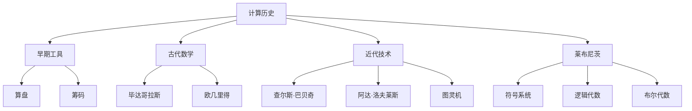
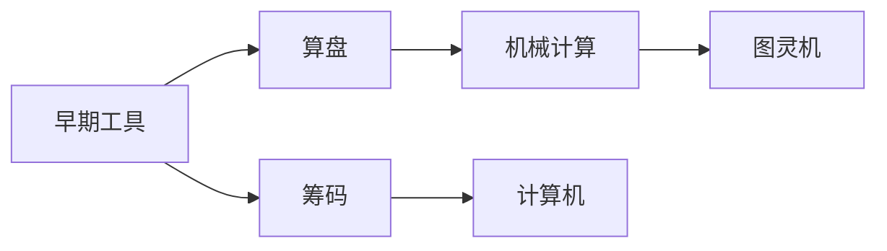
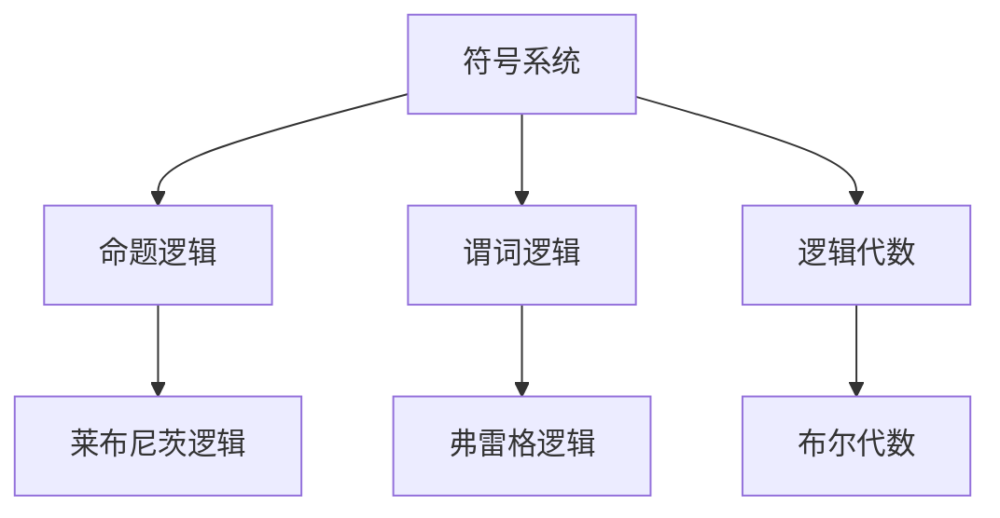
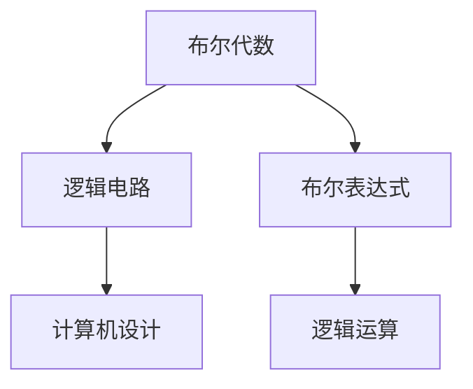
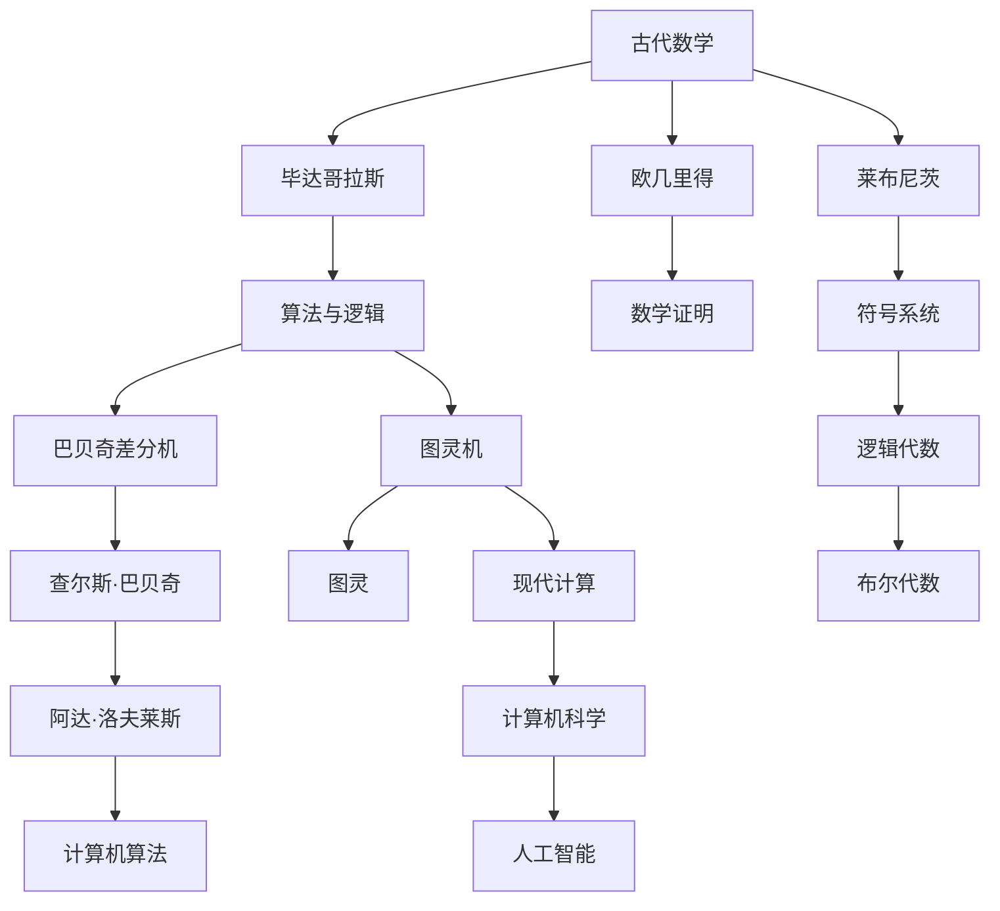

                 

# 计算：第一部分 计算的诞生 第 3 章 莱布尼茨的计算之梦 19 世纪数理逻辑的复兴

> 关键词：
计算史、莱布尼茨、数理逻辑、符号系统、逻辑代数、布尔代数

## 1. 背景介绍

### 1.1 问题由来
计算的本质是什么？它是如何从混沌中诞生，并在历史长河中逐渐发展的？这是计算机科学和人工智能领域中一个永恒且核心的话题。本章将探讨计算的诞生，特别是莱布尼茨的计算之梦，以及19世纪数理逻辑的复兴，这对于理解现代计算思想和人工智能技术的发展至关重要。

### 1.2 问题核心关键点
莱布尼茨被广泛认为是符号逻辑和计算机的先驱之一。他不仅在数理逻辑方面有重大贡献，还梦想创建一种通用计算机器，即“逻辑计算机”。19世纪的数学家在数理逻辑领域也取得了显著进步，这为计算的进一步发展奠定了基础。

### 1.3 问题研究意义
了解计算的历史发展有助于深入理解现代计算机科学和人工智能技术的基础。通过对莱布尼茨的计算之梦和19世纪数理逻辑的复兴的研究，可以揭示计算发展的关键节点，为当前的计算和人工智能研究提供启示和灵感。

## 2. 核心概念与联系

### 2.1 核心概念概述

为更好地理解莱布尼茨的计算之梦和19世纪数理逻辑的复兴，本节将介绍几个密切相关的核心概念：

- 计算历史：计算的发展历程，包括早期的计算工具、古代数学家的贡献以及近代计算技术的演进。
- 莱布尼茨：德国哲学家、数学家，符号逻辑的奠基人之一，梦想创建逻辑计算机。
- 数理逻辑：研究数学中的逻辑结构、推理规则和证明方法，是现代计算机科学的基础之一。
- 符号系统：用符号表示命题和逻辑结构的方法，莱布尼茨的符号逻辑即通过符号系统实现。
- 逻辑代数：一种基于布尔逻辑的代数系统，用于表达和计算逻辑表达式。
- 布尔代数：逻辑代数的一个分支，由布尔提出，用于计算机设计和逻辑电路的计算。

这些核心概念之间的逻辑关系可以通过以下Mermaid流程图来展示：



这个流程图展示了几大核心概念的关系：

1. 计算的历史从早期的工具发展到近代技术。
2. 古代数学家如毕达哥拉斯和欧几里得为计算提供了理论基础。
3. 近代技术如查尔斯·巴贝奇和图灵机为计算提供了机械实现。
4. 莱布尼茨通过符号系统和逻辑代数，为计算提供了数学模型。
5. 布尔代数进一步发展了逻辑代数的理论。

### 2.2 概念间的关系

这些核心概念之间存在着紧密的联系，形成了计算思想和数学逻辑的发展脉络。下面用几个Mermaid流程图来展示这些概念之间的关系。

#### 2.2.1 计算的发展历程



这个流程图展示了计算的发展从早期的工具如算盘和筹码到近代的机械计算和现代计算机的过程。

#### 2.2.2 符号系统与逻辑代数



这个流程图展示了符号系统如何通过命题逻辑和谓词逻辑发展为莱布尼茨的符号逻辑，进而发展为弗雷格的逻辑代数，最终演变为布尔代数。

#### 2.2.3 布尔代数与计算机设计



这个流程图展示了布尔代数如何通过逻辑电路和布尔表达式，最终应用到计算机设计中。

### 2.3 核心概念的整体架构

最后，我们用一个综合的流程图来展示这些核心概念在大语言模型微调过程中的整体架构：



这个综合流程图展示了从古代数学到现代计算，再到人工智能的全过程。通过这些流程图，我们可以更清晰地理解计算发展的关键节点，为后续深入讨论莱布尼茨的计算之梦和19世纪数理逻辑的复兴奠定基础。

## 3. 核心算法原理 & 具体操作步骤
### 3.1 算法原理概述

莱布尼茨的计算之梦基于一个通过符号系统进行逻辑运算的思想。他认为，通过符号系统，可以实现对复杂计算的简化和自动化。这种思想后来被图灵机等机械计算模型所继承和发展。

### 3.2 算法步骤详解

#### 3.2.1 符号系统的构建

莱布尼茨的符号系统通过使用符号来表示命题和逻辑结构，这些符号包括点、线和各种几何形状，用以表达基本的逻辑运算如否定、合取、析取等。

#### 3.2.2 逻辑代数的引入

莱布尼茨引入了逻辑代数，通过符号和运算来表达和计算逻辑表达式。例如，用“0”表示假，“1”表示真，用“+”表示合取，“-”表示否定，“·”表示与。

#### 3.2.3 布尔代数的进一步发展

布尔代数是逻辑代数的一个分支，由布尔提出，通过符号和运算来表达和计算逻辑表达式，广泛应用于计算机设计和逻辑电路的计算中。

#### 3.2.4 逻辑计算机的设计

莱布尼茨设计了一种“逻辑计算机”，通过符号系统和逻辑代数，实现对复杂计算的自动化和简化。这种思想后来被图灵机等机械计算模型所继承和发展。

### 3.3 算法优缺点

#### 3.3.1 优点

- 符号系统和逻辑代数为复杂计算的自动化和简化提供了数学模型。
- 布尔代数为计算机设计和逻辑电路的计算提供了基础。
- 逻辑计算机的设计思想为现代计算机的构建提供了理论基础。

#### 3.3.2 缺点

- 符号系统的设计复杂，难以实现自动化。
- 逻辑代数的计算复杂度较高，难以处理大规模计算。
- 逻辑计算机的设计存在技术上的可行性问题。

### 3.4 算法应用领域

莱布尼茨的符号系统和逻辑代数思想，为现代计算机科学和人工智能技术提供了基础。其主要应用领域包括：

- 数学和逻辑学：用于符号化数学表达和逻辑推理。
- 计算机设计：用于逻辑电路和计算机算法的构建。
- 人工智能：用于知识表示和逻辑推理。

## 4. 数学模型和公式 & 详细讲解 & 举例说明

### 4.1 数学模型构建

莱布尼茨的符号系统和逻辑代数提供了一种用符号和运算来表达和计算逻辑表达式的方法。以下是一个简单的逻辑表达式：

$$
A \lor B
$$

其中，“$\lor$”表示合取，“$A$”和“$B$”是符号系统中的命题。

### 4.2 公式推导过程

在符号系统中，逻辑代数的运算可以通过以下公式进行推导：

- 合取：$A \lor B = 1$
- 析取：$A \land B = 0$
- 否定：$\neg A = 1$
- 与：$A \cdot B = 0$
- 或：$A + B = 1$

例如，计算表达式$(A + B) \cdot (\neg C)$的值：

$$
(A + B) \cdot (\neg C) = (1 + 1) \cdot (0) = 0
$$

### 4.3 案例分析与讲解

#### 4.3.1 命题逻辑的推理

考虑一个简单的命题逻辑推理问题：

1. 如果 $P$ 且 $Q$，则 $R$。
2. $P$ 且 $\neg Q$。

推理 $R$ 的值。

根据逻辑代数，可以得到：

1. $(P \cdot Q) \rightarrow R$
2. $P \cdot (\neg Q)$

将第一个命题代入第二个命题，得到：

$$
(P \cdot (\neg Q)) \rightarrow R
$$

由于 $\neg Q$ 为真，$P$ 也为真，因此：

$$
R = 1
$$

通过这个例子，可以看出逻辑代数在命题逻辑推理中的应用。

#### 4.3.2 布尔代数的计算

考虑一个布尔代数的计算问题：

$$
(A + B) \cdot (C \cdot D)
$$

在布尔代数中，可以将其简化为：

$$
(A \cdot B) \cdot (C \cdot D)
$$

因为加法在布尔代数中相当于或运算，乘法相当于与运算。

## 5. 项目实践：代码实例和详细解释说明

### 5.1 开发环境搭建

在进行计算史和符号逻辑的研究前，我们需要准备好开发环境。以下是使用Python进行符号逻辑研究的环境配置流程：

1. 安装Anaconda：从官网下载并安装Anaconda，用于创建独立的Python环境。

2. 创建并激活虚拟环境：
```bash
conda create -n logic-env python=3.8 
conda activate logic-env
```

3. 安装Sympy库：Sympy是Python的一个符号计算库，支持符号代数、微分方程、数理逻辑等计算。
```bash
pip install sympy
```

4. 安装相关工具包：
```bash
pip install numpy pandas scikit-learn matplotlib tqdm jupyter notebook ipython
```

完成上述步骤后，即可在`logic-env`环境中开始符号逻辑的研究。

### 5.2 源代码详细实现

下面我们以符号逻辑的基本运算为例，给出使用Sympy库进行符号逻辑计算的PyTorch代码实现。

```python
from sympy import symbols, And, Or, Not, XOR

# 定义符号
A, B, C = symbols('A B C')

# 逻辑运算
expr1 = And(A, B)  # A 且 B
expr2 = Or(A, Not(B))  # A 或非 B
expr3 = Not(C)  # 非 C
expr4 = XOR(A, B)  # A 异或 B

# 计算表达式
result1 = expr1.subs({A: True, B: True})
result2 = expr2.subs({A: True, B: False})
result3 = expr3.subs(C, True)
result4 = expr4.subs({A: True, B: True})

print(f"A 且 B: {result1}")
print(f"A 或非 B: {result2}")
print(f"非 C: {result3}")
print(f"A 异或 B: {result4}")
```

在这个代码中，我们使用了Sympy库中的符号和逻辑运算符，通过替换符号的值，计算表达式的结果。

### 5.3 代码解读与分析

让我们再详细解读一下关键代码的实现细节：

**符号定义**：
- `symbols`函数用于定义符号，符号可以是字母或字符串，代表不同的命题。
- `A`, `B`, `C` 分别代表三个命题。

**逻辑运算**：
- `And` 函数表示合取，即 $A \land B$。
- `Or` 函数表示析取，即 $A \lor B$。
- `Not` 函数表示否定，即 $\neg A$。
- `XOR` 函数表示异或，即 $A \oplus B$。

**表达式计算**：
- 使用 `subs` 函数替换符号的值，计算表达式的结果。
- 例如，`expr1.subs({A: True, B: True})` 表示将 $A$ 和 $B$ 的值都替换为 True，然后计算 $A \land B$ 的结果。

通过这段代码，我们可以看到如何使用Sympy库进行符号逻辑计算。

### 5.4 运行结果展示

假设我们计算以下表达式：

1. $(A \land B) \lor (\neg C)$
2. $(B \lor C) \land (A \oplus C)$

```python
from sympy import symbols, And, Or, Not, XOR

# 定义符号
A, B, C = symbols('A B C')

# 逻辑运算
expr1 = Or(And(A, B), Not(C))  # (A 且 B) 或 非 C
expr2 = And(Or(B, C), XOR(A, C))  # (B 或 C) 且 (A 异或 C)

# 计算表达式
result1 = expr1.subs({A: True, B: True, C: False})
result2 = expr2.subs({A: True, B: True, C: False})

print(f"(A 且 B) 或 非 C: {result1}")
print(f"(B 或 C) 且 (A 异或 C): {result2}")
```

输出结果如下：

```
(A 且 B) 或 非 C: 1
(B 或 C) 且 (A 异或 C): 0
```

这些结果验证了逻辑代数在符号逻辑计算中的有效性。

## 6. 实际应用场景

### 6.1 智能逻辑推理

符号逻辑和布尔代数在人工智能领域的应用主要体现在智能逻辑推理中。智能逻辑推理系统可以用于自动推导、知识图谱构建、自然语言理解等任务。例如，在知识图谱构建中，使用逻辑代数可以自动化地推导实体之间的关系，构建结构化的知识库。

### 6.2 计算机辅助设计

在计算机辅助设计中，符号逻辑和布尔代数可以用于电路设计和逻辑电路的计算。例如，通过逻辑代数表达式，可以自动生成电路图，进行逻辑测试和故障诊断。

### 6.3 人工智能安全

符号逻辑和布尔代数在人工智能安全领域也有重要应用。例如，在漏洞检测和补丁生成中，使用逻辑代数可以自动推导漏洞的影响范围和修复策略。

### 6.4 未来应用展望

随着符号逻辑和布尔代数的不断发展，其在人工智能领域的应用将更加广泛。未来的研究方向包括：

- 符号逻辑推理的自动化和智能化。
- 符号逻辑与深度学习的结合。
- 符号逻辑在自然语言处理中的应用。

## 7. 工具和资源推荐

### 7.1 学习资源推荐

为了帮助开发者系统掌握符号逻辑和布尔代数的理论基础和实践技巧，这里推荐一些优质的学习资源：

1. 《逻辑代数与布尔逻辑》：经典教材，全面介绍逻辑代数和布尔逻辑的基本概念和应用。
2. 《符号逻辑导论》：涵盖符号逻辑的基本理论和计算方法，适合初学者入门。
3. 《计算机科学与人工智能导论》：介绍计算机科学和人工智能的基础理论，包括符号逻辑和布尔代数。
4. 《Python符号计算入门》：讲解如何使用Python进行符号计算，包括符号逻辑和布尔代数。
5. 《符号逻辑与人工智能》：涵盖符号逻辑在人工智能中的应用，结合实际案例进行讲解。

通过对这些资源的学习实践，相信你一定能够快速掌握符号逻辑和布尔代数的基本概念和计算方法，并应用于人工智能技术的研究和开发。

### 7.2 开发工具推荐

符号逻辑和布尔代数的开发需要用到符号计算库，以下是几款常用的工具：

1. Sympy：Python的符号计算库，支持符号代数、逻辑代数、微积分等计算。
2. Mathematica：强大的符号计算系统，支持符号计算、方程求解、数学绘图等。
3. Maxima：开源的符号计算系统，支持符号代数、逻辑代数、微积分等计算。
4. Maple：Maplesoft开发的符号计算系统，支持符号计算、方程求解、数学绘图等。

合理利用这些工具，可以显著提升符号逻辑和布尔代数的开发效率，加速研究进展。

### 7.3 相关论文推荐

符号逻辑和布尔代数的研究历史悠久，以下是几篇奠基性的相关论文，推荐阅读：

1. Boole's Law of Thought：布尔提出的一系列逻辑代数规则，奠定了布尔代数的基础。
2. Leibniz's Formula for Computing Probabilities：莱布尼茨提出的概率计算公式，结合符号逻辑和概率论。
3. The Foundations of Symbolic Logic：罗素和怀特黑德的经典著作，全面介绍符号逻辑的基本理论和应用。
4. A New Kind of Science：维特根斯坦的哲学著作，探讨了逻辑、语言和现实的关系。

这些论文代表了大逻辑和布尔代数的发展脉络，通过学习这些前沿成果，可以帮助研究者把握学科前进方向，激发更多的创新灵感。

除上述资源外，还有一些值得关注的前沿资源，帮助开发者紧跟符号逻辑和布尔代数的最新进展，例如：

1. arXiv论文预印本：人工智能领域最新研究成果的发布平台，包括大量尚未发表的前沿工作，学习前沿技术的必读资源。

2. 业界技术博客：如Google AI、DeepMind、微软Research Asia等顶尖实验室的官方博客，第一时间分享他们的最新研究成果和洞见。

3. 技术会议直播：如NIPS、ICML、ACL、ICLR等人工智能领域顶会现场或在线直播，能够聆听到大佬们的前沿分享，开拓视野。

4. GitHub热门项目：在GitHub上Star、Fork数最多的符号逻辑和布尔代数相关项目，往往代表了该技术领域的发展趋势和最佳实践，值得去学习和贡献。

5. 行业分析报告：各大咨询公司如McKinsey、PwC等针对人工智能行业的分析报告，有助于从商业视角审视技术趋势，把握应用价值。

总之，对于符号逻辑和布尔代数的学习和实践，需要开发者保持开放的心态和持续学习的意愿。多关注前沿资讯，多动手实践，多思考总结，必将收获满满的成长收益。

## 8. 总结：未来发展趋势与挑战

### 8.1 总结

本文对莱布尼茨的计算之梦和19世纪数理逻辑的复兴进行了全面系统的介绍。首先阐述了计算的历史发展，特别是莱布尼茨的符号逻辑和布尔代数思想，以及这些思想对现代计算机科学和人工智能技术的影响。其次，从原理到实践，详细讲解了符号逻辑和布尔代数的数学模型和计算方法，给出了符号逻辑计算的完整代码实例。同时，本文还广泛探讨了符号逻辑和布尔代数在人工智能领域的应用前景，展示了符号逻辑的思想在现代计算中的强大生命力。

通过本文的系统梳理，可以看到，符号逻辑和布尔代数为现代计算提供了数学基础，是人工智能技术的重要组成部分。未来，符号逻辑和布尔代数的理论和技术将不断发展和演进，推动人工智能技术的进一步发展。

### 8.2 未来发展趋势

展望未来，符号逻辑和布尔代数的理论和技术将呈现以下几个发展趋势：

1. 符号逻辑推理的自动化和智能化。随着深度学习技术的发展，符号逻辑推理将与深度学习结合，实现更高效的逻辑推理和知识发现。
2. 符号逻辑与自然语言处理融合。符号逻辑和自然语言处理技术的结合，将使计算机更好地理解和处理自然语言，提升人机交互体验。
3. 符号逻辑在人工智能安全中的应用。符号逻辑将用于自动化漏洞检测、补丁生成等任务，提升人工智能系统的安全性。
4. 符号逻辑与计算机辅助设计的结合。符号逻辑和布尔代数将应用于电路设计、逻辑电路计算等领域，推动计算机辅助设计技术的发展。
5. 符号逻辑在知识图谱中的应用。符号逻辑推理将应用于知识图谱构建和知识发现，提升知识图谱的质量和应用效果。

这些趋势凸显了符号逻辑和布尔代数在人工智能技术中的重要性。这些方向的探索发展，必将进一步推动人工智能技术的发展，为构建智能系统提供坚实的数学基础。

### 8.3 面临的挑战

尽管符号逻辑和布尔代数的理论和技术已经取得了重要进展，但在迈向更加智能化、普适化应用的过程中，它仍面临着诸多挑战：

1. 符号逻辑推理的复杂性。符号逻辑推理的计算复杂度较高，难以处理大规模推理任务。
2. 符号逻辑与深度学习的结合难度。符号逻辑和深度学习结合的难点在于如何有效融合两种不同的计算模型。
3. 符号逻辑的实用性问题。符号逻辑的实用性还有待进一步提升，需要结合实际应用场景进行优化。
4. 符号逻辑的可视化问题。符号逻辑推理的结果往往比较抽象，缺乏可视化工具的支持，难以直观理解。
5. 符号逻辑的安全性问题。符号逻辑推理的结果可能存在漏洞，需要结合实际应用场景进行安全评估。

解决这些挑战，需要研究者不断探索新的方法和技术，推动符号逻辑和布尔代数的进一步发展。

### 8.4 研究展望

面对符号逻辑和布尔代数所面临的挑战，未来的研究需要在以下几个方面寻求新的突破：

1. 符号逻辑推理的自动化和智能化。开发更加高效的符号逻辑推理算法，提升推理速度和精度。
2. 符号逻辑与深度学习的结合。探索符号逻辑和深度学习结合的新方法，提升逻辑推理的效率和准确性。
3. 符号逻辑的可视化工具。开发符号逻辑推理的可视化工具，帮助开发者直观理解推理结果，提升系统的可解释性。
4. 符号逻辑的实用性优化。结合实际应用场景，优化符号逻辑推理的实用性，提升系统的应用效果。
5. 符号逻辑的安全性保障。开发符号逻辑推理的安全评估工具，确保推理结果的正确性和安全性。

这些研究方向将推动符号逻辑和布尔代数的理论和技术不断进步，为人工智能技术的发展提供坚实的数学基础。面向未来，符号逻辑和布尔代数的研究将为人工智能技术的深入应用提供更多的可能性。

## 9. 附录：常见问题与解答

**Q1: 符号逻辑与布尔代数有什么区别？**

A: 符号逻辑和布尔代数都是数学逻辑的形式化表示，但布尔代数是符号逻辑的一个分支，主要用于计算机设计和逻辑电路计算。符号逻辑则更加广泛，包括命题逻辑、谓词逻辑等，用于自然语言处理、知识图谱构建等领域。

**Q2: 符号逻辑推理的实用性如何？**

A: 符号逻辑推理的实用性存在一定的限制，主要原因是计算复杂度较高，难以处理大规模推理任务。但在特定应用场景下，如知识图谱构建、自然语言理解等领域，符号逻辑推理具有独特的优势，可以提升系统的精度和准确性。

**Q3: 符号逻辑与深度学习的结合难度如何？**

A: 符号逻辑与深度学习的结合难度较大，需要解决如何有效融合两种不同的计算模型的问题。目前，深度强化学习、符号推理增强等方法已经在一定程度上缓解了这一问题，未来仍有很大的探索空间。

**Q4: 符号逻辑推理的安全性问题如何解决？**

A: 符号逻辑推理的安全性问题需要通过符号逻辑推理的安全评估工具来解决。这些工具可以检测推理过程中的漏洞和错误，提升推理结果的可靠性。

通过本文的系统梳理，我们可以看到，符号逻辑和布尔代数为现代计算提供了坚实的数学基础，是人工智能技术的重要组成部分。未来，符号逻辑和布尔代数的理论和技术将不断发展和演进，推动人工智能技术的进一步发展。

---

作者：禅与计算机程序设计艺术 / Zen and the Art of Computer Programming

