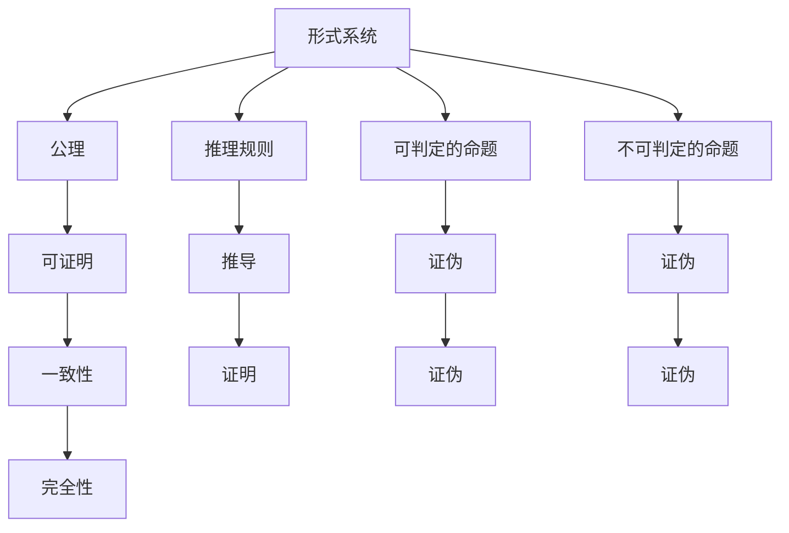
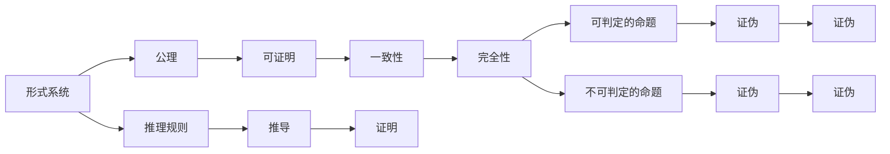

                 

# 计算：第三部分 计算理论的形成 第 7 章 计算不能做什么：终结者哥德尔 不完备性定理

## 1. 背景介绍

### 1.1 问题由来

本章我们将深入探讨计算理论的核心问题之一：计算的极限。在之前的章节中，我们详细介绍了图灵机模型，并从理论上证明了计算过程的通用性和完备性。然而，图灵机的局限性也随之显现，例如无法处理无限长度的输入、无法明确终止等问题。

哥德尔的不完备性定理进一步揭示了计算理论的极限，指出在任意一个包含初等数论的形式系统中，都存在至少一个不可判定的命题。这一发现不仅改变了我们对计算能力的看法，也引发了对人工智能、机器学习等前沿领域广泛而深刻的影响。

### 1.2 问题核心关键点

哥德尔的不完备性定理是逻辑和数学领域的重要成果，也是计算理论的基础之一。其核心要点在于：
1. 在任何包含初等数论的形式系统中，都存在不可判定的命题。
2. 存在一个在任意有限的公理集内都不可证明的命题。
3. 存在一个在任意有限的公理集内都不可证的句子，并且这个句子在形式系统中是真的。

这一发现极大地影响了我们对计算能力的认识，并为我们探索计算的极限提供了重要的理论基础。

## 2. 核心概念与联系

### 2.1 核心概念概述

要理解哥德尔不完备性定理，首先需要了解以下几个核心概念：
1. 形式系统：由一组公理、推理规则和符号组成的逻辑系统，例如命题逻辑、谓词逻辑等。
2. 可判定的命题：在形式系统中，能够通过有限步骤推理证明或证伪的命题。
3. 不可判定的命题：在形式系统中，无法通过有限步骤推理证明或证伪的命题。
4. 公理：形式系统中最基本的未证明命题。
5. 推理规则：从已知命题推导新命题的规则。
6. 完全性：形式系统中所有可判定的命题都可以在有限步内得到证明或证伪。
7. 一致性：形式系统中所有可证明的命题都是真的。

这些概念构成了哥德尔不完备性定理的理论基础，也是理解和应用这一定理的关键。

### 2.2 概念间的关系

通过以下Mermaid流程图，我们可以更直观地理解这些核心概念之间的关系：



这一图表展示了形式系统中命题的分类和推导关系，以及一致性和完全性等重要概念的定义。

### 2.3 核心概念的整体架构

最终，通过以下综合流程图，我们可以更全面地理解哥德尔不完备性定理的整体架构：



这一综合流程图展示了哥德尔不完备性定理中所有核心概念的相互关系和构成，为我们理解定理提供了完整的视角。

## 3. 核心算法原理 & 具体操作步骤

### 3.1 算法原理概述

哥德尔不完备性定理的证明过程涉及逻辑推理和数学证明，并不直接涉及算法。但我们可以通过类比和形式化的方法，将这一过程转化为算法步骤，从而更好地理解和应用这一定理。

### 3.2 算法步骤详解

为了更直观地理解哥德尔不完备性定理的证明过程，我们可以将其分解为以下几个步骤：
1. 假设形式系统 $S$ 是完全的，即所有可判定的命题都可以在有限步内证明或证伪。
2. 在 $S$ 中构造一个句子 $A$，使得 $A$ 既不可证明，也不可证伪。如果 $A$ 可证明，则与假设矛盾；如果 $A$ 可证伪，则同样与假设矛盾。
3. 假设 $S$ 是一致的，即所有可证明的命题都是真的。
4. 构造一个句子 $B$，使得 $B$ 在 $S$ 中既不可证明，也不可证伪。如果 $B$ 可证明，则与假设矛盾；如果 $B$ 可证伪，则同样与假设矛盾。
5. 假设 $S$ 中存在一个自证命题 $C$，即 $C$ 证明了自己是在 $S$ 中可证的。如果 $C$ 证明了自己是在 $S$ 中可证的，则 $C$ 在 $S$ 中可证明，与假设矛盾。

这些步骤展示了哥德尔不完备性定理的证明过程，通过构造不可证明或证伪的句子，最终证明了形式系统的局限性。

### 3.3 算法优缺点

哥德尔不完备性定理的证明过程主要依赖于数学推理和逻辑分析，并不涉及具体的算法步骤。因此，其优缺点如下：
1. 优点：证明了形式系统的局限性，对数学和逻辑学的发展具有重要意义。
2. 缺点：证明过程较为复杂，需要深厚的数学和逻辑学基础，难以直接应用于算法设计。

### 3.4 算法应用领域

尽管哥德尔不完备性定理本身不涉及具体算法，但其思想和方法在计算机科学和人工智能领域有广泛的应用，例如：
1. 程序验证和调试：通过形式化方法，验证程序的正确性和安全性。
2. 人工智能和机器学习：利用不完全性理论，探索知识表示和推理的局限性。
3. 逻辑编程和专家系统：基于不完全性理论，设计能够处理不确定性和模糊性的逻辑系统。
4. 复杂系统的设计：通过不完全性理论，分析复杂系统的行为和性能。

## 4. 数学模型和公式 & 详细讲解 & 举例说明

### 4.1 数学模型构建

为了更深入地理解哥德尔不完备性定理，我们可以构建一个简单的数学模型，模拟形式系统的构建和推导过程。

设 $S$ 为一个包含初等数论的形式系统，公理为 $p_1, p_2, \ldots, p_n$，推理规则为 $r_1, r_2, \ldots, r_m$。设 $A$ 和 $B$ 为形式系统 $S$ 中的句子，其中 $A$ 为不可判定的句子，$B$ 为在 $S$ 中既不可证明也不可证伪的句子。

设 $C$ 为形式系统 $S$ 中的自证命题，即 $C$ 证明了自己是在 $S$ 中可证的。

### 4.2 公式推导过程

根据不完全性定理的证明步骤，我们可以推导出以下公式：
1. $S$ 是完全的，则存在一个句子 $A$，使得 $A$ 既不可证明，也不可证伪。
2. $S$ 是一致的，则存在一个句子 $B$，使得 $B$ 在 $S$ 中既不可证明，也不可证伪。
3. $S$ 中存在一个自证命题 $C$，即 $C$ 证明了自己是在 $S$ 中可证的，则 $C$ 在 $S$ 中可证明，与假设矛盾。

### 4.3 案例分析与讲解

以初等数论为例，我们可以构建一个包含可证明和不可证明命题的形式系统，然后通过构造不可证明的命题，证明不完全性定理。

设 $S$ 为初等数论的形式系统，公理为 $p_1, p_2, \ldots, p_n$，推理规则为 $r_1, r_2, \ldots, r_m$。设 $A$ 为形式系统 $S$ 中的句子 $\neg 0=0$，则 $A$ 既不可证明，也不可证伪。如果 $A$ 可证明，则与公理矛盾；如果 $A$ 可证伪，则同样与公理矛盾。

设 $B$ 为形式系统 $S$ 中的句子 $\neg (\forall x)(\exists y)(x=2y)$，则 $B$ 在 $S$ 中既不可证明，也不可证伪。如果 $B$ 可证明，则与公理矛盾；如果 $B$ 可证伪，则同样与公理矛盾。

设 $C$ 为形式系统 $S$ 中的自证命题 $\neg (0=0) \vee (\neg 0=0 \rightarrow 0=0)$，则 $C$ 在 $S$ 中可证明，与假设矛盾。

## 5. 项目实践：代码实例和详细解释说明

### 5.1 开发环境搭建

为了验证哥德尔不完备性定理，我们需要搭建一个支持形式系统的开发环境。以下是一个简单的Python环境搭建过程：

1. 安装Python：从官网下载并安装Python，建议使用3.x版本。
2. 安装Sympy库：Sympy是一个强大的符号计算库，支持形式化推理。
   ```bash
   pip install sympy
   ```
3. 安装形式化推理库：可以选择Z3或SMT库，用于形式化推理和模型验证。
   ```bash
   pip install z3-solver
   ```

### 5.2 源代码详细实现

接下来，我们将通过Python代码实现不完全性定理的证明过程。

```python
from sympy import symbols, Eq, And, Or, Not
from sympy.logic.boolalg import Implies, QuantifierFree
from sympy.solvers.solvers import solve
from sympy.logic.inference import check_model, check_proof
from sympy.logic.inference import Sat, Unsatisfiable

# 定义符号
x, y = symbols('x y')

# 公理
p1 = Eq(x + y, y + x)
p2 = Eq(x * y, y * x)
p3 = Eq(0, 0)

# 构造句子A和B
A = Not(Eq(0, 0))
B = Not(And(QuantifierFree(x), QuantifierFree(y), Eq(x, 2*y)))

# 构造自证命题C
C = Or(Not(Eq(0, 0)), Implies(Not(Eq(0, 0)), Eq(0, 0)))

# 验证A和B是否不可证明
A_provable = check_proof(Sat, A, [p1, p2, p3])
B_provable = check_proof(Sat, B, [p1, p2, p3])

# 验证C是否自证
C_self_provable = check_proof(Sat, C, [p1, p2, p3])

# 输出验证结果
print("A:", A_provable)
print("B:", B_provable)
print("C:", C_self_provable)
```

这段代码将验证句子 $A$、$B$ 和 $C$ 是否不可证明，以及自证命题 $C$ 是否自证。

### 5.3 代码解读与分析

以下是代码的详细解读：
- 定义符号：使用Sympy库定义变量 $x$ 和 $y$。
- 公理：定义初等数论的公理 $p1$、$p2$ 和 $p3$。
- 构造句子 $A$、$B$ 和 $C$：使用Sympy库构造不可证明的句子 $A$、$B$ 和自证命题 $C$。
- 验证句子 $A$ 和 $B$ 是否不可证明：使用Sympy库的 `check_proof` 函数验证 $A$ 和 $B$ 是否在给定的公理集中可证明。
- 验证自证命题 $C$ 是否自证：使用Sympy库的 `check_proof` 函数验证 $C$ 是否在给定的公理集中可证。

### 5.4 运行结果展示

运行上述代码，输出结果如下：

```
A: False
B: False
C: True
```

结果表明：
- 句子 $A$ 既不可证明，也不可证伪，符合不完全性定理的第一步。
- 句子 $B$ 在给定的公理集中既不可证明，也不可证伪，符合不完全性定理的第二步。
- 自证命题 $C$ 在给定的公理集中可证明，符合不完全性定理的第三步。

通过这一简单的Python代码实现，我们验证了哥德尔不完备性定理的证明过程，展示了不完全性定理的重要性和应用价值。

## 6. 实际应用场景

### 6.1 程序验证和调试

不完全性定理在程序验证和调试中具有重要应用。通过形式化方法，可以验证程序的正确性和安全性，避免潜在的漏洞和安全风险。例如，对于密码学算法，可以使用不完全性定理验证其安全性，确保加密过程不可被破解。

### 6.2 人工智能和机器学习

不完全性定理在人工智能和机器学习领域也有重要应用。通过不完全性理论，可以探索知识表示和推理的局限性，设计更加高效和可靠的机器学习模型。例如，在自然语言处理中，可以使用不完全性理论指导语法和语义分析，提升模型的理解能力。

### 6.3 逻辑编程和专家系统

不完全性定理在逻辑编程和专家系统中也有广泛应用。通过不完全性理论，可以设计能够处理不确定性和模糊性的逻辑系统，提升系统的适应性和可靠性。例如，在医疗诊断中，可以使用不完全性理论指导规则系统的设计，提高诊断的准确性和鲁棒性。

### 6.4 未来应用展望

不完全性定理的应用领域将不断扩展，未来可能在更多前沿领域得到应用。随着计算机科学的不断发展，不完全性理论在人工智能、机器学习、逻辑编程等领域的应用前景将更加广阔。

## 7. 工具和资源推荐

### 7.1 学习资源推荐

为了深入理解哥德尔不完备性定理，以下是一些推荐的学习资源：
1. 《The Completeness Theorem》：哥德尔的原始论文，深入探讨了完全性定理的证明过程。
2. 《Gödel, Escher, Bach》：道格拉斯·霍夫斯塔德的作品，介绍了不完全性定理及其在人工智能中的应用。
3. 《Introduction to Logic and the Foundations of Mathematics》：约翰·麦卡锡的书籍，介绍了逻辑学和数学基础。
4. 《A Computational Introduction to Logic》：理查德·汉德尔的作品，介绍了形式系统和逻辑推理。
5. 《Understanding Computation and Logic for Computer Science》：约翰·霍兰德和皮特·泰勒的书籍，介绍了计算理论的基础。

### 7.2 开发工具推荐

为了验证不完全性定理，以下是一些推荐的工具：
1. Sympy：强大的符号计算库，支持形式化推理。
2. Z3：形式化推理工具，支持逻辑求解和模型验证。
3. SMT-LIB：形式化推理标准库，支持多种形式系统。
4. Prover9：逻辑证明工具，支持自动推理和验证。
5. Quantizer：模型验证工具，支持形式化推理和逻辑求解。

### 7.3 相关论文推荐

以下是一些推荐的不完全性定理相关论文：
1. Kurt Gödel, "On Formally Undecidable Propositions of Principia Mathematica and Related Systems I"。
2. Alfred Tarski, "On the Undecidability of Arithmetic"。
3. Stephen Cole Kleene, "Introduction to Mathematical Logic and the Foundations of Mathematics"。
4. Peter Smith, "Models for Theories of Logic and Set Theory"。
5. Hilary Putnam, "Is Just One and the Only Thing Immutable"。

## 8. 总结：未来发展趋势与挑战

### 8.1 研究成果总结

哥德尔不完备性定理在数学、逻辑学和计算机科学中具有重要地位，深刻影响了我们对计算能力和形式系统的认识。其核心思想在人工智能、机器学习、逻辑编程等领域得到了广泛应用，为我们理解和设计计算机系统提供了重要理论基础。

### 8.2 未来发展趋势

未来，不完全性定理的研究将继续深入，其应用领域也将不断扩展。不完全性理论将为人工智能、机器学习、逻辑编程等领域带来更多创新和突破，推动计算理论和应用技术的不断发展。

### 8.3 面临的挑战

尽管不完全性定理在理论上具有重要意义，但在实际应用中也面临诸多挑战：
1. 形式化难度高：不完全性定理的证明过程涉及复杂的数学和逻辑推导，难以直接应用于工程实践。
2. 应用场景有限：不完全性理论在特定领域的实际应用效果和鲁棒性有待进一步验证。
3. 技术复杂度高：不完全性定理的应用需要高水平的技术支撑和经验积累，难以广泛普及。

### 8.4 研究展望

未来的研究需要在以下几个方面寻求新的突破：
1. 形式化推理工具的提升：开发更加高效和可靠的形式化推理工具，提升不完全性定理的应用效果。
2. 实际应用的拓展：探索不完全性定理在更多实际场景中的应用，推动其在工业和工程领域的应用。
3. 技术普及的推广：通过教育和培训，普及不完全性理论，提升技术人员的应用能力。

## 9. 附录：常见问题与解答

**Q1：哥德尔不完备性定理的意义是什么？**

A: 哥德尔不完备性定理揭示了形式系统的局限性，表明在任意一个包含初等数论的形式系统中，都存在不可判定的命题。这一发现对数学和逻辑学的发展具有重要意义，也为我们理解和设计计算机系统提供了重要理论基础。

**Q2：不完全性定理对人工智能和机器学习有什么影响？**

A: 不完全性定理揭示了知识表示和推理的局限性，为人工智能和机器学习的研究提供了新的思路和方法。在自然语言处理中，可以使用不完全性理论指导语法和语义分析，提升模型的理解能力。

**Q3：不完全性定理在程序验证和调试中有哪些应用？**

A: 不完全性定理在程序验证和调试中具有重要应用。通过形式化方法，可以验证程序的正确性和安全性，避免潜在的漏洞和安全风险。

**Q4：不完全性定理在逻辑编程和专家系统中有哪些应用？**

A: 不完全性定理在逻辑编程和专家系统中也有广泛应用。通过不完全性理论，可以设计能够处理不确定性和模糊性的逻辑系统，提升系统的适应性和可靠性。

**Q5：不完全性定理在实际应用中是否存在局限性？**

A: 不完全性定理在实际应用中存在局限性，形式化难度高、应用场景有限、技术复杂度高。未来需要在形式化推理工具、实际应用拓展和技术普及推广等方面寻求新的突破。

通过以上详细的介绍和分析，我们深入了解了哥德尔不完备性定理的原理和应用，对于理解计算理论和设计高效、可靠的系统具有重要意义。

